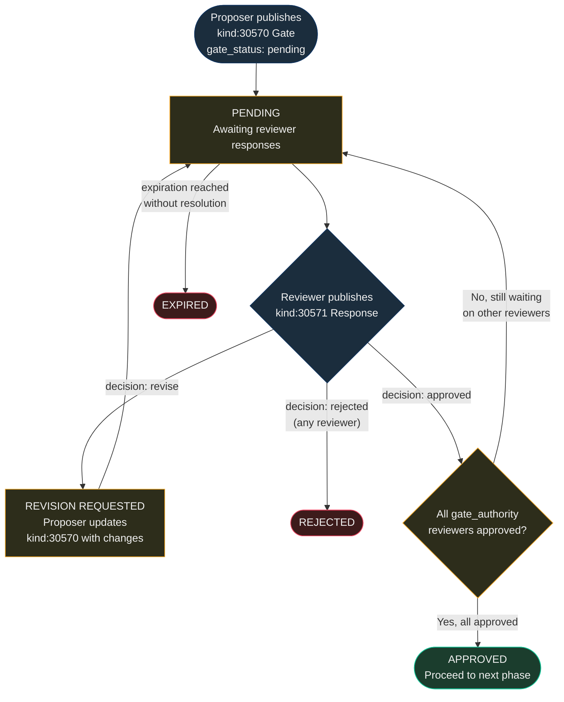

NIP-APPROVAL
============

Multi-Party Approval Gates
----------------------------

`draft` `optional`

Two addressable event kinds for gating workflow progression on Nostr — a proposer publishes a gate requiring sign-off, and one or more designated reviewers respond with approval, rejection, or revision requests.

> **Design principle:** Approval gates are a coordination primitive. They communicate that sign-off is required and record decisions — they do not enforce access control. Enforcement is the responsibility of the consuming application.

> **Standalone usability:** This NIP works independently on any Nostr application. Within the [TROTT protocol](https://github.com/forgesworn/nip-drafts) (v0.9), it is pattern P1 in TROTT-00: Core Patterns. TROTT composes approval gates with task lifecycle states, domain-specific inspection requirements, and operator integration — but adoption of TROTT is not required.

## Motivation

Nostr has events for publishing content, sending messages, and making payments, but no standard mechanism for **gating progress on a decision**. Many real-world workflows require explicit sign-off before the next step can proceed:

- **Pull request reviews** — a maintainer must approve before merging
- **Content moderation** — an editor must approve before publishing
- **Grant applications** — a committee must approve before funding
- **Procurement** — a budget holder must approve before purchasing
- **Inspections** — a qualified inspector must sign off before work continues

Without a standard, every application invents its own approval scheme with incompatible tag conventions. NIP-APPROVAL provides a minimal, composable primitive that any Nostr application can adopt for structured decision-making.

## Relationship to Existing NIPs

- **NIP-25 (Reactions):** Reactions express lightweight sentiment (`+`/`-`) with no named reviewer set, no quorum or threshold semantics, no revision loop, and no deadline enforcement. A reaction does not encode who is required to approve; approval gates name the required reviewers upfront and track structured decisions (approved, rejected, revision requested) with mandatory reasoning. A `+` reaction from a designated pubkey could approximate approval, but reactions lack: (a) structured decision values (approved/rejected/revise), (b) mandatory reasoning for rejections, (c) one-response-per-reviewer addressable semantics preventing duplicate votes, and (d) deadline enforcement via the gate's expiration tag. Approval gates provide accountability that lightweight reactions cannot.
- **NIP-22 (Comments):** Comments carry unstructured text with no decision semantics, no gate status tracking, and no distinction between "I have thoughts" and "I formally approve." Approval responses are structured decisions, not discussion.

## Kinds

| kind  | description        |
| ----- | ------------------ |
| 30570 | Approval Gate      |
| 30571 | Approval Response  |

Both kinds are addressable events (NIP-01). The `d` tag format ensures each event occupies a unique slot, allowing updates via republication.

---

## Approval Gate (`kind:30570`)

Published by a proposer to create a gate requiring one or more reviewers to sign off. Addressable — the proposer can update the proposal before a final decision is recorded.

```json
{
    "kind": 30570,
    "pubkey": "<proposer-hex-pubkey>",
    "created_at": 1698765000,
    "tags": [
        ["d", "pr_review_42:gate:code_review"],
        ["t", "approval-gate"],
        ["gate_type", "review"],
        ["gate_authority", "<reviewer-hex-pubkey>"],
        ["gate_status", "pending"],
        ["expiration", "1699370000"]
    ],
    "content": "PR #42 ready for review. Implements NIP-APPROVAL event kinds.",
    "id": "<32-bytes lowercase hex>",
    "sig": "<64-bytes lowercase hex>"
}
```

Tags:

* `d` (REQUIRED): Format `<context_id>:gate:<sequence>`. Addressable event identifier.
* `t` (REQUIRED): Protocol family marker. MUST be `"approval-gate"`.
* `gate_type` (REQUIRED): Type of gate. One of `regulatory`, `inspection`, `approval`, `review`. These are RECOMMENDED values; applications MAY define additional gate types as needed.
* `gate_authority` (REQUIRED, one or more): Hex pubkey of a required reviewer. Multiple `gate_authority` tags indicate that all listed reviewers must respond (see Multi-Reviewer Gates below).
* `gate_status` (REQUIRED): MUST be `"pending"` on creation. The `gate_status` tag reflects the proposer's view of the gate state. Clients SHOULD derive the authoritative status from the set of kind 30571 responses rather than trusting the proposer's self-reported status. The proposer MAY update the gate event to reflect `approved` or `rejected` after responses are received, but this is informational; the responses are the source of truth.
* `expiration` (RECOMMENDED): Unix timestamp — deadline for the review. Clients SHOULD use NIP-40 `expiration` for relay-level enforcement.
* `p` (RECOMMENDED): Additional parties to notify.
* `gate_reference` (OPTIONAL): External reference (certificate number, permit ID, PR URL).
* `ref` (OPTIONAL): Cross-application external reference.
* `e` (OPTIONAL): Event ID of the event being gated (e.g. the content draft, the pull request event).

**Content:** Plain text or NIP-44 encrypted JSON describing what requires approval. May include specification references, inspection criteria, or submission details.

---

## Approval Response (`kind:30571`)

Published by a reviewer to approve, reject, or request revision of a gated proposal. The `d` tag format allows one response per reviewer per gate.

```json
{
    "kind": 30571,
    "pubkey": "<reviewer-hex-pubkey>",
    "created_at": 1698766000,
    "tags": [
        ["d", "pr_review_42:gate:code_review:response:<reviewer-hex-pubkey>"],
        ["t", "approval-response"],
        ["e", "<gate-event-id>", "wss://relay.example.com"],
        ["decision", "approved"],
        ["p", "<proposer-hex-pubkey>"],
        ["gate_reference", "REVIEW-2026-0042"]
    ],
    "content": "Code looks good. Approved with no changes required.",
    "id": "<32-bytes lowercase hex>",
    "sig": "<64-bytes lowercase hex>"
}
```

Tags:

* `d` (REQUIRED): Format `<gate_d_tag>:response:<reviewer_pubkey>`. One response per reviewer per gate.
* `t` (REQUIRED): Protocol family marker. MUST be `"approval-response"`.
* `e` (REQUIRED): Event ID of the Kind 30570 gate being responded to.
* `decision` (REQUIRED): The reviewer's decision. One of `"approved"`, `"rejected"`, or `"revise"`.
* `p` (RECOMMENDED): Proposer's pubkey (for notification).
* `gate_reference` (OPTIONAL): External reference (inspection report number, review ID).
* `revision_notes` (OPTIONAL): Feedback when decision is `"revise"`.

**Content:** Plain text or NIP-44 encrypted JSON with the reviewer's notes, findings, or conditions.

---

## Protocol Flow

1. **Gate:** Proposer publishes `kind:30570` with `gate_status: pending` and one or more `gate_authority` tags identifying the required reviewers.
2. **Review:** Each reviewer evaluates the proposal and publishes `kind:30571` with their `decision`.
3. **Revision (optional):** If a reviewer requests revision (`decision: revise`), the proposer updates their `kind:30570` event with revisions, and the reviewer evaluates again.
4. **Resolution:** The gate is resolved when all required reviewers have published a final `approved` or `rejected` response. If any reviewer rejects, the gate is rejected.

The following diagram illustrates the gate state transitions:



## Multi-Reviewer Gates

When multiple reviewers must approve, the proposer publishes multiple `gate_authority` tags on the Kind 30570 event. Each reviewer publishes their own Kind 30571 response. The gate is considered approved only when **all** listed authorities have published `approved` responses. If any reviewer publishes `rejected`, the gate is rejected. Clients SHOULD track the set of outstanding approvals and display progress.

## Use Cases Beyond TROTT

### Code Review & Merge Gating

A Nostr-native Git collaboration tool can use approval gates to model pull request reviews. The proposer creates a `kind:30570` gate referencing the PR, with the maintainer's pubkey as `gate_authority`. The maintainer reviews and publishes `kind:30571` with their decision. CI/CD systems can subscribe to approval responses to trigger automated merges.

### Content Moderation & Editorial Workflow

A Nostr publishing platform can gate article publication behind editorial approval. Authors submit drafts as `kind:30570` gates with `gate_type: review`. Editors respond with `kind:30571` — approving for publication, rejecting, or requesting revisions. The revision flow allows iterative editing before final sign-off.

### Grant & Funding Applications

A decentralised grant program can use approval gates for application review. Applicants publish `kind:30570` with the grant committee members as `gate_authority` tags. Committee members independently review and vote. The multi-reviewer gate model ensures all required approvals are recorded before funds are released.

### Regulatory & Compliance Sign-offs

Any application requiring regulatory approval (building permits, food safety certificates, financial compliance checks) can use approval gates to record the decision. The `gate_reference` tag links to external regulatory identifiers, creating an auditable trail on Nostr.

## Test Vectors

All examples use timestamps around `1709280000` (2024-03-01) and placeholder hex pubkeys.

### Kind 30570 — Approval Gate

A regulatory inspection gate requiring sign-off from 2 authorities before work can proceed.

```json
{
  "kind": 30570,
  "pubkey": "a1b2c3d4e5f6a1b2c3d4e5f6a1b2c3d4e5f6a1b2c3d4e5f6a1b2c3d4e5f6a1b2",
  "created_at": 1709280000,
  "tags": [
    ["d", "site_inspection_007:gate:structural_review"],
    ["t", "approval-gate"],
    ["gate_type", "inspection"],
    ["gate_authority", "b2c3d4e5f6a1b2c3d4e5f6a1b2c3d4e5f6a1b2c3d4e5f6a1b2c3d4e5f6a1b2c3"],
    ["gate_authority", "c3d4e5f6a1b2c3d4e5f6a1b2c3d4e5f6a1b2c3d4e5f6a1b2c3d4e5f6a1b2c3d4"],
    ["gate_status", "pending"],
    ["expiration", "1709366400"],
    ["gate_reference", "INSP-2024-0307"]
  ],
  "content": "Structural inspection required before phase 2 construction can begin. Both inspectors must sign off.",
  "id": "<32-byte-hex>",
  "sig": "<64-byte-hex>"
}
```

### Kind 30571 — Approval Response

An "approved" response from one of the gate authorities.

```json
{
  "kind": 30571,
  "pubkey": "b2c3d4e5f6a1b2c3d4e5f6a1b2c3d4e5f6a1b2c3d4e5f6a1b2c3d4e5f6a1b2c3",
  "created_at": 1709283600,
  "tags": [
    ["d", "site_inspection_007:gate:structural_review:response:b2c3d4e5f6a1b2c3d4e5f6a1b2c3d4e5f6a1b2c3d4e5f6a1b2c3d4e5f6a1b2c3"],
    ["t", "approval-response"],
    ["e", "aaaa1111bbbb2222cccc3333dddd4444eeee5555ffff6666aaaa1111bbbb2222", "wss://relay.example.com"],
    ["decision", "approved"],
    ["p", "a1b2c3d4e5f6a1b2c3d4e5f6a1b2c3d4e5f6a1b2c3d4e5f6a1b2c3d4e5f6a1b2"],
    ["gate_reference", "INSP-2024-0307-A"]
  ],
  "content": "Structural integrity confirmed. Foundation and load-bearing walls meet specification.",
  "id": "<32-byte-hex>",
  "sig": "<64-byte-hex>"
}
```

### REQ Filters

```json
[
    {"kinds": [30570], "authors": ["<proposer-pubkey>"]},
    {"kinds": [30570], "#gate_authority": ["<my-pubkey>"]},
    {"kinds": [30571], "#e": ["<gate-event-id>"]},
    {"kinds": [30571], "authors": ["<reviewer-pubkey>"]}
]
```

The second filter discovers all gates where a specific pubkey is a required reviewer. The third filter fetches all responses to a specific gate.

## Security Considerations

* **Authority verification.** Implementations MUST verify that Kind 30571 responses are signed by a pubkey listed in the corresponding Kind 30570's `gate_authority` tags. Responses from unauthorised pubkeys MUST be ignored.
* **Replay protection.** The addressable `d` tag format (one response per reviewer per gate) prevents duplicate approvals. Relays SHOULD store only the latest response from each reviewer.
* **Expiration enforcement.** Gates with an `expiration` tag SHOULD be considered expired after the deadline. Clients MUST NOT accept approval responses published after the gate's expiration timestamp.
* **Content encryption.** When gate content is sensitive (e.g. financial details, personal information), the `content` field SHOULD be NIP-44 encrypted to the gate authority and proposer.
* **Immutability after decision.** Once a reviewer publishes an `approved` or `rejected` response, the proposer SHOULD NOT update the Kind 30570 event. Clients MAY warn if the gate content changes after a final decision has been recorded.

## Dependencies

* [NIP-01](https://github.com/nostr-protocol/nips/blob/master/01.md): Basic protocol flow, addressable events
* [NIP-40](https://github.com/nostr-protocol/nips/blob/master/40.md): Expiration timestamps (gate deadlines)
* [NIP-44](https://github.com/nostr-protocol/nips/blob/master/44.md): Versioned encrypted payloads (sensitive gate content)

## Reference Implementation

Implementors SHOULD refer to the kind definitions and JSON examples above.

A minimal implementation requires:

1. A Nostr client that supports addressable event publishing.
2. Logic to track gate state by aggregating Kind 30571 responses per Kind 30570 gate.
3. Authority verification to ensure only designated reviewers' responses are counted.
