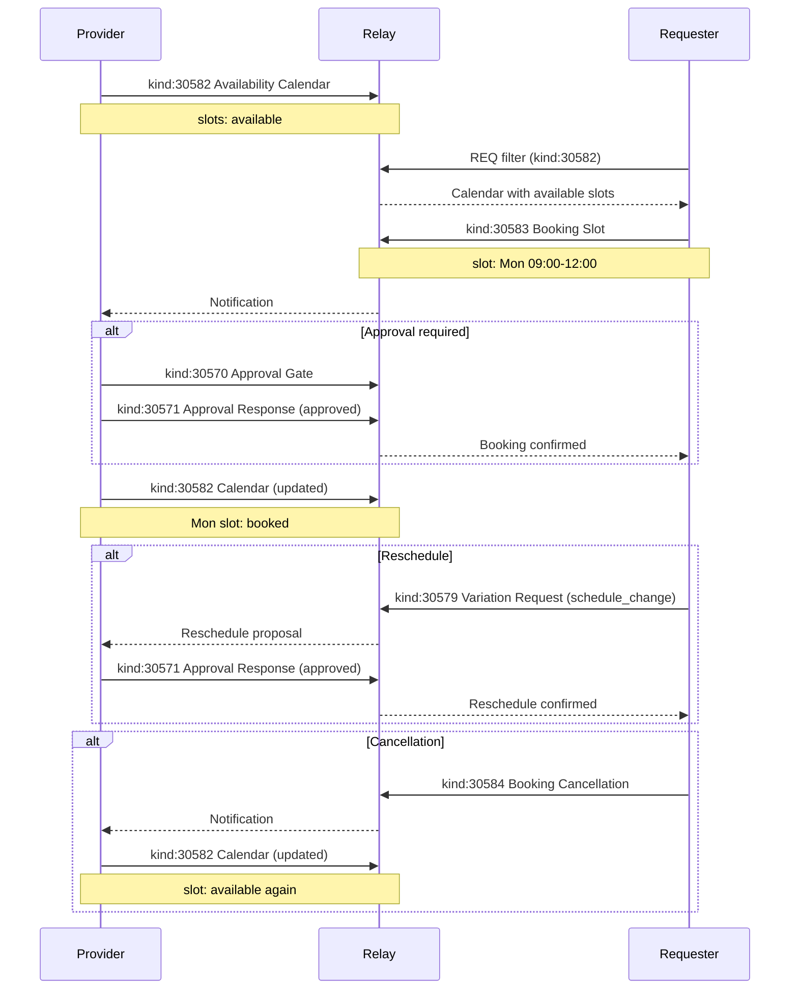

NIP-BOOKING
===========

Calendar Availability & Booking
---------------------------------

`draft` `optional`

Three addressable event kinds for calendar-based scheduling on Nostr; a provider publishes available time slots (including recurring patterns), a requester books a specific slot, and either party can cancel.

> **Design principle:** Booking events coordinate scheduling. They communicate availability and record reservations. They do not enforce exclusivity at the relay level; the consuming application is responsible for preventing double-bookings and handling cancellation policies.

> **Standalone usability:** This NIP works independently on any Nostr application. Within the TROTT protocol (v0.9), TROTT-11: Scheduling & Availability extends NIP-BOOKING with domain-specific configuration (default slot durations, cancellation windows per domain) and composition with the TROTT task lifecycle. Adoption of TROTT is not required.

## Motivation

Nostr has NIP-52 for calendar events and NIP-53 for live activities, but no standard mechanism for **advertising availability and accepting bookings**. Many workflows require structured scheduling:

- **Appointment booking** - a professional publishes available slots, clients book sessions
- **Recurring services** - weekly or monthly time slots with availability management
- **Venue & resource reservation** - rooms, equipment, or shared spaces with time-slot allocation
- **Event ticketing** - time-limited entry slots with capacity management
- **Tutoring & consulting** - one-on-one sessions with calendar-based scheduling

Without a standard, each scheduling application invents its own availability and booking scheme. NIP-BOOKING provides three minimal, composable primitives that any Nostr application can adopt for time-based coordination. Booking confirmation and rescheduling are handled by composing with NIP-APPROVAL and NIP-VARIATION respectively, keeping NIP-BOOKING focused on the core scheduling data model.

## Relationship to Existing NIPs

- **NIP-52 (Calendar Events):** Calendar events are confirmed, scheduled happenings ("I'm hosting a workshop on Friday"). Availability Calendars advertise when a provider is free; Booking Slots reserve time. The two are complementary: a provider publishes NIP-BOOKING availability, a requester books a slot, and the confirmed booking may produce a NIP-52 calendar event.
- **NIP-53 (Live Activities):** Live activities represent ongoing events with real-time participation. Booking Slots are future reservations. A booked session might become a live activity when it starts, but the scheduling and the activity are distinct concerns.
- **NIP-APPROVAL (kinds 30570-30571):** Booking confirmation uses NIP-APPROVAL. The provider creates an Approval Gate (kind 30570) referencing the Booking Slot, then responds with an Approval Response (kind 30571). This enables confirmation, rejection, or revision requests. See [Composing with NIP-APPROVAL](#composing-with-nip-approval) below.
- **NIP-VARIATION (kind 30579):** Rescheduling uses NIP-VARIATION. Either party publishes a Variation Request with `variation_type: schedule_change` and proposed new times. The other party approves via NIP-APPROVAL. See [Composing with NIP-VARIATION](#composing-with-nip-variation) below.
- **RFC 5545 (iCalendar):** Recurrence patterns align with iCalendar RRULE concepts but use simpler tag-based encoding for lightweight calendars, or full RRULE strings for complex recurring patterns.

## Kinds

| kind  | description           |
| ----- | --------------------- |
| 30582 | Availability Calendar |
| 30583 | Booking Slot          |
| 30584 | Booking Cancellation  |

All three kinds are addressable events (NIP-01). The `d` tag format ensures each event occupies a unique slot, allowing updates via republication.

---

## Availability Calendar (`kind:30582`)

Published by a provider to advertise their available time slots. Addressable; the provider can update their calendar by republishing with the same `d` tag, typically to mark slots as booked or blocked.

A calendar MAY declare a recurring pattern using optional recurrence tags. When recurrence tags are present, the calendar acts as both an explicit slot list and a recurring availability declaration. Clients expand recurrence patterns into concrete slots and merge them with any explicit `slot` tags on the same event.

### Explicit Slots Example

A calendar with individually listed time slots for a specific period:

```json
{
    "kind": 30582,
    "pubkey": "<provider-hex-pubkey>",
    "created_at": 1698774000,
    "tags": [
        ["d", "<provider-hex-pubkey>:calendar:2026-W09"],
        ["t", "availability-calendar"],
        ["g", "gcpuuz"],
        ["slot", "1698822000", "1698832800", "available"],
        ["slot", "1698832800", "1698843600", "available"],
        ["slot", "1698908400", "1698919200", "available"],
        ["slot", "1698919200", "1698930000", "blocked"],
        ["slot_duration_minutes", "180"],
        ["max_bookings_per_slot", "1"]
    ],
    "content": "",
    "id": "<32-bytes lowercase hex>",
    "sig": "<64-bytes lowercase hex>"
}
```

### Recurring Pattern Example

A calendar with recurrence tags declares a repeating availability pattern. Clients expand the RRULE into concrete slots. A single recurring calendar can express complex schedules like "every Monday and Thursday 10:00-11:00, except bank holidays, until December 2026":

```json
{
    "kind": 30582,
    "pubkey": "<provider-hex-pubkey>",
    "created_at": 1698780000,
    "tags": [
        ["d", "<provider-hex-pubkey>:calendar:appointments"],
        ["t", "availability-calendar"],
        ["recurrence", "FREQ=WEEKLY;BYDAY=MO,TH"],
        ["recurrence_start", "10:00"],
        ["recurrence_start", "14:00"],
        ["slot_duration_minutes", "60"],
        ["g", "gcpuuz"],
        ["max_bookings_per_slot", "1"],
        ["pricing", "7500"],
        ["currency", "GBP"],
        ["timezone", "Europe/London"],
        ["expiration", "1735689600"],
        ["exclude_date", "2026-03-17"],
        ["exclude_date", "2026-04-06"],
        ["cancellation_window_hours", "48"],
        ["cancellation_fee", "3750"],
        ["cancellation_fee_currency", "GBP"]
    ],
    "content": "",
    "id": "<32-bytes lowercase hex>",
    "sig": "<64-bytes lowercase hex>"
}
```

This expands to four slots per week: Monday 10:00, Monday 14:00, Thursday 10:00, Thursday 14:00.

### Mixed Example

A calendar MAY combine explicit slots with recurrence tags. Explicit `slot` tags override the recurring pattern for specific times:

```json
{
    "kind": 30582,
    "pubkey": "<provider-hex-pubkey>",
    "created_at": 1698780000,
    "tags": [
        ["d", "<provider-hex-pubkey>:calendar:tutoring:2026-W12"],
        ["t", "availability-calendar"],
        ["recurrence", "FREQ=WEEKLY;BYDAY=MO,WE,FR"],
        ["recurrence_start", "09:00"],
        ["slot_duration_minutes", "60"],
        ["timezone", "Europe/London"],
        ["slot", "1699254000", "1699257600", "blocked"],
        ["g", "gcpuuz"]
    ],
    "content": "",
    "id": "<32-bytes lowercase hex>",
    "sig": "<64-bytes lowercase hex>"
}
```

Here the recurring pattern generates Monday/Wednesday/Friday 09:00 slots, but the explicit `slot` tag blocks one specific time window.

### Tags

* `d` (REQUIRED): Addressable event identifier. For period-based calendars, format `<provider_pubkey>:calendar:<period>`. For recurring calendars, format `<provider_pubkey>:calendar:<category>`. One calendar per provider per period or category.
* `t` (REQUIRED): Protocol family marker. MUST be `"availability-calendar"`.
* `slot` (RECOMMENDED, multiple): Explicit time slots. Format: `["slot", "<start_unix>", "<end_unix>", "<status>"]` where `status` is `"available"`, `"booked"`, or `"blocked"`. A calendar event MAY contain multiple `slot` tags.
* `g` (RECOMMENDED): Geohash of the service area.
* `slot_duration_minutes` (RECOMMENDED): Default slot duration in minutes. REQUIRED when `recurrence` is present.
* `max_bookings_per_slot` (OPTIONAL): Maximum concurrent bookings per slot (defaults to 1 if omitted).
* `expiration` (OPTIONAL): Unix timestamp for calendar validity period. Clients SHOULD use NIP-40 `expiration` for relay-level enforcement.

**Recurrence tags** (all OPTIONAL; when `recurrence` is present, `recurrence_start` and `slot_duration_minutes` become REQUIRED):

* `recurrence` (OPTIONAL): RRULE string conforming to [RFC 5545, Section 3.3.10](https://datatracker.ietf.org/doc/html/rfc5545#section-3.3.10). See [RRULE Format](#rrule-format) below.
* `recurrence_start` (OPTIONAL, multiple): Start time of each recurring slot in `HH:MM` format (24-hour, UTC unless `timezone` is specified). Multiple tags are allowed for multi-slot days.
* `timezone` (OPTIONAL): Provider's local timezone in IANA format (e.g. `Europe/London`). If omitted, clients MUST default to UTC.
* `exclude_date` (OPTIONAL, multiple): ISO 8601 date to exclude from the pattern (e.g. bank holidays).
* `pricing` (OPTIONAL): Price per slot in smallest currency unit (pence for GBP, cents for USD, satoshis for SAT).
* `currency` (OPTIONAL): Currency code (ISO 4217).
* `cancellation_window_hours` (OPTIONAL): Minimum notice hours for penalty-free cancellation.
* `cancellation_fee` (OPTIONAL): Fee in smallest currency unit when cancelled outside the window.
* `cancellation_fee_currency` (OPTIONAL): Currency code for the cancellation fee.
* `env_constraint` (OPTIONAL, multiple): Environmental or seasonal constraint. Values: `frost_sensitive`, `dry_weather_only`, `temperature_min:<celsius>`, `temperature_max:<celsius>`, `daylight_only`, `wind_max:<knots>`, `humidity_max:<percent>`, `seasonal_material`, `tidal_dependent`, `noise_restricted`. Multiple tags are cumulative; all constraints must be satisfied for a slot to be viable.
* `seasonal_window` (OPTIONAL): ISO 8601 month range during which this pattern is active, e.g. `apr-oct`. Outside this window the pattern is suspended.
* `p` (OPTIONAL, multiple): Additional parties to notify of availability changes.
* `ref` (OPTIONAL): External reference (e.g. practice management system ID).

**Content:** Empty string or NIP-44 encrypted JSON with additional scheduling metadata (booking policies, cancellation terms, pricing per slot, service descriptions, preparation instructions).

### Slot Tag Format

Each explicit slot is encoded as a `slot` tag with structured positional values:

```
["slot", "<start_unix>", "<end_unix>", "<status>"]
```

- `start_unix`: Unix timestamp for slot start time
- `end_unix`: Unix timestamp for slot end time
- `status`: One of `"available"`, `"booked"`, or `"blocked"`

Providers update slot statuses by republishing the entire calendar event with revised `slot` tags.

### RRULE Format

When a calendar includes recurrence tags, the `recurrence` tag contains an RRULE string using a subset of the iCalendar specification (RFC 5545, Section 3.3.10). Supported RRULE properties:

| Property   | Description                  | Example                                   |
|------------|------------------------------|-------------------------------------------|
| `FREQ`     | Recurrence frequency         | `DAILY`, `WEEKLY`, `MONTHLY`, `YEARLY`    |
| `BYDAY`    | Days of the week             | `MO`, `TU`, `WE`, `TH`, `FR`, `SA`, `SU` |
| `BYHOUR`   | Hours of the day (0-23)      | `10`, `14`                                |
| `INTERVAL` | Interval between recurrences | `1` (every week), `2` (every other week)  |
| `COUNT`    | Number of occurrences        | `52` (52 weeks)                           |
| `UNTIL`    | End date (ISO 8601)          | `20261231T235959Z`                        |
| `WKST`     | Week start day               | `MO` (Monday)                             |

**Example RRULE patterns:**

| Schedule                           | RRULE                                         |
|------------------------------------|-----------------------------------------------|
| Every Monday                       | `FREQ=WEEKLY;BYDAY=MO`                        |
| Monday and Thursday                | `FREQ=WEEKLY;BYDAY=MO,TH`                     |
| Every weekday                      | `FREQ=WEEKLY;BYDAY=MO,TU,WE,TH,FR`           |
| Every other Saturday               | `FREQ=WEEKLY;INTERVAL=2;BYDAY=SA`             |
| First Monday of each month         | `FREQ=MONTHLY;BYDAY=1MO`                      |
| 52 weekly sessions                 | `FREQ=WEEKLY;BYDAY=WE;COUNT=52`               |

Clients MUST support at minimum `FREQ`, `BYDAY`, `INTERVAL`, `COUNT`, and `UNTIL`. Clients SHOULD support `BYHOUR` and `WKST`. Unsupported RRULE properties MUST be silently ignored; clients SHOULD NOT reject events containing unsupported properties.

Libraries such as `rrule.js` (JavaScript) or `dateutil.rrule` (Python) provide RFC 5545 RRULE parsing.

### RRULE Resolution

Clients resolve recurring calendars into concrete bookable slots by:

1. Parsing the `recurrence` tag as an RFC 5545 RRULE
2. Generating occurrence dates within the requested time window
3. Applying `exclude_date` exclusions
4. Combining each occurrence date with the `recurrence_start` time(s) and `slot_duration_minutes` to produce concrete slots
5. Merging with any explicit `slot` tags (explicit slots take precedence over generated ones for the same time window)
6. Checking each slot against existing Kind 30583 bookings to determine remaining capacity
7. Presenting available slots to the requester

### Tag Reference

| Tag                         | Required          | Multiple | Description                                       |
|-----------------------------|-------------------|----------|---------------------------------------------------|
| `d`                         | MUST              | No       | Addressable event identifier                      |
| `t`                         | MUST              | No       | Protocol family marker                            |
| `slot`                      | SHOULD            | Yes      | Explicit time slot with status                    |
| `g`                         | SHOULD            | No       | Service area geohash                              |
| `slot_duration_minutes`     | SHOULD*           | No       | Default slot duration (* MUST when recurring)     |
| `max_bookings_per_slot`     | MAY               | No       | Max concurrent bookings (default 1)               |
| `expiration`                | MAY               | No       | Calendar validity period (NIP-40)                 |
| `recurrence`                | MAY               | No       | RRULE string (RFC 5545)                           |
| `recurrence_start`          | MAY*              | Yes      | Start time per recurring slot (* MUST when recurring) |
| `timezone`                  | MAY               | No       | Provider's timezone (IANA format)                 |
| `exclude_date`              | MAY               | Yes      | Excluded dates (ISO 8601)                         |
| `pricing`                   | MAY               | No       | Price per slot (smallest currency unit)           |
| `currency`                  | MAY               | No       | Currency code                                     |
| `cancellation_window_hours` | MAY               | No       | Penalty-free cancellation window                  |
| `cancellation_fee`          | MAY               | No       | Fee for late cancellation                         |
| `cancellation_fee_currency` | MAY               | No       | Currency of the cancellation fee                  |
| `env_constraint`            | MAY               | Yes      | Environmental/seasonal constraint                 |
| `seasonal_window`           | MAY               | No       | Active month range (e.g. `apr-oct`)               |
| `p`                         | MAY               | Yes      | Additional notification targets                   |
| `ref`                       | MAY               | No       | External reference                                |

---

## Booking Slot (`kind:30583`)

Published by a requester to book a specific slot from a provider's calendar.

```json
{
    "kind": 30583,
    "pubkey": "<requester-hex-pubkey>",
    "created_at": 1698775000,
    "tags": [
        ["d", "<provider-hex-pubkey>:calendar:2026-W09:slot:1698822000:booking:<requester-hex-pubkey>"],
        ["t", "booking-slot"],
        ["e", "<calendar-event-id>", "wss://relay.example.com"],
        ["p", "<provider-hex-pubkey>"],
        ["slot_start", "1698822000"],
        ["slot_end", "1698832800"],
        ["amount", "5000"],
        ["currency", "SAT"]
    ],
    "content": "<NIP-44 encrypted JSON: {\"address\":\"42 Oak Lane, London SE1 2AB\",\"notes\":\"Please arrive 10 minutes early.\"}>",
    "id": "<32-bytes lowercase hex>",
    "sig": "<64-bytes lowercase hex>"
}
```

Tags:

* `d` (REQUIRED): Format `<calendar_d_tag>:slot:<slot_start>:booking:<requester_pubkey>`. The `slot_start` timestamp participates in the identifier to ensure one booking per requester per slot; without it, a second booking from the same requester on the same calendar would replace the first.
* `t` (REQUIRED): Protocol family marker. MUST be `"booking-slot"`.
* `e` (REQUIRED): Event ID of the Kind 30582 availability calendar.
* `p` (REQUIRED): Provider's hex pubkey.
* `slot_start` (REQUIRED): Unix timestamp for the start time of the booked slot.
* `slot_end` (REQUIRED): Unix timestamp for the end time of the booked slot.
* `amount` (RECOMMENDED): Agreed price in smallest currency unit (pence for GBP, cents for USD, satoshis for SAT).
* `currency` (RECOMMENDED): Currency code.
* `ref` (OPTIONAL): External reference (booking confirmation number).
* `notes` (OPTIONAL): Booking notes or special requests.

**Content:** Empty string or NIP-44 encrypted JSON with booking details (address, special requirements, access instructions).

### Tag Reference

| Tag          | Required | Multiple | Description                                |
|--------------|----------|----------|--------------------------------------------|
| `d`          | MUST     | No       | Addressable event identifier               |
| `t`          | MUST     | No       | Protocol family marker                     |
| `e`          | MUST     | No       | Reference to Kind 30582 calendar event     |
| `p`          | MUST     | No       | Provider's pubkey                          |
| `slot_start` | MUST     | No       | Booked slot start time                     |
| `slot_end`   | MUST     | No       | Booked slot end time                       |
| `amount`     | SHOULD   | No       | Price (smallest currency unit)             |
| `currency`   | SHOULD   | No       | Currency code                              |
| `ref`        | MAY      | No       | External reference                         |
| `notes`      | MAY      | No       | Booking notes                              |

---

## Booking Cancellation (`kind:30584`)

Published by either party to cancel a booking. The `d` tag format creates one cancellation per booking. A dedicated cancellation kind is used instead of NIP-09 deletion because: (a) either party may cancel, but only the booking author can issue a NIP-09 deletion for their own event; (b) cancellations carry structured metadata (reason codes, refund amounts, penalty amounts) that deletion requests cannot express; (c) cancellations create an auditable record that persists independently of relay deletion compliance.

```json
{
    "kind": 30584,
    "pubkey": "<requester-hex-pubkey>",
    "created_at": 1698776000,
    "tags": [
        ["d", "<provider-hex-pubkey>:calendar:2026-W09:slot:1698822000:booking:<requester-hex-pubkey>:cancellation"],
        ["t", "booking-cancellation"],
        ["e", "<booking-event-id>", "wss://relay.example.com"],
        ["cancel_reason", "requester_initiated"],
        ["p", "<provider-hex-pubkey>"],
        ["refund_amount", "5000"],
        ["refund_currency", "SAT"]
    ],
    "content": "Need to reschedule due to an unexpected commitment. Apologies for the short notice.",
    "id": "<32-bytes lowercase hex>",
    "sig": "<64-bytes lowercase hex>"
}
```

Tags:

* `d` (REQUIRED): Format `<booking_d_tag>:cancellation`. One cancellation per booking.
* `t` (REQUIRED): Protocol family marker. MUST be `"booking-cancellation"`.
* `e` (REQUIRED): Event ID of the Kind 30583 booking being cancelled.
* `cancel_reason` (REQUIRED): Reason code. One of `"requester_initiated"`, `"provider_initiated"`, `"schedule_conflict"`, `"no_show"`, `"force_majeure"`.
* `p` (RECOMMENDED): Other party's hex pubkey (for notification).
* `refund_amount` (OPTIONAL): Refund amount in smallest currency unit.
* `refund_currency` (OPTIONAL): Currency of the refund.
* `penalty_amount` (OPTIONAL): Cancellation penalty in smallest currency unit.
* `penalty_currency` (OPTIONAL): Currency of the penalty.

**Content:** Plain text with cancellation details or reason.

### Tag Reference

| Tag               | Required | Multiple | Description                                |
|-------------------|----------|----------|--------------------------------------------|
| `d`               | MUST     | No       | Addressable event identifier               |
| `t`               | MUST     | No       | Protocol family marker                     |
| `e`               | MUST     | No       | Reference to Kind 30583 booking event      |
| `cancel_reason`   | MUST     | No       | Reason code for cancellation               |
| `p`               | SHOULD   | No       | Other party's pubkey for notification      |
| `refund_amount`   | MAY      | No       | Refund amount (smallest currency unit)     |
| `refund_currency` | MAY      | No       | Currency of the refund                     |
| `penalty_amount`  | MAY      | No       | Penalty amount (smallest currency unit)    |
| `penalty_currency`| MAY      | No       | Currency of the penalty                    |

---

## Composing with NIP-APPROVAL

Booking confirmation is handled by [NIP-APPROVAL](./NIP-APPROVAL.md) (kinds 30570-30571). In workflows where bookings require provider approval, a Kind 30583 booking is treated as a _request_ rather than a confirmed reservation. The provider creates an Approval Gate referencing the booking, then publishes an Approval Response with their decision.

In workflows where bookings are auto-confirmed, this composition step is optional; the Kind 30583 booking itself constitutes confirmation.

### Confirmation Flow

**Step 1: Requester books a slot** (Kind 30583, as above).

**Step 2: Provider creates an Approval Gate** (Kind 30570) referencing the booking:

```json
{
    "kind": 30570,
    "pubkey": "<provider-hex-pubkey>",
    "created_at": 1698781000,
    "tags": [
        ["d", "<provider-hex-pubkey>:calendar:2026-W09:slot:1698822000:booking:<requester-hex-pubkey>:gate:confirmation"],
        ["t", "approval-gate"],
        ["gate_type", "approval"],
        ["gate_authority", "<provider-hex-pubkey>"],
        ["gate_status", "pending"],
        ["e", "<booking-event-id>", "wss://relay.example.com"],
        ["p", "<requester-hex-pubkey>"],
        ["expiration", "1698868400"]
    ],
    "content": "Booking confirmation required for Monday 09:00-12:00 session.",
    "id": "<32-bytes lowercase hex>",
    "sig": "<64-bytes lowercase hex>"
}
```

**Step 3a: Provider approves** (Kind 30571):

```json
{
    "kind": 30571,
    "pubkey": "<provider-hex-pubkey>",
    "created_at": 1698782000,
    "tags": [
        ["d", "<provider-hex-pubkey>:calendar:2026-W09:slot:1698822000:booking:<requester-hex-pubkey>:gate:confirmation:response:<provider-hex-pubkey>"],
        ["t", "approval-response"],
        ["e", "<gate-event-id>", "wss://relay.example.com"],
        ["decision", "approved"],
        ["p", "<requester-hex-pubkey>"],
        ["slot_start", "1698822000"],
        ["slot_end", "1698832800"],
        ["amount", "7500"],
        ["currency", "GBP"]
    ],
    "content": "<NIP-44 encrypted JSON: {\"location\":\"Suite 4B, 12 Harley Street, London W1G 9PF\",\"preparation\":\"Please arrive 10 minutes early for your first session.\"}>",
    "id": "<32-bytes lowercase hex>",
    "sig": "<64-bytes lowercase hex>"
}
```

The `slot_start`, `slot_end`, `amount`, and `currency` tags on the Approval Response confirm the booking details. The NIP-44 encrypted content carries private location or preparation information.

**Step 3b: Provider declines** (Kind 30571):

```json
{
    "kind": 30571,
    "pubkey": "<provider-hex-pubkey>",
    "created_at": 1698782000,
    "tags": [
        ["d", "<provider-hex-pubkey>:calendar:2026-W09:slot:1698822000:booking:<requester-hex-pubkey>:gate:confirmation:response:<provider-hex-pubkey>"],
        ["t", "approval-response"],
        ["e", "<gate-event-id>", "wss://relay.example.com"],
        ["decision", "rejected"],
        ["p", "<requester-hex-pubkey>"],
        ["decline_reason", "schedule_conflict"]
    ],
    "content": "Unfortunately I have a scheduling conflict for this slot. Please check my availability for Wednesday afternoon instead.",
    "id": "<32-bytes lowercase hex>",
    "sig": "<64-bytes lowercase hex>"
}
```

### REQ Filter for Booking Confirmations

To fetch all approval responses for a specific booking:

```json
{
    "kinds": [30571],
    "authors": ["<provider-hex-pubkey>"],
    "#e": ["<gate-event-id>"]
}
```

### Validation Rules

| Rule     | Description                                                                                              |
|----------|----------------------------------------------------------------------------------------------------------|
| V-BK-05  | The Approval Gate (30570) MUST reference a valid Kind 30583 Booking Slot via `e` tag                     |
| V-BK-06  | The Approval Response (30571) `decision` tag MUST be `approved`, `rejected`, or `revise`     |
| V-BK-07  | The Approval Response MUST be published by the provider referenced in the Kind 30583 booking's `p` tag   |

---

## Composing with NIP-VARIATION

Rescheduling is handled by [NIP-VARIATION](./NIP-VARIATION.md) (kind 30579). A reschedule is a scope change: the proposer creates a Variation Request with `variation_type: schedule_change` and new `slot_start`/`slot_end` tags. The other party responds via NIP-APPROVAL.

Rescheduling preserves the booking history and relationship between the original request and the new time, unlike cancellation-and-rebook which creates two independent events.

### Reschedule Flow

**Step 1: Requester requests a reschedule** (Kind 30579):

```json
{
    "kind": 30579,
    "pubkey": "<requester-hex-pubkey>",
    "created_at": 1698782000,
    "tags": [
        ["d", "<provider-hex-pubkey>:calendar:2026-W10:slot:1699254000:booking:<requester-hex-pubkey>:variation:001"],
        ["t", "variation-request"],
        ["variation_type", "schedule_change"],
        ["e", "<booking-event-id>", "wss://relay.example.com"],
        ["p", "<provider-hex-pubkey>"],
        ["slot_start", "1699340400"],
        ["slot_end", "1699344000"],
        ["original_slot_start", "1699254000"],
        ["original_slot_end", "1699257600"],
        ["reschedule_reason", "requester_conflict"],
        ["cancellation_window_hours", "48"],
        ["penalty_waived", "true"]
    ],
    "content": "I have a work commitment that has come up on Monday. Could we move to Tuesday afternoon instead?",
    "id": "<32-bytes lowercase hex>",
    "sig": "<64-bytes lowercase hex>"
}
```

The `variation_type: schedule_change` signals that this variation is a reschedule. The `slot_start` and `slot_end` tags carry the proposed new times, while `original_slot_start` and `original_slot_end` record the original booking times for reference.

**Step 2: Provider approves the reschedule** via NIP-APPROVAL (Kind 30571):

```json
{
    "kind": 30571,
    "pubkey": "<provider-hex-pubkey>",
    "created_at": 1698783000,
    "tags": [
        ["d", "<provider-hex-pubkey>:calendar:2026-W10:slot:1699254000:booking:<requester-hex-pubkey>:variation:001:response:<provider-hex-pubkey>"],
        ["t", "approval-response"],
        ["e", "<variation-event-id>", "wss://relay.example.com"],
        ["decision", "approved"],
        ["p", "<requester-hex-pubkey>"],
        ["slot_start", "1699340400"],
        ["slot_end", "1699344000"]
    ],
    "content": "Tuesday afternoon works well. See you then.",
    "id": "<32-bytes lowercase hex>",
    "sig": "<64-bytes lowercase hex>"
}
```

This preserves the full event chain: booking (30583) -> variation request (30579) -> approval response (30571).

**Provider-initiated reschedule** follows the same pattern, with the provider publishing the Variation Request and the requester responding:

```json
{
    "kind": 30579,
    "pubkey": "<provider-hex-pubkey>",
    "created_at": 1698782000,
    "tags": [
        ["d", "<provider-hex-pubkey>:calendar:2026-W10:slot:1699254000:booking:<requester-hex-pubkey>:variation:002"],
        ["t", "variation-request"],
        ["variation_type", "schedule_change"],
        ["e", "<booking-event-id>", "wss://relay.example.com"],
        ["p", "<requester-hex-pubkey>"],
        ["slot_start", "1699340400"],
        ["slot_end", "1699344000"],
        ["original_slot_start", "1699254000"],
        ["original_slot_end", "1699257600"],
        ["reschedule_reason", "illness"],
        ["penalty_waived", "true"],
        ["expiration", "1698868400"]
    ],
    "content": "I'm unwell today and need to reschedule our session. Tuesday same time would work if that suits you.",
    "id": "<32-bytes lowercase hex>",
    "sig": "<64-bytes lowercase hex>"
}
```

### Cancellation Policy on Reschedules

Cancellation policies are declared on the Availability Calendar (Kind 30582) via `cancellation_window_hours` and `cancellation_fee` tags. The Variation Request echoes the applicable policy for transparency.

When a reschedule is requested:

1. The requesting party checks the applicable cancellation window
2. If the reschedule is requested within the cancellation window (i.e. less than `cancellation_window_hours` before the original slot), the `cancellation_fee` MAY apply
3. The `penalty_waived` tag allows the requesting party to signal that they accept the penalty, or the other party to waive it when responding

**Provider-initiated reschedules** SHOULD NOT incur penalties on the requester.

### Variation Request Tags for Rescheduling

When composing NIP-VARIATION for rescheduling, the following tags are used on the Kind 30579 Variation Request:

| Tag                         | Required | Description                                         |
|-----------------------------|----------|-----------------------------------------------------|
| `variation_type`            | MUST     | MUST be `"schedule_change"` for reschedules         |
| `e`                         | MUST     | Reference to Kind 30583 booking event               |
| `slot_start`                | MUST     | Proposed new start time (Unix timestamp)            |
| `slot_end`                  | MUST     | Proposed new end time (Unix timestamp)              |
| `p`                         | SHOULD   | Other party's pubkey for notification               |
| `original_slot_start`       | SHOULD   | Original booking start time                         |
| `original_slot_end`         | SHOULD   | Original booking end time                           |
| `reschedule_reason`         | SHOULD   | Reason code: `requester_conflict`, `provider_conflict`, `weather`, `illness`, `other` |
| `cancellation_window_hours` | MAY      | Echoed from calendar policy                         |
| `cancellation_fee`          | MAY      | Applicable fee if outside window                    |
| `cancellation_fee_currency` | MAY      | Currency of the cancellation fee                    |
| `penalty_waived`            | MAY      | Whether the penalty is waived (`"true"`)            |
| `amount`                    | MAY      | Price for rescheduled slot (if different)           |
| `currency`                  | MAY      | Currency code                                       |
| `expiration`                | MAY      | Response deadline (NIP-40)                          |

---

## Protocol Flow



### Step-by-Step

1. **Publish calendar:** Provider publishes `kind:30582` with available time slots. If the calendar includes recurrence tags, clients expand the pattern into concrete slots.
2. **Discover availability:** Requester queries for `kind:30582` calendars filtered by geohash, provider pubkey, or time range.
3. **Book slot:** Requester publishes `kind:30583` to book a specific slot.
4. **Confirm booking (optional):** Provider creates an Approval Gate (`kind:30570`) and publishes an Approval Response (`kind:30571`) to confirm or decline. If the workflow does not require confirmation, the booking is auto-confirmed.
5. **Update calendar:** Provider republishes `kind:30582` with the booked slot's status changed to `"booked"`.
6. **Service delivery:** The consuming application handles what happens during the booked slot (task creation, payment, etc.).
7. **Reschedule (optional):** Either party publishes a Variation Request (`kind:30579`) with `variation_type: schedule_change`. The other party responds via Approval Response (`kind:30571`).
8. **Cancellation (optional):** Either party publishes `kind:30584` to cancel. The provider restores the slot to `"available"` in their next calendar update.
9. **Next period:** Provider publishes a new or updated `kind:30582` for the next scheduling period.

## REQ Filters

### Discover Provider Availability

```json
{
    "kinds": [30582],
    "#g": ["gcpuuz"],
    "#t": ["availability-calendar"]
}
```

### Fetch Bookings for a Calendar

```json
{
    "kinds": [30583],
    "#e": ["<calendar-event-id>"]
}
```

### Fetch Cancellations for a Booking

```json
{
    "kinds": [30584],
    "#e": ["<booking-event-id>"]
}
```

### Fetch Reschedule Requests for a Booking

```json
{
    "kinds": [30579],
    "#e": ["<booking-event-id>"],
    "#t": ["variation-request"]
}
```

---

## Validation Rules

| Rule     | Event Kind(s)                | Requirement                                                                                     |
|----------|------------------------------|-------------------------------------------------------------------------------------------------|
| V-BK-01  | 30582 (Availability Calendar)| When `recurrence` is present, MUST include a valid RRULE string conforming to RFC 5545          |
| V-BK-02  | 30582 (Availability Calendar)| When `recurrence` is present, MUST include at least one `recurrence_start` tag in `HH:MM` format and a `slot_duration_minutes` tag |
| V-BK-03  | 30582 (Availability Calendar)| `max_bookings_per_slot` value MUST be a positive integer when present (minimum `1`)             |
| V-BK-04  | 30582 (Availability Calendar)| `exclude_date` values MUST be valid ISO 8601 dates                                              |
| V-BK-05  | 30570/30571 (Approval)       | Approval Gate MUST reference a valid Kind 30583 Booking Slot via `e` tag                        |
| V-BK-06  | 30571 (Approval Response)    | `decision` tag MUST be `approved`, `rejected`, or `revise`                          |
| V-BK-07  | 30571 (Approval Response)    | MUST be published by the provider referenced in the Kind 30583 booking's `p` tag                |
| V-BK-08  | 30579 (Variation Request)    | When used for rescheduling, MUST reference a valid Kind 30583 Booking Slot via `e` tag          |
| V-BK-09  | 30579 (Variation Request)    | `slot_start` MUST be a valid future Unix timestamp                                              |
| V-BK-10  | 30579 (Variation Request)    | `slot_end` MUST be greater than `slot_start`                                                    |
| V-BK-11  | 30579 (Variation Request)    | MUST be published by either the requester or provider of the referenced booking                 |
| V-BK-12  | 30582 (Availability Calendar)| `pricing` and `cancellation_fee` values MUST be non-negative integers when present              |

## Relay Recommendations

| Event Kind                    | Recommended Retention                   | Rationale                   |
|-------------------------------|-----------------------------------------|-----------------------------|
| 30582 (Availability Calendar) | 90 days post-expiration or post-update  | Scheduling infrastructure   |
| 30583 (Booking Slot)          | 90 days post-slot-end                   | Booking record              |
| 30584 (Booking Cancellation)  | 90 days post-slot-end                   | Cancellation audit trail    |

## Security Considerations

* **Double-booking prevention.** Relays do not enforce slot exclusivity. The provider is responsible for updating their calendar (`kind:30582`) after each booking. Applications SHOULD check slot status before confirming bookings and SHOULD handle race conditions gracefully (e.g. by notifying the requester if a slot was booked by someone else).
* **Cancellation policies.** The `penalty_amount` and `refund_amount` tags communicate cancellation terms but do not enforce payment. Applications SHOULD integrate with payment protocols for automated penalty collection.
* **Content encryption.** Booking details (addresses, personal information, session notes) SHOULD be NIP-44 encrypted in the `content` field. Public `slot` tags on calendars reveal when a provider is busy but not who booked or why.
* **Calendar authenticity.** Clients MUST verify that `kind:30582` calendar events are signed by the provider's pubkey. Forged calendars could lead to bookings with non-existent providers.
* **Slot time validation.** Clients SHOULD verify that `slot_start` and `slot_end` on booking events (`kind:30583`) match an `available` slot on the referenced calendar (`kind:30582`). Bookings referencing non-existent or `blocked` slots SHOULD be rejected.
* **Timestamp manipulation.** Providers could manipulate slot timestamps to create artificial scarcity or conflict. Clients SHOULD cross-reference `created_at` timestamps with slot times and flag anomalies.
* **Booking spam.** Providers SHOULD implement rate limiting on incoming Kind 30583 bookings. A requester who repeatedly books and cancels slots MAY be flagged or blocked at the application level.
* **Cancellation policy manipulation.** The cancellation policy tags on Kind 30582 are informational; they declare the policy but do not enforce it cryptographically. Enforcement depends on the consuming application and payment integration.
* **Slot overbooking.** When `max_bookings_per_slot` is greater than 1, multiple requesters may book the same slot. Providers MUST track the number of active bookings per slot and decline (via NIP-APPROVAL) or update their calendar when capacity is reached.
* **Time zone handling.** Calendars with recurrence tags include a `timezone` tag to avoid ambiguity in recurring patterns. Clients MUST resolve RRULE patterns in the provider's declared timezone. Daylight saving time transitions MUST be handled correctly; a recurring slot at "10:00 Europe/London" remains at 10:00 local time regardless of GMT/BST transitions.
* **Confirmation authenticity.** When NIP-APPROVAL is used for booking confirmation, clients MUST verify that Approval Response (30571) events are signed by the provider referenced in the original Kind 30583 booking's `p` tag. Forged confirmations could mislead requesters.

## Privacy

* **Availability exposure.** Publishing a Kind 30582 calendar reveals when a provider is free and when they are busy. Providers who require privacy SHOULD limit the time horizon of published calendars and use NIP-44 encryption for the `content` field.
* **Booking metadata.** Kind 30583 `slot_start`/`slot_end` tags are public, revealing that a booking exists at a specific time. Sensitive details (addresses, personal notes) MUST be placed in NIP-44 encrypted `content`, not in public tags.
* **Geohash precision.** The `g` tag exposes approximate location. Providers SHOULD use a geohash precision appropriate for their privacy needs (e.g. 5-6 characters for neighbourhood-level, not 8+ characters for building-level).
* **Cancellation visibility.** Kind 30584 cancellation events are public. The `cancel_reason` tag reveals why a booking was cancelled. Applications handling sensitive contexts (e.g. medical appointments) SHOULD use generic reason codes.

## Test Vectors

### Availability Calendar (Explicit Slots)

```json
{
    "kind": 30582,
    "pubkey": "a1b2c3d4e5f6a1b2c3d4e5f6a1b2c3d4e5f6a1b2c3d4e5f6a1b2c3d4e5f6a1b2",
    "created_at": 1698774000,
    "tags": [
        ["d", "a1b2c3d4e5f6a1b2c3d4e5f6a1b2c3d4e5f6a1b2c3d4e5f6a1b2c3d4e5f6a1b2:calendar:2026-W09"],
        ["t", "availability-calendar"],
        ["g", "gcpuuz"],
        ["slot", "1698822000", "1698832800", "available"],
        ["slot", "1698832800", "1698843600", "available"],
        ["slot_duration_minutes", "180"],
        ["max_bookings_per_slot", "1"]
    ],
    "content": "",
    "id": "<32-bytes lowercase hex>",
    "sig": "<64-bytes lowercase hex>"
}
```

### Availability Calendar (Recurring)

```json
{
    "kind": 30582,
    "pubkey": "a1b2c3d4e5f6a1b2c3d4e5f6a1b2c3d4e5f6a1b2c3d4e5f6a1b2c3d4e5f6a1b2",
    "created_at": 1698780000,
    "tags": [
        ["d", "a1b2c3d4e5f6a1b2c3d4e5f6a1b2c3d4e5f6a1b2c3d4e5f6a1b2c3d4e5f6a1b2:calendar:appointments"],
        ["t", "availability-calendar"],
        ["recurrence", "FREQ=WEEKLY;BYDAY=MO,TH"],
        ["recurrence_start", "10:00"],
        ["slot_duration_minutes", "60"],
        ["timezone", "Europe/London"],
        ["g", "gcpuuz"],
        ["max_bookings_per_slot", "1"],
        ["pricing", "7500"],
        ["currency", "GBP"],
        ["expiration", "1735689600"],
        ["exclude_date", "2026-03-17"]
    ],
    "content": "",
    "id": "<32-bytes lowercase hex>",
    "sig": "<64-bytes lowercase hex>"
}
```

### Booking Slot

```json
{
    "kind": 30583,
    "pubkey": "f6e5d4c3b2a1f6e5d4c3b2a1f6e5d4c3b2a1f6e5d4c3b2a1f6e5d4c3b2a1f6e5",
    "created_at": 1698775000,
    "tags": [
        ["d", "a1b2c3d4e5f6a1b2c3d4e5f6a1b2c3d4e5f6a1b2c3d4e5f6a1b2c3d4e5f6a1b2:calendar:2026-W09:slot:1698822000:booking:f6e5d4c3b2a1f6e5d4c3b2a1f6e5d4c3b2a1f6e5d4c3b2a1f6e5d4c3b2a1f6e5"],
        ["t", "booking-slot"],
        ["e", "abcdef0123456789abcdef0123456789abcdef0123456789abcdef0123456789", "wss://relay.example.com"],
        ["p", "a1b2c3d4e5f6a1b2c3d4e5f6a1b2c3d4e5f6a1b2c3d4e5f6a1b2c3d4e5f6a1b2"],
        ["slot_start", "1698822000"],
        ["slot_end", "1698832800"],
        ["amount", "7500"],
        ["currency", "GBP"]
    ],
    "content": "",
    "id": "<32-bytes lowercase hex>",
    "sig": "<64-bytes lowercase hex>"
}
```

### Booking Cancellation

```json
{
    "kind": 30584,
    "pubkey": "f6e5d4c3b2a1f6e5d4c3b2a1f6e5d4c3b2a1f6e5d4c3b2a1f6e5d4c3b2a1f6e5",
    "created_at": 1698776000,
    "tags": [
        ["d", "a1b2c3d4e5f6a1b2c3d4e5f6a1b2c3d4e5f6a1b2c3d4e5f6a1b2c3d4e5f6a1b2:calendar:2026-W09:slot:1698822000:booking:f6e5d4c3b2a1f6e5d4c3b2a1f6e5d4c3b2a1f6e5d4c3b2a1f6e5d4c3b2a1f6e5:cancellation"],
        ["t", "booking-cancellation"],
        ["e", "1234567890abcdef1234567890abcdef1234567890abcdef1234567890abcdef", "wss://relay.example.com"],
        ["cancel_reason", "requester_initiated"],
        ["p", "a1b2c3d4e5f6a1b2c3d4e5f6a1b2c3d4e5f6a1b2c3d4e5f6a1b2c3d4e5f6a1b2"],
        ["refund_amount", "7500"],
        ["refund_currency", "GBP"]
    ],
    "content": "Unable to attend due to a scheduling conflict.",
    "id": "<32-bytes lowercase hex>",
    "sig": "<64-bytes lowercase hex>"
}
```

---

## Use Cases

### Professional Appointment Booking

Therapists, consultants, tutors, and other professionals can publish their availability calendar on Nostr. Clients browse available slots and book sessions directly. The NIP-44 encrypted content on booking events protects client details (address, session notes). Cancellation events with penalty tags enable automated cancellation policy enforcement.

### Venue & Resource Reservation

Co-working spaces, meeting rooms, sports facilities, and shared equipment can use availability calendars for reservation management. The `max_bookings_per_slot` tag supports both exclusive-use resources (set to 1) and shared resources (set to capacity). The `g` tag enables location-based discovery.

### Recurring Event Registration

Community organisers can publish recurring event slots (weekly meetups, monthly workshops, regular classes) using recurrence tags on Kind 30582. Attendees book specific sessions via `kind:30583`. The recurrence tags communicate the schedule pattern, while individual bookings track attendance per session.

### Service Provider Scheduling

Any service provider who works by appointment (plumbers, electricians, dog walkers, personal trainers) can publish their availability and accept bookings through Nostr. The calendar model handles the common pattern of time-slotted availability with location-based discovery.

---

## Dependencies

* [NIP-01](https://github.com/nostr-protocol/nips/blob/master/01.md): Basic protocol flow, addressable events
* [NIP-40](https://github.com/nostr-protocol/nips/blob/master/40.md): Expiration timestamps (calendar validity)
* [NIP-44](https://github.com/nostr-protocol/nips/blob/master/44.md): Versioned encrypted payloads (private booking details)
* [NIP-52](https://github.com/nostr-protocol/nips/blob/master/52.md): Calendar Events (complementary; NIP-52 defines events, NIP-BOOKING defines availability and reservations)
* [NIP-APPROVAL](./NIP-APPROVAL.md): Multi-party approval gates (booking confirmation)
* [NIP-VARIATION](./NIP-VARIATION.md): Scope and price change management (rescheduling)
* [RFC 5545](https://datatracker.ietf.org/doc/html/rfc5545): Internet Calendaring and Scheduling (iCalendar) for RRULE format

## Reference Implementation

The [`@trott/sdk`](https://github.com/TheCryptoDonkey/trott-sdk) TypeScript library provides builders and parsers for all three kinds defined in this NIP, plus composition helpers for NIP-APPROVAL and NIP-VARIATION flows. For standalone use without TROTT, implementors SHOULD refer to the kind definitions above.

A minimal implementation requires:

1. A Nostr client that supports addressable event publishing.
2. Calendar rendering logic: parsing `slot` tags and `recurrence`/RRULE patterns to display provider availability.
3. Booking state management: tracking slot statuses and preventing double-bookings at the application level.
4. Cancellation handling with refund/penalty computation per the provider's published policies.

For full-featured implementations, additionally:

5. Confirmation handling via NIP-APPROVAL: creating Approval Gates for incoming bookings and processing Approval Responses.
6. Reschedule handling via NIP-VARIATION: publishing Variation Requests with `variation_type: schedule_change` and processing approval responses with updated slot times.
