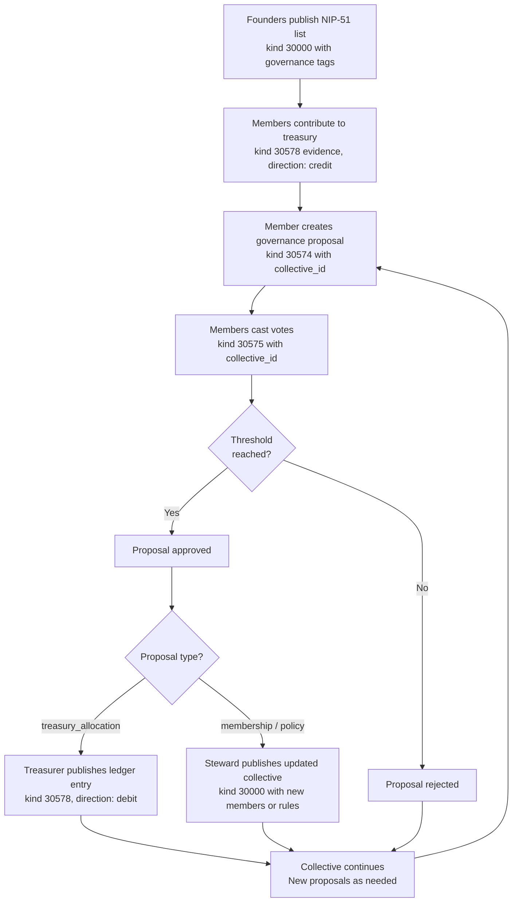

NIP-COMMUNITY-GOVERNANCE
=========================

Community Governance & Collective Resource Management (Composition Guide)
--------------------------------------------------------------------------

`draft` `optional` `composition-guide`

This document shows how to model community governance on Nostr using existing NIPs. No new event kinds are required.

> **Design principle:** Governance events record collective structure, proposals, votes, and resource movements. They do not enforce outcomes. The consuming application decides how to act on governance decisions.

## Motivation

Many real-world groups need **ongoing governance**: persistent structures with rotating roles, shared treasuries, evolving rules, and democratic processes that outlive any single vote.

Consider the difference:

- **NIP-CONSENSUS:** "Should we allocate 500,000 sats to relay hosting?", vote, done.
- **Community Governance:** "We are a collective. We have members, roles, a treasury, and rules for how decisions get made. This month's proposal is relay hosting. Next month it might be membership changes. The collective persists."

NIP-02 contact lists are flat. NIP-51 lists provide flexible grouping but no governance machinery. NIP-CONSENSUS handles one-off decisions but not persistent democratic structures. By composing NIP-51 lists (member rosters with governance metadata), NIP-CONSENSUS proposals and votes (democratic decision-making), and NIP-EVIDENCE records (treasury audit trails), applications can build full governance systems for:

- **DAOs and cooperatives** with transparent voting and treasury management
- **Community land trusts** with democratic stewardship decisions
- **Mutual aid networks** with shared emergency funds and collective legal support
- **Open-source project governance** with release decisions, fund allocation, and maintainer rotation
- **Housing cooperatives** with maintenance fund management and rule changes
- **Worker-owned collectives** with profit sharing and role rotation

## Composition Summary

| Concept | Kind | Source NIP | `d` tag pattern |
| ------- | ---- | ---------- | --------------- |
| Collective Definition | 30000 | NIP-51 | `collective:<name>` |
| Governance Proposal | 30574 | NIP-CONSENSUS | `<collective>:governance:<slug>` |
| Governance Vote | 30575 | NIP-CONSENSUS | `<collective>:governance:<slug>:vote:<voter>` |
| Treasury Ledger Entry | 30578 | NIP-EVIDENCE | `<collective>:treasury:<sequence>` |

---

## Collectives with NIP-51

A collective IS a NIP-51 list (`kind:30000`) of members with governance metadata tags. The list's `p` tags carry role positions; additional tags declare the governance model, quorum threshold, charter, and treasury key.

```json
{
    "kind": 30000,
    "pubkey": "<founder-hex-pubkey>",
    "created_at": 1709280000,
    "tags": [
        ["d", "collective:southwark-mutual-aid"],
        ["title", "Southwark Mutual Aid Network"],
        ["governance_model", "direct_democracy"],
        ["voting_threshold", "0.6"],
        ["charter", "https://example.com/charter.md"],
        ["rotation_period", "P3M"],
        ["treasury_pubkey", "<treasury-hex-pubkey>"],
        ["p", "<founder-hex-pubkey>", "steward"],
        ["p", "<member-2-hex-pubkey>", "treasurer"],
        ["p", "<member-3-hex-pubkey>", "member"],
        ["p", "<member-4-hex-pubkey>", "member"],
        ["p", "<member-5-hex-pubkey>", "member"],
        ["expiration", "1740902400"]
    ],
    "content": "A mutual aid network for Southwark residents. Pooled emergency fund, collective legal support, and shared resources for members in need.",
    "id": "<32-bytes lowercase hex>",
    "sig": "<64-bytes lowercase hex>"
}
```

Tags:

* `d` (REQUIRED): MUST use `collective:<name>` prefix. The name portion SHOULD be a human-readable slug.
* `title` (REQUIRED): Human-readable collective name.
* `governance_model` (REQUIRED): One of `direct_democracy`, `delegated`, `consensus_threshold`, `supermajority`.
* `voting_threshold` (REQUIRED): Minimum participation threshold as a decimal between 0.0 and 1.0. A threshold of `0.6` means at least 60% of members must vote in favour for a proposal to pass.
* `p` (REQUIRED, repeatable): Member pubkey with role in position 2. At least one member is required.
* `treasury_pubkey` (OPTIONAL): Pubkey controlling the collective's shared treasury. Multi-sig or threshold keys are RECOMMENDED.
* `charter` (OPTIONAL): URI linking to the collective's governance charter document.
* `rotation_period` (OPTIONAL): ISO 8601 duration for role rotation (e.g. `P3M` for quarterly, `P6M` for biannual). When set, steward and treasurer roles rotate among members at the specified interval.
* `expiration` (OPTIONAL): NIP-40 timestamp. Collectives MAY set an expiration to force periodic renewal.

**Content:** Plain text description of the collective's purpose and mission.

### Governance Models

| Model | Description |
| ----- | ----------- |
| `direct_democracy` | Every member votes on every proposal. Threshold applies. |
| `delegated` | Members may delegate their vote to another member. |
| `consensus_threshold` | Proposals pass when `agree` votes reach the threshold. No `disagree` count. |
| `supermajority` | Proposals require a supermajority (typically 67%+) of participating members to pass. |

### Member Roles

| Role | Permissions |
| ---- | ----------- |
| `steward` | Publish updated collective definitions, manage membership proposals, represent the collective |
| `treasurer` | Publish treasury ledger entries (NIP-EVIDENCE), manage treasury operations |
| `member` | Create proposals, cast votes, contribute to treasury |

A member MAY hold multiple roles. At least one `steward` is REQUIRED. Roles are defined in the collective definition and changed via governance proposals; no single member can unilaterally alter roles.

### REQ Filters

```json
[
    {"kinds": [30000], "#d": ["collective:southwark-mutual-aid"]},
    {"kinds": [30000], "#p": ["<member-pubkey>"]}
]
```

---

## Proposals with NIP-CONSENSUS

A governance proposal IS a NIP-CONSENSUS proposal (`kind:30574`) scoped to a collective via a `collective_id` tag. Any collective member can publish a proposal.

```json
{
    "kind": 30574,
    "pubkey": "<proposing-member-hex-pubkey>",
    "created_at": 1709283600,
    "tags": [
        ["d", "southwark-mutual-aid:governance:emergency-fund-allocation"],
        ["t", "consensus-proposal"],
        ["collective_id", "collective:southwark-mutual-aid"],
        ["proposal_type", "treasury_allocation"],
        ["p", "<member-2-hex-pubkey>"],
        ["p", "<member-3-hex-pubkey>"],
        ["p", "<member-4-hex-pubkey>"],
        ["p", "<member-5-hex-pubkey>"],
        ["threshold", "3"],
        ["expiration", "1709884800"],
        ["consensus_type", "governance"]
    ],
    "content": "Proposal: Allocate 50,000 sats from the collective treasury to establish an emergency hardship fund. Any member facing sudden financial difficulty can request up to 10,000 sats with approval from two other members. Remaining funds roll over quarterly.",
    "id": "<32-bytes lowercase hex>",
    "sig": "<64-bytes lowercase hex>"
}
```

Tags (in addition to standard NIP-CONSENSUS tags):

* `collective_id` (REQUIRED): The `d` tag value of the NIP-51 collective list this proposal belongs to.
* `proposal_type` (REQUIRED): Category of proposal. One of the defined types below.
* `consensus_type` (RECOMMENDED): SHOULD be `"governance"` to distinguish from non-governance consensus proposals.
* `threshold` (REQUIRED): Integer string; minimum `agree` votes needed. Derived from the collective's `voting_threshold` and member count.
* `expiration` (REQUIRED): Unix timestamp; voting deadline. Votes after this timestamp MUST be ignored.
* `p` (REQUIRED, multiple): One `p` tag per voter. SHOULD match the collective's member list (excluding the proposer if they are not voting).

### Proposal Types

| Type | Description | Recommended Threshold |
| ---- | ----------- | --------------------- |
| `membership_add` | Add a new member to the collective | Default |
| `membership_remove` | Remove an existing member | Supermajority |
| `treasury_allocation` | Allocate funds from the shared treasury | Default |
| `policy_change` | Change a collective rule or policy | Supermajority |
| `role_rotation` | Rotate steward, treasurer, or other roles | Default |
| `dissolution` | Dissolve the collective entirely | Supermajority |

Clients SHOULD enforce supermajority requirements for sensitive proposal types (`membership_remove`, `policy_change`, `dissolution`) regardless of the collective's default governance model.

### REQ Filters

> **Note:** Tags such as `collective_id`, `proposal_type`, and `evidence_type` are multi-letter tags and therefore not relay-indexed per NIP-01. The filters below show the intended query semantics; clients MUST post-filter results client-side for multi-letter tag matches.

```json
[
    {"kinds": [30574], "#collective_id": ["collective:southwark-mutual-aid"]},
    {"kinds": [30574], "#proposal_type": ["treasury_allocation"]}
]
```

---

## Voting with NIP-CONSENSUS

A governance vote IS a NIP-CONSENSUS vote (`kind:30575`) with a `collective_id` tag for efficient filtering.

```json
{
    "kind": 30575,
    "pubkey": "<voting-member-hex-pubkey>",
    "created_at": 1709370000,
    "tags": [
        ["d", "southwark-mutual-aid:governance:emergency-fund-allocation:vote:voter1"],
        ["t", "consensus-vote"],
        ["a", "30574:<proposer-pubkey>:southwark-mutual-aid:governance:emergency-fund-allocation", "wss://relay.example.com"],
        ["collective_id", "collective:southwark-mutual-aid"],
        ["vote", "agree"]
    ],
    "content": "Fully support this. Emergency funds are exactly what mutual aid is about.",
    "id": "<32-bytes lowercase hex>",
    "sig": "<64-bytes lowercase hex>"
}
```

Tags (in addition to standard NIP-CONSENSUS tags):

* `a` (REQUIRED): Addressable event coordinate of the `kind:30574` governance proposal being voted on.
* `collective_id` (REQUIRED): The `d` tag value of the NIP-51 collective list. Redundant with the proposal's collective reference but included for efficient relay filtering.
* `vote` (REQUIRED): The member's decision. One of `"agree"`, `"disagree"`, or `"abstain"`.

### Vote Tallying Rules

1. Only votes from pubkeys listed in the collective's `p` tags are counted.
2. `abstain` votes count towards quorum (participation) but not towards approval.
3. For `direct_democracy` and `consensus_threshold`: proposal passes when `agree` votes meet or exceed the `threshold` value.
4. For `supermajority`: proposal passes when `agree` votes divided by participating voters (excluding abstentions) meets or exceeds 0.67.
5. For `delegated`: a delegated vote counts as the delegator's vote. If a member both delegates and votes directly, the direct vote takes precedence.
6. Votes after the `expiration` timestamp MUST be ignored.

### REQ Filters

```json
{"kinds": [30575], "#a": ["30574:<proposer-pubkey>:southwark-mutual-aid:governance:emergency-fund-allocation"]}
```

---

## Treasury with NIP-EVIDENCE

A treasury ledger entry IS a NIP-EVIDENCE record (`kind:30578`) with `evidence_type: treasury_movement`. The append-only nature of evidence records makes them ideal for financial audit trails.

```json
{
    "kind": 30578,
    "pubkey": "<treasurer-hex-pubkey>",
    "created_at": 1709456400,
    "tags": [
        ["d", "southwark-mutual-aid:treasury:2026-03-emergency-fund"],
        ["t", "evidence-record"],
        ["evidence_type", "treasury_movement"],
        ["collective_id", "collective:southwark-mutual-aid"],
        ["amount", "50000"],
        ["currency", "SAT"],
        ["direction", "debit"],
        ["balance_after", "150000"],
        ["authorised_by", "<kind-30574-proposal-event-id>"],
        ["p", "<recipient-pubkey>"]
    ],
    "content": "Emergency hardship fund allocation as approved by proposal southwark-mutual-aid:governance:emergency-fund-allocation. Quarterly rollover applies.",
    "id": "<32-bytes lowercase hex>",
    "sig": "<64-bytes lowercase hex>"
}
```

Tags (in addition to standard NIP-EVIDENCE tags):

* `evidence_type` (REQUIRED): MUST be `"treasury_movement"`.
* `collective_id` (REQUIRED): The `d` tag value of the NIP-51 collective list.
* `amount` (REQUIRED): Amount in the smallest unit of the specified currency.
* `currency` (REQUIRED): Currency code. Common values: `SAT`, `GBP`, `USD`, `EUR`.
* `direction` (REQUIRED): One of `"credit"` (funds in) or `"debit"` (funds out).
* `balance_after` (RECOMMENDED): Treasury balance after this movement. Enables clients to verify ledger consistency.
* `authorised_by` (RECOMMENDED): Event ID of the approved `kind:30574` governance proposal authorising this movement. REQUIRED for debits to maintain an audit trail.
* `p` (OPTIONAL): Pubkey of the contributor (for credits) or recipient (for debits).

### Auditability

Clients SHOULD validate that debit entries reference an approved proposal (`authorised_by`). Entries without proposal references MAY be flagged for review. The ledger is append-only; entries are never deleted, only corrected by publishing new entries with explanatory content.

### REQ Filters

```json
[
    {"kinds": [30578], "#collective_id": ["collective:southwark-mutual-aid"]},
    {"kinds": [30578], "#evidence_type": ["treasury_movement"]}
]
```

---

## Governance Workflow



### Step by step

1. **Formation.** Founders publish a `kind:30000` NIP-51 list defining the collective: its governance model, voting threshold, initial members, and optional treasury key.
2. **Treasury seeding.** Members publish `kind:30578` evidence records with `direction: credit` to build the shared treasury.
3. **Proposal.** Any member publishes a `kind:30574` NIP-CONSENSUS proposal with a `collective_id` tag, listing voters and a threshold derived from the collective's rules.
4. **Voting.** Members publish `kind:30575` NIP-CONSENSUS votes. Clients tally votes against the threshold.
5. **Resolution.** The proposal passes when `agree` votes meet the threshold, or fails when the deadline passes without meeting it.
6. **Execution.** If approved, the relevant action is taken. The treasurer publishes a `kind:30578` ledger entry for financial decisions, or the steward publishes an updated `kind:30000` collective list for membership and policy changes.
7. **Continuous governance.** The collective persists. New proposals are created as needed. The cycle repeats indefinitely.

## Use Cases

### Community Land Trusts

A neighbourhood group collectively owns land. The NIP-51 collective list defines all trustees with roles. Policy changes (building permissions, lease terms) go through NIP-CONSENSUS proposals with supermajority requirements. The NIP-EVIDENCE ledger tracks maintenance contributions and expenditure.

### Open-Source Project Governance

An open-source project with multiple maintainers uses community governance for release decisions and fund allocation. The collective list defines maintainers with `steward` roles. Bounty allocations go through proposals. Role rotation ensures no single maintainer has permanent control.

### Mutual Aid Networks

Neighbours pool emergency funds. Any member can propose an allocation for a member in hardship. The threshold ensures collective agreement. The evidence ledger provides full transparency on contributions and withdrawals.

## Security Considerations

* **Sybil attacks on voting.** Membership is explicit in the NIP-51 collective list. Only votes from listed member pubkeys are counted. An attacker cannot inject votes without first being added through a governance proposal.
* **Treasury key management.** A single-key treasury is a trust risk. Multi-sig or threshold keys (e.g. 2-of-3 steward/treasurer signatures) are RECOMMENDED. Applications SHOULD warn users when a collective's treasury relies on a single key.
* **Governance capture.** A majority faction could add sympathetic members and remove dissenters. Clients SHOULD enforce supermajority requirements for `membership_remove`, `policy_change`, and `dissolution` proposal types regardless of the collective's default governance model.
* **Vote privacy.** Votes are public by default. For sensitive proposals, vote content MAY be NIP-44 encrypted. Collectives SHOULD document their transparency expectations in the charter.
* **Proposal spam.** Only collective members can create proposals, but a disruptive member could flood the collective with frivolous proposals. Clients SHOULD implement rate limiting and collectives MAY include proposal rate limits in their charter.
* **Stale collectives.** Collectives without activity for extended periods may have abandoned treasuries. Clients SHOULD flag collectives with no proposals or ledger entries for more than 6 months. The `expiration` tag on the NIP-51 list provides a mechanism for forced renewal.
* **Deadline enforcement.** Votes published after the `expiration` timestamp MUST be ignored. Clients MUST check timestamps when tallying votes to prevent late-vote manipulation.

## Dependencies

* [NIP-51](https://github.com/nostr-protocol/nips/blob/master/51.md): Lists (collective definition as `kind:30000`)
* [NIP-CONSENSUS](./NIP-CONSENSUS.md): Multi-party consensus (`kind:30574` proposals, `kind:30575` votes)
* [NIP-EVIDENCE](./NIP-EVIDENCE.md): Timestamped evidence recording (`kind:30578` treasury ledger entries)
* [NIP-40](https://github.com/nostr-protocol/nips/blob/master/40.md): Expiration timestamps (collective renewal, proposal deadlines)
* [NIP-44](https://github.com/nostr-protocol/nips/blob/master/44.md): Versioned encrypted payloads (sensitive proposal content, encrypted votes)
