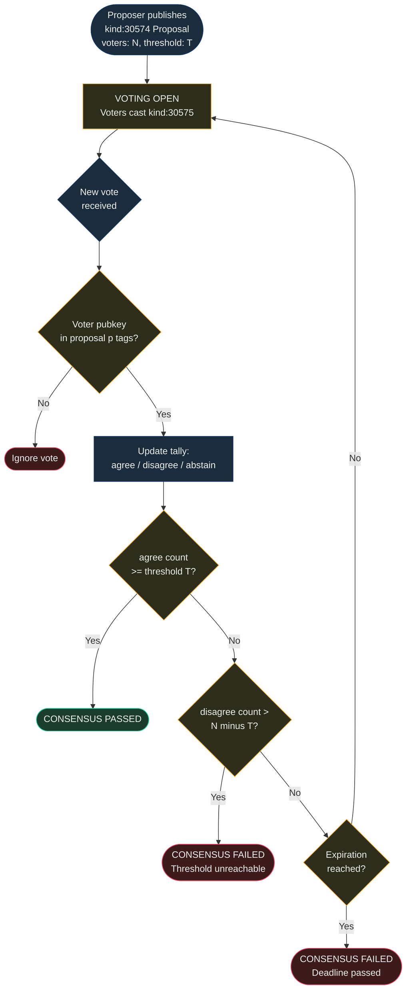

NIP-CONSENSUS
=============

Multi-Party Consensus
-----------------------

`draft` `optional`

Two addressable event kinds for gathering agreement from multiple parties on Nostr — a proposer publishes a consensus proposal listing required voters and a threshold, and each voter casts a signed vote.

> **Design principle:** Consensus proposals are a coordination primitive for group decisions. They record who agreed and who did not — they do not enforce outcomes. The consuming application decides what happens when consensus is reached or fails.

> **Standalone usability:** This NIP works independently on any Nostr application. Within the [TROTT protocol](https://github.com/forgesworn/nip-drafts) (v0.9), it is pattern P3 in TROTT-00: Core Patterns. TROTT composes consensus proposals with multi-party task coordination, dispute resolution panels, and provider collective governance — but adoption of TROTT is not required.

## Motivation

Nostr has mechanisms for individual expression (notes, reactions, zaps) but no standard for **structured group decisions**. Many collaborative workflows require agreement from multiple independent parties before proceeding:

- **DAOs and governance** — proposals requiring a quorum of members to pass
- **Group purchases** — splitting a purchase across friends who must all agree
- **Multi-sig coordination** — human-readable proposals preceding on-chain multi-sig actions
- **Community moderation** — multiple moderators must agree before taking action
- **Event planning** — all vendors must confirm availability for a proposed timeline

NIP-57 zaps express support with money, and NIP-25 reactions express sentiment, but neither models threshold-based consensus with identified voters. See [Relationship to Existing NIPs](#relationship-to-existing-nips) below for a detailed comparison. NIP-CONSENSUS fills this gap with a minimal, composable primitive for structured group decision-making.

## Relationship to Existing NIPs

- **NIP-25 (Reactions):** Reactions express sentiment (`+`/`-`) but lack the structure needed for threshold-based governance. A reaction-based approach would require each client to independently maintain the voter set, implement threshold arithmetic, track abstentions, enforce deadlines, and handle reaction updates, all without relay-side filtering support. Kind 30574 (Proposal) encodes the voter set, threshold, quorum type, and deadline in a single event. Kind 30575 (Vote) is relay-filterable by the proposal's `a` tag, so clients fetch only votes for a specific proposal rather than scanning all reactions.
- **Concrete example:** A DAO with 5 board members needs 3/5 approval within 48 hours. With NIP-25 reactions, any pubkey can react to the proposal note; the client must cross-reference a separately maintained board list, ignore non-member reactions, track abstentions against the deadline, and determine when the threshold is unreachable. With NIP-CONSENSUS, the proposal event declares `voters: 5`, `threshold: 3`, and `expiration: <timestamp>`. The relay returns only kind 30575 events matching the proposal, each from a pubkey in the declared voter set.
- **NIP-57 (Zaps):** Zaps express economic support but not structured agree/disagree/abstain decisions with quorum semantics.
- **NIP-69 (Polls, closed/unmerged):** NIP-69 proposed generic polling (kind 1068/1069) but was never merged. NIP-CONSENSUS differs in three ways: (a) the voter set is explicitly declared in the proposal event, preventing open-participation Sybil attacks; (b) threshold and quorum semantics are protocol-level, not client-side conventions; (c) votes are addressable per voter per proposal, enabling vote updates and preventing duplicates. NIP-69 was a lightweight sentiment poll; NIP-CONSENSUS is a structured governance primitive with enforceable quorum rules.

## Kinds

| kind  | description         |
| ----- | ------------------- |
| 30574 | Consensus Proposal  |
| 30575 | Consensus Vote      |

Both kinds are addressable events (NIP-01). The `d` tag format ensures each event occupies a unique slot, allowing updates via republication.

---

## Consensus Proposal (`kind:30574`)

Published by a proposer to initiate a multi-party decision. Lists all required voters via `p` tags and specifies the consensus threshold.

```json
{
    "kind": 30574,
    "pubkey": "<proposer-hex-pubkey>",
    "created_at": 1698768000,
    "tags": [
        ["d", "dao_budget_2026:consensus:q1_allocation"],
        ["t", "consensus-proposal"],
        ["p", "<member_a-hex-pubkey>"],
        ["p", "<member_b-hex-pubkey>"],
        ["p", "<member_c-hex-pubkey>"],
        ["p", "<member_d-hex-pubkey>"],
        ["threshold", "3"],
        ["expiration", "1698854400"],
        ["consensus_type", "budget"]
    ],
    "content": "Proposal: Allocate 500,000 sats from the community treasury to fund relay infrastructure for Q1 2026. Breakdown: 300,000 sats for hosting, 200,000 sats for development bounties.",
    "id": "<32-bytes lowercase hex>",
    "sig": "<64-bytes lowercase hex>"
}
```

Tags:

* `d` (REQUIRED): Format `<context_id>:consensus:<sequence>`. Addressable event identifier.
* `t` (REQUIRED): Protocol family marker. MUST be `"consensus-proposal"`.
* `p` (REQUIRED, multiple): One `p` tag per required voter. Each voter's hex pubkey.
* `threshold` (REQUIRED): Integer string — minimum number of `agree` votes required for the proposal to pass.
* `expiration` (RECOMMENDED): Unix timestamp — voting deadline. Clients SHOULD use NIP-40 `expiration` for relay-level enforcement.
* `consensus_type` (RECOMMENDED): Category of decision. Suggested values: `timeline`, `scope`, `budget`, `design`, `terms`, `governance`, `moderation`.
* `ref` (OPTIONAL): External reference.
* `e` (OPTIONAL): Event ID of the item requiring consensus (e.g. the content, transaction, or action being voted on).

**Content:** Plain text or NIP-44 encrypted JSON describing the proposal. SHOULD include enough detail for all voters to make an informed decision.

---

## Consensus Vote (`kind:30575`)

Published by a voter to cast their vote on a consensus proposal. The `d` tag format allows one vote per voter per proposal. Addressable, so voters can change their vote before the deadline.

```json
{
    "kind": 30575,
    "pubkey": "<member_a-hex-pubkey>",
    "created_at": 1698769000,
    "tags": [
        ["d", "dao_budget_2026:consensus:q1_allocation:vote:<member_a-hex-pubkey>"],
        ["t", "consensus-vote"],
        ["e", "<consensus-proposal-event-id>", "wss://relay.example.com"],
        ["vote", "agree"],
        ["p", "<proposer-hex-pubkey>"]
    ],
    "content": "Agreed. The relay infrastructure is critical for our community's growth.",
    "id": "<32-bytes lowercase hex>",
    "sig": "<64-bytes lowercase hex>"
}
```

Tags:

* `d` (REQUIRED): Format `<proposal_d_tag>:vote:<voter_pubkey>`. One vote per voter per proposal.
* `t` (REQUIRED): Protocol family marker. MUST be `"consensus-vote"`.
* `e` (REQUIRED): Event ID of the Kind 30574 proposal being voted on.
* `vote` (REQUIRED): The voter's decision. One of `"agree"`, `"disagree"`, or `"abstain"`.
* `p` (RECOMMENDED): Proposer's pubkey (for notification).
* `condition` (OPTIONAL): Conditional agreement text (e.g. "agree if budget stays under 500,000 sats").

**Content:** Plain text with the voter's rationale or conditions.

---

## Protocol Flow

1. **Proposal:** Proposer publishes `kind:30574` listing all required voters via `p` tags and the `threshold` for passage.
2. **Voting:** Each voter evaluates the proposal and publishes `kind:30575` with their `vote`.
3. **Vote changes:** Voters MAY update their vote by republishing `kind:30575` (addressable event replacement) before the deadline.
4. **Resolution:** The proposal passes when the number of `agree` votes meets or exceeds the `threshold`. It fails if the deadline passes without meeting the threshold, or if enough `disagree` votes make the threshold unreachable.

## Quorum Rules

- **Threshold**: The `threshold` tag defines the minimum number of `agree` votes required. It MUST be at least 1 and MUST NOT exceed the number of `p`-tagged voters.
- **Unanimous**: Set `threshold` equal to the number of voters for unanimous consent.
- **Simple majority**: Set `threshold` to `ceil(voters / 2)`.
- **Abstentions**: An `abstain` vote counts as participation but not towards the threshold.
- **Deadline**: If `expiration` passes without the threshold being met, the proposal is considered failed.

The following diagram illustrates how votes are tallied and consensus is resolved:



## Use Cases Beyond TROTT

### DAO Governance

Nostr-native DAOs can use consensus proposals for treasury management, membership decisions, and policy changes. Each proposal lists the DAO members as voters, with the threshold set per the DAO's bylaws. Votes are cryptographically signed and publicly verifiable, providing transparent governance without a custom voting platform.

### Group Purchase Coordination

Friends splitting a group purchase (concert tickets, shared subscriptions, group gifts) can use a consensus proposal to confirm everyone is in before committing. The proposer lists all participants and sets `threshold` to the total count — ensuring unanimous agreement before money moves.

### Community Moderation Decisions

Nostr communities with multiple moderators can use consensus proposals for moderation actions (banning users, pinning content, changing community rules). The threshold model ensures no single moderator can act unilaterally, and the signed vote trail provides accountability.

### Multi-Party Contract Agreement

Before formalising a contract or agreement between multiple parties (e.g. a joint venture, a shared workspace lease, a collaboration agreement), a consensus proposal can confirm that all parties agree to the terms. Each party's signed vote serves as a cryptographic record of their consent.

## Test Vectors

All examples use timestamps around `1709280000` (2024-03-01) and placeholder hex pubkeys.

### Kind 30574 — Consensus Proposal

A budget approval proposal listing 3 voters with a threshold of 2.

```json
{
  "kind": 30574,
  "pubkey": "a1b2c3d4e5f6a1b2c3d4e5f6a1b2c3d4e5f6a1b2c3d4e5f6a1b2c3d4e5f6a1b2",
  "created_at": 1709280000,
  "tags": [
    ["d", "treasury_2026:consensus:q1_budget"],
    ["t", "consensus-proposal"],
    ["p", "b2c3d4e5f6a1b2c3d4e5f6a1b2c3d4e5f6a1b2c3d4e5f6a1b2c3d4e5f6a1b2c3"],
    ["p", "c3d4e5f6a1b2c3d4e5f6a1b2c3d4e5f6a1b2c3d4e5f6a1b2c3d4e5f6a1b2c3d4"],
    ["p", "d4e5f6a1b2c3d4e5f6a1b2c3d4e5f6a1b2c3d4e5f6a1b2c3d4e5f6a1b2c3d4e5"],
    ["threshold", "2"],
    ["expiration", "1709366400"],
    ["consensus_type", "budget"]
  ],
  "content": "Allocate 250,000 sats from the community treasury to fund relay hosting for Q1 2026.",
  "id": "<32-byte-hex>",
  "sig": "<64-byte-hex>"
}
```

### Kind 30575 — Consensus Vote

An "agree" vote from one of the listed voters on the above proposal.

```json
{
  "kind": 30575,
  "pubkey": "b2c3d4e5f6a1b2c3d4e5f6a1b2c3d4e5f6a1b2c3d4e5f6a1b2c3d4e5f6a1b2c3",
  "created_at": 1709283600,
  "tags": [
    ["d", "treasury_2026:consensus:q1_budget:vote:b2c3d4e5f6a1b2c3d4e5f6a1b2c3d4e5f6a1b2c3d4e5f6a1b2c3d4e5f6a1b2c3"],
    ["t", "consensus-vote"],
    ["e", "aaaa1111bbbb2222cccc3333dddd4444eeee5555ffff6666aaaa1111bbbb2222", "wss://relay.example.com"],
    ["vote", "agree"],
    ["p", "a1b2c3d4e5f6a1b2c3d4e5f6a1b2c3d4e5f6a1b2c3d4e5f6a1b2c3d4e5f6a1b2"]
  ],
  "content": "Agreed. Relay infrastructure is essential for the community.",
  "id": "<32-byte-hex>",
  "sig": "<64-byte-hex>"
}
```

### REQ Filters

```json
[
    {"kinds": [30574], "#p": ["<my-pubkey>"]},
    {"kinds": [30575], "#e": ["<proposal-event-id>"]},
    {"kinds": [30574], "authors": ["<proposer-pubkey>"], "limit": 10}
]
```

The first filter discovers proposals where a pubkey is an invited voter. The second fetches all votes for a specific proposal. The third retrieves recent proposals from a specific proposer.

## Security Considerations

* **Voter verification.** Implementations MUST verify that Kind 30575 votes are signed by a pubkey listed in the corresponding Kind 30574's `p` tags. Votes from unlisted pubkeys MUST be ignored.
* **Vote manipulation.** Since votes are addressable events, a voter can change their vote by republishing. Clients SHOULD display vote change history (by tracking `created_at` timestamps) to prevent hidden vote switching.
* **Threshold validation.** Clients MUST verify that the `threshold` value is at least 1 and does not exceed the number of `p`-tagged voters. Proposals with invalid thresholds SHOULD be rejected.
* **Deadline enforcement.** Votes published after the `expiration` timestamp SHOULD be ignored. Clients MUST check timestamps when tallying votes.
* **Content encryption.** When proposals contain sensitive information, the proposal SHOULD be delivered via NIP-59 gift wrap (one copy per voter) with the content NIP-44 encrypted pairwise to each recipient. A single NIP-44 ciphertext cannot be decrypted by multiple keys.
* **Sybil resistance.** The voter list is explicitly defined by the proposer via `p` tags. This prevents Sybil attacks but requires trust in the proposer's voter selection. Applications MAY use NIP-02 contact lists or NIP-58 badges to verify voter eligibility.

## Dependencies

* [NIP-01](https://github.com/nostr-protocol/nips/blob/master/01.md): Basic protocol flow, addressable events
* [NIP-40](https://github.com/nostr-protocol/nips/blob/master/40.md): Expiration timestamps (voting deadlines)
* [NIP-44](https://github.com/nostr-protocol/nips/blob/master/44.md): Versioned encrypted payloads (sensitive proposal content)

## Reference Implementation

Implementors SHOULD refer to the kind definitions and JSON examples above.

A minimal implementation requires:

1. A Nostr client that supports addressable event publishing.
2. Vote tallying logic that counts `agree` votes against the `threshold`, respecting voter eligibility and deadline enforcement.
3. Voter verification to ensure only `p`-tagged pubkeys' votes are counted.
