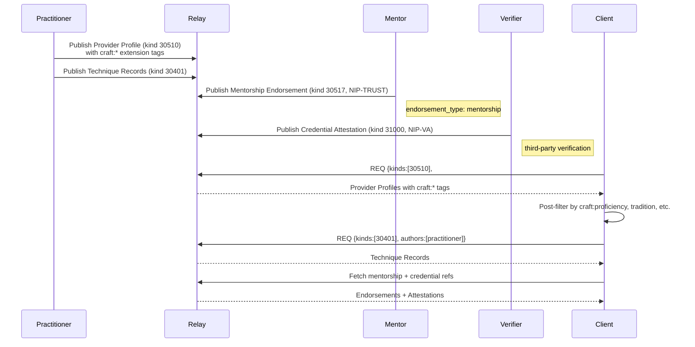

NIP-CRAFTS
==========

Craft Technique Documentation
-------------------------------

`draft` `optional`

One addressable event kind for craft technique documentation on Nostr. Practitioner skill identity composes with NIP-PROVIDER-PROFILES.

> **Standalone usability:** This NIP works independently on any Nostr application. Craft technique documentation and practitioner skill identity compose with NIP-PROVIDER-PROFILES, NIP-MENTORSHIP, NIP-SCARCITY, and NIP-REPUTATION but do not require any of them.

## Motivation

Nostr has no standard for structured craft technique documentation. A heritage craft technique practised by three remaining practitioners has no structured format for preservation. Practitioner skill identity is handled by [NIP-PROVIDER-PROFILES](./NIP-PROVIDER-PROFILES.md) (kind 30510), which already supports `skill`, `credential`, and `domain` tags. This NIP extends that foundation with craft-specific tags and adds a dedicated Technique Record kind for living documentation.

Current approaches lack:

- **Technique preservation** - no standard for documenting craft processes with sufficient structure for discovery, versioning, and licensing
- **Structured skill declaration** - no way to express proficiency levels, specialisms, traditions, or endangerment status in a discoverable, filterable format (addressed here via `craft:*` extension tags on Provider Profiles)
- **Cross-reference to credentials** - no link between self-declared skills and third-party attestations
- **Endangerment awareness** - no way to flag skills or techniques at risk of being lost

## Cross-Domain Evidence

This NIP was promoted from `incubating` after demonstrating demand across 4+ unrelated domains:

| Domain | Use case | Category |
| ------ | -------- | -------- |
| Heritage conservation | Heritage crafts taxonomy - 17 categories, 100+ specialisms, proficiency levels, prerequisite chains for 165 endangered crafts | Built environment |
| Craft/making (therapeutic) | Craft skill identity and technique documentation for pottery, weaving, metalwork, woodcraft | Creative arts |
| Outdoor education | Skill progressions across 20+ National Governing Bodies (Forest School, Mountain Training, RYA, BCU) | Education |
| Veteran support | Military-to-civilian skills translation - mapping military qualifications and experience to civilian job descriptions | Social services |

These domains span built environment, creative arts, education, and social services, confirming the pattern is domain-agnostic.

## Kinds

| Kind  | Description          |
| ----- | -------------------- |
| 30401 | Technique Record     |

---

## Composing with NIP-PROVIDER-PROFILES

A practitioner's skill identity is expressed as a [NIP-PROVIDER-PROFILES](./NIP-PROVIDER-PROFILES.md) `kind:30510` event with `craft:*` extension tags. This avoids a dedicated Skill Profile kind; a Provider Profile is the natural home for "who I am and what I can do." Even a retired master who is not available for hire can use a Provider Profile with no `standing_offer` or availability tags.

Clients that understand crafts read the `craft:*` tags for proficiency levels, tradition, endangerment status, and specialism. Generic clients see a standard provider profile with `domain`, `skill`, and `credential` tags.

### Example: Blacksmith Skill Profile

```json
{
    "kind": 30510,
    "tags": [
        ["d", "<pubkey>_profile"],
        ["alt", "Craft practitioner profile: master blacksmith, architectural ironwork"],
        ["t", "domain:metalwork"],
        ["t", "skill:forge_work"],
        ["t", "skill:wrought_iron"],
        ["t", "credential:worshipful_company_blacksmiths:fellow"],
        ["domain", "metalwork"],
        ["skill", "forge_work"],
        ["skill", "wrought_iron"],
        ["craft:proficiency", "master"],
        ["craft:specialism", "architectural_ironwork"],
        ["craft:years_practising", "28"],
        ["craft:tradition", "english_ornamental_ironwork"],
        ["craft:endangerment", "hca:endangered"],
        ["craft:available_for", "commission"],
        ["craft:available_for", "teaching"],
        ["craft:location", "gcpvhd"],
        ["craft:certification", "worshipful_company_blacksmiths:fellow"],
        ["craft:certification", "hetas:registered_installer"]
    ],
    "content": "Master blacksmith specialising in architectural ironwork..."
}
```

The `craft:*` tags are the extension layer on top of NIP-PROVIDER-PROFILES. The `domain`, `skill`, and `credential` tags (plus their `t`-tag equivalents for relay indexing) follow the standard Provider Profile conventions. The `craft:*` tags add craft-specific semantics that generic clients can safely ignore.

### Craft-Specific Tag Vocabulary

> **Extensibility:** The `craft:*` tag namespace is open. Applications MAY define additional tags following the `craft:<attribute>` convention. The tags listed here are RECOMMENDED for interoperability.

These tags extend a `kind:30510` Provider Profile for craft practitioners:

* `craft:proficiency` (OPTIONAL): Self-assessed proficiency level. One of `awareness`, `developing`, `competent`, `experienced`, `master`.
* `craft:specialism` (OPTIONAL, repeatable): Narrow specialism within a skill (e.g. `hot_lime_plastering` within `lime_work`, `architectural_ironwork` within `forge_work`).
* `craft:years_practising` (OPTIONAL): Years of active practice. Integer as string.
* `craft:tradition` (OPTIONAL): Cultural or regional tradition (e.g. `japanese_joinery`, `welsh_coracle`, `sussex_trug`, `english_ornamental_ironwork`).
* `craft:endangerment` (OPTIONAL): Endangerment status in `registry:status` format (e.g. `hca:critically_endangered`, `unesco:urgent_safeguarding`). See the endangerment registries table below.
* `craft:available_for` (OPTIONAL, repeatable): What the practitioner offers. Values: `teaching`, `commission`, `demonstration`, `documentation`, `assessment`.
* `craft:workshop` (OPTIONAL): Whether the practitioner has a workshop or studio visitors can attend. Boolean as string (`"true"` or `"false"`).
* `craft:certification` (OPTIONAL, repeatable): Certification reference in `body:identifier` format (e.g. `spab:fellow`, `gas_safe:123456`, `cscs:gold`). Works with any certification system worldwide.
* `craft:mentorship_ref` (OPTIONAL, repeatable): Event reference to a [NIP-MENTORSHIP](./NIP-MENTORSHIP.md) endorsement (Kind 30517 with `endorsement_type: "mentorship"`). Links the practitioner's training lineage to their profile.
* `craft:certification_ref` (OPTIONAL, repeatable): Event reference to a [NIP-REPUTATION](./NIP-REPUTATION.md) Credential Attestation (NIP-VA kind 31000). Links third-party credential verification to the profile.
* `craft:scarcity_signal` (OPTIONAL, repeatable): Event reference to a [NIP-SCARCITY](./NIP-SCARCITY.md) signal (Kind 30599). Links the practitioner's skills to active endangerment signals.
* `craft:location` (OPTIONAL): Practitioner's base location as a geohash. Complements the Provider Profile's `coverage_geohash` tags with a single primary location.

### Proficiency Levels

| Level | Meaning |
| ----- | ------- |
| `awareness` | Understands the craft conceptually. Has observed or studied but not practised independently. |
| `developing` | Learning the craft. Can perform basic tasks under guidance. |
| `competent` | Competent practitioner. Can work independently on standard tasks. |
| `experienced` | Highly skilled. Can handle complex, non-standard work and teaches others. |
| `master` | Recognised authority. Defines standards, preserves traditions, certifies others. |

### REQ Filters

Craft practitioners are discovered using standard NIP-PROVIDER-PROFILES filters with craft-specific post-filtering:

```json
[
    {"kinds": [30510], "#t": ["domain:metalwork"]},
    {"kinds": [30510], "#t": ["skill:forge_work"], "#g": ["gcpv"]}
]
```

> **Note:** Tags prefixed with `craft:` are multi-letter tags. Standard relays index only single-letter tags. Discovery SHOULD use `#t` and `#g` filters as shown above. Clients post-filter by `craft:*` tag values (proficiency, tradition, endangerment, etc.) after fetching matching events; these are client-side filters only.

---

## Kind 30401: Technique Record

A documented craft technique - the "living archive" primitive. Each record describes one technique in sufficient detail for another practitioner to learn or reproduce it. Content is the primary value; tags enable discovery and filtering.

```json
{
    "kind": 30401,
    "pubkey": "<practitioner-hex-pubkey>",
    "created_at": 1709740800,
    "tags": [
        ["d", "lime-pointing-flush-finish"],
        ["alt", "Technique record: Flush Lime Pointing with NHL 3.5"],
        ["craft:category", "building_conservation"],
        ["craft:skill", "lime_work"],
        ["craft:technique_name", "Flush Lime Pointing with NHL 3.5"],
        ["craft:difficulty", "intermediate"],
        ["craft:time_estimate", "PT4H"],
        ["craft:tools_required", "pointing trowel, hawk, jointing iron, spray bottle, stiff brush, bucket"],
        ["craft:materials_required", "NHL 3.5 lime putty, sharp sand (washed), clean water"],
        ["craft:tradition", "english_conservation"],
        ["craft:safety_notes", "Lime is caustic - wear nitrile gloves and eye protection. Wash skin contact immediately with clean water. Work in ventilated conditions when mixing dry lime."],
        ["craft:seasonal_constraint", "frost_sensitive"],
        ["craft:media", "https://blossom.example.com/techniques/lime-pointing-step1.jpg"],
        ["craft:media_type", "image/jpeg"],
        ["craft:media", "https://blossom.example.com/techniques/lime-pointing-demo.mp4"],
        ["craft:media_type", "video/mp4"],
        ["craft:endangerment", "hca:at_risk"],
        ["license", "CC-BY-SA-4.0"],
        ["version", "1.2.0"],
        ["L", "craft:category"],
        ["l", "building_conservation", "craft:category"]
    ],
    "content": "## Flush Lime Pointing with NHL 3.5\n\nFlush pointing restores historic masonry joints using natural hydraulic lime, matching the original mortar profile. This technique is appropriate for most pre-1919 buildings with soft brick or stone.\n\n### Preparation\n\n1. Rake out existing joints to a minimum depth of 25mm using a plugging chisel and lump hammer. Never use angle grinders - they damage arrises and leave a smooth surface that prevents adhesion.\n2. Brush out all loose material with a stiff bristle brush.\n3. Dampen joints thoroughly with a spray bottle. The masonry should be damp but not running wet.\n\n### Mix\n\nRatio: 1 part NHL 3.5 to 2.5 parts sharp washed sand (by volume). Add water gradually until the mix holds its shape when squeezed - it should feel like damp brown sugar, not wet cement.\n\n### Application\n\n1. Load the hawk with a small amount of mix.\n2. Push the mix firmly into the joint with a pointing trowel, working from bottom to top.\n3. Compact with a jointing iron, pressing firmly to eliminate voids.\n4. Finish flush with the masonry face - do not leave proud or recessed.\n\n### Aftercare\n\nProtect from direct sun, wind, and frost for a minimum of 72 hours. Mist lightly with water twice daily in warm weather to slow carbonation. NHL 3.5 achieves initial set in 24 hours but full carbonation takes 6-12 months.\n\n### Common Errors\n\n- Using cement or NHL 5 on soft masonry - too hard, causes spalling\n- Insufficient raking depth - mortar falls out within a year\n- Applying in frost - lime will not carbonate below 5\u00b0C\n- Pointing over dry masonry - causes rapid dehydration and crumbling",
    "id": "<32-byte-hex>",
    "sig": "<64-byte-hex>"
}
```

Tags:

* `d` (REQUIRED): Unique identifier for this technique record.
* `craft:category` (REQUIRED): Craft taxonomy category.
* `craft:skill` (REQUIRED): Specific skill this technique belongs to.
* `craft:technique_name` (REQUIRED): Human-readable technique name.
* `craft:difficulty` (OPTIONAL): Difficulty level. One of `beginner`, `intermediate`, `advanced`, `master`.
* `craft:time_estimate` (OPTIONAL): Estimated time to perform the technique. ISO 8601 duration format (e.g. `PT2H` for 2 hours, `P3D` for 3 days).
* `craft:tools_required` (OPTIONAL): Comma-separated list of tools needed.
* `craft:materials_required` (OPTIONAL): Comma-separated list of materials needed.
* `craft:tradition` (OPTIONAL): Cultural or regional origin of the technique.
* `craft:safety_notes` (OPTIONAL): Safety considerations. Implementations SHOULD display these prominently.
* `craft:seasonal_constraint` (OPTIONAL): Seasonal limitations (e.g. `frost_sensitive`, `dry_weather_only`).
* `craft:media` (OPTIONAL, repeatable): URL to media - photo, video, or diagram. Blossom recommended, any URL accepted.
* `craft:media_type` (OPTIONAL): MIME type for the preceding `craft:media` tag.
* `craft:prerequisite` (OPTIONAL, repeatable): Event reference to another Technique Record (Kind 30401) that should be learned first.
* `craft:endangerment` (OPTIONAL): Endangerment status of this specific technique in `registry:status` format.
* `license` (OPTIONAL): Content licence. RECOMMENDED values: `CC-BY-4.0`, `CC-BY-SA-4.0`, `CC-BY-NC-4.0`, `CC0`, `all-rights-reserved`. Defaults to `all-rights-reserved` if omitted.
* `version` (OPTIONAL): Semver version. Practitioners refine technique records over time; version tracking enables consumers to detect updates.
* `L` (OPTIONAL): NIP-32 label namespace - `craft:category`.
* `l` (OPTIONAL): NIP-32 label value under the `craft:category` namespace.
* `content` (REQUIRED): Structured description of the technique. Implementations SHOULD support Markdown formatting. The content is the primary value of the record.

### Restricted Techniques

Certain techniques (e.g. conservation methods that could enable theft if published openly, or safety-critical procedures requiring supervised practice) MAY be encrypted using NIP-44. The tags remain public for discovery; the `content` field is encrypted to authorised recipients.

### REQ Filters

```json
[
    {"kinds": [30401], "#l": ["building_conservation"]},
    {"kinds": [30401], "authors": ["<practitioner-pubkey>"]}
]
```

> **Note:** Tags prefixed with `craft:` are multi-letter tags. Standard relays index only single-letter tags. Discovery SHOULD use `#l` (NIP-32 labels) and `authors` filters as shown above. Clients post-filter by `craft:*` tag values after fetching matching events; these are client-side filters only.

---

## Craft Taxonomy

Top-level categories for `craft:category`. Extensible; implementations MAY add custom categories.

| Category | Description | Example skills |
| -------- | ----------- | -------------- |
| `building_conservation` | Historic building trades | Stone masonry, lime work, thatching, timber framing, lead roofing, dry stone walling, cob building |
| `metalwork` | Metal shaping and fabrication | Forge work, farriery, casting, wrought iron, blade making, armouring, bell founding, gilding |
| `woodcraft` | Wood-based traditional crafts | Green woodworking, coppicing, charcoal burning, coopering, bodging, hurdle making, wheelwrighting, turning |
| `textile_fibre` | Textile and fibre crafts | Spinning, weaving, dyeing (natural), felting, basket weaving, rope making, sail making, lace making |
| `food_production` | Traditional food and drink production | Brewing, milling, cheese making, curing, smoking, beekeeping, heritage breed husbandry, baking (wood-fired) |
| `maritime` | Boat building and seafaring crafts | Clinker planking, caulking, spar making, rigging, net making, sail making, rope splicing |
| `conservation_restoration` | Conservation of objects and interiors | Stained glass, gilding, fresco, bookbinding, clock/horology, furniture restoration, organ building |
| `bushcraft_wilderness` | Wilderness and survival skills | Fire-making, shelter building, foraging, tracking, hide tanning, cordage, natural navigation, water purification |
| `medieval_historical` | Historical and recreationist crafts | Armour making, calligraphy, illumination, pottery, ceramics, leather working, parchment making |
| `garden_landscape` | Traditional garden and land management | Walled gardens, ha-has, period planting, topiary, hedgelaying, coppice management |
| `clinical` | Medical and healthcare skills | Medical procedures, surgical techniques, diagnostic methods, nursing specialisms |
| `engineering` | Regulated engineering trades | Gas fitting, electrical installation, plumbing, HVAC, renewable energy |
| `digital` | Digital and cyber skills | Penetration testing, cloud architecture, data engineering, software development |
| `trade` | Modern building trades | Plastering, tiling, painting, decorating, modern roofing, insulation |

### Endangerment Registries

Endangerment status tags use a `registry:status` format. The registry namespace identifies the source; the status identifies the level.

| Namespace | Registry | Status values |
| --------- | -------- | ------------- |
| `hca` | Heritage Crafts Association Red List (UK) | `critically_endangered`, `endangered`, `at_risk`, `currently_viable` |
| `unesco` | UNESCO Intangible Cultural Heritage | `inscribed`, `urgent_safeguarding`, `best_practice` |
| `custom` | Any registry, self-describing | Free-form |

Implementations MAY define additional registries for national or regional craft endangerment tracking (e.g. Japan's Living National Treasures, France's Compagnonnage, Germany's Meisterbrief system).

---

## Protocol Flow



1. **Discovery:** Client queries for Provider Profiles by domain using relay-indexed `#t` filters, optionally combined with `#g` geohash filters.
2. **Profile retrieval:** Relay returns matching Provider Profiles. Craft-aware clients identify profiles with `craft:*` tags.
3. **Client-side filtering:** Client filters by `craft:proficiency`, `craft:tradition`, `craft:endangerment`, `craft:available_for`, or other craft-specific tags.
4. **Cross-reference resolution:** Client fetches linked mentorship endorsements (NIP-MENTORSHIP), credential attestations (NIP-REPUTATION), and scarcity signals (NIP-SCARCITY) via event reference tags.
5. **Technique browsing:** Client queries Technique Records by the practitioner's pubkey or by category/skill.
6. **Technique retrieval:** Relay returns Technique Records with structured content, media, and metadata.
7. **Engagement:** Client contacts the practitioner via any messaging or coordination protocol. NIP-CRAFTS does not prescribe a coordination layer.

---

## Relationship to Existing NIPs

### NIP-23 (Long-form Content)

NIP-23 (Long-form Content) is generic article publishing. Kind 30401 Technique Records carry structured craft-specific metadata (difficulty levels, tool and material requirements, safety warnings, prerequisite chains, endangerment status) that enables machine-readable discovery, progression tracking, and cross-referencing. A NIP-23 article cannot express prerequisite dependencies or endangerment registries in a relay-filterable way.

### NIP-PROVIDER-PROFILES (Kind 30510)

NIP-PROVIDER-PROFILES defines general-purpose provider profiles for service discovery. Craft practitioner identity composes directly with Provider Profiles using `craft:*` extension tags. This NIP does **not** define a separate Skill Profile kind; the Provider Profile is the canonical home for practitioner identity. See [Composing with NIP-PROVIDER-PROFILES](#composing-with-nip-provider-profiles) above for the full tag vocabulary and example.

### NIP-MENTORSHIP (Kind 30517)

NIP-MENTORSHIP defines mentorship endorsements via enriched NIP-TRUST Provider Endorsements. Provider Profiles with craft extensions MAY reference mentorship endorsements using the `craft:mentorship_ref` tag, linking a practitioner's training lineage to their declared skills. NIP-CRAFTS does **not** duplicate lineage tracking; that is NIP-MENTORSHIP's responsibility.

### NIP-SCARCITY (Kind 30599)

NIP-SCARCITY defines workforce and skill endangerment signals. Provider Profiles with craft extensions MAY reference scarcity signals using the `craft:scarcity_signal` tag, connecting an individual practitioner to broader endangerment data for their skills. The `craft:endangerment` tag on profiles and Technique Records provides a lightweight alternative for cases where no formal scarcity signal exists.

### NIP-REPUTATION (NIP-VA kind 31000)

NIP-REPUTATION defines Credential Attestations for third-party verification of qualifications. Provider Profiles with craft extensions MAY reference credential attestations using the `craft:certification_ref` tag, linking self-declared certifications to independently verified credentials. The `craft:certification` tag provides the self-declared reference; `craft:certification_ref` provides the verifiable attestation.

---

## Security Considerations

* **Skill inflation.** Self-declared proficiency levels carry no inherent trust. Implementations SHOULD cross-reference proficiency claims with mentorship endorsements (NIP-MENTORSHIP), credential attestations (NIP-REPUTATION), completed task history, and portfolio evidence. A `master` proficiency claim with no supporting credentials SHOULD be displayed with appropriate caveats.
* **False credentials.** The `craft:certification` tag is a self-declared string. Implementations SHOULD verify certifications by checking for a corresponding `craft:certification_ref` linking to a NIP-REPUTATION Credential Attestation (NIP-VA kind 31000) from a recognised issuer. Unverified certifications SHOULD be displayed distinctly.
* **Taxonomy pollution.** Custom categories enable extensibility but risk fragmentation. Implementations SHOULD normalise category values (lowercase, underscores) and present standard taxonomy categories preferentially in discovery interfaces.
* **Media integrity.** Portfolio URLs and technique media are external references with no inherent integrity guarantees. Implementations SHOULD verify media availability and MAY use content-addressed storage (e.g. Blossom with hash-based URLs) for tamper evidence. Broken or altered media SHOULD be flagged.
* **Technique safety.** Technique Records MAY contain safety-critical information. Implementations SHOULD prominently display `craft:safety_notes` and SHOULD NOT suppress or collapse safety information. Techniques without safety notes for inherently hazardous crafts (metalwork, chemical processes, working at height) SHOULD display a generic safety warning.
* **Restricted content.** Some techniques should not be freely published (e.g. conservation methods that could enable theft, or procedures requiring supervised practice). Publishers SHOULD use NIP-44 encryption for restricted content and clearly indicate access restrictions.

## Test Vectors

### Kind 30510 with Craft Extensions - Skill Profile

```json
{
  "kind": 30510,
  "pubkey": "a1b2c3d4e5f6a1b2c3d4e5f6a1b2c3d4e5f6a1b2c3d4e5f6a1b2c3d4e5f6a1b2",
  "created_at": 1709740800,
  "tags": [
    ["d", "a1b2c3d4e5f6a1b2c3d4e5f6a1b2c3d4e5f6a1b2c3d4e5f6a1b2c3d4e5f6a1b2_profile"],
    ["alt", "Craft practitioner profile: master blacksmith, architectural ironwork"],
    ["t", "domain:metalwork"],
    ["t", "skill:forge_work"],
    ["t", "skill:wrought_iron"],
    ["t", "credential:worshipful_company_blacksmiths:fellow"],
    ["domain", "metalwork"],
    ["skill", "forge_work"],
    ["skill", "wrought_iron"],
    ["credential", "worshipful_company_blacksmiths:fellow"],
    ["g", "gcp"],
    ["g", "gcpv"],
    ["coverage_geohash", "gcpvh"],
    ["craft:proficiency", "master"],
    ["craft:specialism", "architectural_ironwork"],
    ["craft:years_practising", "28"],
    ["craft:certification", "worshipful_company_blacksmiths:fellow"],
    ["craft:certification", "hetas:registered_installer"],
    ["craft:tradition", "english_ornamental_ironwork"],
    ["craft:endangerment", "hca:endangered"],
    ["craft:available_for", "commission"],
    ["craft:available_for", "teaching"],
    ["craft:location", "gcpvhd"],
    ["craft:workshop", "true"],
    ["craft:mentorship_ref", "dddd4444eeee5555ffff6666aaaa1111bbbb2222cccc3333dddd4444eeee5555", "wss://relay.example.com"],
    ["craft:certification_ref", "eeee5555ffff6666aaaa1111bbbb2222cccc3333dddd4444eeee5555ffff6666", "wss://relay.example.com"]
  ],
  "content": "Third-generation blacksmith working from a coal forge in the Cotswolds. I specialise in architectural ironwork for listed buildings.",
  "id": "<32-byte-hex>",
  "sig": "<64-byte-hex>"
}
```

### Kind 30401 - Technique Record

```json
{
  "kind": 30401,
  "pubkey": "b2c3d4e5f6a1b2c3d4e5f6a1b2c3d4e5f6a1b2c3d4e5f6a1b2c3d4e5f6a1b2c3",
  "created_at": 1709740800,
  "tags": [
    ["d", "lime-pointing-flush-finish"],
    ["alt", "Technique record: Flush Lime Pointing with NHL 3.5"],
    ["craft:category", "building_conservation"],
    ["craft:skill", "lime_work"],
    ["craft:technique_name", "Flush Lime Pointing with NHL 3.5"],
    ["craft:difficulty", "intermediate"],
    ["craft:time_estimate", "PT4H"],
    ["craft:tools_required", "pointing trowel, hawk, jointing iron, spray bottle, stiff brush"],
    ["craft:materials_required", "NHL 3.5 lime putty, sharp sand (washed), clean water"],
    ["craft:tradition", "english_conservation"],
    ["craft:safety_notes", "Lime is caustic - wear nitrile gloves and eye protection. Wash skin contact immediately."],
    ["craft:seasonal_constraint", "frost_sensitive"],
    ["craft:media", "https://blossom.example.com/techniques/lime-pointing-step1.jpg"],
    ["craft:media_type", "image/jpeg"],
    ["craft:endangerment", "hca:at_risk"],
    ["license", "CC-BY-SA-4.0"],
    ["version", "1.2.0"],
    ["L", "craft:category"],
    ["l", "building_conservation", "craft:category"]
  ],
  "content": "## Flush Lime Pointing with NHL 3.5\n\nFlush pointing restores historic masonry joints using natural hydraulic lime, matching the original mortar profile. This technique is appropriate for most pre-1919 buildings with soft brick or stone.\n\n### Preparation\n\n1. Rake out existing joints to a minimum depth of 25mm.\n2. Brush out all loose material.\n3. Dampen joints thoroughly.\n\n### Mix\n\nRatio: 1 part NHL 3.5 to 2.5 parts sharp washed sand (by volume).\n\n### Application\n\n1. Push mix firmly into the joint, working bottom to top.\n2. Compact with a jointing iron.\n3. Finish flush with the masonry face.\n\n### Aftercare\n\nProtect from direct sun, wind, and frost for 72 hours minimum. Mist lightly with water twice daily in warm weather.",
  "id": "<32-byte-hex>",
  "sig": "<64-byte-hex>"
}
```

## Dependencies

* [NIP-01](https://github.com/nostr-protocol/nips/blob/master/01.md): Basic protocol flow, addressable events
* [NIP-32](https://github.com/nostr-protocol/nips/blob/master/32.md): Labelling (category-based relay filtering)
* [NIP-40](https://github.com/nostr-protocol/nips/blob/master/40.md): Expiration timestamps (time-bounded profiles)
* [NIP-44](https://github.com/nostr-protocol/nips/blob/master/44.md): Versioned encrypted payloads (restricted technique content)
* [NIP-PROVIDER-PROFILES](./NIP-PROVIDER-PROFILES.md): Service Provider Profiles (practitioner skill identity)

## Reference Implementation

A reference implementation is available in the [`@trott/sdk`](https://github.com/forgesworn/trott-sdk) TypeScript library, which provides builders and parsers for the kinds defined in this NIP. For standalone use, implementors SHOULD refer to the kind definitions above.

A minimal implementation requires:

1. A Nostr client that supports addressable event publishing, NIP-32 label queries, and NIP-PROVIDER-PROFILES (kind 30510).
2. A technique browser that renders Markdown content with media references and safety notes.
3. Discovery logic that filters Provider Profiles by `craft:*` tags for craft-specific identity.
