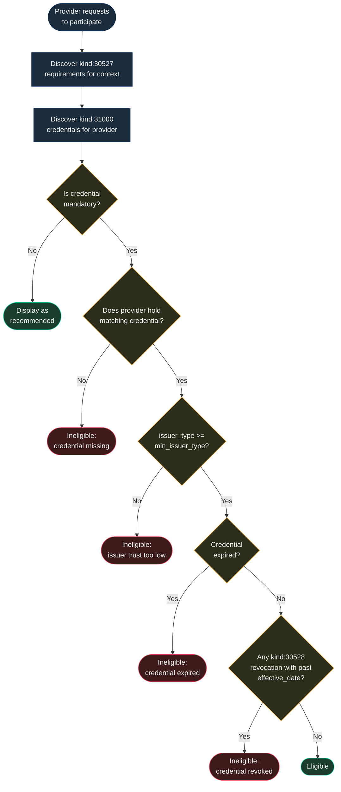

NIP-CREDENTIALS
================

Credential Verification Gating
---------------------------------

`draft` `optional`

Two addressable event kinds for declaring credential requirements and revoking credentials on Nostr. NIP-CREDENTIALS completes the credential lifecycle by composing with any kind 31000 event that carries `credential_type` and `issuer_type` tags, adding the missing primitives for *requiring* credentials (gating) and *revoking* them.

> **Design principle:** Credential requirements are declarations, not enforcement. A requirement event communicates that a credential is expected for participation — enforcement is the responsibility of the consuming application (marketplace, relay, operator).

> **Standalone usability:** This NIP works independently on any Nostr application. Within the TROTT protocol (v0.9), credential gating composes with TROTT-03 (Reputation), TROTT-06 (Coordination), and domain profiles that declare mandatory credentials — but adoption of TROTT is not required.

## Motivation

Nostr has NIP-58 for badges and kind 31000 for credential attestations, but neither provides a standard for **requiring** credentials before participation or **revoking** them after issuance. This creates a gap in the credential lifecycle:

- **No gating standard** — a marketplace that requires Gas Safe registration, a DBS check, or professional indemnity insurance has no machine-readable way to declare those requirements. Each application invents its own scheme.
- **No revocation standard** — re-publishing a kind 31000 event with `["status", "revoked"]` is an ad hoc workaround, but there is no formal revocation event with a reason, effective date, or audit trail. Revocations are indistinguishable from expired credentials.
- **No trust hierarchy** — a self-declared credential and an authority-issued credential are treated identically. Applications need a standard way to specify the minimum issuer trustworthiness they accept.

The credential lifecycle is universal across service domains:

| Phase | Existing standard | Gap |
| ----- | ----------------- | --- |
| **Issue / Attest** | Kind 31000 (`type: credential`) | — |
| **Present / Discover** | Kind 31000 (`type: credential`) | — |
| **Require / Gate** | *None* | **Kind 30527** |
| **Verify** | Application-level | — |
| **Expire** | `expiration` tag on kind 31000 (NIP-40) | — |
| **Renew** | Republish kind 31000 | — |
| **Revoke** | *None (ad hoc workarounds)* | **Kind 30528** |

Evidence from domain analysis shows that 97% of service domains need credential verification — DBS checks, trade licences (Gas Safe, NICEIC), professional registration (SRA, GMC), insurance certificates, vehicle licences, food hygiene ratings, and more. NIP-CREDENTIALS provides the two missing primitives to complete the lifecycle.

## Relationship to Existing NIPs

- **NIP-58 (Badges):** Badges are display-oriented awards designed for profile decoration. They carry no trust hierarchy, no mandatory/optional semantics, no structured gating rules, and no revocation lifecycle. A badge says "you earned this"; a credential requirement says "you must hold this to participate, issued by at least this trust level, or you are ineligible."
- **NIP-32 (Labelling):** Labels are regular events (kind 1985) with no addressability per subject, no per-label revocation, and no structured requirement definitions. Credential requirements need addressable semantics to allow authorities to update requirements over time.
- **NIP-51 (Lists):** Lists could model sets of required credentials, but they lack typed claims with trust levels, mandatory/optional semantics, and expiration. A list of pubkeys is not a credential policy.

## Kinds

| kind  | description              |
| ----- | ------------------------ |
| 30527 | Credential Requirement   |
| 30528 | Credential Revocation    |

> Kinds 30527–30528 — previously 30402–30403, reassigned to avoid conflict with NIP-99 (Classified Listings).

Kind 30527 is an addressable event (NIP-01) — the publisher can update requirements by republishing with the same `d` tag.

Kind 30528 is an addressable event using the **append-only pattern** — each revocation gets a unique `d` tag value so the relay stores every revocation rather than replacing previous ones. Revocations represent immutable facts and MUST NOT be overwritten.

---

## Credential Requirement (`kind:30527`)

Published by a context owner (marketplace, domain operator, community) to declare what credentials are required for participation. Requirements are addressable — the publisher can update them as regulations change.

```json
{
    "kind": 30527,
    "pubkey": "<context-owner-hex-pubkey>",
    "created_at": 1698765000,
    "tags": [
        ["d", "gas_plumbing_marketplace:requirement:gas_safe"],
        ["alt", "Credential requirement: Gas Safe Registration (professional_licence, mandatory)"],
        ["t", "credential-requirement"],
        ["credential_type", "professional_licence"],
        ["credential_name", "Gas Safe Registration"],
        ["min_issuer_type", "industry_body"],
        ["mandatory", "true"],
        ["domain", "plumbing"],
        ["description", "All gas work providers must hold a current Gas Safe registration issued by an industry body or regulatory authority"],
        ["verification_policy", "pre_engagement"],
        ["expiration", "1735689600"]
    ],
    "content": "Gas Safe registration is a legal requirement for anyone working on gas appliances in the United Kingdom. Providers without a current registration MUST NOT be matched to gas-related tasks.",
    // other fields...
}
```

Tags:

* `d` (REQUIRED): Format `<context_id>:requirement:<credential_type_slug>`. Addressable event identifier.
* `t` (REQUIRED): Protocol family marker. MUST be `"credential-requirement"`.
* `credential_type` (REQUIRED): Machine-readable credential type that must be held. Values: `professional_licence`, `background_check`, `insurance`, `certification`, `training`, `peer_endorsement`, `self_declared`.
* `mandatory` (REQUIRED): Boolean string (`"true"` or `"false"`). Whether the credential is mandatory for participation or merely recommended.
* `min_issuer_type` (REQUIRED): Minimum acceptable issuer trustworthiness. One of `authority`, `industry_body`, `operator`, `peer`, `self_declared`. See [Trust Hierarchy](#trust-hierarchy) below.
* `credential_name` (RECOMMENDED): Human-readable name of the required credential (e.g. "Gas Safe Registration", "DBS Enhanced Check", "Professional Indemnity Insurance").
* `domain` (RECOMMENDED): Service domain this requirement applies to. Enables domain-scoped filtering.
* `description` (RECOMMENDED): Human-readable explanation of why this credential is required and what it covers.
* `verification_policy` (RECOMMENDED): When verification must occur. One of `pre_engagement` (before any task matching), `pre_commencement` (before work begins), `periodic` (on a recurring schedule), `on_demand` (when specifically requested).
* `credential_id_pattern` (OPTIONAL): Regex pattern for validating credential IDs (e.g. `^[0-9]{6}$` for a six-digit Gas Safe number).
* `renewal_period_days` (OPTIONAL): Maximum age in days before a credential must be renewed. Applications SHOULD warn providers when their credential is approaching expiry.
* `jurisdiction` (OPTIONAL): ISO 3166-1 alpha-2 country code or ISO 3166-2 region code where this requirement applies (e.g. `GB`, `US-CA`).
* `p` (OPTIONAL): Additional parties to notify of the requirement.
* `e` (OPTIONAL): Event ID of a related context event (e.g. a task announcement or service catalogue entry).
* `expiration` (OPTIONAL): Unix timestamp — requirement expiry (NIP-40). Useful for time-limited regulatory requirements.

**Content:** Plain text or NIP-44 encrypted JSON providing detailed guidance on how to obtain the credential, links to the issuing authority, or application-specific instructions.

### Multiple Requirements

A context owner MAY publish multiple Kind 30527 events with different `d` tags to declare multiple credential requirements. For example, a gas plumbing marketplace might require both Gas Safe registration and public liability insurance:

```json
// Requirement 1: Gas Safe
["d", "gas_plumbing:requirement:gas_safe"]
["credential_type", "professional_licence"]
["mandatory", "true"]

// Requirement 2: Insurance
["d", "gas_plumbing:requirement:public_liability"]
["credential_type", "insurance"]
["mandatory", "true"]
```

Applications SHOULD evaluate all requirements for a context and display the provider's compliance status against each one.

---

## Credential Revocation (`kind:30528`)

Published by an issuer, operator, or regulatory authority to explicitly revoke a previously valid credential. Each revocation is an immutable record with a unique `d` tag value (append-only). Revocations cannot be undone; if a credential is later reinstated, a new kind 31000 attestation MUST be published.

```json
{
    "kind": 30528,
    "pubkey": "<issuer-hex-pubkey>",
    "created_at": 1698800000,
    "tags": [
        ["d", "<subject-pubkey>:revocation:gas_safe:1698800000"],
        ["alt", "Credential revocation: Gas Safe Registration (disciplinary)"],
        ["t", "credential-revocation"],
        ["e", "<credential-attestation-event-id>", "<relay-hint>", "31000"],
        ["p", "<credential-holder-pubkey>"],
        ["credential_type", "professional_licence"],
        ["credential_name", "Gas Safe Registration"],
        ["credential_id", "123456"],
        ["revocation_reason", "disciplinary"],
        ["effective_date", "2024-10-31"],
        ["revocation_details", "Registration suspended following investigation into unsafe installation practices"]
    ],
    "content": "",
    // other fields...
}
```

Tags:

* `d` (REQUIRED): Format `<subject_pubkey>:revocation:<credential_type_slug>:<timestamp>`. Unique per revocation (append-only). The timestamp component ensures multiple revocations for the same credential type are preserved.
* `t` (REQUIRED): Protocol family marker. MUST be `"credential-revocation"`.
* `e` (REQUIRED): Event reference to the kind 31000 credential attestation being revoked. Format: `["e", "<event-id>", "<relay-hint>", "31000"]`.
* `p` (REQUIRED): Pubkey of the credential holder whose credential is being revoked.
* `credential_type` (REQUIRED): Machine-readable type of the credential being revoked. MUST match the `credential_type` on the referenced kind 31000 event.
* `revocation_reason` (REQUIRED): Reason for revocation. One of `expired` (natural expiry, explicitly recorded), `disciplinary` (conduct-related suspension or removal), `superseded` (replaced by an updated credential), `voluntary` (holder voluntarily surrendered), `fraud` (credential obtained fraudulently), `regulatory` (regulatory or legal requirement), `error` (issued in error).
* `effective_date` (REQUIRED): ISO 8601 date when the revocation takes effect (e.g. `2024-10-31`). MAY be in the future for advance notice of revocation.
* `credential_name` (RECOMMENDED): Human-readable name of the revoked credential.
* `credential_id` (RECOMMENDED): External identifier of the revoked credential (licence number, certificate ID).
* `revocation_details` (OPTIONAL): Human-readable explanation providing additional context.
* `reinstatement_eligible` (OPTIONAL): Boolean string (`"true"` or `"false"`). Whether the holder may apply for reinstatement.
* `reinstatement_conditions` (OPTIONAL): Plain text description of conditions for reinstatement (e.g. "Complete retraining programme and pass reassessment").
* `ref` (OPTIONAL): External reference (case number, disciplinary hearing reference).

**Content:** Plain text or NIP-44 encrypted JSON with detailed revocation information. SHOULD be encrypted when the revocation involves sensitive personal details.

### Revocation Authority

Only the original issuer or a recognised authority SHOULD publish revocation events. Applications MUST verify that the `pubkey` on a Kind 30528 event is authorised to revoke the referenced credential. Verification strategies include:

1. **Issuer match** — the revoker's pubkey matches the `pubkey` on the referenced kind 31000 attestation.
2. **Trusted authority list** — the application maintains a list of pubkeys authorised to revoke credentials for a given `credential_type`.

Applications SHOULD reject revocations from unrecognised pubkeys.

---

## Trust Hierarchy

The `min_issuer_type` tag on Kind 30527 and the `issuer_type` tag on kind 31000 together define a trust hierarchy for credential verification. Applications use this hierarchy to determine whether a presented credential meets the requirements:

| Level | `issuer_type` | Description | Example |
| ----- | ------------- | ----------- | ------- |
| 1 (highest) | `authority` | Government body, statutory regulator, or accredited certification body | Gas Safe Register, SRA, GMC, Ofsted |
| 2 | `industry_body` | Professional association, trade body, or recognised industry organisation | NICEIC, Federation of Master Builders, RICS |
| 3 | `operator` | Platform operator or marketplace that has verified the credential through its own processes | A marketplace that checks licence numbers against a registry |
| 4 | `peer` | Another participant who attests to the credential holder's qualification | A fellow tradesperson who has worked alongside the holder |
| 5 (lowest) | `self_declared` | The credential holder's own unverified claim | A provider stating "I am Gas Safe registered" without evidence |

A credential meets a requirement when its `issuer_type` level is **equal to or higher than** the `min_issuer_type` level specified in the requirement. For example:

- Requirement: `min_issuer_type = "industry_body"` (level 2)
- Credential with `issuer_type = "authority"` (level 1) — **accepted** (higher trust)
- Credential with `issuer_type = "industry_body"` (level 2) — **accepted** (equal trust)
- Credential with `issuer_type = "operator"` (level 3) — **rejected** (lower trust)

## Protocol Flow

```
  Context Owner             Relay              Provider             Issuer
      |                       |                    |                   |
      |-- kind:30527 -------->|                    |                   |
      |  (requirement:        |                    |                   |
      |   gas_safe,           |                    |                   |
      |   min: industry_body) |                    |                   |
      |                       |                    |                   |
      |                       |<-- kind:31000 -----|                   |
      |                       |  (attestation:     |                   |
      |                       |   gas_safe,        |<-- kind:31000 ---|
      |                       |   issuer_type:     |  (issued by      |
      |                       |   authority)       |   Gas Safe       |
      |                       |                    |   Register)      |
      |                       |                    |                   |
      |   Application checks: |                    |                   |
      |   authority >= industry_body ✓              |                   |
      |   credential not expired ✓                  |                   |
      |   no kind:30528 revocation ✓                |                   |
      |   → Provider eligible  |                    |                   |
      |                       |                    |                   |
      |                       |                    |   (later...)      |
      |                       |<--------------------------------- kind:30528
      |                       |                    |  (revocation:     |
      |                       |                    |   disciplinary)   |
      |                       |                    |                   |
      |   Application checks: |                    |                   |
      |   revocation exists ✗  |                    |                   |
      |   → Provider ineligible|                    |                   |
```

### Verification Algorithm

Applications verifying a provider's eligibility against credential requirements SHOULD follow this algorithm:

1. **Discover requirements** — subscribe to `kind:30527` events for the relevant context.
2. **Discover credentials** — subscribe to `kind:31000` events for the provider's pubkey, filtered by `credential_type`.
3. **Check trust level** — for each requirement, verify that the credential's `issuer_type` meets or exceeds the `min_issuer_type`.
4. **Check expiry** — verify that the credential's `expiration` tag (if present) is in the future, or that the credential has no expiry.
5. **Check revocation** — subscribe to `kind:30528` events referencing the credential's event ID. If any revocation exists with an `effective_date` in the past, the credential is invalid.
6. **Evaluate mandatory status** — if `mandatory = "true"` and the credential is missing, expired, or revoked, the provider is ineligible.

The following diagram illustrates the verification decision tree:



### REQ Filters

```json
// All credential requirements for a context owner
{"kinds": [30527], "authors": ["<context-owner-pubkey>"]}

// All credentials held by a provider
{"kinds": [31000], "#p": ["<provider-pubkey>"]}

// All revocations for a provider
{"kinds": [30528], "#p": ["<provider-pubkey>"]}

// Revocations for a specific credential attestation
{"kinds": [30528], "#e": ["<credential-attestation-event-id>"]}
```

> **Note:** Filters using multi-letter tag names (e.g. `#credential_type`, `#revocation_reason`) are not supported by relay-side `REQ` filtering. Clients MUST apply these filters locally after fetching events via the single-letter tag filters shown above.

## Use Cases Beyond Task Coordination

### Marketplace Access Control

Any Nostr marketplace can use Kind 30527 to declare entry requirements. A freelance platform might require professional indemnity insurance; a food delivery marketplace might require food hygiene certification. Providers present their kind 31000 attestations, and the marketplace verifies compliance before listing them.

### Community Gating

Nostr communities (NIP-72) can gate membership on credentials. A medical professionals' community might require GMC registration. A legal community might require SRA authorisation. The community moderator publishes Kind 30527 requirements, and applicants present their kind 31000 attestations.

### Relay Access Policies

Relay operators can use Kind 30527 to declare that certain event kinds require credential verification. For example, a relay specialising in financial advice might require FCA authorisation before accepting Kind 30023 long-form content on financial topics.

### Insurance Verification

Event organisers, venue owners, or project managers can require public liability insurance. The requirement specifies `credential_type = "insurance"` and `min_issuer_type = "operator"` (the operator has verified the policy). The insured party presents their kind 31000 attestation with the policy number and expiry date.

### Regulatory Compliance Registries

Industry bodies can publish Kind 30527 events as a machine-readable registry of requirements for their sector, and publish Kind 30528 events as a public revocation feed. Applications subscribe to the revocation feed to maintain real-time awareness of credential status changes.

## Security Considerations

* **Revocation immutability.** Kind 30528 events use the append-only pattern — each revocation MUST have a unique `d` tag. Clients MUST treat revocations as permanent. If a credential is reinstated, a new kind 31000 attestation MUST be issued rather than deleting the revocation.
* **Revocation authority verification.** Applications MUST verify that the publisher of a Kind 30528 event is authorised to revoke the referenced credential. Unverified revocations could be used to deny service to legitimate providers. See [Revocation Authority](#revocation-authority) for verification strategies.
* **Requirement spoofing.** Any pubkey can publish a Kind 30527 event. Applications MUST verify that the requirement publisher is a recognised context owner (marketplace operator, regulatory body, community moderator) before enforcing its requirements. Unauthenticated requirements could be used to exclude providers unfairly.
* **Credential freshness.** Applications SHOULD check both the `expiration` tag on kind 31000 and the `created_at` timestamp. A credential with a valid `expires` date but a very old `created_at` may indicate a stale attestation that has not been re-verified.
* **Replay attacks.** A revoked credential holder might present the original kind 31000 attestation to an application that has not yet received the Kind 30528 revocation. Applications SHOULD subscribe to revocation events in real time and SHOULD NOT rely solely on point-in-time queries.
* **Privacy of revocation reasons.** Revocation reasons (especially `disciplinary` and `fraud`) may involve sensitive personal information. Publishers SHOULD use the encrypted `content` field for detailed revocation circumstances and keep the `revocation_reason` tag to the high-level category only.
* **Self-declared credential inflation.** Requirements with `min_issuer_type = "self_declared"` provide minimal assurance. Applications SHOULD clearly display the issuer type alongside credentials so that users can assess trustworthiness. A self-declared credential is better than no credential, but applications MUST NOT present it as equivalent to an authority-issued one.
* **Cross-relay consistency.** Revocation events may not propagate to all relays immediately. Applications verifying credentials SHOULD query multiple relays and SHOULD treat any valid revocation found on any relay as authoritative.

## Test Vectors

### Kind 30527 — Credential Requirement

```json
{
  "kind": 30527,
  "pubkey": "a1b2c3d4e5f6a1b2c3d4e5f6a1b2c3d4e5f6a1b2c3d4e5f6a1b2c3d4e5f6a1b2",
  "created_at": 1709740800,
  "tags": [
    ["d", "gas_plumbing_marketplace:requirement:gas_safe"],
    ["alt", "Credential requirement: Gas Safe Registration (professional_licence, mandatory)"],
    ["t", "credential-requirement"],
    ["credential_type", "professional_licence"],
    ["credential_name", "Gas Safe Registration"],
    ["min_issuer_type", "industry_body"],
    ["mandatory", "true"],
    ["domain", "plumbing"],
    ["description", "All gas work providers must hold a current Gas Safe registration issued by an industry body or regulatory authority"],
    ["verification_policy", "pre_engagement"],
    ["jurisdiction", "GB"]
  ],
  "content": "Gas Safe registration is a legal requirement for anyone working on gas appliances in the United Kingdom. Apply at https://www.gassaferegister.co.uk/",
  "id": "<32-byte-hex>",
  "sig": "<64-byte-hex>"
}
```

### Kind 30527 — Insurance Requirement

```json
{
  "kind": 30527,
  "pubkey": "a1b2c3d4e5f6a1b2c3d4e5f6a1b2c3d4e5f6a1b2c3d4e5f6a1b2c3d4e5f6a1b2",
  "created_at": 1709740800,
  "tags": [
    ["d", "gas_plumbing_marketplace:requirement:public_liability"],
    ["alt", "Credential requirement: Public Liability Insurance (insurance, mandatory)"],
    ["t", "credential-requirement"],
    ["credential_type", "insurance"],
    ["credential_name", "Public Liability Insurance"],
    ["min_issuer_type", "operator"],
    ["mandatory", "true"],
    ["domain", "plumbing"],
    ["description", "Minimum £2,000,000 public liability insurance cover required"],
    ["verification_policy", "pre_engagement"]
  ],
  "content": "",
  "id": "<32-byte-hex>",
  "sig": "<64-byte-hex>"
}
```

### Kind 30528 — Credential Revocation (Disciplinary)

```json
{
  "kind": 30528,
  "pubkey": "c3d4e5f6a1b2c3d4e5f6a1b2c3d4e5f6a1b2c3d4e5f6a1b2c3d4e5f6a1b2c3d4",
  "created_at": 1709740800,
  "tags": [
    ["d", "b2c3d4e5f6a1b2c3d4e5f6a1b2c3d4e5f6a1b2c3d4e5f6a1b2c3d4e5f6a1b2c3:revocation:professional_licence:1709740800"],
    ["alt", "Credential revocation: Gas Safe Registration (disciplinary)"],
    ["t", "credential-revocation"],
    ["e", "dddd4444eeee5555ffff6666aaaa1111bbbb2222cccc3333dddd4444eeee5555", "wss://relay.example.com", "31000"],
    ["p", "b2c3d4e5f6a1b2c3d4e5f6a1b2c3d4e5f6a1b2c3d4e5f6a1b2c3d4e5f6a1b2c3"],
    ["credential_type", "professional_licence"],
    ["credential_name", "Gas Safe Registration"],
    ["credential_id", "123456"],
    ["revocation_reason", "disciplinary"],
    ["effective_date", "2024-03-06"],
    ["revocation_details", "Registration suspended following investigation into unsafe installation practices"],
    ["reinstatement_eligible", "true"],
    ["reinstatement_conditions", "Complete approved retraining programme and pass reassessment within 12 months"]
  ],
  "content": "",
  "id": "<32-byte-hex>",
  "sig": "<64-byte-hex>"
}
```

### Kind 30528 — Credential Revocation (Superseded)

```json
{
  "kind": 30528,
  "pubkey": "c3d4e5f6a1b2c3d4e5f6a1b2c3d4e5f6a1b2c3d4e5f6a1b2c3d4e5f6a1b2c3d4",
  "created_at": 1709740800,
  "tags": [
    ["d", "b2c3d4e5f6a1b2c3d4e5f6a1b2c3d4e5f6a1b2c3d4e5f6a1b2c3d4e5f6a1b2c3:revocation:certification:1709740800"],
    ["alt", "Credential revocation: NICEIC Approved Contractor (superseded)"],
    ["t", "credential-revocation"],
    ["e", "eeee5555ffff6666aaaa1111bbbb2222cccc3333dddd4444eeee5555ffff6666", "wss://relay.example.com", "31000"],
    ["p", "b2c3d4e5f6a1b2c3d4e5f6a1b2c3d4e5f6a1b2c3d4e5f6a1b2c3d4e5f6a1b2c3"],
    ["credential_type", "certification"],
    ["credential_name", "NICEIC Approved Contractor"],
    ["revocation_reason", "superseded"],
    ["effective_date", "2024-03-06"],
    ["revocation_details", "Replaced by updated certification following annual reassessment"]
  ],
  "content": "",
  "id": "<32-byte-hex>",
  "sig": "<64-byte-hex>"
}
```

## Relationship to Existing NIPs

### Kind 31000 Credential Attestations

NIP-CREDENTIALS **composes with** kind 31000 credential attestation events rather than replacing them. A kind 31000 event with `credential_type` and `issuer_type` tags is the canonical event for recording a credential: who holds it, what it is, who issued it, and when it expires. NIP-CREDENTIALS adds the two missing lifecycle phases:

- **Kind 30527** (Credential Requirement) — declares *what credentials are needed* in a given context
- **Kind 30528** (Credential Revocation) — records *when a credential is no longer valid*

Together, the three kinds complete the credential lifecycle: require (30527) -> attest (31000) -> revoke (30528).

### NIP-58 (Badges)

NIP-58 provides a general-purpose badge system. Badges are well suited for achievements and recognitions but lack the structured fields needed for professional credential verification — expiry dates, issuer types, verification URLs, credential IDs, and revocation. NIP-CREDENTIALS is complementary: badges celebrate; credentials gate.

### NIP-TRUST (Portable Trust Networks)

NIP-TRUST defines trust delegation and network membership. Credential requirements (Kind 30527) can reference trusted issuers from NIP-TRUST networks — for example, a requirement might accept credentials from any pubkey that is a member of a specific trust network.

### NIP-APPROVAL (Multi-Party Approval Gates)

NIP-APPROVAL provides workflow gating on human decisions. NIP-CREDENTIALS provides gating on verifiable qualifications. The two compose naturally: an approval gate (Kind 30570) might require that the approver holds a specific credential (verified via kind 31000 against a Kind 30527 requirement).

## Dependencies

* [NIP-01](https://github.com/nostr-protocol/nips/blob/master/01.md): Basic protocol flow, addressable events
* [NIP-40](https://github.com/nostr-protocol/nips/blob/master/40.md): Expiration timestamps (time-limited requirements)
* [NIP-44](https://github.com/nostr-protocol/nips/blob/master/44.md): Versioned encrypted payloads (sensitive revocation details)

[NIP-VA](https://github.com/forgesworn/nostr-attestations/blob/main/NIP-VA.md) (kind 31000 Verifiable Attestations) is a recommended companion for credential issuance. NIP-CREDENTIALS works with any kind 31000 event that includes the required credential tags (`credential_type`, `issuer_type`).

## Relationship to TROTT-00 Patterns

NIP-CREDENTIALS is a standalone NIP. Within the TROTT protocol, credential gating composes with other TROTT-00 patterns:

- **P1 (Approval Gate)** — An approval gate (Kind 30570) can require the approver to hold specific credentials, verified against Kind 30527 requirements.
- **P5 (Evidence Recording)** — Credential verification evidence (Kind 30578) can record the outcome of a credential check, providing an audit trail.
- **TROTT-06 (Coordination)** — Operators can publish Kind 30527 requirements as part of their onboarding configuration, ensuring providers meet regulatory standards before joining the platform.

These compositions are optional. NIP-CREDENTIALS works without any TROTT-00 patterns.

## Reference Implementation

The [`@trott/sdk`](https://github.com/TheCryptoDonkey/trott-sdk) TypeScript library provides builders and parsers for the credential kinds defined in this NIP. For standalone use without TROTT, implementors SHOULD refer to the kind definitions above.

A minimal implementation requires:

1. A Nostr client that supports addressable event publishing and subscription filtering by `#p` and `#e` tags.
2. Credential matching logic that compares kind 31000 attestations against Kind 30527 requirements using the trust hierarchy.
3. Revocation checking that subscribes to Kind 30528 events and invalidates credentials with effective revocation dates in the past.
4. Expiry monitoring that tracks the `expiration` tag on kind 31000 events and warns holders before credentials lapse.
