NIP-CUSTODY
===========

Chain-of-Custody Tracking
---------------------------

`draft` `optional`

Two event kinds for recording verified handoffs of physical or digital assets on Nostr — a custody transfer event records each handoff, and a custody evidence event documents the condition of the asset at each transfer point.

> **Design principle:** Custody events create an append-only chain of signed records. Each transfer is independently verifiable — any party can reconstruct the full chain by following event references from the most recent transfer back to the origin.

> **Standalone usability:** This NIP works independently on any Nostr application. Within the [TROTT protocol](https://github.com/forgesworn/nip-drafts) (v0.9), it is pattern P2 in TROTT-00: Core Patterns. TROTT composes custody transfers with task lifecycle states, domain-specific handoff requirements (freight, delivery, asset rental), and compliance records — but adoption of TROTT is not required.

## Motivation

Nostr excels at publishing and discovering content, but has no standard for tracking the **physical custody of assets** as they move between parties. Many real-world workflows need an auditable chain of custody:

- **Marketplace handoffs** — verifying that a sold item was handed to the buyer in good condition
- **Ticket transfers** — recording the chain of ownership for event tickets or credentials
- **Equipment rentals** — documenting asset condition at checkout and return
- **Supply chain tracking** — multi-leg relay with condition documentation at each handoff point
- **Art & collectibles** — provenance tracking for physical items

Without a standard, applications either skip custody tracking entirely or build proprietary solutions. NIP-CUSTODY provides a minimal, append-only primitive for recording asset handoffs with optional condition evidence.

## Relationship to Existing NIPs

- **NIP-EVIDENCE (kind 30578):** Custody evidence (kind 30573) is intentionally a specialised form of evidence. It carries a `custody_handoff_ref` tag linking it to a specific transfer in the chain, enabling verifiable multi-leg audit trails. Applications that do not need chain-linked evidence MAY use kind 30578 (NIP-EVIDENCE) with a custody-transfer `e` tag as an alternative. The dedicated kind enables relay-side filtering of custody evidence without downloading all evidence records.
- **NIP-94 (File Metadata):** NIP-94 covers file hashing and media metadata but not evidence context: capture conditions, geolocation at time of capture, condition grading, or chain linkage. Custody evidence extends beyond file metadata into structured inspection records.

## Kinds

| kind  | description       |
| ----- | ----------------- |
| 30572 | Custody Transfer  |
| 30573 | Custody Evidence  |

Kind 30572 and 30573 are addressable events (NIP-01) but use the **append-only pattern** — each event gets a unique `d` tag value (incorporating a sequence number) so the relay stores every record rather than replacing previous ones. These kinds represent immutable handoff records that MUST NOT be overwritten.

---

## Custody Transfer (`kind:30572`)

Published by the outgoing custodian to record a handoff. Each transfer gets a unique `d` tag value so relays store every handoff record in the chain.

```json
{
    "kind": 30572,
    "pubkey": "<outgoing-custodian-hex-pubkey>",
    "created_at": 1698767000,
    "tags": [
        ["d", "item_sale_001:custody:handoff_01"],
        ["t", "custody-transfer"],
        ["custody_from", "<outgoing-custodian-hex-pubkey>"],
        ["custody_to", "<incoming-receiver-hex-pubkey>"],
        ["asset_id", "item_sale_001"],
        ["condition_grade", "good"],
        ["condition_evidence", "<kind-30573-event-id>"],
        ["asset_type", "parcel"],
        ["g", "gcpuuz"]
    ],
    "content": "Handoff at agreed meeting point. Item matches listing description. Packaging intact.",
    "id": "<32-bytes lowercase hex>",
    "sig": "<64-bytes lowercase hex>"
}
```

Tags:

* `d` (REQUIRED): Format `<context_id>:custody:<sequence>`. Unique per transfer (append-only).
* `t` (REQUIRED): Protocol family marker. MUST be `"custody-transfer"`.
* `custody_from` (REQUIRED): Hex pubkey of the outgoing custodian.
* `custody_to` (REQUIRED): Hex pubkey of the incoming receiver.
* `asset_id` (REQUIRED): Identifier for the asset being transferred.
* `condition_grade` (RECOMMENDED): Condition at time of handoff. One of `"excellent"`, `"good"`, `"fair"`, or `"damaged"`.
* `condition_evidence` (RECOMMENDED): Event ID of a Kind 30573 documenting condition.
* `p` (RECOMMENDED): Other parties to notify.
* `g` (RECOMMENDED): Geohash of the handoff location.
* `custody_handoff_ref` (OPTIONAL): Event ID of the previous custody transfer in the chain.
* `asset_type` (OPTIONAL): Category: `vehicle`, `tool`, `parcel`, `material`, `equipment`, `ticket`, `document`.
* `ref` (OPTIONAL): External reference (waybill number, tracking ID, order number).
* `e` (OPTIONAL): Reference to a related event.

**Content:** Plain text or NIP-44 encrypted JSON with handoff notes (e.g. seal numbers, temperature readings, special handling instructions).

---

## Custody Evidence (`kind:30573`)

Published by either party at the time of a custody transfer to document the condition of an asset. Multiple evidence events may be published per transfer — each gets a unique `d` tag.

```json
{
    "kind": 30573,
    "pubkey": "<outgoing-custodian-hex-pubkey>",
    "created_at": 1698767100,
    "tags": [
        ["d", "item_sale_001:custody:handoff_01:evidence:01"],
        ["t", "custody-evidence"],
        ["e", "<custody-transfer-event-id>", "wss://relay.example.com"],
        ["evidence_type", "photo"],
        ["condition_grade", "good"],
        ["file_hash", "sha256:9f86d081884c7d659a2feaa0c55ad015a3bf4f1b2b0b822cd15d6c15b0f00a08"],
        ["captured_at", "1698767050"],
        ["asset_id", "item_sale_001"],
        ["g", "gcpuuz"],
        ["mime_type", "image/jpeg"]
    ],
    "content": "<NIP-44 encrypted JSON: {\"url\":\"https://cdn.example.com/custody/handoff_photo.jpg\",\"thumbnail_url\":\"https://cdn.example.com/custody/handoff_photo_thumb.jpg\"}>",
    "id": "<32-bytes lowercase hex>",
    "sig": "<64-bytes lowercase hex>"
}
```

Tags:

* `d` (REQUIRED): Format `<custody_d_tag>:evidence:<sequence>`. Unique per evidence item (append-only).
* `t` (REQUIRED): Protocol family marker. MUST be `"custody-evidence"`.
* `e` (REQUIRED): Event ID of the Kind 30572 custody transfer event.
* `evidence_type` (REQUIRED): Type of evidence. One of `"photo"`, `"video"`, `"document"`, `"reading"`.
* `condition_grade` (RECOMMENDED): Condition assessment. One of `"excellent"`, `"good"`, `"fair"`, or `"damaged"`.
* `file_hash` (RECOMMENDED): `sha256:<hex>` hash of the evidence file.
* `captured_at` (RECOMMENDED): Unix timestamp when the evidence was captured.
* `g` (RECOMMENDED): Geohash of the location where evidence was captured.
* `asset_id` (RECOMMENDED): Asset being documented.
* `mime_type` (OPTIONAL): MIME type of the evidence file.

**Content:** NIP-44 encrypted JSON containing the evidence URL and optional thumbnail URL: `{"url": "...", "thumbnail_url": "..."}`. For `reading` evidence types, content MAY be plain text (e.g. temperature reading, weight measurement).

---

## Protocol Flow

```
  Custodian A                    Relay                     Receiver B
      |                            |                            |
      |-- kind:30573 Evidence ---->|  (departure condition)     |
      |                            |                            |
      |-- kind:30572 Transfer ---->|                            |
      |  (custody_from: A,         |                            |
      |   custody_to: B)           |------- notification ------>|
      |                            |                            |
      |                            |<-- kind:30573 Evidence ----|
      |                            |    (receipt condition)      |
      |<------ notification -------|                            |
      |                            |                            |
      |  B is now the custodian    |                            |
      |                            |                            |
```

1. **Evidence (optional):** Outgoing custodian publishes `kind:30573` documenting the asset's condition before handoff.
2. **Transfer:** Outgoing custodian publishes `kind:30572` recording that custody has passed to the receiver.
3. **Receipt evidence (optional):** Incoming receiver publishes `kind:30573` documenting the asset's condition upon receipt.
4. **Chain continues:** If the asset moves to another party, the new custodian publishes another `kind:30572` with a `custody_handoff_ref` pointing to the previous transfer.

## Chain of Custody

Multiple custody transfers form a verifiable chain. Each subsequent Kind 30572 SHOULD include a `custody_handoff_ref` tag pointing to the previous transfer event ID. Clients can reconstruct the full chain by following these references from the most recent transfer back to the origin.

```
  Origin          Leg 1           Leg 2           Leg 3
    |               |               |               |
    +-- 30572 ---->-+-- 30572 ---->-+-- 30572 ---->-+
    |  (A -> B)     |  (B -> C)     |  (C -> D)     |
    |               |               |               |
    +-- 30573       +-- 30573       +-- 30573       +-- 30573
    (departure)     (receipt/       (receipt/        (receipt)
                     departure)      departure)
```

The following diagram illustrates a three-leg delivery chain with evidence at each handoff:

```mermaid
sequenceDiagram
    autonumber
    participant A as Sender
    participant R as Relay
    participant B as Courier
    participant C as Hub
    participant D as Recipient

    rect rgb(27, 45, 61)
        Note over A,D: Leg 1 — Sender to Courier
        A->>R: kind:30573 Evidence<br/>departure condition photo
        A->>R: kind:30572 Transfer<br/>custody_from: A, custody_to: B<br/>condition_grade: excellent
        R-->>B: Notification
        B->>R: kind:30573 Evidence<br/>receipt condition confirmed
    end

    rect rgb(45, 45, 27)
        Note over A,D: Leg 2 — Courier to Hub
        B->>R: kind:30573 Evidence<br/>departure scan
        B->>R: kind:30572 Transfer<br/>custody_from: B, custody_to: C<br/>custody_handoff_ref: Leg 1 event ID
        R-->>C: Notification
        C->>R: kind:30573 Evidence<br/>receipt condition: good
    end

    rect rgb(27, 61, 45)
        Note over A,D: Leg 3 — Hub to Recipient
        C->>R: kind:30573 Evidence<br/>departure condition
        C->>R: kind:30572 Transfer<br/>custody_from: C, custody_to: D<br/>custody_handoff_ref: Leg 2 event ID
        R-->>D: Notification
        D->>R: kind:30573 Evidence<br/>delivery confirmed, photo
    end

    Note over A,D: Full chain verifiable:<br/>Transfer 1 ← Transfer 2 ← Transfer 3<br/>Each linked by custody_handoff_ref
```



## Use Cases Beyond TROTT

### Nostr Marketplace Item Handoffs

When a buyer purchases an item via a Nostr marketplace (NIP-15), the seller can publish a `kind:30572` transfer recording the handoff with condition evidence. This creates a verifiable record that the item was delivered in the described condition — useful for dispute resolution and seller reputation.

### Event Ticket Transfers

Nostr-based event ticketing systems can use custody transfers to record ticket ownership changes. Each transfer creates an auditable chain of ownership, preventing duplicate transfers and enabling organisers to verify the current ticket holder.

### Equipment Rental & Return

Rental platforms on Nostr can use custody transfers at both checkout and return. Condition evidence (`kind:30573`) at each point documents the asset's state, providing clear records if damage disputes arise. The `condition_grade` tag enables automated damage detection workflows.

### Collectibles & Art Provenance

Physical art or collectible marketplaces can use the custody chain to build provenance records. Each transfer between owners is cryptographically signed and timestamped, creating an immutable ownership history that adds value to the item.

### Delivery & Courier Services

Chain-of-custody tracking maps naturally to package delivery:

1. **Sender** creates custody transfer (kind:30572) when handing package to courier
2. **Courier** signs custody evidence (kind:30573) with photo/signature at pickup
3. At each relay point, a new custody transfer + evidence pair records the handoff
4. **Recipient** signs final custody evidence confirming delivery

Each handoff can reference NIP-LOCATION for GPS verification of the transfer location, providing cryptographic proof that the handoff occurred at the expected coordinates.

## Security Considerations

* **Chain integrity.** Implementations SHOULD verify that each Kind 30572 in a custody chain is signed by the pubkey listed as `custody_to` in the previous transfer (or the original custodian for the first transfer). Breaks in the chain SHOULD be flagged to all participants.
* **Evidence integrity.** All evidence events (Kind 30573) SHOULD include a `file_hash` tag with the SHA-256 hash of any attached file. Consumers MUST verify the hash before trusting the evidence content.
* **Append-only semantics.** Custody transfer and evidence events are semantically append-only. Although they are addressable events (and relays MAY accept replacements), clients MUST treat the first valid instance as canonical. A custody transfer, once published, represents a real-world physical handoff that cannot be undone by republishing.
* **Content encryption.** When events contain sensitive information (addresses, personal details, condition reports), the content SHOULD be encrypted using NIP-44 to relevant parties.
* **Timestamp verification.** Clients SHOULD cross-reference `created_at` timestamps with `captured_at` on evidence events. Large discrepancies MAY indicate fabricated evidence.

## Test Vectors

### Kind 30572 — Custody Transfer

```json
{
  "kind": 30572,
  "pubkey": "a1b2c3d4e5f6a1b2c3d4e5f6a1b2c3d4e5f6a1b2c3d4e5f6a1b2c3d4e5f6a1b2",
  "created_at": 1709740800,
  "tags": [
    ["d", "item_sale_001:custody:handoff_01"],
    ["t", "custody-transfer"],
    ["custody_from", "a1b2c3d4e5f6a1b2c3d4e5f6a1b2c3d4e5f6a1b2c3d4e5f6a1b2c3d4e5f6a1b2"],
    ["custody_to", "b2c3d4e5f6a1b2c3d4e5f6a1b2c3d4e5f6a1b2c3d4e5f6a1b2c3d4e5f6a1b2c3"],
    ["asset_id", "item_sale_001"],
    ["condition_grade", "good"],
    ["condition_evidence", "aaaa1111bbbb2222cccc3333dddd4444eeee5555ffff6666aaaa1111bbbb2222"],
    ["asset_type", "parcel"],
    ["g", "gcpuuz"]
  ],
  "content": "Handoff at agreed meeting point. Item matches listing description. Packaging intact.",
  "id": "<32-byte-hex>",
  "sig": "<64-byte-hex>"
}
```

### Kind 30573 — Custody Evidence

```json
{
  "kind": 30573,
  "pubkey": "a1b2c3d4e5f6a1b2c3d4e5f6a1b2c3d4e5f6a1b2c3d4e5f6a1b2c3d4e5f6a1b2",
  "created_at": 1709740800,
  "tags": [
    ["d", "item_sale_001:custody:handoff_01:evidence:01"],
    ["t", "custody-evidence"],
    ["e", "aaaa1111bbbb2222cccc3333dddd4444eeee5555ffff6666aaaa1111bbbb2222", "wss://relay.example.com"],
    ["evidence_type", "photo"],
    ["condition_grade", "good"],
    ["file_hash", "sha256:9f86d081884c7d659a2feaa0c55ad015a3bf4f1b2b0b822cd15d6c15b0f00a08"],
    ["captured_at", "1709740800"],
    ["asset_id", "item_sale_001"],
    ["g", "gcpuuz"],
    ["mime_type", "image/jpeg"]
  ],
  "content": "<NIP-44 encrypted JSON: {\"url\":\"https://cdn.example.com/custody/handoff_photo.jpg\",\"thumbnail_url\":\"https://cdn.example.com/custody/handoff_photo_thumb.jpg\"}>",
  "id": "<32-byte-hex>",
  "sig": "<64-byte-hex>"
}
```

## Dependencies

* [NIP-01](https://github.com/nostr-protocol/nips/blob/master/01.md): Basic protocol flow, addressable events
* [NIP-44](https://github.com/nostr-protocol/nips/blob/master/44.md): Versioned encrypted payloads (sensitive custody details, evidence URLs)
* [NIP-LOCATION](./NIP-LOCATION.md): Handoff location verification via progressive location reveal

## Reference Implementation

The `@trott/sdk` (TypeScript SDK) provides builders and parsers for both kinds defined in this NIP. For standalone use without TROTT, implementors SHOULD refer to the kind definitions above.

A minimal implementation requires:

1. A Nostr client that supports addressable event publishing.
2. Logic to build and verify custody chains by following `custody_handoff_ref` references.
3. Evidence integrity verification (SHA-256 hash checking for attached files).
