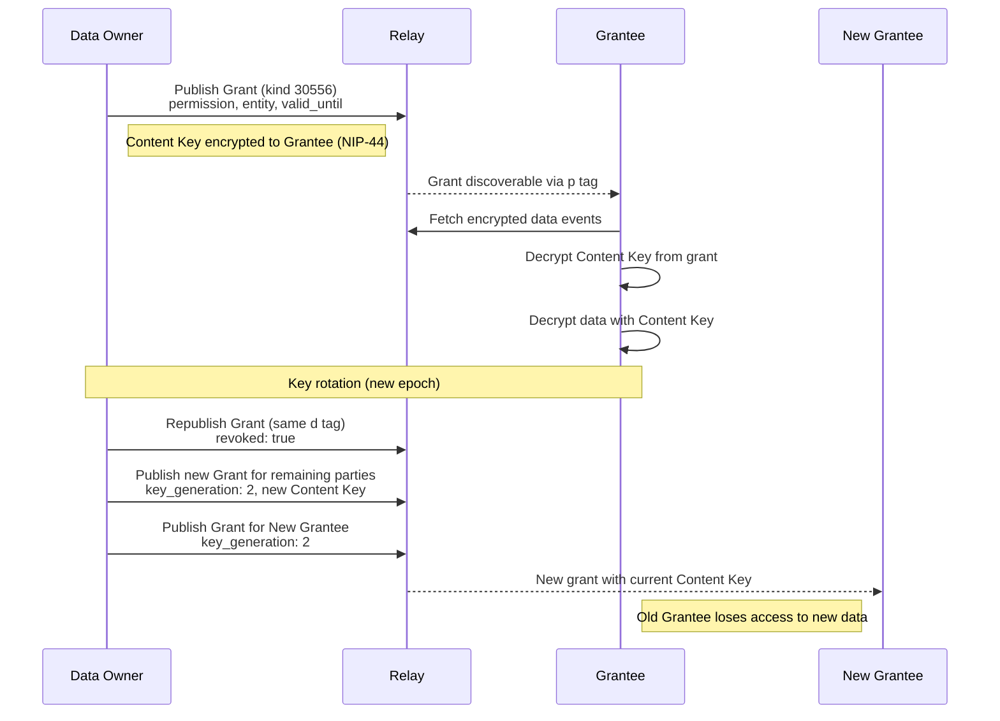

NIP-DATA-ACCESS
================

Scoped, Revocable Data Access Grants
----------------------------------------

`draft` `optional`

One addressable event kind for granting a third party scoped, time-bounded, revocable access to encrypted data on Nostr. The grantor specifies which event kinds the grantee may read or write, which entities the data pertains to, when access expires, and provides decryption key material encrypted to the grantee's pubkey using NIP-44.

> **Design principle:** Data Access Grants authorise *reading and writing encrypted data*. They do not authorise *acting on behalf of* another party. This is distinct from NIP-26 delegation, which authorises signing events as if you were the delegator.

> **Standalone usability:** This NIP works independently on any Nostr application. Data access grants compose naturally with compliance records, PII envelopes, and dispute resolution systems, but adoption of any specific external project is not required.

## Motivation

Many Nostr applications need to share encrypted data with third parties without granting full identity delegation. Consider:

- A **parent** wants an AI tutor to read their child's learning records but not impersonate the parent
- A **patient** wants a specialist to access medical records for a referral but only for a limited time
- An **account holder** wants a financial adviser to review transaction history without gaining signing authority
- A **data controller** needs to grant an auditor read access to compliance records with a clear expiry

NIP-44 encrypts content between two parties, but there is no standard mechanism for:

- **Scoping** access to specific event kinds and entities
- **Time-bounding** access with automatic expiry
- **Revoking** access without rotating the data owner's keypair
- **Distributing** a shared Content Key to multiple recipients efficiently
- **Auditing** who was granted access and when

NIP-DATA-ACCESS fills this gap with a minimal, auditable access grant primitive.

## Kinds

| kind  | description        |
| ----- | ------------------ |
| 30556 | Data Access Grant  |

Kind 30556 is an addressable event (NIP-01). The `d` tag ensures uniqueness per grantor-grantee combination. Re-publishing with the same `d` tag replaces the previous grant (used for revocation and key rotation).

---

## Data Access Grant (`kind:30556`)

Published by a data owner (grantor) to authorise a third party (grantee) to read and/or write encrypted data. The grantee operates under their own identity but gains access to data they would otherwise be unable to decrypt.

```json
{
    "kind": 30556,
    "pubkey": "<grantor-hex-pubkey>",
    "created_at": 1707500000,
    "tags": [
        ["d", "<grantor_pubkey>:access_grant:<grantee_pubkey>:finance"],
        ["p", "<grantee-hex-pubkey>"],
        ["grantee_type", "human"],
        ["permission", "read:30700"],
        ["permission", "read:30701"],
        ["permission", "write:30702"],
        ["entity", "<entity_event_id_1>"],
        ["entity", "<entity_event_id_2>"],
        ["valid_until", "1710000000"],
        ["alt", "Data access grant: read/write finance data, expires 1710000000"],
        ["purpose", "annual_audit"]
    ],
    "content": "<NIP-44 encrypted to grantee: decryption keys for specified entities>",
    "id": "<32-byte-hex>",
    "sig": "<64-byte-hex>"
}
```

### Tag Reference

| Tag              | Required    | Description                                                                                                                                                       |
|------------------|-------------|-------------------------------------------------------------------------------------------------------------------------------------------------------------------|
| `d`              | Yes         | `<grantor_pubkey>:access_grant:<grantee_pubkey>:<scope>`. Unique per grantor per grantee per scope. The `<scope>` segment is application-defined (e.g. a domain name, a project identifier, or any string that distinguishes grants to the same grantee). |
| `p`              | Yes         | Grantee's Nostr pubkey (the party receiving access).                                                                                                              |
| `grantee_type`   | Recommended | Type of grantee: `human`, `ai_agent`, `operator`, `service`.                                                                                                      |
| `permission`     | Yes         | One `action:kind` pair per tag (e.g. `read:30700`). Repeatable. Actions are `read` and `write`.                                                                    |
| `entity`         | Yes         | Event ID of an entity the grant covers (e.g. learner profile ID, patient record ID, account reference). Repeatable.                                                |
| `valid_from`     | Optional    | Unix timestamp when access begins. Defaults to event `created_at`.                                                                                                |
| `valid_until`    | Yes         | Unix timestamp when access expires. Grantors SHOULD also include a NIP-40 `expiration` tag matching `valid_until` to enable relay-side garbage collection of expired grants. |
| `revoked`        | Optional    | Set to `true` to revoke an active grant.                                                                                                                          |
| `purpose`        | Recommended | Why access is being granted (e.g. `tutoring`, `medical_consultation`, `legal_review`, `annual_audit`).                                                            |
| `domain`         | Optional    | Application domain this grant applies to (e.g. `education`, `healthcare`, `finance`). Useful for filtering and scoping but not structurally required.              |
| `reference`      | Optional    | Event ID of a related event this grant pertains to (e.g. an appointment, a project, a case file). Applications MAY use this to link grants to specific workflows.  |
| `key_generation` | Optional    | Monotonically increasing integer (starting from 1). Tracks which Content Key generation this grant covers. See [Forward-Only Revocation](#forward-only-revocation). |

All grants are revocable by the grantor publishing a replacement event with `["revoked", "true"]`. There is no `revocable` tag; revocability is an inherent property of addressable events.

---

## Content Field

The `content` field carries decryption key material, NIP-44 encrypted to the grantee's pubkey.

### Single-Key Variant

When all entities in the grant share a single Content Key:

```json
{
  "content_key": "<hex-encoded 256-bit Content Key>",
  "key_id": "<unique identifier for this CK>",
  "algorithm": "chacha20-poly1305"
}
```

This JSON object is NIP-44 encrypted to the grantee as a whole. The `content_key` value is the raw symmetric key. The `key_id` allows grantees to correlate which CK decrypts which content without trial decryption.

### Multi-Key Variant

When a grant covers multiple entities and each entity uses a different Content Key:

```json
{
  "content_keys": [
    { "entity": "<event_id_1>", "content_key": "<hex-encoded CK_1>", "key_id": "<kid_1>" },
    { "entity": "<event_id_2>", "content_key": "<hex-encoded CK_2>", "key_id": "<kid_2>" }
  ],
  "algorithm": "chacha20-poly1305"
}
```

Implementations MAY use a single CK for all entities (simpler) or per-entity CKs (enables per-entity revocation without affecting other entities in the same grant).

### Content Key Distribution

When encrypted data needs to be shared with multiple parties simultaneously, implementations SHOULD use a Content Key (CK) layer to avoid redundant encryption. This pattern works as follows:

1. **Encrypt source data** with a random 256-bit symmetric Content Key using ChaCha20-Poly1305 (the same cipher used internally by NIP-44). The ciphertext is stored in the source event's `content` field.
2. **Distribute the CK** to each authorised recipient by wrapping it with NIP-44 (ECDH key exchange to shared secret, then encrypt the CK). The wrapped CK is placed in the Kind 30556 grant's `content` field.
3. **Adding a new recipient** requires only a new Kind 30556 event with the CK wrapped to their pubkey. No re-encryption of the source data is needed.
4. **Revoking a recipient** re-publishes their Kind 30556 with `["revoked", "true"]`. Other recipients are unaffected.

**Key rotation:** When a grantee is revoked, the grantor SHOULD rotate the CK for all future content and re-issue updated Kind 30556 events (with the new CK) to remaining grantees. Existing ciphertext encrypted with the old CK remains readable to anyone who previously received it. This is the same inherent limitation as revoking OAuth tokens or API keys.

---

## Revocation Model

### Binary Revocation

Re-publishing the same `d` tag with `["revoked", "true"]` immediately invalidates the grant. As an addressable event, relays replace the old version. Clients querying for the grant will receive only the revoked version. Grantee clients MUST check grant validity (absence of `revoked` tag, `valid_until` not expired) before attempting decryption.

Note the inherent limitation: revocation cuts off future access but cannot retroactively unread previously decrypted data. This is the same limitation as revoking OAuth tokens, API keys, or NIP-26 delegations. Grantors SHOULD set `valid_until` to the shortest practical window to minimise exposure.

### Forward-Only Revocation

For scenarios where a grantor wants to stop sharing **future** content while preserving access to historical data, implementations MAY use Content Key rotation with the `key_generation` tag:

1. Historical content was encrypted with CK_1. The grantee already holds CK_1 (generation 1).
2. The grantor rotates to CK_2 for all new content (generation 2).
3. The grantor does NOT distribute CK_2 to the forward-revoked grantee.
4. The grantor does NOT set `["revoked", "true"]`. The grant remains active for generation 1 data.
5. Result: the grantee can still decrypt historical data (CK_1) but cannot decrypt new content (CK_2).

The `key_generation` tag on the Kind 30556 event records which CK generation the grantee has access to. Grantees with an older `key_generation` value can read content up to and including that generation but not content encrypted with subsequent CKs.

**Use cases:**

- **Ending a tutoring engagement** - the tutor retains access to historical session records from their teaching period but not future learning data.
- **Changing healthcare provider** - the outgoing GP retains access to records from their care period for continuity purposes but does not receive new data after transfer.
- **Contractor off-boarding** - the contractor retains access to deliverables they created during the engagement but not ongoing project data.
- **Switching AI provider** - the old AI provider retains access to session data it generated but the new provider receives new CKs going forward.

Forward-only revocation is OPTIONAL. Implementations that do not need granular revocation MAY use the standard binary revocation model (set `["revoked", "true"]`). Both models MAY coexist: a grantor can forward-revoke some grantees while fully revoking others.

---

## Multi-Accessor Coordination

When multiple parties need simultaneous access to the same encrypted data, the grantor issues separate Kind 30556 events to each accessor. Each grant shares the same Content Key wrapped to the respective grantee's pubkey. The `d` tag already enforces uniqueness per grantor-grantee-scope combination, so multiple grants for the same data coexist naturally.

Three coordination patterns are common:

### Primary + Co-Accessor

One party holds the master key and issues all grants. The primary can revoke any co-accessor independently.

**Example:** A patient grants their GP, a specialist, and an AI health assistant separate access to medical records. The patient is the sole keyholder and can revoke the specialist's access without affecting the GP or the AI.

### Symmetric Co-Grantors

Multiple parties can independently issue grants for the same data.

**Example:** Co-parents both hold the Content Key and both can grant access to a child's education records. Grantee clients SHOULD check for grants from all known grantors of the relevant scope.

### Cascade Handover

When the primary keyholder changes (custody transfer, employee departure, account migration), the new primary rotates the Content Key and re-issues grants to all remaining accessors. The old primary's grants become stale. Grantees transition to CKs issued by the new primary for future content.

**Example:** When a patient transfers from one GP practice to another, the new practice rotates the Content Key and re-issues grants to the patient's specialist and AI health assistant.

In all patterns, revoking one accessor's grant does not affect other accessors. The grantor re-publishes the revoked accessor's Kind 30556 event with `["revoked", "true"]`, rotates the CK for future content, and re-issues updated grants (with the new CK) to remaining accessors.

---

## Protocol Flow



## Validation Rules

All validation rules for Kind 30556 events. Implementations MUST enforce these rules when processing data access grants.

| Rule     | Requirement                                                                                                                   |
|----------|-------------------------------------------------------------------------------------------------------------------------------|
| V-DAG-01 | MUST include `p` (grantee pubkey), at least one `permission` tag, at least one `entity` tag, and a `valid_until` tag.        |
| V-DAG-02 | Content field MUST be NIP-44 encrypted to the grantee (the pubkey in the `p` tag).                                           |
| V-DAG-03 | Each `permission` tag MUST contain a valid `action:kind` pair where action is `read` or `write` and kind is a numeric event kind. |
| V-DAG-04 | `valid_until` MUST be a Unix timestamp strictly greater than `created_at`.                                                   |
| V-DAG-05 | Clients MUST reject grants where `valid_until` has passed or where the `revoked` tag is set to `true`.                       |
| V-DAG-06 | When `key_generation` is present, its value MUST be a positive integer. Clients MUST NOT accept a lower generation than one previously seen for the same `d` tag. |

---

## Examples

### Education - Parent Granting AI Tutor Access

A parent grants an AI tutoring service read access to their child's learning records:

```json
{
  "kind": 30556,
  "pubkey": "<parent-hex-pubkey>",
  "created_at": 1707500000,
  "tags": [
    ["d", "<parent_pubkey>:access_grant:<ai_tutor_pubkey>:education"],
    ["p", "<ai-tutor-hex-pubkey>"],
    ["grantee_type", "ai_agent"],
    ["permission", "read:30881"],
    ["permission", "read:30882"],
    ["permission", "write:30883"],
    ["entity", "<learner_profile_event_id>"],
    ["valid_until", "1738800000"],
    ["alt", "Data access grant: AI tutor read/write access to learner records"],
    ["purpose", "ai_tutoring"],
    ["domain", "education"]
  ],
  "content": "<NIP-44 encrypted to AI tutor: Content Key for learner records>"
}
```

### Healthcare - Patient Granting Specialist Access

A patient grants a specialist time-bounded access to their medical records for a referral:

```json
{
  "kind": 30556,
  "pubkey": "<patient-hex-pubkey>",
  "created_at": 1707500000,
  "tags": [
    ["d", "<patient_pubkey>:access_grant:<specialist_pubkey>:healthcare"],
    ["p", "<specialist-hex-pubkey>"],
    ["grantee_type", "human"],
    ["permission", "read:30900"],
    ["permission", "read:30901"],
    ["permission", "write:30902"],
    ["entity", "<patient_record_event_id>"],
    ["valid_until", "1710000000"],
    ["alt", "Data access grant: specialist access to patient records for referral"],
    ["purpose", "specialist_referral"],
    ["domain", "healthcare"],
    ["reference", "<appointment_event_id>"]
  ],
  "content": "<NIP-44 encrypted to specialist: Content Key for patient records>"
}
```

### Finance - Account Holder Granting Adviser Access

An account holder grants a financial adviser read-only access to transaction history for an annual review:

```json
{
  "kind": 30556,
  "pubkey": "<account-holder-hex-pubkey>",
  "created_at": 1707500000,
  "tags": [
    ["d", "<account_holder_pubkey>:access_grant:<adviser_pubkey>:finance"],
    ["p", "<adviser-hex-pubkey>"],
    ["grantee_type", "human"],
    ["permission", "read:30700"],
    ["permission", "read:30701"],
    ["entity", "<transaction_history_event_id>"],
    ["entity", "<tax_record_event_id>"],
    ["valid_until", "1709000000"],
    ["alt", "Data access grant: adviser read access to financial records for annual review"],
    ["purpose", "annual_review"],
    ["domain", "finance"]
  ],
  "content": "<NIP-44 encrypted to adviser: Content Keys for transaction and tax records>"
}
```

### Forward-Only Revocation Example

A patient changes GP. The old GP retains access to historical records (generation 1) but does not receive the new Content Key (generation 2):

**Old GP's grant (still active, generation 1):**
```json
{
  "kind": 30556,
  "pubkey": "<patient-hex-pubkey>",
  "tags": [
    ["d", "<patient_pubkey>:access_grant:<old_gp_pubkey>:healthcare"],
    ["p", "<old-gp-hex-pubkey>"],
    ["permission", "read:30900"],
    ["permission", "read:30901"],
    ["entity", "<patient_record_event_id>"],
    ["valid_until", "1740000000"],
    ["alt", "Data access grant: old GP read access to patient records (generation 1)"],
    ["key_generation", "1"]
  ],
  "content": "<NIP-44 encrypted: CK generation 1>"
}
```

**New GP's grant (generation 2):**
```json
{
  "kind": 30556,
  "pubkey": "<patient-hex-pubkey>",
  "tags": [
    ["d", "<patient_pubkey>:access_grant:<new_gp_pubkey>:healthcare"],
    ["p", "<new-gp-hex-pubkey>"],
    ["permission", "read:30900"],
    ["permission", "read:30901"],
    ["permission", "write:30902"],
    ["entity", "<patient_record_event_id>"],
    ["valid_until", "1771536000"],
    ["alt", "Data access grant: new GP read/write access to patient records (generation 2)"],
    ["key_generation", "2"]
  ],
  "content": "<NIP-44 encrypted: CK generation 2>"
}
```

---

## Security Considerations

* **Revocation limitations.** Revocation prevents future access but cannot unread previously decrypted data. Grantors SHOULD use the shortest practical `valid_until` window.
* **Content Key hygiene.** When revoking a grantee, rotate the Content Key for all future content. Re-issue updated grants to remaining grantees with the new CK.
* **NIP-44 encryption.** The `content` field MUST be NIP-44 encrypted to the grantee. Implementations MUST NOT store raw Content Keys in plaintext on relays.
* **Grantee validation.** Grantee clients MUST verify grant validity (check for `revoked` tag, `valid_until` timestamp, and `key_generation`) before attempting decryption.
* **Relay trust.** As with all addressable events, clients rely on relays to serve the latest version. Clients SHOULD query multiple relays and accept the event with the highest `created_at` for a given coordinate.
* **Permission scoping.** Grantors SHOULD use the minimum set of permissions required. Granting `write` access to event kinds the grantee does not need to modify increases the attack surface unnecessarily.

---

## Relationship to Other NIPs

### NIP-01 (Basic Protocol)

Kind 30556 is an addressable event as defined by NIP-01. The `d` tag provides deduplication. Re-publishing with the same `d` tag replaces the previous grant on relays. This mechanism enables both revocation and key rotation.

### NIP-44 (Encrypted Payloads)

The `content` field of every Kind 30556 event MUST be NIP-44 encrypted to the grantee's pubkey. NIP-44 provides the ECDH key exchange and ChaCha20-Poly1305 encryption used to wrap Content Keys.

### NIP-26 (Delegated Event Signing)

NIP-26 authorises one pubkey to sign events *as if* they were another pubkey. It is an identity delegation mechanism. NIP-DATA-ACCESS is complementary: it authorises reading and writing encrypted data owned by another party, without assuming the owner's identity. A party might hold both a NIP-26 delegation (to publish events on someone's behalf) and a Kind 30556 grant (to decrypt data the delegator owns). They solve different problems and are not interchangeable.

### NIP-59 (Gift Wrap)

Kind 30556 events are typically published publicly (so grantees can discover them), but implementations MAY deliver grants privately via NIP-59 gift wrap when the existence of the access relationship is itself sensitive.

---

## Multi-Letter Tag Filtering

This NIP uses several multi-letter tags (`grantee_type`, `permission`, `entity`, `valid_from`, `valid_until`, `revoked`, `purpose`, `domain`, `reference`, `key_generation`). Standard Nostr relays index only single-letter tags for `#` filter queries. Multi-letter tags are stored in events and readable by clients, but cannot be used in relay-side `REQ` filters. Clients SHOULD filter by `kind` and use single-letter tags (`d`, `p`) for relay queries, then apply multi-letter tag filters client-side.

## Test Vectors

### Kind 30556 - Data Access Grant

```json
{
  "kind": 30556,
  "pubkey": "a1b2c3d4e5f6a1b2c3d4e5f6a1b2c3d4e5f6a1b2c3d4e5f6a1b2c3d4e5f6a1b2",
  "created_at": 1707500000,
  "tags": [
    ["d", "a1b2c3d4:access_grant:b2c3d4e5:education"],
    ["p", "b2c3d4e5f6a1b2c3d4e5f6a1b2c3d4e5f6a1b2c3d4e5f6a1b2c3d4e5f6a1b200"],
    ["grantee_type", "ai_agent"],
    ["permission", "read:30881"],
    ["permission", "read:30882"],
    ["entity", "c3d4e5f6a1b2c3d4e5f6a1b2c3d4e5f6a1b2c3d4e5f6a1b2c3d4e5f6a1b20011"],
    ["valid_until", "1738800000"],
    ["alt", "Data access grant: AI tutor read access to learner records"],
    ["purpose", "ai_tutoring"]
  ],
  "content": "<NIP-44 encrypted to grantee: Content Key for learner records>",
  "id": "<32-byte-hex>",
  "sig": "<64-byte-hex>"
}
```

## Dependencies

* [NIP-01](https://github.com/nostr-protocol/nips/blob/master/01.md): Basic protocol flow, addressable events
* [NIP-44](https://github.com/nostr-protocol/nips/blob/master/44.md): Versioned encrypted payloads (Content Key wrapping)
* [NIP-59](https://github.com/nostr-protocol/nips/blob/master/59.md): Gift wrap (optional private grant delivery)

## Reference Implementation

No reference implementation exists yet. Implementors SHOULD refer to the kind definitions above.

A minimal implementation requires:

1. A Nostr client that supports addressable event publishing.
2. NIP-44 encryption support for wrapping Content Keys to grantee pubkeys.
3. Grant discovery logic: subscribing to `kind:30556` events and filtering by `p` tag (grantee) or `d` tag prefix.
4. Validity checking: verifying `valid_until`, absence of `revoked` tag, and `key_generation` before decryption.
