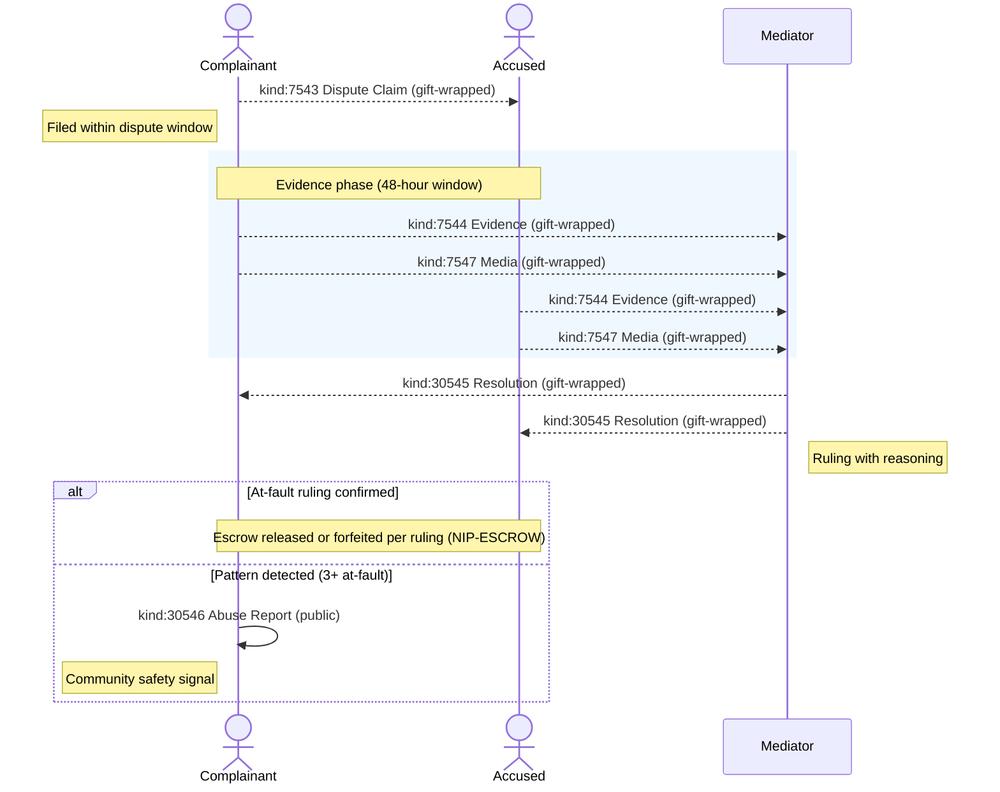
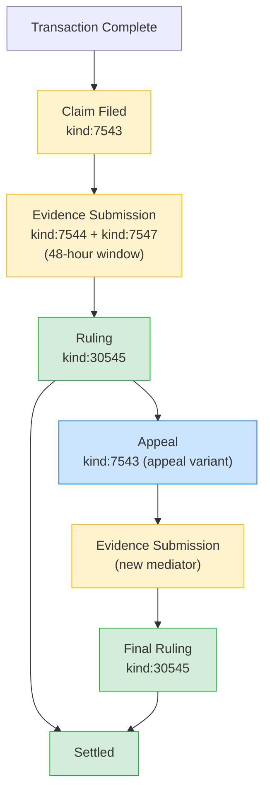

NIP-DISPUTES
==============

Dispute Resolution Protocol
------------------------------

`draft` `optional`

Three regular event kinds and two addressable event kinds for structured dispute resolution on Nostr — claim filing, evidence submission, mediator resolution, abuse reporting, and media attachments.

> **Standalone usability:** This NIP works independently on any Nostr application. Within the [TROTT protocol](https://github.com/forgesworn/nip-drafts) (v0.9), these kinds are extended with operator-managed dispute workflows, safety check-ins, and emergency signals — but adoption of TROTT is not required.

## Motivation

NIP-56 provides content reporting (flagging notes for moderation), but Nostr has no protocol for resolving disputes between transacting parties. When a marketplace purchase goes wrong, a freelance job is abandoned, or a service isn't delivered — there's no standardised way to:

- **File a structured complaint** with typed dispute categories
- **Submit evidence** (photos, logs, receipts) with cryptographic hashes
- **Resolve via mediation** with transparent, signed rulings
- **Detect serial offenders** through abuse pattern reporting

This NIP defines a dispute lifecycle that works with any Nostr-based transaction — marketplace (NIP-15), classified listings (NIP-99), service coordination, or any custom application.

## Kinds

| kind  | description         | type        |
| ----- | ------------------- | ----------- |
| 7543  | Dispute Claim       | regular     |
| 7544  | Dispute Evidence    | regular     |
| 30545 | Dispute Resolution  | addressable |
| 30546 | Abuse Report        | addressable |
| 7547  | Media Attachment    | regular     |

Claims, evidence, and media attachments are regular events (NIP-01) — once published, they cannot be replaced or deleted at the relay level, guaranteeing immutability for accusations and evidence. Resolutions and abuse reports are addressable events — mediators may correct rulings before settlement, and abuse reports are updated as new incidents are detected.

---

## Dispute Claim (`kind:7543`)

Filed by a complainant against an accused party. Immutable — as a regular event, the claim cannot be replaced or retracted at the relay level. It can only be resolved via a `kind:30545` resolution.

```json
{
    "kind": 7543,
    "pubkey": "<complainant-hex-pubkey>",
    "created_at": 1698770000,
    "tags": [
        ["p", "<accused-pubkey>"],
        ["e", "<transaction-event-id>"],
        ["dispute_type", "quality"],
        ["resolution_model", "mediator"],
        ["mediator", "<mediator-pubkey>"],
        ["domain", "freelance"],
        ["amount_disputed", "25000"],
        ["currency", "SAT"]
    ],
    "content": "Deliverables did not match the agreed specification. Three of five requirements were not addressed."
}
```

Tags:

* `p` (REQUIRED): Accused party's pubkey.
* `e` (REQUIRED): References the transaction event.
* `dispute_type` (REQUIRED): One of:
    * `no_show` — party did not appear or deliver
    * `quality` — work or goods below agreed standard
    * `pricing` — overcharging, hidden fees
    * `damage` — property or goods damaged
    * `safety` — unsafe behaviour
    * `fraud` — deliberate deception
* `resolution_model` (REQUIRED): One of:
    * `mediator` — designated mediator reviews and rules
    * `mutual` — parties negotiate directly
    * `automated` — rule-based auto-resolution
* `mediator` (OPTIONAL): Nominated mediator's pubkey. How the mediator is selected (marketplace-assigned, mutually agreed, random from pool) is application-defined.
* `domain` (OPTIONAL): Service or transaction category (e.g. `freelance`, `delivery`, `marketplace`).
* `amount_disputed` (OPTIONAL): Financial amount in dispute, in smallest currency unit.
* `currency` (OPTIONAL): Currency code (e.g. `GBP`, `USD`, `EUR`, `SAT`).

### Filing Window

Disputes SHOULD be filed within the dispute window defined by the transaction terms (default: 24 hours after completion). "Completion" means the `created_at` timestamp of the completion-state event (e.g. a status update to `completed`, a delivery confirmation, or the final transaction event). If the application has no explicit completion event, the `created_at` of the transaction event referenced by the `e` tag is used. Implementations MAY reject claims filed after this window.

### Appeals

An appeal is a new `kind:7543` with:

- `["appeal", "true"]` tag
- `e` tag referencing the original `kind:30545` resolution event

Appeals MUST be filed within 48 hours of the original resolution, MUST be assigned a different mediator, and are final (no further appeals at protocol level).

> **Privacy:** This event MUST be delivered via NIP-59 gift wrap. See [Privacy](#privacy).

---

## Dispute Evidence (`kind:7544`)

Evidence submission by either party or the mediator. Immutable — as a regular event, evidence cannot be replaced or deleted at the relay level.

```json
{
    "kind": 7544,
    "pubkey": "<submitter-hex-pubkey>",
    "created_at": 1698771000,
    "tags": [
        ["e", "<dispute-claim-event-id>"],
        ["e", "<transaction-event-id>"],
        ["evidence_type", "screenshot"],
        ["evidence_hash", "sha256:a1b2c3d4e5f6..."],
        ["p", "<complainant-pubkey>"],
        ["p", "<accused-pubkey>"],
        ["p", "<mediator-pubkey>"]
    ],
    "content": "<evidence URL, summary, and data format — plaintext in the rumour; privacy provided by NIP-59 gift wrap>"
}
```

Tags:

* `e` (REQUIRED): First `e` tag references the Dispute Claim event (`kind:7543`).
* `e` (RECOMMENDED): Second `e` tag references the transaction event for cross-referencing.
* `evidence_type` (REQUIRED): One of `photo`, `video`, `audio`, `gps_log`, `screenshot`, `message_log`, `receipt`, `timestamp_proof`.
* `evidence_hash` (REQUIRED): `sha256:<hex>` hash of the original file for integrity verification.
* `p` (REQUIRED): All dispute participants (complainant, accused, mediator) — gift-wrap recipients.

`content`: Contains evidence URL, summary description, and format hints. Privacy is provided by NIP-59 gift wrap (one gift-wrapped copy per recipient). Content MAY additionally be NIP-44 encrypted pairwise to the gift-wrap recipient as defence in depth.

### Submission Window

Evidence SHOULD be submitted within 48 hours of the dispute filing. Implementations MAY reject evidence submitted after this window.

> **Privacy:** This event MUST be delivered via NIP-59 gift wrap (one copy per recipient). Evidence content MAY additionally be NIP-44 encrypted pairwise to each gift-wrap recipient as defence in depth. See [Privacy](#privacy).

---

## Dispute Resolution (`kind:30545`)

The mediator's ruling. Addressable — can be updated if the mediator corrects an error before settlement.

```json
{
    "kind": 30545,
    "pubkey": "<mediator-hex-pubkey>",
    "created_at": 1698775000,
    "tags": [
        ["d", "resolution_<dispute-claim-event-id>"],
        ["e", "<dispute-claim-event-id>"],
        ["ruling", "partial_refund"],
        ["resolution_model", "mediator"],
        ["at_fault", "<accused-pubkey>"],
        ["refund_amount", "15000"],
        ["refund_currency", "SAT"],
        ["complainant_stake_outcome", "released"],
        ["accused_stake_outcome", "partial_forfeit"],
        ["resolved_at", "1698775000"]
    ],
    "content": "After reviewing submitted evidence, the deliverables met 2 of 5 requirements. A 60% refund is awarded to the requester."
}
```

Tags:

* `d` (REQUIRED): Format `resolution_<dispute-claim-event-id>`. The `<dispute-claim-event-id>` is the SHA-256 event ID from the `e` tag referencing the claim. Using the event ID (a globally unique SHA-256 hash) guarantees uniqueness without requiring application-level identifiers.
* `e` (REQUIRED): References the Dispute Claim event (`kind:7543`).
* `ruling` (REQUIRED): One of:
    * `full_refund` — requester receives full refund
    * `partial_refund` — requester receives partial refund
    * `no_refund` — provider keeps payment
    * `provider_compensated` — provider awarded additional compensation
    * `mutual_release` — both parties agree to walk away
    * `voided` — transaction voided entirely
* `resolution_model` (REQUIRED): Model used (matches the claim's `resolution_model`).
* `at_fault` (OPTIONAL): Pubkey of the party found at fault.
* `refund_amount`, `refund_currency` (OPTIONAL): Refund details. Amount in smallest currency unit.
* `complainant_stake_outcome` (OPTIONAL): One of `released`, `partial_forfeit`, or `full_forfeit`.
* `accused_stake_outcome` (OPTIONAL): One of `released`, `partial_forfeit`, or `full_forfeit`.
* `resolved_at` (REQUIRED): Unix timestamp when the ruling was made.

`content`: Reasoning and explanation for the ruling. Signed by the mediator's key.

### Time Limits

| Resolution Model | Time Limit                          |
| ---------------- | ----------------------------------- |
| Mediator         | 24 hours from evidence deadline     |
| Mutual           | 7 days from dispute filing          |
| Default          | `mutual_release` if no ruling filed |

If no resolution is published within the time limit, implementations SHOULD treat the dispute as `mutual_release`.

> **Privacy:** This event MUST be delivered via NIP-59 gift wrap. See [Privacy](#privacy).

---

## Abuse Report (`kind:30546`)

NIP-56 compatible abuse report for serial offenders. Published after verified pattern detection — NOT for unverified complaints.

```json
{
    "kind": 30546,
    "pubkey": "<reporter-hex-pubkey>",
    "created_at": 1698780000,
    "tags": [
        ["d", "abuse_report_a1b2c3d4"],
        ["p", "<accused-pubkey>", "fraud"],
        ["L", "abuse"],
        ["l", "fraud", "abuse"],
        ["l", "serial_offender", "abuse"],
        ["report_type", "fraud"],
        ["domain", "freelance"],
        ["incident_count", "4"],
        ["first_incident", "1696000000"],
        ["last_incident", "1698700000"]
    ],
    "content": "Four disputes filed by different requesters over 60 days, each resulting in at_fault ruling. Pattern: accepts job, delivers partial work, disputes refund."
}
```

Tags:

* `d` (REQUIRED): Unique identifier. RECOMMENDED format: `abuse_report_<random-id>`. The accused pubkey MUST NOT be included in the `d` tag — clients filter by `p` tag instead.
* `p` (REQUIRED): Accused pubkey with NIP-56 report type as the third element.
* `L` (REQUIRED): Label namespace (`abuse`).
* `l` (REQUIRED, one or more): NIP-32 labels in the `abuse` namespace. Values: `fraud`, `spam`, `harassment`, `safety_violation`, `serial_offender`, `sybil_attack`.
* `report_type` (REQUIRED): Primary abuse category.
* `domain` (OPTIONAL): Service or transaction category.
* `incident_count` (REQUIRED): Number of confirmed incidents.
* `first_incident`, `last_incident` (RECOMMENDED): Unix timestamps bounding the pattern.
* `e` (OPTIONAL): References resolution events (`kind:30545`) as supporting evidence. **Privacy note:** since abuse reports are public and resolutions are gift-wrapped, including resolution event IDs allows observers to correlate public reports with private dispute events by matching event IDs on relays. Implementations SHOULD omit `e` tags unless the referenced resolution events are also public, or unless correlation is acceptable for the use case.

### Pattern Detection Thresholds

Abuse reports SHOULD only be published after verification. Recommended thresholds:

- 3+ disputes within 30 days, each with an `at_fault` ruling against the same pubkey
- Anomalous rating inflation from recently-created pubkeys
- Greater than 10% no-show rate across completed transactions

Implementations MUST NOT publish abuse reports based on a single dispute or unverified complaints.

> **Privacy:** This event is intentionally **public**. Abuse reports are community safety signals and MUST NOT be gift-wrapped. They are only published after verified pattern detection (3+ at-fault rulings).

---

## Media Attachment (`kind:7547`)

Photo, video, audio, or document evidence for disputes or transaction handovers. Immutable — as a regular event, media attachments cannot be replaced or deleted at the relay level.

```json
{
    "kind": 7547,
    "pubkey": "<submitter-hex-pubkey>",
    "created_at": 1698770500,
    "tags": [
        ["e", "<dispute-or-transaction-event-id>"],
        ["media_type", "photo"],
        ["media_hash", "sha256:a1b2c3d4e5f6..."],
        ["captured_at", "1698770500"],
        ["p", "<recipient-1-pubkey>"],
        ["p", "<recipient-2-pubkey>"]
    ],
    "content": "<media URL and description — plaintext in the rumour; privacy provided by NIP-59 gift wrap>"
}
```

Tags:

* `e` (REQUIRED): References the dispute or transaction event this media relates to.
* `media_type` (REQUIRED): One of `photo`, `video`, `audio`, `document`.
* `media_hash` (REQUIRED): `sha256:<hex>` hash of the original file for integrity verification.
* `captured_at` (OPTIONAL): Unix timestamp when the media was captured.
* `p` (REQUIRED): Gift-wrap recipients.

`content`: Contains the media URL and description. Privacy is provided by NIP-59 gift wrap (one gift-wrapped copy per recipient). Content MAY additionally be NIP-44 encrypted pairwise to each gift-wrap recipient as defence in depth.

> **Privacy:** This event MUST be delivered via NIP-59 gift wrap (one copy per recipient). Media content MAY additionally be NIP-44 encrypted pairwise to each gift-wrap recipient as defence in depth. See [Privacy](#privacy).

---

## Dispute Lifecycle



> **Arrow legend:** `—>>` solid = public event · `-->>` dashed = NIP-59 gift-wrapped (private)

1. **Filing:** Complainant publishes `kind:7543` within the dispute window.
2. **Evidence:** Both parties submit `kind:7544` evidence and `kind:7547` media (48-hour window).
3. **Ruling:** Mediator publishes `kind:30545` resolution with reasoning.
4. **Settlement:** Escrow released or forfeited per ruling (see [NIP-ESCROW](NIP-ESCROW.md)).
5. **Abuse:** If pattern detected across multiple disputes, `kind:30546` published publicly.

### State Transitions



Legend: <span style="color:#ffc107">**yellow**</span> = in progress · <span style="color:#28a745">**green**</span> = terminal · <span style="color:#007bff">**blue**</span> = appeal path

### Enforcement Note

The state transitions above are **client-side guidance**, not relay-enforced constraints. Nothing in the Nostr protocol prevents out-of-order event publication (e.g. a resolution before the evidence window closes). Clients SHOULD validate state transitions and reject or flag events that arrive out of sequence. Relays have no mechanism to enforce ordering across event kinds.

## Use Cases Beyond Task Coordination

### Marketplace Purchase Disputes
Buyer and seller disagree on item condition. Dispute claim (`kind:7543`) references the original listing. Evidence events (`kind:7544`) include photos. A designated mediator issues resolution (`kind:30545`).

### Freelance Contract Disputes
Client claims deliverable doesn't match brief. Structured dispute flow with evidence and optional mediation replaces unstructured DM arguments.

### Rental Damage Claims
Landlord claims damage after checkout. Tenant submits counter-evidence (pre-checkout photos). Third-party mediator reviews both sides.

### Content Takedown Appeals
Creator disputes a content removal. Abuse report (`kind:30546`) initiated the takedown; creator submits counter-evidence. Resolution documents the outcome for transparency.

## Security Considerations

* **Evidence integrity.** `evidence_hash` and `media_hash` tags use SHA-256 hashes for tamper detection. Implementations SHOULD verify hashes against submitted files and reject mismatches.
* **Encrypted evidence.** All evidence content is NIP-44 encrypted to dispute participants only. Relays see event metadata (kind, tags, pubkeys) but cannot read evidence content.
* **Mediator accountability.** Resolutions are signed events — the mediator's pubkey is transparent and their ruling history is publicly auditable. Clients MAY display mediator statistics (rulings issued, appeal rate, average resolution time).
* **No unverified abuse reports.** `kind:30546` SHOULD only be published after pattern verification (multiple at-fault rulings, not single complaints). Publishing unverified reports undermines the system.
* **Appeal safeguards.** Appeals MUST be assigned a different mediator, preventing the same person from ruling twice on the same dispute.
* **Immutability guarantees.** Dispute claims (`kind:7543`), evidence (`kind:7544`), and media attachments (`kind:7547`) are regular events — relays cannot replace them once published. This ensures accusations and evidence are tamper-proof at the protocol level. Resolutions (`kind:30545`) remain addressable to allow mediator corrections before settlement.

## Privacy

Dispute events contain sensitive information — accusations, evidence, rulings, and fault determinations — that should not be visible to relay operators or passive observers. These events MUST be delivered privately using [NIP-59](https://github.com/nostr-protocol/nips/blob/master/59.md) gift wrap.

### Gift-wrap requirements

| Kind | Event | Requirement | Recipients |
|------|-------|-------------|------------|
| 7543 | Dispute Claim | MUST gift-wrap | Complainant, accused, mediator (if known) |
| 7544 | Dispute Evidence | MUST gift-wrap | Complainant, accused, mediator |
| 30545 | Dispute Resolution | MUST gift-wrap | Complainant, accused |
| 7547 | Media Attachment | MUST gift-wrap | All `p`-tagged recipients |

The inner event (the sealed rumour) retains its full tag structure — gift wrap provides the privacy layer, not tag restructuring. Recipients unwrap the NIP-59 envelope to access the original event.

Evidence (`kind:7544`) and media (`kind:7547`) content MAY additionally be NIP-44 encrypted pairwise to each gift-wrap recipient. This provides defence in depth — even if the gift-wrap envelope is compromised, the content remains encrypted. Each gift-wrapped copy carries content encrypted to that specific recipient; NIP-44 is pairwise and a single ciphertext cannot be decrypted by multiple keys.

### Events that remain public

| Kind | Event | Rationale |
|------|-------|-----------|
| 30546 | Abuse Report | Community safety signal — published only after verified pattern detection (3+ at-fault rulings). Visibility is the point. |

### Metadata minimisation

Implementations SHOULD include only the tags marked REQUIRED or RECOMMENDED in each event kind. Optional tags (`domain`, `amount_disputed`, `currency`) increase the metadata surface — omit them unless the application specifically needs them.

## Relationship to Existing NIPs

Extends [NIP-56](https://github.com/nostr-protocol/nips/blob/master/56.md) (Reporting) with structured bilateral dispute resolution. NIP-56 handles unilateral abuse reporting to relays; NIP-DISPUTES handles bilateral disputes between transaction parties with evidence, mediation, and binding rulings. Uses [NIP-32](https://github.com/nostr-protocol/nips/blob/master/32.md) (Labelling) for structured abuse categorisation.

## Dependencies

* [NIP-01](https://github.com/nostr-protocol/nips/blob/master/01.md): Basic protocol flow, regular and addressable events
* [NIP-32](https://github.com/nostr-protocol/nips/blob/master/32.md): Labelling (abuse categorisation)
* [NIP-44](https://github.com/nostr-protocol/nips/blob/master/44.md): Versioned encrypted payloads
* [NIP-56](https://github.com/nostr-protocol/nips/blob/master/56.md): Reporting (compatibility)
* [NIP-59](https://github.com/nostr-protocol/nips/blob/master/59.md): Gift wrap (private delivery of dispute events)

## Reference Implementation

The `@trott/sdk` (TypeScript SDK) provides builders and parsers for all five kinds defined in this NIP.

A minimal implementation requires:

1. A Nostr client that supports regular and addressable event publishing and NIP-44 encryption.
2. A dispute management interface for filing claims, submitting evidence, and viewing resolutions.
3. Mediator tooling for reviewing evidence and publishing rulings.
