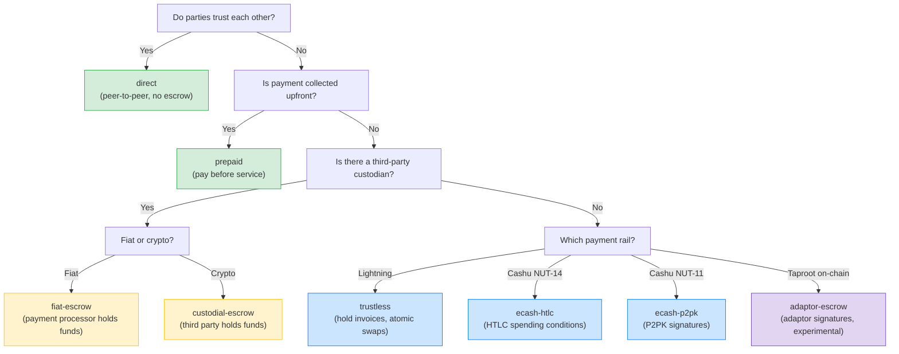
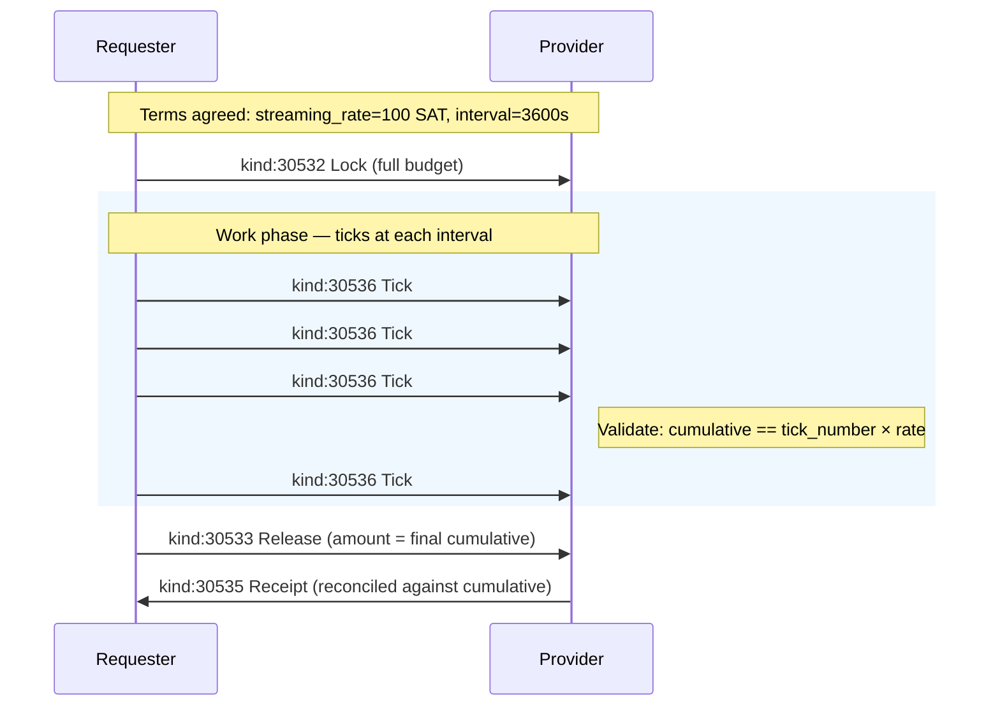
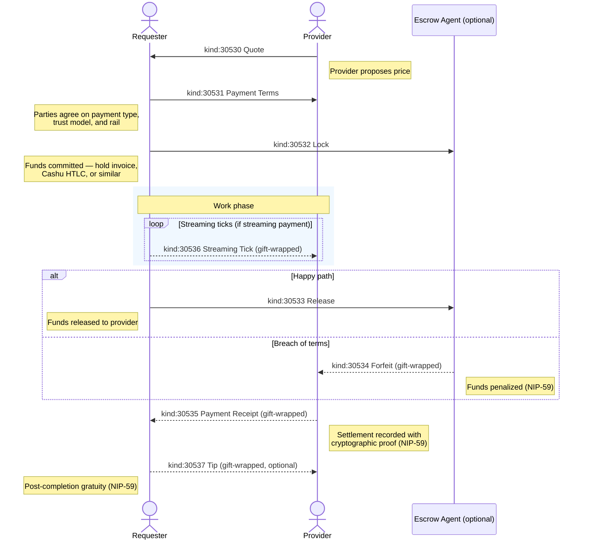
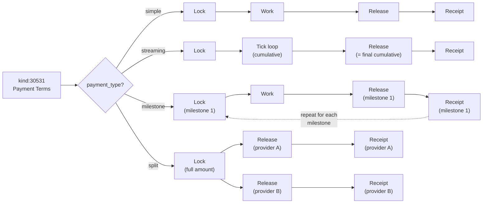
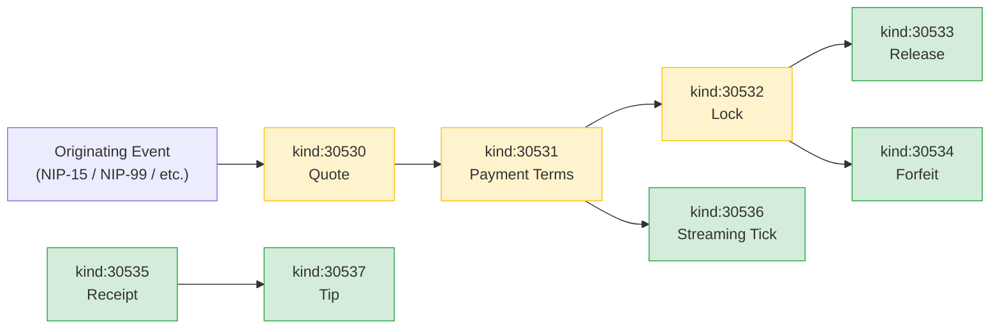
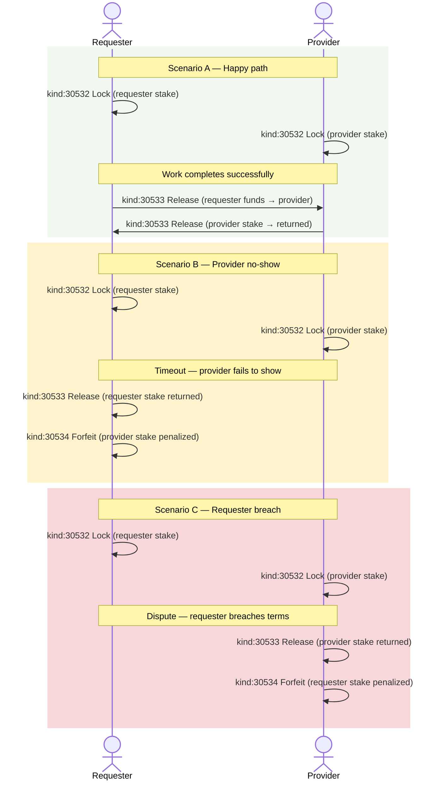

NIP-ESCROW
============

Conditional Payment Coordination
-----------------------------------

`draft` `optional`

This NIP defines eight addressable event kinds for coordinating conditional payments on Nostr: quoting, terms agreement, fund locking, release, forfeiture, settlement receipts, streaming payments, and tipping.

> **Design principle:** These events *communicate about* payments — they do not *execute* them. Events track payment state; actual money moves on whatever rail the parties choose.

## Motivation

Nostr has NIP-57 for Lightning zaps and NIP-47 for wallet automation, but no protocol coordinates conditional payments tied to outcomes. When strangers transact on Nostr — via marketplaces (NIP-15), classified listings (NIP-99), or service coordination — there is no standardised way to:

- **Quote and negotiate** prices before commitment
- **Lock funds** until work is completed
- **Release or forfeit** funds based on outcomes
- **Stream payments** during ongoing work (per-hour, per-milestone)
- **Record settlement** with cryptographic proof

This NIP defines the communication layer for conditional payments. It does not execute payments; it coordinates them.

## Scope

NIP-ESCROW is payment-rail agnostic. The Quote event references (via `e` tag) whatever Nostr event initiated the transaction — a NIP-15 marketplace order, a NIP-99 classified listing, or any application-specific event kind. This NIP does not define the originating event; it defines the payment coordination that follows.

## Kinds

| kind  | description      |
| ----- | ---------------- |
| 30530 | Quote            |
| 30531 | Payment Terms    |
| 30532 | Lock             |
| 30533 | Release          |
| 30534 | Forfeit          |
| 30535 | Payment Receipt  |
| 30536 | Streaming Tick   |
| 30537 | Tip              |

All eight kinds are addressable events (NIP-01).

> **Why eight kinds?** Each kind has a distinct author (provider quotes, requester locks, either party releases), a distinct lifecycle moment, and a distinct relay filterability requirement. A client subscribing to `kind:30530` sees only quotes; a client subscribing to `kind:30535` sees only receipts. Fewer kinds would force clients to download events they don't need and parse content to distinguish state — more kinds would fragment unnecessarily.

---

## Quote (`kind:30530`)

A provider proposes a price. Multiple providers MAY quote the same job. Addressable — a provider can update their quote by republishing with the same `d` tag.

```json
{
  "kind": 30530,
  "pubkey": "<provider-hex-pubkey>",
  "created_at": 1698765000,
  "tags": [
    ["d", "<tx-id>:quote"],
    ["e", "<originating-event-id>"],
    ["p", "<requester-pubkey>"],
    ["amount", "15000"],
    ["currency", "SAT"],
    ["breakdown", "base_price", "12000", "SAT"],
    ["breakdown", "materials", "2000", "SAT"],
    ["breakdown", "travel", "1000", "SAT"],
    ["rate_unit", "flat"],
    ["valid_until", "1698851400"],
    ["payment_method", "cashu"],
    ["payment_method", "lightning"]
  ],
  "content": "Fixed price for logo design including two revision rounds."
}
```

Tags:

* `d` (REQUIRED): Unique identifier. RECOMMENDED format: `<tx-id>:quote`, where `tx-id` is an application-specific transaction identifier (e.g. a NIP-15 order ID, a NIP-99 listing reference, or a random UUID). Multiple providers MAY quote the same `tx-id` — their events are already distinct because addressable events are unique per author pubkey + kind + d-tag.
* `e` (REQUIRED): References the originating event (e.g. NIP-15 order, NIP-99 listing).
* `p` (REQUIRED): Requester's pubkey.
* `amount` (REQUIRED): Total price in smallest currency unit (cents for USD, satoshis for SAT).
* `currency` (REQUIRED): Currency code (e.g. `USD`, `EUR`, `SAT`, `BTC`).
* `breakdown` (OPTIONAL, multiple): `["breakdown", "<item>", "<amount>", "<currency>"]`. Items: `base_price`, `labour`, `materials`, `travel`, `fee`, etc.
* `rate_unit` (OPTIONAL): One of `flat`, `per_hour`, `per_day`, `per_item`, `per_kg`, `per_km`.
* `valid_until` (OPTIONAL): Unix timestamp — quote expiry. Clients SHOULD use NIP-40 `expiration` for relay-level enforcement.
* `payment_method` (OPTIONAL, multiple): Accepted payment methods. See [Canonical `payment_method` Values](#canonical-payment_method-values) below.
* `mint_url` (OPTIONAL): Preferred Cashu mint URL.

### Canonical `payment_method` Values

| Value | Description |
|-------|-------------|
| `lightning` | Lightning Network (BOLT11 invoice) |
| `lightning_hold` | Lightning hold invoice (HODL invoice) |
| `onchain_btc` | On-chain Bitcoin transaction |
| `cashu` | Cashu ecash token |
| `stripe` | Stripe card payment |
| `nip47` | NIP-47 Nostr Wallet Connect |
| `bank_transfer` | Bank wire or ACH transfer |
| `cash` | Physical cash |
| `silent_payment` | BIP-352 silent payment (on-chain, privacy-preserving) |
| `fedimint` | Federated Chaumian mint (via Lightning or on-chain swap) |
| `strike` | Strike payment |
| `zelle` | Zelle payment |
| `paypal` | PayPal payment |
| `venmo` | Venmo payment |
| `cash_app` | Cash App payment |
| `other` | Other payment method (describe in `payment_description` tag) |
| `custom:*` | Custom payment method with `custom:` prefix (e.g., `custom:mpesa`) |

Implementations SHOULD support at least `lightning` and `cash`. The `custom:*` prefix allows communities to add payment methods without requiring protocol changes.

---

## Payment Terms (`kind:30531`)

Agreed payment structure between parties. Published after quote acceptance. Defines how money will flow — single payment, streaming, milestones, or split across multiple providers.

```json
{
  "kind": 30531,
  "pubkey": "<requester-hex-pubkey>",
  "created_at": 1698765500,
  "tags": [
    ["d", "<tx-id>:terms"],
    ["e", "<quote-event-id>"],
    ["payment_type", "milestone"],
    ["amount", "50000"],
    ["currency", "SAT"],
    ["trust_model", "ecash-htlc"],
    ["milestone", "design_mockup", "Design mockup delivery", "15000", "SAT"],
    ["milestone", "first_draft", "First draft delivery", "20000", "SAT"],
    ["milestone", "final_delivery", "Final approved delivery", "15000", "SAT"],
    ["payment_rail", "cashu"],
    ["mint_url", "https://mint.example.com"]
  ],
  "content": ""
}
```

Tags:

* `d` (REQUIRED): Unique identifier. RECOMMENDED format: `<tx-id>:terms`.
* `e` (REQUIRED): References the accepted Quote event.
* `payment_type` (REQUIRED): One of:
    * `simple` — single payment on completion
    * `streaming` — periodic payments during active work
    * `milestone` — payments at defined checkpoints
    * `split` — payment split across multiple providers
* `amount` (REQUIRED): Total agreed amount in smallest currency unit.
* `currency` (REQUIRED): Currency code.
* `trust_model` (RECOMMENDED): Declares the trust assumptions of the payment flow. RECOMMENDED values:
    * `trustless` — wallet-to-wallet, no intermediary touches funds (hold invoices, atomic swaps)
    * `ecash-htlc` — ecash tokens locked with HTLC spending conditions (Cashu NUT-14)
    * `ecash-p2pk` — ecash tokens locked with P2PK signatures (Cashu NUT-11)
    * `adaptor-escrow` — `experimental` Taproot adaptor signature escrow; pre-signed transaction released by discrete-log secret reveal (NIP-455-compatible)
    * `custodial-escrow` — a third party holds funds in custody
    * `fiat-escrow` — fiat payment processor holds funds
    * `direct` — peer-to-peer with no escrow (cash, bank transfer)
    * `prepaid` — payment collected before service begins

    Implementations MAY use other values.



* `streaming_rate` (REQUIRED for `streaming`): Amount per interval in smallest currency unit.
* `streaming_interval_seconds` (REQUIRED for `streaming`): Interval in seconds.
* `milestone` (REQUIRED for `milestone`, multiple): `["milestone", "<id>", "<description>", "<amount>", "<currency>"]`.
* `split` (REQUIRED for `split`, multiple): `["split", "<provider_pubkey>", "<amount>", "<currency>", "<role>"]`.
* `payment_rail` (OPTIONAL): e.g. `cashu`, `lightning`, `nip47`, `strike`, `cash`.
* `mint_url` (OPTIONAL): Agreed Cashu mint URL.

---

## Lock (`kind:30532`)

Funds committed. Proof that money has been locked and is no longer spendable by the locking party until released or forfeited.

```json
{
  "kind": 30532,
  "pubkey": "<requester-hex-pubkey>",
  "created_at": 1698766000,
  "tags": [
    ["d", "<tx-id>:lock:requester"],
    ["e", "<payment-terms-event-id>"],
    ["party", "requester"],
    ["amount", "50000"],
    ["currency", "SAT"],
    ["trust_model", "ecash-htlc"],
    ["lock_type", "ecash_htlc"],
    ["mint_url", "https://mint.example.com"],
    ["expiration", "1699370800"]
  ],
  "content": ""
}
```

Tags:

* `d` (REQUIRED): Unique identifier. RECOMMENDED format: `<tx-id>:lock:<party>` where party is `requester` or `provider`.
* `e` (REQUIRED): References the upstream event — typically the Payment Terms event, but MAY reference the Quote directly when terms are implicit.
* `party` (REQUIRED): Which party locked funds (`requester` or `provider`).
* `amount` (REQUIRED): Locked amount in smallest currency unit.
* `currency` (REQUIRED): Currency code.
* `trust_model` (RECOMMENDED): Trust model (matches Payment Terms).
* `lock_type` (REQUIRED): Locking mechanism. RECOMMENDED values:
    * `hold_invoice` — Lightning hold invoice (HTLC locked in payment channels)
    * `ecash_htlc` — ecash token with HTLC spending condition (Cashu NUT-14)
    * `ecash_p2pk` — ecash token with P2PK spending condition (Cashu NUT-11)
    * `preauthorization` — payment card preauthorization
    * `custodial` — funds held in custody by a third party
    * `adaptor_signature` — `experimental` Taproot adaptor signature (pre-signed tx, released by discrete-log reveal)

    Implementations MAY use other values.
* `mint_url` (OPTIONAL): Cashu mint holding tokens.
* `locked_at` (OPTIONAL): Unix timestamp when funds were locked. Clients MAY omit this — `created_at` serves the same purpose.
* `expiration` (OPTIONAL): NIP-40 expiration — automatic unlock if not released or forfeited by this time.

---

## Release (`kind:30533`)

Funds released to the provider on successful completion.

```json
{
  "kind": 30533,
  "pubkey": "<requester-hex-pubkey>",
  "created_at": 1698770000,
  "tags": [
    ["d", "<tx-id>:release:requester"],
    ["e", "<lock-event-id>"],
    ["party", "requester"],
    ["amount", "50000"],
    ["currency", "SAT"],
    ["release_reason", "completed"]
  ],
  "content": ""
}
```

Tags:

* `d` (REQUIRED): Unique identifier. RECOMMENDED format: `<tx-id>:release:<party>` or `<tx-id>:release:milestone_<N>`.
* `e` (REQUIRED): References the Lock event being released.
* `party` (REQUIRED): Which party's funds are being released.
* `amount` (REQUIRED): Released amount in smallest currency unit.
* `currency` (REQUIRED): Currency code.
* `release_reason` (REQUIRED): One of `completed`, `cancelled_mutual`, `cancelled_grace`, `milestone`, `dispute_resolved`, `expired`.
* `released_at` (OPTIONAL): Explicit release timestamp. When omitted, `created_at` serves the same purpose.
* `milestone_id` (OPTIONAL): Identifier of the completed milestone.

---

## Forfeit (`kind:30534`)

Funds penalized for breach of terms.

```json
{
  "kind": 30534,
  "pubkey": "<escrow-agent-hex-pubkey>",
  "created_at": 1698770000,
  "tags": [
    ["d", "<tx-id>:forfeit:provider"],
    ["e", "<lock-event-id>"],
    ["party", "provider"],
    ["forfeit_amount", "25000"],
    ["currency", "SAT"],
    ["forfeit_reason", "no_show"]
  ],
  "content": "Provider did not arrive within the agreed window."
}
```

Tags:

* `d` (REQUIRED): Unique identifier. RECOMMENDED format: `<tx-id>:forfeit:<party>`.
* `e` (REQUIRED): References the Lock event being forfeited.
* `party` (REQUIRED): Which party's funds are being forfeited.
* `forfeit_amount` (REQUIRED): Forfeited amount in smallest currency unit.
* `currency` (REQUIRED): Currency code.
* `forfeit_reason` (REQUIRED): One of `no_show`, `late_cancellation`, `abandonment`, `misconduct`, `dispute_loss`.
* `refund_amount` (OPTIONAL): Partial refund to the offending party (if forfeit is partial).
* `forfeited_at` (OPTIONAL): Explicit forfeiture timestamp. When omitted, `created_at` serves the same purpose.

> **Privacy:** This event MUST be delivered via NIP-59 gift wrap. See [Privacy](#privacy).

---

## Payment Receipt (`kind:30535`)

Final settlement record. Cryptographic confirmation that money changed hands.

```json
{
  "kind": 30535,
  "pubkey": "<escrow-agent-hex-pubkey>",
  "created_at": 1698770100,
  "tags": [
    ["d", "<tx-id>:receipt"],
    ["payer", "<requester-pubkey>"],
    ["payee", "<provider-pubkey>"],
    ["amount", "47500"],
    ["currency", "SAT"],
    ["trust_model", "ecash-htlc"],
    ["settlement_proof", "<htlc-preimage-hex>"]
  ],
  "content": ""
}
```

Tags:

* `d` (REQUIRED): Unique identifier. RECOMMENDED format: `<tx-id>:receipt` or `<tx-id>:receipt:<sequence>` for milestone payments.
* `payer` (REQUIRED): Pubkey of the paying party.
* `payee` (REQUIRED): Pubkey of the receiving party.
* `amount` (REQUIRED): Settled amount in smallest currency unit.
* `currency` (REQUIRED): Currency code.
* `trust_model` (REQUIRED): Trust model used for settlement. Uses the same vocabulary as Payment Terms (e.g. `ecash-htlc`, `ecash-p2pk`, `trustless`, `custodial-escrow`, `direct`).
* `settlement_proof` (RECOMMENDED): Cryptographic proof — HTLC preimage, Lightning payment preimage, etc. Enables independent verification.
* `settled_at` (OPTIONAL): Explicit settlement timestamp. When omitted, `created_at` serves the same purpose.

> **Privacy:** This event MUST be delivered via NIP-59 gift wrap. See [Privacy](#privacy).

---

## Streaming Tick (`kind:30536`)

Periodic proof-of-payment during ongoing work. Each tick represents one interval's payment.

```json
{
  "kind": 30536,
  "pubkey": "<requester-hex-pubkey>",
  "created_at": 1698769600,
  "tags": [
    ["d", "<tx-id>:tick:0001"],
    ["e", "<payment-terms-event-id>"],
    ["tick_number", "1"],
    ["amount", "100"],
    ["currency", "SAT"],
    ["cumulative", "100"],
    ["interval_seconds", "3600"]
  ],
  "content": ""
}
```

Tags:

* `d` (REQUIRED): Unique identifier. RECOMMENDED format: `<tx-id>:tick:<zero-padded-sequence>`.
* `e` (REQUIRED): References the Payment Terms event.
* `tick_number` (REQUIRED): Sequential tick number (starting from 1).
* `amount` (REQUIRED): Amount for this tick in smallest currency unit.
* `currency` (REQUIRED): Currency code.
* `cumulative` (REQUIRED): Running total of all tick amounts. Clients SHOULD reject ticks with inconsistent cumulative values.
* `interval_seconds` (REQUIRED): Configured interval in seconds.
* `payment_proof` (OPTIONAL): Cryptographic proof for this tick (preimage, etc.).

> **Privacy:** This event MUST be delivered via NIP-59 gift wrap. See [Privacy](#privacy).



---

## Tip (`kind:30537`)

Post-completion gratuity. Separate from the agreed fee.

```json
{
  "kind": 30537,
  "pubkey": "<requester-hex-pubkey>",
  "created_at": 1698780000,
  "tags": [
    ["d", "<tx-id>:tip"],
    ["e", "<payment-receipt-event-id>"],
    ["payee", "<provider-pubkey>"],
    ["amount", "5000"],
    ["currency", "SAT"],
    ["anonymous", "false"]
  ],
  "content": "Great work, thank you!"
}
```

Tags:

* `d` (REQUIRED): Unique identifier. RECOMMENDED format: `<tx-id>:tip`.
* `e` (REQUIRED): References the Payment Receipt event.
* `payee` (REQUIRED): Provider's pubkey.
* `amount` (REQUIRED): Tip amount in smallest currency unit.
* `currency` (REQUIRED): Currency code.
* `anonymous` (OPTIONAL): `true` or `false` (default `false`). If `true`, the `content` SHOULD be NIP-44 encrypted so only the payee can read it. Note: `anonymous` is a social signal — the tipper's pubkey remains visible on the event. For cryptographic anonymity, wrap the Tip event using NIP-17 gift wrap.

Tips MUST NOT affect reputation scores or dispute outcomes. Tips MAY be published up to 7 days after completion.

> **Privacy:** This event SHOULD be delivered via NIP-59 gift wrap by default. Implementations MAY publish tips publicly if the tipper explicitly opts in. See [Privacy](#privacy).

---

## Protocol Flow



> **Arrow legend:** `—>>` solid = public event · `-->>` dashed = NIP-59 gift-wrapped (private)

1. **Quote:** Provider publishes `kind:30530` with a proposed price.
2. **Terms:** Parties agree on `kind:30531` — payment type, trust model, and rail.
3. **Lock:** Funds are committed via `kind:30532` — hold invoice, Cashu HTLC, or similar.
4. **Work:** For streaming jobs, periodic `kind:30536` ticks prove ongoing payment.
5. **Release or Forfeit:** On success, `kind:30533` releases funds. On breach, `kind:30534` forfeits them.
6. **Receipt:** `kind:30535` records the final settlement with cryptographic proof.
7. **Tip:** Optionally, `kind:30537` records a post-completion gratuity.

Lock, Release, and Forfeit events may be published by either party, an escrow agent, or an automated system — the NIP does not prescribe who publishes them, only their structure.

### Payment Type Flows

The `payment_type` tag on Payment Terms (`kind:30531`) determines how the remaining events are sequenced:



## Replaceability

All eight kinds are addressable events. For Quote (`kind:30530`), Payment Terms (`kind:30531`), and Lock (`kind:30532`), replaceability is useful — a provider can update their quote, terms can be renegotiated, and lock status can be updated.

For Release (`kind:30533`), Forfeit (`kind:30534`), Receipt (`kind:30535`), Streaming Tick (`kind:30536`), and Tip (`kind:30537`), these events represent real-world financial actions that have already occurred. **These kinds use append-only semantics:**

- Each settlement event MUST use a unique `d` tag value (the recommended `<tx-id>:<type>:<qualifier>` format guarantees this).
- Clients MUST treat the first valid instance of each `d` tag as canonical and MUST reject replacements. A republished event with the same `d` tag and different amounts or proofs is invalid — not an update.
- Relays SHOULD enforce write-once semantics for these kinds (reject replacements for an existing `d` tag from the same author).
- If a client encounters two events with the same coordinate (`kind + pubkey + d`), it MUST reject both as potentially compromised and flag the conflict for manual review. Since `created_at` is publisher-controlled, tie-breaking by timestamp would allow a backdated replacement to win.

### Event Chain (`e`-tag References)



Legend: <span style="color:#ffc107">**yellow**</span> = mutable (updatable via addressable replacement) · <span style="color:#28a745">**green**</span> = write-once (first valid instance is canonical)

## Security Considerations

* **Payment-rail agnostic.** Events communicate *about* payments — they do not move money. The same event schema works whether parties use Lightning, Cashu, on-chain, or cash.
* **Smallest currency unit.** All amounts MUST be expressed in the smallest unit of the specified currency (cents for USD, satoshis for SAT) to avoid floating-point errors.
* **Settlement proof.** `kind:30535` receipts SHOULD include a `settlement_proof` tag with cryptographic proof (HTLC preimage, Lightning payment preimage) enabling independent verification.
* **Mutual staking.** Both parties MAY lock deposits via `kind:30532`. The threat of forfeiture incentivises good behaviour without requiring trust in a third party.



* **Cumulative validation.** For streaming ticks, the `cumulative` field MUST equal the running total of all tick amounts. Clients SHOULD reject ticks with inconsistent cumulative values.
* **NIP-44 encryption.** Sensitive payment details (mint URLs, settlement proofs, invoices) SHOULD be NIP-44 encrypted when privacy is required.
* **Quote expiry.** Quotes SHOULD include a `valid_until` tag. Clients MUST NOT accept quotes past their expiry. Relays MAY enforce this via NIP-40 `expiration`.

## Privacy

Financial events MUST be delivered privately using [NIP-59](https://github.com/nostr-protocol/nips/blob/master/59.md) gift wrap. These events contain settlement amounts, cryptographic proofs, and party identities that should not be visible to relay operators or passive observers.

### Gift-wrap requirements

| Kind | Event | Requirement | Recipients |
|------|-------|-------------|------------|
| 30534 | Forfeit | MUST gift-wrap | Penalized party, counterparty, escrow agent (if any) |
| 30535 | Payment Receipt | MUST gift-wrap | Payer, payee, escrow agent (if any) |
| 30536 | Streaming Tick | MUST gift-wrap | Payer, payee |
| 30537 | Tip | SHOULD gift-wrap | Payee. MAY be published publicly if the tipper explicitly opts in |

The inner event (the sealed rumour) retains its full tag structure — gift wrap provides the privacy layer, not tag restructuring. Recipients unwrap the NIP-59 envelope to access the original event.

### Events that remain public

| Kind | Event | Rationale |
|------|-------|-----------|
| 30530 | Quote | Providers want quotes to be discoverable |
| 30531 | Payment Terms | Needed for protocol coordination between parties |
| 30532 | Lock | Public commitment signal — proves funds are locked |
| 30533 | Release | Public completion signal — proves funds were released |

### Metadata minimisation

Implementations SHOULD include only the tags marked REQUIRED or RECOMMENDED in each event kind. Optional tags increase the metadata surface — omit them unless the application specifically needs them.

Settlement proofs (`settlement_proof` tag) are particularly sensitive. Even within gift-wrapped events, implementations SHOULD consider whether the proof needs to be stored on relays long-term or can be communicated via ephemeral channels.

## Test Vectors

All examples use timestamp `1709740800` (2024-03-06T12:00:00Z) and placeholder hex pubkeys.

### Kind 30530 — Quote

```json
{
  "kind": 30530,
  "pubkey": "a1b2c3d4e5f6a1b2c3d4e5f6a1b2c3d4e5f6a1b2c3d4e5f6a1b2c3d4e5f6a1b2",
  "created_at": 1709740800,
  "tags": [
    ["d", "tx_abc123:quote"],
    ["e", "dddd4444eeee5555ffff6666aaaa1111bbbb2222cccc3333dddd4444eeee5555"],
    ["p", "b2c3d4e5f6a1b2c3d4e5f6a1b2c3d4e5f6a1b2c3d4e5f6a1b2c3d4e5f6a1b2c3"],
    ["amount", "15000"],
    ["currency", "SAT"],
    ["breakdown", "base_price", "12000", "SAT"],
    ["breakdown", "materials", "2000", "SAT"],
    ["breakdown", "travel", "1000", "SAT"],
    ["rate_unit", "flat"],
    ["valid_until", "1709827200"],
    ["payment_method", "cashu"],
    ["payment_method", "lightning"]
  ],
  "content": "Fixed price for logo design including two revision rounds.",
  "id": "<32-byte-hex>",
  "sig": "<64-byte-hex>"
}
```

### Kind 30531 — Payment Terms

```json
{
  "kind": 30531,
  "pubkey": "b2c3d4e5f6a1b2c3d4e5f6a1b2c3d4e5f6a1b2c3d4e5f6a1b2c3d4e5f6a1b2c3",
  "created_at": 1709740800,
  "tags": [
    ["d", "tx_abc123:terms"],
    ["e", "aaaa1111bbbb2222cccc3333dddd4444eeee5555ffff6666aaaa1111bbbb2222"],
    ["payment_type", "milestone"],
    ["amount", "50000"],
    ["currency", "SAT"],
    ["trust_model", "ecash-htlc"],
    ["milestone", "design_mockup", "Design mockup delivery", "15000", "SAT"],
    ["milestone", "first_draft", "First draft delivery", "20000", "SAT"],
    ["milestone", "final_delivery", "Final approved delivery", "15000", "SAT"],
    ["payment_rail", "cashu"],
    ["mint_url", "https://mint.example.com"]
  ],
  "content": "",
  "id": "<32-byte-hex>",
  "sig": "<64-byte-hex>"
}
```

### Kind 30532 — Lock

```json
{
  "kind": 30532,
  "pubkey": "b2c3d4e5f6a1b2c3d4e5f6a1b2c3d4e5f6a1b2c3d4e5f6a1b2c3d4e5f6a1b2c3",
  "created_at": 1709740800,
  "tags": [
    ["d", "tx_abc123:lock:requester"],
    ["e", "aaaa1111bbbb2222cccc3333dddd4444eeee5555ffff6666aaaa1111bbbb2222"],
    ["party", "requester"],
    ["amount", "50000"],
    ["currency", "SAT"],
    ["trust_model", "ecash-htlc"],
    ["lock_type", "ecash_htlc"],
    ["mint_url", "https://mint.example.com"],
    ["expiration", "1710345600"]
  ],
  "content": "",
  "id": "<32-byte-hex>",
  "sig": "<64-byte-hex>"
}
```

### Kind 30533 — Release

```json
{
  "kind": 30533,
  "pubkey": "b2c3d4e5f6a1b2c3d4e5f6a1b2c3d4e5f6a1b2c3d4e5f6a1b2c3d4e5f6a1b2c3",
  "created_at": 1709740800,
  "tags": [
    ["d", "tx_abc123:release:requester"],
    ["e", "aaaa1111bbbb2222cccc3333dddd4444eeee5555ffff6666aaaa1111bbbb2222"],
    ["party", "requester"],
    ["amount", "50000"],
    ["currency", "SAT"],
    ["release_reason", "completed"]
  ],
  "content": "",
  "id": "<32-byte-hex>",
  "sig": "<64-byte-hex>"
}
```

### Kind 30534 — Forfeit

```json
{
  "kind": 30534,
  "pubkey": "c3d4e5f6a1b2c3d4e5f6a1b2c3d4e5f6a1b2c3d4e5f6a1b2c3d4e5f6a1b2c3d4",
  "created_at": 1709740800,
  "tags": [
    ["d", "tx_abc123:forfeit:provider"],
    ["e", "aaaa1111bbbb2222cccc3333dddd4444eeee5555ffff6666aaaa1111bbbb2222"],
    ["party", "provider"],
    ["forfeit_amount", "25000"],
    ["currency", "SAT"],
    ["forfeit_reason", "no_show"]
  ],
  "content": "Provider did not arrive within the agreed window.",
  "id": "<32-byte-hex>",
  "sig": "<64-byte-hex>"
}
```

### Kind 30535 — Payment Receipt

```json
{
  "kind": 30535,
  "pubkey": "c3d4e5f6a1b2c3d4e5f6a1b2c3d4e5f6a1b2c3d4e5f6a1b2c3d4e5f6a1b2c3d4",
  "created_at": 1709740800,
  "tags": [
    ["d", "tx_abc123:receipt"],
    ["payer", "b2c3d4e5f6a1b2c3d4e5f6a1b2c3d4e5f6a1b2c3d4e5f6a1b2c3d4e5f6a1b2c3"],
    ["payee", "a1b2c3d4e5f6a1b2c3d4e5f6a1b2c3d4e5f6a1b2c3d4e5f6a1b2c3d4e5f6a1b2"],
    ["amount", "47500"],
    ["currency", "SAT"],
    ["trust_model", "ecash-htlc"],
    ["settlement_proof", "0123456789abcdef0123456789abcdef0123456789abcdef0123456789abcdef"]
  ],
  "content": "",
  "id": "<32-byte-hex>",
  "sig": "<64-byte-hex>"
}
```

### Kind 30536 — Streaming Tick

```json
{
  "kind": 30536,
  "pubkey": "b2c3d4e5f6a1b2c3d4e5f6a1b2c3d4e5f6a1b2c3d4e5f6a1b2c3d4e5f6a1b2c3",
  "created_at": 1709740800,
  "tags": [
    ["d", "tx_abc123:tick:0001"],
    ["e", "aaaa1111bbbb2222cccc3333dddd4444eeee5555ffff6666aaaa1111bbbb2222"],
    ["tick_number", "1"],
    ["amount", "100"],
    ["currency", "SAT"],
    ["cumulative", "100"],
    ["interval_seconds", "3600"]
  ],
  "content": "",
  "id": "<32-byte-hex>",
  "sig": "<64-byte-hex>"
}
```

### Kind 30537 — Tip

```json
{
  "kind": 30537,
  "pubkey": "b2c3d4e5f6a1b2c3d4e5f6a1b2c3d4e5f6a1b2c3d4e5f6a1b2c3d4e5f6a1b2c3",
  "created_at": 1709740800,
  "tags": [
    ["d", "tx_abc123:tip"],
    ["e", "aaaa1111bbbb2222cccc3333dddd4444eeee5555ffff6666aaaa1111bbbb2222"],
    ["payee", "a1b2c3d4e5f6a1b2c3d4e5f6a1b2c3d4e5f6a1b2c3d4e5f6a1b2c3d4e5f6a1b2"],
    ["amount", "5000"],
    ["currency", "SAT"],
    ["anonymous", "false"]
  ],
  "content": "Great work, thank you!",
  "id": "<32-byte-hex>",
  "sig": "<64-byte-hex>"
}
```

## Relationship to Existing NIPs

Orthogonal to [NIP-57](https://github.com/nostr-protocol/nips/blob/master/57.md) (Lightning Zaps). NIP-57 handles simple tips/donations on Lightning; NIP-ESCROW handles conditional payment coordination across any payment rail (Lightning, Cashu, on-chain, fiat). Can compose with [NIP-47](https://github.com/nostr-protocol/nips/blob/master/47.md) (Wallet Connect) for automated wallet interactions.

## Dependencies

* [NIP-01](https://github.com/nostr-protocol/nips/blob/master/01.md): Basic protocol flow, addressable events
* [NIP-40](https://github.com/nostr-protocol/nips/blob/master/40.md): Expiration timestamps (quote validity, lock expiry)
* [NIP-44](https://github.com/nostr-protocol/nips/blob/master/44.md): Versioned encrypted payloads (private payment details)
* [NIP-59](https://github.com/nostr-protocol/nips/blob/master/59.md): Gift wrap (private delivery of financial events)
* [NIP-17](https://github.com/nostr-protocol/nips/blob/master/17.md): Private direct messages (gift-wrapped payment details, anonymous tips)

## Reference Implementations

* `@trott/sdk` (TypeScript SDK) — builders, parsers, and `TrustlessEscrow` orchestrator for all eight kinds
* [TROTT Protocol](https://github.com/forgesworn/nip-drafts) — Full specification suite that composes NIP-ESCROW with lifecycle, discovery, reputation, and dispute resolution

## Appendix: Operator Fee Collection Models

When a coordinator or platform facilitates escrow, they may charge fees. Operator fees are OPTIONAL — peer-to-peer escrow requires no fees.

### Model A: Pre-deducted (Most Common)
The coordinator deducts their fee before releasing funds to the provider.
- Quote (kind:30530) shows gross amount
- Payment terms (kind:30531) include `operator_fee` and `operator_fee_basis` tags
- Release (kind:30533) amount = gross - fee

### Model B: Surcharge
The coordinator adds their fee on top of the provider's price.
- Quote (kind:30530) shows provider's net amount
- Payment terms (kind:30531) include `total_amount` (net + fee) and `operator_fee` tags
- Customer pays `total_amount`; provider receives net

### Model C: Subscription
The coordinator charges a flat periodic fee, not per-transaction.
- No fee tags on individual escrow events
- Fee relationship managed outside the escrow protocol

### Fee Tags

| Tag | Value | Description |
|-----|-------|-------------|
| `operator_fee` | Amount in smallest unit | Fee amount charged by the coordinator |
| `operator_fee_basis` | `gross` or `net` | Whether fee is deducted from gross or added on top |
| `operator_fee_pct` | Percentage as string | Fee as percentage (e.g., `"5.0"` for 5%) |
