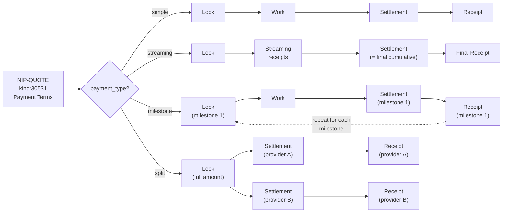

NIP-ESCROW
============

Conditional Payment Coordination
-----------------------------------

`draft` `optional`

This NIP defines three addressable event kinds for conditional fund locking, settlement, and cryptographic payment receipts on Nostr.

> **Design principle:** These events *communicate about* payments; they do not *execute* them. Events track payment state; actual money moves on whatever rail the parties choose.

## Motivation

Nostr has NIP-57 for Lightning zaps and NIP-47 for wallet automation, but no protocol coordinates conditional payments tied to outcomes. When strangers transact on Nostr, via marketplaces (NIP-15), classified listings (NIP-99), or service coordination, there is no standardised way to:

- **Lock funds** until work is completed
- **Settle funds** based on outcomes (release, forfeit, or partial forfeit)
- **Record settlement** with cryptographic proof, including streaming payment receipts

Pricing and quoting are handled by NIP-QUOTE. This NIP handles what happens after terms are agreed: locking, settling, and receipting.

## Scope

NIP-ESCROW is payment-rail agnostic. The Lock event references (via `e` tag) the upstream Payment Terms event (NIP-QUOTE kind 30531), or MAY reference a Quote (kind 30530) directly when terms are implicit. This NIP does not define pricing; it defines the fund coordination that follows.

## Relationship to Existing NIPs

- **NIP-QUOTE:** Provides the pricing layer (Quote + Payment Terms). NIP-ESCROW handles what happens after terms are agreed: locking, settling, and receipting.
- **NIP-57 (Zaps):** For post-completion tips and gratuities, use NIP-57 zaps. NIP-ESCROW handles conditional payments tied to outcomes.
- **NIP-47 (Wallet Connect):** Can compose for automated wallet interactions during lock and settlement.
- **NIP-69 (Peer-to-Peer Order Events):** NIP-69 defines order events for P2P fiat-bitcoin trading with a simple escrow lifecycle. NIP-ESCROW is a general-purpose conditional payment coordination protocol supporting arbitrary payment rails, mutual staking, streaming payments, and multi-party settlement. NIP-69 trades could compose with NIP-ESCROW for the payment hold.

## Kinds

| kind  | description      |
| ----- | ---------------- |
| 30532 | Lock             |
| 30533 | Settlement       |
| 30535 | Payment Receipt  |

All three kinds are addressable events (NIP-01).

Kind 30534 is reserved and intentionally unassigned. It was previously used for a standalone Forfeit kind; the forfeit outcome is now expressed via the `outcome` tag on Settlement (kind 30533).

---

## Lock (`kind:30532`)

Funds committed. Proof that money has been locked and is no longer spendable by the locking party until settled.

```json
{
  "kind": 30532,
  "pubkey": "<requester-hex-pubkey>",
  "created_at": 1698766000,
  "tags": [
    ["d", "<tx-id>:lock:requester"],
    ["e", "<payment-terms-event-id>"],
    ["party", "requester"],
    ["amount", "50000"],
    ["currency", "SAT"],
    ["trust_model", "ecash-htlc"],
    ["lock_type", "ecash_htlc"],
    ["mint_url", "https://mint.example.com"],
    ["expiration", "1699370800"]
  ],
  "content": ""
}
```

Tags:

* `d` (REQUIRED): Unique identifier. RECOMMENDED format: `<tx-id>:lock:<party>` where party is `requester` or `provider`.
* `e` (REQUIRED): References the upstream event, typically the NIP-QUOTE Payment Terms event (kind 30531), but MAY reference the Quote directly when terms are implicit.
* `party` (REQUIRED): Which party locked funds (`requester` or `provider`).
* `amount` (REQUIRED): Locked amount in smallest currency unit.
* `currency` (REQUIRED): Currency code.
* `trust_model` (REQUIRED): Trust model (matches NIP-QUOTE Payment Terms).
* `lock_type` (REQUIRED): Locking mechanism. RECOMMENDED values:
    * `hold_invoice` -- Lightning hold invoice (HTLC locked in payment channels)
    * `ecash_htlc` -- ecash token with HTLC spending condition (Cashu NUT-14)
    * `ecash_p2pk` -- ecash token with P2PK spending condition (Cashu NUT-11)
    * `preauthorization` -- payment card preauthorization
    * `custodial` -- funds held in custody by a third party
    * `adaptor_signature` -- `experimental` Taproot adaptor signature (pre-signed tx, released by discrete-log reveal)

    Implementations MAY use other values.
* `mint_url` (OPTIONAL): Cashu mint holding tokens.
* `locked_at` (OPTIONAL): Unix timestamp when funds were locked. Clients MAY omit this; `created_at` serves the same purpose.
* `expiration` (OPTIONAL): NIP-40 expiration. Automatic unlock if not settled by this time.

---

## Settlement (`kind:30533`)

Resolves locked funds. The `outcome` tag declares what happened: funds released to the provider, forfeited as a penalty, partially forfeited, or expired.

```json
{
  "kind": 30533,
  "pubkey": "<requester-hex-pubkey>",
  "created_at": 1698770000,
  "tags": [
    ["d", "<tx-id>:settlement:requester"],
    ["e", "<lock-event-id>"],
    ["party", "requester"],
    ["outcome", "released"],
    ["amount", "50000"],
    ["currency", "SAT"],
    ["release_reason", "completed"]
  ],
  "content": ""
}
```

Tags:

* `d` (REQUIRED): Unique identifier. RECOMMENDED format: `<tx-id>:settlement:<party>` or `<tx-id>:settlement:milestone_<N>`.
* `e` (REQUIRED): References the Lock event being settled.
* `party` (REQUIRED): Which party's funds are being settled.
* `outcome` (REQUIRED): One of:
    * `released` -- funds released to the counterparty on successful completion
    * `forfeited` -- full funds penalised for breach of terms
    * `partial_forfeit` -- partial penalty; remainder returned to the locked party
    * `expired` -- lock expired without resolution; funds returned to the locking party
* `amount` (REQUIRED): Settled amount in smallest currency unit. Semantics vary by outcome:
    * `released`: full locked amount released to the provider
    * `forfeited`: amount returned to the locked party (0 for full forfeit)
    * `partial_forfeit`: amount returned to the locked party
    * `expired`: full locked amount returned to the locking party
* `currency` (REQUIRED): Currency code.

### Tags for `released` and `expired` outcomes

* `release_reason` (REQUIRED for `released`): One of `completed`, `cancelled_mutual`, `cancelled_grace`, `milestone`, `dispute_resolved`.
* `released_at` (OPTIONAL): Explicit release timestamp. When omitted, `created_at` serves the same purpose.
* `milestone_id` (OPTIONAL): Identifier of the completed milestone.

### Tags for `forfeited` and `partial_forfeit` outcomes

* `forfeit_amount` (REQUIRED): Forfeited amount in smallest currency unit. For `forfeited`, equals the full locked amount. For `partial_forfeit`, the penalised portion.
* `forfeit_reason` (REQUIRED): One of `no_show`, `late_cancellation`, `abandonment`, `misconduct`, `dispute_loss`.
* `refund_amount` (OPTIONAL for `partial_forfeit`): Amount returned to the offending party.
* `forfeited_at` (OPTIONAL): Explicit forfeiture timestamp. When omitted, `created_at` serves the same purpose.

> **Privacy:** Settlement events with `forfeited` or `partial_forfeit` outcomes SHOULD be delivered via NIP-59 gift wrap. See [Privacy](#privacy).

### Settlement Examples

**Released (happy path):**

```json
{
  "kind": 30533,
  "pubkey": "<requester-hex-pubkey>",
  "created_at": 1698770000,
  "tags": [
    ["d", "<tx-id>:settlement:requester"],
    ["e", "<lock-event-id>"],
    ["party", "requester"],
    ["outcome", "released"],
    ["amount", "50000"],
    ["currency", "SAT"],
    ["release_reason", "completed"]
  ],
  "content": ""
}
```

**Forfeited (provider no-show):**

```json
{
  "kind": 30533,
  "pubkey": "<escrow-agent-hex-pubkey>",
  "created_at": 1698770000,
  "tags": [
    ["d", "<tx-id>:settlement:provider"],
    ["e", "<lock-event-id>"],
    ["party", "provider"],
    ["outcome", "forfeited"],
    ["amount", "0"],
    ["currency", "SAT"],
    ["forfeit_amount", "25000"],
    ["forfeit_reason", "no_show"]
  ],
  "content": "Provider did not arrive within the agreed window."
}
```

**Partial forfeit (late cancellation):**

```json
{
  "kind": 30533,
  "pubkey": "<escrow-agent-hex-pubkey>",
  "created_at": 1698770000,
  "tags": [
    ["d", "<tx-id>:settlement:requester"],
    ["e", "<lock-event-id>"],
    ["party", "requester"],
    ["outcome", "partial_forfeit"],
    ["amount", "35000"],
    ["currency", "SAT"],
    ["forfeit_amount", "15000"],
    ["forfeit_reason", "late_cancellation"],
    ["refund_amount", "35000"]
  ],
  "content": "Requester cancelled after provider was en route."
}
```

---

## Payment Receipt (`kind:30535`)

Settlement record with cryptographic confirmation that money changed hands. A receipt without `tick_number` is a final settlement receipt. A receipt with `tick_number` is an incremental streaming receipt, proving periodic payment during ongoing work.

### Final Settlement Receipt

```json
{
  "kind": 30535,
  "pubkey": "<escrow-agent-hex-pubkey>",
  "created_at": 1698770100,
  "tags": [
    ["d", "<tx-id>:receipt"],
    ["payer", "<requester-pubkey>"],
    ["payee", "<provider-pubkey>"],
    ["amount", "47500"],
    ["currency", "SAT"],
    ["trust_model", "ecash-htlc"],
    ["settlement_proof", "<htlc-preimage-hex>"]
  ],
  "content": ""
}
```

### Streaming Receipt

```json
{
  "kind": 30535,
  "pubkey": "<requester-hex-pubkey>",
  "created_at": 1698769600,
  "tags": [
    ["d", "<tx-id>:receipt:0001"],
    ["e", "<payment-terms-event-id>"],
    ["payer", "<requester-pubkey>"],
    ["payee", "<provider-pubkey>"],
    ["amount", "100"],
    ["currency", "SAT"],
    ["tick_number", "1"],
    ["cumulative", "100"],
    ["interval_seconds", "3600"]
  ],
  "content": ""
}
```

Tags:

* `d` (REQUIRED): Unique identifier. RECOMMENDED format: `<tx-id>:receipt` for final receipts, or `<tx-id>:receipt:<zero-padded-sequence>` for streaming receipts.
* `payer` (REQUIRED): Pubkey of the paying party.
* `payee` (REQUIRED): Pubkey of the receiving party.
* `amount` (REQUIRED): Settled amount in smallest currency unit.
* `currency` (REQUIRED): Currency code.
* `trust_model` (REQUIRED): Trust model used for settlement. Uses the same vocabulary as NIP-QUOTE Payment Terms (e.g. `ecash-htlc`, `ecash-p2pk`, `trustless`, `custodial-escrow`, `direct`).
* `settlement_proof` (RECOMMENDED): Cryptographic proof, such as an HTLC preimage or Lightning payment preimage. Enables independent verification.
* `settled_at` (OPTIONAL): Explicit settlement timestamp. When omitted, `created_at` serves the same purpose.
* `e` (OPTIONAL): References the upstream event (Payment Terms or Lock).

### Streaming Receipt Tags

The following tags are used for incremental streaming receipts:

* `tick_number` (REQUIRED for streaming): Sequential tick number (starting from 1). Presence of this tag distinguishes a streaming receipt from a final receipt.
* `cumulative` (REQUIRED for streaming): Running total of all tick amounts. Clients SHOULD reject ticks with inconsistent cumulative values.
* `interval_seconds` (REQUIRED for streaming): Configured interval in seconds.
* `payment_proof` (OPTIONAL): Cryptographic proof for this specific tick (preimage, etc.).

> **Privacy:** Payment Receipt events MUST be delivered via NIP-59 gift wrap. See [Privacy](#privacy).

### Streaming Receipt Flow

```mermaid
sequenceDiagram
    participant R as Requester
    participant P as Provider

    Note over R,P: NIP-QUOTE Terms agreed: streaming_rate=100 SAT, interval=3600s

    R->>P: kind:30532 Lock (full budget)

    rect rgb(27, 45, 61)
        Note over R,P: Work phase - receipts at each interval
        R->>P: kind:30535 Receipt #1 (amount=100, cumulative=100, tick_number=1)
        R->>P: kind:30535 Receipt #2 (amount=100, cumulative=200, tick_number=2)
        R->>P: kind:30535 Receipt #3 (amount=100, cumulative=300, tick_number=3)
        Note right of P: Validate: cumulative == tick_number x rate
        R->>P: kind:30535 Receipt #N (amount=100, cumulative=Nx100, tick_number=N)
    end

    R->>P: kind:30533 Settlement (amount = final cumulative)
    P->>R: kind:30535 Final Receipt (reconciled against cumulative)
```



---

## Protocol Flow

```mermaid
sequenceDiagram
    actor R as Requester
    actor P as Provider
    participant EA as Escrow Agent (optional)

    Note over R,P: NIP-QUOTE: Quote + Terms agreed upstream

    R->>EA: kind:30532 Lock
    Note left of R: Funds committed - hold invoice,<br/>Cashu HTLC, or similar

    rect rgb(27, 45, 61)
        Note over R,P: Work phase
        loop Streaming receipts (if streaming payment)
            R-->>P: kind:30535 Receipt with tick_number (gift-wrapped)
        end
    end

    alt Happy path
        R->>EA: kind:30533 Settlement (outcome=released)
        Note left of R: Funds released to provider
    else Breach of terms
        EA-->>P: kind:30533 Settlement (outcome=forfeited, gift-wrapped)
        Note right of EA: Funds penalised (NIP-59)
    end

    P-->>R: kind:30535 Payment Receipt (gift-wrapped)
    Note right of P: Final settlement recorded with<br/>cryptographic proof (NIP-59)
```



> **Arrow legend:** `->>` solid = public event; `-->>` dashed = NIP-59 gift-wrapped (private)

1. **Lock:** Funds are committed via `kind:30532`, referencing the upstream NIP-QUOTE Payment Terms.
2. **Work:** For streaming jobs, periodic `kind:30535` receipts (with `tick_number`) prove ongoing payment.
3. **Settlement:** On success, `kind:30533` with `outcome=released` releases funds. On breach, `outcome=forfeited` or `outcome=partial_forfeit` penalises them.
4. **Receipt:** `kind:30535` (without `tick_number`) records the final settlement with cryptographic proof.

Lock and Settlement events may be published by either party, an escrow agent, or an automated system. The NIP does not prescribe who publishes them, only their structure.

### Payment Type Flows

The `payment_type` tag on NIP-QUOTE Payment Terms (`kind:30531`) determines how escrow events are sequenced:



## Replaceability

All three kinds are addressable events. For Lock (`kind:30532`), replaceability is useful: lock status can be updated as conditions change.

For Settlement (`kind:30533`) and Receipt (`kind:30535`), these events represent real-world financial actions that have already occurred. **These kinds use append-only semantics:**

- Each settlement event MUST use a unique `d` tag value (the recommended `<tx-id>:<type>:<qualifier>` format guarantees this).
- Clients MUST treat the first valid instance of each `d` tag as canonical and MUST reject replacements. A republished event with the same `d` tag and different amounts or proofs is invalid, not an update.
- Relays SHOULD enforce write-once semantics for these kinds (reject replacements for an existing `d` tag from the same author).
- If a client encounters two events with the same coordinate (`kind + pubkey + d`), it MUST reject both as potentially compromised and flag the conflict for manual review. Since `created_at` is publisher-controlled, tie-breaking by timestamp would allow a backdated replacement to win.

### Event Chain (`e`-tag References)


Legend: <span style="color:#6f42c1">**purple**</span> = upstream (NIP-QUOTE); <span style="color:#ffc107">**yellow**</span> = mutable (updatable via addressable replacement); <span style="color:#28a745">**green**</span> = write-once (first valid instance is canonical)

## Security Considerations

* **Payment-rail agnostic.** Events communicate *about* payments; they do not move money. The same event schema works whether parties use Lightning, Cashu, on-chain, or cash.
* **Smallest currency unit.** All amounts MUST be expressed in the smallest unit of the specified currency (cents for USD, satoshis for SAT) to avoid floating-point errors.
* **Settlement proof.** `kind:30535` receipts SHOULD include a `settlement_proof` tag with cryptographic proof (HTLC preimage, Lightning payment preimage) enabling independent verification.
* **Mutual staking.** Both parties MAY lock deposits via `kind:30532`. The threat of forfeiture incentivises good behaviour without requiring trust in a third party.

```mermaid
sequenceDiagram
    actor R as Requester
    actor P as Provider

    rect rgb(27, 61, 45)
        Note over R,P: Scenario A - Happy path
        R->>R: kind:30532 Lock (requester stake)
        P->>P: kind:30532 Lock (provider stake)
        Note over R,P: Work completes successfully
        R->>P: kind:30533 Settlement (outcome=released, requester funds to provider)
        P->>R: kind:30533 Settlement (outcome=released, provider stake returned)
    end

    rect rgb(45, 45, 27)
        Note over R,P: Scenario B - Provider no-show
        R->>R: kind:30532 Lock (requester stake)
        P->>P: kind:30532 Lock (provider stake)
        Note over R,P: Timeout - provider fails to show
        R->>R: kind:30533 Settlement (outcome=expired, requester stake returned)
        R->>R: kind:30533 Settlement (outcome=forfeited, provider stake penalised)
    end

    rect rgb(61, 27, 27)
        Note over R,P: Scenario C - Requester breach
        R->>R: kind:30532 Lock (requester stake)
        P->>P: kind:30532 Lock (provider stake)
        Note over R,P: Dispute - requester breaches terms
        P->>P: kind:30533 Settlement (outcome=released, provider stake returned)
        P->>P: kind:30533 Settlement (outcome=forfeited, requester stake penalised)
    end
```



* **Cumulative validation.** For streaming receipts, the `cumulative` field MUST equal the running total of all tick amounts. Clients SHOULD reject receipts with inconsistent cumulative values.
* **NIP-44 encryption.** Sensitive payment details (mint URLs, settlement proofs, invoices) SHOULD be NIP-44 encrypted when privacy is required.

## Privacy

Financial events MUST be delivered privately using [NIP-59](https://github.com/nostr-protocol/nips/blob/master/59.md) gift wrap. These events contain settlement amounts, cryptographic proofs, and party identities that should not be visible to relay operators or passive observers.

### Gift-wrap requirements

| Kind | Event | Requirement | Recipients |
|------|-------|-------------|------------|
| 30533 | Settlement (`forfeited` / `partial_forfeit`) | SHOULD gift-wrap | Penalised party, counterparty, escrow agent (if any) |
| 30535 | Payment Receipt | MUST gift-wrap | Payer, payee, escrow agent (if any) |
| 30535 | Streaming Receipt (with `tick_number`) | MUST gift-wrap | Payer, payee |

The inner event (the sealed rumour) retains its full tag structure. Gift wrap provides the privacy layer, not tag restructuring. Recipients unwrap the NIP-59 envelope to access the original event.

### Events that remain public

| Kind | Event | Rationale |
|------|-------|-----------|
| 30532 | Lock | Public commitment signal; proves funds are locked |
| 30533 | Settlement (`released` / `expired`) | Public completion signal; proves funds were settled |

### Metadata minimisation

Implementations SHOULD include only the tags marked REQUIRED or RECOMMENDED in each event kind. Optional tags increase the metadata surface; omit them unless the application specifically needs them.

Settlement proofs (`settlement_proof` tag) are particularly sensitive. Even within gift-wrapped events, implementations SHOULD consider whether the proof needs to be stored on relays long-term or can be communicated via ephemeral channels.

## REQ Filters

Clients can subscribe to escrow events using standard NIP-01 filters:

```json
// Locks referencing a specific payment terms event
{"kinds": [30532], "#e": ["<payment-terms-event-id>"]}

// Settlements by outcome (filter by escrow agent, post-filter by outcome tag)
{"kinds": [30533], "authors": ["<escrow-agent-pubkey>"]}

// Receipts for a specific payer
{"kinds": [30535], "#payer": ["<payer-pubkey>"]}
```

Note: `#payer` is a multi-letter tag filter. Not all relays support filtering on multi-letter tags. If your target relays do not support it, filter by kind and post-filter client-side.

## Test Vectors

All examples use timestamp `1709740800` (2024-03-06T12:00:00Z) and placeholder hex pubkeys.

### Kind 30532 -- Lock

```json
{
  "kind": 30532,
  "pubkey": "b2c3d4e5f6a1b2c3d4e5f6a1b2c3d4e5f6a1b2c3d4e5f6a1b2c3d4e5f6a1b2",
  "created_at": 1709740800,
  "tags": [
    ["d", "tx_abc123:lock:requester"],
    ["e", "aaaa1111bbbb2222cccc3333dddd4444eeee5555ffff6666aaaa1111bbbb2222"],
    ["party", "requester"],
    ["amount", "50000"],
    ["currency", "SAT"],
    ["trust_model", "ecash-htlc"],
    ["lock_type", "ecash_htlc"],
    ["mint_url", "https://mint.example.com"],
    ["expiration", "1710345600"]
  ],
  "content": "",
  "id": "<32-byte-hex>",
  "sig": "<64-byte-hex>"
}
```

### Kind 30533 -- Settlement (released)

```json
{
  "kind": 30533,
  "pubkey": "b2c3d4e5f6a1b2c3d4e5f6a1b2c3d4e5f6a1b2c3d4e5f6a1b2c3d4e5f6a1b2",
  "created_at": 1709740800,
  "tags": [
    ["d", "tx_abc123:settlement:requester"],
    ["e", "bbbb2222cccc3333dddd4444eeee5555ffff6666aaaa1111bbbb2222cccc3333"],
    ["party", "requester"],
    ["outcome", "released"],
    ["amount", "50000"],
    ["currency", "SAT"],
    ["release_reason", "completed"]
  ],
  "content": "",
  "id": "<32-byte-hex>",
  "sig": "<64-byte-hex>"
}
```

### Kind 30533 -- Settlement (forfeited)

```json
{
  "kind": 30533,
  "pubkey": "c3d4e5f6a1b2c3d4e5f6a1b2c3d4e5f6a1b2c3d4e5f6a1b2c3d4e5f6a1b2c3",
  "created_at": 1709740800,
  "tags": [
    ["d", "tx_abc123:settlement:provider"],
    ["e", "bbbb2222cccc3333dddd4444eeee5555ffff6666aaaa1111bbbb2222cccc3333"],
    ["party", "provider"],
    ["outcome", "forfeited"],
    ["amount", "0"],
    ["currency", "SAT"],
    ["forfeit_amount", "25000"],
    ["forfeit_reason", "no_show"]
  ],
  "content": "Provider did not arrive within the agreed window.",
  "id": "<32-byte-hex>",
  "sig": "<64-byte-hex>"
}
```

### Kind 30535 -- Payment Receipt (final)

```json
{
  "kind": 30535,
  "pubkey": "c3d4e5f6a1b2c3d4e5f6a1b2c3d4e5f6a1b2c3d4e5f6a1b2c3d4e5f6a1b2c3",
  "created_at": 1709740800,
  "tags": [
    ["d", "tx_abc123:receipt"],
    ["e", "dddd4444eeee5555ffff6666aaaa1111bbbb2222cccc3333dddd4444eeee5555"],
    ["payer", "b2c3d4e5f6a1b2c3d4e5f6a1b2c3d4e5f6a1b2c3d4e5f6a1b2c3d4e5f6a1b2"],
    ["payee", "a1b2c3d4e5f6a1b2c3d4e5f6a1b2c3d4e5f6a1b2c3d4e5f6a1b2c3d4e5f6a1b2"],
    ["amount", "47500"],
    ["currency", "SAT"],
    ["trust_model", "ecash-htlc"],
    ["settlement_proof", "0123456789abcdef0123456789abcdef0123456789abcdef0123456789abcdef"]
  ],
  "content": "",
  "id": "<32-byte-hex>",
  "sig": "<64-byte-hex>"
}
```

### Kind 30535 -- Payment Receipt (streaming)

```json
{
  "kind": 30535,
  "pubkey": "b2c3d4e5f6a1b2c3d4e5f6a1b2c3d4e5f6a1b2c3d4e5f6a1b2c3d4e5f6a1b2",
  "created_at": 1709740800,
  "tags": [
    ["d", "tx_abc123:receipt:0001"],
    ["e", "aaaa1111bbbb2222cccc3333dddd4444eeee5555ffff6666aaaa1111bbbb2222"],
    ["payer", "b2c3d4e5f6a1b2c3d4e5f6a1b2c3d4e5f6a1b2c3d4e5f6a1b2c3d4e5f6a1b2"],
    ["payee", "a1b2c3d4e5f6a1b2c3d4e5f6a1b2c3d4e5f6a1b2c3d4e5f6a1b2c3d4e5f6a1b2"],
    ["amount", "100"],
    ["currency", "SAT"],
    ["trust_model", "ecash-htlc"],
    ["tick_number", "1"],
    ["cumulative", "100"],
    ["interval_seconds", "3600"]
  ],
  "content": "",
  "id": "<32-byte-hex>",
  "sig": "<64-byte-hex>"
}
```

## Dependencies

* [NIP-01](https://github.com/nostr-protocol/nips/blob/master/01.md): Basic protocol flow, addressable events
* [NIP-40](https://github.com/nostr-protocol/nips/blob/master/40.md): Expiration timestamps (lock expiry)
* [NIP-44](https://github.com/nostr-protocol/nips/blob/master/44.md): Versioned encrypted payloads (private payment details)
* [NIP-59](https://github.com/nostr-protocol/nips/blob/master/59.md): Gift wrap (private delivery of financial events)
* [NIP-17](https://github.com/nostr-protocol/nips/blob/master/17.md): Private direct messages (gift-wrapped payment details)
* NIP-QUOTE: Structured pricing and payment terms (Quote + Payment Terms)

## Reference Implementations

* [@trott/sdk](https://github.com/TheCryptoDonkey/trott-sdk) -- TypeScript builders, parsers, and `TrustlessEscrow` orchestrator for Lock, Settlement, and Receipt
* [trotters](https://github.com/TheCryptoDonkey/trotters) / [trotters-driver](https://github.com/TheCryptoDonkey/trotters-driver) -- Expo/React Native apps with Cashu NUT-14 HTLC locking
* [trott-mcp](https://github.com/TheCryptoDonkey/trott-mcp) -- MCP server exposing escrow tools to AI agents
* [TROTT Protocol](https://github.com/TheCryptoDonkey/trott) -- Full specification suite that composes NIP-ESCROW with lifecycle, discovery, reputation, and dispute resolution
