NIP-LOCATION
============

Privacy-Preserving Location Discovery
--------------------------------------

`draft` `optional`

Two ephemeral event kinds for privacy-preserving geospatial presence and location sharing on Nostr. Publishers broadcast coarse-grained presence beacons for public discovery, then share precise coordinates only with specific recipients via NIP-44 encryption after consent is established. The same primitives support both real-time mobile tracking and static venue privacy for addressable events.

> **Standalone usability:** This NIP works independently on any Nostr application. Within the TROTT protocol (v0.9), presence beacons (`kind:20500`) are defined in TROTT-02: Discovery and location updates (`kind:20501`) are defined in TROTT-07: Navigation. TROTT extends these with route planning, ETA estimation, route deviation alerts, and trusted follower location (`kind:20503` in TROTT-10) — but adoption of TROTT is not required.

## Motivation

Location-aware applications on Nostr — delivery, field services, event coordination, fleet tracking, calendar events, marketplace listings — need a standard way to publish presence and share precise coordinates without leaking location data to the network at large. Existing approaches either expose exact coordinates publicly or require centralized location servers.

This NIP defines a two-tier model: coarse public discovery via geohash-indexed beacons, and precise private sharing via NIP-44 encrypted updates. The progressive reveal pattern ensures that location precision never increases without the publisher's consent.

## Relationship to Existing NIPs

- **NIP-38 (User Statuses):** User statuses carry text like "working" or "at the gym" with no geospatial semantics, no geohash indexing, no encryption model, and no progressive precision reveal. Presence beacons require geohash `g` tags for relay-side spatial filtering, which NIP-38 does not define.
- **NIP-52 (Calendar Events):** Calendar events represent confirmed, scheduled happenings with static locations. Presence beacons represent real-time, ephemeral location signals from mobile publishers. The use cases do not overlap.
- **"Why not `g` tags on any event kind?":** A dedicated presence kind (20500) enables relay-side subscriptions by geohash without downloading all events of every kind in an area. Clients subscribing to `{kinds:[20500], #g:["gcpu"]}` receive only presence signals; without a dedicated kind, they would receive every geotagged note, calendar event, and marketplace listing in the cell.

## Kinds

| kind  | description                                              |
| ----- | -------------------------------------------------------- |
| 20500 | Presence Beacon — coarse geospatial presence (ephemeral) |
| 20501 | Location Update — precise coordinates, encrypted (ephemeral) |

## Key Concepts

### Coordinate Reference System

All latitude/longitude values in this NIP use the **WGS 84 (EPSG:4326)** coordinate reference system — the standard used by GPS receivers and most mapping services. Geohash encoding (used in `g` tags) is defined over WGS 84 coordinates.

### Geohash Precision Tiers

| Precision | Approximate Cell Size | Recommended Use                                         |
| --------- | --------------------- | ------------------------------------------------------- |
| 3         | ~156 km x 156 km     | Regional fallback, rural areas                          |
| 4         | ~39 km x 39 km       | City-level presence, default for beacons                |
| 5         | ~5 km x 5 km         | Neighbourhood-level, service areas                      |
| 6         | ~1.2 km x 1.2 km     | Post-consent only (NIP-44 encrypted)                    |
| 7+        | <300 m                | Active sharing only (NIP-44 encrypted, never public)    |

### Nine-Cell Subscription

To avoid edge effects when a publisher is near a geohash cell boundary, subscribers MUST subscribe to the target cell plus its eight neighbours:

```
+-------+-------+-------+
|  NW   |   N   |  NE   |
+-------+-------+-------+
|   W   |   *   |   E   |
+-------+-------+-------+
|  SW   |   S   |  SE   |
+-------+-------+-------+

* = subscriber's cell
```

This ensures that a publisher positioned at a cell edge is visible to subscribers on either side of the boundary.

### Progressive Reveal

Location precision increases as trust increases:

1. **Public discovery:** Geohash precision 4-5 only (~5-40 km). Anyone can see approximate area.
2. **Post-consent:** Geohash precision 6+ (~1.2 km). Encrypted to specific recipients.
3. **Active sharing:** Exact coordinates via `kind:20501`. NIP-44 encrypted to named recipients.

The following diagram illustrates the progressive reveal flow from public discovery through consent to active sharing:

```mermaid
sequenceDiagram
    autonumber
    participant S as Subscriber
    participant R as Relay
    participant P as Publisher

    rect rgb(27, 45, 61)
        Note over S,P: Phase 1 — Public Discovery (precision 4-5, ~5-40 km)
        P->>R: kind:20500 Presence Beacon<br/>g=gcpu, status=available
        P->>R: kind:20500 Beacon (30s interval)
        S->>R: REQ {kinds:[20500], #g:[9-cell neighbours]}
        R-->>S: Matching beacons
        Note over S: Sees approximate area only
    end

    rect rgb(45, 45, 27)
        Note over S,P: Phase 2 — Consent Established (application-specific)
        S->>P: Consent exchange (out of band)
        P-->>S: Consent acknowledged
    end

    rect rgb(27, 61, 45)
        Note over S,P: Phase 3 — Active Sharing (exact coordinates, NIP-44 encrypted)
        P->>R: kind:20501 Location Update<br/>NIP-44 encrypted to Subscriber<br/>consent=explicit
        R-->>S: Encrypted location update
        Note over S: Decrypts: lat, lon,<br/>accuracy, bearing, speed
        P->>R: kind:20501 (every few seconds)
        R-->>S: Encrypted location update
    end

    rect rgb(61, 27, 27)
        Note over S,P: Termination — context ends
        Note over P: Stops publishing
        Note over R: Ephemeral events expire<br/>via NIP-40 expiration tags
    end
```



## Presence Beacon (`kind:20500`)

Ephemeral event declaring presence in a geographic area. Publishers SHOULD publish every 30 seconds whilst active, with a 30-minute NIP-40 `expiration` tag as a safety net.

```json
{
    "kind": 20500,
    "pubkey": "<publisher-hex-pubkey>",
    "created_at": 1698765432,
    "tags": [
        ["g", "gcpuu"],
        ["g", "gcpu"],
        ["status", "available"],
        ["alt", "Presence beacon: available in gcpuu"],
        ["expiration", "1698767232"]
    ],
    "content": "",
    "id": "<32-byte-hex>",
    "sig": "<64-byte-hex>"
}
```

* `g` (REQUIRED, one or more): Geohash at precision 4-5. Multiple tags MAY be used to publish at multiple precision levels simultaneously.
* `status` (REQUIRED): One of `available`, `busy`, `offline`.
* `expiration` (REQUIRED): NIP-40 expiration timestamp. MUST be set (30-minute maximum recommended). Safety net — if the publisher stops broadcasting, stale beacons expire automatically.

Optional tags that publishers MAY include for richer discovery:

* `t`: Freeform category tag (e.g. `plumber`, `courier`, `photographer`). Enables category-filtered discovery.

### Subscribing to Beacons

Clients subscribing to presence beacons use a REQ filter like:

```json
{
    "kinds": [20500],
    "#g": ["gcpuuz", "gcpuuy", "gcpuux", "gcpuuv", "gcpuuw", "gcpvn0", "gcpvn1", "gcpvn2", "gcpvn3"]
}
```

The nine geohash values correspond to the subscriber's cell and its eight neighbours.

## Location Update (`kind:20501`)

Ephemeral event sharing precise coordinates with specific recipients. ALL location data is NIP-44 encrypted — relays can see that a location update exists but MUST NOT be able to read the coordinates.

```json
{
    "kind": 20501,
    "pubkey": "<publisher-hex-pubkey>",
    "created_at": 1698765432,
    "tags": [
        ["p", "<recipient-pubkey>"],
        ["g", "gcpuu"],
        ["context", "<shared-context-id>"],
        ["consent", "explicit"],
        ["alt", "Encrypted location update for shared context"],
        ["expiration", "1698765462"]
    ],
    "content": "<NIP-44 encrypted JSON>",
    "id": "<32-byte-hex>",
    "sig": "<64-byte-hex>"
}
```

* `p` (REQUIRED, one or more): Pubkeys of recipients. The content is NIP-44 encrypted pairwise to the recipient. When multiple `p` tags are present, the publisher MUST fan out separate events — one per recipient — each with content encrypted pairwise to that recipient's pubkey.
* `g` (RECOMMENDED): Coarse geohash (precision 4-5) derived from the encrypted coordinates. Enables relay-side geographic filtering without revealing exact location. When GPS is unavailable, this tag MAY be omitted if a `location_status: gps_lost` tag is present instead.
* `context` (RECOMMENDED): An identifier scoping this location stream to a shared context (e.g. a task, order, event, or session). Enables filtering.
* `consent` (REQUIRED): Declares the basis for location sharing. MUST be one of:
    * `explicit` — Publisher has explicitly consented to share location.
    * `contextual` — Location sharing is a condition of the shared context.
    * `policy` — Location sharing is required by a platform or service policy.
* `expiration` (RECOMMENDED): NIP-40 expiration timestamp.

### Encrypted Content Fields

The `content` field is a JSON object NIP-44 encrypted pairwise to the recipient (one event per recipient when multiple `p` tags are used):

| Field              | Type             | Required | Description                                         |
| ------------------ | ---------------- | -------- | --------------------------------------------------- |
| `lat`              | Decimal degrees  | Yes      | Latitude                                            |
| `lon`              | Decimal degrees  | Yes      | Longitude                                           |
| `accuracy_meters`  | Meters           | Yes      | GPS accuracy radius                                 |
| `bearing`          | Degrees (0-360)  | No       | Direction of travel (0 = north, 90 = east)          |
| `speed_kmh`        | Km/h             | No       | Current speed                                       |
| `altitude_meters`  | Meters           | No       | Altitude above sea level                            |
| `timestamp`        | Unix timestamp   | Yes      | Time of the GPS fix                                 |

Example decrypted content:

```json
{
    "lat": 51.4950,
    "lon": -0.1100,
    "accuracy_meters": 8,
    "bearing": 355,
    "speed_kmh": 32,
    "altitude_meters": 45,
    "timestamp": 1698765432
}
```

## Protocol Flow

1. **Discovery phase:** Publisher broadcasts `kind:20500` beacons at coarse geohash precision (4-5). Subscribers find nearby publishers via nine-cell subscription.
2. **Consent phase:** Parties establish a shared context and agree to location sharing (out of band for this NIP — consent mechanisms are application-specific).
3. **Active sharing phase:** Publisher sends `kind:20501` updates with NIP-44 encrypted precise coordinates to specific recipients. Updates SHOULD be sent every few seconds during active sharing.
4. **Termination:** When the shared context ends, ALL location sharing ceases immediately. Since events are ephemeral, no cleanup is required — stale events expire via `expiration` tags.

## Application Policy Boundary

This NIP defines location event structure and privacy transport rules. It does not prescribe legal/compliance policy or product-specific access policy.

- **No auto-reveal requirement:** The NIP does not require automatic location disclosure after RSVP, booking, or acceptance.
- **Organizer-mediated access supported:** Publishers can share `kind:20501` only with explicit `p` recipients approved by organiser or platform policy.
- **Venue policy is standardised but optional:** The `venue-visibility` tag (`open`, `private`, `semi-private`) standardises how applications communicate location privacy policy. Publishers are not required to use it, but when present, clients SHOULD respect it. See [Static Location Privacy](#static-location-privacy).
- **Jurisdictional obligations are app-level:** GDPR/PII handling, payment processor scope, and local legal requirements are implementation responsibilities.

## Static Location Privacy

The protocol flow above describes **real-time** location sharing — mobile participants broadcasting presence beacons and streaming coordinates. Many applications also need **static** location privacy for fixed venues: a home address, a private studio, a community centre that should only be discoverable to approved attendees.

Static location privacy builds on the same two kinds (`kind:20500` and `kind:20501`) but applies them differently.

### Geohash Tags on Non-Ephemeral Events

Addressable events with a physical location (e.g. NIP-52 calendar events, NIP-99 classified listings, marketplace offers) MAY include `g` tags for relay-side geographic filtering. This is a valid discovery mechanism alongside `kind:20500` beacons — the geohash tag enables `#g` subscription filters without requiring a separate ephemeral beacon.

```json
{
    "kind": 31923,
    "tags": [
        ["d", "jazz-night-march"],
        ["g", "gcpuu"],
        ["location", "Bristol Community Center"],
        ["alt", "Calendar event: Jazz Night at Bristol Community Center"]
    ],
    "content": "...",
    "id": "<32-byte-hex>",
    "sig": "<64-byte-hex>"
}
```

The `g` tag on a non-ephemeral event follows the same precision conventions as beacons: precision 4-5 for public discovery (~5-40 km), never higher than precision 5 on public events.

### Venue-Visibility Tag

The `venue-visibility` tag is OPTIONAL and application-specific. It is not required for the core presence beacon and location update protocol.

Publishers MAY include a `venue-visibility` tag on any addressable event that has a physical location. This tag declares the location privacy policy for the event:

| Value | Meaning | `g` tag precision | Precise location |
|-------|---------|-------------------|-----------------|
| `open` | Full address is public | 5 (~5 km) | Published in the event (e.g. `geo` tag or `location` tag with full address) |
| `private` | Approximate area only; precise location granted individually | 4 (~39 km) | NIP-44 self-encrypted in event content; organiser grants per-recipient via `kind:20501` |
| `semi-private` | Approximate area public; precise location auto-granted to group members or confirmed attendees | 5 (~5 km) | NIP-44 self-encrypted in event content; auto-granted on booking confirmation or group membership |

Example:

```json
{
    "kind": 31923,
    "tags": [
        ["d", "home-education-meetup"],
        ["g", "gcpu"],
        ["venue-visibility", "private"],
        ["alt", "Private venue event: home education meetup"]
    ],
    "content": "<NIP-44 self-encrypted JSON containing precise location>",
    "id": "<32-byte-hex>",
    "sig": "<64-byte-hex>"
}
```

When `venue-visibility` is `private` or `semi-private`:
- The `g` tag SHOULD use a coarser precision (4 for private, 5 for semi-private) to avoid narrowing the area too much.
- The precise location (latitude, longitude, full address) SHOULD be NIP-44 encrypted to the publisher's own pubkey and stored in the event `content` field.
- The publisher distributes precise location to approved recipients via `kind:20501` location updates (see below).

When `venue-visibility` is absent, clients SHOULD treat the event as `open` if a precise location is visible, or infer the policy from available tags.

### Self-Encrypt-Then-Grant Pattern

For static venues, the publisher stores the precise location encrypted to their own pubkey in the addressable event. When a recipient is approved, the publisher decrypts the location locally and re-publishes it as a `kind:20501` location update encrypted to the recipient:

1. **Publisher creates the event** with precise location NIP-44 self-encrypted in `content`.
2. **Recipient requests access** (application-specific — e.g. RSVP, booking request, group membership).
3. **Publisher approves** and publishes `kind:20501`:
   - `p` tag: the approved recipient's pubkey (or multiple `p` tags for bulk grants)
   - `context` tag: the addressable event's `a`-tag reference (e.g. `31923:<pubkey>:<d-tag>`)
   - `consent`: `explicit`
   - `content`: NIP-44 encrypted JSON with `lat`, `lon`, `accuracy_meters`, `timestamp`
   - `expiration`: event end time plus a reasonable buffer (e.g. 2 hours)
4. **Recipient decrypts** and caches the precise location locally.
5. **Expiry:** The ephemeral `kind:20501` expires via NIP-40. The recipient's local cache persists (they already know the location), but no new grants are issued.

### Auto-Grant Triggers

Applications MAY implement automatic `kind:20501` grants based on context:

- **Group membership:** If the event is linked to a group and the recipient is a verified group member, the publisher's client auto-publishes the grant on RSVP or booking confirmation.
- **Booking confirmation:** If the event uses a booking system, the publisher's client auto-publishes the grant when the booking is confirmed.
- **Operator mediation:** If an operator coordinates the interaction, the operator MAY trigger the grant on behalf of the publisher after verifying the recipient.

Auto-grant logic is application-defined. This NIP provides the transport (`kind:20501`); the trigger policy is above the protocol layer.

## Recommended Geohash Precision Tiers

The three-tier privacy model maps to specific geohash precisions:

| Tier | Precision | Approximate Area | Use Case |
|------|-----------|-----------------|----------|
| **Coarse** (public relay) | 4–5 characters | ~20km × 20km to ~5km × 5km | Discovery — "providers near me" |
| **Fine** (matched parties) | 7–8 characters | ~150m × 150m to ~40m × 40m | Coordination — "heading to your area" |
| **Exact** (NIP-44 encrypted) | Full coordinates | Point location | Meetup — "I'm at the front door" |

**Recommendations by context:**
- **Urban areas:** Coarse=5, Fine=7 (denser population needs tighter coarse bounds)
- **Rural areas:** Coarse=4, Fine=6 (wider areas, fewer participants)
- **High-security:** Coarse=4, Fine=8, Exact only after mutual NIP-44 key exchange

## Use Cases Beyond Task Coordination

### Social Meetups
Users share coarse location on a relay to signal "I'm in this neighborhood." Matched friends receive fine location. Exact coordinates shared only when ready to meet.

### Emergency Beacons
A distress signal broadcasts coarse location publicly for any nearby responder. Fine location revealed to first responders who acknowledge. Exact coordinates sent encrypted to emergency contacts.

### Delivery Tracking
Courier shares fine-tier location updates with the recipient during active delivery. Coarse location visible on a public tracking relay. Exact drop-off coordinates shared at final mile.

### Fleet Management
Vehicles broadcast coarse location to a fleet relay. Dispatchers receive fine location. Exact coordinates logged for compliance but never broadcast.

## Security Considerations

* **Precision never increases without consent.** Public beacons (precision 4-5) reveal only a ~5-40 km area. Exact coordinates are only shared via NIP-44 encrypted `kind:20501` events after explicit consent.
* **Ephemeral events.** Both kinds are in the ephemeral range (20000-29999). Relays MUST NOT persist them. This prevents location history accumulation on relays.
* **Expiration tags.** The `expiration` tag ensures stale beacons do not persist if a publisher goes offline without sending an `offline` status.
* **Encrypted content.** `kind:20501` content is NIP-44 encrypted. Relays see that a location update exists but cannot read coordinates.
* **Consent declaration.** The `consent` tag makes the basis for location sharing explicit and auditable.
* **No location history.** Ephemeral events are not persisted. Implementations SHOULD NOT build location history from ephemeral events beyond what is needed for the active context.
* **Geohash leakage.** Even coarse geohashes reveal approximate location. Publishers who require anonymity SHOULD NOT publish `kind:20500` beacons at all.
* **Replay attacks.** Consumers SHOULD validate `created_at` timestamps and discard events older than a reasonable threshold (e.g. 5 minutes for beacons, 30 seconds for location updates).

## Test Vectors

### Kind 20500 — Presence Beacon

```json
{
  "kind": 20500,
  "pubkey": "a1b2c3d4e5f6a1b2c3d4e5f6a1b2c3d4e5f6a1b2c3d4e5f6a1b2c3d4e5f6a1b2",
  "created_at": 1709740800,
  "tags": [
    ["g", "gcpuu"],
    ["g", "gcpu"],
    ["status", "available"],
    ["alt", "Presence beacon: available in gcpuu"],
    ["expiration", "1709742600"]
  ],
  "content": "",
  "id": "<32-byte-hex>",
  "sig": "<64-byte-hex>"
}
```

### Kind 20501 — Location Update

```json
{
  "kind": 20501,
  "pubkey": "a1b2c3d4e5f6a1b2c3d4e5f6a1b2c3d4e5f6a1b2c3d4e5f6a1b2c3d4e5f6a1b2",
  "created_at": 1709740800,
  "tags": [
    ["p", "b2c3d4e5f6a1b2c3d4e5f6a1b2c3d4e5f6a1b2c3d4e5f6a1b2c3d4e5f6a1b2c3"],
    ["g", "gcpuu"],
    ["context", "delivery_order_42"],
    ["consent", "explicit"],
    ["alt", "Encrypted location update for delivery order 42"],
    ["expiration", "1709740830"]
  ],
  "content": "<NIP-44 encrypted JSON>",
  "id": "<32-byte-hex>",
  "sig": "<64-byte-hex>"
}
```

Decrypted `content` for the above:

```json
{
  "lat": 51.495,
  "lon": -0.11,
  "accuracy_meters": 8,
  "bearing": 355,
  "speed_kmh": 32,
  "altitude_meters": 45,
  "timestamp": 1709740800
}
```

## Dependencies

* [NIP-01](https://github.com/nostr-protocol/nips/blob/master/01.md): Basic protocol flow, event format
* [NIP-40](https://github.com/nostr-protocol/nips/blob/master/40.md): Expiration timestamps
* [NIP-44](https://github.com/nostr-protocol/nips/blob/master/44.md): Versioned encrypted payloads

## Relationship to TROTT Navigation

NIP-LOCATION is a standalone NIP. Within the TROTT protocol, location sharing integrates with the broader navigation stack:

- **TROTT-07: Navigation** — Extends `kind:20501` with route planning (`kind:30560`), ETA estimates (`kind:30561`), live trip tracking (`kind:30562`), and route deviation alerts (`kind:30563`). TROTT-07 validation rule V-NAV-05 makes the `g` tag REQUIRED on `kind:20501` (or `location_status: gps_lost` when GPS is unavailable).
- **TROTT-10: Trusted Networks** — Adds `kind:20503` (Trusted Follower Location) for sharing location with trusted followers outside a task context.
- **TROTT-02: Discovery** — Uses `kind:20500` presence beacons for geohash-based provider discovery.

These extensions are optional. NIP-LOCATION works without any TROTT adoption.

## Reference Implementation

The [`@trott/sdk`](https://github.com/TheCryptoDonkey/trott-sdk) TypeScript library provides builders and parsers for both kinds defined in this NIP. For standalone use without TROTT, implementors SHOULD refer to the kind definitions above and the [geohash algorithm](https://en.wikipedia.org/wiki/Geohash) for computing cell neighbours.

A minimal implementation requires:

1. A geohash library capable of encoding coordinates and computing the eight neighbours of a cell.
2. A NIP-44 encryption library for encrypting `kind:20501` content.
3. A Nostr client that supports ephemeral event publishing and subscription filtering on `g` tags.
