NIP-MATCHING
============

Competitive Matching & Selection
----------------------------------

`draft` `optional`

Two addressable event kinds for competitive offer-and-selection workflows on Nostr — multiple providers publish offers in response to a request, and the requester selects the best match.

> **Design principle:** Matching events coordinate selection — they do not enforce exclusivity or payment. The consuming application decides what happens after selection (task creation, payment initiation, contract signing).

> **Standalone usability:** This NIP works independently on any Nostr application. Within the TROTT protocol (v0.9), it is pattern P4 in TROTT-00: Core Patterns. TROTT composes matching with task lifecycle states, provider discovery, and payment commitment — but adoption of TROTT is not required.

## Motivation

Nostr has NIP-99 for classified listings and NIP-15 for marketplace storefronts, but no standard mechanism for **competitive bidding and selection**. Many workflows require multiple parties to compete for a single opportunity:

- **Job boards** — freelancers submit proposals, the client selects one
- **Reverse auctions** — suppliers bid on a buyer's requirements
- **Bounties** — developers compete to solve a posted bounty
- **Service requests** — a requester posts a need and reviews offers from multiple providers

Without a standard, each application invents its own offer/selection scheme. NIP-MATCHING provides a minimal, composable primitive that works alongside NIP-99 listings, NIP-15 storefronts, or any other Nostr-based request mechanism.

## Relationship to Existing NIPs

- **NIP-15 (Marketplace) and NIP-99 (Classified Listings):** These NIPs model buyer-seeks-seller: one merchant publishes a listing, many buyers browse. NIP-MATCHING models the reverse: one requester publishes a need, many providers compete with offers. The offer author is the provider (not the requester), offers are addressable for revision, and the selection event records which provider was chosen. This reverse-auction pattern has distinct relay filter requirements (discover all offers for a given context) that listings do not serve.
- **"Why not kind 1 replies?":** Kind 1 replies are not addressable (a provider cannot revise their offer by republishing with the same `d` tag), not relay-filterable by originating context, and carry no structured pricing, timeline, or qualification tags. Competitive bidding requires structured, revisable, filterable offers.

## Relationship to State Machine Protocols

NIP-MATCHING is a **standalone** competitive matching primitive. It works independently of any lifecycle or state machine protocol.

When used alongside a state machine protocol (such as [AtoB](https://git.nostrdev.com/delog/atob)), the boundary is:

- **NIP-MATCHING (kinds 30576-30577):** Use for competitive bidding **outside** a state machine lifecycle — bulletin board offers, open tenders, reverse auctions where no task lifecycle exists yet.

- **State machine transitions (e.g. AtoB kind 7501 with `offer` trigger):** Use for competitive offers **within** an active lifecycle — the offer is a state transition that the state machine tracks, guards, and audits.

An implementation MAY use NIP-MATCHING to collect offers and then initiate a state machine lifecycle with the selected provider. The Kind 30577 (Selection) event MAY reference the state machine's initial transition event via an `e` tag.

## Kinds

| kind  | description         |
| ----- | ------------------- |
| 30576 | Matching Offer      |
| 30577 | Matching Selection  |

Both kinds are addressable events (NIP-01). The `d` tag format ensures each event occupies a unique slot, allowing updates via republication.

---

## Matching Offer (`kind:30576`)

Published by a provider to offer their services in response to a request or announcement. The `d` tag format allows one offer per provider per context — providers can update their offer by republishing.

```json
{
    "kind": 30576,
    "pubkey": "<provider-hex-pubkey>",
    "created_at": 1698769000,
    "tags": [
        ["d", "bounty_fix_login_bug:offer:<provider-hex-pubkey>"],
        ["t", "matching-offer"],
        ["p", "<requester-hex-pubkey>"],
        ["amount", "50000"],
        ["currency", "SAT"],
        ["expiration", "1698855400"],
        ["e", "<request-event-id>", "wss://relay.example.com"],
        ["estimated_duration_seconds", "259200"]
    ],
    "content": "I can fix this login bug within 3 days. I've worked on similar auth flows before — see my recent commits at https://example.com/portfolio. Includes testing and documentation.",
    "id": "<32-bytes lowercase hex>",
    "sig": "<64-bytes lowercase hex>"
}
```

Tags:

* `d` (REQUIRED): Format `<context_id>:offer:<provider_pubkey>`. One offer per provider per context.
* `t` (REQUIRED): Protocol family marker. MUST be `"matching-offer"`.
* `p` (REQUIRED): Requester's hex pubkey.
* `amount` (RECOMMENDED): Proposed price in smallest currency unit (pence for GBP, cents for USD, satoshis for SAT).
* `currency` (RECOMMENDED): Currency code (e.g. `GBP`, `USD`, `EUR`, `SAT`).
* `expiration` (RECOMMENDED): Unix timestamp — offer validity deadline. Clients SHOULD use NIP-40 `expiration` for relay-level enforcement.
* `e` (RECOMMENDED): Event ID of the request or announcement being responded to.
* `eta_minutes` (OPTIONAL): Estimated time of arrival or start, in minutes. Uses minutes for human-readable scheduling contexts (e.g. "provider arrives in 15 minutes").
* `estimated_duration_seconds` (OPTIONAL): Estimated time to complete the work, in seconds. Uses seconds for precision in programmatic duration calculations.
* `trust_model` (OPTIONAL): Preferred payment trust model (e.g. `escrow`, `direct`, `milestone`).
* `ref` (OPTIONAL): External reference (portfolio link, previous work ID).

**Content:** Plain text or NIP-44 encrypted JSON with the offer details — scope description, qualifications, portfolio links, methodology.

---

## Matching Selection (`kind:30577`)

Published by the requester to select one of the received offers. One selection per context.

```json
{
    "kind": 30577,
    "pubkey": "<requester-hex-pubkey>",
    "created_at": 1698770000,
    "tags": [
        ["d", "bounty_fix_login_bug:selection"],
        ["t", "matching-selection"],
        ["e", "<selected-offer-event-id>", "wss://relay.example.com"],
        ["p", "<selected-provider-hex-pubkey>"]
    ],
    "content": "",
    "id": "<32-bytes lowercase hex>",
    "sig": "<64-bytes lowercase hex>"
}
```

Tags:

* `d` (REQUIRED): Format `<context_id>:selection`. One selection per context.
* `t` (REQUIRED): Protocol family marker. MUST be `"matching-selection"`.
* `e` (REQUIRED): Event ID of the chosen Kind 30576 offer.
* `p` (REQUIRED): Hex pubkey of the selected provider.
* `reason` (OPTIONAL): Brief rationale for the selection.

**Content:** Empty string or NIP-44 encrypted JSON with selection details.

---

## Protocol Flow

```
  Requester                      Relay                     Providers
      |                            |                            |
      |  (Request or announcement  |                            |
      |   published via NIP-99,    |                            |
      |   NIP-15, or any event)    |                            |
      |                            |                            |
      |                            |<-- kind:30576 Offer -------| Provider 1
      |                            |    (amount: 50000 SAT)     |
      |                            |                            |
      |                            |<-- kind:30576 Offer -------| Provider 2
      |                            |    (amount: 45000 SAT)     |
      |                            |                            |
      |                            |<-- kind:30576 Offer -------| Provider 3
      |                            |    (amount: 60000 SAT)     |
      |                            |                            |
      |<---- offers received ------|                            |
      |                            |                            |
      |-- kind:30577 Selection --->|                            |
      |  (selected: Provider 2)    |------- notification ------>| Provider 2
      |                            |                            |
      |                            |  (Provider 1, 3: not       |
      |                            |   selected — implicit)     |
      |                            |                            |
```

1. **Request:** The requester publishes a request via any mechanism (NIP-99 classified listing, NIP-15 marketplace request, or any other event). The request event is referenced by offers via `e` tags.
2. **Offers:** Providers discover the request and publish `kind:30576` offers. Each provider can update their offer by republishing (addressable event).
3. **Review:** The requester reviews received offers — comparing price, qualifications, timeline, and reputation.
4. **Selection:** The requester publishes `kind:30577` selecting one offer. The selection references the chosen offer's event ID and the selected provider's pubkey.
5. **Next steps:** The consuming application handles what happens after selection — task creation, payment initiation, contract formation, etc.

The following diagram illustrates the competitive offer, review, and selection sequence:

```mermaid
sequenceDiagram
    autonumber
    participant RQ as Requester
    participant RL as Relay
    participant P1 as Provider 1
    participant P2 as Provider 2
    participant P3 as Provider 3

    rect rgb(27, 45, 61)
        Note over RQ,P3: Request Published (NIP-99 or any event)
        RQ->>RL: Request / announcement event
    end

    rect rgb(45, 45, 27)
        Note over RQ,P3: Offers — providers compete
        P1->>RL: kind:30576 Offer<br/>50,000 SAT, 3 days
        P2->>RL: kind:30576 Offer<br/>45,000 SAT, 5 days
        P3->>RL: kind:30576 Offer<br/>60,000 SAT, 2 days

        Note over P2: Revises offer (addressable republish)
        P2->>RL: kind:30576 Offer (updated)<br/>42,000 SAT, 4 days
    end

    rect rgb(27, 45, 61)
        Note over RQ,P3: Review — requester evaluates
        RL-->>RQ: All current offers
        Note over RQ: Compares: price, timeline,<br/>reputation, qualifications
    end

    rect rgb(27, 61, 45)
        Note over RQ,P3: Selection
        RQ->>RL: kind:30577 Selection<br/>selected: Provider 2
        RL-->>P2: Notification: selected
        Note over P1,P3: Unselected providers:<br/>no explicit rejection event
    end
```



## Use Cases Beyond TROTT

### Nostr Bounty Boards

A Nostr-native bounty platform can use matching for developer bounties. The requester posts a bounty (via NIP-99 or a custom kind), developers submit `kind:30576` offers with their proposed approach and price, and the requester selects the best candidate. The offer's `content` field serves as a mini-proposal.

### Freelance Marketplaces

Nostr freelance platforms can use matching for project bidding. Clients post project requirements, freelancers submit offers with portfolio links and pricing, and clients select their preferred freelancer. The `estimated_duration_seconds` and `amount` tags enable structured comparison.

### Reverse Auctions & Procurement

Buyers can post procurement requirements and receive competitive bids from suppliers. The `amount` tag enables price comparison, while the `content` field allows suppliers to differentiate on quality, delivery terms, or other factors beyond price.

### Community Role Selection

Nostr communities can use matching for role assignments — selecting moderators, event organisers, or project leads. Candidates submit `kind:30576` offers outlining their qualifications, and the community administrator publishes `kind:30577` to formalise the selection.

## Test Vectors

All examples use timestamps around `1709280000` (2024-03-01) and placeholder hex pubkeys.

### Kind 30576 — Matching Offer

A provider offering a logo design service at a quoted price in response to a request.

```json
{
  "kind": 30576,
  "pubkey": "b2c3d4e5f6a1b2c3d4e5f6a1b2c3d4e5f6a1b2c3d4e5f6a1b2c3d4e5f6a1b2c3",
  "created_at": 1709280000,
  "tags": [
    ["d", "logo_design_req_42:offer:b2c3d4e5f6a1b2c3d4e5f6a1b2c3d4e5f6a1b2c3d4e5f6a1b2c3d4e5f6a1b2c3"],
    ["t", "matching-offer"],
    ["p", "a1b2c3d4e5f6a1b2c3d4e5f6a1b2c3d4e5f6a1b2c3d4e5f6a1b2c3d4e5f6a1b2"],
    ["amount", "75000"],
    ["currency", "SAT"],
    ["expiration", "1709366400"],
    ["e", "dddd4444eeee5555ffff6666aaaa1111bbbb2222cccc3333dddd4444eeee5555", "wss://relay.example.com"],
    ["estimated_duration_seconds", "604800"]
  ],
  "content": "I can deliver a full logo package within 7 days. Includes 3 concepts, 2 revision rounds, and source files.",
  "id": "<32-byte-hex>",
  "sig": "<64-byte-hex>"
}
```

### Kind 30577 — Matching Selection

The requester selects the winning offer from the above provider.

```json
{
  "kind": 30577,
  "pubkey": "a1b2c3d4e5f6a1b2c3d4e5f6a1b2c3d4e5f6a1b2c3d4e5f6a1b2c3d4e5f6a1b2",
  "created_at": 1709283600,
  "tags": [
    ["d", "logo_design_req_42:selection"],
    ["t", "matching-selection"],
    ["e", "aaaa1111bbbb2222cccc3333dddd4444eeee5555ffff6666aaaa1111bbbb2222", "wss://relay.example.com"],
    ["p", "b2c3d4e5f6a1b2c3d4e5f6a1b2c3d4e5f6a1b2c3d4e5f6a1b2c3d4e5f6a1b2c3"],
    ["reason", "Best portfolio and competitive pricing"]
  ],
  "content": "",
  "id": "<32-byte-hex>",
  "sig": "<64-byte-hex>"
}
```

## Security Considerations

* **Offer authenticity.** Each `kind:30576` offer is signed by the provider's keypair, ensuring offers cannot be forged. Clients SHOULD verify that the `pubkey` on the offer matches the provider's known identity.
* **Selection finality.** The `kind:30577` selection is addressable, meaning the requester can change their selection by republishing. Applications that require selection finality SHOULD treat the first valid selection as canonical or use an additional confirmation mechanism.
* **Offer expiry.** Offers with an `expiration` tag SHOULD be considered expired after the deadline. Requesters MUST NOT select expired offers. Relays MAY enforce this via NIP-40.
* **Privacy.** Offer amounts and details are public by default. When competitive pricing is sensitive, the `content` field and pricing tags SHOULD be NIP-44 encrypted to the requester's pubkey.
* **Sybil offers.** A single entity may submit multiple offers from different keypairs. Applications SHOULD use reputation signals (NIP-02 web of trust, NIP-58 badges) to filter for genuine providers.

## Dependencies

* [NIP-01](https://github.com/nostr-protocol/nips/blob/master/01.md): Basic protocol flow, addressable events
* [NIP-15](https://github.com/nostr-protocol/nips/blob/master/15.md): Nostr Marketplace (request discovery)
* [NIP-40](https://github.com/nostr-protocol/nips/blob/master/40.md): Expiration timestamps (offer validity)
* [NIP-44](https://github.com/nostr-protocol/nips/blob/master/44.md): Versioned encrypted payloads (private offer details)
* [NIP-99](https://github.com/nostr-protocol/nips/blob/master/99.md): Classified Listings (request publication)

## Reference Implementation

The [`@trott/sdk`](https://github.com/TheCryptoDonkey/trott-sdk) TypeScript library provides builders and parsers for both kinds defined in this NIP. For standalone use without TROTT, implementors SHOULD refer to the kind definitions above.

A minimal implementation requires:

1. A Nostr client that supports addressable event publishing.
2. Offer discovery logic — subscribing to `kind:30576` events matching a specific context (via `e` tag or `d` tag prefix).
3. Selection publishing and notification to the selected provider.
