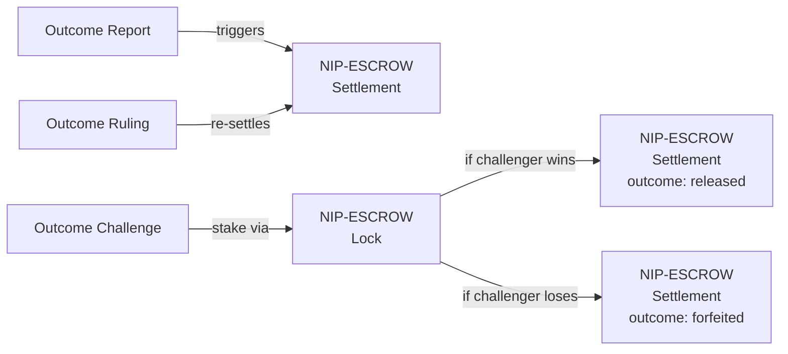

NIP-ORACLE
============

Oracle Dispute Resolution
----------------------------

`draft` `optional` `incubating`

Four addressable event kinds for challenging and resolving oracle-reported outcomes on Nostr — outcome reporting, challenges, stake-weighted voting, and authoritative rulings.

> **Design principle:** This NIP defines the *dispute process* for oracle outcomes — it does not define markets, oracle selection, or settlement execution. It composes with NIP-ESCROW for staking and settlement, and complements NIP-DISPUTES for subjective service disputes.

## Motivation

Prediction markets, insurance contracts, and automated escrow resolution all depend on oracles — external reporters of real-world outcomes. But oracles can be wrong, compromised, or malicious. When an oracle reports the wrong outcome and money moves based on that report, there is currently no standardised way on Nostr to:

- **Challenge** a reported outcome with evidence and stake
- **Escalate** unresolved challenges through increasingly authoritative resolution
- **Vote** on disputed outcomes with skin-in-the-game stake weighting
- **Rule** with finality so settlement can proceed

This NIP defines an optimistic oracle dispute protocol: outcomes are assumed correct unless challenged within a defined window, with an escalation ladder that increases cost and authority at each level.

## Prior Art

This protocol adapts proven patterns from Ethereum-based oracle systems to the Nostr event model. ~80% of the core mechanism — the optimistic assertion model, bond escalation, and stake-weighted voting — is prior art from these systems. We are upfront about this lineage.

| System | Mechanism | Used By |
|--------|-----------|---------|
| [UMA Optimistic Oracle](https://docs.uma.xyz/protocol-overview/how-does-umas-oracle-work) | Assert → challenge → DVM token vote. 98%+ undisputed. | Polymarket |
| [Reality.eth + Kleros](https://docs.kleros.io/products/oracle) | Bond escalation game (bonds double each round) with Kleros jurors as final arbitrator. | Gnosis prediction markets |
| [Augur](https://augur.net/) | REP staking with dispute rounds, forking as nuclear backstop. | Augur v2 |

**What this NIP adds beyond Ethereum precedents:**

- **Privacy for challengers and voters.** On Ethereum, all challenge and voting activity is fully public on-chain, creating social pressure and retaliation risk. NIP-ORACLE gift-wraps challenges and votes using NIP-59, making *who* challenged and *how* people voted private until resolution.
- **Lightning/Cashu staking.** Challenge stakes use NIP-ESCROW primitives (Lock/Settlement) rather than ERC-20 token deposits, enabling staking via Lightning hold invoices or Cashu HTLC tokens.
- **Nostr-native event encoding.** Addressable events with standard tag structures, composable with any Nostr application.

## Kinds

| kind  | description        |
| ----- | ------------------ |
| 30547 | Outcome Report     |
| 30548 | Outcome Challenge  |
| 30549 | Outcome Vote       |
| 30543 | Outcome Ruling     |

All four kinds are addressable events (NIP-01), allocated from the TROTT-05 safety/dispute range (30540–30549).

> **Kind allocation note:** Kind numbers 30543 and 30547 were previously allocated to addressable dispute events which moved to regular event kinds (7543, 7547) for immutability guarantees. See NIP-DISPUTES.

> **Why four kinds?** Each kind has a distinct author (oracle reports, challenger disputes, voter votes, arbiter rules), a distinct lifecycle moment, and a distinct privacy requirement (reports and rulings are public; challenges and votes are gift-wrapped). Fewer kinds would force clients to parse content to distinguish state; more kinds would fragment unnecessarily.

---

## Outcome Report (`kind:30547`)

An oracle asserts what happened in the real world. Assumed correct unless challenged within the `challenge_window`.

```json
{
  "kind": 30547,
  "pubkey": "<oracle-hex-pubkey>",
  "created_at": 1698765000,
  "tags": [
    ["d", "outcome_<random-id>"],
    ["type", "binary"],
    ["outcome", "yes"],
    ["challenge_window", "7200"],
    ["min_challenge_stake", "10000"],
    ["currency", "SAT"],
    ["a", "<market-or-escrow-event-coordinate>"],
    ["expiration", "1698772200"]
  ],
  "content": "Bitcoin exceeded $100,000 USD on 2025-12-01 per CoinGecko 00:00 UTC closing price."
}
```

Tags:

* `d` (REQUIRED): Unique identifier. RECOMMENDED format: `outcome_<random-id>`.
* `type` (REQUIRED): Outcome type. One of:
    * `binary` — yes/no, true/false, happened/didn't
    * `categorical` — one option from a defined set
    * `scalar` — numeric value
* `outcome` (REQUIRED): The asserted result. For `binary`: `yes` or `no`. For `categorical`: the selected option string. For `scalar`: the numeric value as a string.
* `challenge_window` (REQUIRED): Seconds from `created_at` until the outcome finalises. Implementations SHOULD use NIP-40 `expiration` for relay-level enforcement of the finality deadline.
* `min_challenge_stake` (REQUIRED): Minimum stake (in smallest currency unit) required to file a challenge.
* `currency` (REQUIRED): Currency code (e.g. `SAT`, `USD`, `EUR`).
* `a` (OPTIONAL): NIP-33 event coordinate referencing the market, contract, or escrow event this outcome settles.
* `options` (REQUIRED for `categorical`, multiple): `["options", "<option-string>"]`. Defines the valid set of outcomes.
* `scalar_min`, `scalar_max` (OPTIONAL for `scalar`): Bounds for valid scalar values.
* `scalar_precision` (OPTIONAL for `scalar`): Number of decimal places.
* `source` (OPTIONAL): Human-readable description of the data source used.

### Outcome Types

```mermaid
flowchart LR
    T{"type?"}
    T -->|binary| B["outcome = yes / no"]
    T -->|categorical| C["outcome = one of options tags"]
    T -->|scalar| S["outcome = numeric value"]

    style B fill:#1b3d2d,stroke:#16c79a
    style C fill:#2d2d1b,stroke:#f5a623
    style S fill:#1b2d3d,stroke:#0f3460
```



**Binary** example: "Did Bitcoin exceed $100k on 2025-12-01?" → `yes` or `no`

**Categorical** example: "Who won the 2025 World Series?" with `["options", "Team A"]`, `["options", "Team B"]`, `["options", "Team C"]` → one option string

**Scalar** example: "What was BTC price at midnight UTC 2025-12-01?" → `"98542"` (in whole USD, or use `scalar_precision` for decimals)

---

## Outcome Challenge (`kind:30548`)

A challenger disputes the oracle's reported outcome. MUST be filed within the `challenge_window` defined on the Outcome Report. Requires a stake at or above `min_challenge_stake`.

```json
{
  "kind": 30548,
  "pubkey": "<challenger-hex-pubkey>",
  "created_at": 1698766000,
  "tags": [
    ["d", "challenge_<random-id>"],
    ["e", "<outcome-report-event-id>"],
    ["proposed_outcome", "no"],
    ["stake", "10000"],
    ["currency", "SAT"],
    ["p", "<oracle-pubkey>"],
    ["p", "<arbiter-pubkey>"]
  ],
  "content": "CoinGecko 00:00 UTC closing price on 2025-12-01 was $97,842. See screenshot evidence attached."
}
```

Tags:

* `d` (REQUIRED): Unique identifier. RECOMMENDED format: `challenge_<random-id>`.
* `e` (REQUIRED): References the Outcome Report being challenged.
* `proposed_outcome` (REQUIRED): What the challenger claims is the correct outcome. Must be a valid value for the Report's `type`.
* `stake` (REQUIRED): Amount staked on this challenge, in smallest currency unit. MUST be >= the Report's `min_challenge_stake`.
* `currency` (REQUIRED): Currency code (must match the Report's currency).
* `p` (REQUIRED): Oracle pubkey and arbiter pubkey (if designated). Used as gift-wrap recipients.

`content`: Evidence and reasoning supporting the challenge.

### Challenge Window

Challenges MUST be filed before `created_at + challenge_window` of the referenced Outcome Report. Implementations MUST reject challenges filed after this deadline.

> **Privacy:** This event MUST be delivered via NIP-59 gift wrap. See [Privacy](#privacy).

---

## Outcome Vote (`kind:30549`)

A stake-weighted vote on a disputed outcome. Only used during Level 2 escalation (community vote). Voters stake to participate — this is not a free poll.

```json
{
  "kind": 30549,
  "pubkey": "<voter-hex-pubkey>",
  "created_at": 1698770000,
  "tags": [
    ["d", "vote_<random-id>"],
    ["e", "<outcome-challenge-event-id>"],
    ["vote", "no"],
    ["stake", "5000"],
    ["currency", "SAT"],
    ["p", "<challenger-pubkey>"],
    ["p", "<oracle-pubkey>"],
    ["p", "<arbiter-pubkey>"]
  ],
  "content": ""
}
```

Tags:

* `d` (REQUIRED): Unique identifier. RECOMMENDED format: `vote_<random-id>`.
* `e` (REQUIRED): References the Outcome Challenge being voted on.
* `vote` (REQUIRED): The voted outcome. Must be a valid value for the original Report's `type`.
* `stake` (REQUIRED): Amount staked on this vote, in smallest currency unit.
* `currency` (REQUIRED): Currency code.
* `p` (REQUIRED): Dispute participants — challenger, oracle, and arbiter (if designated). Used as gift-wrap recipients.

### Voting Rules

- Votes are weighted by stake amount — larger stakes carry more influence.
- A supermajority (67% of total stake) resolves the dispute at Level 2.
- Voters on the winning side receive their stake back plus a proportional share of losing stakes.
- Voters on the losing side forfeit their stake.
- If no supermajority is reached within the voting window, the dispute escalates to Level 3.

### Vote Tally and Public Verification

Individual votes are gift-wrapped during the voting window to prevent bandwagon effects. After the voting window closes, the Level 2 Outcome Ruling MUST include aggregate tally data so third parties can verify the result without trusting the ruling publisher:

The Ruling event (`level: 2`) MUST include these additional tags:

* `total_stake` (REQUIRED): Total stake across all votes, in smallest currency unit.
* `outcome_stake` (REQUIRED, one per outcome): `["outcome_stake", "<outcome_value>", "<total_stake_for_this_outcome>"]`. Enables independent verification that the winning outcome met the 67% threshold.
* `vote_count` (REQUIRED): Total number of votes cast.

> **Open problem:** The aggregate tally proves the *margin* but not that individual votes were counted correctly — verifying that requires either a public vote reveal after the window closes or a cryptographic tally proof (e.g. homomorphic commitments). This NIP is marked `incubating` until a practical verification mechanism is specified.

> **Privacy:** This event MUST be delivered via NIP-59 gift wrap. See [Privacy](#privacy).

---

## Outcome Ruling (`kind:30543`)

The final authoritative resolution of a challenged outcome. Non-appealable. The publisher depends on the escalation level:

- **Level 1:** The oracle (concession — publishes a corrected Report and this Ruling)
- **Level 2:** Any participant, once the voting window closes and the supermajority threshold is met. The published `outcome` MUST match the stake-weighted majority.
- **Level 3:** The designated arbiter

```json
{
  "kind": 30543,
  "pubkey": "<arbiter-hex-pubkey>",
  "created_at": 1698775000,
  "tags": [
    ["d", "ruling_<random-id>"],
    ["e", "<outcome-challenge-event-id>"],
    ["outcome", "no"],
    ["level", "3"],
    ["a", "<market-or-escrow-event-coordinate>"]
  ],
  "content": "After reviewing CoinGecko, CoinMarketCap, and Binance price data, BTC closed at $97,842 on 2025-12-01. Original report of 'yes' (exceeded $100k) was incorrect."
}
```

Tags:

* `d` (REQUIRED): Unique identifier. RECOMMENDED format: `ruling_<random-id>`.
* `e` (REQUIRED): References the Outcome Challenge that triggered this ruling.
* `outcome` (REQUIRED): The final determined outcome.
* `level` (REQUIRED): Which escalation level resolved the dispute. One of `1` (oracle concession), `2` (community vote), `3` (designated arbiter).
* `a` (OPTIONAL): NIP-33 event coordinate referencing the market or escrow event, for settlement triggering.

`content`: Reasoning and evidence supporting the ruling. Signed by the ruling party's key.

### Settlement After Ruling

After a Ruling is published:

1. **Challenger wins** (Ruling outcome differs from original Report): Challenger's stake is returned. Oracle's stake (if bonded) is forfeited. Escrow settlement proceeds based on the corrected outcome.
2. **Oracle wins** (Ruling outcome matches original Report): Challenger's stake is forfeited to the oracle. Original settlement stands.

Settlement execution uses NIP-ESCROW Settlement events (`kind:30533` with `outcome: released` or `outcome: forfeited`) -- this NIP defines the dispute process, not the money movement.

---

## Escalation Ladder

```mermaid
sequenceDiagram
    actor O as Oracle
    actor C as Challenger
    participant V as Voters
    participant A as Arbiter

    O->>O: Outcome Report (public)
    Note right of O: Outcome assumed correct

    rect rgb(27, 45, 61)
        Note over O,C: Level 1 — Evidence Window
        C-->>O: Outcome Challenge (gift-wrapped)
        Note left of C: Challenger stakes + provides evidence

        alt Oracle concedes
            O->>O: New Outcome Report (corrected)
            O->>C: Outcome Ruling level=1 (public)
            Note right of O: Challenger stake returned
        else Oracle does not concede
            Note over O,C: Escalates to Level 2
        end
    end

    rect rgb(45, 45, 27)
        Note over C,V: Level 2 — Community Vote
        V-->>V: Outcome Vote (gift-wrapped)
        V-->>V: Outcome Vote (gift-wrapped)
        V-->>V: Outcome Vote (gift-wrapped)
        Note right of V: Stake-weighted, 67% supermajority

        alt Supermajority reached
            V->>V: Outcome Ruling level=2 (public)
            Note right of V: Winning voters share losing stakes
        else No supermajority
            Note over V,A: Escalates to Level 3
        end
    end

    rect rgb(61, 27, 27)
        Note over C,A: Level 3 — Designated Arbiter
        A->>A: Outcome Ruling level=3 (public)
        Note right of A: Final, non-appealable
    end
```



> **Arrow legend:** `—>>` solid = public event · `-->>` dashed = NIP-59 gift-wrapped (private)

### Level 1: Evidence Window

The challenger files an Outcome Challenge with stake and evidence. The oracle has the duration of the original `challenge_window` to respond:

- **Concede:** Oracle publishes a corrected Outcome Report and a Ruling at level `1`. Challenger's stake is returned.
- **No response:** Dispute escalates to Level 2.

### Level 2: Community Vote

A stake-weighted vote opens. Anyone may participate by publishing an Outcome Vote with stake:

- **Supermajority (67%+ of total stake):** The majority outcome becomes the Ruling at level `2`. Winning voters receive their stake back plus a proportional share of losing stakes.
- **No supermajority within voting window:** Dispute escalates to Level 3.

Implementations SHOULD define a voting window (RECOMMENDED: 48 hours).

### Level 3: Designated Arbiter

A pre-designated arbiter (specified at market or contract creation time) reviews all evidence, votes, and arguments, then publishes a final Outcome Ruling at level `3`. This ruling is non-appealable.

If no arbiter was designated, implementations SHOULD fall back to Level 2 with an extended voting window.

### Stake Economics

Individual vote minimums are lower than challenge stakes (encouraging participation), but the total stake pool grows at each level — more participants means more capital at risk:

```mermaid
flowchart LR
    L1["Level 1\nChallenge stake\n≥ min_challenge_stake"] --> L2["Level 2\nVote stake\n≥ min_challenge_stake × 0.5"]
    L2 --> L3["Level 3\nArbiter review\n(no additional stake)"]

    style L1 fill:#1b3d2d,stroke:#16c79a
    style L2 fill:#2d2d1b,stroke:#f5a623
    style L3 fill:#3d1b1b,stroke:#dc3545
```



## Composition

### With NIP-ESCROW

NIP-ORACLE composes cleanly with [NIP-ESCROW](NIP-ESCROW.md) for staking and settlement:



- **Outcome Report triggers settlement:** Applications watch for Report events matching escrow condition tags, then publish NIP-ESCROW Settlement events with the appropriate `outcome` tag.
- **Challenge stakes use escrow:** Challengers lock their stake via NIP-ESCROW Lock (`kind:30532`). Winners receive Settlement (`kind:30533`) with `outcome: released`; losers receive Settlement (`kind:30533`) with `outcome: forfeited`.
- **Ruling triggers re-settlement:** If a challenge succeeds, the corrected outcome triggers new NIP-ESCROW Settlement events.

### With NIP-DISPUTES

NIP-ORACLE and [NIP-DISPUTES](NIP-DISPUTES.md) are complementary:

| | NIP-ORACLE | NIP-DISPUTES |
|-|------------|--------------|
| **Question** | "Did event X happen?" | "Was the service acceptable?" |
| **Nature** | Objective — verifiable facts | Subjective — quality, fairness |
| **Resolution** | Escalation ladder (evidence → vote → arbiter) | Mediator or community panel |
| **Use case** | Prediction markets, insurance, automated resolution | Service disputes, marketplace complaints |

A platform might use both: NIP-ORACLE for outcome verification (did the event happen?) and NIP-DISPUTES for platform-level complaints (was the market operator fair?).

## Replaceability

All four kinds are addressable events.

For Outcome Report, replaceability is useful — an oracle MAY correct their report by republishing with the same `d` tag (this constitutes a Level 1 concession if a challenge is active).

For Outcome Challenge, Outcome Vote, and Outcome Ruling, these events represent real-world commitments (staked funds, cast votes, final decisions). Clients MUST treat the first valid instance of each `d` tag as canonical and SHOULD ignore replacements. Relays MAY enforce write-once semantics for these kinds.

## Security Considerations

* **Optimistic finality.** Outcomes finalise automatically after the `challenge_window` expires without a challenge. Applications MUST NOT settle before this deadline.
* **Stake requirements.** The `min_challenge_stake` prevents spam challenges. Implementations SHOULD set this high enough to deter frivolous disputes while remaining accessible for legitimate challenges.
* **Sybil resistance.** Stake-weighted voting is inherently sybil-resistant — splitting stake across multiple identities provides no advantage. However, implementations SHOULD monitor for coordinated voting from recently-created pubkeys.
* **Oracle collusion.** If the oracle and arbiter are the same entity or collude, the system degrades to a trusted oracle. Implementations SHOULD ensure the designated arbiter is independent of the oracle.
* **Challenge window manipulation.** Oracles MUST NOT set unreasonably short challenge windows. Implementations SHOULD enforce a minimum (RECOMMENDED: 1 hour).
* **Vote privacy.** Gift-wrapping votes prevents real-time vote tracking that could enable bandwagon effects or voter intimidation. Votes are revealed only after the voting window closes.

## Privacy

Oracle disputes involve staked funds and votes that should not be visible to passive observers during the dispute process. Challenges and votes MUST be delivered privately using [NIP-59](https://github.com/nostr-protocol/nips/blob/master/59.md) gift wrap.

### Gift-wrap requirements

| Kind | Event | Requirement | Recipients |
|------|-------|-------------|------------|
| 30548 | Outcome Challenge | MUST gift-wrap | Challenger, oracle, arbiter (if designated) |
| 30549 | Outcome Vote | MUST gift-wrap | Challenger, oracle, arbiter (if designated) |

The inner event (the sealed rumour) retains its full tag structure — gift wrap provides the privacy layer, not tag restructuring. Recipients unwrap the NIP-59 envelope to access the original event.

Challenge content and vote stakes MAY additionally be NIP-44 encrypted pairwise to each gift-wrap recipient as defense in depth. NIP-44 is pairwise — each gift-wrapped copy carries content encrypted to that specific recipient.

### Events that remain public

| Kind | Event | Rationale |
|------|-------|-----------|
| 30547 | Outcome Report | Markets need to see reported outcomes to function |
| 30543 | Outcome Ruling | Settlement requires publicly verifiable finality |

### Why privacy matters here

On Ethereum-based oracle systems (UMA, Kleros, Augur), all challenge and voting activity is fully visible on-chain. This creates:

- **Social pressure** — challengers are publicly identified, discouraging challenges against powerful oracles
- **Retaliation risk** — voters can be targeted based on how they voted
- **Bandwagon effects** — real-time vote tallies influence subsequent voters

Gift-wrapping challenges and votes eliminates these problems while maintaining the same game-theoretic incentives.

### Metadata minimisation

Implementations SHOULD include only the tags marked REQUIRED in each event kind. Optional tags increase the metadata surface — omit them unless the application specifically needs them.

## Dependencies

* [NIP-01](https://github.com/nostr-protocol/nips/blob/master/01.md): Basic protocol flow, addressable events
* [NIP-40](https://github.com/nostr-protocol/nips/blob/master/40.md): Expiration timestamps (challenge window enforcement)
* [NIP-44](https://github.com/nostr-protocol/nips/blob/master/44.md): Versioned encrypted payloads (defense in depth for challenges and votes)
* [NIP-59](https://github.com/nostr-protocol/nips/blob/master/59.md): Gift wrap (private delivery of challenges and votes)

## Reference Implementation

No reference implementation exists yet. The protocol is designed to compose with:

* [NIP-ESCROW](NIP-ESCROW.md) — Conditional payment coordination (staking and settlement)
* [NIP-DISPUTES](NIP-DISPUTES.md) — Subjective dispute resolution (complementary protocol)
* @trott/sdk — TypeScript library with builders and parsers for NIP-ESCROW and NIP-DISPUTES kinds
