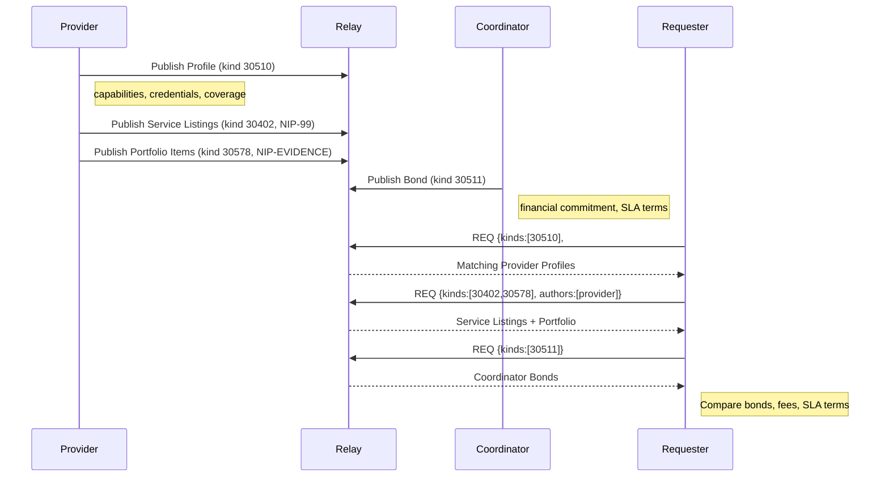

NIP-PROVIDER-PROFILES
=====================

Service Provider Profiles
-------------------------

`draft` `optional`

Two addressable event kinds for declaring service provider capabilities and coordinator commitments on Nostr. Service catalogues compose with NIP-99 (Classified Listings); portfolio items compose with NIP-EVIDENCE.

## Motivation

Nostr has NIP-24 for basic user metadata (name, about, picture) and NIP-89 for application handler announcements. Neither supports structured declarations of what a service provider can do, where they operate, what credentials they hold, or what terms they offer. As Nostr expands beyond social media into marketplaces, DVMs, freelance platforms, and local services, providers need a machine-readable way to advertise their capabilities so clients can filter and match programmatically.

Similarly, coordinators (entities that facilitate discovery, matching, or escrow between parties) need a way to publicly declare their financial commitment, supported categories, fee structure, and service-level agreements. This enables participants to evaluate and compare coordinators transparently.

Structured service listings and portfolio showcases use existing NIPs (NIP-99 for classified listings; NIP-EVIDENCE for evidence records) rather than introducing new kinds. This keeps the kind count minimal while composing naturally with the wider Nostr ecosystem.

## Relationship to Existing NIPs

* **NIP-24 (User Metadata):** Kind 0 is general identity. Provider Profiles are structured service declarations with geographic coverage, credentials, and machine-readable capabilities.
* **NIP-89 (Application Handlers):** Application announcements, not service provider declarations.
* **NIP-99 (Classified Listings):** Service catalogues use NIP-99. Each service offering is a classified listing (`kind:30402`) with provider-specific tags. Profile kind 30510 `featured_service` tags reference NIP-99 listing d-tags. See [Composing with NIP-99](#composing-with-nip-99) below.
* **NIP-EVIDENCE (kind 30578):** Portfolio items use NIP-EVIDENCE with `evidence_type: portfolio`. Completed work evidence is discoverable alongside other evidence records. See [Composing with NIP-EVIDENCE](#composing-with-nip-evidence) below.
* **NIP-58 (Badges):** Credential compatibility. Credential attestations (NIP-VA kind 31000) can reference NIP-58 badge definitions.
* **NIP-REPUTATION (kind 30520):** Ratings reference provider profiles for cross-referencing.
* **NIP-CRAFTS:** Practitioner skill profiles use Provider Profiles (kind 30510) with `craft:*` extension tags for proficiency levels, tradition, endangerment status, and specialism. See NIP-CRAFTS for the full tag vocabulary.

## Kinds

| kind  | description              |
| ----- | ------------------------ |
| 30510 | Service Provider Profile |
| 30511 | Coordinator Bond         |

## Kind 30510: Service Provider Profile

An addressable event declaring a provider's capabilities, credentials, coverage areas, and service terms. Unlike ephemeral availability beacons, this event persists on relays and represents the provider's long-term profile.

```json
{
    "kind": 30510,
    "pubkey": "<provider-hex-pubkey>",
    "created_at": 1698700000,
    "tags": [
        ["d", "<provider-hex-pubkey>_profile"],
        ["t", "domain:plumbing"],
        ["t", "domain:emergency-repairs"],
        ["t", "skill:plumber"],
        ["t", "skill:gas-fitting"],
        ["t", "credential:gas_safe_registered"],
        ["domain", "plumbing"],
        ["domain", "emergency-repairs"],
        ["skill", "plumber"],
        ["skill", "gas-fitting"],
        ["credential", "gas_safe_registered"],
        ["credential_proof", "gas_safe_registered", "https://verify.example.com/<id>"],
        ["g", "gcp"],
        ["g", "gcpu"],
        ["coverage_geohash", "gcpuu"],
        ["coverage_geohash", "gcpuv"],
        ["coverage_precision", "5"],
        ["coverage_merge_threshold", "0.5"],
        ["coverage_radius_km", "25"],
        ["languages", "en,pl"],
        ["operating_hours", "08:00-22:00"],
        ["timezone", "Europe/London"],
        ["rating", "4.8"],
        ["completed_tasks", "431"],
        ["member_since", "1672531200"],
        ["expiration", "1730000000"]
    ],
    "content": "Qualified plumber and gas fitter serving Greater London. Gas Safe registered. Available for emergencies 24/7.",
    "id": "<32-byte-hex>",
    "sig": "<64-byte-hex>"
}
```

Tags:

* `d` (REQUIRED): Unique identifier for this profile. Recommended format: `<pubkey>_profile`.
* `t` (RECOMMENDED, one or more): Relay-indexed discovery tokens using namespaced prefixes. NIP-01 defines subscription filters for single-letter tags only; multi-letter tags are not relay-indexed. Use `t` tags for values that need relay-side filtering: `["t", "domain:plumbing"]`, `["t", "skill:gas-fitting"]`, `["t", "credential:gas_safe_registered"]`.
* `domain` (RECOMMENDED, one or more): Service categories the provider operates in. Multiple tags for multi-domain providers. **Client-side metadata** - not relay-indexed; use `t` tags with `domain:` prefix for relay queries.
* `skill` (RECOMMENDED, one or more): Specific capabilities within domains. **Client-side metadata** - use `t` tags with `skill:` prefix for relay queries.
* `credential` (OPTIONAL, one or more): Qualifications, licences, or certifications held. Machine-readable identifiers (e.g. `gas_safe_registered`, `first_aid_certified`). **Client-side metadata** - use `t` tags with `credential:` prefix for relay queries.
* `credential_proof` (OPTIONAL): Verification URL for a credential. Format: `["credential_proof", "<credential-id>", "<verification-url>"]`.
* `g` (RECOMMENDED, one or more): Geohash at precision 3 and 4, derived from the unique prefixes of all `coverage_geohash` tags. `g` tags are relay-indexed (single-letter Nostr tags) and enable geographic filtering via `#g` subscription filters. `coverage_geohash` tags remain the authoritative fine-grained coverage definition; `g` tags are coarse hints for relay-side narrowing.
* `coverage_geohash` (OPTIONAL, one or more): Geohash cells (precision 4-5) where the provider operates. Enables geographic filtering.
* `coverage_precision` (OPTIONAL): Maximum geohash precision (3-9) used when computing coverage cells from zone shapes. Editorial setting for re-computation.
* `coverage_merge_threshold` (OPTIONAL): Merge threshold (0.1-1.0) controlling how aggressively adjacent cells are merged when computing coverage from zones.
* `coverage_radius_km` (OPTIONAL): Maximum travel distance from coverage area in kilometres.
* `coverage_zones` (OPTIONAL): NIP-44 encrypted `ServiceAreaDefinition` JSON (encrypted to event author). Contains original zone shapes (circles, polygons) with include/exclude modes for lossless re-editing. Not used for discovery; `coverage_geohash` tags remain the public representation.
* `languages` (OPTIONAL): Comma-separated ISO 639-1 language codes.
* `operating_hours` (OPTIONAL): Operating hours in 24-hour format (e.g. `08:00-22:00`).
* `timezone` (OPTIONAL): IANA timezone identifier.
* `emergency_available` (OPTIONAL): `true` if the provider offers emergency/out-of-hours service.
* `rating` (OPTIONAL): Current aggregate rating (decimal, 1.0-5.0). Informational; verifiable ratings use `kind:30520` (see [NIP-REPUTATION](NIP-REPUTATION.md)).
* `completed_tasks` (OPTIONAL): Total completed tasks. Informational.
* `member_since` (OPTIONAL): Unix timestamp of when the provider joined.
* `standing_offer` (OPTIONAL): `true` if the provider operates a standing-offer service (walk-in, market stall).
* `availability_schedule` (OPTIONAL): Simplified day-and-time format, e.g. `["availability_schedule", "mon,wed,fri 09:00-17:00"]`. Multiple tags for complex schedules.
* `resource_type` (OPTIONAL): One of `service` (default), `space` (physical space for booking), `equipment` (items for hire).
* `hero_image` (OPTIONAL): URI of a primary image representing the provider's business or brand. Storefront summary tag.
* `tagline` (OPTIONAL): Short marketing tagline (max 120 characters). Storefront summary tag.
* `featured_service` (OPTIONAL, one or more): Structured tag highlighting a service from the provider's NIP-99 classified listings. Format: `["featured_service", "<slug>", "<display_name>", "<price_indicator>"]`. The slug matches the d-tag suffix of a `kind:30402` listing. Multiple tags allowed.
* `portfolio_count` (OPTIONAL): Number of portfolio evidence records (`kind:30578` with `evidence_type: portfolio`) the provider has published. Informational convenience; clients MAY display this without fetching evidence events.
* `expiration` (OPTIONAL): NIP-40 expiration. When set, the profile auto-expires and MUST be republished to remain discoverable.

`content`: Free-text description of the provider's services.

#### Encrypted Service Area Zones

The `coverage_zones` tag contains a NIP-44 ciphertext encrypted to the event author's own pubkey. When decrypted, it yields a `ServiceAreaDefinition` JSON object:

```json
{
  "version": 1,
  "precision": 5,
  "mergeThreshold": 0.5,
  "zones": [
    {
      "id": "z1",
      "mode": "include",
      "type": "circle",
      "label": "Home base",
      "centre": [-1.54, 53.78],
      "radiusMiles": 10
    },
    {
      "id": "z2",
      "mode": "exclude",
      "type": "polygon",
      "label": "Not my area",
      "vertices": [[-1.52, 53.80], [-1.50, 53.79], [-1.51, 53.77]]
    }
  ]
}
```

**Zone modes:**
- `include` - provider operates in this area (geohashes contribute to `coverage_geohash` tags)
- `exclude` - provider does not operate here (geohashes subtracted from coverage)
- Additional modes may be defined in future (e.g. `preferred`, `surcharge`)

**Zone types:**
- `circle` - defined by `centre` ([lon, lat]) and `radiusMiles`
- `polygon` - defined by `vertices` ([[lon, lat], ...])

The `precision` and `mergeThreshold` fields are editorial settings used to recompute geohashes from shapes. They are not used for discovery.

### Virtual (Non-Geographic) Providers

Providers offering remote services (consulting, tutoring, software development) MAY omit `coverage_geohash` tags. Discovery relies on `domain`, `skill`, and `credential` tags instead.

### Multi-Domain Providers

A provider serving multiple categories includes multiple `domain` and `skill` tags in a single profile event:

```json
{
    "kind": 30510,
    "tags": [
        ["d", "<pubkey>_profile"],
        ["t", "domain:plumbing"],
        ["t", "domain:electrical"],
        ["t", "skill:plumber"],
        ["t", "skill:electrician"],
        ["t", "credential:gas_safe_registered"],
        ["t", "credential:niceic_approved"],
        ["domain", "plumbing"],
        ["domain", "electrical"],
        ["skill", "plumber"],
        ["skill", "electrician"],
        ["credential", "gas_safe_registered"],
        ["credential", "niceic_approved"]
    ],
    "id": "<32-byte-hex>",
    "sig": "<64-byte-hex>"
}
```

### REQ Filters

NIP-01 defines subscription filters for single-letter tag names only (`#g`, `#t`, `#p`, `#e`, etc.). Multi-letter tag names (`domain`, `skill`, `credential`, `coverage_geohash`) are event metadata for client-side post-filtering; relays will not index them.

Find providers by category and coarse location:

```json
{
    "kinds": [30510],
    "#t": ["domain:plumbing"],
    "#g": ["gcpu"]
}
```

Find providers by credential:

```json
{
    "kinds": [30510],
    "#t": ["credential:gas_safe_registered"]
}
```

Find providers by skill in a location (use precision 3-4 `g` values; profiles publish `g` tags at these precisions only):

```json
{
    "kinds": [30510],
    "#t": ["skill:gas-fitting"],
    "#g": ["gcpu"]
}
```

For fine-grained coverage filtering, fetch events matching the coarse `#g` filter and post-filter client-side on `coverage_geohash` tags (precision 4-5).

## Kind 30511: Coordinator Bond

An addressable event declaring a coordinator's financial commitment, supported categories, fee structure, and service-level agreement. Coordinators are entities that facilitate discovery, matching, escrow, or dispute resolution between requesters and providers. This event enables participants to evaluate and compare coordinators transparently.

```json
{
    "kind": 30511,
    "pubkey": "<coordinator-hex-pubkey>",
    "created_at": 1698700000,
    "tags": [
        ["d", "<coordinator-hex-pubkey>_bond"],
        ["domain", "plumbing"],
        ["domain", "electrical"],
        ["amount", "5000000"],
        ["currency", "GBP"],
        ["bond_txid", "a1b2c3d4e5f6..."],
        ["fee_percent", "5.0"],
        ["service_area_geohash", "gcpuu"],
        ["service_area_geohash", "gcpuv"],
        ["service_area_name", "Greater London"],
        ["supported_currencies", "GBP,SAT"],
        ["max_response_seconds", "300"],
        ["background_checks", "true"],
        ["insurance_required", "true"],
        ["api_url", "https://coordinator.example.com"],
        ["expiration", "1730000000"]
    ],
    "content": "Greater London coordinator covering plumbing and electrical services. All providers background-checked and insured.",
    "id": "<32-byte-hex>",
    "sig": "<64-byte-hex>"
}
```

Tags:

* `d` (REQUIRED): Unique identifier. Recommended format: `<pubkey>_bond`.
* `domain` (RECOMMENDED, one or more): Service categories the coordinator supports.
* `amount` (REQUIRED): Bond amount in smallest currency unit (pence for GBP, cents for USD, satoshis for SAT).
* `currency` (REQUIRED): Currency code for the bond amount.
* `bond_txid` (OPTIONAL): On-chain transaction ID proving the bond deposit.
* `bond_address` (OPTIONAL): Address holding the bond (for on-chain verification).
* `fee_percent` (OPTIONAL): Commission percentage charged per transaction.
* `service_area_geohash` (OPTIONAL, one or more): Geohash cells covering the coordinator's service area.
* `service_area_name` (OPTIONAL): Human-readable area name.
* `supported_currencies` (OPTIONAL): Comma-separated currency codes accepted.
* `trust_models` (OPTIONAL): Comma-separated supported trust models (e.g. `fiat-escrow,trustless,ecash-htlc`).
* `payment_providers` (OPTIONAL): Comma-separated payment rails supported.
* `min_provider_rating` (OPTIONAL): Minimum rating required for providers on this coordinator.
* `max_response_seconds` (OPTIONAL): SLA - maximum time to respond to a request.
* `background_checks` (OPTIONAL): `true` if the coordinator requires provider background checks.
* `insurance_required` (OPTIONAL): `true` if the coordinator requires provider insurance.
* `api_url` (OPTIONAL): Coordinator's API endpoint.
* `ws_url` (OPTIONAL): Coordinator's WebSocket endpoint for real-time communication.
* `expiration` (OPTIONAL): NIP-40 expiration.

`content`: Free-text description of the coordinator's services and terms.

### Bond Verification

The `bond_txid` and `bond_address` tags enable independent verification that the coordinator has committed funds. Clients SHOULD verify the bond on-chain when available. The bond amount signals the coordinator's financial skin in the game; higher bonds indicate greater commitment and potential liability.

## Composing with NIP-99

Service catalogues use [NIP-99 Classified Listings](https://github.com/nostr-protocol/nips/blob/master/99.md) (`kind:30402`). Rather than defining a separate catalogue kind, each service offering becomes an independent NIP-99 listing event. This is a natural fit: NIP-99 is listing-centric ("what's for sale") and each service is exactly that.

### Service Listing Structure

Each service the provider offers is published as a separate `kind:30402` event:

```json
{
    "kind": 30402,
    "pubkey": "<provider-hex-pubkey>",
    "created_at": 1740000000,
    "tags": [
        ["d", "<provider-hex-pubkey>:service:lockout-emergency"],
        ["title", "Lock-out Emergency Service"],
        ["summary", "Entry for residential lock-outs"],
        ["price", "9500", "GBP", "session"],
        ["t", "domain:plumbing"],
        ["location", "gcpu"],
        ["expiration", "1771536000"]
    ],
    "content": "Professional lock-out service for residential properties across Greater London. Includes non-destructive entry where possible, lock assessment, and security advice. Prices include VAT. Call-out fee of £25 applies outside M25."
}
```

A provider with multiple services publishes multiple `kind:30402` events:

```json
{
    "kind": 30402,
    "pubkey": "<provider-hex-pubkey>",
    "created_at": 1740000000,
    "tags": [
        ["d", "<provider-hex-pubkey>:service:lock-change"],
        ["title", "Lock Change"],
        ["summary", "Replace existing lock with new cylinder"],
        ["price", "7500", "GBP", "session"],
        ["t", "domain:plumbing"],
        ["location", "gcpu"],
        ["expiration", "1771536000"]
    ],
    "content": "Full lock replacement service. Includes removal of existing cylinder, fitting of new lock, and testing. All locks conform to BS 3621."
}
```

### D-tag Convention

The `d` tag SHOULD follow the pattern `<provider_pubkey>:service:<slug>`. The slug is a stable, machine-readable identifier for the service. This convention ensures uniqueness per provider and enables direct referencing from profile `featured_service` tags.

### Linking Profiles to Listings

The `featured_service` tag on a provider's Kind 30510 profile references NIP-99 listing d-tag slugs:

```json
["featured_service", "lockout-emergency", "Lock-out Emergency", "from £95"]
```

The first value (`lockout-emergency`) matches the slug portion of the NIP-99 listing's d-tag (`<pubkey>:service:lockout-emergency`).

### REQ Filter

Fetch all service listings by a provider:

```json
{
    "kinds": [30402],
    "authors": ["<provider-hex-pubkey>"]
}
```

Fetch service listings by domain:

```json
{
    "kinds": [30402],
    "#t": ["domain:plumbing"]
}
```

### Behaviour Notes

- Each service is independently publishable, updatable, and deletable.
- Prices are indicative only; authoritative pricing is established during task negotiation.
- Republishing with the same `d` tag replaces that service listing.
- The `price` tag follows NIP-99 conventions: `["price", "<amount>", "<currency>", "<frequency>"]`. Amount is in the smallest currency unit (pence for GBP, cents for USD, satoshis for SAT).

## Composing with NIP-EVIDENCE

Portfolio items use [NIP-EVIDENCE](NIP-EVIDENCE.md) (`kind:30578`). A portfolio item is evidence of completed work, which maps directly to NIP-EVIDENCE's purpose. Using `evidence_type: portfolio` distinguishes portfolio artefacts from other evidence records (inspection findings, compliance records, etc.) while keeping them discoverable in the same evidence namespace.

### Portfolio Evidence Structure

Each portfolio item is published as a `kind:30578` evidence record:

```json
{
    "kind": 30578,
    "pubkey": "<provider-hex-pubkey>",
    "created_at": 1740000000,
    "tags": [
        ["d", "<provider-hex-pubkey>:portfolio:1739800000"],
        ["evidence_type", "portfolio"],
        ["p", "<provider-hex-pubkey>"],
        ["domain", "plumbing"],
        ["title", "Emergency pipe repair"],
        ["image", "https://example.com/before.jpg"],
        ["image", "https://example.com/after.jpg"],
        ["location", "Islington, London"],
        ["captured_at", "1739800000"]
    ],
    "content": "Emergency burst pipe in a period property. Isolated the supply, replaced the damaged section, and pressure-tested before leaving."
}
```

### D-tag Convention

The `d` tag SHOULD follow the pattern `<provider_pubkey>:portfolio:<unix_timestamp>`. The timestamp ensures chronological ordering and uniqueness.

### Linking to Service Listings

Portfolio evidence MAY reference a NIP-99 service listing via a `service_ref` tag containing the listing slug:

```json
["service_ref", "lockout-emergency"]
```

This links the portfolio item to the corresponding `kind:30402` listing with d-tag `<pubkey>:service:lockout-emergency`.

### REQ Filter

Fetch all portfolio items by a provider:

```json
{
    "kinds": [30578],
    "authors": ["<provider-hex-pubkey>"],
    "#evidence_type": ["portfolio"]
}
```

Since `evidence_type` is a multi-letter tag, relay support for `#evidence_type` filtering varies. Clients SHOULD fall back to fetching all `kind:30578` events by author and post-filtering on the `evidence_type` tag client-side.

### Behaviour Notes

- Each portfolio item is independently publishable and deletable.
- Location SHOULD be coarse (neighbourhood or city level) to protect client privacy.
- The `portfolio_count` tag on Kind 30510 MAY be updated to reflect the current number of published portfolio evidence records.
- The `e` tag MAY reference the original task event (only when the task was public and the requester consented).

## Protocol Flow



1. **Provider publishes profile:** Creates a `kind:30510` event with capabilities, credentials, and coverage area.
2. **Provider publishes service listings:** Optionally creates `kind:30402` (NIP-99) events for each service offered, with structured pricing and descriptions.
3. **Provider publishes portfolio:** Optionally creates `kind:30578` (NIP-EVIDENCE) events with `evidence_type: portfolio` showcasing completed work.
4. **Coordinator publishes bond:** Creates a `kind:30511` event with financial commitment and SLA terms.
5. **Requester discovers providers:** Queries relays using `#g` and `#t` filters on `kind:30510` (e.g. `#t: ["domain:plumbing"]`, `#g: ["gcpu"]`). Multi-letter tags (`domain`, `skill`, `credential`, `coverage_geohash`) are post-filtered client-side.
6. **Requester browses storefront:** Fetches `kind:30402` (NIP-99) and `kind:30578` (NIP-EVIDENCE) events by provider pubkey to review services and past work.
7. **Requester evaluates coordinators:** Queries `kind:30511` events to compare bond amounts, fees, and SLA terms.
8. **Ongoing updates:** Providers and coordinators republish their addressable events to update capabilities, coverage, or terms.

## Use Cases Beyond Task Coordination

### Nostr Marketplace Seller Profiles
Sellers publish structured profiles (kind:30510) with service areas, accepted payment methods, and credential attestations. Buyers discover sellers by capability, not just by following.

### Professional Networking
Professionals publish verifiable credentials (certifications, licences) attached to their Nostr keypair. Portable across any client that reads kind:30510.

### Content Creator Portfolios
Creators publish portfolio evidence records (kind:30578 with `evidence_type: portfolio`): writing samples, design work, code contributions. Discoverable via relay queries alongside all other evidence records.

### Community Expert Directories
Communities maintain directories of vetted experts. NIP-99 service listings (kind:30402) describe what each expert offers. Coordinator bonds (kind:30511) signal commitment.

## Security Considerations

* **Self-declared data.** Profile data is self-declared by the provider. Claims about credentials, ratings, and completed tasks SHOULD be verified against signed credential attestations (`kind:31000`, see [NIP-REPUTATION](NIP-REPUTATION.md)) and on-chain proof where available.
* **Bond verification.** Coordinator bonds referencing on-chain transactions can be independently verified. Bonds without verifiable proof SHOULD be treated with caution.
* **Profile freshness.** Clients SHOULD check `created_at` timestamps and `expiration` tags. Stale profiles may not reflect current capabilities.
* **Sybil resistance.** A single entity can create multiple provider profiles. Cross-referencing with reputation data (`kind:30520`) and credential attestations (`kind:31000`) helps distinguish genuine providers from Sybil accounts.

## Dependencies

* [NIP-01](https://github.com/nostr-protocol/nips/blob/master/01.md): Basic protocol flow, addressable events
* [NIP-40](https://github.com/nostr-protocol/nips/blob/master/40.md): Expiration timestamps
* [NIP-58](https://github.com/nostr-protocol/nips/blob/master/58.md): Badges (credential compatibility)
* [NIP-99](https://github.com/nostr-protocol/nips/blob/master/99.md): Classified Listings (service catalogues)
* [NIP-EVIDENCE](NIP-EVIDENCE.md): Timestamped Evidence Recording (portfolio items)

## Reference Implementation

The [`@trott/sdk`](https://github.com/TheCryptoDonkey/trott-sdk) TypeScript library provides builders and parsers for the kinds defined in this NIP. For standalone use without TROTT, implementors SHOULD refer to the kind definitions above.

A minimal implementation requires:

1. A Nostr client that supports addressable event publishing and tag-based queries.
2. A geohash library for encoding coverage areas into `coverage_geohash` tags.
3. Profile display logic that cross-references `credential` tags against `kind:31000` credential attestations.
