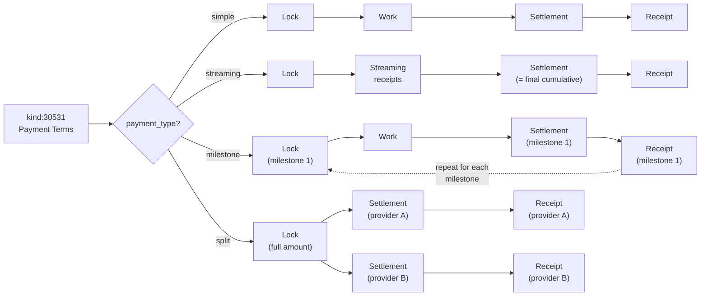
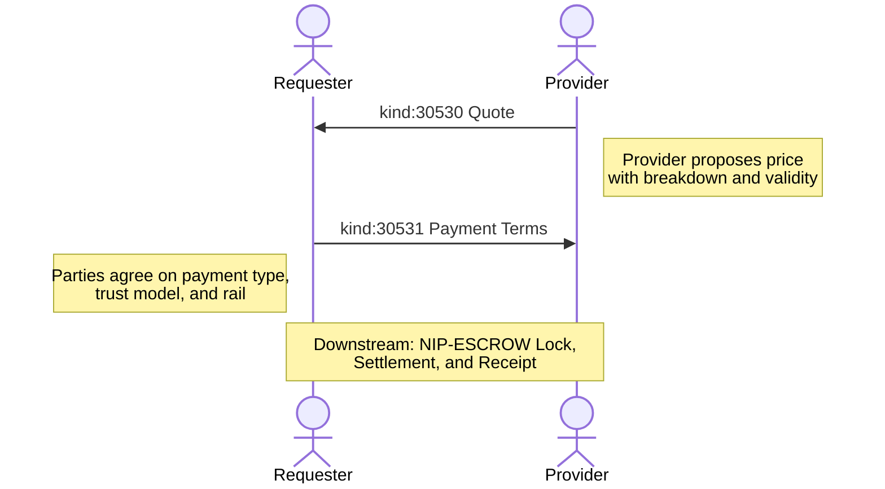

NIP-QUOTE
=========

Structured Pricing & Payment Terms
-------------------------------------

`draft` `optional`

This NIP defines two addressable event kinds for structured price proposals and agreed payment structures on Nostr: quoting with breakdowns and validity periods, and formalising payment terms between parties.

> **Design principle:** These events *communicate about* pricing; they do not *execute* payments. Quotes and terms establish what will be paid and how. Actual fund locking and settlement are handled downstream (see NIP-ESCROW).

## Motivation

Nostr has NIP-15 for marketplace storefronts and NIP-99 for classified listings, but no standard for the pricing conversation that follows discovery. When a buyer finds a product or a requester needs a service, there is no standardised way to:

- **Propose a price** with line-item breakdowns, rate units, and validity periods
- **Accept multiple competing quotes** for the same job
- **Agree payment structure** (lump sum, milestones, streaming, split across providers)
- **Declare a trust model** so both parties understand the escrow assumptions before committing funds

This NIP fills that gap. It is payment-rail agnostic and works with any originating event: a NIP-15 marketplace order, a NIP-99 classified listing, or any application-specific event kind.

## Relationship to Existing NIPs

- **NIP-15 / NIP-99:** Those NIPs define listings and storefronts. This NIP defines the pricing conversation that follows. A Quote references (via `e` tag) whatever event initiated the transaction.
- **NIP-57 (Zaps):** Zaps are tips and donations on Lightning. Quotes are structured price proposals with breakdowns, rate units, and validity periods. The two serve fundamentally different purposes.
- **NIP-MATCHING (kind 30576):** Matching Offers are competitive bids for a posted request. A Quote is a direct price proposal from provider to requester. They compose: a NIP-MATCHING Offer MAY reference a NIP-QUOTE Quote for detailed pricing and breakdown. See NIP-MATCHING for competitive selection workflows.
- **NIP-ESCROW:** Quotes and Payment Terms are the pricing layer; NIP-ESCROW handles fund locking and settlement. They compose naturally: a Lock (kind 30532) references Payment Terms (kind 30531).
- **NIP-69 (Peer-to-Peer Order Events):** NIP-69 defines order events for fungible asset exchange (buy/sell fiat for bitcoin) with fixed pricing. NIP-QUOTE is for service and goods pricing with line-item breakdowns, rate units (hourly, daily, per-item), validity periods, and multi-currency support. NIP-69 orders are take-it-or-leave-it; NIP-QUOTE supports negotiation via quote revision.

## Kinds

| kind  | description      |
| ----- | ---------------- |
| 30530 | Quote            |
| 30531 | Payment Terms    |

Both kinds are addressable events (NIP-01).

---

## Quote (`kind:30530`)

A provider proposes a price. Multiple providers MAY quote the same job. Addressable; a provider can update their quote by republishing with the same `d` tag.

```json
{
  "kind": 30530,
  "pubkey": "<provider-hex-pubkey>",
  "created_at": 1698765000,
  "tags": [
    ["d", "<tx-id>:quote"],
    ["e", "<originating-event-id>"],
    ["p", "<requester-pubkey>"],
    ["amount", "15000"],
    ["currency", "SAT"],
    ["breakdown", "base_price", "12000", "SAT"],
    ["breakdown", "materials", "2000", "SAT"],
    ["breakdown", "travel", "1000", "SAT"],
    ["rate_unit", "flat"],
    ["valid_until", "1698851400"],
    ["payment_method", "cashu"],
    ["payment_method", "lightning"]
  ],
  "content": "Fixed price for logo design including two revision rounds."
}
```

Tags:

* `d` (REQUIRED): Unique identifier. RECOMMENDED format: `<tx-id>:quote`, where `tx-id` is an application-specific transaction identifier (e.g. a NIP-15 order ID, a NIP-99 listing reference, or a random UUID). Multiple providers MAY quote the same `tx-id`; their events are already distinct because addressable events are unique per author pubkey + kind + d-tag.
* `e` (REQUIRED): References the originating event (e.g. NIP-15 order, NIP-99 listing).
* `p` (REQUIRED): Requester's pubkey.
* `amount` (REQUIRED): Total price in smallest currency unit (cents for USD, satoshis for SAT).
* `currency` (REQUIRED): Currency code (e.g. `USD`, `EUR`, `SAT`, `BTC`).
* `breakdown` (OPTIONAL, multiple): `["breakdown", "<item>", "<amount>", "<currency>"]`. Items: `base_price`, `labour`, `materials`, `travel`, `fee`, etc.
* `rate_unit` (OPTIONAL): One of `flat`, `per_hour`, `per_day`, `per_item`, `per_kg`, `per_km`.
* `valid_until` (OPTIONAL): Unix timestamp for quote expiry. Clients SHOULD use NIP-40 `expiration` for relay-level enforcement.
* `payment_method` (OPTIONAL, multiple): Accepted payment methods. See [Canonical `payment_method` Values](#canonical-payment_method-values) below.
* `mint_url` (OPTIONAL): Preferred Cashu mint URL.

### Canonical `payment_method` Values

| Value | Description |
|-------|-------------|
| `lightning` | Lightning Network (BOLT11 invoice) |
| `lightning_hold` | Lightning hold invoice (HODL invoice) |
| `onchain_btc` | On-chain Bitcoin transaction |
| `cashu` | Cashu ecash token |
| `stripe` | Stripe card payment |
| `nip47` | NIP-47 Nostr Wallet Connect |
| `bank_transfer` | Bank wire or ACH transfer |
| `cash` | Physical cash |
| `silent_payment` | BIP-352 silent payment (on-chain, privacy-preserving) |
| `fedimint` | Federated Chaumian mint (via Lightning or on-chain swap) |
| `other` | Other payment method (describe in `payment_description` tag) |
| `custom:*` | Custom payment method with `custom:` prefix (e.g., `custom:mpesa`) |

Implementations SHOULD support at least `lightning` and `cash`. The `custom:*` prefix allows communities to add payment methods without requiring protocol changes.

---

## Payment Terms (`kind:30531`)

Agreed payment structure between parties. Published after quote acceptance. Defines how money will flow: single payment, streaming, milestones, or split across multiple providers.

```json
{
  "kind": 30531,
  "pubkey": "<requester-hex-pubkey>",
  "created_at": 1698765500,
  "tags": [
    ["d", "<tx-id>:terms"],
    ["e", "<quote-event-id>"],
    ["payment_type", "milestone"],
    ["amount", "50000"],
    ["currency", "SAT"],
    ["trust_model", "ecash-htlc"],
    ["milestone", "design_mockup", "Design mockup delivery", "15000", "SAT"],
    ["milestone", "first_draft", "First draft delivery", "20000", "SAT"],
    ["milestone", "final_delivery", "Final approved delivery", "15000", "SAT"],
    ["payment_rail", "cashu"],
    ["mint_url", "https://mint.example.com"]
  ],
  "content": ""
}
```

Tags:

* `d` (REQUIRED): Unique identifier. RECOMMENDED format: `<tx-id>:terms`.
* `e` (REQUIRED): References the accepted Quote event.
* `payment_type` (REQUIRED): One of:
    * `simple` -- single payment on completion
    * `streaming` -- periodic payments during active work
    * `milestone` -- payments at defined checkpoints
    * `split` -- payment split across multiple providers
* `amount` (REQUIRED): Total agreed amount in smallest currency unit.
* `currency` (REQUIRED): Currency code.
* `trust_model` (RECOMMENDED): Declares the trust assumptions of the payment flow. RECOMMENDED values:
    * `trustless` -- wallet-to-wallet, no intermediary touches funds (hold invoices, atomic swaps)
    * `ecash-htlc` -- ecash tokens locked with HTLC spending conditions (Cashu NUT-14)
    * `ecash-p2pk` -- ecash tokens locked with P2PK signatures (Cashu NUT-11)
    * `adaptor-escrow` -- `experimental` Taproot adaptor signature escrow; pre-signed transaction released by discrete-log secret reveal (NIP-455-compatible)
    * `custodial-escrow` -- a third party holds funds in custody
    * `fiat-escrow` -- fiat payment processor holds funds
    * `direct` -- peer-to-peer with no escrow (cash, bank transfer)
    * `prepaid` -- payment collected before service begins

    Implementations MAY use other values.

### Trust Model Decision Flowchart

```mermaid
flowchart TD
    A["Do parties trust each other?"] -->|Yes| D["direct\n(peer-to-peer, no escrow)"]
    A -->|No| B["Is payment collected upfront?"]
    B -->|Yes| P["prepaid\n(pay before service)"]
    B -->|No| C["Is there a third-party custodian?"]
    C -->|Yes| E["Fiat or crypto?"]
    E -->|Fiat| F["fiat-escrow\n(payment processor holds funds)"]
    E -->|Crypto| G["custodial-escrow\n(third party holds funds)"]
    C -->|No| H["Which payment rail?"]
    H -->|Lightning| T["trustless\n(hold invoices, atomic swaps)"]
    H -->|"Cashu NUT-14"| HTLC["ecash-htlc\n(HTLC spending conditions)"]
    H -->|"Cashu NUT-11"| P2PK["ecash-p2pk\n(P2PK signatures)"]
    H -->|"Taproot on-chain"| AS["adaptor-escrow\n(adaptor signatures, experimental)"]

    style D fill:#1b3d2d,stroke:#16c79a
    style P fill:#1b3d2d,stroke:#16c79a
    style F fill:#2d2d1b,stroke:#f5a623
    style G fill:#2d2d1b,stroke:#f5a623
    style T fill:#1b2d3d,stroke:#0f3460
    style HTLC fill:#1b2d3d,stroke:#0f3460
    style P2PK fill:#1b2d3d,stroke:#0f3460
    style AS fill:#2d1b3d,stroke:#e94560
```



Additional Payment Terms tags:

* `streaming_rate` (REQUIRED for `streaming`): Amount per interval in smallest currency unit.
* `streaming_interval_seconds` (REQUIRED for `streaming`): Interval in seconds.
* `milestone` (REQUIRED for `milestone`, multiple): `["milestone", "<id>", "<description>", "<amount>", "<currency>"]`.
* `split` (REQUIRED for `split`, multiple): `["split", "<provider_pubkey>", "<amount>", "<currency>", "<role>"]`.
* `payment_rail` (OPTIONAL): e.g. `cashu`, `lightning`, `nip47`, `strike`, `cash`.
* `mint_url` (OPTIONAL): Agreed Cashu mint URL.

### Payment Type Flows

The `payment_type` tag determines how downstream events (NIP-ESCROW locks, settlements, receipts) are sequenced:



---

## Protocol Flow



1. **Quote:** Provider publishes `kind:30530` with a proposed price, breakdowns, rate unit, and validity period.
2. **Terms:** Parties agree on `kind:30531`, defining payment type, trust model, and payment rail.
3. **Downstream:** Once terms are agreed, NIP-ESCROW handles fund locking, settlement, and receipting. Other applications MAY consume Quote and Terms events independently.

## REQ Filters

Clients can subscribe to quotes and terms using standard NIP-01 filters:

```json
// All quotes for a specific originating event
{"kinds": [30530], "#e": ["<originating-event-id>"]}

// All quotes from a specific provider
{"kinds": [30530], "authors": ["<provider-pubkey>"]}

// Payment terms for a specific transaction
{"kinds": [30531], "#d": ["<tx-id>:terms"]}

// All quotes addressed to a specific requester
{"kinds": [30530], "#p": ["<requester-pubkey>"]}
```

## Replaceability

Both kinds are addressable events. For Quote (`kind:30530`), replaceability is useful: a provider can update their quote before acceptance, adjusting price or extending validity.

For Payment Terms (`kind:30531`), replaceability allows renegotiation. Once downstream events reference the terms (e.g. a NIP-ESCROW Lock), the referenced version becomes the binding version. Clients SHOULD track which version of terms was referenced by downstream events.

## Security Considerations

* **Payment-rail agnostic.** Events communicate *about* pricing; they do not move money. The same event schema works whether parties use Lightning, Cashu, on-chain, or cash.
* **Smallest currency unit.** All amounts MUST be expressed in the smallest unit of the specified currency (cents for USD, satoshis for SAT) to avoid floating-point errors.
* **Quote expiry.** Quotes SHOULD include a `valid_until` tag. Clients MUST NOT accept quotes past their expiry. Relays MAY enforce this via NIP-40 `expiration`.
* **NIP-44 encryption.** Sensitive pricing details (custom rate structures, negotiated discounts) MAY be NIP-44 encrypted when privacy is required.
* **Breakdown integrity.** When a `breakdown` is present, the sum of breakdown amounts SHOULD equal the `amount` tag. Clients SHOULD warn users when these values diverge.

## Privacy

Quotes are public by default. Providers typically want their quotes to be discoverable, and requesters need to compare competing proposals. Payment Terms are also public, as they establish the coordination parameters that downstream events depend on.

When pricing is commercially sensitive, implementations MAY deliver Quote and Terms events via NIP-59 gift wrap. This is an application-level decision, not a protocol requirement.

### Metadata minimisation

Implementations SHOULD include only the tags marked REQUIRED or RECOMMENDED in each event kind. Optional tags increase the metadata surface; omit them unless the application specifically needs them.

## Test Vectors

All examples use timestamp `1709740800` (2024-03-06T12:00:00Z) and placeholder hex pubkeys.

### Kind 30530 -- Quote

```json
{
  "kind": 30530,
  "pubkey": "a1b2c3d4e5f6a1b2c3d4e5f6a1b2c3d4e5f6a1b2c3d4e5f6a1b2c3d4e5f6a1b2",
  "created_at": 1709740800,
  "tags": [
    ["d", "tx_abc123:quote"],
    ["e", "dddd4444eeee5555ffff6666aaaa1111bbbb2222cccc3333dddd4444eeee5555"],
    ["p", "b2c3d4e5f6a1b2c3d4e5f6a1b2c3d4e5f6a1b2c3d4e5f6a1b2c3d4e5f6a1b2"],
    ["amount", "15000"],
    ["currency", "SAT"],
    ["breakdown", "base_price", "12000", "SAT"],
    ["breakdown", "materials", "2000", "SAT"],
    ["breakdown", "travel", "1000", "SAT"],
    ["rate_unit", "flat"],
    ["valid_until", "1709827200"],
    ["payment_method", "cashu"],
    ["payment_method", "lightning"]
  ],
  "content": "Fixed price for logo design including two revision rounds.",
  "id": "<32-byte-hex>",
  "sig": "<64-byte-hex>"
}
```

### Kind 30531 -- Payment Terms

```json
{
  "kind": 30531,
  "pubkey": "b2c3d4e5f6a1b2c3d4e5f6a1b2c3d4e5f6a1b2c3d4e5f6a1b2c3d4e5f6a1b2",
  "created_at": 1709740800,
  "tags": [
    ["d", "tx_abc123:terms"],
    ["e", "aaaa1111bbbb2222cccc3333dddd4444eeee5555ffff6666aaaa1111bbbb2222"],
    ["payment_type", "milestone"],
    ["amount", "50000"],
    ["currency", "SAT"],
    ["trust_model", "ecash-htlc"],
    ["milestone", "design_mockup", "Design mockup delivery", "15000", "SAT"],
    ["milestone", "first_draft", "First draft delivery", "20000", "SAT"],
    ["milestone", "final_delivery", "Final approved delivery", "15000", "SAT"],
    ["payment_rail", "cashu"],
    ["mint_url", "https://mint.example.com"]
  ],
  "content": "",
  "id": "<32-byte-hex>",
  "sig": "<64-byte-hex>"
}
```

## Dependencies

* [NIP-01](https://github.com/nostr-protocol/nips/blob/master/01.md): Basic protocol flow, addressable events
* [NIP-40](https://github.com/nostr-protocol/nips/blob/master/40.md): Expiration timestamps (quote validity)
* [NIP-44](https://github.com/nostr-protocol/nips/blob/master/44.md): Versioned encrypted payloads (private pricing details)

## Reference Implementations

* [@trott/sdk](https://github.com/TheCryptoDonkey/trott-sdk) -- TypeScript builders and parsers for Quote and Payment Terms
* [trotters](https://github.com/TheCryptoDonkey/trotters) / [trotters-driver](https://github.com/TheCryptoDonkey/trotters-driver) -- Expo/React Native apps with quote and terms flows
* [trott-mcp](https://github.com/TheCryptoDonkey/trott-mcp) -- MCP server exposing quote and terms tools to AI agents
* [TROTT Protocol](https://github.com/TheCryptoDonkey/trott) -- Full specification suite that composes NIP-QUOTE with lifecycle, discovery, and escrow

## Appendix: Operator Fee Collection Models

When a coordinator or platform facilitates transactions, they may charge fees. Operator fees are OPTIONAL; peer-to-peer transactions require no fees.

### Model A: Pre-deducted (Most Common)
The coordinator deducts their fee before releasing funds to the provider.
- Quote (kind:30530) shows gross amount
- Payment Terms (kind:30531) include `operator_fee` and `operator_fee_basis` tags
- Downstream settlement amount = gross - fee

### Model B: Surcharge
The coordinator adds their fee on top of the provider's price.
- Quote (kind:30530) shows provider's net amount
- Payment Terms (kind:30531) include `total_amount` (net + fee) and `operator_fee` tags
- Customer pays `total_amount`; provider receives net

### Model C: Subscription
The coordinator charges a flat periodic fee, not per-transaction.
- No fee tags on individual events
- Fee relationship managed outside the protocol

### Fee Tags

| Tag | Value | Description |
|-----|-------|-------------|
| `operator_fee` | Amount in smallest unit | Fee amount charged by the coordinator |
| `operator_fee_basis` | `gross` or `net` | Whether fee is deducted from gross or added on top |
| `operator_fee_pct` | Percentage as string | Fee as percentage (e.g., `"5.0"` for 5%) |

## Standalone Usage

NIP-QUOTE is designed for standalone use. Any Nostr application where one party quotes a price to another can use these kinds without adopting NIP-ESCROW or any other downstream NIP. Freelance marketplaces, repair services, event catering, tutoring platforms, and similar applications benefit from structured quotes and formalised payment terms.

The [TROTT Protocol](https://github.com/TheCryptoDonkey/trott) composes NIP-QUOTE with lifecycle management, reputation, and escrow for full-stack service coordination, but NIP-QUOTE stands alone for simpler use cases.
