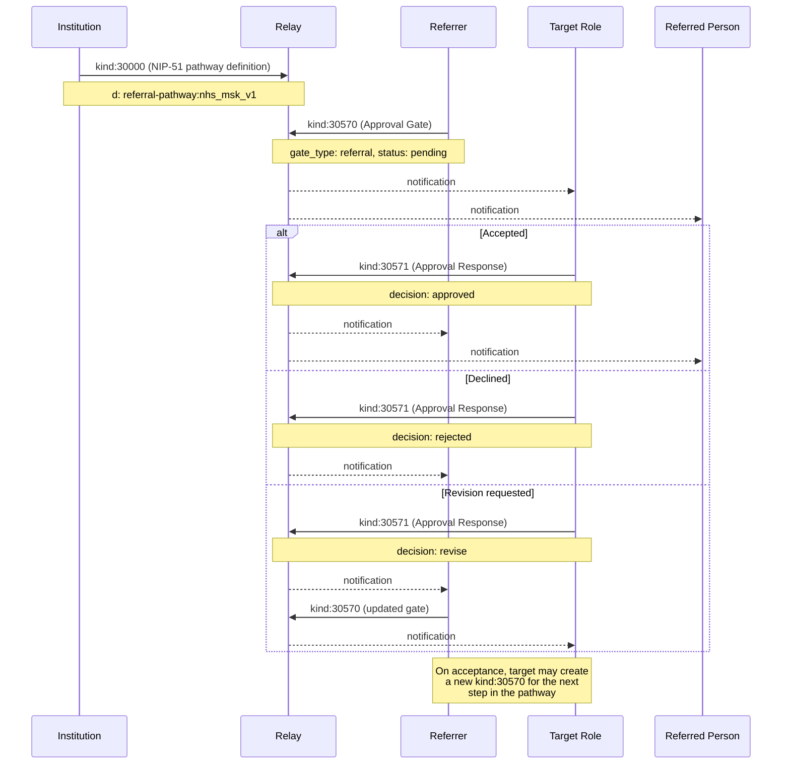

NIP-REFERRAL-ROUTING
====================

Institutional Referral Routing (Composition Guide)
-----------------------------------------------------

`ecosystem` `draft` `optional` `composition-guide`

This document shows how to model institutional referral routing on Nostr using existing NIPs. No new event kinds are required.

> **Design principle:** Referral events coordinate handoffs between institutional roles. They do not enforce service delivery or case management. The consuming application decides what happens after a referral is accepted (case creation, appointment booking, service initiation).

## Motivation

Nostr has NIP-MATCHING for competitive selection (multiple providers bid, a requester selects the best), but no standard mechanism for **non-competitive institutional handoffs**. Many workflows involve a referrer directing a person to a specific next step based on institutional authority, not marketplace competition:

- **Healthcare** -- GP refers patient to specialist, specialist refers to therapist
- **Legal aid** -- intake worker refers to solicitor, solicitor refers to barrister
- **Social services** -- assessor refers to caseworker, caseworker refers to provider
- **Education** -- teacher refers to SENCO, SENCO refers to educational psychologist
- **Employment** -- job centre refers to training provider, training provider refers to employer
- **Housing** -- assessment officer refers to allocation, allocation refers to tenancy support

The key distinction from competitive matching: **referral routing is non-competitive**. A referrer directs a person to a specific next step based on the referrer's institutional role and clinical, legal, or procedural authority. The pathway has routing logic determined by the referrer's institutional authority, not by the referee's preference among competing offers.

Without a standard composition pattern, each institution invents its own referral tracking with incompatible formats, making cross-institutional pathways opaque and unauditable. This guide shows how to compose NIP-51, NIP-APPROVAL, NIP-44, and NIP-59 into a minimal, structured referral chain with built-in accountability and expiration.

---

## Pathway Definitions with NIP-51

A referral pathway template is a structured document defining routing rules: the sequence of roles, routing conditions for each step, escalation rules, and credential requirements. Model this as a **NIP-51 list** (`kind:30000`) with a namespaced `d` tag and structured `referral:step` tags for each step in the pathway.

This approach enables relay discovery of available pathways using standard NIP-51 subscription filters.

### Example: NHS Musculoskeletal Pathway

```json
{
    "kind": 30000,
    "pubkey": "<institution-hex-pubkey>",
    "created_at": 1709280000,
    "tags": [
        ["d", "referral-pathway:nhs_msk_pathway_v1"],
        ["t", "referral-pathway"],
        ["title", "Musculoskeletal Referral Pathway"],
        ["referral:step", "0", "general_practitioner", "nip-credentials:medical:gp", "Patient presents with persistent MSK symptoms >6 weeks"],
        ["referral:step", "1", "physiotherapist", "nip-credentials:medical:physiotherapy", "Initial assessment and conservative treatment"],
        ["referral:step", "2", "orthopaedic_consultant", "nip-credentials:medical:orthopaedics", "Conservative treatment unsuccessful after 12 weeks"],
        ["referral:step", "3", "surgical_review", "nip-credentials:medical:surgery", "Consultant recommends surgical opinion"],
        ["referral:escalation", "1", "2", "timeout_weeks:8", "Escalate to consultant if physiotherapy produces no improvement within 8 weeks"],
        ["referral:escalation", "0", "2", "flag:urgent", "Direct consultant referral for suspected fracture or red flag symptoms"],
        ["referral:jurisdiction", "GB", "NHS England"],
        ["expiration", "1740902400"]
    ],
    "content": "Standard NHS musculoskeletal referral pathway. Covers initial GP presentation through to surgical review. Steps may be skipped when escalation conditions are met.",
    "id": "<32-byte-hex>",
    "sig": "<64-byte-hex>"
}
```

### Tag reference (pathway)

| Tag | Required | Description |
|-----|----------|-------------|
| `d` | Yes | `referral-pathway:<identifier>`. The `referral-pathway:` prefix namespaces these lists so they are discoverable by convention. The identifier SHOULD be descriptive and versioned (e.g. `nhs_msk_pathway_v1`). |
| `t` | Yes | Protocol family marker. MUST be `"referral-pathway"`. |
| `title` | Yes | Human-readable name for the pathway. |
| `referral:step` | Yes (repeatable) | Step definition. Format: `["referral:step", "<step_index>", "<role_identifier>", "<credential_requirement>", "<routing_condition>"]`. Steps are ordered by `step_index` (zero-based). The `credential_requirement` references a NIP-CREDENTIALS credential type that the referrer at this step must hold. |
| `referral:escalation` | Optional (repeatable) | Escalation rule. Format: `["referral:escalation", "<from_step>", "<to_step>", "<trigger>", "<description>"]`. Defines conditions under which a step may be skipped: timeout, urgency flags, or clinical triggers. |
| `referral:jurisdiction` | Optional | Geographic or institutional scope. Format: `["referral:jurisdiction", "<country_code>", "<institution_or_region>"]`. |
| `expiration` | Optional | NIP-40 expiry. Pathway definitions MAY expire to force periodic review and republication. |

**Content:** Plain text describing the pathway's purpose, scope, and any notes for implementors.

---

## Referrals with NIP-APPROVAL

A referral is fundamentally "I am sending this person to you; please accept or reject." This maps directly to an **Approval Gate** (`kind:30570`). The referrer creates an Approval Gate with referral-specific tags, and the receiver responds using an Approval Response (`kind:30571`).

### Example: GP refers patient to physiotherapist

```json
{
    "kind": 30570,
    "pubkey": "<referrer-hex-pubkey>",
    "created_at": 1709283600,
    "tags": [
        ["d", "referral:ref_2024_msk_00347:gate:physio_referral"],
        ["t", "approval-gate"],
        ["gate_type", "referral"],
        ["gate_authority", "<physiotherapist-hex-pubkey>"],
        ["gate_status", "pending"],
        ["e", "<pathway-list-event-id>", "wss://relay.example.com"],
        ["p", "<referred-individual-hex-pubkey>"],
        ["referral:step", "1"],
        ["referral:referrer_role", "general_practitioner"],
        ["referral:target_role", "physiotherapist"],
        ["referral:reason", "<NIP-44 encrypted payload>"],
        ["referral:urgency", "routine"],
        ["expiration", "1709888400"]
    ],
    "content": "",
    "id": "<32-byte-hex>",
    "sig": "<64-byte-hex>"
}
```

### Tag reference (referral gate)

All standard NIP-APPROVAL tags apply (`d`, `t`, `gate_type`, `gate_authority`, `gate_status`, `expiration`). The following additional tags carry referral-specific semantics:

| Tag | Required | Description |
|-----|----------|-------------|
| `gate_type` | Yes | MUST be `"referral"` to distinguish from other approval gate uses. |
| `e` | Yes | Event ID of the NIP-51 pathway definition list. Links this referral to its pathway template. |
| `p` | Yes | Hex pubkey of the referred individual (the person being referred). |
| `gate_authority` | Yes | Hex pubkey of the receiving institution or practitioner. This is the party who must accept or reject the referral. |
| `referral:step` | Yes | Which step in the pathway this referral targets (zero-based index matching the pathway's `referral:step` tags). |
| `referral:referrer_role` | Yes | The referrer's role in the pathway. MUST match a role defined in a preceding step of the referenced pathway. |
| `referral:target_role` | Yes | The target role for the referral. MUST match the role defined at the specified step in the referenced pathway. |
| `referral:reason` | Yes | Structured reason for the referral. MUST be NIP-44 encrypted to both the referred individual's pubkey and the target role holder's pubkey. Referral reasons are sensitive (medical, legal, personal) and MUST NOT be transmitted in plaintext. |
| `referral:urgency` | Optional | One of `"routine"`, `"urgent"`, or `"emergency"`. Defaults to `"routine"` if omitted. |
| `expiration` | Yes | NIP-40 expiry. Referrals MUST expire. A referral without an expiration tag is invalid. |

**Content:** Empty string or NIP-44 encrypted JSON with additional clinical or procedural context.

---

## Referral Acceptance with NIP-APPROVAL

The receiving institution or practitioner responds using a standard **Approval Response** (`kind:30571`). The `decision` tag carries the acceptance or rejection.

### Example: Physiotherapist accepts the referral

```json
{
    "kind": 30571,
    "pubkey": "<physiotherapist-hex-pubkey>",
    "created_at": 1709290800,
    "tags": [
        ["d", "referral:ref_2024_msk_00347:gate:physio_referral:response:<physiotherapist-hex-pubkey>"],
        ["t", "approval-response"],
        ["e", "<referral-gate-event-id>", "wss://relay.example.com"],
        ["decision", "approved"],
        ["p", "<referrer-hex-pubkey>"],
        ["p", "<referred-individual-hex-pubkey>"]
    ],
    "content": "Referral accepted. Appointment will be scheduled within 10 working days.",
    "id": "<32-byte-hex>",
    "sig": "<64-byte-hex>"
}
```

### Example: Physiotherapist declines the referral

```json
{
    "kind": 30571,
    "pubkey": "<physiotherapist-hex-pubkey>",
    "created_at": 1709290800,
    "tags": [
        ["d", "referral:ref_2024_msk_00347:gate:physio_referral:response:<physiotherapist-hex-pubkey>"],
        ["t", "approval-response"],
        ["e", "<referral-gate-event-id>", "wss://relay.example.com"],
        ["decision", "rejected"],
        ["p", "<referrer-hex-pubkey>"],
        ["p", "<referred-individual-hex-pubkey>"]
    ],
    "content": "Unable to accept. Current caseload is at capacity. Recommend re-referral to MSK triage service.",
    "id": "<32-byte-hex>",
    "sig": "<64-byte-hex>"
}
```

The standard NIP-APPROVAL `decision` values apply:

- `"approved"` -- the receiver accepts the referral and will proceed with service delivery.
- `"rejected"` -- the receiver declines the referral with a reason in the content field.
- `"revise"` -- the receiver requests additional information before making a decision. The referrer updates the Kind 30570 gate with the requested details.

---

## Privacy

Referral reasons routinely contain sensitive personal information: medical symptoms, legal circumstances, safeguarding concerns. Two layers of protection apply.

**Reason field encryption.** The `referral:reason` tag MUST be NIP-44 encrypted to both the referred individual and the target role holder. Implementations that transmit referral reasons in plaintext are non-compliant.

**Gift-wrapping for full metadata protection.** When even the existence of a referral is sensitive (e.g. mental health, domestic abuse, safeguarding), the entire referral gate event SHOULD be delivered via NIP-59 gift wrap. This conceals the sender, recipient, and timing metadata from relay operators.

---

## Referral Flow



### Step-by-step

1. **Pathway publication.** An institution publishes a `kind:30000` NIP-51 list defining the referral pathway: the sequence of roles, routing conditions, escalation rules, and credential requirements.
2. **Referral creation.** A referrer (who holds credentials for their step in the pathway) publishes a `kind:30570` Approval Gate with `gate_type: referral` and `gate_status: pending`. The gate links to the pathway list, identifies the referred individual and the target role, and includes an encrypted reason.
3. **Notification.** The target role holder and the referred individual receive the referral via relay subscription.
4. **Acceptance, rejection, or revision.** The target role holder publishes a `kind:30571` Approval Response with their decision. If the decision is `revise`, the referrer updates the gate with additional information. If `approved` or `rejected`, the referral is resolved.
5. **Onward referral.** After service delivery, if the pathway requires onward referral, the target role holder creates a new `kind:30570` gate for the next step in the pathway.
6. **Expiration.** If no action is taken before the `expiration` timestamp, the referral expires. Clients MUST treat expired referrals as invalid and SHOULD NOT display them as actionable.

---

## REQ Filters

### Discover all referral pathways from a known institution

```json
["REQ", "pathways", {
    "kinds": [30000],
    "authors": ["<institution-hex-pubkey>"],
    "#t": ["referral-pathway"]
}]
```

### Discover all referral pathways for a jurisdiction

```json
["REQ", "gb-pathways", {
    "kinds": [30000],
    "#t": ["referral-pathway"],
    "#referral:jurisdiction": ["GB"]
}]
```

### Fetch all pending referrals targeting a specific practitioner

```json
["REQ", "my-referrals", {
    "kinds": [30570],
    "#gate_authority": ["<practitioner-hex-pubkey>"],
    "#gate_type": ["referral"],
    "#gate_status": ["pending"]
}]
```

### Fetch all referrals for a specific referred individual

```json
["REQ", "referrals-for-patient", {
    "kinds": [30570],
    "#p": ["<referred-individual-hex-pubkey>"],
    "#gate_type": ["referral"]
}]
```

### Fetch approval responses for a specific referral gate

```json
["REQ", "referral-responses", {
    "kinds": [30571],
    "#e": ["<referral-gate-event-id>"]
}]
```

---

## Security Considerations

* **Referral spam.** Institutions SHOULD rate-limit referral creation. Referrers MUST hold valid credentials (verified via NIP-CREDENTIALS) for the step they are referring from. Clients MUST reject referrals from pubkeys that lack the required credentials for their claimed role.
* **Pathway manipulation.** Only the original pathway publisher can update a Kind 30000 pathway list (enforced by the addressable event model: same pubkey, same `d` tag). Clients MUST verify that the `pubkey` on a pathway event matches the expected institutional identity.
* **Privacy of referral reasons.** The `referral:reason` tag MUST be NIP-44 encrypted. Implementations that transmit referral reasons in plaintext are non-compliant. For full metadata protection, use NIP-59 gift wrapping.
* **Referrer authority.** A referrer MUST hold credentials for the step they are referring from. A physiotherapist cannot issue a GP-level referral. Clients SHOULD verify the referrer's credential against the pathway's `referral:step` credential requirements before accepting the referral.
* **Authority verification.** Implementations MUST verify that Kind 30571 responses are signed by the pubkey listed in the corresponding Kind 30570's `gate_authority` tag. Responses from unauthorised pubkeys MUST be ignored.
* **Expiration enforcement.** Referrals without an `expiration` tag are invalid. Clients MUST reject referral gates that lack an `expiration` tag. Relays MAY enforce expiration via NIP-40.

## Use Cases

### Healthcare Referral Networks

Any healthcare system (NHS, public health, private networks) can use referral routing to structure patient pathways. GPs publish referrals to specialists, specialists refer onward to therapists or surgeons. The pathway definition enforces that each step requires appropriate medical credentials, and the encrypted reason field protects patient confidentiality.

### Legal Aid Pathways

Legal aid organisations can define pathways from intake through to court representation. Each step has credential requirements (e.g. practising certificate, barrister qualification). The audit trail ensures that referral decisions are accountable and traceable.

### Social Services Case Routing

Social services departments can define assessment-to-provision pathways. Caseworkers refer individuals to specific service providers based on assessed need. Escalation rules handle timeouts (e.g. if a provider does not accept within 5 working days, escalate to the next available provider).

### Education Support Pathways

Schools can define SEND (Special Educational Needs and Disabilities) pathways from classroom teacher through to educational psychologist. Each referral carries encrypted context about the child's needs, and the pathway enforces that only appropriately qualified professionals can receive referrals at each step.

## Dependencies

* [NIP-51](https://github.com/nostr-protocol/nips/blob/master/51.md): Lists (pathway definitions as Kind 30000)
* [NIP-APPROVAL](./NIP-APPROVAL.md): Approval Gates and Responses (Kind 30570 / 30571)
* [NIP-44](https://github.com/nostr-protocol/nips/blob/master/44.md): Versioned encrypted payloads (referral reason encryption)
* [NIP-59](https://github.com/nostr-protocol/nips/blob/master/59.md): Gift wrapping (full metadata protection for sensitive referrals)
* [NIP-CREDENTIALS](./NIP-CREDENTIALS.md): Credential verification (referrer authority gating)
