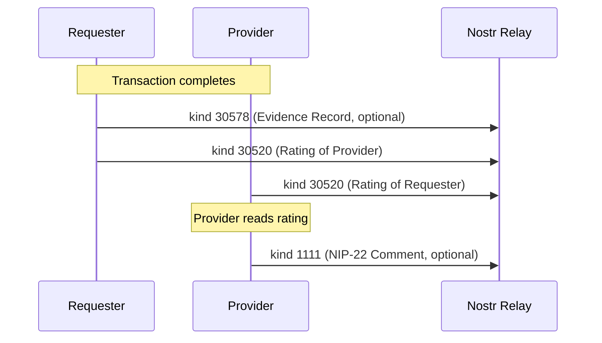

NIP-REPUTATION
===============

Structured Reputation & Reviews
---------------------------------

`draft` `optional`

One addressable event kind for completion-verified ratings on Nostr. Credential attestations use [NIP-VA](https://github.com/forgesworn/nostr-attestations/blob/main/NIP-VA.md) kind 31000 (Verifiable Attestation) with `type: credential`.

> **Standalone usability:** This NIP works independently on any Nostr application. Within the TROTT protocol (v0.9), these kinds are defined in TROTT-03: Reputation. TROTT extends them with cross-domain reputation portability, levelled credentials, and domain-specific rating criteria, but adoption of TROTT is not required.

## Motivation

Nostr has NIP-32 for generic labels and NIP-58 for badges, but neither provides structured reviews tied to verified completions. A freelancer with 500 five-star jobs on one platform starts at zero on another. Current Nostr reputation approaches lack:

- **Completion verification** - no proof that the rater actually transacted with the rated party
- **Multi-criterion scoring** - no way to rate punctuality separately from quality
- **Stake weighting** - a review from a 10-sat transaction weighs the same as one from a 500,000-sat transaction
- **Portable credentials** - professional qualifications have no machine-readable format

This NIP defines one event kind where ratings are cryptographically signed, tied to verifiable completion events, and portable across any Nostr client. Review responses use NIP-22 comments (kind 1111) rather than a dedicated kind. Activity evidence (proof of delivery, certifications earned, portfolio artefacts) is handled by [NIP-EVIDENCE](./NIP-EVIDENCE.md) (kind 30578). Reputation summaries are computed client-side from kind 30520 events rather than defined as a protocol kind.

## Relationship to Existing NIPs

- **[NIP-32](https://github.com/nostr-protocol/nips/blob/master/32.md) (Labelling):** Generic labels lack completion verification, multi-criterion scoring, and stake weighting. NIP-REPUTATION provides structured, verifiable ratings that NIP-32 labels cannot express.
- **[NIP-58](https://github.com/nostr-protocol/nips/blob/master/58.md) (Badges):** Display-oriented awards, not structured reviews tied to verified completions. NIP-58 provides static credentials ("You hold this certification"); NIP-REPUTATION provides dynamic transactional ratings ("How well you performed this job"). Together they create a two-layer trust signal: credentials plus transaction history.
- **[NIP-25](https://github.com/nostr-protocol/nips/blob/master/25.md) (Reactions):** Lightweight sentiment with no structured criteria, verification, or stake weighting.
- **[NIP-22](https://github.com/nostr-protocol/nips/blob/master/22.md) (Comments):** Review responses use NIP-22 comments (kind 1111) referencing the Rating event. This enables threaded discussion on any rating without requiring a dedicated kind.
- **[NIP-EVIDENCE](./NIP-EVIDENCE.md) (kind 30578):** Activity evidence (proof of delivery, certifications earned, portfolio artefacts) SHOULD be recorded as NIP-EVIDENCE records. A Rating (kind 30520) MAY reference evidence records via `e` tags for verifiable proof backing the review.
- **[NIP-VA](https://github.com/forgesworn/nostr-attestations/blob/main/NIP-VA.md) (kind 31000):** Credential attestations use NIP-VA with `type: credential`. See the NIP-VA specification.

Uses [NIP-02](https://github.com/nostr-protocol/nips/blob/master/02.md) (Contact Lists) for social-graph-weighted reputation scoring.

### Relationship to Community NIPs

- **NIP-85 Trusted Assertions (kinds 30382–30385):** NIP-85 providers compute aggregate metrics (follower counts, WoT rankings, engagement scores) and publish them as addressable events. NIP-REPUTATION provides first-party, completion-verified ratings tied to specific transactions — the raw input data that NIP-85 providers could ingest and aggregate. NIP-85 computes; NIP-REPUTATION records.
- **TSM Ranking Services (kind 37573):** The Trust Service Machines framework provides a request/response pattern for trust computation services, including ranking. TSM ranks subjects algorithmically from network data; NIP-REPUTATION records individual human ratings with structured criteria and stake weighting. TSM could consume NIP-REPUTATION events as input for its ranking algorithms.
- **Service Attestations (kinds 38383/38384):** Service Attestations define a fixed schema for bilateral service ratings with `service` categories, `rating` scores, and optional Namecoin identity anchoring. NIP-REPUTATION differs in three ways: ratings are tied to verified completion events (not self-reported), support multi-criterion scoring (not single-score), and include stake weighting. Service Attestations are better suited for simple marketplace reviews; NIP-REPUTATION is designed for high-assurance contexts where the rating must be backed by verifiable evidence of the transaction.

## Kinds

| kind  | description             |
| ----- | ----------------------- |
| 30520 | Rating                  |

> Credential attestations use NIP-VA kind 31000 with `type: credential`. Application-specific tags (credential_type, issuer_type, etc.) are carried on the NIP-VA event. See the [NIP-VA specification](https://github.com/forgesworn/nostr-attestations/blob/main/NIP-VA.md) and TROTT-03 Credential Attestation for details.

---

## Kind 30520: Rating

Published by a participant after transaction completion to rate the counterparty. Each participant publishes exactly one rating per transaction, enforced by the `d` tag format. The `e` tag references a completion event, providing cryptographic proof the rater participated.

```json
{
    "kind": 30520,
    "pubkey": "<rater-hex-pubkey>",
    "created_at": 1698765500,
    "tags": [
        ["d", "tx_abc123:rating:requester"],
        ["p", "<rated-party-pubkey>"],
        ["e", "<completion-event-id>", "<relay-hint>"],
        ["alt", "Rating: 4/5 overall for freelance provider"],
        ["domain", "freelance"],
        ["t", "domain:freelance"],
        ["role", "provider"],
        ["rating", "overall", "4"],
        ["rating", "quality", "5"],
        ["rating", "communication", "4"],
        ["rating", "punctuality", "3"],
        ["stake_evidence", "50000", "SAT"],
        ["payment_method", "lightning"]
    ],
    "content": "Excellent work on the logo design. Delivered on time with minor revisions needed. Great communication throughout.",
    "id": "<32-byte-hex>",
    "sig": "<64-byte-hex>"
}
```

Tags:

* `d` (REQUIRED): Format `<transaction_id>:rating:<rater_role>`. Ensures one rating per role per transaction via addressable event semantics. Valid roles: `requester`, `provider`, `beneficiary`.
* `p` (REQUIRED): Pubkey of the party being rated.
* `e` (REQUIRED): References a completion/confirmation event. Verifiable proof the rater participated. Implementations SHOULD verify: the event exists with a valid signature, the rater's pubkey appears as a participant, and the transaction reached a terminal state.
* `domain` (RECOMMENDED): Category this transaction belonged to. This is a multi-letter tag; relays cannot filter on it. Clients MUST post-filter by `domain` after retrieval.
* `t` (RECOMMENDED when `domain` is present): `["t", "domain:<category>"]` (e.g. `["t", "domain:freelance"]`). Enables relay-side discovery by domain via `#t` filters. The `domain` tag remains the canonical source; the `t` tag is a relay-filterable mirror.
* `role` (RECOMMENDED): Whether the rated party was `provider`, `requester`, or `beneficiary`.
* `rating` (REQUIRED, at least one): Multi-value tag: `["rating", "<criterion>", "<value>"]`. The `overall` criterion MUST be present. Values are integers 1-5. Additional criteria are application-defined.
* `stake_evidence` (RECOMMENDED): `["stake_evidence", "<amount>", "<currency>"]`. How much was at stake. Higher stakes imply greater credibility.
* `payment_method` (OPTIONAL): Payment method used for the transaction (e.g. `lightning`, `ecash`, `cash`, `onchain`). Including `payment_method` provides context for the rating. A rating from a Lightning-settled transaction demonstrates different trust properties than one from a cash transaction; the former proves cryptographic payment completion, while the latter relies on the rater's attestation.
* `content` (OPTIONAL): Free-text review.

### Rating Scale

| Value | Meaning                            |
| ----- | ---------------------------------- |
| 1     | Unacceptable - serious issues      |
| 2     | Poor - below expectations          |
| 3     | Adequate - met basic expectations  |
| 4     | Good - above expectations          |
| 5     | Excellent - outstanding            |

### Three-Party Transactions

When three distinct participants are involved (e.g. buyer, courier, and recipient), the `beneficiary` role enables up to three ratings per transaction, one per role, each with a unique `d` tag.

### Timing

Ratings SHOULD be published within 30 days of transaction completion. Implementations SHOULD reject ratings published after this window.

### REQ Filters

NIP-01 defines subscription filters for single-letter tag names only. The `domain` tag is client-side metadata; filter by `#p` at the relay, then post-filter by `domain` tag client-side.

```json
[
    {"kinds": [30520], "#p": ["<provider-pubkey>"]},
    {"kinds": [30520], "authors": ["<provider-pubkey>"]}
]
```

---

## Composing with NIP-22

Review responses use [NIP-22](https://github.com/nostr-protocol/nips/blob/master/22.md) comments (kind 1111) referencing the Rating event. The rated party publishes a comment on the rating rather than a dedicated response kind. This keeps review threads consistent with how comments work across Nostr.

NIP-22 comments use uppercase `K` for the root kind and uppercase `E` for the root event reference.

```json
{
    "kind": 1111,
    "tags": [
        ["K", "30520"],
        ["E", "<rating-event-id>", "wss://relay.example.com"],
        ["p", "<rater-pubkey>"]
    ],
    "content": "Thank you for the feedback. The delay was due to a supply chain issue that has since been resolved."
}
```

Clients SHOULD display NIP-22 comments alongside the rating they reference. Multiple comments are permitted, enabling threaded discussion on any rating.

---

## Composing with NIP-EVIDENCE

Activity evidence (proof of work completed, certifications earned, portfolio artefacts) SHOULD be recorded using [NIP-EVIDENCE](./NIP-EVIDENCE.md) kind 30578 rather than a reputation-specific kind. A rating MAY reference one or more evidence records to provide verifiable backing.

### Example: Rating with Evidence Reference

A provider completes a freelance project. The completion evidence is recorded as a NIP-EVIDENCE event, and the subsequent rating references it.

**Step 1: Record evidence (kind 30578)**

```json
{
    "kind": 30578,
    "pubkey": "<publisher-hex-pubkey>",
    "created_at": 1698780000,
    "tags": [
        ["d", "<publisher-pubkey>:evidence:1698780000"],
        ["evidence_type", "project_completion"],
        ["p", "<subject-pubkey>"],
        ["domain", "freelance"],
        ["date", "2024-10-31"],
        ["outcome", "delivered"]
    ],
    "content": "",
    "id": "aaaa1111bbbb2222cccc3333dddd4444eeee5555ffff6666aaaa1111bbbb2222",
    "sig": "<64-byte-hex>"
}
```

**Step 2: Rating references the evidence (kind 30520)**

```json
{
    "kind": 30520,
    "pubkey": "<rater-hex-pubkey>",
    "created_at": 1698785000,
    "tags": [
        ["d", "tx_def456:rating:requester"],
        ["p", "<rated-party-pubkey>"],
        ["e", "<completion-event-id>", "<relay-hint>"],
        ["e", "aaaa1111bbbb2222cccc3333dddd4444eeee5555ffff6666aaaa1111bbbb2222", "<relay-hint>"],
        ["domain", "freelance"],
        ["t", "domain:freelance"],
        ["role", "provider"],
        ["rating", "overall", "5"],
        ["rating", "quality", "5"],
        ["stake_evidence", "100000", "SAT"]
    ],
    "content": "Outstanding delivery with full documentation.",
    "id": "<32-byte-hex>",
    "sig": "<64-byte-hex>"
}
```

The second `e` tag references the NIP-EVIDENCE record, allowing clients to verify the evidence backing the rating.

---

## Reputation Aggregation

This NIP deliberately does not define a summary kind. Reputation summaries are an application-level concern, not a protocol primitive. Applications SHOULD compute summaries client-side by fetching kind 30520 events for a given pubkey and applying their chosen weighting and aggregation strategy.

Aggregators MAY publish pre-computed summaries using application-specific kinds for caching and performance, but such kinds are outside the scope of this NIP.

### Bayesian Averaging

Implementations SHOULD use Bayesian averaging to prevent small-sample manipulation:

`adjusted = (C * M + R * N) / (C + N)`

Where C = confidence threshold (e.g. 10 ratings), M = global mean, R = provider's raw average, N = provider's rating count.

---

## Trust Weighting

Implementations SHOULD weight ratings using available trust signals:

1. **Stake weight** - Ratings from higher-value transactions carry more weight.
2. **Social distance** - Ratings from pubkeys in the user's NIP-02 contact list (or 2-hop follows) carry more weight than ratings from strangers.
3. **Recency** - Recent ratings MAY be weighted more heavily than old ones.
4. **Credential backing** - Ratings from credentialed participants (verified via `kind:31000`) MAY carry additional weight.

The protocol deliberately does not prescribe a scoring algorithm; implementations choose their own weighting and aggregation strategies.

## Stake Weighting

Ratings carry different weight based on the economic stake of the underlying transaction. A 5-star rating from a 500,000-sat job is more meaningful than one from a 100-sat micro-task.

### Algorithm

```
weight(rating) = log2(1 + amount_sats) * recency_factor * completion_factor
```

Where:
- `amount_sats` - transaction amount converted to satoshis (from `amount` and `currency` tags)
- `recency_factor` - `1.0` for ratings < 30 days old, decaying by `0.95^months` thereafter
- `completion_factor` - `1.0` if rating references a verified completion or settlement event, `0.5` otherwise

### Aggregation

A provider's aggregate score for criterion `c` is:

```
score(c) = sum(rating_c * weight) / sum(weight)
```

This weighted average naturally surfaces ratings backed by significant transactions while still counting smaller ones.

### Why Stake Weighting Matters

Without stake weighting, an attacker can inflate ratings cheaply by creating many low-value transactions and rating them highly. With stake weighting, inflating reputation requires proportional economic commitment.

---

## Protocol Flow



---

## Use Cases Beyond Task Coordination

### Marketplace Seller Ratings

NIP-15 marketplace implementations can use NIP-REPUTATION to rate sellers after purchase. The `stake_evidence` tag ties the rating to the actual transaction value.

### Content Creator Reviews

Readers rate paid content (articles, courses, media). Stake weighting ensures reviews from higher-value purchases carry more weight.

### Mentor/Tutor Ratings

Students rate mentors after paid sessions. Multi-criterion scoring (knowledge, communication, punctuality) provides actionable feedback.

### Peer Code Review

Developers rate code reviewers. The `completion_event` references a merged PR or closed bounty, proving the review actually happened.

---

## Security Considerations

* **Completion verification.** The `e` tag on `kind:30520` references a completion event, preventing rating fabrication. Implementations SHOULD verify this link.
* **One rating per role per transaction.** Addressable event semantics (`d` tag) enforce uniqueness. Republishing replaces the previous rating.
* **Sybil resistance.** Stake evidence and social distance weighting reduce the impact of fake ratings. Zero-stake ratings from unknown pubkeys carry minimal weight.
* **Self-declared credentials.** `kind:31000` supports `issuer_type: self_declared`; implementations SHOULD display these distinctly from authority-issued credentials.
* **Timing attacks.** The 30-day rating window limits delayed reputation manipulation. Implementations SHOULD enforce this window and MAY apply reduced weight to ratings published near the deadline.

## Privacy

* Rating `content` is public by default. For sensitive domains, implementations MAY encrypt review text using NIP-44.
* The `e` tag linking a rating to a completion event reveals that a transaction occurred between two parties. Participants should be aware that publishing a rating creates a public association.
* Evidence records referenced by ratings (kind 30578) MAY use NIP-44 encryption for sensitive categories (healthcare, education).

---

## Test Vectors

### Kind 30520 - Rating

```json
{
  "kind": 30520,
  "pubkey": "a1b2c3d4e5f6a1b2c3d4e5f6a1b2c3d4e5f6a1b2c3d4e5f6a1b2c3d4e5f6a1b2",
  "created_at": 1709740800,
  "tags": [
    ["d", "tx_abc123:rating:requester"],
    ["p", "b2c3d4e5f6a1b2c3d4e5f6a1b2c3d4e5f6a1b2c3d4e5f6a1b2c3d4e5f6a1b2c3"],
    ["e", "dddd4444eeee5555ffff6666aaaa1111bbbb2222cccc3333dddd4444eeee5555", "wss://relay.example.com"],
    ["alt", "Rating: 4/5 overall for freelance provider"],
    ["domain", "freelance"],
    ["t", "domain:freelance"],
    ["role", "provider"],
    ["rating", "overall", "4"],
    ["rating", "quality", "5"],
    ["rating", "communication", "4"],
    ["rating", "punctuality", "3"],
    ["stake_evidence", "50000", "SAT"],
    ["payment_method", "lightning"]
  ],
  "content": "Excellent work on the logo design. Delivered on time with minor revisions needed.",
  "id": "<32-byte-hex>",
  "sig": "<64-byte-hex>"
}
```

---

## Dependencies

* [NIP-01](https://github.com/nostr-protocol/nips/blob/master/01.md): Basic protocol flow, addressable events
* [NIP-02](https://github.com/nostr-protocol/nips/blob/master/02.md): Contact lists (social distance weighting)
* [NIP-22](https://github.com/nostr-protocol/nips/blob/master/22.md): Comments (review responses)
* [NIP-32](https://github.com/nostr-protocol/nips/blob/master/32.md): Labelling (category classification)
* [NIP-58](https://github.com/nostr-protocol/nips/blob/master/58.md): Badges (credential compatibility)
* [NIP-EVIDENCE](./NIP-EVIDENCE.md): Evidence recording (activity evidence, proof of delivery)

## Reference Implementation

The [`@trott/sdk`](https://github.com/TheCryptoDonkey/trott-sdk) TypeScript library provides builders and parsers for the kinds defined in this NIP. For standalone use without TROTT, implementors SHOULD refer to the kind definitions above.

A minimal implementation requires:

1. A Nostr client that supports addressable event publishing and NIP-02 contact list queries.
2. A scoring engine that weights ratings by stake, social distance, and recency.
3. Verification logic that checks the `e` tag on `kind:30520` ratings references a valid completion event.
