NIP-SCARCITY
============

Workforce & Resource Scarcity Signals
----------------------------------------

`draft` `optional`

One event kind for broadcasting workforce, skill, or resource scarcity signals on Nostr. Any participant can publish a structured scarcity signal indicating that a specific skill, trade, material, or resource is at risk of shortage in a given area.

> **Design principle:** Scarcity signals are discoverable market intelligence. They do not restrict access; they inform discovery, pricing, and workforce development decisions. Signals are time-bounded and geographically scoped.

> **Standalone usability:** This NIP works independently on any Nostr application. Scarcity signals compose naturally with discovery and reputation systems to surface warnings when tasks require scarce skills and to prioritise training investment in at-risk areas.

## Motivation

Labour markets, skilled trades, and specialist resources face scarcity challenges that are invisible to individual participants. A property owner seeking a thatcher, a hospital seeking a specialist nurse, or a factory seeking a calibration engineer has no protocol-level way to know that their required skill is critically short. Existing solutions are centralised (government labour statistics, industry body reports) and lag by months or years.

Nostr's decentralised discovery layer can surface scarcity in near real-time:

- **Heritage crafts** - the Heritage Crafts Association Red List tracks critically endangered crafts; this data could be machine-readable on Nostr
- **Healthcare** - workforce shortages in specific specialties and regions
- **Construction** - trade skill gaps (e.g. bricklayers, steel fixers) vary by region and season
- **Education** - subject teacher shortages in specific areas
- **Cybersecurity** - specialist skill gaps (penetration testing, incident response)
- **Temp staffing** - shift-by-shift availability crunches
- **Rural services** - veterinary, plumbing, and electrical coverage gaps in remote areas

NIP-SCARCITY provides a minimal, discoverable primitive for broadcasting and consuming scarcity intelligence.

## Cross-Domain Evidence

This NIP was promoted from `incubating` after demonstrating demand across 5 unrelated domains:

| Domain | Use case | Category |
| ------ | -------- | -------- |
| Heritage conservation | 86,500 heritage workers needed annually until 2050; scarcity IS the sector crisis | Built environment |
| Green retrofit | 230K additional skilled retrofit workers needed by 2030 for UK net-zero targets | Construction |
| Outdoor education | 30 outdoor education centres closed since 2017; provision gap heat maps needed | Education |
| SEND education | Nationwide shortage of Educational Psychologists, Speech & Language Therapists, Occupational Therapists | Healthcare/education |
| Music events | 35% of grassroots music venues closed since 2007; venue and promoter scarcity | Culture |

These domains span built environment, construction, education, healthcare, and culture, confirming the pattern is domain-agnostic.

## Kinds

| kind  | description      |
| ----- | ---------------- |
| 30599 | Scarcity Signal  |

Kind 30599 is an addressable event (NIP-01). Each signal is replaceable: a publisher updates their assessment by publishing a new event with the same `d` tag. Scarcity signals are living assessments, not append-only facts.

---

## Scarcity Signal (`kind:30599`)

Published by any participant (industry body, operator, platform, individual) to signal that a skill, trade, or resource is scarce in a geographic area.

```json
{
    "kind": 30599,
    "pubkey": "<publisher-hex-pubkey>",
    "created_at": 1698770000,
    "tags": [
        ["d", "heritage_crafts:thatching_long_straw:gb"],
        ["t", "scarcity-signal"],
        ["scarcity_type", "workforce"],
        ["skill", "thatching"],
        ["specialism", "long_straw"],
        ["severity", "critically_endangered"],
        ["g", "gcpu"],
        ["region", "GB"],
        ["active_practitioners", "12"],
        ["demand_trend", "stable"],
        ["source", "Heritage Crafts Association Red List 2025"],
        ["source_url", "https://hfrr.co.uk"],
        ["training_available", "limited"],
        ["expiration", "1735689600"],
        ["domain", "heritage-skills"]
    ],
    "content": "Long straw thatching is critically endangered in the UK. Only 12 active practitioners remain, with 3 aged over 65. No new apprentices have started training in the past 2 years. Without intervention, this craft will be lost within a decade.",
    "id": "<32-byte-hex>",
    "sig": "<64-byte-hex>"
}
```

Tags:

* `d` (REQUIRED): Unique identifier for the scarcity signal. Recommended format: `<source>:<skill>:<region>`. Publishing a new event with the same `d` tag replaces the previous assessment.
* `t` (REQUIRED): Protocol family marker. MUST be `"scarcity-signal"`.
* `scarcity_type` (REQUIRED): What is scarce. One of `"workforce"`, `"skill"`, `"material"`, `"equipment"`, `"capacity"`.
* `skill` (REQUIRED): The skill, trade, or resource that is scarce. Plain text, lowercase, hyphenated.
* `severity` (REQUIRED): Severity of the scarcity. One of `"critically_endangered"`, `"endangered"`, `"at_risk"`, `"watch"`, `"adequate"`.
* `g` (RECOMMENDED): Geohash of the affected area. Precision determines scope (4 chars = regional, 6 chars = local).
* `region` (RECOMMENDED): ISO 3166-1 alpha-2 country code or ISO 3166-2 subdivision code.
* `expiration` (RECOMMENDED): Unix timestamp (NIP-40). Scarcity signals SHOULD expire and require republication to remain current. Default: 12 months from publication.
* `specialism` (OPTIONAL): Sub-specialisation within the skill (e.g. `"long_straw"` within `"thatching"`).
* `active_practitioners` (OPTIONAL): Estimated number of active practitioners in the region.
* `demand_trend` (OPTIONAL): Demand trajectory. One of `"increasing"`, `"stable"`, `"decreasing"`.
* `source` (OPTIONAL): Attribution for the scarcity data (e.g. "Heritage Crafts Association Red List 2025", "NHS Workforce Statistics").
* `source_url` (OPTIONAL): URL of the source data.
* `training_available` (OPTIONAL): Training pipeline status. One of `"active"`, `"limited"`, `"none"`, `"unknown"`.
* `domain` (OPTIONAL): Application domain identifier, if the signal applies to a specific domain (e.g. `heritage-skills`, `healthcare`, `construction`).
* `p` (OPTIONAL): Parties to notify (e.g. training bodies, funding organisations).

**Content:** Plain text description of the scarcity situation: context, contributing factors, and recommended actions. Content provides the human-readable narrative that the structured tags cannot capture.

---

## Severity Levels

| Severity | Definition | Recommended Action |
| -------- | ---------- | ------------------ |
| `critically_endangered` | Fewer practitioners than needed to sustain the skill. Loss is imminent without intervention. | Discovery clients SHOULD display a prominent warning. Funding bodies SHOULD be notified. |
| `endangered` | Practitioner numbers are declining and training pipeline is insufficient. | Discovery clients SHOULD display a scarcity notice. Training investment is recommended. |
| `at_risk` | Current capacity meets demand but trends are negative. | Discovery clients MAY display an advisory. Monitoring is recommended. |
| `watch` | Early indicators of potential future scarcity. | No client action required. Data collection and monitoring. |
| `adequate` | Supply meets demand. Published to confirm healthy status or to downgrade a previous signal. | No action required. |

## Protocol Flow

```mermaid
flowchart TD
    A["Scarcity detected"] --> B["Signal published (kind 30599)\nseverity + #g geohash + skill"]
    B --> C["Clients subscribe\nby #g + #t filters"]
    C --> D{"Training providers\nrespond?"}
    D -- Yes --> E["training_available\nupdated to 'active'"]
    D -- No --> F["Signal persists\nuntil expiration"]
    E --> G["Signal updated\n(same d tag, revised severity)"]
    F --> G
    G --> H["Resolved or expired"]

    style A fill:#3d1b1b,stroke:#dc3545
    style B fill:#2d2d1b,stroke:#f5a623
    style H fill:#1b3d2d,stroke:#16c79a
```



### Sequence

```
  Publisher                        Relay                     Discovery Clients
      |                              |                            |
      |-- kind:30599 Signal -------->|                            |
      |  (skill: thatching           |                            |
      |   severity: critically_      |------- discoverable ------>|
      |   endangered)                |                            |
      |                              |                            |
      |                              |        Client matches task |
      |                              |        requiring thatching |
      |                              |        → displays scarcity |
      |                              |        warning to user     |
      |                              |                            |
      |-- kind:30599 Signal -------->|  (updated assessment)      |
      |  (same d tag, new severity)  |------- replaces prior ---->|
      |                              |                            |
```

1. **Publishing:** An industry body, operator, or informed participant publishes a `kind:30599` event with structured scarcity data.
2. **Discovery integration:** Clients querying for a specific skill cross-reference `kind:30599` signals. When a task requires a scarce skill, the client displays a scarcity warning alongside discovery results.
3. **Update:** The publisher updates the signal by publishing a new `kind:30599` with the same `d` tag. The relay replaces the previous version.
4. **Expiry:** Signals expire via NIP-40. Expired signals are no longer surfaced in discovery. Publishers MUST republish to maintain active signals.

## Composing with Discovery

When a discovery query matches a skill with an active scarcity signal:

1. Client fetches `kind:30599` events matching the required `skill` tag and geographic area (`g` tag or `region`).
2. If a signal with `severity` of `critically_endangered` or `endangered` exists, the client SHOULD display a warning: *"This skill is [severity] in your area. [active_practitioners] practitioners are available. Consider extended lead times."*
3. If `training_available` is `"active"`, the client MAY suggest contacting training providers.
4. If `training_available` is `"none"`, the client MAY suggest alternative approaches or adjacent skills.

## Aggregation & Trust

Scarcity signals are claims, not facts. Multiple publishers MAY issue conflicting signals for the same skill and region. Clients SHOULD:

- **Weight by authority.** Signals from recognised industry bodies (identified via NIP-TRUST or NIP-REPUTATION) carry more weight than anonymous signals.
- **Aggregate multiple sources.** When multiple signals exist for the same skill and region, clients SHOULD present the consensus view or flag disagreement.
- **Prefer recent signals.** More recent signals (`created_at`) take precedence over older ones from the same publisher.
- **Verify expiry.** Expired signals MUST NOT be surfaced in discovery.

## Use Cases

### Labour Market Intelligence

Government agencies and industry bodies can publish `kind:30599` signals to create a decentralised, machine-readable labour market map. Unlike centralised statistics (which lag by months), Nostr scarcity signals can reflect real-time conditions. A regional skills council can publish signals for their area; a national body can aggregate and republish.

### Healthcare Workforce Planning

NHS trusts, clinical commissioning groups, or healthcare platforms can publish scarcity signals for medical specialties (e.g. `skill: "dermatology"`, `severity: "endangered"`, `region: "GB-NE"`). Medical training bodies can subscribe to these signals to inform workforce planning.

### Equipment & Material Shortages

Beyond workforce scarcity, the `scarcity_type` values `"material"` and `"equipment"` support supply chain intelligence. A construction materials supplier can signal cement shortages; a medical equipment provider can signal ventilator availability. Combined with NIP-PROVENANCE, this creates a complete supply chain intelligence layer.

### Training Pipeline Visibility

Training providers can discover scarcity signals and publish responsive offerings. The `training_available` tag creates a feedback loop: scarcity signals surface gaps → training providers respond → updated scarcity signals reflect improved pipeline.

## Security Considerations

* **Signal manipulation.** Scarcity signals could be published maliciously to create artificial scarcity perception (driving up prices) or false abundance (discouraging training investment). Clients MUST weight signals by publisher reputation and cross-reference multiple sources.
* **Publisher identity.** The `source` tag is a plain text claim. Applications requiring verified authority SHOULD cross-reference with NIP-TRUST or known industry body pubkeys.
* **Geographic precision.** Overly precise geohashes in the `g` tag could reveal commercially sensitive information about workforce distribution. Publishers SHOULD use low-precision geohashes (4-5 characters) for regional signals.
* **Expiration enforcement.** Stale scarcity signals are misleading. Clients MUST respect NIP-40 expiration timestamps and discard expired signals.
* **Practitioner privacy.** The `active_practitioners` tag is an aggregate count, not a list of individuals. Applications MUST NOT attempt to enumerate or identify individual practitioners from scarcity data.

## Test Vectors

### Kind 30599 - Scarcity Signal

```json
{
  "kind": 30599,
  "pubkey": "a1b2c3d4e5f6a1b2c3d4e5f6a1b2c3d4e5f6a1b2c3d4e5f6a1b2c3d4e5f6a1b2",
  "created_at": 1709740800,
  "tags": [
    ["d", "heritage_crafts:thatching_long_straw:gb"],
    ["t", "scarcity-signal"],
    ["scarcity_type", "workforce"],
    ["skill", "thatching"],
    ["specialism", "long_straw"],
    ["severity", "critically_endangered"],
    ["g", "gcpu"],
    ["region", "GB"],
    ["active_practitioners", "12"],
    ["demand_trend", "stable"],
    ["source", "Heritage Crafts Association Red List 2025"],
    ["training_available", "limited"],
    ["expiration", "1735689600"],
    ["domain", "heritage-skills"]
  ],
  "content": "Long straw thatching is critically endangered in the UK. Only 12 active practitioners remain, with 3 aged over 65. No new apprentices have started training in the past 2 years.",
  "id": "<32-byte-hex>",
  "sig": "<64-byte-hex>"
}
```

## Relationship to Existing NIPs

### NIP-TRUST

[NIP-TRUST](./NIP-TRUST.md) provides publisher authority verification. Scarcity signals are claims, not facts; weighting signals by the publisher's trust level (via NIP-TRUST operator bonds or endorsement chains) is RECOMMENDED for applications that aggregate signals from multiple sources.

### NIP-REPUTATION

[NIP-REPUTATION](./NIP-REPUTATION.md) provides publisher reputation scores. Applications MAY use reputation scores to weight competing scarcity signals for the same skill and region, preferring signals from publishers with higher domain-relevant reputation.

### NIP-PROVENANCE

[NIP-PROVENANCE](./NIP-PROVENANCE.md) tracks material and product provenance. When the `scarcity_type` is `material` or `equipment`, applications MAY cross-reference NIP-PROVENANCE records to verify supply chain claims.

## Multi-Letter Tag Filtering

This NIP uses several multi-letter tags (`scarcity_type`, `skill`, `specialism`, `severity`, `region`, `active_practitioners`, `demand_trend`, `source`, `source_url`, `training_available`, `domain`). Standard Nostr relays index only single-letter tags for `#` filter queries. Multi-letter tags are stored in events and readable by clients, but cannot be used in relay-side `REQ` filters. Clients SHOULD filter by `kind` and use single-letter tags (`d`, `t`, `g`, `p`) for relay queries, then apply multi-letter tag filters client-side.

## Dependencies

* [NIP-01](https://github.com/nostr-protocol/nips/blob/master/01.md): Basic protocol flow, addressable events
* [NIP-40](https://github.com/nostr-protocol/nips/blob/master/40.md): Expiration timestamps (signal expiry)
* [NIP-TRUST](./NIP-TRUST.md): Publisher authority verification (optional, recommended)
* [NIP-REPUTATION](./NIP-REPUTATION.md): Publisher reputation weighting (optional)
* [NIP-PROVENANCE](./NIP-PROVENANCE.md): Material scarcity composition (optional)

## Reference Implementation

No reference implementation exists yet. Implementors SHOULD refer to the kind definitions above.

A minimal implementation requires:

1. A Nostr client that supports addressable event publishing.
2. Scarcity discovery logic: subscribing to `kind:30599` events and filtering by `t` tag, `skill`, `severity`, or geographic scope (`g` tag, `region`).
3. Integration with discovery flows to surface scarcity warnings when users search for scarce skills.
