NIP-SLA
=======

Service Level Agreements (Composition Guide)
-----------------------------------------------

`draft` `optional` `composition-guide`

This document shows how to model Service Level Agreements on Nostr using existing NIPs. No new event kinds are required. SLA templates, agreements, breach reports, and dispute escalation are all composed from NIP-EVIDENCE, NIP-APPROVAL, and NIP-DISPUTES.

> **Design principle:** SLA functionality is a composition of existing primitives: evidence records capture templates and breach reports, approval gates formalise multi-party agreement, and dispute claims handle contested breaches. This avoids allocating dedicated kinds for a pattern that maps cleanly onto general-purpose building blocks.

> **Standalone usability:** This guide works independently on any Nostr application that supports NIP-EVIDENCE, NIP-APPROVAL, and NIP-DISPUTES. No additional protocol adoption is required.

## Motivation

Nostr has NIP-ESCROW for conditional payment coordination and NIP-INVOICING for structured billing, but no standard mechanism for **declaring and enforcing performance commitments**. Many service relationships require measurable quality guarantees:

- **API hosting** -- a provider commits to 99.9% uptime with penalty credits for downtime exceeding the threshold
- **SaaS services** -- response time guarantees (< 200ms p95) with automated breach detection
- **Consulting engagements** -- first-contact response within 4 hours, resolution within 48 hours, with refunds for missed deadlines
- **Freelance contracts** -- milestone delivery deadlines with penalty clauses for late completion
- **Managed infrastructure** -- availability guarantees with tiered severity levels and escalating penalties

### Why composition over dedicated kinds?

SLA management decomposes into three operations that already have NIP support:

1. **Publishing a reference document** (the SLA template) -- this is evidence: a signed, timestamped record of commitments. NIP-EVIDENCE (`kind:30578`) handles this directly.
2. **Multi-party agreement** to those terms -- this is an approval workflow. NIP-APPROVAL (`kind:30570` + `kind:30571`) handles this directly.
3. **Recording a threshold violation** (a breach) -- this is evidence of a measured fact. NIP-EVIDENCE handles this directly.
4. **Disputing a contested breach** -- this is a dispute. NIP-DISPUTES (`kind:7543` + `kind:30545`) handles this directly.

Dedicated SLA kinds would duplicate semantics already available in these NIPs. Composition keeps the kind space lean and lets implementers reuse existing parsers, builders, and relay filters.

---

## Terminology

| Term                    | Description                                                                                     |
|-------------------------|-------------------------------------------------------------------------------------------------|
| **SLA template**        | A `kind:30578` evidence record declaring a provider's standard performance commitments           |
| **SLA agreement**       | A `kind:30570` approval gate + `kind:30571` responses binding SLA terms to an engagement        |
| **SLA breach**          | A `kind:30578` evidence record documenting that an SLA threshold was violated                    |
| **Response time**       | The maximum permitted time between engagement start and first provider action                    |
| **Resolution time**     | The maximum permitted time between engagement start and completion                              |
| **Availability**        | The percentage of time a service must be operational within a measurement period                 |
| **First contact**       | The maximum permitted time between request creation and first provider response                  |
| **On-time rate**        | The minimum percentage of engagements completed by their agreed deadline                        |
| **Threshold**           | The numeric limit that defines SLA compliance (e.g. 240 minutes, 99.5 percent)                  |
| **Penalty**             | The financial consequence triggered by an SLA breach (refund, credit, or stake forfeit)         |
| **Severity**            | The classification of a breach: `minor`, `major`, or `critical`                                 |

---

## SLA Metric Conventions

All SLA events in this guide use consistent tag conventions for metrics, thresholds, and penalties.

### SLA Metric Types

| Type              | Description                                                                      |
|-------------------|----------------------------------------------------------------------------------|
| `response_time`   | Maximum time from engagement start to first provider action or acknowledgement   |
| `resolution_time` | Maximum time from engagement start to completion                                 |
| `availability`    | Minimum percentage of uptime within the measurement period                       |
| `first_contact`   | Maximum time from request creation to first provider response                    |
| `on_time_rate`    | Minimum percentage of engagements completed by their agreed deadline             |

### Threshold Units

| Unit         | Description                                                         |
|--------------|---------------------------------------------------------------------|
| `minutes`    | Elapsed minutes (e.g. 240 = 4 hours)                               |
| `hours`      | Elapsed hours (e.g. 24 = 1 day)                                    |
| `days`       | Elapsed days (e.g. 14 = 2 weeks)                                   |
| `percentage` | Percentage value (e.g. 99.5 = 99.5% uptime or on-time rate)        |

### Penalty Types

| Type              | Description                                                          |
|-------------------|----------------------------------------------------------------------|
| `refund`          | Direct payment from provider to consumer                             |
| `credit`          | Credit issued against a future invoice or billing cycle              |
| `stake_forfeit`   | Forfeiture of a locked stake or deposit held in escrow               |

### Measurement Periods

| Period       | Description                              |
|--------------|------------------------------------------|
| `monthly`    | Calendar month                           |
| `quarterly`  | Calendar quarter (3 months)              |
| `yearly`     | Calendar year                            |

---

## SLA Templates with NIP-EVIDENCE

An SLA template is a published reference document declaring a provider's standard performance commitments. Because templates are signed, timestamped records of fact, they map directly to NIP-EVIDENCE (`kind:30578`) with `evidence_type: sla_template`.

Each template defines one or more service level objectives via repeatable `sla_metric` tags. Structured SLA tags (`sla_threshold`, `sla_penalty`, `sla_measurement_window`) provide machine-parseable parameters alongside each metric.

### SLA Metric Tag Format

Each `sla_metric` tag uses a structured multi-value format:

```
["sla_metric", "<sla_type>", "<threshold_value>", "<threshold_unit>", "<penalty_amount>", "<penalty_type>"]
```

| Position | Field | Description |
|----------|-------|-------------|
| 1 | `sla_type` | Metric type (see SLA Metric Types table above) |
| 2 | `threshold_value` | Numeric threshold as a string |
| 3 | `threshold_unit` | Unit of measurement |
| 4 | `penalty_amount` | Penalty amount in smallest currency unit (pence for GBP, cents for USD, satoshis for SAT) |
| 5 | `penalty_type` | One of `refund`, `credit`, or `stake_forfeit` |

### Example: API Hosting SLA Template

```json
{
  "kind": 30578,
  "pubkey": "<provider-hex-pubkey>",
  "created_at": 1698780000,
  "tags": [
    ["d", "api-hosting:sla_template:premium"],
    ["t", "evidence-record"],
    ["alt", "SLA template: API hosting premium tier"],
    ["evidence_type", "sla_template"],
    ["sla_metric", "availability", "99.9", "percentage", "10000", "credit"],
    ["sla_metric", "response_time", "200", "minutes", "5000", "refund"],
    ["sla_threshold", "availability", "99.9", "percentage"],
    ["sla_threshold", "response_time", "200", "minutes"],
    ["sla_penalty", "availability", "10000", "credit"],
    ["sla_penalty", "response_time", "5000", "refund"],
    ["sla_measurement_window", "monthly"],
    ["p", "<provider-hex-pubkey>"],
    ["currency", "USD"],
    ["captured_at", "1698780000"]
  ],
  "content": "",
  "id": "<32-byte-hex>",
  "sig": "<64-byte-hex>"
}
```

### Tag Reference (SLA Template)

| Tag                        | Required | Multiple | Description                                          |
|----------------------------|----------|----------|------------------------------------------------------|
| `d`                        | MUST     | No       | Addressable event identifier                         |
| `t`                        | MUST     | No       | MUST be `"evidence-record"`                          |
| `evidence_type`            | MUST     | No       | MUST be `"sla_template"`                             |
| `sla_metric`               | MUST     | Yes      | Service level objective: `["sla_metric", "<type>", "<threshold>", "<unit>", "<penalty_amount>", "<penalty_type>"]` |
| `sla_threshold`            | SHOULD   | Yes      | Machine-parseable threshold: metric, value, unit     |
| `sla_penalty`              | SHOULD   | Yes      | Machine-parseable penalty: metric, amount, type      |
| `sla_measurement_window`   | SHOULD   | No       | Measurement period (`monthly`, `quarterly`, `yearly`)|
| `p`                        | SHOULD   | No       | Provider pubkey                                      |
| `currency`                 | SHOULD   | No       | Currency for penalty amounts                         |
| `captured_at`              | SHOULD   | No       | When the template was authored                       |
| `ref`                      | MAY      | No       | External reference (service tier code)               |
| `expiration`               | MAY      | No       | Template validity period (NIP-40)                    |

**Content:** Empty string or NIP-44 encrypted JSON with extended SLA terms such as exclusion periods, force majeure clauses, or escalation procedures.

---

## SLA Agreements with NIP-APPROVAL

Agreeing to an SLA is a multi-party approval workflow. The proposer creates an Approval Gate (`kind:30570`) referencing the SLA template evidence record and listing the parties. Each party then responds with an Approval Response (`kind:30571`). The agreed SLA is the combination of the template plus all approval responses.

### Step 1: Proposer Creates Approval Gate

The consumer (or provider) publishes an approval gate referencing the SLA template. The gate lists all parties who must sign off.

```json
{
  "kind": 30570,
  "pubkey": "<consumer-hex-pubkey>",
  "created_at": 1698780000,
  "tags": [
    ["d", "engagement_api_hosting_007:gate:sla_agreement"],
    ["t", "approval-gate"],
    ["alt", "SLA agreement gate: API hosting engagement"],
    ["gate_type", "approval"],
    ["gate_authority", "<provider-hex-pubkey>"],
    ["gate_authority", "<consumer-hex-pubkey>"],
    ["gate_status", "pending"],
    ["e", "<sla-template-event-id>", "wss://relay.example.com"],
    ["sla_template_ref", "api-hosting:sla_template:premium"],
    ["p", "<provider-hex-pubkey>"],
    ["p", "<consumer-hex-pubkey>"],
    ["effective_from", "1698780000"],
    ["effective_until", "1730316000"],
    ["expiration", "1699370000"]
  ],
  "content": "Proposing SLA agreement for API hosting engagement. Terms per premium SLA template.",
  "id": "<32-byte-hex>",
  "sig": "<64-byte-hex>"
}
```

The `sla_template_ref` tag records the `d` tag value of the referenced `kind:30578` SLA template. The `e` tag points to the template's event ID for direct lookup. The `effective_from` and `effective_until` tags define the SLA validity window.

### Step 2: Each Party Responds

Each listed `gate_authority` publishes an approval response. The SLA is considered binding once all required parties have approved.

```json
{
  "kind": 30571,
  "pubkey": "<provider-hex-pubkey>",
  "created_at": 1698781000,
  "tags": [
    ["d", "engagement_api_hosting_007:gate:sla_agreement:response:<provider-hex-pubkey>"],
    ["t", "approval-response"],
    ["alt", "SLA agreement response: provider accepts terms"],
    ["e", "<gate-event-id>", "wss://relay.example.com"],
    ["decision", "approved"],
    ["p", "<consumer-hex-pubkey>"]
  ],
  "content": "SLA terms accepted. Monitoring will commence from the effective date.",
  "id": "<32-byte-hex>",
  "sig": "<64-byte-hex>"
}
```

### Negotiating Modified Terms

If a party wants to negotiate different thresholds, they respond with `decision: revise` and include override metrics:

```json
{
  "kind": 30571,
  "pubkey": "<provider-hex-pubkey>",
  "created_at": 1698781000,
  "tags": [
    ["d", "engagement_api_hosting_007:gate:sla_agreement:response:<provider-hex-pubkey>"],
    ["t", "approval-response"],
    ["alt", "SLA agreement response: provider requests revision"],
    ["e", "<gate-event-id>", "wss://relay.example.com"],
    ["decision", "revise"],
    ["sla_metric", "resolution_time", "72", "hours", "25000", "refund"],
    ["revision_notes", "Requesting extended resolution time of 72 hours per scope adjustment"],
    ["p", "<consumer-hex-pubkey>"]
  ],
  "content": "Resolution time of 48 hours is too tight for this engagement scope. Proposing 72 hours instead.",
  "id": "<32-byte-hex>",
  "sig": "<64-byte-hex>"
}
```

The proposer then updates the gate (republishing `kind:30570` with the same `d` tag) incorporating the negotiated terms, and the approval cycle repeats until all parties approve.

### Effective Metric Resolution

When override `sla_metric` tags appear in the final approved gate, the effective metrics are resolved as:

1. Start with all metrics from the referenced SLA template (`kind:30578`)
2. For each override metric in the gate, replace the matching `sla_type` metric
3. The resulting merged set is the effective SLA for the engagement

```
effective_metrics = template_metrics
for each override in gate.sla_metric:
    effective_metrics[override.sla_type] = override
```

---

## SLA Breach Reporting with NIP-EVIDENCE

An SLA breach is evidence of a threshold violation. When a metric is breached, either party (or an automated monitoring system) publishes a `kind:30578` evidence record with `evidence_type: sla_breach`. This captures the specific metric violated, the expected threshold, the actual measured value, and the measurement timestamp.

### Example: Availability Breach

```json
{
  "kind": 30578,
  "pubkey": "<consumer-hex-pubkey>",
  "created_at": 1698795780,
  "tags": [
    ["d", "engagement_api_hosting_007:evidence:sla_breach_001"],
    ["t", "evidence-record"],
    ["alt", "SLA breach: availability dropped to 99.2%"],
    ["evidence_type", "sla_breach"],
    ["sla_metric", "availability"],
    ["sla_threshold", "availability", "99.9", "percentage"],
    ["sla_actual_value", "99.2"],
    ["sla_measurement_timestamp", "1698794400"],
    ["severity", "major"],
    ["e", "<gate-event-id>", "wss://relay.example.com"],
    ["sla_template_ref", "api-hosting:sla_template:premium"],
    ["p", "<provider-hex-pubkey>"],
    ["p", "<consumer-hex-pubkey>"],
    ["captured_at", "1698795780"]
  ],
  "content": "Availability dropped to 99.2% during March. 43 minutes of unplanned downtime recorded by monitoring system.",
  "id": "<32-byte-hex>",
  "sig": "<64-byte-hex>"
}
```

### Example: Response Time Breach

```json
{
  "kind": 30578,
  "pubkey": "<consumer-hex-pubkey>",
  "created_at": 1698795780,
  "tags": [
    ["d", "engagement_consulting_001:evidence:sla_breach_001"],
    ["t", "evidence-record"],
    ["alt", "SLA breach: response time exceeded by 23 minutes"],
    ["evidence_type", "sla_breach"],
    ["sla_metric", "response_time"],
    ["sla_threshold", "response_time", "240", "minutes"],
    ["sla_actual_value", "263"],
    ["sla_measurement_timestamp", "1698795780"],
    ["severity", "minor"],
    ["e", "<gate-event-id>", "wss://relay.example.com"],
    ["p", "<provider-hex-pubkey>"],
    ["p", "<consumer-hex-pubkey>"],
    ["captured_at", "1698795780"],
    ["ref", "INCIDENT-2026-0099"]
  ],
  "content": "Provider acknowledged fault at 4h 23m. 23 minutes past the 4-hour response SLA.",
  "id": "<32-byte-hex>",
  "sig": "<64-byte-hex>"
}
```

### Severity Levels

| Severity   | Description                                                                      |
|------------|----------------------------------------------------------------------------------|
| `minor`    | Threshold exceeded by a small margin (e.g. response time 5% over limit)          |
| `major`    | Significant breach (e.g. response time 50% over limit, or repeated minor breach) |
| `critical` | Severe breach (e.g. complete service failure, or safety-impacting breach)         |

### Tag Reference (SLA Breach)

| Tag                          | Required | Multiple | Description                                           |
|------------------------------|----------|----------|-------------------------------------------------------|
| `d`                          | MUST     | No       | Unique per breach (append-only)                       |
| `t`                          | MUST     | No       | MUST be `"evidence-record"`                           |
| `evidence_type`              | MUST     | No       | MUST be `"sla_breach"`                                |
| `sla_metric`                 | MUST     | No       | The breached metric type                              |
| `sla_threshold`              | MUST     | No       | Expected threshold: metric, value, unit               |
| `sla_actual_value`           | MUST     | No       | The actual measured value                             |
| `sla_measurement_timestamp`  | MUST     | No       | Unix timestamp of the measurement or deadline         |
| `severity`                   | MUST     | No       | `minor`, `major`, or `critical`                       |
| `e`                          | SHOULD   | No       | Reference to the SLA agreement gate event             |
| `sla_template_ref`           | SHOULD   | No       | `d` tag value of the referenced SLA template          |
| `p`                          | SHOULD   | Yes      | Parties to notify                                     |
| `captured_at`                | SHOULD   | No       | When the breach was detected                          |
| `ref`                        | MAY      | No       | External reference (incident ticket, alert ID)        |
| `file_hash`                  | MAY      | No       | Hash of supporting evidence file                      |

**Content:** Plain text or NIP-44 encrypted JSON with breach details such as monitoring system output, timeline reconstruction, or witness statements.

---

## Escalating Breaches with NIP-DISPUTES

When a breach report is contested, either party can escalate by filing a Dispute Claim (`kind:7543`) from NIP-DISPUTES. The claim references both the breach evidence and the SLA agreement gate, enabling a mediator to review the full context.

### Filing a Dispute Claim

```json
{
  "kind": 7543,
  "pubkey": "<provider-hex-pubkey>",
  "created_at": 1698800000,
  "tags": [
    ["p", "<consumer-hex-pubkey>"],
    ["e", "<breach-evidence-event-id>"],
    ["alt", "Dispute claim: contesting SLA availability breach"],
    ["dispute_type", "quality"],
    ["resolution_model", "mediator"],
    ["mediator", "<mediator-pubkey>"],
    ["amount_disputed", "10000"],
    ["currency", "USD"],
    ["ref", "engagement_api_hosting_007"]
  ],
  "content": "Disputing the availability breach report. Downtime was caused by a scheduled maintenance window that was communicated in advance and excluded under the SLA terms."
}
```

### Supporting Evidence

Both parties submit additional evidence as `kind:30578` records referencing the dispute claim:

```json
{
  "kind": 30578,
  "pubkey": "<provider-hex-pubkey>",
  "created_at": 1698801000,
  "tags": [
    ["d", "engagement_api_hosting_007:evidence:dispute_support_001"],
    ["t", "evidence-record"],
    ["alt", "Dispute evidence: scheduled maintenance notification"],
    ["evidence_type", "document"],
    ["e", "<dispute-claim-event-id>"],
    ["file_hash", "sha256:a1b2c3d4e5f6a1b2c3d4e5f6a1b2c3d4e5f6a1b2c3d4e5f6a1b2c3d4e5f6a1b2"],
    ["captured_at", "1698780000"],
    ["p", "<consumer-hex-pubkey>"]
  ],
  "content": "Scheduled maintenance notification sent 7 days prior. See attached communication log."
}
```

### Resolution

The mediator resolves the dispute via `kind:30545` (Dispute Resolution), ruling on whether the breach was valid and what penalty (if any) applies. Settlement can then proceed through NIP-ESCROW or NIP-INVOICING as appropriate.

---

## SLA Monitoring Workflow

The following diagram shows the complete SLA lifecycle from template publication through breach detection and optional dispute escalation.

```mermaid
sequenceDiagram
    participant Provider
    participant Relay
    participant Consumer
    participant Monitor
    participant Mediator

    Note over Provider: Publish SLA Template
    Provider->>Relay: kind:30578 (evidence_type: sla_template)

    Note over Consumer: Propose SLA Agreement
    Consumer->>Relay: kind:30570 (approval gate, refs template)
    Relay->>Provider: notification

    Note over Provider: Accept SLA Terms
    Provider->>Relay: kind:30571 (decision: approved)
    Relay->>Consumer: notification

    Note over Provider,Consumer: SLA is now binding

    rect rgb(27, 45, 61)
        Note over Monitor: Continuous Monitoring
        Monitor->>Monitor: Track metrics against thresholds
    end

    alt Threshold Violated
        Monitor->>Relay: kind:30578 (evidence_type: sla_breach)
        Relay->>Provider: notification
        Relay->>Consumer: notification

        alt Breach Accepted
            Note over Provider: Provider acknowledges breach
            Note over Provider: Penalty settled via NIP-ESCROW or NIP-INVOICING
        else Breach Contested
            Provider->>Relay: kind:7543 (dispute claim)
            Relay->>Consumer: notification
            Relay->>Mediator: notification

            Provider->>Relay: kind:30578 (dispute evidence)
            Consumer->>Relay: kind:30578 (dispute evidence)

            Mediator->>Relay: kind:30545 (resolution)
            Relay->>Provider: notification
            Relay->>Consumer: notification
        end
    end
```



---

## REQ Filters

> **Note:** Tags such as `evidence_type`, `sla_template_ref`, `gate_authority`, `gate_type`, and `gate_status` are multi-letter tags and therefore not relay-indexed per NIP-01. The filters below show the intended query semantics; clients MUST post-filter results client-side for multi-letter tag matches.

### Discovering SLA Templates

Find all SLA templates published by a specific provider:

```json
{
  "kinds": [30578],
  "authors": ["<provider-hex-pubkey>"],
  "#evidence_type": ["sla_template"]
}
```

Find all SLA templates for a specific service type by `d` tag prefix:

```json
{
  "kinds": [30578],
  "#evidence_type": ["sla_template"],
  "#d": ["api-hosting:sla_template:premium"]
}
```

### Discovering SLA Agreements

Find all pending SLA approval gates for a party:

```json
{
  "kinds": [30570],
  "#gate_authority": ["<party-hex-pubkey>"],
  "#sla_template_ref": ["api-hosting:sla_template:premium"]
}
```

Find approval responses for a specific SLA gate:

```json
{
  "kinds": [30571],
  "#e": ["<gate-event-id>"]
}
```

### Discovering SLA Breaches

Find all breach reports for an engagement:

```json
{
  "kinds": [30578],
  "#evidence_type": ["sla_breach"],
  "#e": ["<gate-event-id>"]
}
```

Find all breach reports against a provider:

```json
{
  "kinds": [30578],
  "#evidence_type": ["sla_breach"],
  "#p": ["<provider-hex-pubkey>"]
}
```

### Discovering Related Disputes

Find dispute claims referencing a breach:

```json
{
  "kinds": [7543],
  "#e": ["<breach-evidence-event-id>"]
}
```

---

## Validation Rules

Implementations MUST enforce these rules when processing SLA-composed events.

### SLA Template Validation (kind:30578, evidence_type: sla_template)

| Rule      | Requirement                                                                                    |
|-----------|------------------------------------------------------------------------------------------------|
| V-SLA-01  | MUST include at least one `sla_metric` tag                                                     |
| V-SLA-02  | Each `sla_metric` tag MUST contain six elements: tag name, `sla_type`, `threshold_value`, `threshold_unit`, `penalty_amount`, and `penalty_type` |
| V-SLA-03  | `sla_type` MUST be one of the defined metric types                                             |
| V-SLA-04  | `threshold_unit` MUST be one of `minutes`, `hours`, `days`, or `percentage`                    |
| V-SLA-05  | `penalty_type` MUST be one of `refund`, `credit`, or `stake_forfeit`                           |
| V-SLA-06  | `threshold_value` MUST be a positive numeric string                                            |
| V-SLA-07  | `penalty_amount` MUST be a non-negative integer string                                         |
| V-SLA-08  | `evidence_type` MUST be `"sla_template"`                                                       |

### SLA Agreement Validation (kind:30570 + kind:30571)

| Rule      | Requirement                                                                                    |
|-----------|------------------------------------------------------------------------------------------------|
| V-SLA-09  | Gate MUST include an `sla_template_ref` tag referencing a valid SLA template `d` tag           |
| V-SLA-10  | Gate MUST include an `e` tag referencing the SLA template event                                |
| V-SLA-11  | Override `sla_metric` tags MUST follow the same validation as template metrics                 |
| V-SLA-12  | `effective_from` MUST be a valid Unix timestamp when present                                   |
| V-SLA-13  | `effective_until` MUST be greater than `effective_from` when both are present                   |
| V-SLA-14  | All listed `gate_authority` pubkeys MUST respond with `decision: approved` for the SLA to be binding |

### SLA Breach Validation (kind:30578, evidence_type: sla_breach)

| Rule      | Requirement                                                                                    |
|-----------|------------------------------------------------------------------------------------------------|
| V-SLA-15  | `evidence_type` MUST be `"sla_breach"`                                                         |
| V-SLA-16  | `sla_metric` tag MUST match an `sla_type` defined in the referenced template                   |
| V-SLA-17  | `sla_threshold` tag MUST be present with metric name, value, and unit                          |
| V-SLA-18  | `sla_actual_value` MUST be present                                                             |
| V-SLA-19  | `sla_measurement_timestamp` MUST be a valid Unix timestamp                                     |
| V-SLA-20  | `severity` MUST be one of `minor`, `major`, or `critical`                                      |

---

## Security Considerations

### Fraudulent Breach Claims

A consumer could publish fraudulent breach evidence to trigger unwarranted penalties. Applications MUST validate breach claims against objective evidence before executing penalties. Implementations SHOULD require `file_hash` tags on breach evidence and SHOULD verify that the evidence supports the claimed breach. For automated monitoring, the monitoring system's pubkey SHOULD be pre-authorised in the SLA agreement gate.

### SLA Template Manipulation

A provider could publish a revised SLA template after an agreement gate is approved, weakening the committed thresholds. The approval gate records the specific `sla_template_ref` at the time of agreement. Clients MUST evaluate SLA compliance against the template version that was in effect when the approval gate was approved, not the current version. Implementations SHOULD cache the template state at agreement time.

### Automated Monitor Trust

Automated monitoring systems that publish breach evidence SHOULD be identified by a recognised pubkey that both parties have agreed to trust. The approval gate content MAY designate the authorised monitoring system pubkey. Clients SHOULD reject breach evidence from unrecognised publishers.

### Collusion Between Parties

In peer-to-peer engagements, parties could collude to manufacture breach evidence for accounting fraud. Relay operators MAY apply rate limiting on SLA breach evidence events and flag patterns of frequent breaches between the same party pairs.

### Breach Timing Disputes

Disagreements over whether a deadline was actually missed depend on accurate timestamps. All breach evidence carries `sla_measurement_timestamp` and `captured_at` tags for transparency. Applications SHOULD cross-reference these against objective sources (monitoring systems, relay `created_at` timestamps) to validate timing claims.

---

## Use Cases

### API Hosting and Infrastructure

A cloud hosting provider publishes a `kind:30578` SLA template advertising 99.9% availability and < 500ms response time guarantees. A client subscribing to the service proposes a `kind:30570` approval gate referencing the template. When automated monitoring detects downtime exceeding the threshold, a `kind:30578` breach evidence record is published. Settlement proceeds via NIP-ESCROW or NIP-INVOICING.

### SaaS Uptime Guarantees

A SaaS application provider commits to tiered availability (99.9% for enterprise, 99.5% for standard). Each tier is a separate `kind:30578` SLA template. Enterprise customers bind approval gates referencing the premium template. Monthly availability calculations drive automated breach detection.

### Consulting and Professional Services

A consultant commits to 4-hour first-contact response and 48-hour resolution for client queries. The SLA template encodes these as `first_contact` and `resolution_time` metrics. When the consultant misses a response window, the client publishes breach evidence and settlement proceeds via NIP-INVOICING credit.

### Freelance Milestone Contracts

A freelancer commits to delivering project milestones by agreed dates. Each milestone deadline is encoded as a `resolution_time` metric in the SLA template. Late delivery triggers a breach evidence record, and the penalty (discount on final invoice) is settled via NIP-INVOICING.

---

## Implementation Notes

### SLA Compliance Tracking

Clients tracking SLA compliance SHOULD:

1. Subscribe to `kind:30570` gates with `sla_template_ref` tags for active engagements
2. Resolve the referenced `kind:30578` SLA template to obtain the full metric set
3. Apply any override `sla_metric` tags from the approval gate
4. Monitor engagement events against SLA deadlines
5. Alert when deadlines approach (e.g. 80% of response time elapsed)
6. Publish `kind:30578` breach evidence when thresholds are violated

### Automated SLA Monitoring

Implementations MAY deploy automated monitoring systems that:

- Subscribe to engagement events for engagements with approved SLA gates
- Track elapsed time against response time and resolution time thresholds
- Calculate rolling availability and on-time rate metrics per measurement period
- Automatically publish `kind:30578` breach evidence when thresholds are violated
- The monitoring system SHOULD use a dedicated keypair identified in the SLA approval gate

---

## Composing NIPs

| SLA Function          | Composed From                                      | Kind(s)          |
|-----------------------|----------------------------------------------------|------------------|
| SLA Template          | NIP-EVIDENCE (`evidence_type: sla_template`)       | `kind:30578`     |
| SLA Agreement         | NIP-APPROVAL (gate + responses)                    | `kind:30570` + `kind:30571` |
| SLA Breach Report     | NIP-EVIDENCE (`evidence_type: sla_breach`)         | `kind:30578`     |
| Breach Dispute        | NIP-DISPUTES (claim + resolution)                  | `kind:7543` + `kind:30545` |
| Dispute Evidence      | NIP-EVIDENCE (`evidence_type: document`, etc.)     | `kind:30578`     |
| Penalty Settlement    | NIP-ESCROW or NIP-INVOICING                        | (see those NIPs) |

---

## Dependencies

* [NIP-EVIDENCE](NIP-EVIDENCE.md): Timestamped evidence recording (`kind:30578`) for SLA templates and breach reports
* [NIP-APPROVAL](NIP-APPROVAL.md): Multi-party approval gates (`kind:30570` + `kind:30571`) for SLA agreements
* [NIP-DISPUTES](NIP-DISPUTES.md): Dispute resolution (`kind:7543` + `kind:30545`) for contested breaches
* [NIP-01](https://github.com/nostr-protocol/nips/blob/master/01.md): Basic protocol flow, addressable events
* [NIP-40](https://github.com/nostr-protocol/nips/blob/master/40.md): Expiration timestamps (template and agreement validity)
* [NIP-44](https://github.com/nostr-protocol/nips/blob/master/44.md): Versioned encrypted payloads (private SLA terms)

## Informative References

* [ITIL 4 -- Service Level Management](https://www.axelos.com/best-practice-solutions/itil): ITIL SLA framework; the industry standard for service level management taxonomy. NIP-SLA metric types (`response_time`, `resolution_time`, `availability`, `first_contact`, `on_time_rate`) align with ITIL service level objective categories. Implementations targeting enterprise compatibility MAY map NIP-SLA metrics to ITIL SLO definitions.

## Reference Implementation

The [`@trott/sdk`](https://github.com/TheCryptoDonkey/trott-sdk) TypeScript library provides builders and parsers for the composed SLA workflow. For standalone use, implementers SHOULD refer to the kind definitions and tag conventions above.

A minimal implementation requires:

1. A Nostr client that supports addressable event publishing.
2. SLA template rendering logic: parsing `sla_metric` tags from `kind:30578` evidence records with `evidence_type: sla_template`.
3. Agreement management: creating `kind:30570` approval gates referencing templates, collecting `kind:30571` responses, and resolving effective metrics (template + overrides).
4. Breach detection: monitoring engagement events against SLA deadlines and publishing `kind:30578` breach evidence when thresholds are violated.
5. Dispute escalation (optional): filing `kind:7543` dispute claims when breaches are contested and resolving via `kind:30545`.
