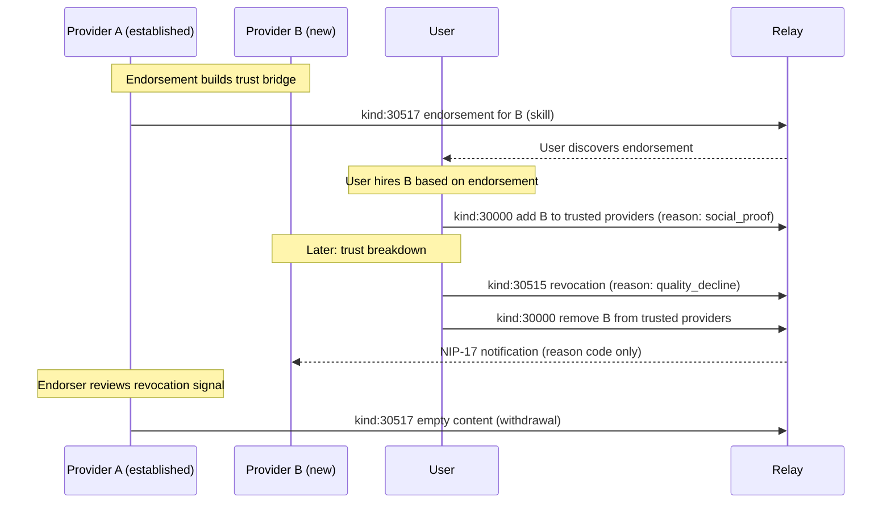

NIP-TRUST
==========

Portable Trust Networks
------------------------

`draft` `optional`

Two addressable event kinds for trust revocation and provider endorsements on Nostr. List-based trust data (trusted providers, recommendations, collectives, block lists) is handled by NIP-51.

## Motivation

Trust relationships form organically through repeated interactions, yet no Nostr protocol standardises how these relationships are expressed, shared, or discovered across applications. NIP-02 contact lists are binary (follow/don't follow) with no category scoping, ratings, or reasons. NIP-51 lists provide flexible, categorised grouping of pubkeys, but two critical trust primitives cannot be modelled as list membership:

1. **Trust revocation** must be a publicly timestamped, reason-coded event. Removing someone from a list is silent and leaves no audit trail. Revocations need tiered visibility, notification rules, and a permanent record that coordinators and safety contacts can query.
2. **Provider endorsements** are directional attestations from one provider to another. They carry endorsement types, weighting criteria, and withdrawal semantics. A list entry cannot express "I vouch for this person's skill, weighted by my own track record."

This NIP defines these two primitives. For list-based trust data, see [Composing with NIP-51](#composing-with-nip-51) below.

Together, NIP-TRUST and NIP-51 enable:

- **Personal trust is portable** - follows the user's Nostr keypair across clients
- **Word-of-mouth discovery** - shareable recommendation lists via NIP-51 with deep links or NIP-44 encryption
- **Cold-start solved** - provider-to-provider endorsements create trust bridges for new providers
- **Provider collectives** - groups of providers coordinate under a shared NIP-51 list identity
- **Social graph discovery** - existing data (NIP-02 contact lists, NIP-51 trust lists, `kind:30517` endorsements) surfaces trust signals with no new infrastructure

## Relationship to Existing NIPs

### NIP-02 (Contact Lists)

NIP-02 provides binary follow/unfollow. Trust revocations and endorsements add structured, reasoned trust signals that go beyond "I follow this person." A user may follow thousands of accounts but only endorse a handful of providers for specific skills.

### NIP-51 (Lists)

NIP-51 handles all list-based trust data that was previously modelled as dedicated kinds. Specifically:

- **Trusted Provider Lists** use `kind:30000` with `p` tags carrying category, rating, and reason metadata.
- **Shareable Recommendations** use `kind:30000` with `visibility` tags and optional NIP-44 encryption for private recommendations.
- **Provider Collectives** use `kind:30000` with collective metadata tags. Members are `p` tags with role positions.
- **Block Lists** use `kind:10000` (mute list) with category-scoped entries.

NIP-TRUST provides the two event types NIP-51 cannot model: revocations (which must be publicly timestamped, not just list removal) and endorsements (which are directional attestations between providers, not list membership). See [Composing with NIP-51](#composing-with-nip-51) for concrete JSON examples.

### NIP-56 (Reporting)

NIP-56 flags content for relay-level moderation. Trust revocation signals relationship termination between known parties; different semantics entirely. A revocation says "I no longer trust this entity" while a report says "this content violates relay policy."

## Kinds

| kind  | description          |
| ----- | -------------------- |
| 30515 | Trust Revocation     |
| 30517 | Provider Endorsement |

---

## Kind 30515: Trust Revocation

Explicit trust removal with reason-tiered visibility. Provides an audit trail and notification. Addressable; each revocation uses a unique `d` value.

```json
{
    "kind": 30515,
    "created_at": 1708300800,
    "tags": [
        ["d", "<revoker-pubkey>:<revoked-pubkey>:plumbing:1708300800"],
        ["p", "<revoked-pubkey>"],
        ["domain", "plumbing"],
        ["t", "domain:plumbing"],
        ["reason_code", "quality_decline"],
        ["e", "<nip-51-trust-list-event-id>"]
    ],
    "content": "<NIP-44 encrypted to coordinator(s): 'Quality dropped significantly over last 3 jobs.'>",
    "id": "<32-byte-hex>",
    "sig": "<64-byte-hex>"
}
```

### Tags

Required tags:

* `d` (MUST): Unique revocation identifier. Recommended format: `<revoker-pubkey>:<revoked-pubkey>:<category>:<timestamp>`.
* `p` (MUST): Revoked party's hex pubkey.
* `domain` (MUST): Category context. This is a multi-letter tag; relays cannot filter on it. Clients MUST post-filter by `domain` after retrieval.
* `reason_code` (MUST): One of the defined codes.

Optional tags:

* `t` (RECOMMENDED): `["t", "domain:<category>"]` (e.g. `["t", "domain:plumbing"]`). Enables relay-side discovery by domain via `#t` filters. The `domain` tag remains the canonical source; the `t` tag is a relay-filterable mirror.
* `e` (OPTIONAL): Reference to the NIP-51 trust list event the revocation applies to.

### Reason Codes

| Code | Visibility | Notification |
| ---- | ---------- | ------------ |
| `safety_concern` | Coordinators + safety contacts | NIP-17 to revoked party (code only, NOT free-text) |
| `no_show` | Coordinators | NIP-17 to revoked party (code only) |
| `quality_decline` | Coordinators | NIP-17 to revoked party (code only) |
| `personal_preference` | Revoked party only | NIP-17 with reason code |
| `moved_area` | Revoked party only | NIP-17 with reason code |
| `inactive` | Silent | No notification |

Content encryption: For safety/quality codes, content MUST be NIP-44 encrypted to relevant coordinators. The revoked party receives only the reason code via NIP-17, never the free-text. This prevents retaliation while giving signal.

### Revocation Lifecycle

When a trust revocation is published, the revoking party SHOULD also remove the corresponding `p` entry from their NIP-51 trusted provider list. The revocation event serves as the auditable record; the list update reflects the current state.

Clients querying trust status SHOULD check both the NIP-51 list (current membership) and `kind:30515` events (historical revocations). A provider absent from a trust list may have been silently removed or may have been formally revoked. Only a `kind:30515` event confirms formal revocation with a reason.

### REQ Filters

```json
[
    {"kinds": [30515], "authors": ["<revoker-pubkey>"]},
    {"kinds": [30515], "#p": ["<revoked-pubkey>"]},
    {"kinds": [30515], "authors": ["<revoker-pubkey>"], "#p": ["<revoked-pubkey>"]}
]
```

---

## Kind 30517: Provider Endorsement

Provider-to-provider vouching. Experienced providers endorse newer providers, solving the cold-start problem. Addressable; each endorser can publish at most one endorsement per endorsed provider per category.

```json
{
    "kind": 30517,
    "tags": [
        ["d", "<endorser-pubkey>:<endorsed-pubkey>:plumbing"],
        ["p", "<endorsed-pubkey>"],
        ["domain", "plumbing"],
        ["t", "domain:plumbing"],
        ["endorsement_type", "skill"],
        ["e", "<endorser-profile-event-id>"]
    ],
    "content": "Worked alongside Mo for 3 years. Solid work, reliable, always on time.",
    "id": "<32-byte-hex>",
    "sig": "<64-byte-hex>"
}
```

### Endorsement Types

| Type | Meaning |
| ---- | ------- |
| `skill` | "They're good at the job" - competence |
| `reliability` | "They show up and follow through" - dependable |
| `safety` | "I'd trust them in my home" - trustworthy in sensitive contexts |
| `general` | Broad endorsement, no specific category |

### Tags

Required tags:

* `d` (MUST): Unique identifier. Recommended format: `<endorser-pubkey>:<endorsed-pubkey>:<category>`.
* `p` (MUST): Endorsed provider's hex pubkey.
* `domain` (MUST): Category context. This is a multi-letter tag; relays cannot filter on it. Clients MUST post-filter by `domain` after retrieval.
* `endorsement_type` (MUST): One of the defined types.

Optional tags:

* `t` (RECOMMENDED): `["t", "domain:<category>"]` (e.g. `["t", "domain:plumbing"]`). Enables relay-side discovery by domain via `#t` filters. The `domain` tag remains the canonical source; the `t` tag is a relay-filterable mirror.
* `e` (OPTIONAL): Reference to the endorser's profile event (any kind).
* `expiration` (OPTIONAL): NIP-40 timestamp. Forces periodic re-endorsement.

### Weighting

Apps SHOULD weight endorsements by the endorser's track record:

- **Completed tasks** - an endorser with 500 completed tasks carries more weight than one with 5. Zero-history endorser = zero weight (primary Sybil defence).
- **Ratings** - higher-rated endorsers carry more weight.
- **Category relevance** - same-category endorsements carry full weight; cross-category MAY be weighted at 50%.

### Withdrawal

Retract by publishing a new `kind:30517` with the same `d` tag and empty content. Apps MUST treat empty content as retracted.

### REQ Filters

```json
[
    {"kinds": [30517], "#p": ["<endorsed-pubkey>"]},
    {"kinds": [30517], "authors": ["<endorser-pubkey>"]}
]
```

Filter by `#p` at the relay, then post-filter by `domain` tag client-side. NIP-01 only defines relay-side filters for single-letter tag names.

---

## Composing with NIP-51

The following trust data types are modelled as NIP-51 lists rather than dedicated kinds. This section provides concrete JSON examples so implementers know exactly how to structure these events.

### Trusted Provider List (NIP-51 kind 30000)

A user's personal list of preferred providers, with per-entry category and trust rating. Publishing a new version replaces the previous list entirely.

```json
{
    "kind": 30000,
    "pubkey": "<user-hex-pubkey>",
    "created_at": 1698700000,
    "tags": [
        ["d", "trusted-providers"],
        ["title", "Trusted Providers"],
        ["p", "<provider-1-pubkey>", "plumbing", "5", "personal_experience"],
        ["p", "<provider-2-pubkey>", "cleaning", "4", "recommendation"],
        ["p", "<provider-3-pubkey>", "plumbing", "4", "personal_experience", "1742000000"]
    ],
    "content": "",
    "id": "<32-byte-hex>",
    "sig": "<64-byte-hex>"
}
```

Each `p` tag carries positional metadata:

| Position | Description | Required |
| -------- | ----------- | -------- |
| 1 | Provider's hex pubkey | Yes |
| 2 | Category for which this provider is trusted | Yes |
| 3 | Personal trust rating (1-5) | Yes |
| 4 | Trust reason | No |
| 5 | Expiration (Unix timestamp) | No |

#### Trust Reasons

| Value | Description |
| ----- | ----------- |
| `personal_experience` | Trust earned through direct interaction (default if omitted) |
| `recommendation` | Imported from a shareable recommendation list |
| `social_proof` | Added because multiple contacts trust this provider |

#### Time-Bound Trust

Position 5 carries an optional expiration timestamp. When the current time exceeds this value, the trust entry has lapsed. Clients MUST NOT treat expired entries as active trust. This supports trial periods: trust a new provider for a fixed window and decide later whether to make it permanent.

#### Category-Scoped Entries

A provider MAY appear multiple times with different categories. Each entry is independent; ratings, reasons, and expirations MAY differ per category. A provider trusted at 5 for plumbing may be trusted at 3 for electrical work.

#### REQ Filters

```json
[
    {"kinds": [30000], "authors": ["<user-pubkey>"], "#d": ["trusted-providers"]},
    {"kinds": [30000], "#p": ["<provider-pubkey>"]}
]
```

### Shareable Recommendations (NIP-51 kind 30000)

Word-of-mouth provider recommendations. A user publishes a curated list that others can discover and import into their own trusted provider list.

Two visibility modes:

- **`public`** - visible to anyone, shareable via link. "Here are my 5 trusted cleaners."
- **`private`** - NIP-44 encrypted content with specific recipients tagged. "Here are my babysitters, sharing with my sister."

```json
{
    "kind": 30000,
    "tags": [
        ["d", "rec:my-london-plumbers"],
        ["title", "My London Plumbers"],
        ["domain", "plumbing"],
        ["visibility", "public"],
        ["p", "<provider-1-pubkey>", "plumbing", "5"],
        ["p", "<provider-2-pubkey>", "plumbing", "4"],
        ["expiration", "1742000000"]
    ],
    "content": "Plumbers I've used and trust. All South London, all reasonable prices.",
    "id": "<32-byte-hex>",
    "sig": "<64-byte-hex>"
}
```

The `d` tag uses a `rec:` prefix to distinguish recommendation lists from trusted provider lists.

For private recommendations, the `content` field is NIP-44 encrypted to each recipient. Recipient pubkeys are tagged with a `recipient` marker:

```json
{
    "kind": 30000,
    "tags": [
        ["d", "rec:babysitters-for-sarah"],
        ["title", "Babysitters for Sarah"],
        ["domain", "childcare"],
        ["visibility", "private"],
        ["p", "<recipient-pubkey>", "recipient"],
        ["expiration", "1742000000"]
    ],
    "content": "<NIP-44 encrypted JSON containing provider entries>",
    "id": "<32-byte-hex>",
    "sig": "<64-byte-hex>"
}
```

#### Import Flow

1. App displays the recommendation with provider profiles.
2. User selects which providers to import (explicit action REQUIRED; no automatic trust injection).
3. App adds selected providers to user's trusted provider list (`kind:30000`, `d:trusted-providers`) with reason `recommendation`.

### Provider Collective (NIP-51 kind 30000)

A group of providers sharing clients and coordinating under a common identity. Solves the single-provider availability problem.

```json
{
    "kind": 30000,
    "tags": [
        ["d", "collective:south-london-emergency-plumbers"],
        ["title", "South London Emergency Plumbers"],
        ["L", "collective"],
        ["l", "plumbing", "collective"],
        ["p", "<founder-pubkey>", "admin"],
        ["p", "<member-2-pubkey>", "admin"],
        ["p", "<member-3-pubkey>", "member"],
        ["p", "<member-4-pubkey>", "member"],
        ["coverage", "gcpuu"],
        ["coverage", "gcpuv"]
    ],
    "content": "24/7 emergency plumbing across South London. All background-checked and insured.",
    "id": "<32-byte-hex>",
    "sig": "<64-byte-hex>"
}
```

The `d` tag uses a `collective:` prefix. The `L`/`l` label tags (per NIP-32) identify this list as a collective and carry the service category.

#### Roles

| Role | Permissions |
| ---- | ----------- |
| `admin` | Add/remove members, manage collective profile, delegate admin |
| `member` | Accept tasks from collective's shared clients, publish availability under collective identity |

#### Trusting a Collective

Users reference a collective in their trusted provider list by adding a `collective` tag:

```json
["collective", "collective:south-london-emergency-plumbers", "plumbing", "5"]
```

Positions match the `p` tag format:

| Position | Description | Required |
| -------- | ----------- | -------- |
| 1 | Collective's `d` tag identifier | Yes |
| 2 | Category for which this collective is trusted | Yes |
| 3 | Personal trust rating (1-5) | Yes |
| 4 | Trust reason | No |
| 5 | Expiration (Unix timestamp) | No |

Any member of the trusted collective can then serve the user.

#### Individual Reputation Preserved

Members keep their own ratings and profiles. The collective is a coordination layer, not a replacement for individual identity.

### Block List (NIP-51 kind 10000)

NIP-51 mute lists (`kind:10000`) handle blocking. For category-scoped blocking, use the encrypted content field to store structured block entries.

The mute list's public tags carry no blocked pubkeys. All block data is stored in the NIP-44 self-encrypted `content` field to prevent metadata leakage:

```json
{
    "kind": 10000,
    "tags": [],
    "content": "<NIP-44 self-encrypted JSON>",
    "id": "<32-byte-hex>",
    "sig": "<64-byte-hex>"
}
```

#### Encrypted Content Structure

```json
{
    "blocked": [
        {
            "pubkey": "<hex-pubkey>",
            "blockedAt": 1708444800,
            "reason": "no_show",
            "category": "plumbing",
            "note": "Three no-shows in a row"
        },
        {
            "pubkey": "<hex-pubkey>",
            "blockedAt": 1708531200,
            "reason": "safety",
            "note": "Aggressive behaviour"
        }
    ],
    "updatedAt": 1708531200
}
```

#### Block Reason Codes

| Code | Description |
| ---- | ----------- |
| `safety` | Felt unsafe, aggressive behaviour |
| `no_show` | Repeated no-shows |
| `harassment` | Unwanted contact |
| `fraud` | Payment disputes, fraudulent claims |
| `other` | Free-text note explains |

#### Behavioural Rules

1. Apps SHOULD filter incoming requests and offers against the block list before presenting them.
2. Blocking is silent; no notification is sent.
3. Entries without a `category` field block across all categories.
4. Entries with a `category` field apply to that category only.
5. Cross-category blocks take precedence over category-scoped blocks.

---

## Social Graph Discovery

NIP-TRUST kinds and NIP-51 trust lists together enable a trust discovery algorithm using existing Nostr data:

| Tier | Source | Priority |
| ---- | ------ | -------- |
| 1 | Providers in user's NIP-51 trusted provider list | Highest |
| 2 | Providers in user's NIP-02 follow list (`kind:3`) | High |
| 3 | Providers endorsed (`kind:30517`) by Tier 1 providers | Medium |
| 4 | Providers followed by user's follows (2-hop web of trust) | Low |
| 5 | Any available provider meeting minimum criteria | Default fallback |

Apps SHOULD present the trust tier alongside provider listings so users understand the source of trust.

---

## Protocol Flow



---

## Sybil Resistance Properties

NIP-TRUST provides structural sybil resistance through several mechanisms.

### Endorsement Cost
Creating a provider endorsement (`kind:30517`) requires an existing keypair with reputation history. An attacker must either:
- Build genuine reputation over time (expensive)
- Compromise an existing trusted keypair (difficult)
- Create a new keypair with no endorsement weight (ineffective)

### Collective Membership
Provider collectives require approval from existing members. A sybil attacker cannot join established collectives without social verification.

### Trust Decay
Trust lists are actively maintained. Stale entries lose weight in discovery algorithms. An attacker who creates fake trust relationships must continuously maintain them.

### Graph Analysis
The trust graph is public (trust lists, endorsements, collectives are all on relays). Clients can detect suspicious patterns:
- Clusters of new keypairs endorsing each other
- Trust relationships with no corresponding transaction history
- Keypairs that only endorse and never transact

### What NIP-TRUST Does NOT Prevent
- A well-resourced attacker building genuine reputation over months
- Collusion between existing trusted parties
- Social engineering of collective membership

These are inherent limits of any decentralised trust system. NIP-TRUST raises the cost of sybil attacks without requiring a central authority.

---

## Use Cases Beyond Service Providers

### Content Moderation Networks
Relay operators maintain trusted curator lists (NIP-51 `kind:30000`). Content from endorsed keypairs gets priority. New accounts must earn endorsements before their content surfaces.

### Recommendation Circles
Friends share recommendation lists. NIP-51 collectives become curated recommendation groups.

### Professional Endorsements
LinkedIn-style endorsements on Nostr. A developer's endorsement (`kind:30517`) from a known open-source maintainer carries weight. The endorsement is portable; it follows the keypair, not a platform.

### Academic Peer Review
Researchers form collectives (NIP-51 lists) for peer review groups. Trust lists track which reviewers are trusted in which domains. Endorsements signal expertise areas.

---

## Security Considerations

* **No automatic trust injection.** Importing recommendations requires explicit user action. Apps MUST NOT silently add providers to trust lists.
* **Self-encrypted block lists.** Block data is NIP-44 self-encrypted within `kind:10000` mute lists; relays cannot read who is blocked.
* **Tiered revocation visibility.** Safety-related revocations are visible to coordinators for pattern detection; personal preference revocations are private.
* **Sybil resistance for endorsements.** Apps SHOULD weight endorsements by the endorser's track record (completed tasks, ratings). Zero-history endorsers carry zero weight.
* **Expiration support.** Trust entries and endorsements support NIP-40 expiration for time-bounded relationships.
* **Revocation is not deletion.** A `kind:30515` trust revocation is a permanent, timestamped signal. It cannot be silently undone. To restore trust, the revoking party publishes a new endorsement or re-adds the provider to their trust list. The revocation history remains queryable.

## Privacy

* **Block lists are fully encrypted.** Blocked pubkeys MUST NOT appear in public tags. All block data is stored in NIP-44 self-encrypted content within the `kind:10000` mute list.
* **Revocation content is encrypted.** Free-text reasons in `kind:30515` are NIP-44 encrypted to relevant coordinators. The revoked party receives only the reason code via NIP-17, never the free-text.
* **Private recommendations use NIP-44.** When visibility is `private`, recommendation list content is NIP-44 encrypted to specified recipients.
* **Trust lists reveal social graph.** Public NIP-51 trust lists and `kind:30517` endorsements are visible on relays. Users concerned about social graph exposure SHOULD use NIP-44 encrypted content within their NIP-51 lists, keeping `p` tags in the encrypted payload rather than public tags.

## Test Vectors

### Kind 30515 - Trust Revocation

```json
{
  "kind": 30515,
  "pubkey": "a1b2c3d4e5f6a1b2c3d4e5f6a1b2c3d4e5f6a1b2c3d4e5f6a1b2c3d4e5f6a1b2",
  "created_at": 1709740800,
  "tags": [
    ["d", "a1b2c3d4e5f6a1b2c3d4e5f6a1b2c3d4e5f6a1b2c3d4e5f6a1b2c3d4e5f6a1b2:b2c3d4e5f6a1b2c3d4e5f6a1b2c3d4e5f6a1b2c3d4e5f6a1b2c3d4e5f6a1b2c3:plumbing:1709740800"],
    ["p", "b2c3d4e5f6a1b2c3d4e5f6a1b2c3d4e5f6a1b2c3d4e5f6a1b2c3d4e5f6a1b2c3"],
    ["domain", "plumbing"],
    ["t", "domain:plumbing"],
    ["reason_code", "quality_decline"],
    ["e", "dddd4444eeee5555ffff6666aaaa1111bbbb2222cccc3333dddd4444eeee5555"]
  ],
  "content": "<NIP-44 encrypted to coordinator(s): 'Quality dropped significantly over last 3 jobs.'>",
  "id": "<32-byte-hex>",
  "sig": "<64-byte-hex>"
}
```

### Kind 30517 - Provider Endorsement

```json
{
  "kind": 30517,
  "pubkey": "a1b2c3d4e5f6a1b2c3d4e5f6a1b2c3d4e5f6a1b2c3d4e5f6a1b2c3d4e5f6a1b2",
  "created_at": 1709740800,
  "tags": [
    ["d", "a1b2c3d4e5f6a1b2c3d4e5f6a1b2c3d4e5f6a1b2c3d4e5f6a1b2c3d4e5f6a1b2:b2c3d4e5f6a1b2c3d4e5f6a1b2c3d4e5f6a1b2c3d4e5f6a1b2c3d4e5f6a1b2c3:plumbing"],
    ["p", "b2c3d4e5f6a1b2c3d4e5f6a1b2c3d4e5f6a1b2c3d4e5f6a1b2c3d4e5f6a1b2c3"],
    ["domain", "plumbing"],
    ["t", "domain:plumbing"],
    ["endorsement_type", "skill"],
    ["e", "dddd4444eeee5555ffff6666aaaa1111bbbb2222cccc3333dddd4444eeee5555"]
  ],
  "content": "Worked alongside Mo for 3 years. Solid work, reliable, always on time.",
  "id": "<32-byte-hex>",
  "sig": "<64-byte-hex>"
}
```

### NIP-51 Trusted Provider List

```json
{
  "kind": 30000,
  "pubkey": "a1b2c3d4e5f6a1b2c3d4e5f6a1b2c3d4e5f6a1b2c3d4e5f6a1b2c3d4e5f6a1b2",
  "created_at": 1709740800,
  "tags": [
    ["d", "trusted-providers"],
    ["title", "Trusted Providers"],
    ["p", "b2c3d4e5f6a1b2c3d4e5f6a1b2c3d4e5f6a1b2c3d4e5f6a1b2c3d4e5f6a1b2c3", "plumbing", "5", "personal_experience"],
    ["p", "c3d4e5f6a1b2c3d4e5f6a1b2c3d4e5f6a1b2c3d4e5f6a1b2c3d4e5f6a1b2c3d4", "cleaning", "4", "recommendation"]
  ],
  "content": "",
  "id": "<32-byte-hex>",
  "sig": "<64-byte-hex>"
}
```

### NIP-51 Block List

```json
{
  "kind": 10000,
  "pubkey": "a1b2c3d4e5f6a1b2c3d4e5f6a1b2c3d4e5f6a1b2c3d4e5f6a1b2c3d4e5f6a1b2",
  "created_at": 1709740800,
  "tags": [],
  "content": "<NIP-44 self-encrypted JSON>",
  "id": "<32-byte-hex>",
  "sig": "<64-byte-hex>"
}
```

## Dependencies

* [NIP-01](https://github.com/nostr-protocol/nips/blob/master/01.md): Basic protocol flow, addressable events
* [NIP-02](https://github.com/nostr-protocol/nips/blob/master/02.md): Contact lists (social graph discovery)
* [NIP-09](https://github.com/nostr-protocol/nips/blob/master/09.md): Deletion events (right to erasure)
* [NIP-17](https://github.com/nostr-protocol/nips/blob/master/17.md): Gift wrap (private notifications)
* [NIP-40](https://github.com/nostr-protocol/nips/blob/master/40.md): Expiration timestamps
* [NIP-44](https://github.com/nostr-protocol/nips/blob/master/44.md): Versioned encrypted payloads
* [NIP-51](https://github.com/nostr-protocol/nips/blob/master/51.md): Lists (trusted providers, recommendations, collectives, block lists)

## Reference Implementation

Implementors SHOULD refer to the kind definitions and NIP-51 composition examples above.

A minimal implementation requires:

1. A Nostr client that supports addressable event publishing, NIP-51 list management, and NIP-02 contact list queries.
2. A NIP-44 encryption library for self-encrypting block list content and private recommendation payloads.
3. Social graph traversal logic implementing the 5-tier discovery algorithm described above.
