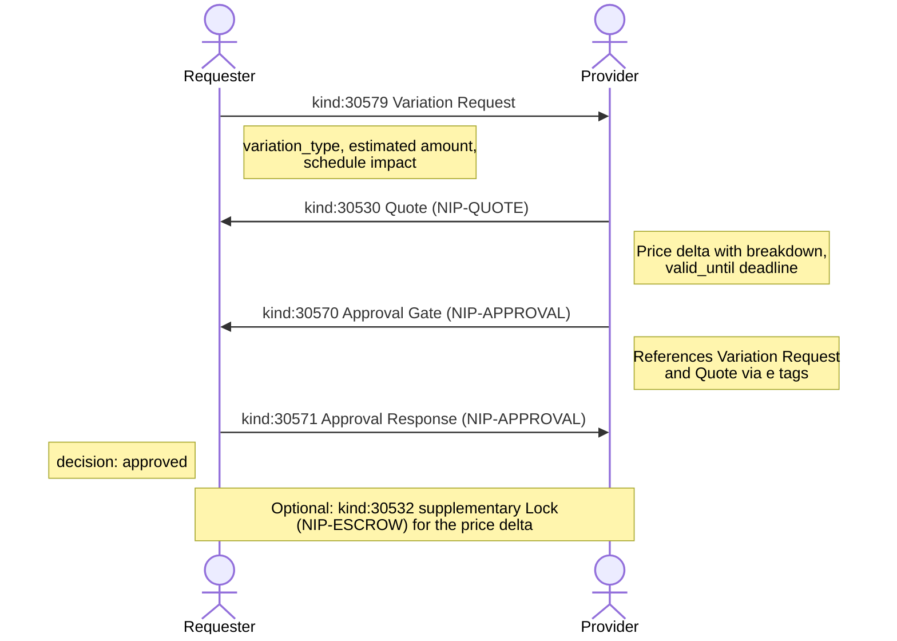

NIP-VARIATION
=============

Scope & Price Change Management
----------------------------------

`draft` `optional`

One addressable event kind for proposing changes to agreed work on Nostr. Pricing of changes composes with NIP-QUOTE; approval composes with NIP-APPROVAL.

> **Design principle:** The Variation Request records that a change was proposed and describes its scope. It does not price the change or approve it. Pricing composes with NIP-QUOTE (kind 30530); approval composes with NIP-APPROVAL (kinds 30570-30571). The consuming application updates its internal state based on the approved variation.

## Motivation

Nostr has events for creating agreements (NIP-99 listings, NIP-15 marketplace orders, NIP-ESCROW payment terms) but no standard mechanism for **changing the terms of an existing agreement**. In practice, scope changes are inevitable:

- **Contract modifications** -- adding, removing, or substituting deliverables mid-project
- **Order changes** -- modifying a marketplace order after acceptance
- **Schedule adjustments** -- changing deadlines or milestones for ongoing work
- **Price renegotiation** -- adjusting pricing based on changed circumstances

Without a standard, applications handle changes informally (DMs, new events that break the original reference chain) or not at all. NIP-VARIATION provides a single event kind for the change proposal itself. Pricing the change uses NIP-QUOTE; approving or rejecting it uses NIP-APPROVAL. This composition avoids inventing bespoke quote and approval semantics when proven primitives already exist.

## Relationship to Existing NIPs

### NIP-QUOTE (kinds 30530-30531)

When a variation has a price impact, the provider publishes a NIP-QUOTE Quote (kind 30530) referencing the Variation Request via `e` tag. The Quote's `amount` represents the price delta (positive for cost increases, negative amounts expressed as a separate `credit` breakdown item for reductions). `breakdown` tags show what changed. Payment Terms (kind 30531) MAY follow if the variation changes the payment structure.

### NIP-APPROVAL (kinds 30570-30571)

Variation approval uses NIP-APPROVAL. An Approval Gate (kind 30570) references the Variation Request via `e` tag, and optionally references the Quote as well. The counterparty responds with an Approval Response (kind 30571). Multi-reviewer gates work naturally: if both parties and a project manager must sign off, the gate lists all three as `gate_authority`.

### NIP-ESCROW

If the variation changes the total amount, the Lock (kind 30532) MAY need to be updated. Applications SHOULD handle this by creating a supplementary Lock for the delta, referencing the original Lock and the approved Variation Request.

## Kinds

| kind  | description         |
| ----- | ------------------- |
| 30579 | Variation Request   |

Addressable event (NIP-01). The `d` tag format ensures each event occupies a unique slot, allowing updates via republication.

---

## Variation Request (`kind:30579`)

Published by either party to request a change to the agreed scope. Addressable; the proposer can update the request before a quote or approval response is received.

```json
{
    "kind": 30579,
    "pubkey": "<requester-hex-pubkey>",
    "created_at": 1698771000,
    "tags": [
        ["d", "order_marketplace_001:variation:001"],
        ["t", "variation-request"],
        ["variation_type", "addition"],
        ["p", "<provider-hex-pubkey>"],
        ["e", "<original-agreement-event-id>", "wss://relay.example.com"],
        ["amount", "15000"],
        ["currency", "SAT"],
        ["schedule_impact_days", "3"]
    ],
    "content": "Adding express shipping to the order. Original order was standard delivery. Need it by Friday instead of next Wednesday.",
    "id": "<32-bytes lowercase hex>",
    "sig": "<64-bytes lowercase hex>"
}
```

Tags:

* `d` (REQUIRED): Format `<context_id>:variation:<sequence>`. Addressable event identifier.
* `t` (REQUIRED): Protocol family marker. MUST be `"variation-request"`.
* `variation_type` (REQUIRED): Nature of the change. One of `"addition"`, `"removal"`, `"substitution"`, `"modification"`, or `"schedule_change"`.
* `p` (RECOMMENDED): Other party's hex pubkey.
* `e` (RECOMMENDED): Event ID of the original scope or agreement event.
* `amount` (OPTIONAL): Estimated cost impact in smallest currency unit (pence for GBP, cents for USD, satoshis for SAT).
* `currency` (OPTIONAL): Currency code (e.g. `GBP`, `USD`, `EUR`, `SAT`).
* `schedule_impact_days` (OPTIONAL): Estimated schedule impact in days.
* `ref` (OPTIONAL): External reference (variation order number, change request ID).

**Content:** Plain text or NIP-44 encrypted JSON describing the requested change in detail.

### Variation Types

| Type | Description |
|------|-------------|
| `addition` | New deliverable, feature, or line item added to the original scope |
| `removal` | Existing deliverable removed from scope (may reduce price) |
| `substitution` | One deliverable replaced with another of comparable purpose |
| `modification` | Existing deliverable changed in specification, quantity, or quality |
| `schedule_change` | Timeline or deadline adjustment with no change to deliverables |

### REQ Filters

Clients can subscribe to variation requests using standard NIP-01 filters:

```json
// All variation requests for a specific agreement
{"kinds": [30579], "#e": ["<original-agreement-event-id>"]}

// All variation requests from a specific party
{"kinds": [30579], "authors": ["<requester-pubkey>"]}

// All variation requests addressed to a specific provider
{"kinds": [30579], "#p": ["<provider-pubkey>"]}

// A specific variation request by d-tag
{"kinds": [30579], "#d": ["order_marketplace_001:variation:001"]}
```

---

## Composing with NIP-QUOTE

When a variation has a price impact, the provider publishes a Quote (kind 30530) referencing the Variation Request. The Quote's `amount` is the price delta, and `breakdown` tags detail what changed.

### Example: Quoting a Variation

The requester published a Variation Request (kind 30579) asking to add express shipping. The provider responds with a Quote:

```json
{
    "kind": 30530,
    "pubkey": "<provider-hex-pubkey>",
    "created_at": 1698772000,
    "tags": [
        ["d", "order_marketplace_001:variation:001:quote"],
        ["e", "<variation-request-event-id>", "wss://relay.example.com"],
        ["p", "<requester-hex-pubkey>"],
        ["amount", "18000"],
        ["currency", "SAT"],
        ["breakdown", "express_shipping_upgrade", "15000", "SAT"],
        ["breakdown", "repackaging_fee", "3000", "SAT"],
        ["rate_unit", "flat"],
        ["valid_until", "1699376800"],
        ["payment_method", "lightning"],
        ["payment_method", "cashu"]
    ],
    "content": "Express shipping upgrade: 18,000 sats. Includes repackaging for expedited courier. No schedule impact; can dispatch today if approved by 14:00.",
    "id": "<32-bytes lowercase hex>",
    "sig": "<64-bytes lowercase hex>"
}
```

Key points:

* The `e` tag references the Variation Request (kind 30579), linking the quote to the specific change proposal.
* The `amount` is the price **delta**, not the new total. The original agreement's price remains unchanged until the variation is approved.
* `breakdown` tags itemise the cost of the change, making the delta auditable.
* `valid_until` sets a deadline. Expired quotes MUST NOT be approved.
* All standard NIP-QUOTE tags (`payment_method`, `rate_unit`, `mint_url`, etc.) are available.

If the variation also changes the payment structure (e.g. adding a new milestone), Payment Terms (kind 30531) MAY follow, referencing the Quote.

---

## Composing with NIP-APPROVAL

Variation approval uses NIP-APPROVAL. A proposer (or system) creates an Approval Gate (kind 30570) referencing the Variation Request and optionally the Quote. The counterparty responds with an Approval Response (kind 30571).

### Example: Approval Gate for a Variation

After the provider quotes the express shipping upgrade, an Approval Gate is created for the requester to sign off:

```json
{
    "kind": 30570,
    "pubkey": "<provider-hex-pubkey>",
    "created_at": 1698772500,
    "tags": [
        ["d", "order_marketplace_001:variation:001:gate:approval"],
        ["t", "approval-gate"],
        ["gate_type", "approval"],
        ["gate_authority", "<requester-hex-pubkey>"],
        ["gate_status", "pending"],
        ["e", "<variation-request-event-id>", "wss://relay.example.com"],
        ["e", "<variation-quote-event-id>", "wss://relay.example.com"],
        ["expiration", "1699376800"]
    ],
    "content": "Variation approval required: express shipping upgrade, 18,000 SAT delta. See referenced Quote for breakdown.",
    "id": "<32-bytes lowercase hex>",
    "sig": "<64-bytes lowercase hex>"
}
```

### Example: Approval Response

The requester approves the variation:

```json
{
    "kind": 30571,
    "pubkey": "<requester-hex-pubkey>",
    "created_at": 1698773000,
    "tags": [
        ["d", "order_marketplace_001:variation:001:gate:approval:response:<requester-hex-pubkey>"],
        ["t", "approval-response"],
        ["e", "<approval-gate-event-id>", "wss://relay.example.com"],
        ["decision", "approved"],
        ["p", "<provider-hex-pubkey>"]
    ],
    "content": "Approved. Please dispatch with express shipping today.",
    "id": "<32-bytes lowercase hex>",
    "sig": "<64-bytes lowercase hex>"
}
```

Key points:

* The Approval Gate references both the Variation Request and the Quote via `e` tags, creating a verifiable chain.
* `gate_authority` names the party whose sign-off is required. For variations requiring mutual agreement, list both parties.
* The Approval Response's `decision` tag uses the standard NIP-APPROVAL values: `"approved"`, `"rejected"`, or `"revise"`.
* Rejection or revision request works identically to any other NIP-APPROVAL flow. If the requester rejects, the variation is abandoned. If they request revision, the provider updates the Quote.
* The `expiration` tag on the gate SHOULD match the Quote's `valid_until` to avoid approving an expired price.

---

## Protocol Flow



1. **Request:** Either party publishes `kind:30579` describing the desired change, its type, and optionally an estimated cost impact.
2. **Quote (optional):** If the variation has a price impact, the provider publishes a NIP-QUOTE Quote (kind 30530) referencing the Variation Request, with the confirmed cost delta and breakdown.
3. **Approval Gate:** A NIP-APPROVAL Approval Gate (kind 30570) is created, referencing the Variation Request and (if present) the Quote. The `gate_authority` identifies who must sign off.
4. **Approval Response:** The counterparty publishes a NIP-APPROVAL Approval Response (kind 30571) with their decision.
5. **Execution:** If approved, the consuming application updates its internal state to reflect the new scope, price, and timeline. A supplementary NIP-ESCROW Lock (kind 30532) MAY be published to cover the price delta.

### Variations Without Price Impact

Not all variations require a Quote. A `schedule_change` that moves the deadline by two days, or a `substitution` at equal value, may need only an Approval Gate and Response. The Quote step is optional; the protocol flow adapts:

```
Variation Request → Approval Gate → Approval Response
```

---

## Use Cases Beyond TROTT

### Marketplace Order Modifications

When a buyer wants to modify an accepted marketplace order (NIP-15), the variation flow provides a structured negotiation. The buyer requests a change, the seller quotes the impact via NIP-QUOTE, and the buyer approves via NIP-APPROVAL before any changes take effect.

### Freelance Scope Changes

Freelance projects frequently encounter scope creep. NIP-VARIATION provides a formal mechanism for managing mid-project changes. When a client wants additional work, the freelancer quotes the cost and timeline impact, and the client explicitly approves. This prevents disputes about what was agreed and what was extra.

### Subscription & Service Plan Changes

Subscription services on Nostr can use variations to manage plan changes. The `variation_type: substitution` models a plan swap, while `addition` models add-on features. The Quote captures the price difference; the Approval Gate records the customer's consent.

### Event & Booking Modifications

When plans change after a booking has been confirmed, the variation flow ensures both parties agree to the revised terms and pricing before changes are made.

## Security Considerations

* **Reference chain integrity.** The full variation flow creates a verifiable chain: Variation Request -> Quote -> Approval Gate -> Approval Response. Clients MUST verify that `e` tag references are valid and form a consistent chain.
* **Quote expiry.** Variation quotes with a `valid_until` tag SHOULD be considered expired after the deadline. Clients MUST NOT create Approval Gates referencing expired Quotes.
* **Decision finality.** Once an Approval Response (kind 30571) is published with `approved` or `rejected`, the decision SHOULD be treated as final. Applications SHOULD warn if a gate is modified after a final decision has been recorded.
* **Amount validation.** Clients SHOULD verify that the Quote's `amount` is reasonable relative to the Variation Request's estimated amount. Large discrepancies SHOULD be flagged to the requester.
* **Content encryption.** When variation details are commercially sensitive (pricing strategy, proprietary specifications), the `content` field SHOULD be NIP-44 encrypted to the relevant parties.
* **Authorisation.** Only the original parties to the agreement SHOULD be able to publish variation events. Clients SHOULD verify that variation event authors are participants in the original agreement.

## Privacy

Variation Requests are public by default. When scope changes are commercially sensitive, implementations MAY deliver events via NIP-59 gift wrap. This is an application-level decision, not a protocol requirement.

### Metadata minimisation

Implementations SHOULD include only the tags marked REQUIRED or RECOMMENDED. Optional tags (`amount`, `currency`, `schedule_impact_days`, `ref`) increase the metadata surface; omit them unless the application specifically needs them.

## Test Vectors

All examples use timestamp `1709740800` (2024-03-06T12:00:00Z) and placeholder hex pubkeys.

### Kind 30579 -- Variation Request

```json
{
    "kind": 30579,
    "pubkey": "a1b2c3d4e5f6a1b2c3d4e5f6a1b2c3d4e5f6a1b2c3d4e5f6a1b2c3d4e5f6a1b2",
    "created_at": 1709740800,
    "tags": [
        ["d", "project_alpha:variation:003"],
        ["t", "variation-request"],
        ["variation_type", "addition"],
        ["p", "b2c3d4e5f6a1b2c3d4e5f6a1b2c3d4e5f6a1b2c3d4e5f6a1b2c3d4e5f6a1b2c3"],
        ["e", "dddd4444eeee5555ffff6666aaaa1111bbbb2222cccc3333dddd4444eeee5555", "wss://relay.example.com"],
        ["amount", "25000"],
        ["currency", "SAT"],
        ["schedule_impact_days", "5"],
        ["ref", "VO-2024-003"]
    ],
    "content": "Adding dark mode support to the web dashboard. Original scope covered light theme only. Estimated 5 additional days for CSS rework and testing.",
    "id": "<32-byte-hex>",
    "sig": "<64-byte-hex>"
}
```

## Dependencies

* [NIP-01](https://github.com/nostr-protocol/nips/blob/master/01.md): Basic protocol flow, addressable events
* [NIP-40](https://github.com/nostr-protocol/nips/blob/master/40.md): Expiration timestamps (quote validity, gate deadlines)
* [NIP-44](https://github.com/nostr-protocol/nips/blob/master/44.md): Versioned encrypted payloads (sensitive variation details)
* NIP-QUOTE: Structured pricing (quoting the cost of a variation)
* NIP-APPROVAL: Multi-party approval gates (approving or rejecting a variation)

## Reference Implementations

The [`@trott/sdk`](https://github.com/TheCryptoDonkey/trott-sdk) TypeScript library provides builders and parsers for the Variation Request kind defined in this NIP, along with composition helpers for the NIP-QUOTE and NIP-APPROVAL flows. For standalone use without TROTT, implementors SHOULD refer to the kind definitions above.

A minimal implementation requires:

1. A Nostr client that supports addressable event publishing.
2. Reference chain tracking: linking Variation Requests to Quotes (NIP-QUOTE) and Approval Gates (NIP-APPROVAL) via `e` tags.
3. State management to update the original agreement's effective scope and price when a variation is approved.

## Standalone Usage

NIP-VARIATION is designed for standalone use. Any Nostr application where agreed scope needs to change can use kind 30579 without adopting NIP-QUOTE, NIP-APPROVAL, or NIP-ESCROW. A simple two-party chat application could use Variation Requests as structured "change proposals" with approval handled informally. As needs grow, the NIP-QUOTE and NIP-APPROVAL composition patterns provide structured pricing and formal sign-off without changing the Variation Request format.
