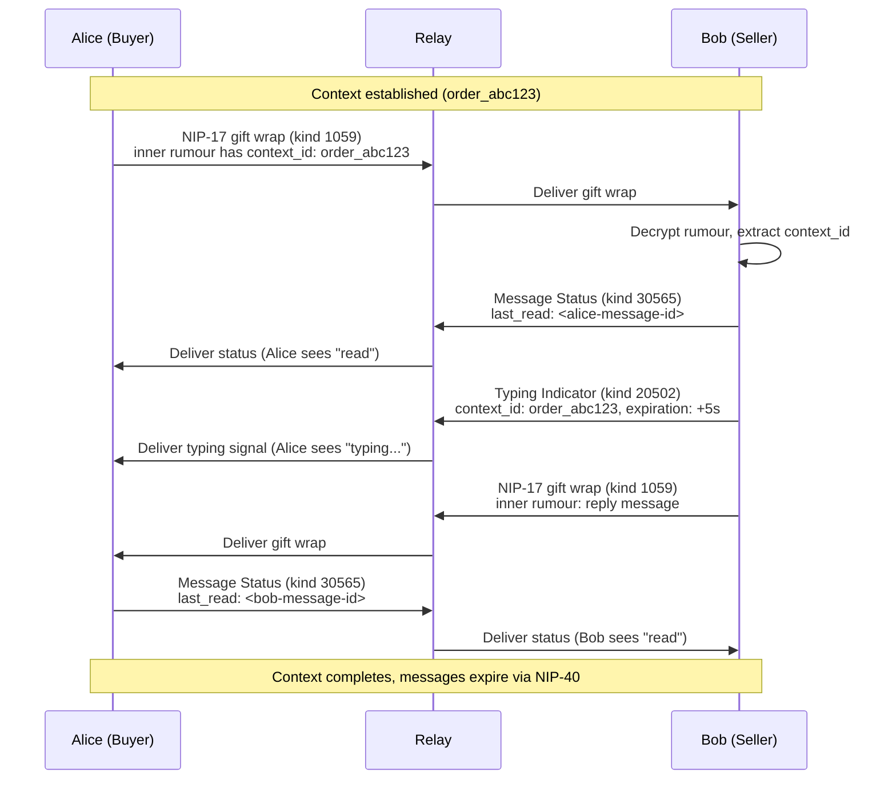

NIP-CHANNELS
============

Message Status & Typing Indicators
-------------------------------------

`draft` `optional`

Two event kinds for message status tracking and real-time typing indicators on Nostr, designed to complement NIP-17 private direct messages with context-scoping and delivery state.

> **Standalone.** This NIP works independently on any Nostr application.

## Motivation

NIP-17 handles encrypted message delivery between participants via gift wrap. It solves the hard problem of private, metadata-protected messaging. However, two coordination primitives are missing from the messaging stack:

1. **Delivery and read state.** Senders have no way to know whether a message was delivered or read. In transactional contexts (marketplace orders, freelance projects, service coordination), this uncertainty creates friction and duplicated messages.
2. **Real-time typing signals.** Typing indicators are a standard UX expectation in messaging. Without them, participants cannot tell whether the other party is actively engaged or has walked away.

For context-scoped messaging (messages tied to a specific order, project, or task), NIP-17 messages can carry a `context_id` tag inside the sealed rumour to scope conversations. This NIP provides the status and presence primitives that complete the picture.

Use cases:

- **Marketplace:** Buyer and seller coordinate delivery details for an order.
- **Freelance:** Client and contractor discuss project requirements.
- **Events:** Organiser and vendor coordinate setup logistics.
- **Local services:** Requester and provider share access codes, arrival updates.

## Relationship to Existing NIPs

- **[NIP-17](https://github.com/nostr-protocol/nips/blob/master/17.md) (Private Direct Messages):** NIP-17 handles encrypted message delivery via gift wrap (NIP-59). For context-scoped messaging, add a `context_id` tag to the inner rumour event. This NIP provides the status and UX primitives that NIP-17 lacks. See [Context-Scoped Messaging with NIP-17](#context-scoped-messaging-with-nip-17) for concrete examples.
- **[NIP-29](https://github.com/nostr-protocol/nips/blob/master/29.md) (Relay-based Groups):** Relay-managed groups are persistent, relay-hosted communities with membership controls. Context-scoped channels are ephemeral, participant-specific, and tied to a shared context (transaction, project, order). They auto-expire when the context completes.
- **[NIP-44](https://github.com/nostr-protocol/nips/blob/master/44.md) (Encryption):** Message Status events use NIP-44 encryption for private delivery state.
- **[NIP-59](https://github.com/nostr-protocol/nips/blob/master/59.md) (Gift Wrap):** NIP-17 uses gift wrap for sender metadata protection. Status events MAY also be gift-wrapped for maximum privacy.
- **[NIP-38](https://github.com/nostr-protocol/nips/blob/master/38.md) (User Statuses):** User statuses (kind 30315) are long-lived, public, addressable events for general status updates (e.g. "listening to music"). Typing indicators are ephemeral (kind 20502), context-scoped, sent to specific recipients, and expire within seconds. Different event type, lifecycle, and audience.

## Kinds

| kind  | description      |
| ----- | ---------------- |
| 30565 | Message Status   |
| 20502 | Typing Indicator |

---

## Message Status (`kind:30565`)

Read receipts and delivery confirmation. Addressable; the latest status for a given context replaces previous status events.

```json
{
    "kind": 30565,
    "pubkey": "<reader-hex-pubkey>",
    "created_at": 1698766100,
    "tags": [
        ["d", "order_abc123:status:<reader-pubkey>:<counterparty-pubkey>"],
        ["context_id", "order_abc123"],
        ["last_read", "<event-id-of-last-read-message>"],
        ["p", "<counterparty-pubkey>"],
        ["expiration", "1701358100"],
        ["alt", "Message read status for context order_abc123"]
    ],
    "content": "<NIP-44 encrypted: {\"unread_count\": 0, \"last_read_at\": 1698766095}>",
    "id": "<32-byte-hex>",
    "sig": "<64-byte-hex>"
}
```

Tags:

* `d` (REQUIRED): Unique status identifier. Format: `<context_id>:status:<reader-pubkey>:<counterparty-pubkey>`. The counterparty pubkey discriminates between pairwise streams in the same context. Without it, a participant in multiple streams would overwrite their read position when reading messages from a different stream.
* `context_id` (REQUIRED): Shared context identifier.
* `last_read` (REQUIRED): Event ID of the most recently read message.
* `p` (REQUIRED): Counterparty who should see this receipt.
* `expiration` (RECOMMENDED): NIP-40 expiration timestamp. Implementations SHOULD set `expiration` to context completion plus 30 days.

Content:

The `content` field is NIP-44 encrypted to the counterparty. It MAY contain a JSON object with additional status metadata:

| Field          | Type   | Description                                   |
| -------------- | ------ | --------------------------------------------- |
| `unread_count` | number | Number of unread messages (0 = all read)      |
| `last_read_at` | number | Unix timestamp of when the message was read   |

Clients that do not need rich status metadata MAY leave the content empty.

### REQ Filters

Subscribe to status updates for a context:

```json
["REQ", "sub-status", {
    "kinds": [30565],
    "#p": ["<my-pubkey>"]
}]
```

Filter by `kinds` and `#p` at the relay, then post-filter by `context_id` tag client-side. NIP-01 defines relay-side filters for single-letter tag names only.

---

## Typing Indicator (`kind:20502`)

Ephemeral real-time typing signal. Relays MUST NOT persist these events.

```json
{
    "kind": 20502,
    "pubkey": "<typer-hex-pubkey>",
    "created_at": 1698766200,
    "tags": [
        ["context_id", "order_abc123"],
        ["p", "<recipient-pubkey>"],
        ["expiration", "1698766205"],
        ["alt", "Typing indicator"]
    ],
    "content": "",
    "id": "<32-byte-hex>",
    "sig": "<64-byte-hex>"
}
```

Tags:

* `context_id` (REQUIRED): Shared context identifier.
* `p` (REQUIRED): Recipient(s) of the typing signal.
* `expiration` (REQUIRED): Short NIP-40 expiration (5-10 seconds). Safety net; if the sender stops typing, the indicator expires automatically.

Clients SHOULD send typing indicators at most once every 3 seconds to avoid relay spam. When a user stops typing, the client SHOULD NOT send a "stopped typing" event; the expiration handles cleanup.

### REQ Filters

Subscribe to typing indicators for a context:

```json
["REQ", "sub-typing", {
    "kinds": [20502],
    "#p": ["<my-pubkey>"]
}]
```

Filter by `kinds` and `#p` at the relay, then post-filter by `context_id` tag client-side. NIP-01 defines relay-side filters for single-letter tag names only.

---

## Context-Scoped Messaging with NIP-17

NIP-17 handles message content delivery. This section shows how to compose NIP-17 messages with a `context_id` tag for context-scoped channels, and how these combine with the status and typing primitives defined above.

### Adding `context_id` to NIP-17 Messages

The `context_id` tag is placed inside the **sealed rumour** (the kind 14 event that NIP-17 wraps). Relays and observers cannot see it; only the recipient can decrypt it.

**Rumour (kind 14, unsigned inner event):**

```json
{
    "kind": 14,
    "pubkey": "<sender-hex-pubkey>",
    "created_at": 1698766000,
    "tags": [
        ["p", "<recipient-pubkey>"],
        ["context_id", "order_abc123"],
        ["message_type", "text"],
        ["subject", "Order #ABC123"]
    ],
    "content": "I'm at the back entrance, look for the red door."
}
```

This rumour is then sealed (kind 13) and gift-wrapped (kind 1059) per the NIP-17 specification. The `context_id` and `message_type` tags are only visible after decryption.

### Message Types (Application-Level Convention)

> **Note:** The `message_type` and `template` tags extend NIP-17 rumours at the application layer. They are not part of the NIP-17 specification. Applications that do not need message classification MAY omit them entirely.

The `message_type` tag classifies the message content. Clients SHOULD support the following types:

| Type              | Description                                        | Example content                                    |
| ----------------- | -------------------------------------------------- | -------------------------------------------------- |
| `text`            | Free-text message                                  | `"Running 5 minutes late"`                         |
| `system`          | System-generated notification                      | `"Order dispatched"`                               |
| `location_share`  | Shared location coordinates                        | `"{\"lat\": 51.5074, \"lon\": -0.1278}"`          |
| `media`           | Photo or file reference                            | `"{\"url\": \"https://...\", \"mime\": \"image/jpeg\"}"` |
| `payment_update`  | Payment status notification                        | `"{\"status\": \"paid\", \"amount\": 1500, \"currency\": \"GBP\"}"` |

Clients that do not recognise a `message_type` SHOULD fall back to rendering the content as plain text.

### Structured Message Templates (Application-Level Convention)

When `message_type` is `system`, the `content` field MAY use structured JSON for machine-parseable notifications:

```json
{
    "kind": 14,
    "pubkey": "<sender-hex-pubkey>",
    "created_at": 1698766300,
    "tags": [
        ["p", "<recipient-pubkey>"],
        ["context_id", "order_abc123"],
        ["message_type", "system"],
        ["template", "eta_update"]
    ],
    "content": "{\"eta_minutes\": 5, \"message\": \"Driver is 5 minutes away\"}"
}
```

Common templates:

| Template               | Description                    | Example content                                  |
| ---------------------- | ------------------------------ | ------------------------------------------------ |
| `eta_update`           | Updated arrival estimate       | `{"eta_minutes": 5}`                             |
| `running_late`         | Delay notification             | `{"delay_minutes": 10, "reason": "traffic"}`     |
| `access_code`          | Entry code                     | `{"code": "1234", "type": "gate"}`               |
| `arrival_notification` | Arrived at location            | `{"location": "front door"}`                     |
| `status_update`        | General status notification    | `{"status": "Order being prepared"}`             |

Applications MAY define additional templates. Clients that do not recognise a template SHOULD render the `message` field from the content JSON, or fall back to the raw content string.

### Multi-Party Channels

NIP-17 supports sending gift-wrapped copies to multiple recipients. For a three-party context (e.g. buyer, courier, and recipient), the sender creates a separate gift-wrapped copy for each participant:

**Rumour (kind 14, same inner event for all recipients):**

```json
{
    "kind": 14,
    "pubkey": "<courier-hex-pubkey>",
    "created_at": 1698766400,
    "tags": [
        ["p", "<buyer-pubkey>"],
        ["p", "<recipient-pubkey>"],
        ["context_id", "delivery_xyz789"],
        ["message_type", "text"]
    ],
    "content": "Package picked up, heading to the drop-off point now."
}
```

The sender gift-wraps this rumour separately for each `p`-tagged recipient. Each recipient receives their own gift-wrapped copy and can independently decrypt it.

For privacy-sensitive contexts where not all participants should see all messages, use **separate pairwise streams** with the same `context_id`:

| Stream              | Participants        | Typical content                           |
| ------------------- | ------------------- | ----------------------------------------- |
| Buyer - Courier     | Customer, courier   | ETA updates, access codes                 |
| Courier - Recipient | Courier, recipient  | "I'm at the door", "Leave at reception"   |

Each stream uses the same `context_id` but different `p` tags. A buyer-to-courier message is NOT visible to the recipient unless explicitly `p`-tagged.

### Channel Lifecycle

1. **Creation:** A channel begins when the first NIP-17 message with a given `context_id` is sent. There is no explicit "create channel" event.
2. **Active messaging:** Participants exchange NIP-17 messages with the shared `context_id`. Message Status (kind 30565) and Typing Indicator (kind 20502) events provide coordination signals.
3. **Archival:** Messages SHOULD include an `expiration` tag (NIP-40) for automatic cleanup. Implementations SHOULD set expiration to context completion plus 30 days. Pre-context enquiries SHOULD use standard NIP-17 messages without a `context_id`.

### Retrieving Channel History

Recipients reconstruct channel history by filtering their decrypted NIP-17 messages (kind 14 rumours) by `context_id`. Since NIP-17 messages are gift-wrapped, there is no relay-side filter for `context_id`; clients MUST decrypt messages first, then filter locally.

---

## Protocol Flow



## Security Considerations

* **End-to-end encryption.** Message content is delivered via NIP-17 gift wrap, providing NIP-44 encryption and sender metadata protection. Relays cannot read message content or determine the true sender.
* **Scoped channels.** Messages are bound to a `context_id` inside the encrypted rumour. There is no cross-context message leakage. The `context_id` is not visible to relays.
* **Automatic expiration.** NIP-40 `expiration` tags ensure messages and status events do not persist indefinitely. Implementations SHOULD set expiration to context completion plus 30 days for GDPR right-to-erasure compliance.
* **No retroactive access.** Adding a new participant to `p` tags on future messages does not grant access to historical messages. Each gift-wrapped message is independently encrypted.
* **Ephemeral indicators.** Typing indicators are ephemeral events; relays MUST NOT persist them.
* **Status metadata leakage.** Message Status events (kind 30565) are addressable and visible to relays. The `context_id` and `p` tags reveal that two pubkeys are communicating within a context. For maximum privacy, implementations MAY gift-wrap status events as well.

## Privacy

Message content and `context_id` values are encrypted inside NIP-17 gift wraps. Relays see only the outer gift-wrap metadata (random sender pubkey, recipient pubkey, kind 1059).

Message Status events (kind 30565) expose the `context_id` and participant pubkeys in plaintext tags. The `context_id` tag is client-side metadata; relays cannot filter on it because NIP-01 only indexes single-letter tag names. Clients filter by `kinds` and `#p` at the relay, then match `context_id` after retrieval. Applications with strict metadata privacy requirements SHOULD either:

1. Use opaque `context_id` values (UUIDs or hashes) that do not reveal the nature of the context.
2. Gift-wrap status events using NIP-59 for full metadata protection.

Typing indicators expose `context_id` and participant pubkeys but are ephemeral and short-lived (5-10 second expiration).

## Test Vectors

### Message Status (kind 30565)

```json
{
    "kind": 30565,
    "pubkey": "a1b2c3d4e5f6a1b2c3d4e5f6a1b2c3d4e5f6a1b2c3d4e5f6a1b2c3d4e5f6a1b2",
    "created_at": 1698766100,
    "tags": [
        ["d", "order_abc123:status:a1b2c3d4e5f6a1b2c3d4e5f6a1b2c3d4e5f6a1b2c3d4e5f6a1b2c3d4e5f6a1b2:f6e5d4c3b2a1f6e5d4c3b2a1f6e5d4c3b2a1f6e5d4c3b2a1f6e5d4c3b2a1f6e5"],
        ["context_id", "order_abc123"],
        ["last_read", "aabbccdd11223344aabbccdd11223344aabbccdd11223344aabbccdd11223344"],
        ["p", "f6e5d4c3b2a1f6e5d4c3b2a1f6e5d4c3b2a1f6e5d4c3b2a1f6e5d4c3b2a1f6e5"],
        ["expiration", "1701358100"],
        ["alt", "Message read status for context order_abc123"]
    ],
    "content": "",
    "id": "...",
    "sig": "..."
}
```

**Validation rules:**

1. `kind` MUST be `30565`.
2. `d` tag MUST follow the format `<context_id>:status:<reader-pubkey>:<counterparty-pubkey>`.
3. `context_id` tag MUST be present and non-empty.
4. `last_read` tag MUST contain a valid 32-byte hex event ID.
5. At least one `p` tag MUST be present.

### Typing Indicator (kind 20502)

```json
{
    "kind": 20502,
    "pubkey": "a1b2c3d4e5f6a1b2c3d4e5f6a1b2c3d4e5f6a1b2c3d4e5f6a1b2c3d4e5f6a1b2",
    "created_at": 1698766200,
    "tags": [
        ["context_id", "order_abc123"],
        ["p", "f6e5d4c3b2a1f6e5d4c3b2a1f6e5d4c3b2a1f6e5d4c3b2a1f6e5d4c3b2a1f6e5"],
        ["expiration", "1698766205"],
        ["alt", "Typing indicator"]
    ],
    "content": "",
    "id": "...",
    "sig": "..."
}
```

**Validation rules:**

1. `kind` MUST be `20502`.
2. `context_id` tag MUST be present and non-empty.
3. At least one `p` tag MUST be present.
4. `expiration` tag MUST be present with a value no more than 30 seconds in the future.
5. `content` MUST be empty.

---

## Dependencies

* [NIP-01](https://github.com/nostr-protocol/nips/blob/master/01.md): Basic protocol flow, addressable events, ephemeral events
* [NIP-17](https://github.com/nostr-protocol/nips/blob/master/17.md): Private direct messages (message content delivery)
* [NIP-40](https://github.com/nostr-protocol/nips/blob/master/40.md): Expiration timestamps
* [NIP-44](https://github.com/nostr-protocol/nips/blob/master/44.md): Versioned encrypted payloads
* [NIP-59](https://github.com/nostr-protocol/nips/blob/master/59.md): Gift wrap (used by NIP-17 for sender metadata protection)

## Reference Implementation

No public reference implementation exists yet. Implementors SHOULD refer to the kind definitions above.

A minimal implementation requires:

1. A NIP-17 compatible client for sending and receiving gift-wrapped messages with `context_id` tags.
2. A NIP-44 encryption library for encrypting Message Status content to the counterparty.
3. A Nostr client that supports addressable and ephemeral event publishing.
4. Context management logic to scope messages and status events to a shared `context_id`.
