NIP-DISPUTES
==============

Dispute Resolution Protocol
------------------------------

`draft` `optional`

Two event kinds for structured dispute resolution on Nostr: claim filing and resolution.

> **Standalone.** This NIP works independently on any Nostr application.

## Motivation

NIP-56 provides content reporting (flagging notes for moderation), but Nostr has no protocol for resolving disputes between parties. When a marketplace purchase goes wrong, a group governance decision is contested, a freelance job is abandoned, or content is wrongly removed, there is no standardised way to:

- **File a structured complaint** referencing a specific event, with typed categories and optional mediator assignment
- **Resolve the complaint** with a transparent, signed ruling

This NIP defines two event kinds: a dispute claim and a dispute resolution. They work with any Nostr interaction that produces an event: marketplace transactions (NIP-15), classified listings (NIP-99), group moderation (NIP-29), content publishing, or any custom application.

## Relationship to Existing NIPs

### NIP-56 (Reporting)

NIP-56 handles content and user reporting for moderation. Dispute Claims (`kind:7543`) are structured complaints between parties with typed dispute categories, optional financial amounts, and optional mediator assignment. The two serve different purposes: NIP-56 is unilateral reporting to relays; NIP-DISPUTES is bilateral dispute resolution between parties.

Applications MAY implement reputation consequences based on dispute history. For example, an application that detects patterns of at-fault rulings against the same pubkey MAY publish NIP-56 reports with structured `report` tags. This keeps abuse reporting at the application layer where pattern detection logic belongs.

### NIP-EVIDENCE (kind 30578)

Dispute evidence SHOULD be submitted as [NIP-EVIDENCE](NIP-EVIDENCE.md) records (`kind:30578`). The `e` tag references the dispute claim event. Evidence types (photo, video, screenshot, receipt, etc.) map directly to NIP-EVIDENCE's `evidence_type` vocabulary. This composability means dispute evidence is discoverable alongside other evidence records and benefits from NIP-EVIDENCE's file hash verification, geolocation, and capture timestamp metadata.

See [Composing with NIP-EVIDENCE](#composing-with-nip-evidence) for concrete examples.

### NIP-94 / Blossom

For media attachments (photos, videos, documents), use NIP-94 file metadata or Blossom (BUD-01) uploads, referenced from NIP-EVIDENCE records via `file_hash` and URL tags. Media upload is a generic file management concern, not dispute-specific.

### NIP-APPROVAL

For multi-party dispute panels (e.g. three-mediator arbitration), compose with [NIP-APPROVAL](NIP-APPROVAL.md) gates. Each panel member publishes an approval event; the dispute resolution is published once the required threshold is met.

## Kinds

| kind  | description         | type        |
| ----- | ------------------- | ----------- |
| 7543  | Dispute Claim       | regular     |
| 30545 | Dispute Resolution  | addressable |

Claims are regular events (NIP-01); once published, they cannot be replaced at the relay level (regular events have no addressable replacement semantics). NIP-09 deletion requests may be issued but relays MAY ignore them; the cryptographic signature on the original event remains independently verifiable. Resolutions are addressable events; the resolver may correct a ruling before settlement.

---

## Dispute Claim (`kind:7543`)

Filed by a complainant against another party. Immutable: as a regular event, the claim cannot be replaced or retracted at the relay level. It can only be resolved via a `kind:30545` resolution.

```json
{
    "kind": 7543,
    "pubkey": "<complainant-hex-pubkey>",
    "created_at": 1698770000,
    "tags": [
        ["p", "<accused-pubkey>"],
        ["e", "<referenced-event-id>"],
        ["alt", "Dispute claim: quality issue in freelance engagement"],
        ["dispute_type", "quality"],
        ["resolution_model", "mediator"],
        ["mediator", "<mediator-pubkey>"],
        ["domain", "freelance"],
        ["t", "domain:freelance"],
        ["amount_disputed", "25000"],
        ["currency", "SAT"]
    ],
    "content": "Deliverables did not match the agreed specification. Three of five requirements were not addressed."
}
```

Tags:

* `p` (REQUIRED): Accused party's pubkey.
* `e` (REQUIRED): References the event being disputed.
* `dispute_type` (REQUIRED): Application-defined dispute category. Common examples include `no_show`, `quality`, `pricing`, `damage`, `safety`, `fraud`, `moderation`, `governance`, but applications MAY define any value appropriate to their domain.
* `resolution_model` (REQUIRED): Application-defined resolution model. Common models include `mediator` (designated party reviews and rules), `mutual` (parties negotiate directly), and `automated` (rule-based auto-resolution), but applications MAY define any value.
* `mediator` (OPTIONAL): Nominated mediator's pubkey. How the mediator is selected (marketplace-assigned, mutually agreed, random from pool) is application-defined.
* `domain` (OPTIONAL): Category of the disputed interaction (e.g. `freelance`, `delivery`, `marketplace`, `moderation`, `governance`). This is a multi-letter tag; relays cannot filter on it. Clients MUST post-filter by `domain` after retrieval.
* `t` (RECOMMENDED when `domain` is present): `["t", "domain:<category>"]` (e.g. `["t", "domain:freelance"]`). Enables relay-side discovery by domain via `#t` filters. The `domain` tag remains the canonical source; the `t` tag is a relay-filterable mirror.
* `amount_disputed` (OPTIONAL): Financial amount in dispute, in smallest currency unit.
* `currency` (OPTIONAL): Currency code (e.g. `GBP`, `USD`, `EUR`, `SAT`).

Filing deadlines, resolution timeframes, and escalation rules are application concerns. Applications SHOULD document their dispute policies separately.

### REQ Filters

```jsonc
// Subscribe to all disputes involving a specific pubkey (as accused)
["REQ", "disputes", {"kinds": [7543], "#p": ["<accused-pubkey>"]}]

// Subscribe to all disputes filed by a specific pubkey
["REQ", "my-disputes", {"kinds": [7543], "authors": ["<complainant-pubkey>"]}]

// Subscribe to disputes for a specific event
["REQ", "event-disputes", {"kinds": [7543], "#e": ["<referenced-event-id>"]}]
```

### Appeals

Applications MAY implement appeal workflows by publishing additional Dispute Claim events referencing the original resolution.

> **Privacy:** This event MUST be delivered via NIP-59 gift wrap. See [Privacy](#privacy).

---

## Dispute Resolution (`kind:30545`)

The resolution of a dispute claim. Addressable: the resolver may update the ruling before settlement.

```json
{
    "kind": 30545,
    "pubkey": "<resolver-hex-pubkey>",
    "created_at": 1698775000,
    "tags": [
        ["d", "resolution_<dispute-claim-event-id>"],
        ["e", "<dispute-claim-event-id>"],
        ["alt", "Dispute resolution: partial refund of 15000 SAT"],
        ["ruling", "partial_refund"],
        ["resolution_model", "mediator"],
        ["at_fault", "<accused-pubkey>"],
        ["refund_amount", "15000"],
        ["refund_currency", "SAT"],
        ["resolved_at", "1698775000"]
    ],
    "content": "After reviewing submitted evidence, the deliverables met 2 of 5 requirements. A 60% refund is awarded to the complainant."
}
```

Tags:

* `d` (REQUIRED): Format `resolution_<dispute-claim-event-id>`. The `<dispute-claim-event-id>` is the SHA-256 event ID from the `e` tag referencing the claim. Using the event ID (a globally unique SHA-256 hash) guarantees uniqueness without requiring application-level identifiers.
* `e` (REQUIRED): References the Dispute Claim event (`kind:7543`).
* `ruling` (REQUIRED): One of:
    * `full_refund` - complainant receives full refund
    * `partial_refund` - complainant receives partial refund
    * `no_refund` - accused party keeps payment
    * `respondent_compensated` - accused party awarded additional compensation
    * `mutual_release` - both parties agree to walk away
    * `voided` - interaction voided entirely
* `resolution_model` (REQUIRED): Model used (matches the claim's `resolution_model`).
* `at_fault` (OPTIONAL): Pubkey of the party found at fault.
* `refund_amount`, `refund_currency` (OPTIONAL): Refund details. Amount in smallest currency unit.
* `resolved_at` (REQUIRED): Unix timestamp when the ruling was made.

`content`: Reasoning and explanation for the ruling. Signed by the resolver's key.

### REQ Filters

```jsonc
// Subscribe to resolutions for a specific dispute
["REQ", "resolution", {"kinds": [30545], "#e": ["<dispute-claim-event-id>"]}]

// Subscribe to all resolutions by a specific resolver
["REQ", "resolver-rulings", {"kinds": [30545], "authors": ["<resolver-pubkey>"]}]
```

> **Privacy:** This event MUST be delivered via NIP-59 gift wrap. See [Privacy](#privacy).

---

## OPTIONAL Composition with NIP-ESCROW

When disputes involve escrowed funds, applications MAY include stake outcome tags in the resolution event:

* `complainant_stake_outcome` (OPTIONAL): Outcome of the complainant's escrowed stake. Example values: `released`, `partial_forfeit`, `full_forfeit`.
* `accused_stake_outcome` (OPTIONAL): Outcome of the accused party's escrowed stake. Example values: `released`, `partial_forfeit`, `full_forfeit`.

A resolution MAY trigger settlement (Lock to Settlement with `release_reason: dispute_resolved`). When a `kind:30545` resolution includes a refund ruling, the escrow system can use the resolution event as authorisation to release or forfeit funds. See [NIP-ESCROW](NIP-ESCROW.md).

---

## Composing with NIP-EVIDENCE

Dispute evidence SHOULD be submitted as [NIP-EVIDENCE](NIP-EVIDENCE.md) records (`kind:30578`). The `e` tag on the evidence record references the dispute claim event, linking evidence to the dispute.

### Submitting Dispute Evidence

A complainant submitting photographic evidence of a quality dispute:

```json
{
    "kind": 30578,
    "pubkey": "<complainant-hex-pubkey>",
    "created_at": 1698771000,
    "tags": [
        ["d", "<dispute-claim-event-id>:evidence:photo_01"],
        ["t", "evidence-record"],
        ["e", "<dispute-claim-event-id>"],
        ["evidence_type", "photo"],
        ["captured_at", "1698770500"],
        ["file_hash", "sha256:a1b2c3d4e5f6a1b2c3d4e5f6a1b2c3d4e5f6a1b2c3d4e5f6a1b2c3d4e5f6a1b2"],
        ["g", "gcpuuz"],
        ["p", "<accused-pubkey>"],
        ["p", "<mediator-pubkey>"]
    ],
    "content": "Photo of delivered item showing visible damage to left panel. Compare with agreed specification in the original listing."
}
```

An accused party submitting a screenshot of the agreed terms:

```json
{
    "kind": 30578,
    "pubkey": "<accused-hex-pubkey>",
    "created_at": 1698772000,
    "tags": [
        ["d", "<dispute-claim-event-id>:evidence:screenshot_01"],
        ["t", "evidence-record"],
        ["e", "<dispute-claim-event-id>"],
        ["evidence_type", "screenshot"],
        ["captured_at", "1698772000"],
        ["file_hash", "sha256:b2c3d4e5f6a1b2c3d4e5f6a1b2c3d4e5f6a1b2c3d4e5f6a1b2c3d4e5f6a1b2c3"],
        ["p", "<complainant-pubkey>"],
        ["p", "<mediator-pubkey>"]
    ],
    "content": "Screenshot of original agreement showing the five deliverables. Items 1 and 2 were delivered as specified."
}
```

A receipt submission for a pricing dispute:

```json
{
    "kind": 30578,
    "pubkey": "<complainant-hex-pubkey>",
    "created_at": 1698771500,
    "tags": [
        ["d", "<dispute-claim-event-id>:evidence:receipt_01"],
        ["t", "evidence-record"],
        ["e", "<dispute-claim-event-id>"],
        ["evidence_type", "receipt"],
        ["captured_at", "1698771500"],
        ["file_hash", "sha256:c3d4e5f6a1b2c3d4e5f6a1b2c3d4e5f6a1b2c3d4e5f6a1b2c3d4e5f6a1b2c3d4"],
        ["p", "<accused-pubkey>"],
        ["p", "<mediator-pubkey>"]
    ],
    "content": "Payment receipt showing 25000 SAT charged. The agreed price was 18000 SAT per the original quote."
}
```

### Evidence `d` Tag Convention

For dispute evidence, the recommended `d` tag format is:

```
<dispute-claim-event-id>:evidence:<label>
```

This links evidence to the dispute while ensuring each record has a unique `d` tag (append-only semantics). The `<label>` is author-chosen (e.g. `photo_01`, `screenshot_01`, `receipt_01`).

### Discovering Dispute Evidence

Clients can discover all evidence for a dispute by filtering on the `e` tag:

```json
["REQ", "dispute-evidence", {"kinds": [30578], "#e": ["<dispute-claim-event-id>"]}]
```

### Evidence Privacy

When dispute evidence contains sensitive information, the NIP-EVIDENCE `content` field SHOULD be NIP-44 encrypted to the relevant parties. Evidence events MUST be delivered via NIP-59 gift wrap (one copy per recipient: complainant, accused, mediator). See [Privacy](#privacy).

---

## Protocol Flow

```mermaid
sequenceDiagram
    actor C as Complainant
    actor A as Accused
    participant R as Resolver

    C-->>A: kind:7543 Dispute Claim (gift-wrapped)
    Note left of C: Filed per application policy

    rect rgb(27, 45, 61)
        Note over C,A: Evidence phase (application-defined window)
        C-->>R: kind:30578 Evidence (gift-wrapped)
        A-->>R: kind:30578 Evidence (gift-wrapped)
        Note over C,R: NIP-EVIDENCE records with e tag<br/>referencing the dispute claim
    end

    R-->>C: kind:30545 Resolution (gift-wrapped)
    R-->>A: kind:30545 Resolution (gift-wrapped)
    Note right of R: Ruling with reasoning
```



> **Arrow legend:** `-->>` dashed = NIP-59 gift-wrapped (private)

1. **Filing:** Complainant publishes `kind:7543` referencing the disputed event.
2. **Evidence:** Both parties submit `kind:30578` evidence records (NIP-EVIDENCE).
3. **Ruling:** Resolver publishes `kind:30545` resolution with reasoning.
4. **Settlement:** Applications handle settlement per the ruling (e.g. escrow release, access restoration, policy update).

### State Transitions

```mermaid
flowchart TD
    EV["Event Published"] --> CF["Claim Filed\nkind:7543"]
    CF --> ES["Evidence Submission\nkind:30578 (NIP-EVIDENCE)"]
    ES --> RU["Resolution\nkind:30545"]
    RU --> SE["Resolved"]

    style CF fill:#2d2d1b,stroke:#f5a623
    style ES fill:#2d2d1b,stroke:#f5a623
    style RU fill:#1b3d2d,stroke:#16c79a
    style SE fill:#1b3d2d,stroke:#16c79a
```



Legend: <span style="color:#ffc107">**yellow**</span> = in progress, <span style="color:#28a745">**green**</span> = terminal

### Enforcement Note

The state transitions above are **client-side guidance**, not relay-enforced constraints. Nothing in the Nostr protocol prevents out-of-order event publication (e.g. a resolution before the evidence phase ends). Clients SHOULD validate state transitions and reject or flag events that arrive out of sequence. Relays have no mechanism to enforce ordering across event kinds.

## Use Cases

### Marketplace Purchase Disputes
Buyer and seller disagree on item condition. Dispute claim (`kind:7543`) references the original listing or order event. Evidence records (`kind:30578`) include photos with file hashes. A designated mediator issues resolution (`kind:30545`).

### Freelance Contract Disputes
Client claims deliverable does not match brief. Structured dispute flow with evidence and optional mediation replaces unstructured DM arguments.

### Content Moderation Disputes
A relay or community moderator removes a note. The author files a dispute claim (`kind:7543`) referencing the removal event, with `dispute_type` set to `moderation` and `resolution_model` set to `mutual` or `mediator`. Evidence might include the original note content and the community guidelines. The resolution documents whether the removal stands or is reversed.

### Group Governance Disputes
A member of a NIP-29 group disagrees with an admin action (e.g. role change, channel deletion). The member files a claim referencing the admin event. A governance body or elected mediator reviews the group's charter and issues a resolution. The group client can use the resolution event to trigger policy changes.

### Rental Damage Claims
Landlord claims damage after checkout. Tenant submits counter-evidence (pre-checkout photos as `kind:30578` records). Third-party mediator reviews both sides.

### Content Takedown Appeals
Creator disputes a content removal. The creator submits counter-evidence via NIP-EVIDENCE. Resolution documents the outcome for transparency.

## Security Considerations

* **Evidence integrity.** NIP-EVIDENCE records include `file_hash` tags with SHA-256 hashes for tamper detection. Implementations SHOULD verify hashes against submitted files and reject mismatches.
* **Encrypted evidence.** Evidence content SHOULD be NIP-44 encrypted to dispute participants only. Relays see event metadata (kind, tags, pubkeys) but cannot read evidence content.
* **Resolver accountability.** Resolutions are signed events; the resolver's pubkey is transparent and their ruling history is publicly auditable. Clients MAY display resolver statistics (rulings issued, appeal rate, average resolution time).
* **Immutability guarantees.** Dispute claims (`kind:7543`) are regular events; relays cannot replace them once published. This ensures complaints are tamper-proof at the protocol level. Resolutions (`kind:30545`) remain addressable to allow corrections before settlement.
* **Spam prevention.** Without filing constraints at the protocol level, applications SHOULD implement their own rate limiting, staking requirements, or reputation gates to prevent dispute spam.

## Privacy

Dispute events contain sensitive information: accusations, evidence, rulings, and fault determinations. These MUST NOT be visible to relay operators or passive observers. All dispute events MUST be delivered privately using [NIP-59](https://github.com/nostr-protocol/nips/blob/master/59.md) gift wrap.

### Gift-wrap requirements

| Kind | Event | Requirement | Recipients |
|------|-------|-------------|------------|
| 7543 | Dispute Claim | MUST gift-wrap | Complainant, accused, mediator (if known) |
| 30578 | Dispute Evidence (NIP-EVIDENCE) | MUST gift-wrap | Complainant, accused, mediator |
| 30545 | Dispute Resolution | MUST gift-wrap | Complainant, accused |

The inner event (the sealed rumour) retains its full tag structure; gift wrap provides the privacy layer, not tag restructuring. Recipients unwrap the NIP-59 envelope to access the original event.

Evidence (`kind:30578`) content MAY additionally be NIP-44 encrypted pairwise to each gift-wrap recipient. This provides defence in depth: even if the gift-wrap envelope is compromised, the content remains encrypted. Each gift-wrapped copy carries content encrypted to that specific recipient; NIP-44 is pairwise and a single ciphertext cannot be decrypted by multiple keys.

### Metadata minimisation

Implementations SHOULD include only the tags marked REQUIRED or RECOMMENDED in each event kind. Optional tags (`domain`, `amount_disputed`, `currency`) increase the metadata surface; omit them unless the application specifically needs them.

## Test Vectors

### Dispute Claim (kind 7543)

```json
{
    "kind": 7543,
    "pubkey": "a1b2c3d4e5f6a1b2c3d4e5f6a1b2c3d4e5f6a1b2c3d4e5f6a1b2c3d4e5f6a1b2",
    "created_at": 1698770000,
    "tags": [
        ["p", "b2c3d4e5f6a1b2c3d4e5f6a1b2c3d4e5f6a1b2c3d4e5f6a1b2c3d4e5f6a1b2c3"],
        ["e", "c3d4e5f6a1b2c3d4e5f6a1b2c3d4e5f6a1b2c3d4e5f6a1b2c3d4e5f6a1b2c3d4"],
        ["alt", "Dispute claim: quality issue in freelance engagement"],
        ["dispute_type", "quality"],
        ["resolution_model", "mediator"],
        ["mediator", "d4e5f6a1b2c3d4e5f6a1b2c3d4e5f6a1b2c3d4e5f6a1b2c3d4e5f6a1b2c3d4e5"],
        ["domain", "freelance"],
        ["t", "domain:freelance"],
        ["amount_disputed", "25000"],
        ["currency", "SAT"]
    ],
    "content": "Deliverables did not match the agreed specification. Three of five requirements were not addressed."
}
```

Expected validation:
- `kind` is 7543 (regular event, immutable)
- `p` tag present (accused pubkey)
- `e` tag present (referenced event)
- `dispute_type` tag present (application-defined value)
- `resolution_model` tag present (application-defined value)
- `mediator` tag present when `resolution_model` is `mediator`

### Dispute Resolution (kind 30545)

```json
{
    "kind": 30545,
    "pubkey": "d4e5f6a1b2c3d4e5f6a1b2c3d4e5f6a1b2c3d4e5f6a1b2c3d4e5f6a1b2c3d4e5",
    "created_at": 1698775000,
    "tags": [
        ["d", "resolution_e5f6a1b2c3d4e5f6a1b2c3d4e5f6a1b2c3d4e5f6a1b2c3d4e5f6a1b2c3d4e5f6"],
        ["e", "e5f6a1b2c3d4e5f6a1b2c3d4e5f6a1b2c3d4e5f6a1b2c3d4e5f6a1b2c3d4e5f6"],
        ["alt", "Dispute resolution: partial refund of 15000 SAT"],
        ["ruling", "partial_refund"],
        ["resolution_model", "mediator"],
        ["at_fault", "b2c3d4e5f6a1b2c3d4e5f6a1b2c3d4e5f6a1b2c3d4e5f6a1b2c3d4e5f6a1b2c3"],
        ["refund_amount", "15000"],
        ["refund_currency", "SAT"],
        ["resolved_at", "1698775000"]
    ],
    "content": "After reviewing submitted evidence, the deliverables met 2 of 5 requirements. A 60% refund is awarded to the complainant."
}
```

Expected validation:
- `kind` is 30545 (addressable event)
- `d` tag starts with `resolution_`
- `e` tag present (dispute claim reference)
- `ruling` is one of the six permitted values
- `resolution_model` matches the claim's model
- `resolved_at` is a valid Unix timestamp
- `pubkey` matches the mediator nominated in the claim (when `resolution_model` is `mediator`)

## Dependencies

* [NIP-01](https://github.com/nostr-protocol/nips/blob/master/01.md): Basic protocol flow, regular and addressable events
* [NIP-32](https://github.com/nostr-protocol/nips/blob/master/32.md): Labelling (abuse categorisation via NIP-56)
* [NIP-44](https://github.com/nostr-protocol/nips/blob/master/44.md): Versioned encrypted payloads
* [NIP-56](https://github.com/nostr-protocol/nips/blob/master/56.md): Reporting (application-layer abuse detection)
* [NIP-59](https://github.com/nostr-protocol/nips/blob/master/59.md): Gift wrap (private delivery of dispute events)
* [NIP-EVIDENCE](NIP-EVIDENCE.md): Timestamped evidence recording (dispute evidence submission)

## Reference Implementation

No public reference implementation exists yet. Implementors SHOULD refer to the kind definitions above.

A minimal implementation requires:

1. A Nostr client that supports regular and addressable event publishing, NIP-44 encryption, and NIP-59 gift wrap.
2. A dispute management interface for filing claims and viewing resolutions.
3. Resolver tooling for reviewing evidence and publishing rulings.
4. NIP-EVIDENCE integration for submitting and discovering dispute evidence (`kind:30578`).
