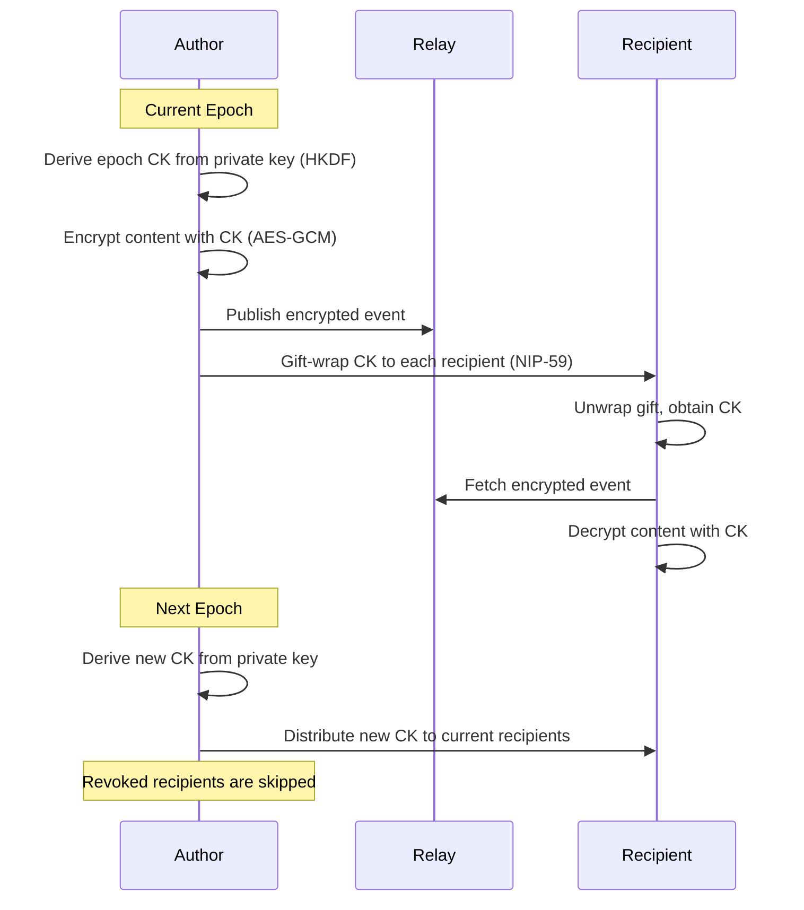

NIP-XX
======

Epoch-Based Encrypted Content Access (Dominion)
------------------------------------------------

`draft` `optional`

Authors: [decented](https://github.com/decented)

This NIP defines a mechanism for encrypting Nostr content with epoch-based Content Keys (CKs) and distributing those keys to tiered audiences via gift-wrapped events. It enables revocable, scalable content access control on standard Nostr relays without custom relay software or new cryptographic primitives.

## Motivation

Nostr content is either public or NIP-44 encrypted to specific recipients. There is no native mechanism for:

- **Audience tiers** — different groups seeing different content (family, close friends, subscribers)
- **Revocable access** — removing a recipient's ability to decrypt future content
- **Scalable encryption** — encrypting to hundreds of recipients without per-recipient encryption operations

Per-recipient NIP-44 encryption works for DMs but does not scale:

| Recipients | NIP-44 approach | This NIP |
|-----------|----------------|----------|
| 1 | 1 encryption | 1 encryption + 1 key share |
| 10 | 10 encryptions | 1 encryption + 10 key shares |
| 100 | 100 encryptions | 1 encryption + 100 key shares |
| 1,000 | 1,000 encryptions | 1 encryption + 1,000 key shares |

Content is encrypted once with an epoch-based Content Key. Only the lightweight key distribution scales with audience size.

## Overview



### Terminology

| Term | Definition |
|------|-----------|
| **Content Key (CK)** | A 256-bit AES key used to encrypt content for a specific epoch and tier |
| **Epoch** | A time period (default: one ISO 8601 week) during which a single CK is used |
| **Epoch ID** | Identifier for the epoch, ISO 8601 string. Daily: `YYYY-MM-DD`, Weekly: `YYYY-Www`, Monthly: `YYYY-MM` |
| **Vault share** | A gift-wrapped event containing a CK for a specific recipient |
| **Tier** | An audience level (e.g. `family`, `connections`) that determines CK distribution |
| **Vault config** | A self-encrypted NIP-78 event storing the author's tier memberships and settings |

## Content Key Derivation

CKs are derived deterministically using HKDF-SHA256:

```
CK = HKDF-SHA256(
    ikm  = author's 32-byte private key,
    salt = "dominion-ck-v1",
    info = "epoch:{epoch_id}:tier:{tier_name}",
    len  = 32
)
```

The salt string `dominion-ck-v1` is a fixed protocol constant. Implementations MUST use this exact value to ensure interoperability.

The `info` string includes both epoch ID and tier name, ensuring that each epoch/tier combination produces a unique key. Authors can always re-derive any CK from their private key material — no key database is needed.

### Epoch ID Format

Epoch IDs are ISO 8601 strings whose format depends on the configured length:

| Length | Format | Example | Meaning |
|--------|--------|---------|---------|
| Daily | `YYYY-MM-DD` | `2026-04-13` | 13 April 2026 |
| Weekly | `YYYY-Www` | `2026-W15` | Week 15 of 2026 (6–12 Apr) |
| Monthly | `YYYY-MM` | `2026-04` | April 2026 |

The three formats are visually distinct (the `W` prefix disambiguates weekly from monthly) and each maps to a single calendar period in UTC. Implementations SHOULD default to weekly epochs and MAY support daily or monthly per tier. Daily epochs minimise the forward-only revocation window (24h exposure); monthly epochs reduce key-rotation overhead for slow-moving tiers.

## Content Encryption

All content MUST be encrypted with AES-256-GCM using the epoch CK:

```
content = base64(iv || ciphertext || tag)
```

| Component | Size | Notes |
|-----------|------|-------|
| IV | 12 bytes | Random, unique per encryption |
| Ciphertext | Variable | AES-GCM encrypted content |
| Tag | 16 bytes | Authentication tag |

Encrypted events MUST include a `vault` tag:

```json
["vault", "<epoch_id>", "<tier>"]
```

This tells recipients which CK to use for decryption. Both epoch ID and tier are REQUIRED since CKs are derived per-epoch and per-tier.

Example encrypted event:

```json
{
  "kind": 1,
  "pubkey": "<author_pubkey>",
  "tags": [
    ["vault", "2026-W10", "family"]
  ],
  "content": "<base64(iv || ciphertext || tag)>"
}
```

The `vault` tag MAY be applied to any event kind. The kind of the event determines its semantics; the `vault` tag signals that the `content` field is Dominion-encrypted.

### Tier Name Visibility

The tier name in the `vault` tag is visible to relay operators. For privacy-sensitive deployments, implementations MAY use opaque tier identifiers (e.g. hashed or random strings) instead of human-readable names. The protocol treats tier names as opaque strings.

## Key Distribution

### Kind 30480 — Vault Share

A parameterised replaceable event containing an epoch CK for a specific recipient. This event MUST be NIP-44 encrypted to the recipient's pubkey, sealed in a kind 13 event, and gift-wrapped in a kind 1059 event (NIP-59) before publishing.

Inner event (before gift-wrapping):

```json
{
  "kind": 30480,
  "pubkey": "<author_pubkey>",
  "created_at": 1709000000,
  "tags": [
    ["d", "2026-W10:family"],
    ["p", "<recipient_pubkey>"],
    ["tier", "family"],
    ["algo", "secp256k1"],
    ["L", "dominion"],
    ["l", "share", "dominion"]
  ],
  "content": "<hex-encoded 32-byte CK>"
}
```

**Tags:**

| Tag | Status | Description |
|-----|--------|-------------|
| `d` | REQUIRED | `{epoch_id}:{tier}` — parameterised replaceable identifier |
| `p` | REQUIRED | Recipient pubkey |
| `tier` | REQUIRED | Audience tier name |
| `algo` | REQUIRED | Asymmetric algorithm used (`secp256k1`) |
| `L` | RECOMMENDED | Protocol namespace label (`dominion`) |
| `l` | RECOMMENDED | Protocol label (`share`, namespaced under `dominion`) |

The `content` field contains the CK as a 64-character lowercase hex string.

**Why a dedicated kind?** The kind 30480 event is always gift-wrapped (kind 1059) on the wire, so relays never see it directly. However, a registered kind is needed because:

1. **Parameterised replaceability** — the `d` tag (`epoch:tier`) enables newer vault shares to replace older ones for the same epoch/tier/recipient, preventing stale key accumulation
2. **Client-side filtering** — after unwrapping, clients need to distinguish vault shares from other gift-wrapped content (DMs, sealed events) by kind number
3. **Algorithm tagging** — the `algo` tag on kind 30480 enables future migration to post-quantum algorithms without breaking backward compatibility

**Example REQ filter (after gift-wrap unwrapping):**

```json
["REQ", "vault-shares", {"kinds": [30480], "authors": ["<author_pubkey>"], "#d": ["2026-W10:family"]}]
```

### Grant Scope

A grant distributes the current epoch's CK only. Implementations MUST NOT send historical epoch keys unless the author explicitly requests it. An accidental grant exposes at most one epoch of content.

### Epoch Rotation

When a new epoch begins, the author's client SHOULD:

1. Derive the new epoch CK
2. Distribute to all current tier members and individual grantees
3. Skip revoked pubkeys

## Vault Configuration

### NIP-78 (Kind 30078) — Vault Config

A NIP-78 app-specific data event storing the author's vault settings. The `content` field MUST be NIP-44 self-encrypted (to the author's own pubkey) before publishing.

```json
{
  "kind": 30078,
  "pubkey": "<author_pubkey>",
  "tags": [
    ["d", "dominion:vault-config"],
    ["encrypted", "nip44"],
    ["algo", "secp256k1"],
    ["L", "dominion"],
    ["l", "config", "dominion"]
  ],
  "content": "<NIP-44 self-encrypted JSON>"
}
```

**Decrypted payload:**

```json
{
  "tiers": {
    "family": ["<pubkey1>", "<pubkey2>"],
    "connections": "auto",
    "close_friends": ["<pubkey3>"]
  },
  "individualGrants": [
    {
      "pubkey": "<pubkey5>",
      "label": "Tutor",
      "grantedAt": 1709000000
    }
  ],
  "revokedPubkeys": ["<pubkey6>"],
  "epochConfig": {
    "family": "monthly",
    "connections": "weekly"
  }
}
```

**Fields:**

| Field | Type | Status | Description |
|-------|------|--------|-------------|
| `tiers` | Object | REQUIRED | Maps tier names to member pubkey arrays. `"auto"` indicates the tier is derived from the author's follow list (kind 3 contacts). |
| `individualGrants` | Array | REQUIRED | One-off grants to specific pubkeys, independent of tiers. |
| `revokedPubkeys` | Array | REQUIRED | Pubkeys to skip during CK distribution. |
| `epochConfig` | Object | OPTIONAL | Per-tier epoch length. Values: `"daily"`, `"weekly"`, `"monthly"`. |

Tier memberships are private — stored as self-encrypted data, not published via NIP-51 lists. This protects the author's social graph.

## Audience Tiers

| Tier | Who receives CK | Distribution |
|------|-----------------|-------------|
| Public | Everyone | No encryption needed — standard plaintext event |
| Connections | Mutual follows or curated list | Auto-distribute on epoch rotation |
| Close friends | Curated list | Auto-distribute on epoch rotation |
| Family | Explicitly managed list | Auto-distribute on epoch rotation |
| Private | Self only | No distribution — author-only |

Implementations MAY define custom tier names. The protocol treats tier names as opaque strings.

### Individual Grants

Independent of tiers. An author MAY grant CK access to any specific pubkey via `individualGrants` in the vault config.

## Revocation

Revocation is forward-only: stop distributing CKs for new epochs to the revoked recipient.

| Epoch length | Max exposure after revocation |
|-------------|-------------------------------|
| Daily | 24 hours |
| Weekly | 7 days |
| Monthly | 30 days |

The revoked recipient retains any CKs they already received. Content from those epochs remains accessible. This is the same model used by Signal, WhatsApp, and Matrix for group key management.

Revoked pubkeys are tracked in the vault config. During epoch rotation, the distribution loop MUST skip any pubkey in `revokedPubkeys`.

## Metadata Privacy

Dominion splits knowledge across different entities:

| Entity | Sees | Does NOT see |
|--------|------|-------------|
| Content relay | Author pubkey, ciphertext, `vault` tag | Recipients (no `p` tags on content) |
| Gift-wrap relay | Outer gift-wrap metadata | Inner content, CK, tier info |
| Recipient | CK, decrypted content | Other recipients' CKs |

Content events contain no recipient information. Recipients are managed entirely through the separate gift-wrap channel.

## Expiration

Implementations MAY use NIP-40 `expiration` tags on outer gift-wrap events to facilitate relay cleanup of expired epoch shares. The inner kind 30480 event SHOULD NOT carry an expiration tag, as it is never seen by relays directly.

## Relationship to Existing NIPs

| NIP | How This NIP Uses It |
|-----|---------------------|
| NIP-01 | Vault-encrypted events are standard Nostr events on any NIP-01 relay |
| NIP-44 | CK shares are NIP-44 encrypted to recipients; vault config is NIP-44 self-encrypted |
| NIP-59 | CK distribution uses gift-wrapped events for metadata privacy |
| NIP-78 | Vault config is stored as NIP-78 app-specific data (kind 30078) |

### Why Not NIP-44 Direct Encryption?

NIP-44 encrypts content to a single recipient. Encrypting to N recipients requires N separate NIP-44 operations per event. This NIP encrypts content once with an epoch CK and distributes the lightweight key separately.

### Why Not NIP-EE / Marmot (MLS)?

NIP-EE (superseded by the Marmot Protocol) uses MLS ratchet trees for secure group messaging with forward secrecy and post-compromise security. It is designed for chat — all group members are equal, there are no audience tiers, and clients must maintain ratchet tree state. This NIP is designed for content access control — audience tiers, stateless CK derivation, and one-to-many content encryption. The two are complementary.

### Why Not NIP-29 Relay-Based Groups?

NIP-29 delegates access control to relay policy enforcement — the relay decides who can read. This NIP uses cryptographic enforcement — only CK holders can decrypt, regardless of which relay stores the event. NIP-29 also requires custom relay software. The two are complementary.

### Why Not NIP-51 Lists for Tier Membership?

NIP-51 lists are visible to relay operators. Tier memberships (who is in your "family" or "close friends") are private — stored as NIP-44 self-encrypted data in the vault config.

### Why Not PR #2156 (Exclusive/Paywall Content)?

PR #2156 defines relay-enforced whitelist access with membership events and tier tags. It relies entirely on relay trust (NIP-42 AUTH) — the relay decides who can read. This NIP uses cryptographic enforcement — only CK holders can decrypt, regardless of relay behaviour. The two approaches are complementary: relay-enforced gating provides a fast first layer, cryptographic gating provides guarantees.

### Why Not PR #2258 (Dual Encryption / ECDH Delegated Access)?

PR #2258 defines publisher-level and recipient-level encryption tiers using ECDH-derived keys, targeting healthcare and enterprise use cases. It distributes pre-computed shared secrets via encrypted grant events. However, it has no epoch-based key rotation (revocation requires full keypair rotation), no HKDF content key derivation (keys are ECDH-derived), and no Shamir recovery. This NIP's epoch model provides time-bounded forward secrecy without keypair rotation.

### Why Not PR #2207 (Friends-Only Notes)?

PR #2207 encrypts notes with a symmetric ViewKey distributed via gift wrap, with named circles for audience segmentation. The critical difference is that PR #2207's ViewKey is static: if a single ViewKey is compromised, all past and future content encrypted with that ViewKey is exposed. Dominion's epoch CKs are time-bounded -- a compromised CK exposes only that epoch's content. Beyond that, PR #2207 lacks HKDF derivation (keys are random, not deterministic), per-tier key isolation, and revocation semantics. This NIP adds time-bounded keys and deterministic derivation on top of a similar distribution model.

### Why Not nip4e (PR #1647)?

nip4e proposes decoupling encryption keys from identity keys. Dominion intentionally derives CKs from the author's private key via HKDF so that derivation is stateless -- no separate key management infrastructure is needed. If nip4e merges, Dominion could derive CKs from a nip4e encryption key instead of the Nostr identity key, with no structural changes to the epoch or distribution model.

### Why Not NIP-112 (PR #580)?

NIP-112 (Encrypted Group Events) uses shared-secret group encryption with key rotation, targeting group chat where all members are equal participants. Dominion targets a different problem shape: content access control with audience tiers, one-to-many broadcast, and per-tier key isolation. Group chat requires bidirectional communication between equal peers; content access control requires unidirectional broadcast from an author to tiered audiences.

## New Event Kinds and Tags

| Element | Type | Description |
|---------|------|-------------|
| Kind 30480 | Parameterised replaceable | Vault share — epoch CK for a specific recipient |
| `["vault", "<epoch_id>", "<tier>"]` | Content event tag | Signals Dominion encryption on any event kind |
| `["algo", "<algorithm>"]` | Protocol event tag | Asymmetric algorithm identifier (default: `secp256k1`) |
| `["L", "dominion"]` / `["l", "...", "dominion"]` | Label tags (NIP-32) | Protocol namespace |

## Validation Rules

| ID | Rule |
|----|------|
| V-DM-01 | The `vault` tag on encrypted events MUST have exactly 3 elements: tag name, epoch_id, tier. |
| V-DM-02 | Epoch IDs MUST match one of three ISO 8601 formats: daily `YYYY-MM-DD`, weekly `YYYY-Www`, or monthly `YYYY-MM`. |
| V-DM-03 | Kind 30480 MUST include tags: `d` (format `{epoch_id}:{tier}`), `p` (recipient pubkey), `tier`, `algo`. |
| V-DM-04 | Kind 30480 `content` MUST be a 64-character lowercase hex string (32-byte CK). |
| V-DM-05 | Kind 30480 MUST be NIP-44 encrypted and NIP-59 gift-wrapped before publishing. Implementations MUST NOT publish kind 30480 events in plaintext. |
| V-DM-06 | Vault config (kind 30078 with `d` = `dominion:vault-config`) `content` MUST be NIP-44 self-encrypted. |
| V-DM-07 | Encrypted content MUST be `base64(iv \|\| ciphertext \|\| tag)` where IV is 12 bytes and tag is 16 bytes. |
| V-DM-08 | CK derivation MUST use HKDF-SHA256 with salt `dominion-ck-v1` and info `epoch:{epoch_id}:tier:{tier_name}`. |
| V-DM-09 | Revoked pubkeys in vault config MUST be skipped during epoch CK distribution. Implementations MUST NOT distribute CKs to revoked pubkeys. |
| V-DM-10 | The `d` tag on kind 30480 MUST match the format `{epoch_id}:{tier}`. Both components are REQUIRED. |

## Security Considerations

### No forward secrecy

CKs are derived from the author's private key via HKDF. If the private key is compromised, all past and future CKs for all epochs and tiers are derivable. This is a conscious trade-off for stateless derivation. High-security applications SHOULD use short epoch lengths (daily) and consider MLS-based alternatives (NIP-EE/Marmot) for forward secrecy.

### Epoch granularity vs revocation speed

Weekly epochs mean a revoked recipient can decrypt up to 7 days of content after revocation. Daily epochs reduce this window but increase distribution overhead. Applications SHOULD choose epoch length based on their threat model.

### CK caching by recipients

Recipients cache CKs locally. Once a CK is distributed, it cannot be revoked -- only future epoch CKs can be withheld. Content already decrypted cannot be "un-shown."

### Vault config as high-value target

The NIP-78 vault config contains the complete social graph (tier memberships, individual grants, revoked pubkeys). Compromise of this event reveals who is in which audience tier. It is self-encrypted but stored on relays.

### Gift-wrap relay metadata

While content relays see no recipient information, gift-wrap relays see outer envelope metadata (sender timestamp, recipient pubkey). Use multiple relays and consider timing decorrelation.

### NIP-46 signer implications

CK derivation requires access to the author's private key. NIP-46 remote signing implementations must handle HKDF derivation at the signer, not the client. The private key MUST NOT be sent to the client for local derivation.

### Key zeroisation

Implementations MUST zeroise CK byte buffers after use. JavaScript string values are immutable and cannot be erased; implementations SHOULD minimise CK string lifetimes.

## Test Vectors

### HKDF-SHA256 Derivation

| Parameter | Value |
|-----------|-------|
| IKM (private key) | `0101010101010101010101010101010101010101010101010101010101010101` (32 bytes of `0x01`) |
| Salt | `dominion-ck-v1` |
| Info | `epoch:2026-W10:tier:family` |
| Output length | 32 bytes |
| Expected CK | `<computed-hex-ck>` |

Implementations SHOULD verify their HKDF library output against this vector. The expected CK value depends on the HKDF-SHA256 implementation; compute it with a known-good library and use as a regression test.

### AES-256-GCM Round-Trip

| Parameter | Value |
|-----------|-------|
| CK | `0101010101010101010101010101010101010101010101010101010101010101` |
| Plaintext | `Hello, Dominion!` |
| IV | `000102030405060708090a0b` (12 bytes) |

Encrypt the plaintext with the CK and IV using AES-256-GCM. The output is `base64(iv \|\| ciphertext \|\| tag)`. Decrypt with the same CK and verify the plaintext round-trips.

### Invalid Event Examples

The following events MUST be rejected by conforming implementations:

**Missing `vault` tag on encrypted content:**

```json
{
  "kind": 1,
  "content": "<base64-encrypted-content>",
  "tags": []
}
```

Encrypted content with no `vault` tag is indistinguishable from plaintext. Implementations MUST NOT attempt Dominion decryption on events without a `vault` tag.

**Kind 30480 with non-hex CK content:**

```json
{
  "kind": 30480,
  "content": "not-a-hex-string",
  "tags": [["d", "2026-W10:family"], ["p", "<pubkey>"], ["tier", "family"], ["algo", "secp256k1"]]
}
```

The `content` field MUST be a 64-character lowercase hex string. Implementations MUST reject non-hex or wrong-length values.

**Kind 30480 published without gift wrap:**

```json
{
  "kind": 30480,
  "content": "<hex-ck>",
  "tags": [["d", "2026-W10:family"], ["p", "<pubkey>"], ["tier", "family"], ["algo", "secp256k1"]]
}
```

Kind 30480 events MUST NOT be published in plaintext. Implementations MUST reject any kind 30480 event received outside a NIP-59 gift wrap.

## Dependencies

| NIP | Usage |
|-----|-------|
| NIP-01 | Basic protocol flow, addressable events |
| NIP-32 | Labelling (protocol namespace tags) |
| NIP-40 | Expiration timestamps (gift-wrap cleanup) |
| NIP-44 | Versioned encrypted payloads (CK encryption, vault config self-encryption) |
| NIP-59 | Gift wrap (CK distribution privacy) |
| NIP-78 | App-specific data (vault config storage) |

## Interoperability

Any Nostr client can add decryption support with approximately 100 lines of code:

1. Gift-wrap unwrapping (NIP-59) — ~50 lines
2. AES-256-GCM decryption (WebCrypto or equivalent) — ~30 lines
3. Epoch CK caching — ~20 lines

## Limitations

| Limitation | Mitigation |
|-----------|-----------|
| Forward-only revocation | Weekly epochs cap exposure at 7 days. Same model as Signal/WhatsApp. |
| CK cached by recipient | Inherent to all E2E systems — cannot un-show a message. |
| Epoch granularity (not per-event) | Use NIP-44 directly for per-event access control. |
| Author must be online to distribute | CKs are distributed by the author's client. Offline authors delay new recipient access. |
| Key derivation requires private key | NIP-46 remote signing implementations must handle CK derivation at the signer. |

## Reference Implementation

[`dominion-protocol`](https://github.com/forgesworn/dominion) — TypeScript, MIT licence. Two-layer exports:

- `dominion-protocol` — HKDF key derivation, AES-256-GCM encryption, Shamir secret sharing, config management
- `dominion-protocol/nostr` — kind 30480 and NIP-78 event builders/parsers
