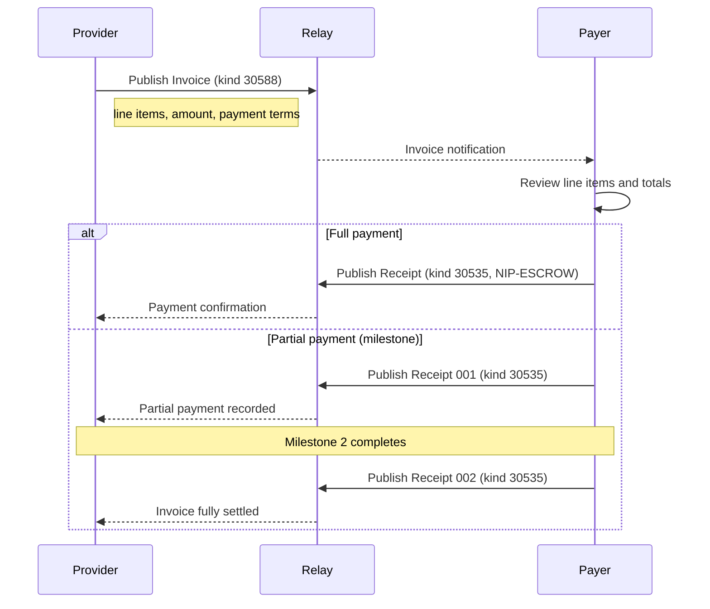

NIP-INVOICING
=============

Structured Invoicing
----------------------

`draft` `optional`

One addressable event kind for formal invoicing on Nostr. Payment recording composes with NIP-ESCROW Receipt; expense reimbursement composes with NIP-APPROVAL.

> **Standalone usability:** This NIP works independently on any Nostr application. Invoice publishing and payment tracking require only NIP-01 and NIP-ESCROW Receipt (kind 30535). Expense reimbursement optionally composes with NIP-APPROVAL and NIP-EVIDENCE.

> **Design principle:** This event records billing state; it does not execute payments. The invoice says "you owe me X". Actual money moves on whatever rail the parties choose. Payment confirmation uses NIP-ESCROW Receipt (kind 30535). Expense reimbursement uses NIP-APPROVAL Gate (kind 30570).

## Motivation

Nostr has NIP-57 for Lightning zaps and NIP-ESCROW for conditional payment coordination, but no standard mechanism for **formal invoicing**. Many real-world transactions require structured billing:

- **Freelance invoicing** -- a designer completes a project and issues an invoice with line items for design, revisions, and stock assets, with `net_14` payment terms
- **Marketplace billing** -- a seller ships goods and issues an invoice with itemised products, shipping, and tax
- **Milestone payments** -- a construction project requires multiple partial payments against a single invoice as work progresses
- **Expense reimbursement** -- a contractor purchases materials on behalf of a client and submits an expense claim via NIP-APPROVAL with receipt evidence
- **P2P commerce** -- any peer-to-peer transaction where one party needs to formally request payment with a structured breakdown

Without a standard, each invoicing application invents its own format. NIP-INVOICING provides a minimal, composable primitive that any Nostr application can adopt for structured billing.

## Relationship to Existing NIPs

- **NIP-QUOTE (kind 30530):** Quotes propose prices before work begins; invoices bill for completed work. A quote says "this will cost X"; an invoice says "you owe X for work delivered." They represent distinct lifecycle moments and both are needed.
- **NIP-ESCROW Receipt (kind 30535):** Invoice payments use Receipt events with an `e` tag referencing the invoice event. This supports partial payments via multiple Receipts against the same invoice. See [Composing with NIP-ESCROW Receipt](#composing-with-nip-escrow-receipt).
- **NIP-APPROVAL (kinds 30570-30571):** Expense reimbursement uses Approval Gates with expense line items and receipt evidence. The approver responds with an Approval Response. See [Composing with NIP-APPROVAL](#composing-with-nip-approval).
- **NIP-EVIDENCE (kind 30578):** Receipt documentation for expense claims uses Evidence records. Expense Approval Gates reference Evidence events via `e` tags.
- **NIP-57 (Zaps):** NIP-57 handles Lightning zap receipts for tips and donations. NIP-INVOICING handles structured billing with line items, payment terms, and partial payments. They serve different use cases: zaps are spontaneous one-click payments; invoices are formal requests with itemised breakdowns.
- **NIP-69 (Peer-to-Peer Order Events):** NIP-69 defines buy/sell order matching for marketplaces. NIP-INVOICING handles the billing step after a transaction is agreed. An invoice MAY reference a NIP-69 order event via its `e` tag, recording the formal payment request for a matched order.

## Kinds

| kind  | description |
| ----- | ----------- |
| 30588 | Invoice     |

Kind 30588 is an addressable event (NIP-01).

---

## Invoice (`kind:30588`)

Published by a provider (seller, freelancer, contractor) as a formal request for payment. An invoice contains one or more line items, each specifying a description, quantity, unit price, and tax amount. The invoice total is carried in the `amount` tag and MUST equal the sum of all line item totals (quantity x unit_price + tax per item), minus any `discount`.

Invoices are addressable; a provider can update an invoice by republishing with the same `d` tag (e.g. to revise line items after a recipient disputes the original).

```json
{
  "kind": 30588,
  "pubkey": "<provider-hex-pubkey>",
  "created_at": 1709740800,
  "tags": [
    ["d", "INV-2026-0042"],
    ["t", "invoice"],
    ["e", "<originating-event-id>", "wss://relay.example.com"],
    ["invoice_number", "INV-2026-0042"],
    ["amount", "27800"],
    ["currency", "GBP"],
    ["alt", "Invoice INV-2026-0042: 27800 GBP"],
    ["line_item", "Logo design, base fee", "1", "20000", "4000"],
    ["line_item", "Two revision rounds", "2", "1500", "600"],
    ["line_item", "Stock image licence", "1", "200", "0"],
    ["p", "<requester-hex-pubkey>"],
    ["payment_terms", "net_14"],
    ["due_date", "1710950400"],
    ["tax_rate", "20"],
    ["subtotal", "23200"],
    ["tax_total", "4600"]
  ],
  "content": "",
  "id": "<32-byte-hex>",
  "sig": "<64-byte-hex>"
}
```

Tags:

* `d` (REQUIRED): Addressable event identifier. RECOMMENDED format: a human-readable invoice number (e.g. `INV-2026-0042`) or an application-specific identifier.
* `t` (REQUIRED): Protocol family marker. MUST be `"invoice"`.
* `e` (RECOMMENDED): References the originating event -- a NIP-15 marketplace order, a NIP-99 classified listing, a service agreement, or any application-specific event. Invoices for work agreed off-platform MAY omit the `e` tag.
* `invoice_number` (REQUIRED): Human-readable sequential invoice identifier for the provider's accounting records. MUST be a non-empty string.
* `amount` (REQUIRED): Total invoice amount in smallest currency unit (pence for GBP, cents for USD, satoshis for SAT).
* `currency` (REQUIRED): ISO 4217 currency code or cryptocurrency code (e.g. `GBP`, `USD`, `EUR`, `SAT`, `BTC`).
* `line_item` (REQUIRED, multiple): Repeatable -- one tag per billable entry. Format: `["line_item", "<description>", "<quantity>", "<unit_price>", "<tax>"]`. See [Line Item Format](#line-item-format) below.
* `p` (RECOMMENDED): Invoice recipient's hex pubkey.
* `payment_terms` (RECOMMENDED): Payment terms code (see [Payment Terms Codes](#payment-terms-codes) below).
* `due_date` (RECOMMENDED): Payment due date as a Unix timestamp.
* `tax_rate` (OPTIONAL): Applicable tax rate as a percentage string (e.g. `"20"` for 20%).
* `ref` (OPTIONAL): External business reference (e.g. purchase order number, project code).
* `subtotal` (OPTIONAL): Pre-tax subtotal in smallest currency unit.
* `tax_total` (OPTIONAL): Total tax amount in smallest currency unit.
* `discount` (OPTIONAL): Discount amount in smallest currency unit.
* `discount_reason` (OPTIONAL): Reason for discount (e.g. `"early_payment"`, `"loyalty"`).
* `notes` (OPTIONAL): Additional invoice notes.
* `expiration` (OPTIONAL): Invoice validity period -- Unix timestamp. Clients SHOULD use NIP-40 `expiration` for relay-level enforcement.

**Content:** Empty string or NIP-44 encrypted JSON with extended invoice details such as provider business address, recipient billing address, bank details, or regulatory information.

### Line Item Format

Each `line_item` tag is a structured multi-value tag array with positional elements:

```
["line_item", "<description>", "<quantity>", "<unit_price>", "<tax>"]
```

| Position | Field         | Required | Description                                                      |
|----------|---------------|----------|------------------------------------------------------------------|
| 1        | `description` | Yes      | Human-readable description of the work or item                   |
| 2        | `quantity`    | Yes      | Number of units (integer or decimal string)                      |
| 3        | `unit_price`  | Yes      | Price per unit in smallest currency unit                         |
| 4        | `tax`         | No       | Tax amount for this line item in smallest currency unit (default: `"0"`) |

### Payment Terms Codes

| Code              | Description                                      |
|-------------------|--------------------------------------------------|
| `due_on_receipt`  | Payment due immediately upon invoice receipt      |
| `net_7`           | Payment due within 7 days                         |
| `net_14`          | Payment due within 14 days                        |
| `net_30`          | Payment due within 30 days                        |
| `net_60`          | Payment due within 60 days                        |
| `net_90`          | Payment due within 90 days                        |
| `milestone`       | Payment due upon milestone completion             |
| `custom`          | Custom terms (details in content)                 |

### Tag Reference

| Tag              | Required | Multiple | Description                                |
|------------------|----------|----------|--------------------------------------------|
| `d`              | MUST     | No       | Addressable event identifier               |
| `t`              | MUST     | No       | Protocol family marker                     |
| `e`              | SHOULD   | No       | Reference to originating event             |
| `invoice_number` | MUST     | No       | Human-readable invoice identifier          |
| `amount`         | MUST     | No       | Total invoice amount (smallest unit)       |
| `currency`       | MUST     | No       | Currency code                              |
| `line_item`      | MUST     | Yes      | Itemised billable entry (positional array)  |
| `p`              | SHOULD   | No       | Invoice recipient pubkey                   |
| `payment_terms`  | SHOULD   | No       | Payment terms code                         |
| `due_date`       | SHOULD   | No       | Payment due date (Unix timestamp)          |
| `tax_rate`       | MAY      | No       | Tax rate percentage                        |
| `ref`            | MAY      | No       | External business reference                |
| `subtotal`       | MAY      | No       | Pre-tax subtotal                           |
| `tax_total`      | MAY      | No       | Total tax amount                           |
| `discount`       | MAY      | No       | Discount amount                            |
| `discount_reason`| MAY      | No       | Reason for discount                        |
| `notes`          | MAY      | No       | Additional invoice notes                   |
| `expiration`     | MAY      | No       | Invoice validity period                    |

### REQ Filters

Discover invoices addressed to a specific recipient:

```json
{"kinds": [30588], "#p": ["<recipient-hex-pubkey>"]}
```

Discover all invoices published by a specific provider:

```json
{"kinds": [30588], "authors": ["<provider-hex-pubkey>"]}
```

Discover a specific invoice by its `d` tag:

```json
{"kinds": [30588], "#d": ["INV-2026-0042"], "authors": ["<provider-hex-pubkey>"]}
```

> **Note:** Tags such as `invoice_number`, `payment_terms`, `line_item`, and `tax_rate` are multi-letter tags. Standard relays index only single-letter tags (`d`, `e`, `p`, `t`). Discovery SHOULD use `kinds`, `authors`, `#p`, and `#d` filters as shown above. Multi-letter tag values are available after fetching the event and SHOULD be applied as client-side filters.

---

## Composing with NIP-ESCROW Receipt

Invoice payments are recorded using NIP-ESCROW Payment Receipt (kind 30535) with an `e` tag referencing the invoice event. An invoice payment IS a payment receipt. The Receipt already carries `payer`, `payee`, `amount`, `currency`, `trust_model`, and `settlement_proof`. No new kind is needed.

Multiple Receipts MAY reference the same invoice for partial payments. The outstanding balance is calculated as:

```
outstanding = invoice.amount - sum(all kind:30535 amounts referencing this invoice)
```

Clients SHOULD display the outstanding balance alongside the invoice. The sum of all Receipt amounts for an invoice MUST NOT exceed the invoice `amount`.

### Full Payment Example

A payer records full payment of invoice INV-2026-0042 via Lightning:

```json
{
  "kind": 30535,
  "pubkey": "<payer-hex-pubkey>",
  "created_at": 1709740800,
  "tags": [
    ["d", "INV-2026-0042:receipt"],
    ["alt", "Payment receipt for invoice INV-2026-0042: 27800 GBP"],
    ["e", "<invoice-event-id>", "wss://relay.example.com"],
    ["payer", "<payer-hex-pubkey>"],
    ["payee", "<provider-hex-pubkey>"],
    ["amount", "27800"],
    ["currency", "GBP"],
    ["trust_model", "direct"],
    ["settlement_proof", "0123456789abcdef0123456789abcdef0123456789abcdef0123456789abcdef"]
  ],
  "content": "",
  "id": "<32-byte-hex>",
  "sig": "<64-byte-hex>"
}
```

The `e` tag references the Kind 30588 invoice event ID. The `d` tag RECOMMENDED format for invoice receipts is `<invoice_d_tag>:receipt` for full payments, or `<invoice_d_tag>:receipt:<sequence>` for partial payments.

### Partial Payment Example (Milestone-Based)

First milestone payment of 50000 pence against a larger invoice, paid by bank transfer:

```json
{
  "kind": 30535,
  "pubkey": "<payer-hex-pubkey>",
  "created_at": 1709740800,
  "tags": [
    ["d", "INV-2026-0099:receipt:001"],
    ["alt", "Partial payment receipt for invoice INV-2026-0099: 50000 GBP (milestone 1)"],
    ["e", "<invoice-event-id>", "wss://relay.example.com"],
    ["payer", "<payer-hex-pubkey>"],
    ["payee", "<provider-hex-pubkey>"],
    ["amount", "50000"],
    ["currency", "GBP"],
    ["trust_model", "direct"],
    ["settlement_proof", "BACS-REF-20260215-001"]
  ],
  "content": "",
  "id": "<32-byte-hex>",
  "sig": "<64-byte-hex>"
}
```

Second milestone payment completing the invoice:

```json
{
  "kind": 30535,
  "pubkey": "<payer-hex-pubkey>",
  "created_at": 1709827200,
  "tags": [
    ["d", "INV-2026-0099:receipt:002"],
    ["alt", "Partial payment receipt for invoice INV-2026-0099: 50000 GBP (milestone 2)"],
    ["e", "<invoice-event-id>", "wss://relay.example.com"],
    ["payer", "<payer-hex-pubkey>"],
    ["payee", "<provider-hex-pubkey>"],
    ["amount", "50000"],
    ["currency", "GBP"],
    ["trust_model", "direct"],
    ["settlement_proof", "BACS-REF-20260301-002"]
  ],
  "content": "",
  "id": "<32-byte-hex>",
  "sig": "<64-byte-hex>"
}
```

### Discovery

Clients discover invoice payments by querying for kind 30535 events that reference the invoice event ID:

```json
{"kinds": [30535], "#e": ["<invoice-event-id>"]}
```

---

## Composing with NIP-APPROVAL

Expense reimbursement uses NIP-APPROVAL Gate (kind 30570) with expense-specific tags. A reimbursement request IS an approval request: the requester creates an Approval Gate with `line_item` tags (same format as Invoice), `e` tags linking to NIP-EVIDENCE records for receipts, and the approver responds with an Approval Response (kind 30571).

### Expense Approval Gate Example

A freelance photographer submits an expense claim for costs incurred during a commissioned shoot:

```json
{
  "kind": 30570,
  "pubkey": "<provider-hex-pubkey>",
  "created_at": 1709740800,
  "tags": [
    ["d", "EXP-2026-0042:gate:expense_claim"],
    ["t", "approval-gate"],
    ["alt", "Expense approval gate: 8400 GBP for design project"],
    ["gate_type", "approval"],
    ["gate_authority", "<client-hex-pubkey>"],
    ["gate_status", "pending"],
    ["e", "<originating-event-id>", "wss://relay.example.com"],
    ["amount", "8400"],
    ["currency", "GBP"],
    ["line_item", "Stock images, Shutterstock licence x3", "1", "4500", "0"],
    ["line_item", "Express courier, prototype delivery", "1", "1200", "0"],
    ["line_item", "Adobe Illustrator monthly licence", "1", "2700", "0"],
    ["e", "<evidence-event-id-1>", "wss://relay.example.com"],
    ["e", "<evidence-event-id-2>", "wss://relay.example.com"],
    ["expiration", "1710950400"]
  ],
  "content": "Expense claim for design project. Receipts attached as evidence records.",
  "id": "<32-byte-hex>",
  "sig": "<64-byte-hex>"
}
```

Key conventions for expense Approval Gates:

* `gate_type` SHOULD be `"approval"`.
* `amount` and `currency` tags carry the total reimbursement amount.
* `line_item` tags use the same positional format as Invoice line items: `["line_item", "<description>", "<quantity>", "<unit_price>", "<tax>"]`. For expenses, the `quantity` is typically `"1"` and `unit_price` is the expense amount.
* `e` tags reference both the originating event (the transaction or agreement) and NIP-EVIDENCE records (kind 30578) for receipt documentation. Clients distinguish evidence references by resolving the referenced events.
* The `amount` MUST equal the sum of all `line_item` amounts.

### Expense Approval Response

The client approves the expense claim:

```json
{
  "kind": 30571,
  "pubkey": "<client-hex-pubkey>",
  "created_at": 1709827200,
  "tags": [
    ["d", "EXP-2026-0042:gate:expense_claim:response:<client-hex-pubkey>"],
    ["t", "approval-response"],
    ["alt", "Expense approval response: approved for reimbursement"],
    ["e", "<gate-event-id>", "wss://relay.example.com"],
    ["decision", "approved"],
    ["p", "<provider-hex-pubkey>"]
  ],
  "content": "All receipts verified. Approved for reimbursement.",
  "id": "<32-byte-hex>",
  "sig": "<64-byte-hex>"
}
```

Once approved, the client records reimbursement using a NIP-ESCROW Receipt (kind 30535) referencing the Approval Gate event.

### Expense Categories

| Category         | Description                                   |
|------------------|-----------------------------------------------|
| `materials`      | Physical materials and supplies                |
| `travel`         | Travel and transport costs                     |
| `equipment`      | Equipment hire or purchase                     |
| `subcontractor`  | Sub-contractor or specialist fees              |
| `permits`        | Permits, licences, and regulatory fees         |
| `accommodation`  | Accommodation costs                            |
| `meals`          | Meal and sustenance costs                      |
| `other`          | Other costs (describe in description field)    |

---

## Protocol Flow

### Overview



### Happy Path: Invoice, Review, Pay

```
  Provider                       Relay                     Requester
      |                            |                            |
      |-- kind:30588 Invoice ----->|                            |
      |  (INV-2026-0042)           |                            |
      |                            |------- notification ------>|
      |                            |                            |
      |                            |  Requester reviews line    |
      |                            |  items and totals          |
      |                            |                            |
      |                            |<-- kind:30535 Receipt -----|
      |<------ notification -------|    (full amount)           |
      |                            |                            |
      |  Provider confirms receipt |                            |
      |                            |                            |
```

### Partial Payment Flow (Milestone-Based)

```
  Provider                       Relay                     Requester
      |                            |                            |
      |-- kind:30588 Invoice ----->|                            |
      |  (payment_terms: milestone)|                            |
      |                            |------- notification ------>|
      |                            |                            |
      |                            |<-- kind:30535 Receipt -----|
      |<------ notification -------|    (amount: 50000,         |
      |                            |     d: INV:receipt:001)    |
      |                            |                            |
      |           ... milestone 2 completes ...                 |
      |                            |                            |
      |                            |<-- kind:30535 Receipt -----|
      |<------ notification -------|    (amount: 50000,         |
      |                            |     d: INV:receipt:002)    |
      |                            |                            |
      |  Invoice fully settled     |                            |
      |  (2 receipts)              |                            |
      |                            |                            |
```

### Invoice Revision

```
  Provider                       Relay                     Requester
      |                            |                            |
      |-- kind:30588 Invoice v1 -->|                            |
      |                            |------- notification ------>|
      |                            |                            |
      |                            |  Requester disputes line   |
      |                            |  items (out of band)       |
      |                            |                            |
      |-- kind:30588 Invoice v2 -->|  (replaces v1; same d     |
      |   (revised line items)     |   tag, updated content)    |
      |                            |------- notification ------>|
      |                            |                            |
      |                            |<-- kind:30535 Receipt -----|
      |<------ notification -------|    (full amount)           |
      |                            |                            |
```

### Expense Reimbursement with Evidence

```
  Provider                       Relay                     Client
      |                            |                            |
      |  Provider incurs costs     |                            |
      |  during work               |                            |
      |                            |                            |
      |-- kind:30578 Evidence ---->|  (receipt photos, scans)   |
      |                            |                            |
      |-- kind:30570 Approval ---->|                            |
      |   Gate (with line_items    |                            |
      |   and evidence refs)       |------- notification ------>|
      |                            |                            |
      |                            |  Client reviews expenses   |
      |                            |  and evidence              |
      |                            |                            |
      |                            |<-- kind:30571 Response ----|
      |<------ notification -------|    (decision: approved)    |
      |                            |                            |
      |                            |<-- kind:30535 Receipt -----|
      |<------ notification -------|    (reimbursement)         |
      |                            |                            |
```

---

## Validation Rules

All validation rules for NIP-INVOICING events. Implementations MUST enforce these rules when processing invoicing events.

| Rule      | Event Kind(s)              | Requirement                                                                                |
|-----------|----------------------------|--------------------------------------------------------------------------------------------|
| V-INV-01  | 30588 (Invoice)            | MUST include at least one `line_item` tag                                                  |
| V-INV-02  | 30588 (Invoice)            | Each `line_item` tag MUST contain at least 4 elements: tag name, description, quantity, and unit_price |
| V-INV-03  | 30588 (Invoice)            | `amount` MUST equal the sum of all line item totals (quantity x unit_price + tax) minus `discount` |
| V-INV-04  | 30588 (Invoice)            | `invoice_number` MUST be a non-empty string                                                |
| V-INV-05  | 30588 (Invoice)            | SHOULD reference an originating event via `e` tag. Invoices for work agreed off-platform MAY omit it |
| V-INV-06  | 30588 (Invoice)            | `payment_terms` value MUST be one of the defined codes when present                        |
| V-INV-07  | 30588 (Invoice)            | `due_date` MUST be a valid future Unix timestamp when present                              |
| V-INV-08  | 30535 (Receipt for invoice)| `e` tag MUST reference a valid Kind 30588 invoice event                                    |
| V-INV-09  | 30535 (Receipt for invoice)| `amount` MUST be a positive integer                                                        |
| V-INV-10  | 30535 (Receipt for invoice)| Sum of all Receipt amounts for an invoice MUST NOT exceed the invoice `amount`             |

---

## Test Vectors

All examples use timestamp `1709740800` (2024-03-06T12:00:00Z) and placeholder hex pubkeys.

### Kind 30588 -- Invoice

```json
{
  "kind": 30588,
  "pubkey": "a1b2c3d4e5f6a1b2c3d4e5f6a1b2c3d4e5f6a1b2c3d4e5f6a1b2c3d4e5f6a1b2",
  "created_at": 1709740800,
  "tags": [
    ["d", "INV-2026-0042"],
    ["t", "invoice"],
    ["alt", "Invoice INV-2026-0042: 27800 GBP"],
    ["e", "dddd4444eeee5555ffff6666aaaa1111bbbb2222cccc3333dddd4444eeee5555"],
    ["invoice_number", "INV-2026-0042"],
    ["amount", "27800"],
    ["currency", "GBP"],
    ["line_item", "Logo design, base fee", "1", "20000", "4000"],
    ["line_item", "Two revision rounds", "2", "1500", "600"],
    ["line_item", "Stock image licence", "1", "200", "0"],
    ["p", "b2c3d4e5f6a1b2c3d4e5f6a1b2c3d4e5f6a1b2c3d4e5f6a1b2c3d4e5f6a1b2c3"],
    ["payment_terms", "net_14"],
    ["due_date", "1710950400"],
    ["tax_rate", "20"],
    ["subtotal", "23200"],
    ["tax_total", "4600"]
  ],
  "content": "",
  "id": "<32-byte-hex>",
  "sig": "<64-byte-hex>"
}
```

**Calculation check:**
- Line 1: 1 x 20000 + 4000 = 24000
- Line 2: 2 x 1500 + 600 = 3600
- Line 3: 1 x 200 + 0 = 200
- Total: 24000 + 3600 + 200 = 27800

### Kind 30535 -- Invoice Payment (Full, via Receipt)

```json
{
  "kind": 30535,
  "pubkey": "b2c3d4e5f6a1b2c3d4e5f6a1b2c3d4e5f6a1b2c3d4e5f6a1b2c3d4e5f6a1b2c3",
  "created_at": 1709740800,
  "tags": [
    ["d", "INV-2026-0042:receipt"],
    ["alt", "Payment receipt for invoice INV-2026-0042: 27800 GBP"],
    ["e", "aaaa1111bbbb2222cccc3333dddd4444eeee5555ffff6666aaaa1111bbbb2222"],
    ["payer", "b2c3d4e5f6a1b2c3d4e5f6a1b2c3d4e5f6a1b2c3d4e5f6a1b2c3d4e5f6a1b2c3"],
    ["payee", "a1b2c3d4e5f6a1b2c3d4e5f6a1b2c3d4e5f6a1b2c3d4e5f6a1b2c3d4e5f6a1b2"],
    ["amount", "27800"],
    ["currency", "GBP"],
    ["trust_model", "direct"],
    ["settlement_proof", "0123456789abcdef0123456789abcdef0123456789abcdef0123456789abcdef"]
  ],
  "content": "",
  "id": "<32-byte-hex>",
  "sig": "<64-byte-hex>"
}
```

### Kind 30535 -- Invoice Payment (Partial, Bank Transfer, via Receipt)

```json
{
  "kind": 30535,
  "pubkey": "b2c3d4e5f6a1b2c3d4e5f6a1b2c3d4e5f6a1b2c3d4e5f6a1b2c3d4e5f6a1b2c3",
  "created_at": 1709740800,
  "tags": [
    ["d", "INV-2026-0099:receipt:001"],
    ["alt", "Partial payment receipt for invoice INV-2026-0099: 50000 GBP"],
    ["e", "aaaa1111bbbb2222cccc3333dddd4444eeee5555ffff6666aaaa1111bbbb2222"],
    ["payer", "b2c3d4e5f6a1b2c3d4e5f6a1b2c3d4e5f6a1b2c3d4e5f6a1b2c3d4e5f6a1b2c3"],
    ["payee", "a1b2c3d4e5f6a1b2c3d4e5f6a1b2c3d4e5f6a1b2c3d4e5f6a1b2c3d4e5f6a1b2"],
    ["amount", "50000"],
    ["currency", "GBP"],
    ["trust_model", "direct"],
    ["settlement_proof", "BACS-REF-20260215-001"]
  ],
  "content": "",
  "id": "<32-byte-hex>",
  "sig": "<64-byte-hex>"
}
```

### Kind 30570 -- Expense Approval Gate

```json
{
  "kind": 30570,
  "pubkey": "a1b2c3d4e5f6a1b2c3d4e5f6a1b2c3d4e5f6a1b2c3d4e5f6a1b2c3d4e5f6a1b2",
  "created_at": 1709740800,
  "tags": [
    ["d", "EXP-2026-0042:gate:expense_claim"],
    ["t", "approval-gate"],
    ["alt", "Expense approval gate: 8400 GBP for design project"],
    ["gate_type", "approval"],
    ["gate_authority", "b2c3d4e5f6a1b2c3d4e5f6a1b2c3d4e5f6a1b2c3d4e5f6a1b2c3d4e5f6a1b2c3"],
    ["gate_status", "pending"],
    ["e", "dddd4444eeee5555ffff6666aaaa1111bbbb2222cccc3333dddd4444eeee5555"],
    ["amount", "8400"],
    ["currency", "GBP"],
    ["line_item", "Stock images, Shutterstock licence x3", "1", "4500", "0"],
    ["line_item", "Express courier, prototype delivery", "1", "1200", "0"],
    ["line_item", "Adobe Illustrator monthly licence", "1", "2700", "0"],
    ["e", "eeee1111ffff2222aaaa3333bbbb4444cccc5555dddd6666eeee1111ffff2222"],
    ["e", "ffff2222aaaa3333bbbb4444cccc5555dddd6666eeee1111ffff2222aaaa3333"],
    ["expiration", "1710950400"]
  ],
  "content": "Expense claim for design project. Receipts attached as evidence records.",
  "id": "<32-byte-hex>",
  "sig": "<64-byte-hex>"
}
```

**Calculation check:**
- Item 1: 4500
- Item 2: 1200
- Item 3: 2700
- Total: 4500 + 1200 + 2700 = 8400

---

## Security Considerations

### Invoice Fraud

Providers MUST only publish invoices for transactions they are a participant in. Clients SHOULD verify that the invoice publisher's pubkey matches a known participant in the referenced transaction. Applications MAY reject invoices from non-participants.

### Double Payment

Clients tracking invoice payments MUST maintain a running total of all Kind 30535 Receipt events referencing a given invoice. The sum of `amount` values MUST NOT exceed the invoice `amount`. Clients SHOULD warn users when a payment would exceed the outstanding balance.

### Expense Claim Manipulation

Expense Approval Gates without evidence references carry lower trust. Applications SHOULD require NIP-EVIDENCE records for expenses above a configurable threshold. The NIP-APPROVAL workflow provides a formal mechanism for recipients to review and approve or reject expense claims before reimbursement.

### Tax Calculation Integrity

The `amount` tag on Kind 30588 is the authoritative total. Clients SHOULD independently verify that line item calculations match the stated total. Discrepancies SHOULD be flagged to the recipient before payment.

### Multi-Currency Considerations

All amounts within a single invoice MUST be in the same currency (as specified by the `currency` tag). If a provider needs to bill in multiple currencies, they MUST publish separate invoices. Receipt `currency` SHOULD match the invoice currency; cross-currency payments require agreement between parties and MAY use the Receipt content field to document the exchange rate.

---

## Relay Recommendations

| Event Kind                   | Recommended Retention            | Rationale                                 |
|------------------------------|----------------------------------|-------------------------------------------|
| 30588 (Invoice)              | Long-term (application-specific) | Financial record-keeping                  |

Invoicing events are financial records. The appropriate retention period depends on the jurisdiction and application context. Applications SHOULD advise users on local record-keeping requirements. NIP-ESCROW Receipt events (kind 30535) used for invoice payments follow the retention guidance in NIP-ESCROW.

---

## Use Cases

### Freelancing and Creative Services

A graphic designer completes a branding project and publishes a Kind 30588 invoice with line items for design work, revision rounds, and stock image licences. The client pays via Lightning and records the payment with a Kind 30535 Receipt including the preimage as settlement proof.

### Marketplace Commerce

A NIP-15 marketplace seller ships goods and issues a Kind 30588 invoice referencing the NIP-15 order event. Line items cover each product, shipping, and applicable tax. The buyer records payment with a Kind 30535 Receipt.

### P2P Commerce

Two individuals agree on a transaction via Nostr DMs. The seller publishes a Kind 30588 invoice referencing the DM thread. The buyer pays and records the payment with a Kind 30535 Receipt. Both parties have a verifiable billing record.

### Construction and Milestone Payments

A builder issues a Kind 30588 invoice with `payment_terms: milestone` for a renovation project. The client makes partial payments via Kind 30535 Receipts as each milestone is completed. Both parties can track the outstanding balance at any time.

### Expense Reimbursement

A freelance photographer travelling for a commissioned shoot publishes NIP-EVIDENCE records for travel, accommodation, and equipment receipts. They then create a NIP-APPROVAL Gate (kind 30570) with expense line items and evidence references. The client reviews and approves via a Kind 30571 Response, then reimburses via a Kind 30535 Receipt.

---

## Dependencies

* [NIP-01](https://github.com/nostr-protocol/nips/blob/master/01.md): Basic protocol flow, addressable events
* [NIP-40](https://github.com/nostr-protocol/nips/blob/master/40.md): Expiration timestamps (invoice validity)
* [NIP-44](https://github.com/nostr-protocol/nips/blob/master/44.md): Versioned encrypted payloads (private invoice details)
* NIP-ESCROW: Payment Receipt (kind 30535) for recording invoice payments
* NIP-APPROVAL: Approval Gate (kind 30570) and Response (kind 30571) for expense reimbursement
* NIP-EVIDENCE: Evidence Record (kind 30578) for expense receipt documentation

## Reference Implementation

No public reference implementation exists yet. Implementors SHOULD refer to the kind definitions above.

A minimal implementation requires:

1. A Nostr client that supports addressable event publishing.
2. Invoice rendering logic -- parsing `line_item` tag arrays and computing totals for display.
3. Payment tracking -- querying Kind 30535 Receipts by `e` tag reference to the invoice event and computing outstanding balances.
4. (Optional) Expense reimbursement -- creating NIP-APPROVAL Gates with expense line items and NIP-EVIDENCE references.
