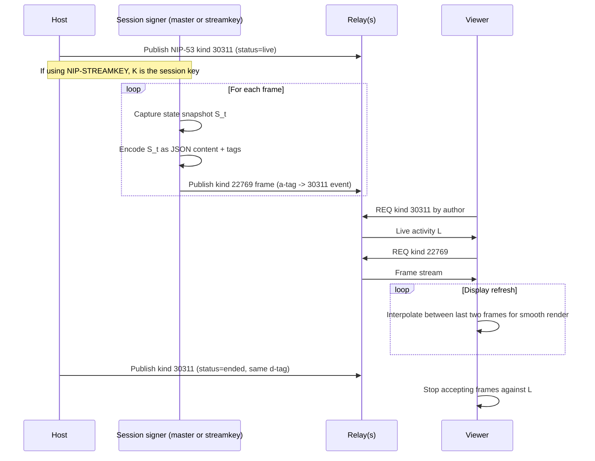

NIP-LIVEFRAME
=============

Ephemeral State Frames for Live Activities
------------------------------------------

`draft` `optional`

Authors: [ForgeSworn](https://github.com/forgesworn)

This NIP defines a convention for publishing high-frequency, ephemeral state snapshots of a live activity over Nostr relays. Kind `22769` carries a single frame: a timestamped, application-defined snapshot of a live system's state (game world, sensor reading, audio metadata, presence) tied to a [NIP-53](https://github.com/nostr-protocol/nips/blob/master/53.md) kind `30311` Live Activity. Viewers subscribe by activity reference and reconstruct a smooth real-time view by interpolating between frames.

LIVEFRAME is a wire-format and addressing convention; the per-frame payload schema is application-defined. An informative appendix sketches a worked schema for a 2D arcade game.

## Motivation

Live streaming on Nostr today maps almost exclusively to video. NIP-53 advertises a stream's existence and points spectators at an HLS or WebRTC URL hosted off-protocol. For many live activities -- turn-driven games, sensor feeds, instrument telemetry, low-bandwidth animation, async multiplayer presence -- video is the wrong substrate:

1. **State-driven activities are cheaper to stream as state.** A 2 Hz JSON snapshot of a game world is roughly two orders of magnitude smaller than the video that would render it, and the viewer renders at the local refresh rate rather than at the streamer's encode rate.
2. **Off-protocol video URLs are not addressable.** A spectator client cannot subscribe to the *stream* over relays; only to its existence. Comments, reactions, and side-channels cannot reference a moment.
3. **Off-protocol video requires infrastructure.** WHIP/RTMP ingest, HLS packaging, CDN egress, and TLS termination all sit outside the Nostr trust model. Relays are already a global pub/sub mesh that can carry a few kilobits per second per stream without strain.
4. **High-frequency telemetry already happens on relays.** Multiplayer-over-Nostr experiments, presence beacons, and live-coding sessions publish small events at 1-10 Hz today, with no shared addressing convention. LIVEFRAME codifies the pattern that has emerged.

LIVEFRAME does not replace video. Activities that are fundamentally about pixels (cameras, screen capture, traditional Twitch-style streaming) belong on WHIP/HLS infrastructure with NIP-53 surfaces. LIVEFRAME is for activities whose interesting information is *state*: positions, scores, sensor readings, presence flags, reactive metadata.

### Why not NIP-53 alone?

NIP-53 advertises that a live activity exists and points at an external streaming URL. It does not define a wire format for the activity's content. LIVEFRAME fills that gap by riding alongside the kind `30311` event: the live activity *is* the addressing root; the frames *are* the stream.

### Why not WebRTC or WHIP?

WebRTC requires signalling, ICE, STUN/TURN and a direct connection between sender and viewer. WHIP requires a media server. Neither is necessary when the payload is small JSON state at sub-display rates. Relays already provide pub/sub fan-out. The right tool for "broadcast 500 bytes every 500 ms to N spectators" is the relay mesh, not a media stack.

### Why not store-and-forward replaceable events?

Replaceable events (kinds 10000-19999) are the wrong slot: relays persist them, multiple per-frame events would either thrash the d-tag or accumulate forever. Parameterised-replaceable (30000-39999) has the same problem. The ephemeral range (20000-29999) is exactly designed for "broadcast but don't store", which is the right semantics for live wire data. Permanent replay (the equivalent of a VOD) is a separate concern best handled by an end-of-activity recording event published once at completion.

### Why not extend kind 30311 with a `frames` URL?

Pointing at a frames feed defeats the addressability win. A spectator client could not filter, react to, or interpolate frames by author/kind/tags. The frames must be first-class Nostr events to compose with the rest of the protocol.

## Specification

### Frame events

A frame is an event of kind `22769`. The event:

1. MUST include exactly one `a` tag of the form `30311:<host-pubkey>:<d-tag>` pointing at the [NIP-53](https://github.com/nostr-protocol/nips/blob/master/53.md) live activity this frame belongs to.
2. SHOULD include an `e` tag with the live activity's event id, so viewers can resolve in one relay round-trip.
3. SHOULD include a `p` tag with the host's pubkey for author-style subscriptions.
4. SHOULD include a `run_id` tag whose value identifies a run, session, or epoch within the activity. The value is application-defined and SHOULD be stable for the entire duration of the run.
5. SHOULD include a `frame_t` tag whose value is the unix-millisecond capture timestamp of the frame.
6. MAY include indexable scalar tags for state values the application wishes to make filterable (see "Indexable tag conventions" below).
7. The event's `content` SHOULD be a JSON object containing the application's full state snapshot for the frame, using the wire-format conventions in "Content encoding" below.

Frames MAY be signed by the host's master key or by a session key as defined in [NIP-STREAMKEY](./NIP-STREAMKEY.md). The latter is strongly RECOMMENDED for cadences above ~1 frame per minute.

### Cadence

There is no fixed frame rate. Implementations SHOULD publish at the lowest cadence that produces an acceptable spectator experience, typically 1-4 Hz for game state and 0.1-1 Hz for sensor telemetry. Implementations MUST NOT publish faster than relay operators tolerate (a relay's NIP-11 limits document the floor, where present).

Spectator clients SHOULD interpolate between frames on the local display refresh clock rather than rendering only on frame arrival. This decouples the visible smoothness from the wire cadence.

### Common scalar tags

The following scalar tags are common across LIVEFRAME applications. Only `run_id` and `frame_t` are part of this NIP; everything else is illustrative of the pattern applications use, not a required vocabulary. Applications SHOULD prefer short, meaningful tag names for state values they want to make filterable; they MUST NOT shadow tag names reserved by other NIPs.

| Tag | Type | Status | Use |
|-----|------|--------|-----|
| `run_id` | string | RECOMMENDED | Stable identifier for a run, session, or epoch within the activity |
| `frame_t` | unix-ms string | RECOMMENDED | Frame capture timestamp |
| `state` | enum string | OPTIONAL | E.g. `active`, `paused`, `ended` |

Example application-defined tags (informative): a game might publish `score`, `wave`, `x`, `y`, `r`, `thrust`; a sensor stream might publish `temp_c`, `pressure_hpa`, `device`; a live music set might publish `bpm`, `key`, `bar`. The choice is the application's; LIVEFRAME only specifies the envelope.

Indexable tags duplicate values from the content payload; clients SHOULD treat the content as authoritative when they conflict.

### Content encoding

The event content is a JSON object. The following conventions keep the wire small at high cadence:

1. **Schema version.** Include a top-level integer `v` field. Increment on incompatible changes; viewers SHOULD render older versions on a best-effort basis.
2. **Short keys.** Prefer single-letter object keys for frequent fields.
3. **Tuple entities.** Repeated entities (objects, units, particles) SHOULD be encoded as fixed-shape tuples (arrays) rather than objects, with the entity id in the first position. Tuple shape is application-defined and versioned by the schema version.
4. **Omit empty.** Optional arrays SHOULD be omitted when empty rather than serialised as `[]`.
5. **Bounded precision.** Coordinates SHOULD be rounded to the smallest precision that produces a visually acceptable result (typically 1 decimal place for world units at integer pixel zoom).
6. **No per-frame identifiers beyond what's needed.** The host pubkey and activity reference are already in tags.

### Composition with NIP-STREAMKEY

When the host has authorised a session key via [NIP-STREAMKEY](./NIP-STREAMKEY.md), frame events are signed by the session key and the host's master signer is involved only at start-of-activity and (optionally) at end-of-activity. Viewers MUST verify the frame's signing pubkey against the `streamkey` `p` tag in the referenced kind `30311` authorisation before treating the frame as host-attributed.

### Lifecycle

A live activity transitions:

1. **Authorisation.** Host publishes kind `30311` with `status=live` and (optionally) a `streamkey` `p` tag.
2. **Streaming.** The signing party (master or session key) publishes frame events at the chosen cadence with `a` tags referencing the activity.
3. **Termination.** Host publishes a replacement kind `30311` with `status=ended`. Frames are no longer accepted by conforming viewers.
4. **Replay (optional, out of scope).** A separate addressable event MAY be published at end-of-activity carrying a compressed recording for non-live playback. The recording format is application-defined and not specified here.

## Overview



## Filter examples

Subscribe to all frames for a known live activity:

```json
["REQ", "frames", { "kinds": [22769], "#a": ["30311:<host pubkey>:<d-tag>"] }]
```

Subscribe to a specific host's live frames across all of their current activities:

```json
["REQ", "host-live", { "kinds": [22769], "#p": ["<host pubkey>"] }]
```

Filter by application via a topic tag:

```json
["REQ", "app-live", { "kinds": [22769], "#t": ["pallasite-stream-frame"] }]
```

Filter by minimum score (indexable scalar tag):

```json
["REQ", "leaderboard-live", { "kinds": [22769], "#t": ["pallasite-stream-frame"], "limit": 200 }]
```

(Relays implementing NIP-50 search MAY extend this with content-side filtering; scalar tag matching is a relay-defined extension and not specified here.)

## Validation rules

| Rule | Condition | Action |
|------|-----------|--------|
| V-LF-01 | Frame has no `a` tag of the form `30311:<hex>:<d>` | Reject frame |
| V-LF-02 | Frame's referenced kind `30311` cannot be located | Buffer the frame for a relay-defined window; if still unresolved, discard |
| V-LF-03 | Referenced kind `30311` has most recent `status=ended` with `created_at` later than the frame's `created_at` | Reject frame |
| V-LF-04 | Frame is older than the referenced activity's `created_at` | Reject frame |
| V-LF-05 | Frame's `pubkey` matches neither the host nor any `streamkey` `p` tag in the authorisation | Reject frame |
| V-LF-06 | Frame's `content` is not a JSON object | Treat content as empty; tags-only render |
| V-LF-07 | Frame's content schema `v` is unknown to the viewer | Render best-effort from tags; do not error |

## Security and privacy considerations

**Spectator metadata.** Frame events carry the host's pubkey, location-like coordinates, and behaviour patterns. Hosts publishing LIVEFRAME consent to making this state public on the relays they post to. Applications that include personally identifying or location-sensitive content MUST surface this in their UX.

**Frame flooding.** The kind 22769 cadence is bounded only by relay policy. Hostile clients MAY attempt to flood a viewer with forged frames against a known activity. The `streamkey` verification path (V-LF-05) ensures forged frames are rejected before rendering. Viewers SHOULD additionally cap per-activity frame intake at a reasonable upper bound (e.g. 20 Hz).

**Stale activity replay.** Because kind 30311 is replaceable, a viewer that fetches an old `status=live` event before the `status=ended` replacement arrives may briefly accept frames against an expired activity. Viewers SHOULD re-resolve the activity periodically (every 30-60 seconds) and respect the freshness heuristics in NIP-STREAMKEY.

**Relay storage.** Kind 22769 is in the ephemeral range. Relays SHOULD forward frames to subscribers without persisting them. Frames are not designed to be queried after the fact; activities that need recordings publish them separately at end-of-stream.

**Relay conformance.** Relays MUST NOT strip the `a`, `e`, `p`, `run_id`, or `frame_t` tags from kind `22769` events. Conforming clients treat events missing the required `a` reference as malformed (see V-LF-01). Relays MAY apply rate limits; they SHOULD document any cap in their NIP-11 limits document where present.

**Coordinate precision and replay attacks.** Rounding coordinates discards information an attacker might otherwise use to fingerprint replay vs original. Implementations that mind this MAY add small per-frame noise on the host side; the relay layer offers no protection here.

## Worked example: Pallasite arcade frames

The following informative schema is in production use for [pallasite.app](https://pallasite.app), a Nostr-native arcade game. Other applications are encouraged to define their own schemas and follow the wire-format conventions in the body of this NIP rather than reusing this one verbatim.

### Tags

```json
["a", "30311:<host pubkey>:pallasite:<host pubkey>:1731418795000"],
["e", "<authorisation event id>"],
["p", "<host pubkey>"],
["run_id", "1731418795000"],
["t", "pallasite-stream-frame"],
["frame_t", "1731418802500"],
["x", "412.50"],
["y", "268.10"],
["r", "1.234"],
["score", "10250"],
["wave", "4"],
["thrust", "1"]
```

### Content (schema `v: 2`)

```json
{
  "v": 2,
  "a": [
    [1, 120.4, 85.2, "l", "s", 0.42],
    [2, 410.0, 232.6, "m", "i", 1.18]
  ],
  "u": [[7, 502.2, 140.0, "s"]],
  "m": [[3, 100.0, 100.0]],
  "b": [[12, 412.5, 268.1, 0]],
  "c": [[20, 305.0, 200.0, "s", ""]],
  "pu": [[31, 200.0, 150.0, "r"]],
  "e": [["ak", 120, 85]],
  "shield": 1
}
```

Tuple shapes (schema `v: 2`):

- `a` (asteroid): `[id, x, y, size, type, rot]`
- `u` (UFO): `[id, x, y, type]`
- `m` (mine): `[id, x, y]`
- `b` (bullet): `[id, x, y, isEnemy]`
- `c` (coin): `[id, x, y, kind, sourceAsteroidType]`
- `pu` (powerup): `[id, x, y, type]`
- `e` (audio event): `[code, x, y]`

Flags (presence = true): `shield`, `dead`, `paused`.

## Test vectors

Minimal valid frame (signed by either master or streamkey):

```json
{
  "kind": 22769,
  "tags": [
    ["a", "30311:abcdef0123456789abcdef0123456789abcdef0123456789abcdef0123456789:test:abcdef0123456789abcdef0123456789abcdef0123456789abcdef0123456789:1"],
    ["frame_t", "1731418802500"]
  ],
  "content": "{\"v\":2}"
}
```

Invalid frame -- V-LF-01 (no `a` tag):

```json
{
  "kind": 22769,
  "tags": [["frame_t", "1731418802500"]],
  "content": "{\"v\":2}"
}
```

Invalid frame -- V-LF-05 (signed by a pubkey not authorised in the kind 30311):

```json
{
  "pubkey": "deadbeef0000000000000000000000000000000000000000000000000000beef",
  "kind": 22769,
  "tags": [
    ["a", "30311:<host>:<d>"]
  ],
  "content": "{\"v\":2}"
}
```

## Reference implementation

[pallasite.app](https://pallasite.app) -- a Nostr-native arcade game -- has published LIVEFRAME-compatible kind 22769 events in production since 2026. Frames are emitted at 2 Hz averaging ~120 bytes on the wire; a typical 30-minute run publishes ~3,600 frames totalling ~430 kB per spectator. The wire format is the schema shown in the worked example. Source: `src/stream-session.ts` and `src/watch.ts` in the public Pallasite repository.

## Dependencies

- [NIP-01](https://github.com/nostr-protocol/nips/blob/master/01.md) -- event format, ephemeral kinds 20000-29999
- [NIP-53](https://github.com/nostr-protocol/nips/blob/master/53.md) -- Live Activities, kind 30311

## Relationship to NIP-STREAMKEY

[NIP-STREAMKEY](./NIP-STREAMKEY.md) defines the ephemeral-key delegation mechanism that makes high-cadence LIVEFRAME publishing practical without a signer round-trip per frame. The two NIPs are independent and the verification of one does not require the other, but they are designed to compose: a typical deployment publishes one kind 30311 with a `streamkey` `p` tag and then signs every kind 22769 frame with the session key.

## Relationship to NIP-101g (Golf Events)

NIP-101g defines kind `31501` "Live Scorecard" as an **addressable-replaceable** event that mutates as a golf round progresses. There is one event per round per player; each score update replaces the prior version on its `d` tag. This is the right shape for low-frequency, durable, queryable state where viewers care about the latest authoritative scorecard and per-frame history is not needed.

LIVEFRAME is the dual: **ephemeral**, high-frequency, fire-and-forget snapshots where the wire is the history and the latest frame is implicitly the current state. Per-frame interpolation produces the smooth real-time view; there is no canonical per-round artefact until end-of-activity (which the application MAY publish separately as an addressable recording event, out of scope here).

The two are complementary. A live multiplayer activity could publish a NIP-101g-style addressable scorecard for the durable record AND LIVEFRAME frames for the moment-to-moment view -- the scorecard answers "what's the score?", the frames answer "where are the players right now?". Applications SHOULD use the addressable form when latest-wins query semantics suffice and the ephemeral form when sub-second motion is the point.
