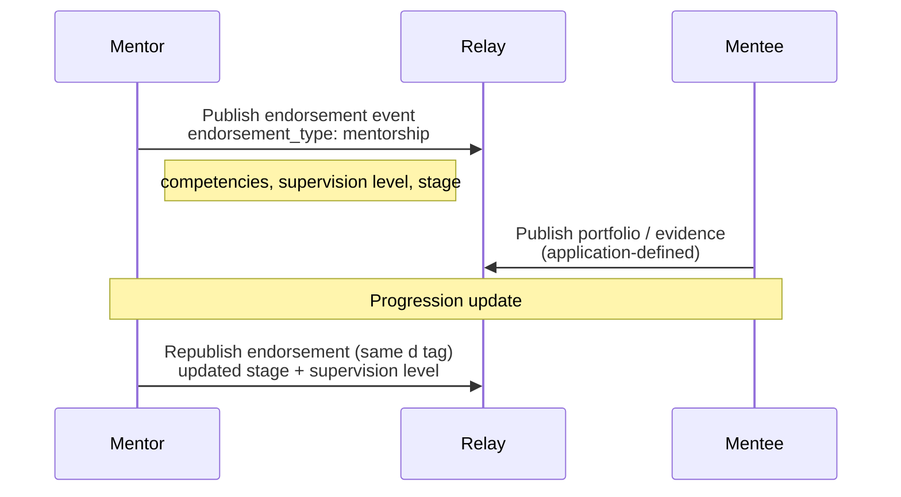

NIP-MENTORSHIP
==============

Mentorship Pipelines & Training Progression
----------------------------------------------

`draft` `optional`

This NIP defines a set of tags for recording mentorship relationships, training progression, supervision levels, apprenticeship pipelines, and continued professional development (CPD) on Nostr. No new event kinds are required; mentorship is expressed through optional tags on addressable endorsement events.

> **Standalone.** This NIP works independently on any Nostr application.

> **Design principle.** Mentorship is a specialised form of endorsement. Rather than creating a separate kind, this NIP defines optional tags that mentors use to record training relationships. This keeps the protocol minimal whilst enabling rich mentorship networks on any addressable event an application uses for endorsements.

## Motivation

Many professional domains face a **cold-start problem**: new entrants have no reputation, no completed work history, and no reviews. Existing practitioners are reluctant to recommend unknown quantities. The result is a barrier to entry that concentrates work among established providers and discourages new talent.

Traditional solutions (formal qualifications, institutional references) are slow, expensive, and not portable across platforms. Nostr peer endorsements partially address this, but lack the structure needed for **training relationships**:

- **Heritage crafts** -- master craftspeople train apprentices over 3--4 years; the training lineage is professionally significant
- **Healthcare** -- clinical supervision is a regulatory requirement; supervisors must attest to specific competencies
- **Legal services** -- pupillage and training contracts require structured progression records
- **Education** -- newly qualified teachers require mentored induction periods
- **Construction** -- trade apprenticeships (CITB, DOL Registered Apprenticeships, German Meister system) progress through defined stages
- **Therapy & counselling** -- clinical supervision networks with modality-specific oversight
- **Cybersecurity** -- mentor-attested skill progression (e.g. from supervised testing to independent engagements)
- **Traditional crafts** -- Japanese shokunin apprenticeships, German dual education programmes, and similar master-apprentice systems worldwide

NIP-MENTORSHIP defines optional tags that transform a simple endorsement into a rich training progression record -- portable, verifiable, and discoverable across any Nostr application.

## Cross-Domain Evidence

This NIP was developed after identifying demand across multiple unrelated domains spanning several categories:

| Category | Examples |
| -------- | -------- |
| Built environment | Heritage conservation master-apprentice chains; retrofit coordinator training through defined role progressions |
| Education | Cascade mentor networks (one qualified instructor training multiple trainees); tutor-student relationships with CPD recording; early years practitioner induction mentoring |
| Construction | Trade apprenticeships (UK CITB, US DOL Registered Apprenticeships, German Meister/Geselle system) |
| Healthcare / social services | Clinical supervision networks; veteran peer support; SEND education mentoring across trusts |
| Creative arts | Craftsperson-to-learner progression tracking (pottery, weaving, metalwork, woodcraft); therapeutic supervision pathways |
| Open source | Maintainer-to-contributor mentorship; coding bootcamp progression tracking; Google Summer of Code-style mentorship records |
| Traditional crafts (international) | Japanese shokunin (craftsperson) apprenticeships; German dual education system; French Compagnons du Devoir journeyman programmes |

These domains span built environment, education, construction, social services, creative arts, healthcare, technology, and traditional crafts -- confirming the pattern is domain-agnostic.

## Kind

This NIP does not define new event kinds. It defines mentorship-specific tags that MAY be used on:

- [NIP-TRUST](./NIP-TRUST.md) kind 30517 (Provider Endorsement) events -- currently a draft NIP
- Any addressable event kind that an application uses for endorsements

The tags are the contribution; they are not bound to a specific kind.

| kind  | description             | defined in  | status |
| ----- | ----------------------- | ----------- | ------ |
| 30517 | Provider Endorsement    | NIP-TRUST   | draft  |

Applications that do not use NIP-TRUST MAY apply these tags to their own addressable endorsement events by following the tag definitions below. The `endorsement_type` tag value `"mentorship"` signals that the event carries mentorship semantics regardless of the event kind used.

---

## Endorsement Tags

When an endorsement event represents a mentorship relationship, the following tags MAY be included. The only tag required to signal mentorship semantics is `endorsement_type` with value `"mentorship"`.

### Mentorship Endorsement Example

```json
{
    "kind": 30517,
    "pubkey": "<mentor-hex-pubkey>",
    "created_at": 1698770000,
    "tags": [
        ["d", "<mentor-pubkey>:<mentee-pubkey>:stonemasonry"],
        ["p", "<mentee-hex-pubkey>"],
        ["alt", "Mentorship endorsement: stonemasonry apprenticeship, stage 3"],
        ["domain", "heritage-skills"],
        ["endorsement_type", "mentorship"],
        ["mentorship_type", "apprenticeship"],
        ["mentorship_stage", "3"],
        ["mentorship_duration_months", "36"],
        ["mentorship_start", "1630454400"],
        ["supervision_level", "partial_supervision"],
        ["supervised_work", "true"],
        ["competencies", "lime_pointing", "demonstrated"],
        ["competencies", "stone_carving", "developing"],
        ["competencies", "arch_repair", "introduced"],
        ["cpd_hours", "240"],
        ["training_institution", "SPAB"],
        ["qualification_ref", "NVQ Level 3 Heritage Stonemasonry"]
    ],
    "content": "Sarah has completed 3 years of apprenticeship under my supervision. She demonstrates excellent lime pointing skills and growing competence in stone carving. She is ready for partially supervised site work on Grade II buildings.",
    "id": "<32-byte-hex>",
    "sig": "<64-byte-hex>"
}
```

### Endorsement Type

NIP-MENTORSHIP defines one `endorsement_type` tag value:

| Type | Meaning |
| ---- | ------- |
| `mentorship` | "I am training or have trained this person" -- structured training relationship |

### Tag Reference

| Tag | Requirement | Description |
| --- | ----------- | ----------- |
| `endorsement_type` | REQUIRED | Must be `"mentorship"` to signal mentorship semantics |
| `p` | REQUIRED | Hex pubkey of the mentee |
| `d` | REQUIRED | Unique identifier for the mentorship relationship (for addressable replacement) |
| `mentorship_type` | RECOMMENDED | Nature of the training relationship (see below) |
| `mentorship_stage` | RECOMMENDED | Current stage or year of the training programme |
| `supervision_level` | RECOMMENDED | Current level of supervision the mentee requires (see below) |
| `supervised_work` | RECOMMENDED | Boolean (`"true"` / `"false"`); whether the mentee may take on supervised work |
| `competencies` | OPTIONAL | Repeatable. Format: `["competencies", "<skill_name>", "<assessment>"]` |
| `mentorship_duration_months` | OPTIONAL | Total duration of the mentorship relationship in months |
| `mentorship_start` | OPTIONAL | Unix timestamp when the mentorship began |
| `cpd_hours` | OPTIONAL | Cumulative CPD hours completed under this mentor's supervision |
| `training_institution` | OPTIONAL | Name of the training institution, guild, or professional body |
| `qualification_ref` | OPTIONAL | Reference to a formal qualification being pursued or completed |
| `domain` | OPTIONAL | Application-defined domain identifier for the mentorship context |

### Tag Values

#### `mentorship_type`

- `"apprenticeship"` -- formal, structured training programme with defined stages
- `"supervised_practice"` -- ongoing supervised work (e.g. clinical supervision, pupillage)
- `"peer_mentoring"` -- informal knowledge transfer between practitioners
- `"cpd_supervision"` -- continued professional development oversight
- `"induction"` -- time-limited induction period for new practitioners

Applications MAY define additional values. Unknown values SHOULD be treated as informational text.

#### `mentorship_stage`

Plain text. Domains and applications define their own stage semantics. Examples:

- `"1"` through `"4"` for a 4-year apprenticeship
- `"foundation"` / `"core"` / `"advanced"` for staged programmes
- `"Geselle"` / `"Meister"` for German trade progression
- `"year-1"` / `"year-2"` for academic supervision

#### `supervision_level`

Recommended values:

- `"full_supervision"` -- mentee works only under direct supervision
- `"partial_supervision"` -- mentee may work independently on routine tasks; complex work requires supervision
- `"independent"` -- mentee is assessed as competent for independent work
- `"supervisory"` -- mentee is now competent to supervise others

Applications MAY define additional or alternative supervision levels appropriate to their domain. Unknown values SHOULD be treated as informational text.

---

## Protocol Flow



## Mentorship Chain Discovery

Mentorship endorsements create discoverable training lineages. A client can reconstruct a practitioner's training history by querying:

```json
[
    {"kinds": [30517], "#p": ["<practitioner-pubkey>"], "#endorsement_type": ["mentorship"]},
    {"kinds": [30517], "authors": ["<mentor-pubkey>"], "#endorsement_type": ["mentorship"]}
]
```

> **Note:** The `endorsement_type` tag is a multi-letter tag and therefore not relay-indexed per NIP-01. Clients MUST post-filter results client-side.

Applications using a different event kind for endorsements SHOULD substitute their kind number in the filter above.

### Chain Traversal

```
  Master A
      |
      +-- endorses B (mentorship, stage 4, independent)
      |       |
      |       +-- endorses D (mentorship, stage 2, partial_supervision)
      |       +-- endorses E (mentorship, stage 1, full_supervision)
      |
      +-- endorses C (mentorship, stage 3, partial_supervision)
              |
              +-- endorses F (mentorship, stage 1, full_supervision)
```

Each node in the chain is an endorsement event with `endorsement_type: "mentorship"`. The chain is acyclic; a mentee cannot endorse their own mentor (clients SHOULD reject such endorsements). The chain provides:

- **Lineage verification** -- who trained whom, and for how long
- **Quality signal** -- a mentee trained by a highly-rated mentor inherits trust weight
- **Pipeline visibility** -- training bodies can see how many practitioners are in each stage

## Supervised Work

When `supervised_work` is `"true"`, the mentee is endorsed for supervised participation in work alongside their mentor. Applications MAY use mentorship relationships to gate access to supervised work opportunities. The mechanism for work assignment is application-defined.

At minimum, applications implementing supervised work SHOULD:

1. **Discovery:** Surface the mentee in search results with a `"supervised"` indicator and a reference to their mentor's pubkey.
2. **Attribution:** Ensure the mentor's pubkey appears alongside the mentee on any resulting work.
3. **Progression:** Update the mentor's endorsement record to reflect completed supervised work.

## Competency Framework

The `competencies` tag provides a lightweight, domain-agnostic competency tracking mechanism:

| Assessment | Definition |
| ---------- | ---------- |
| `introduced` | The mentee has been exposed to this skill but has not practised it independently. |
| `developing` | The mentee is practising this skill under supervision and showing improvement. |
| `demonstrated` | The mentee has demonstrated this skill to the mentor's satisfaction on real tasks. |
| `mastered` | The mentee is fully competent and can teach this skill to others. |

Competency names are domain-specific plain text strings. Applications MAY publish recommended competency lists for their domains.

## Progression Lifecycle

A typical mentorship progresses through these stages, each reflected in updated endorsement events:

```
  Stage 1: full_supervision     -> "Learning the basics"
  Stage 2: full_supervision     -> "Building core skills"
  Stage 3: partial_supervision  -> "Independent routine work"
  Stage 4: independent          -> "Fully competent practitioner"
  ---
  supervisory                   -> "Can now mentor others"
```

Each stage update is published as a new event with the same `d` tag (addressable replacement). The previous assessment is replaced; clients see only the most current stage. Historical progression is visible via relay event history if available, but the protocol does not require historical tracking.

## Use Cases

### Academic Supervision

PhD supervisors can publish mentorship endorsements for their students, recording competency assessments, publication milestones, and supervision levels. The training chain creates a discoverable academic lineage (who supervised whom), portable across institutions.

### Open Source Mentoring

Experienced maintainers can endorse contributors they have mentored, recording competencies (`"code_review"`, `"release_management"`, `"security_audit"`) and supervision levels. This creates a verifiable mentorship record that follows the contributor's Nostr identity across projects. Programmes like Google Summer of Code, Outreachy, or language-specific mentorship programmes can record structured progression on Nostr.

### Clinical Supervision Networks

Healthcare supervisors can publish structured endorsements recording clinical competencies, supervision hours, and progression stages. The `training_institution` and `qualification_ref` tags link to regulatory requirements (e.g. GMC revalidation, NMC preceptorship, ABMS board certification, JCAHO accreditation).

### Trade Apprenticeships

Guild masters, trade assessors, and mentors can publish progression records for apprentices. The `mentorship_stage` tag maps to qualification levels or apprenticeship framework stages appropriate to the jurisdiction -- NVQ levels (UK), DOL Registered Apprenticeship stages (US), Geselle/Meister progression (Germany), or Compagnons du Devoir stages (France). Employers can verify training status via Nostr queries rather than paper certificates.

### Traditional Craft Apprenticeships

Japanese shokunin apprenticeships, where master craftspeople train successors over decades, can record the long progression from novice to independent master. The same applies to any culture's traditional craft transmission system. The `mentorship_duration_months` and `competencies` tags capture the depth of these relationships.

## Composition with Other NIPs

NIP-MENTORSHIP defines tags that compose well with other Nostr specifications. All compositions below are OPTIONAL -- the core mentorship tags work independently.

| NIP | Composition | Status |
| --- | ----------- | ------ |
| [NIP-TRUST](./NIP-TRUST.md) | Mentorship tags on kind 30517 Provider Endorsement events. Clients that do not understand mentorship tags treat them as standard endorsements (graceful degradation). | Draft NIP |
| [NIP-EVIDENCE](./NIP-EVIDENCE.md) | Mentees may publish evidence events supporting competency claims. Applications MAY cross-reference competency tags with evidence events for stronger validation. | Draft NIP |
| [NIP-VA](./NIP-VA.md) | Verifiable attestations may corroborate formal qualifications referenced in `qualification_ref` tags. | Draft NIP |
| [NIP-01](https://github.com/nostr-protocol/nips/blob/master/01.md) | Basic protocol flow, addressable events, REQ filters | Merged |
| [NIP-40](https://github.com/nostr-protocol/nips/blob/master/40.md) | Expiration timestamps for time-bounded endorsements | Merged |
| [NIP-44](https://github.com/nostr-protocol/nips/blob/master/44.md) | Versioned encrypted payloads for sensitive progression data | Merged |

## Why not NIP-32 (Labelling)?

NIP-32 labels are lightweight metadata tags, useful for categorisation but not for structured relationships. Mentorship requires:

- A **directional relationship** (mentor endorses mentee) that labels cannot express
- **Progression state** that updates over time via addressable replacement
- **Competency assessments** with multi-value tags that exceed label semantics
- **Chain traversal** across mentor-mentee graphs, which requires consistent tag structure

NIP-32 labels could complement mentorship endorsements (e.g. labelling a mentee as `"heritage-craft-apprentice"`) but cannot replace the structured tags defined here.

## Why not a new Kind?

A dedicated mentorship kind would fragment the endorsement graph. Mentorship is a specialised form of endorsement -- the same relationship, with richer metadata. Keeping mentorship on the same event kind as general endorsements means:

- Clients that do not understand mentorship tags still see a valid endorsement
- Reputation systems that aggregate endorsements automatically include mentorship endorsements
- No new relay support is required

## Why not NIP-58 (Badges)?

NIP-58 badges are awarded artifacts -- "you have achieved X." Mentorship is a living relationship that progresses over time. Key differences:

- Badges are static; mentorship endorsements update via addressable replacement
- Badges have no directional training relationship
- Badges cannot express supervision levels, competency progression, or training pipelines

Badges and mentorship endorsements are complementary: a mentee reaching `"independent"` supervision level might also receive a badge.

## Security Considerations

* **Endorsement authenticity.** Mentorship endorsements inherit standard Nostr event verification (signature checks, pubkey authentication). Applications SHOULD implement Sybil resistance; zero-history mentors carry zero weight.
* **Mentor authority.** Applications SHOULD verify that the endorsing pubkey has genuine mentorship authority -- through completed work history, credential attestations, or recognition by a training institution.
* **Competency inflation.** A mentor could over-rate a mentee's competencies. Applications SHOULD cross-reference competency claims with independent evidence where available. Competencies not supported by evidence carry reduced weight.
* **Supervised work responsibility.** When `supervised_work` is `"true"`, the mentor assumes supervisory responsibility. Applications SHOULD make this explicit and ensure the mentor's pubkey appears on all resulting work events.
* **Revocation.** A mentor can revoke a mentorship endorsement by publishing a new event with the same `d` tag and empty content. Clients MUST treat empty content as revoked.
* **Privacy.** Competency assessments and training progression data may be sensitive. When privacy is required, the `content` field SHOULD be NIP-44 encrypted to the mentee and relevant parties. Tag-level data (supervision level, stage) remains discoverable for protocol functionality.

## Validation Rules

| Rule | Description |
| ---- | ----------- |
| V-ME-01 | `endorsement_type` tag MUST have value `"mentorship"` |
| V-ME-02 | `p` tag MUST contain a valid 32-byte hex pubkey (the mentee) |
| V-ME-03 | `d` tag MUST be present (addressable replacement) |
| V-ME-04 | Event `pubkey` (the mentor) MUST NOT equal the `p` tag value (no self-mentorship) |
| V-ME-05 | `mentorship_start` value, if present, MUST be a valid Unix timestamp less than or equal to `created_at` |
| V-ME-06 | `competencies` tags, if present, MUST have exactly 3 values: tag name, skill name, assessment level |
| V-ME-07 | `competencies` assessment value SHOULD be one of: `introduced`, `developing`, `demonstrated`, `mastered` |
| V-ME-08 | `supervision_level`, if present, SHOULD be one of: `full_supervision`, `partial_supervision`, `independent`, `supervisory` |
| V-ME-09 | Empty `content` field indicates endorsement revocation; clients MUST treat as revoked |

## Test Vectors

### Minimal Valid Mentorship Endorsement

```json
{
  "kind": 30517,
  "pubkey": "a1b2c3d4e5f6a1b2c3d4e5f6a1b2c3d4e5f6a1b2c3d4e5f6a1b2c3d4e5f6a1b2",
  "created_at": 1709740800,
  "tags": [
    ["d", "a1b2...b2c3:stonemasonry"],
    ["p", "b2c3d4e5f6a1b2c3d4e5f6a1b2c3d4e5f6a1b2c3d4e5f6a1b2c3d4e5f6a1b2c3"],
    ["endorsement_type", "mentorship"]
  ],
  "content": "I am mentoring this practitioner.",
  "id": "<32-byte-hex>",
  "sig": "<64-byte-hex>"
}
```

### Full Mentorship Endorsement

```json
{
  "kind": 30517,
  "pubkey": "a1b2c3d4e5f6a1b2c3d4e5f6a1b2c3d4e5f6a1b2c3d4e5f6a1b2c3d4e5f6a1b2",
  "created_at": 1709740800,
  "tags": [
    ["d", "a1b2c3d4e5f6a1b2c3d4e5f6a1b2c3d4e5f6a1b2c3d4e5f6a1b2c3d4e5f6a1b2:b2c3d4e5f6a1b2c3d4e5f6a1b2c3d4e5f6a1b2c3d4e5f6a1b2c3d4e5f6a1b2c3:stonemasonry"],
    ["p", "b2c3d4e5f6a1b2c3d4e5f6a1b2c3d4e5f6a1b2c3d4e5f6a1b2c3d4e5f6a1b2c3"],
    ["alt", "Mentorship endorsement: stonemasonry apprenticeship, stage 3"],
    ["domain", "heritage-skills"],
    ["endorsement_type", "mentorship"],
    ["mentorship_type", "apprenticeship"],
    ["mentorship_stage", "3"],
    ["mentorship_duration_months", "36"],
    ["mentorship_start", "1630454400"],
    ["supervision_level", "partial_supervision"],
    ["supervised_work", "true"],
    ["competencies", "lime_pointing", "demonstrated"],
    ["competencies", "stone_carving", "developing"],
    ["cpd_hours", "240"],
    ["training_institution", "SPAB"],
    ["qualification_ref", "NVQ Level 3 Heritage Stonemasonry"]
  ],
  "content": "Sarah has completed 3 years of apprenticeship under my supervision. She demonstrates excellent lime pointing skills and growing competence in stone carving.",
  "id": "<32-byte-hex>",
  "sig": "<64-byte-hex>"
}
```

### Invalid: Self-Mentorship (V-ME-04)

```json
{
  "kind": 30517,
  "pubkey": "a1b2c3d4e5f6a1b2c3d4e5f6a1b2c3d4e5f6a1b2c3d4e5f6a1b2c3d4e5f6a1b2",
  "tags": [
    ["d", "self-mentorship"],
    ["p", "a1b2c3d4e5f6a1b2c3d4e5f6a1b2c3d4e5f6a1b2c3d4e5f6a1b2c3d4e5f6a1b2"],
    ["endorsement_type", "mentorship"]
  ],
  "content": "I endorse myself."
}
```

Clients MUST reject this event: `pubkey` equals `p` tag value.

### Revocation (V-ME-09)

```json
{
  "kind": 30517,
  "pubkey": "a1b2c3d4e5f6a1b2c3d4e5f6a1b2c3d4e5f6a1b2c3d4e5f6a1b2c3d4e5f6a1b2",
  "created_at": 1710000000,
  "tags": [
    ["d", "a1b2c3d4e5f6a1b2c3d4e5f6a1b2c3d4e5f6a1b2c3d4e5f6a1b2c3d4e5f6a1b2:b2c3d4e5f6a1b2c3d4e5f6a1b2c3d4e5f6a1b2c3d4e5f6a1b2c3d4e5f6a1b2c3:stonemasonry"],
    ["p", "b2c3d4e5f6a1b2c3d4e5f6a1b2c3d4e5f6a1b2c3d4e5f6a1b2c3d4e5f6a1b2c3"],
    ["endorsement_type", "mentorship"]
  ],
  "content": ""
}
```

Empty content with the same `d` tag revokes the previous mentorship endorsement.

## Dependencies

Required:

* [NIP-01](https://github.com/nostr-protocol/nips/blob/master/01.md): Basic protocol flow, addressable events

Optional:

* [NIP-40](https://github.com/nostr-protocol/nips/blob/master/40.md): Expiration timestamps (time-bounded endorsements)
* [NIP-44](https://github.com/nostr-protocol/nips/blob/master/44.md): Versioned encrypted payloads (sensitive progression data)

Optional composition (draft NIPs):

* [NIP-TRUST](./NIP-TRUST.md): Provider Endorsement kind 30517 -- one possible carrier event for mentorship tags (currently a draft NIP)
* [NIP-EVIDENCE](./NIP-EVIDENCE.md): Supporting evidence for competency claims (currently a draft NIP)
* [NIP-VA](./NIP-VA.md): Verifiable attestations for formal qualification references (currently a draft NIP)

## Reference Implementation

No public reference implementation exists yet. Implementors SHOULD refer to the tag definitions above.

A minimal implementation requires:

1. A Nostr client that supports publishing and querying addressable events.
2. Mentorship chain traversal logic: querying endorsements by `endorsement_type: "mentorship"` and building the mentor-mentee graph.
3. Optionally, supervised work discovery: surfacing mentees with `supervised_work: "true"` alongside their mentor's profile in search results.
