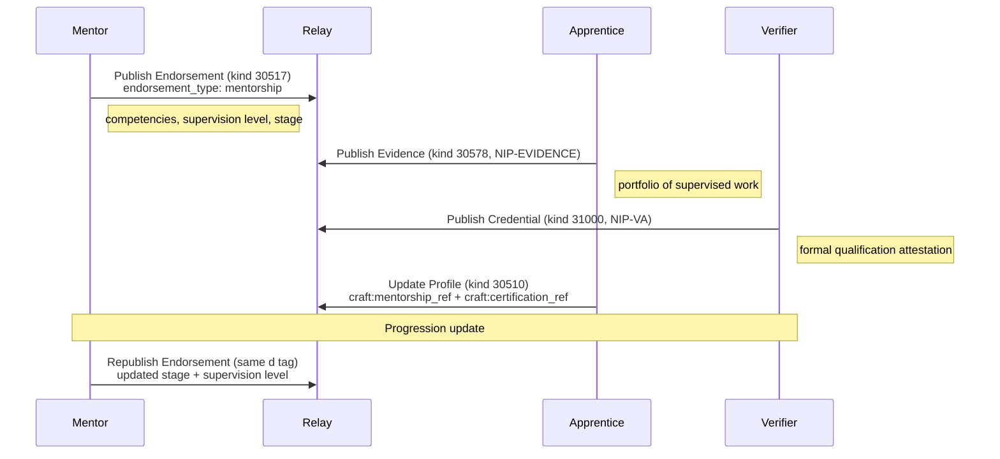

NIP-MENTORSHIP
==============

Mentorship Pipelines & Training Progression
----------------------------------------------

`draft` `optional`

An extension to [NIP-TRUST](./NIP-TRUST.md) Kind 30517 (Provider Endorsement) that adds structured mentorship semantics: training progression tracking, supervision levels, apprenticeship pipelines, and continued professional development (CPD) recording. No new event kinds are required; mentorship is expressed through enriched endorsement tags on the existing Kind 30517.

> **Design principle:** Mentorship is a specialised form of endorsement. Rather than creating a separate kind, this NIP enriches the existing endorsement primitive with optional tags that mentors use to record training relationships. This keeps the protocol minimal whilst enabling rich mentorship networks.

> **Standalone usability:** This NIP works independently on any Nostr application that supports NIP-TRUST. Mentorship endorsements compose naturally with reputation systems for credential weighting, discovery protocols for supervised-work bidding, and trust networks for mentorship chain discovery.

## Motivation

Many service domains face a **cold-start problem**: new entrants have no reputation, no completed tasks, and no reviews. Existing providers are reluctant to recommend unknown quantities. The result is a barrier to entry that concentrates work among established providers and discourages new talent.

Traditional solutions (formal qualifications, institutional references) are slow, expensive, and not portable across platforms. NIP-TRUST's Provider Endorsement (Kind 30517) partially addresses this with peer endorsements, but lacks the structure needed for **training relationships**:

- **Heritage crafts** - master craftspeople train apprentices over 3-4 years; the training lineage is professionally significant
- **Healthcare** - clinical supervision is a regulatory requirement; supervisors must attest to specific competencies
- **Legal services** - pupillage and training contracts require structured progression records
- **Education** - newly qualified teachers require mentored induction periods
- **Construction** - CSCS and trade apprenticeships progress through defined stages
- **Therapy & counselling** - clinical supervision networks with modality-specific oversight
- **Cybersecurity** - mentor-attested skill progression (e.g. from supervised testing to independent engagements)

NIP-MENTORSHIP extends Kind 30517 with optional tags that transform a simple endorsement into a rich training progression record, portable, verifiable, and discoverable across any Nostr application.

## Cross-Domain Evidence

This NIP was promoted from `incubating` after demonstrating demand across 8 unrelated domains spanning 5 categories:

| Domain | Use case | Category |
| ------ | -------- | -------- |
| Heritage conservation | Master→apprentice chains for 165 endangered crafts requiring multi-year succession planning | Built environment |
| Outdoor education | Cascade mentor networks; one qualified instructor trains multiple trainees across disciplines (Forest School, climbing, water sports) | Education |
| Green retrofit | Retrofit Coordinators training apprentices through PAS 2035 role progression (6 distinct roles, each with qualification paths) | Construction |
| Veteran support | Veteran buddy/peer support networks; experienced veterans mentoring recently transitioned service leavers | Social services |
| Craft/making (therapeutic) | Craftsperson→learner progression tracking for pottery, weaving, metalwork, woodcraft; therapeutic supervision pathways | Creative arts / healthcare |
| Learning & development | Tutor-student relationships with progression tracking, CPD recording, and adult professional development | Education |
| SEND education | SENCO-to-SENCO mentoring across multi-academy trusts; educational psychologist training of teaching assistants | Healthcare / education |
| School readiness | Early years practitioner induction mentoring; experienced staff supporting newly qualified practitioners | Early years education |

These domains span built environment, education, construction, social services, creative arts, healthcare, and early years education, confirming the pattern is domain-agnostic. No new event kinds are required; mentorship is expressed through enriched endorsement tags on the existing Kind 30517.

## Kind

This NIP does not define new event kinds. It extends the existing Kind 30517 (Provider Endorsement) from [NIP-TRUST](./NIP-TRUST.md) with additional optional tags.

| kind  | description             | defined in  |
| ----- | ----------------------- | ----------- |
| 30517 | Provider Endorsement    | NIP-TRUST   |

---

## Extended Endorsement Tags

When a Kind 30517 endorsement represents a mentorship relationship, the following additional tags MAY be included alongside the existing required tags (`d`, `p`, `domain`, `endorsement_type`).

### Mentorship Endorsement Example

```json
{
    "kind": 30517,
    "pubkey": "<mentor-hex-pubkey>",
    "created_at": 1698770000,
    "tags": [
        ["d", "<mentor-pubkey>:<mentee-pubkey>:stonemasonry"],
        ["p", "<mentee-hex-pubkey>"],
        ["alt", "Mentorship endorsement: stonemasonry apprenticeship, stage 3"],
        ["domain", "heritage-skills"],
        ["endorsement_type", "mentorship"],
        ["mentorship_type", "apprenticeship"],
        ["mentorship_stage", "3"],
        ["mentorship_duration_months", "36"],
        ["mentorship_start", "1630454400"],
        ["supervision_level", "partial_supervision"],
        ["supervised_work", "true"],
        ["competencies", "lime_pointing", "demonstrated"],
        ["competencies", "stone_carving", "developing"],
        ["competencies", "arch_repair", "introduced"],
        ["cpd_hours", "240"],
        ["training_institution", "SPAB"],
        ["qualification_ref", "NVQ Level 3 Heritage Stonemasonry"]
    ],
    "content": "Sarah has completed 3 years of apprenticeship under my supervision. She demonstrates excellent lime pointing skills and growing competence in stone carving. She is ready for partially supervised site work on Grade II buildings.",
    "id": "<32-byte-hex>",
    "sig": "<64-byte-hex>"
}
```

### New Endorsement Type

NIP-MENTORSHIP adds one new value to the `endorsement_type` tag defined in NIP-TRUST:

| Type | Meaning |
| ---- | ------- |
| `mentorship` | "I am training or have trained this person" - structured training relationship |

Existing NIP-TRUST endorsement types (`skill`, `reliability`, `safety`, `general`) remain unchanged.

### Extension Tags

All extension tags are OPTIONAL. A Kind 30517 with `endorsement_type: "mentorship"` that omits all extension tags is still valid; it simply indicates a mentorship relationship without structured progression data.

* `mentorship_type` (RECOMMENDED): The nature of the training relationship. One of:
  - `"apprenticeship"` - formal, structured training programme with defined stages
  - `"supervised_practice"` - ongoing supervised work (e.g. clinical supervision, pupillage)
  - `"peer_mentoring"` - informal knowledge transfer between practitioners
  - `"cpd_supervision"` - continued professional development oversight
  - `"induction"` - time-limited induction period for new practitioners

* `mentorship_stage` (RECOMMENDED): Current stage or year of the training programme. Plain text; domains define their own stage semantics (e.g. `"1"` through `"4"` for a 4-year apprenticeship, `"foundation"` / `"core"` / `"advanced"` for staged programmes).

* `supervision_level` (RECOMMENDED): Current level of supervision the mentee requires. One of:
  - `"full_supervision"` - mentee works only under direct supervision
  - `"partial_supervision"` - mentee may work independently on routine tasks; complex work requires supervision
  - `"independent"` - mentee is assessed as competent for independent work
  - `"supervisory"` - mentee is now competent to supervise others

* `supervised_work` (RECOMMENDED): Boolean (`"true"` or `"false"`). When `"true"`, the mentee MAY bid on tasks through the protocol, but the mentor's pubkey MUST appear as a co-provider. Discovery clients SHOULD surface the supervision relationship.

* `competencies` (OPTIONAL, repeatable): Multi-value tag recording assessed competencies. Format: `["competencies", "<skill_name>", "<assessment>"]`. Assessment values: `"introduced"`, `"developing"`, `"demonstrated"`, `"mastered"`.

* `mentorship_duration_months` (OPTIONAL): Total duration of the mentorship relationship in months.

* `mentorship_start` (OPTIONAL): Unix timestamp when the mentorship began.

* `cpd_hours` (OPTIONAL): Cumulative CPD hours completed under this mentor's supervision.

* `training_institution` (OPTIONAL): Name of the training institution, guild, or professional body overseeing the programme.

* `qualification_ref` (OPTIONAL): Reference to a formal qualification being pursued or completed (e.g. "NVQ Level 3 Heritage Stonemasonry", "RICS APC").

---

## Protocol Flow



## Mentorship Chain Discovery

Mentorship endorsements create discoverable training lineages. A client can reconstruct a practitioner's training history by querying:

```json
[
    {"kinds": [30517], "#p": ["<practitioner-pubkey>"], "#endorsement_type": ["mentorship"]},
    {"kinds": [30517], "authors": ["<mentor-pubkey>"], "#endorsement_type": ["mentorship"]}
]
```

> **Note:** The `endorsement_type` tag is a multi-letter tag and therefore not relay-indexed per NIP-01. Clients MUST post-filter results client-side.

### Chain Traversal

```
  Master A
      |
      +-- endorses B (mentorship, stage 4, independent)
      |       |
      |       +-- endorses D (mentorship, stage 2, partial_supervision)
      |       +-- endorses E (mentorship, stage 1, full_supervision)
      |
      +-- endorses C (mentorship, stage 3, partial_supervision)
              |
              +-- endorses F (mentorship, stage 1, full_supervision)
```

Each node in the chain is a Kind 30517 event with `endorsement_type: "mentorship"`. The chain is acyclic; a mentee cannot endorse their own mentor (clients SHOULD reject such endorsements). The chain provides:

- **Lineage verification** - who trained whom, and for how long
- **Quality signal** - a mentee trained by a highly-rated mentor inherits trust weight
- **Pipeline visibility** - training bodies can see how many practitioners are in each stage

## Supervised Work Bidding

When `supervised_work` is `"true"`, the mentee can participate in task discovery and bidding with their mentor as co-provider:

1. **Discovery:** The mentee's profile appears in discovery results with a `"supervised"` indicator and a reference to their mentor's pubkey.
2. **Bidding:** The mentee submits a Kind 7501 offer. The offer MUST include a `p` tag referencing the mentor's pubkey and a `supervision` tag with value `"active"`.
3. **Acceptance:** The requester sees both the mentee's profile and the mentor's endorsement. Acceptance creates a task where the mentor is a co-provider with supervisory responsibility.
4. **Completion:** Both the mentee and mentor sign the completion evidence. The mentor's endorsement record MAY be updated to reflect the completed supervised task.

## Competency Framework

The `competencies` tag provides a lightweight, domain-agnostic competency tracking mechanism:

| Assessment | Definition |
| ---------- | ---------- |
| `introduced` | The mentee has been exposed to this skill but has not practised it independently. |
| `developing` | The mentee is practising this skill under supervision and showing improvement. |
| `demonstrated` | The mentee has demonstrated this skill to the mentor's satisfaction on real tasks. |
| `mastered` | The mentee is fully competent and can teach this skill to others. |

Competency names are domain-specific plain text strings. Domains MAY publish recommended competency lists in their domain profile specifications.

## Progression Lifecycle

A typical mentorship progresses through these stages, each reflected in updated Kind 30517 events:

```
  Stage 1: full_supervision     → "Learning the basics"
  Stage 2: full_supervision     → "Building core skills"
  Stage 3: partial_supervision  → "Independent routine work"
  Stage 4: independent          → "Fully competent practitioner"
  ---
  supervisory                   → "Can now mentor others"
```

Each stage update is published as a new Kind 30517 event with the same `d` tag (addressable replacement). The previous assessment is replaced; clients see only the most current stage. Historical progression is visible via relay event history if available, but the protocol does not require historical tracking.

## Use Cases Beyond Service Providers

### Academic Supervision

PhD supervisors can publish mentorship endorsements for their students, recording competency assessments, publication milestones, and supervision levels. The training chain creates a discoverable academic lineage (who supervised whom), portable across institutions.

### Open Source Mentoring

Experienced maintainers can endorse contributors they've mentored, recording competencies (`"code_review"`, `"release_management"`, `"security_audit"`) and supervision levels. This creates a verifiable mentorship record that follows the contributor's Nostr identity across projects.

### Clinical Supervision Networks

Healthcare supervisors can publish structured endorsements recording clinical competencies, supervision hours, and progression stages. The `training_institution` and `qualification_ref` tags link to regulatory requirements (e.g. GMC revalidation, NMC preceptorship).

### Trade Apprenticeships

Guild masters, CITB assessors, and trade mentors can publish progression records for apprentices. The `mentorship_stage` tag maps to NVQ levels or apprenticeship framework stages. Employers can verify training status via Nostr queries rather than paper certificates.

## Security Considerations

* **Endorsement authenticity.** All existing NIP-TRUST endorsement security properties apply. Mentorship endorsements inherit the same Sybil resistance mechanisms; zero-history mentors carry zero weight.
* **Mentor authority.** Applications SHOULD verify that the endorsing pubkey has genuine mentorship authority, either through completed task history, credential attestations (NIP-VA kind 31000), or recognition by a training institution.
* **Competency inflation.** A mentor could over-rate a mentee's competencies. Applications SHOULD cross-reference competency claims with completed task evidence (Kind 30578) and ratings (Kind 30520). Competencies not supported by task evidence carry reduced weight.
* **Supervised work responsibility.** When `supervised_work` is `"true"`, the mentor assumes supervisory responsibility. Applications SHOULD make this explicit to requesters and ensure the mentor's pubkey appears on all task events.
* **Revocation.** A mentor can revoke a mentorship endorsement by publishing a new Kind 30517 with the same `d` tag and empty content (per NIP-TRUST withdrawal semantics). Clients MUST treat empty content as revoked.
* **Privacy.** Competency assessments and training progression data may be sensitive. When privacy is required, the `content` field SHOULD be NIP-44 encrypted to the mentee and relevant parties. Tag-level data (supervision level, stage) remains discoverable.

## Test Vectors

### Kind 30517 - Mentorship Endorsement

```json
{
  "kind": 30517,
  "pubkey": "a1b2c3d4e5f6a1b2c3d4e5f6a1b2c3d4e5f6a1b2c3d4e5f6a1b2c3d4e5f6a1b2",
  "created_at": 1709740800,
  "tags": [
    ["d", "a1b2c3d4e5f6a1b2c3d4e5f6a1b2c3d4e5f6a1b2c3d4e5f6a1b2c3d4e5f6a1b2:b2c3d4e5f6a1b2c3d4e5f6a1b2c3d4e5f6a1b2c3d4e5f6a1b2c3d4e5f6a1b2c3:stonemasonry"],
    ["p", "b2c3d4e5f6a1b2c3d4e5f6a1b2c3d4e5f6a1b2c3d4e5f6a1b2c3d4e5f6a1b2c3"],
    ["alt", "Mentorship endorsement: stonemasonry apprenticeship, stage 3"],
    ["domain", "heritage-skills"],
    ["endorsement_type", "mentorship"],
    ["mentorship_type", "apprenticeship"],
    ["mentorship_stage", "3"],
    ["mentorship_duration_months", "36"],
    ["mentorship_start", "1630454400"],
    ["supervision_level", "partial_supervision"],
    ["supervised_work", "true"],
    ["competencies", "lime_pointing", "demonstrated"],
    ["competencies", "stone_carving", "developing"],
    ["cpd_hours", "240"],
    ["training_institution", "SPAB"],
    ["qualification_ref", "NVQ Level 3 Heritage Stonemasonry"]
  ],
  "content": "Sarah has completed 3 years of apprenticeship under my supervision. She demonstrates excellent lime pointing skills and growing competence in stone carving.",
  "id": "<32-byte-hex>",
  "sig": "<64-byte-hex>"
}
```

## Dependencies

* [NIP-01](https://github.com/nostr-protocol/nips/blob/master/01.md): Basic protocol flow, addressable events
* [NIP-TRUST](./NIP-TRUST.md): Provider Endorsement (Kind 30517), the base kind this NIP extends
* [NIP-REPUTATION](./NIP-REPUTATION.md): Credential attestations for mentor authority verification (optional)
* [NIP-EVIDENCE](./NIP-EVIDENCE.md): Supporting evidence for competency claims (optional)
* [NIP-40](https://github.com/nostr-protocol/nips/blob/master/40.md): Expiration timestamps (time-bounded endorsements)
* [NIP-44](https://github.com/nostr-protocol/nips/blob/master/44.md): Versioned encrypted payloads (sensitive progression data)

## Relationship to NIP-TRUST

NIP-MENTORSHIP is a **compatible extension** to NIP-TRUST. All Kind 30517 events published under NIP-MENTORSHIP are valid NIP-TRUST endorsements. Clients that do not understand the mentorship extension tags will treat them as standard endorsements; graceful degradation is guaranteed.

The relationship:

- **NIP-TRUST defines** the Kind 30517 event structure, required tags, endorsement types, and withdrawal semantics.
- **NIP-MENTORSHIP adds** the `"mentorship"` endorsement type and optional extension tags for training progression.
- **A client supporting only NIP-TRUST** sees a valid endorsement with an unfamiliar `endorsement_type` value and optional tags it can ignore.
- **A client supporting NIP-MENTORSHIP** sees the full training progression data and can render mentorship chains, competency assessments, and supervised work flows.

## Reference Implementation

The [`@trott/sdk`](https://github.com/TheCryptoDonkey/trott-sdk) TypeScript library provides builders and parsers for mentorship endorsements as an extension of the NIP-TRUST endorsement kind. For standalone use, implementors SHOULD refer to the tag definitions above.

A minimal implementation requires:

1. A Nostr client that supports NIP-TRUST Kind 30517 publishing and querying.
2. Mentorship chain traversal logic: querying endorsements by `endorsement_type: "mentorship"` and building the mentor-mentee graph.
3. Supervised work discovery: surfacing mentees with `supervised_work: "true"` alongside their mentor's profile in discovery results.
