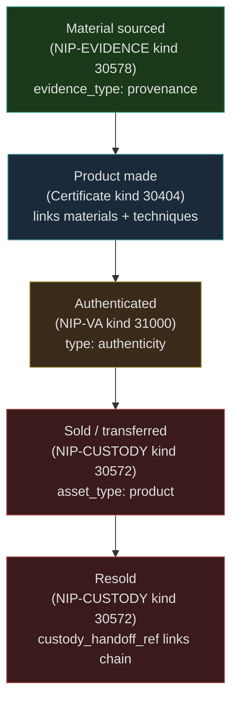

NIP-PROVENANCE
==============

Product & Supply Chain Provenance
-----------------------------------

`draft` `optional`

One addressable event kind for product certificates on Nostr. Authenticity attestation composes with NIP-VA; ownership transfer composes with NIP-CUSTODY; material provenance records compose with NIP-EVIDENCE.

> **Design principle:** A product certificate is the maker's signed declaration of what they made and how. It is the product's persistent identity. Verification, custody, and material sourcing are handled by purpose-built NIPs that already solve those problems well.

> **Standalone usability:** This NIP works independently on any Nostr application. Product certificates, authenticity attestations, ownership chains, and material provenance records each compose with existing NIPs (NIP-VA, NIP-CUSTODY, NIP-EVIDENCE). No additional protocol adoption is required.

## Motivation

Many real-world workflows involve physical products whose origin, composition, and identity matter, yet Nostr has no standard for recording **product provenance**:

- **Heritage conservation** - lime mortar, reclaimed stone, and period-correct materials must be documented for future restorers
- **Construction** - building materials must meet regulatory standards; substitutions need approval chains
- **Catering & food services** - ingredient sourcing, allergen traceability, dietary compliance
- **Automotive repair** - OEM vs aftermarket parts tracking; warranty implications
- **Interior design** - furniture and fixture procurement with lead time tracking
- **Manufacturing & IoT** - component provenance for quality control and recall tracing
- **Art & collectibles** - material authenticity verification (canvas, pigments, metals)
- **Craft & artisan goods** - maker identity, technique documentation, and product certification for handmade items
- **Luxury goods** - authenticity attestation and ownership chain for high-value products

A product certificate captures the maker's identity, materials, techniques, and specifications in a single verifiable event. Third-party verification, ownership tracking, and material sourcing each compose with existing NIPs rather than requiring dedicated kinds.

## Relationship to Existing NIPs

- **NIP-VA (kind 31000):** Authenticity attestations use NIP-VA Verifiable Attestations with `type: authenticity`. A third-party verification of product genuineness is a textbook attestation: one pubkey makes a signed, typed claim about another pubkey's product. See [Composing with NIP-VA](#composing-with-nip-va).
- **NIP-CUSTODY (kind 30572):** Ownership transfers use NIP-CUSTODY Custody Transfer events with `asset_type: product`. A product changing hands is a custody transfer. Successive transfers form a chain, exactly as NIP-CUSTODY defines. See [Composing with NIP-CUSTODY](#composing-with-nip-custody).
- **NIP-EVIDENCE (kind 30578):** Material provenance records use NIP-EVIDENCE Evidence Records with supply chain tags (`material_name`, `material_source`, `origin_region`, `specification_ref`, etc.). A record of material origin and composition is timestamped evidence of a supply chain fact. See [Composing with NIP-EVIDENCE](#composing-with-nip-evidence).
- **NIP-32 (Labelling):** Category tags for product classification. Product certificates SHOULD include `L` and `l` tags for discoverability.
- **NIP-CRAFTS:** Provider Profile with craft extensions (kind 30510, via NIP-PROVIDER-PROFILES) and Technique Record (kind 30401) provide soft cross-references for maker identity and technique documentation. Clients that do not implement NIP-CRAFTS SHOULD ignore `provenance:maker_profile` and `provenance:technique_record` tags.
- **NIP-VARIATION:** Material substitution approval flows (optional composition).
- **NIP-APPROVAL:** Multi-party sign-off on material choices (optional composition).

## Kinds

| kind  | description         |
| ----- | ------------------- |
| 30404 | Product Certificate |

Kind 30404 is an addressable event (NIP-01). It is replaceable; the maker MAY update it to correct errors or add information. Clients SHOULD track the latest version but MAY retain previous versions for audit purposes.

---

## Product Certificate (`kind:30404`)

Published by a maker to declare what they made and how. A product certificate is the maker's signed statement connecting raw materials, techniques, and the finished product into a single verifiable record.

```json
{
    "kind": 30404,
    "pubkey": "<maker-hex-pubkey>",
    "created_at": 1709740800,
    "tags": [
        ["d", "wrought_iron_gate_001"],
        ["t", "product-certificate"],
        ["alt", "Product certificate: Victorian scroll-top driveway gate"],
        ["provenance:item_type", "wrought_iron_gate"],
        ["provenance:item_name", "Victorian scroll-top driveway gate"],
        ["provenance:description", "Hand-forged wrought iron gate, 2.4m wide, scroll-top design with dog bars"],
        ["provenance:completed_date", "2026-02-28"],
        ["provenance:maker_profile", "<maker-provider-profile-event-id>", "", "30510"],
        ["provenance:material", "Wrought iron bar stock, 25mm x 6mm flat"],
        ["provenance:material", "Wrought iron rod, 12mm round"],
        ["provenance:material_source", "<iron-stock-provenance-event-id>", "", "30578"],
        ["provenance:technique", "fire_welding"],
        ["provenance:technique", "scroll_forming"],
        ["provenance:technique", "riveting"],
        ["provenance:technique_record", "<forging-technique-event-id>", "", "30401"],
        ["provenance:location", "gcpvj0"],
        ["provenance:duration", "P12D"],
        ["provenance:serial", "TCF-2026-047"],
        ["provenance:media", "https://cdn.example.com/gates/gate_001_front.jpg"],
        ["provenance:media", "https://cdn.example.com/gates/gate_001_detail.jpg"],
        ["provenance:media_type", "image/jpeg"],
        ["provenance:certification", "craft_guild:verified"],
        ["provenance:commission_ref", "<commission-task-event-id>"],
        ["L", "craft"],
        ["l", "metalwork", "craft"],
        ["l", "blacksmithing", "craft"]
    ],
    "content": "Hand-forged Victorian scroll-top driveway gate. The iron stock was sourced from a specialist heritage supplier; real wrought iron reclaimed from a demolished railway bridge in South Wales, re-smelted and rolled to bar stock. Each scroll was formed over the bick of the anvil using traditional fire-welding techniques rather than electric arc. The dog bars are riveted, not welded, matching the original 1870s pattern. Total making time twelve days including two days of finishing with linseed oil and beeswax.",
    "id": "<32-bytes lowercase hex>",
    "sig": "<64-bytes lowercase hex>"
}
```

Tags:

* `d` (REQUIRED): Unique identifier for this product certificate.
* `t` (REQUIRED): Protocol family marker. MUST be `"product-certificate"`.
* `provenance:item_type` (REQUIRED): Machine-readable type of the finished product (e.g. `wrought_iron_gate`, `oak_chair`, `sourdough_loaf`).
* `provenance:completed_date` (REQUIRED): ISO 8601 date when the product was completed (e.g. `2026-02-28`).
* `provenance:item_name` (OPTIONAL): Human-readable name or title of the product.
* `provenance:description` (OPTIONAL): Short description of the product; dimensions, features, notable characteristics.
* `provenance:maker_profile` (OPTIONAL): Event reference to the maker's NIP-PROVIDER-PROFILES Provider Profile (kind 30510) with NIP-CRAFTS extension tags. Format: `["provenance:maker_profile", "<event-id>", "", "30510"]`. Soft dependency; clients that do not implement NIP-CRAFTS SHOULD ignore this tag.
* `provenance:material` (OPTIONAL, repeatable): Plain text description of a material used. One tag per distinct material.
* `provenance:material_source` (OPTIONAL, repeatable): Event reference to a Kind 30578 Evidence Record documenting material provenance. Format: `["provenance:material_source", "<event-id>", "", "30578"]`.
* `provenance:technique` (OPTIONAL, repeatable): Machine-readable technique identifier (e.g. `fire_welding`, `hand_stitching`, `wheel_throwing`).
* `provenance:technique_record` (OPTIONAL, repeatable): Event reference to a NIP-CRAFTS Kind 30401 Technique Record. Format: `["provenance:technique_record", "<event-id>", "", "30401"]`. Soft dependency; clients that do not implement NIP-CRAFTS SHOULD ignore this tag.
* `provenance:location` (OPTIONAL): Geohash of the making location.
* `provenance:duration` (OPTIONAL): ISO 8601 duration for the total making time (e.g. `P12D` for twelve days, `PT8H` for eight hours).
* `provenance:batch_id` (OPTIONAL): Batch identifier for items produced as part of a run.
* `provenance:serial` (OPTIONAL): Unique serial number assigned by the maker.
* `provenance:media` (OPTIONAL, repeatable): URL of a photograph or video of the finished product or making process.
* `provenance:media_type` (OPTIONAL): MIME type of the media files (e.g. `image/jpeg`, `video/mp4`).
* `provenance:certification` (OPTIONAL, repeatable): Certification status in `<scheme>:<status>` format (e.g. `craft_guild:verified`, `fsc:certified`). See [Certification Tag Vocabulary](#certification-tag-vocabulary) for standard scheme identifiers.
* `provenance:commission_ref` (OPTIONAL): Event reference to a commission or task event that prompted the making.
* `L` (OPTIONAL): NIP-32 label namespace. SHOULD be `"craft"` for craft products.
* `l` (OPTIONAL, repeatable): NIP-32 labels within the declared namespace for category and subcategory.

**Content:** Free-text narrative of the making process; the maker's story. SHOULD describe the materials, techniques, and any notable aspects of the work. MAY be NIP-44 encrypted if the making process is commercially sensitive.

### REQ Filters

Discover product certificates by maker:

```json
{"kinds": [30404], "authors": ["<maker-hex-pubkey>"]}
```

Discover product certificates by category label:

```json
{"kinds": [30404], "#l": ["metalwork"]}
```

Discover a specific product certificate by its `d` tag:

```json
{"kinds": [30404], "#d": ["wrought_iron_gate_001"], "authors": ["<maker-hex-pubkey>"]}
```

Discover authenticity attestations for a product:

```json
{"kinds": [31000], "#a": ["30404:<maker-hex-pubkey>:wrought_iron_gate_001"]}
```

Discover ownership chain for a product:

```json
{"kinds": [30572], "#asset_id": ["wrought_iron_gate_001"]}
```

> **Note:** The `#asset_id` filter uses a multi-letter tag. Standard relays index only single-letter tags. Clients MAY need to fetch all `kind:30572` events from a maker and filter client-side, or use relays that support extended tag indexing. Similarly, tags prefixed with `provenance:` are multi-letter tags. Discovery SHOULD use `#l` (NIP-32 labels), `#d`, `#t`, and `authors` filters as shown above. Clients post-filter by `provenance:*` tag values after fetching matching events.

---

## Composing with NIP-VA

Authenticity attestation is a third-party verification that a product is genuine. This is precisely what NIP-VA (Verifiable Attestations, kind 31000) is designed for: one pubkey makes a signed, typed claim about another pubkey's product.

A guild assessor, certification body, or independent expert publishes a kind 31000 event with `type: authenticity` referencing the product certificate. The attestor's pubkey provides the trust anchor; clients SHOULD evaluate attestations based on the attestor's reputation and credentials.

```json
{
    "kind": 31000,
    "pubkey": "<assessor-hex-pubkey>",
    "created_at": 1709827200,
    "tags": [
        ["d", "authenticity:<product-certificate-event-id>"],
        ["type", "authenticity"],
        ["alt", "Authenticity attestation: guild verification of wrought iron gate"],
        ["p", "<maker-hex-pubkey>"],
        ["a", "30404:<maker-hex-pubkey>:wrought_iron_gate_001", "", "assertion"],
        ["summary", "Guild verification of wrought iron gate authenticity"],
        ["L", "provenance"],
        ["l", "verified", "provenance"],
        ["l", "guild_assessor", "provenance"],
        ["l", "physical_inspection", "provenance"],
        ["l", "material_testing", "provenance"],
        ["schema", "urn:provenance:attestation:v1"],
        ["valid_to", "1867104000"],
        ["expiration", "1867104000"]
    ],
    "content": "{\"attestor_role\": \"guild_assessor\", \"attestor_org\": \"Worshipful Company of Blacksmiths\", \"outcome\": \"verified\", \"methods\": [\"physical_inspection\", \"material_testing\"], \"notes\": \"Fire-weld joints confirmed by metallurgical examination. Iron stock composition consistent with reclaimed wrought iron. Scroll-work and riveting consistent with traditional techniques.\", \"evidence_url\": \"https://cdn.example.com/attestations/gate_001_inspection_report.pdf\"}",
    "id": "<32-bytes lowercase hex>",
    "sig": "<64-bytes lowercase hex>"
}
```

Key mappings from the previous kind 30405 to NIP-VA:

| Previous tag (kind 30405)            | NIP-VA equivalent                                |
| ------------------------------------ | ------------------------------------------------ |
| `provenance:attestation_outcome`     | `content` JSON field `outcome`                   |
| `provenance:attestor_role`           | `content` JSON field `attestor_role`             |
| `provenance:attestor_org`            | `content` JSON field `attestor_org`              |
| `provenance:method`                  | `l` tags in `provenance` namespace + `content`   |
| `provenance:notes`                   | `content` JSON field `notes`                     |
| `provenance:evidence`                | `content` JSON field `evidence_url`              |
| `provenance:valid_until`             | `valid_to` tag                                   |
| `e` (certificate ref)               | `a` tag with `"assertion"` marker                |

**Discovery:** Clients discover authenticity attestations by subscribing to `kind:31000` events with `type: authenticity` and filtering by the `a` tag referencing the product certificate coordinate.

---

## Composing with NIP-CUSTODY

An ownership transfer is a product changing hands from one custodian to another. This is precisely what NIP-CUSTODY (kind 30572) handles: append-only, chain-linked custody transfer records.

The outgoing owner publishes a kind 30572 event with `asset_type: product` and an `asset_id` matching the product certificate's `d` tag. Successive transfers form a chain via the `custody_handoff_ref` tag.

```json
{
    "kind": 30572,
    "pubkey": "<maker-hex-pubkey>",
    "created_at": 1710432000,
    "tags": [
        ["d", "wrought_iron_gate_001:custody:001"],
        ["t", "custody-transfer"],
        ["alt", "Ownership transfer: wrought iron gate from maker to buyer"],
        ["custody_from", "<maker-hex-pubkey>"],
        ["custody_to", "<buyer-hex-pubkey>"],
        ["asset_id", "wrought_iron_gate_001"],
        ["asset_type", "product"],
        ["condition_grade", "excellent"],
        ["g", "gcpvj0"],
        ["e", "<product-certificate-event-id>", "", "30404"]
    ],
    "content": "Gate sold and delivered to the property owner. Installed on the front driveway entrance pillars. Gate operation checked; swings freely, latch engages correctly. Buyer confirmed satisfaction with the finished installation.",
    "id": "<32-bytes lowercase hex>",
    "sig": "<64-bytes lowercase hex>"
}
```

Key mappings from the previous kind 30406 to NIP-CUSTODY:

| Previous tag (kind 30406)          | NIP-CUSTODY equivalent                        |
| ---------------------------------- | --------------------------------------------- |
| `provenance:certificate`           | `e` tag referencing the kind 30404 event       |
| `p` (recipient)                    | `custody_to`                                   |
| `provenance:transfer_type`         | `content` (NIP-CUSTODY is transfer-type agnostic) |
| `provenance:transfer_date`         | `created_at` (or `content` if date differs)    |
| `provenance:price`                 | `content` (NIP-44 encrypted if sensitive)      |
| `provenance:currency`              | `content` (NIP-44 encrypted if sensitive)      |
| `provenance:location`              | `g` tag                                        |
| `provenance:condition_notes`       | `content` field                                |
| `provenance:previous_transfer`     | `custody_handoff_ref`                          |
| `provenance:handover_verified`     | `condition_grade` + condition evidence          |

For subsequent transfers, each new kind 30572 event references the previous transfer via `custody_handoff_ref`, creating the same chain that kind 30406 previously provided.

**Discovery:** Clients reconstruct the ownership chain by subscribing to `kind:30572` events filtered by `asset_id: wrought_iron_gate_001` and following `custody_handoff_ref` links.

---

## Composing with NIP-EVIDENCE

A material provenance record is a timestamped fact about the origin, composition, or supply chain status of a material. This is precisely what NIP-EVIDENCE (kind 30578) handles: signed, timestamped, append-only evidence records.

Any participant publishes a kind 30578 event with `evidence_type: provenance` and supply chain tags (`material_name`, `material_category`, `material_source`, `origin_region`, `specification_ref`, etc.).

```json
{
    "kind": 30578,
    "pubkey": "<author-hex-pubkey>",
    "created_at": 1698770000,
    "tags": [
        ["d", "conservation_project_42:evidence:material_01"],
        ["t", "evidence-record"],
        ["alt", "Material provenance: Hydraulic lime mortar NHL 3.5"],
        ["evidence_type", "provenance"],
        ["material_name", "Hydraulic lime mortar NHL 3.5"],
        ["material_category", "mortar"],
        ["material_source", "specialist_supplier"],
        ["supplier_name", "Ty-Mawr Lime Ltd"],
        ["origin_region", "GB-WLS"],
        ["composition", "Natural hydraulic lime, sharp sand, aggregate"],
        ["specification_ref", "BS EN 459-1:2015"],
        ["match_grade", "exact"],
        ["supply_status", "secure"],
        ["lead_time_days", "14"],
        ["sustainability", "locally_sourced"],
        ["file_hash", "sha256:a1b2c3d4e5f6a1b2c3d4e5f6a1b2c3d4e5f6a1b2c3d4e5f6a1b2c3d4e5f6a1b2"],
        ["e", "<related-task-event-id>"],
        ["p", "<interested-party-hex-pubkey>"]
    ],
    "content": "NHL 3.5 hydraulic lime mortar sourced from Ty-Mawr. Composition matches original 1840s pointing mortar analysis. Sample tested and approved by conservation officer.",
    "id": "<32-bytes lowercase hex>",
    "sig": "<64-bytes lowercase hex>"
}
```

Supply chain tags carried on the evidence record:

* `material_name` (REQUIRED for provenance evidence): Human-readable name of the material or component.
* `material_category` (REQUIRED for provenance evidence): Category of material. Suggested values: `aggregate`, `adhesive`, `brick`, `chemical`, `component`, `fabric`, `fastener`, `finish`, `food`, `glass`, `ingredient`, `metal`, `mortar`, `paint`, `part`, `pharmaceutical`, `pipe`, `plaster`, `stone`, `timber`, `tile`, `wire`.
* `material_source` (RECOMMENDED): Sourcing method. One of `"manufacturer_direct"`, `"specialist_supplier"`, `"general_supplier"`, `"reclaimed"`, `"salvaged"`, `"custom_fabricated"`, `"donated"`, `"site_sourced"`.
* `match_grade` (RECOMMENDED): How well the material matches the specification or original. One of `"exact"`, `"close_match"`, `"acceptable_substitute"`, `"compromise"`.
* `supply_status` (RECOMMENDED): Current supply chain status. One of `"secure"`, `"available"`, `"limited"`, `"at_risk"`, `"sole_supplier"`, `"discontinued"`, `"out_of_stock"`.
* `lead_time_days` (RECOMMENDED): Expected procurement lead time in calendar days.
* `supplier_name` (OPTIONAL): Name of the supplier or source.
* `origin_region` (OPTIONAL): ISO 3166-2 region code or country code for the material's origin.
* `composition` (OPTIONAL): Plain text description of the material's composition or ingredients.
* `specification_ref` (OPTIONAL): External specification or standard reference (e.g. BS EN, ASTM, or domain-specific standard).
* `sustainability` (OPTIONAL): Sustainability classification. One of `"locally_sourced"`, `"recycled"`, `"reclaimed"`, `"certified_sustainable"`, `"standard"`, `"unknown"`.
* `batch_ref` (OPTIONAL): Batch, lot, or serial number for traceability.

These tags extend NIP-EVIDENCE's base tag set. The `evidence_type: provenance` value signals to clients that supply chain tags are present.

**Discovery:** Clients discover material provenance records by subscribing to `kind:30578` events with `evidence_type: provenance` and optionally filtering by `material_category`, `supply_status`, or related event (`e` tag).

### Supply Status Lifecycle

The `supply_status` tag captures point-in-time availability. As supply conditions change, new evidence records SHOULD be published with updated status rather than overwriting previous records. This creates an audit trail of supply chain changes:

```
  Timeline:

  Record 1: supply_status = "secure"        (material available, multiple suppliers)
  Record 2: supply_status = "limited"        (supplier reduced stock)
  Record 3: supply_status = "at_risk"        (supplier closure announced)
  Record 4: supply_status = "sole_supplier"  (alternative found, single source)
```

### Material Substitution Flow

When a specified material becomes unavailable, provenance evidence composes with NIP-VARIATION for substitution approvals:

1. **Original provenance** - Kind 30578 records the specified material with `supply_status: "discontinued"`.
2. **Substitute provenance** - A new Kind 30578 records the proposed substitute with `match_grade: "acceptable_substitute"`.
3. **Variation order** - A Kind 30579 (NIP-VARIATION) references both evidence records and requests approval for the substitution.
4. **Approval** - A Kind 30570 (NIP-APPROVAL) approves or rejects the substitution.

---

## Protocol Flow



1. **Material sourcing:** The maker publishes `kind:30578` evidence records with `evidence_type: provenance` for each material used, documenting origin and composition.
2. **Product certification:** The maker publishes a `kind:30404` product certificate linking the finished product to its materials, techniques, and making story. Material sources reference kind 30578 evidence records via `provenance:material_source` tags.
3. **Third-party attestation:** An assessor, guild, or certification body publishes a `kind:31000` NIP-VA attestation with `type: authenticity`, referencing the product certificate via an `a` tag with the `"assertion"` marker.
4. **Ownership transfer:** When the product changes hands, the seller publishes a `kind:30572` NIP-CUSTODY transfer with `asset_type: product`. Successive transfers form an ownership chain via `custody_handoff_ref`.

## Certification Tag Vocabulary

The `provenance:certification` tag uses `<scheme>:<status>` format. The following scheme identifiers are RECOMMENDED for interoperability:

### Food & Agriculture

| Scheme identifier | Description |
| ----------------- | ----------- |
| `eu_pdo` | EU Protected Designation of Origin |
| `eu_pgi` | EU Protected Geographical Indication |
| `eu_tsg` | EU Traditional Speciality Guaranteed |
| `red_tractor` | Red Tractor Assured Food Standards (UK) |
| `soil_association` | Soil Association Organic (UK) |
| `usda_organic` | USDA Organic Certification |
| `fairtrade` | Fairtrade International |
| `rainforest_alliance` | Rainforest Alliance Certified |
| `halal` | Halal certification (various bodies) |
| `kosher` | Kosher certification (various bodies) |
| `msc` | Marine Stewardship Council (sustainable seafood) |

### Timber & Materials

| Scheme identifier | Description |
| ----------------- | ----------- |
| `fsc` | Forest Stewardship Council |
| `pefc` | Programme for the Endorsement of Forest Certification |
| `breeam` | Building Research Establishment Environmental Assessment Method |
| `leed` | Leadership in Energy and Environmental Design |
| `ce_marking` | CE Marking (EU conformity) |
| `bs_kitemark` | BSI Kitemark |

### Craft & Trade

| Scheme identifier | Description |
| ----------------- | ----------- |
| `craft_guild` | Craft guild or livery company verification |
| `city_guilds` | City & Guilds qualification |
| `master_craftsman` | Master craftsman certification (various bodies) |
| `heritage_craft` | Heritage Crafts Association (UK) |
| `living_treasure` | National Living Treasure designation |
| `intangible_heritage` | UNESCO Intangible Cultural Heritage |
| `hallmark` | Precious metals hallmarking (assay offices) |
| `appellation` | Appellation d'Origine Controlée or equivalent |

Status values are scheme-specific but SHOULD use one of: `certified`, `verified`, `pending`, `expired`, `revoked`, `exempt`.

## Use Cases

### Craft & Artisan Products

Makers publish a `kind:30404` product certificate for each finished piece, linking materials (kind 30578 evidence records), techniques (NIP-CRAFTS kind 30401), and their Provider Profile with craft extensions (kind 30510). Guild assessors or certification bodies publish `kind:31000` NIP-VA attestations with `type: authenticity`. When the piece is sold, `kind:30572` creates a permanent ownership record, and future resales extend the chain.

### Food & Ingredient Traceability

Restaurants, caterers, and food producers publish `kind:30578` evidence records with `evidence_type: provenance` to record ingredient sourcing. The `composition` tag captures allergen information, `origin_region` enables provenance claims (e.g. "Somerset cheddar"), and `batch_ref` supports recall traceability.

### Automotive Parts Provenance

Repair shops publish provenance evidence records for parts fitted to vehicles. The `material_source` tag distinguishes OEM from aftermarket parts, `specification_ref` links to manufacturer specifications, and `batch_ref` enables recall matching. This creates a portable service history tied to the vehicle rather than a specific garage.

### Construction Material Compliance

Construction projects use provenance evidence records to demonstrate regulatory compliance. Each material gets a record linking to its test certificate (`file_hash`), specification (`specification_ref`), and source. Building control inspectors can verify the provenance chain without relying on paper records.

### Art Authentication

Galleries and restorers publish provenance evidence records for art materials (canvas type, pigment composition, frame timber species). Combined with photographic evidence, this builds a material authentication record that adds value and supports conservation decisions.

### Luxury Goods

High-value products combine all three composition patterns. The maker publishes a product certificate (kind 30404). An authentication house publishes a NIP-VA attestation (kind 31000). Each sale creates a NIP-CUSTODY transfer (kind 30572). The result is a complete, cryptographically verifiable provenance chain from maker to current owner.

## Security Considerations

* **Product certificate fraud.** A kind 30404 Product Certificate is a self-declared claim by the maker. Clients MUST NOT treat a product certificate as proof of authenticity without corroborating evidence, ideally a kind 31000 NIP-VA attestation from a trusted third party. Applications SHOULD display the maker's reputation alongside certificates.
* **Attestation collusion.** NIP-VA attestations are only as trustworthy as the attestor. Clients SHOULD evaluate the attestor's pubkey against known certification bodies, guild memberships, or web-of-trust relationships. A single attestation from an unknown pubkey provides minimal assurance. Applications SHOULD flag attestations from unverified attestors.
* **Ownership transfer chain integrity.** Clients reconstructing an ownership chain via kind 30572 events MUST verify that each transfer references the correct previous handoff and that the publisher's pubkey matches the recipient of the prior transfer. A gap or inconsistency in the chain MAY indicate a fraudulent transfer. Applications SHOULD warn users when chain integrity cannot be verified.
* **Privacy of transaction prices.** Transaction values on kind 30572 transfers are published in cleartext by default. When pricing is sensitive, publishers SHOULD include those details only in the NIP-44 encrypted `content` field.
* **Provenance integrity.** Evidence records SHOULD include a `file_hash` tag with the SHA-256 hash of any supporting documentation (material data sheets, test certificates). Consumers MUST verify the hash before trusting the evidence content.
* **Supply status accuracy.** The `supply_status` tag reflects the author's assessment at the time of publication. Clients SHOULD cross-reference multiple evidence records for the same material to detect conflicting supply claims.
* **Timestamp verification.** Clients SHOULD verify that `created_at` timestamps are consistent with the claimed sourcing timeline. Backdated records MAY indicate fabrication.
* **Content encryption.** When records contain commercially sensitive information (supplier pricing, proprietary compositions, trade secrets), the `content` field SHOULD be NIP-44 encrypted to relevant parties.
* **Supplier identity.** The `supplier_name` tag is a plain text claim, not a verified identity. Applications requiring verified supplier identity SHOULD cross-reference with external registries or NIP-VA attestations.

## Test Vectors

### Kind 30404 - Product Certificate

```json
{
  "kind": 30404,
  "pubkey": "b2c3d4e5f6a1b2c3d4e5f6a1b2c3d4e5f6a1b2c3d4e5f6a1b2c3d4e5f6a1b2c3",
  "created_at": 1709740800,
  "tags": [
    ["d", "wrought_iron_gate_001"],
    ["t", "product-certificate"],
    ["alt", "Product certificate: Victorian scroll-top driveway gate"],
    ["provenance:item_type", "wrought_iron_gate"],
    ["provenance:item_name", "Victorian scroll-top driveway gate"],
    ["provenance:description", "Hand-forged wrought iron gate, 2.4m wide, scroll-top design with dog bars"],
    ["provenance:completed_date", "2026-02-28"],
    ["provenance:maker_profile", "c3d4e5f6a1b2c3d4e5f6a1b2c3d4e5f6a1b2c3d4e5f6a1b2c3d4e5f6a1b2c3d4", "", "30510"],
    ["provenance:material", "Wrought iron bar stock, 25mm x 6mm flat"],
    ["provenance:material", "Wrought iron rod, 12mm round"],
    ["provenance:material_source", "d4e5f6a1b2c3d4e5f6a1b2c3d4e5f6a1b2c3d4e5f6a1b2c3d4e5f6a1b2c3d4e5", "", "30578"],
    ["provenance:technique", "fire_welding"],
    ["provenance:technique", "scroll_forming"],
    ["provenance:technique", "riveting"],
    ["provenance:technique_record", "e5f6a1b2c3d4e5f6a1b2c3d4e5f6a1b2c3d4e5f6a1b2c3d4e5f6a1b2c3d4e5f6", "", "30401"],
    ["provenance:location", "gcpvj0"],
    ["provenance:duration", "P12D"],
    ["provenance:serial", "TCF-2026-047"],
    ["provenance:media", "https://cdn.example.com/gates/gate_001_front.jpg"],
    ["provenance:media", "https://cdn.example.com/gates/gate_001_detail.jpg"],
    ["provenance:media_type", "image/jpeg"],
    ["provenance:certification", "craft_guild:verified"],
    ["L", "craft"],
    ["l", "metalwork", "craft"],
    ["l", "blacksmithing", "craft"]
  ],
  "content": "Hand-forged Victorian scroll-top driveway gate. The iron stock was sourced from a specialist heritage supplier; real wrought iron reclaimed from a demolished railway bridge in South Wales, re-smelted and rolled to bar stock. Each scroll was formed over the bick of the anvil using traditional fire-welding techniques rather than electric arc. The dog bars are riveted, not welded, matching the original 1870s pattern. Total making time twelve days including two days of finishing with linseed oil and beeswax.",
  "id": "<32-byte-hex>",
  "sig": "<64-byte-hex>"
}
```

### Kind 31000 - Authenticity Attestation (NIP-VA)

```json
{
  "kind": 31000,
  "pubkey": "f6a1b2c3d4e5f6a1b2c3d4e5f6a1b2c3d4e5f6a1b2c3d4e5f6a1b2c3d4e5f6a1",
  "created_at": 1709827200,
  "tags": [
    ["d", "authenticity:wrought_iron_gate_001"],
    ["type", "authenticity"],
    ["alt", "Authenticity attestation: guild verification of wrought iron gate"],
    ["p", "b2c3d4e5f6a1b2c3d4e5f6a1b2c3d4e5f6a1b2c3d4e5f6a1b2c3d4e5f6a1b2c3"],
    ["a", "30404:b2c3d4e5f6a1b2c3d4e5f6a1b2c3d4e5f6a1b2c3d4e5f6a1b2c3d4e5f6a1b2c3:wrought_iron_gate_001", "", "assertion"],
    ["summary", "Guild verification of wrought iron gate authenticity"],
    ["L", "provenance"],
    ["l", "verified", "provenance"],
    ["l", "guild_assessor", "provenance"],
    ["valid_to", "1867104000"],
    ["expiration", "1867104000"]
  ],
  "content": "{\"attestor_role\": \"guild_assessor\", \"attestor_org\": \"Worshipful Company of Blacksmiths\", \"outcome\": \"verified\", \"methods\": [\"physical_inspection\", \"material_testing\"], \"notes\": \"Fire-weld joints confirmed by metallurgical examination. Iron stock composition consistent with reclaimed wrought iron.\", \"evidence_url\": \"https://cdn.example.com/attestations/gate_001_inspection_report.pdf\"}",
  "id": "<32-byte-hex>",
  "sig": "<64-byte-hex>"
}
```

### Kind 30572 - Ownership Transfer (NIP-CUSTODY)

```json
{
  "kind": 30572,
  "pubkey": "b2c3d4e5f6a1b2c3d4e5f6a1b2c3d4e5f6a1b2c3d4e5f6a1b2c3d4e5f6a1b2c3",
  "created_at": 1710432000,
  "tags": [
    ["d", "wrought_iron_gate_001:custody:001"],
    ["t", "custody-transfer"],
    ["alt", "Ownership transfer: wrought iron gate from maker to buyer"],
    ["custody_from", "b2c3d4e5f6a1b2c3d4e5f6a1b2c3d4e5f6a1b2c3d4e5f6a1b2c3d4e5f6a1b2c3"],
    ["custody_to", "1a2b3c4d5e6f1a2b3c4d5e6f1a2b3c4d5e6f1a2b3c4d5e6f1a2b3c4d5e6f1a2b"],
    ["asset_id", "wrought_iron_gate_001"],
    ["asset_type", "product"],
    ["condition_grade", "excellent"],
    ["g", "gcpvj0"],
    ["e", "a1b2c3d4e5f6a1b2c3d4e5f6a1b2c3d4e5f6a1b2c3d4e5f6a1b2c3d4e5f6a1b2", "", "30404"]
  ],
  "content": "Gate sold and delivered to the property owner. Installed on the front driveway entrance pillars. Gate operation checked; swings freely, latch engages correctly. Buyer confirmed satisfaction with the finished installation.",
  "id": "<32-byte-hex>",
  "sig": "<64-byte-hex>"
}
```

### Kind 30578 - Material Provenance (NIP-EVIDENCE)

```json
{
  "kind": 30578,
  "pubkey": "a1b2c3d4e5f6a1b2c3d4e5f6a1b2c3d4e5f6a1b2c3d4e5f6a1b2c3d4e5f6a1b2",
  "created_at": 1709740800,
  "tags": [
    ["d", "conservation_project_42:evidence:material_01"],
    ["t", "evidence-record"],
    ["alt", "Material provenance: Hydraulic lime mortar NHL 3.5"],
    ["evidence_type", "provenance"],
    ["material_name", "Hydraulic lime mortar NHL 3.5"],
    ["material_category", "mortar"],
    ["material_source", "specialist_supplier"],
    ["supplier_name", "Ty-Mawr Lime Ltd"],
    ["origin_region", "GB-WLS"],
    ["composition", "Natural hydraulic lime, sharp sand, aggregate"],
    ["specification_ref", "BS EN 459-1:2015"],
    ["match_grade", "exact"],
    ["supply_status", "secure"],
    ["lead_time_days", "14"],
    ["sustainability", "locally_sourced"],
    ["file_hash", "sha256:a1b2c3d4e5f6a1b2c3d4e5f6a1b2c3d4e5f6a1b2c3d4e5f6a1b2c3d4e5f6a1b2"]
  ],
  "content": "NHL 3.5 hydraulic lime mortar sourced from Ty-Mawr. Composition matches original 1840s pointing mortar analysis. Sample tested and approved by conservation officer.",
  "id": "<32-byte-hex>",
  "sig": "<64-byte-hex>"
}
```

## Dependencies

* [NIP-01](https://github.com/nostr-protocol/nips/blob/master/01.md): Basic protocol flow, addressable events
* [NIP-32](https://github.com/nostr-protocol/nips/blob/master/32.md): Labelling - craft category and subcategory labels on product certificates
* [NIP-40](https://github.com/nostr-protocol/nips/blob/master/40.md): Expiration timestamps (time-limited certifications, attestation validity)
* [NIP-44](https://github.com/nostr-protocol/nips/blob/master/44.md): Versioned encrypted payloads (sensitive sourcing data, private transaction details)
* [NIP-VA](https://github.com/nostr-protocol/nips/blob/master/VA.md): Verifiable Attestations (kind 31000) - authenticity attestation composition
* [NIP-CRAFTS](./NIP-CRAFTS.md): Provider Profile with craft extensions (kind 30510, via NIP-PROVIDER-PROFILES) and Technique Record (kind 30401) - soft dependency for product certificate cross-references. Clients that do not implement NIP-CRAFTS SHOULD ignore `provenance:maker_profile` and `provenance:technique_record` tags
* [NIP-CUSTODY](./NIP-CUSTODY.md): Chain-of-custody tracking (kind 30572) - ownership transfer composition
* [NIP-EVIDENCE](./NIP-EVIDENCE.md): Timestamped evidence recording (kind 30578) - material provenance composition
* [NIP-VARIATION](./NIP-VARIATION.md): Material substitution approval flows (optional composition)
* [NIP-APPROVAL](./NIP-APPROVAL.md): Multi-party sign-off on material choices (optional composition)

## Reference Implementation

For authenticity attestation, use the NIP-VA builders from [`nostr-attestations`](https://github.com/forgesworn/nostr-attestations). For standalone use, implementors SHOULD refer to the kind definitions above.

A minimal implementation requires:

1. A Nostr client that supports addressable event publishing.
2. File hash computation (SHA-256) for attached documentation (data sheets, test certificates).
3. Product certificate publishing and discovery via `kind:30404` events filtered by the `t` tag (`product-certificate`).
4. Authenticity attestation via `kind:31000` events with `type: authenticity` referencing product certificates.
5. Ownership chain reconstruction via `kind:30572` events filtered by `asset_id` and linked via `custody_handoff_ref`.
6. Material provenance via `kind:30578` events with `evidence_type: provenance` and supply chain tags.
