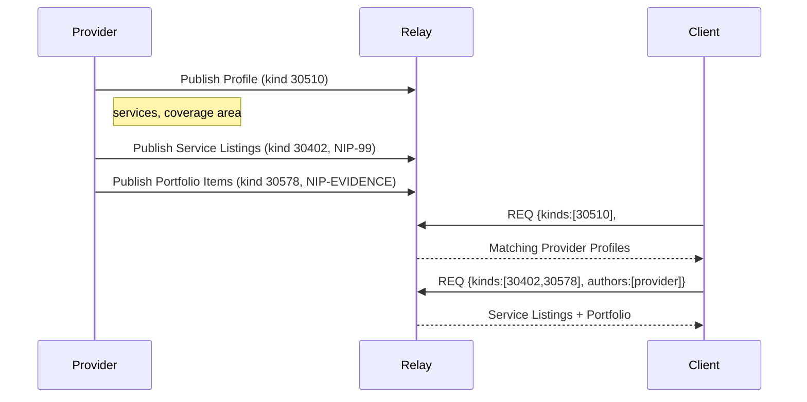

NIP-PROVIDER-PROFILES
=====================

Service Provider Profiles
-------------------------

`draft` `optional`

An addressable event kind for declaring service provider capabilities on Nostr. Service catalogues compose with NIP-99 (Classified Listings); portfolio items compose with NIP-EVIDENCE.

> **Standalone.** This NIP works independently on any Nostr application.

## Motivation

Nostr has NIP-24 for basic user metadata (name, about, picture) and NIP-89 for application handler announcements. Neither supports structured declarations of what a service provider can do, where they operate, what credentials they hold, or what terms they offer. As Nostr expands beyond social media into marketplaces, DVMs, freelance platforms, and local services, providers need a machine-readable way to advertise their capabilities so clients can filter and match programmatically.

Structured service listings and portfolio showcases use existing NIPs (NIP-99 for classified listings; NIP-EVIDENCE for evidence records) rather than introducing new kinds. This keeps the kind count minimal while composing naturally with the wider Nostr ecosystem.

Think of Kind 30510 as NIP-99 Classifieds for ongoing service availability rather than one-off listings: "I'm a plumber in Greater London", "I teach piano online", "I sell sourdough in Bristol". Clients use relay-indexed tags to discover providers, then fetch their NIP-99 listings for specifics.

## Relationship to Existing NIPs

* **NIP-24 (User Metadata):** Kind 0 is general identity. Provider Profiles are structured service declarations with geographic coverage, credentials, and machine-readable capabilities.
* **NIP-89 (Application Handlers):** Application announcements, not service provider declarations.
* **NIP-99 (Classified Listings):** Service catalogues use NIP-99. Each service offering is a classified listing (`kind:30402`) with provider-specific tags. Profile kind 30510 `service` tags summarise what the provider offers; NIP-99 listings carry the detail. See [Composing with NIP-99](#composing-with-nip-99) below.
* **NIP-EVIDENCE (kind 30578):** Portfolio items use NIP-EVIDENCE with `evidence_type: portfolio`. Completed work evidence is discoverable alongside other evidence records. See [Composing with NIP-EVIDENCE](#composing-with-nip-evidence) below.
* **NIP-58 (Badges):** Credential compatibility. Credential attestations (NIP-VA kind 31000) can reference NIP-58 badge definitions.
* **NIP-REPUTATION (kind 30520):** Ratings reference provider profiles for cross-referencing.
* **NIP-CRAFTS:** Practitioner skill profiles use Provider Profiles (kind 30510) with `craft:*` extension tags for proficiency levels, tradition, endangerment status, and specialism. See NIP-CRAFTS for the full tag vocabulary.

### Why not Kind 0 (NIP-24)?

Kind 0 is a single replaceable event per pubkey. Overloading it with structured service data (multiple domains, coverage geohashes, credentials) would break every existing client that reads Kind 0 for display name and avatar. Provider data is a separate concern that deserves its own addressable event.

### Why not NIP-89 (Application Handlers)?

NIP-89 declares what a Nostr _application_ can do (which event kinds it handles). Provider Profiles declare what a _person or business_ can do (what services they offer, where they operate). The semantics are fundamentally different.

### Why not NIP-99 alone?

NIP-99 works well for individual service listings ("I'll fix your boiler for 95 GBP"). But providers need a single, stable profile that summarises _who they are_ and _what they cover_ at a glance, separate from the catalogue of specific offerings. Kind 30510 is the shopfront; NIP-99 listings are the shelves inside.

## Kinds

| kind  | description              |
| ----- | ------------------------ |
| 30510 | Service Provider Profile |

## Kind 30510: Service Provider Profile

An addressable event declaring a provider's capabilities, coverage areas, and service offerings. Unlike ephemeral availability beacons, this event persists on relays and represents the provider's long-term profile.

### Core Tags

| tag | status | description |
| --- | ------ | ----------- |
| `d` | REQUIRED | Unique identifier for this profile. Recommended format: `<pubkey>_profile`. |
| `name` | RECOMMENDED | Display name for the provider or business. Falls back to Kind 0 `name` if absent. |
| `about` | RECOMMENDED | Short description of what the provider does. |
| `service` | REQUIRED (one or more) | A service the provider offers. Format: `["service", "<slug>", "<display_name>"]`. The slug is a stable, machine-readable identifier (e.g. `plumbing`, `piano-lessons`, `sourdough-bread`). |
| `t` | RECOMMENDED (one or more) | Relay-indexed discovery tokens. Use namespaced prefixes for filtering: `["t", "service:plumbing"]`, `["t", "skill:gas-fitting"]`, `["t", "credential:gas_safe_registered"]`. |
| `g` | RECOMMENDED (one or more) | Geohash at precision 3-4, derived from the provider's coverage area. Relay-indexed; enables geographic filtering via `#g` subscription filters. Omit for remote-only providers. |
| `coverage_geohash` | OPTIONAL (one or more) | Fine-grained geohash cells (precision 4-5) where the provider operates. Client-side post-filtering; not relay-indexed. |
| `website` | OPTIONAL | URL of the provider's website or booking page. |
| `expiration` | OPTIONAL | NIP-40 expiration. When set, the profile auto-expires and MUST be republished to remain discoverable. |

`content`: Free-text description of the provider's services.

### Example: Licensed Plumber

```json
{
    "kind": 30510,
    "pubkey": "<provider-hex-pubkey>",
    "created_at": 1698700000,
    "tags": [
        ["d", "<provider-hex-pubkey>_profile"],
        ["alt", "Provider profile: licensed plumber in Greater London"],
        ["name", "Dave's Plumbing & Gas"],
        ["about", "Qualified plumber and gas fitter serving Greater London"],
        ["service", "emergency-plumbing", "Emergency Plumbing"],
        ["service", "boiler-repair", "Boiler Repair & Service"],
        ["service", "gas-fitting", "Gas Fitting"],
        ["t", "service:plumbing"],
        ["t", "service:gas-fitting"],
        ["t", "skill:plumber"],
        ["t", "skill:gas-fitting"],
        ["t", "credential:gas_safe_registered"],
        ["g", "gcp"],
        ["g", "gcpu"],
        ["coverage_geohash", "gcpuu"],
        ["coverage_geohash", "gcpuv"],
        ["website", "https://davesplumbing.example.com"],
        ["expiration", "1730000000"]
    ],
    "content": "Qualified plumber and gas fitter serving Greater London. Gas Safe registered. Available for emergencies 24/7.",
    "id": "<32-byte-hex>",
    "sig": "<64-byte-hex>"
}
```

### Example: Freelance Developer (Remote)

```json
{
    "kind": 30510,
    "pubkey": "<provider-hex-pubkey>",
    "created_at": 1698700000,
    "tags": [
        ["d", "<provider-hex-pubkey>_profile"],
        ["alt", "Provider profile: freelance TypeScript developer"],
        ["name", "Alice Chen — Full-Stack Dev"],
        ["about", "TypeScript, React, and Node.js. Seven years shipping production apps."],
        ["service", "web-app-development", "Web Application Development"],
        ["service", "api-design", "API Design & Integration"],
        ["service", "code-review", "Code Review & Mentoring"],
        ["t", "service:software-development"],
        ["t", "skill:typescript"],
        ["t", "skill:react"],
        ["t", "skill:nodejs"],
        ["website", "https://alicechen.example.dev"],
        ["expiration", "1740000000"]
    ],
    "content": "Full-stack developer specialising in TypeScript, React, and Node.js. Available for contract work, one-off projects, and code review. Timezone: UTC+8.",
    "id": "<32-byte-hex>",
    "sig": "<64-byte-hex>"
}
```

### Example: Music Tutor (Hybrid)

```json
{
    "kind": 30510,
    "pubkey": "<provider-hex-pubkey>",
    "created_at": 1698700000,
    "tags": [
        ["d", "<provider-hex-pubkey>_profile"],
        ["alt", "Provider profile: piano and guitar tutor in Edinburgh"],
        ["name", "Melody Music Tuition"],
        ["about", "Piano and guitar lessons for all ages. In-person or online."],
        ["service", "piano-lessons", "Piano Lessons"],
        ["service", "guitar-lessons", "Guitar Lessons"],
        ["service", "music-theory", "Music Theory Coaching"],
        ["t", "service:music-tuition"],
        ["t", "skill:piano"],
        ["t", "skill:guitar"],
        ["t", "credential:abrsm_grade_8"],
        ["g", "gcv"],
        ["g", "gcvw"],
        ["coverage_geohash", "gcvwr"],
        ["website", "https://melodymusic.example.co.uk"],
        ["expiration", "1740000000"]
    ],
    "content": "Piano and guitar lessons for beginners through to advanced. In-person in Edinburgh or online via video call. ABRSM Grade 8 qualified. DBS checked.",
    "id": "<32-byte-hex>",
    "sig": "<64-byte-hex>"
}
```

### Example: Local Food Producer

```json
{
    "kind": 30510,
    "pubkey": "<provider-hex-pubkey>",
    "created_at": 1698700000,
    "tags": [
        ["d", "<provider-hex-pubkey>_profile"],
        ["alt", "Provider profile: artisan sourdough baker in Bristol"],
        ["name", "Harbourside Bakery"],
        ["about", "Artisan sourdough and pastries. Market stalls and local delivery."],
        ["service", "sourdough-bread", "Sourdough Bread"],
        ["service", "pastries", "Pastries & Viennoiserie"],
        ["service", "wholesale", "Wholesale (cafes & restaurants)"],
        ["t", "service:bakery"],
        ["t", "service:food-producer"],
        ["t", "credential:food_hygiene_level_5"],
        ["g", "gcn"],
        ["g", "gcnh"],
        ["coverage_geohash", "gcnhf"],
        ["coverage_geohash", "gcnhg"],
        ["website", "https://harbourside.example.co.uk"],
        ["expiration", "1740000000"]
    ],
    "content": "Artisan sourdough and pastries baked fresh daily. Available at St Nicholas Market (Wed-Sat) and for local delivery within 10 miles of Bristol city centre. Wholesale enquiries welcome.",
    "id": "<32-byte-hex>",
    "sig": "<64-byte-hex>"
}
```

### Virtual (Non-Geographic) Providers

Providers offering remote services (consulting, tutoring, software development) MAY omit `g` and `coverage_geohash` tags. Discovery relies on `service` and `t` tags instead. See the freelance developer example above.

### Multi-Domain Providers

A provider serving multiple categories includes multiple `service` and `t` tags in a single profile event. There is no limit on the number of services or discovery tokens.

### REQ Filters

NIP-01 defines subscription filters for single-letter tag names only (`#g`, `#t`, `#p`, `#e`, etc.). Multi-letter tag names (`coverage_geohash`) are event metadata for client-side post-filtering; relays will not index them.

Find providers by category and coarse location:

```json
{
    "kinds": [30510],
    "#t": ["service:plumbing"],
    "#g": ["gcpu"]
}
```

Find providers by credential:

```json
{
    "kinds": [30510],
    "#t": ["credential:gas_safe_registered"]
}
```

Find providers by skill in a location:

```json
{
    "kinds": [30510],
    "#t": ["skill:typescript"],
    "#g": ["gcpu"]
}
```

For fine-grained coverage filtering, fetch events matching the coarse `#g` filter and post-filter client-side on `coverage_geohash` tags (precision 4-5).

### Application-Level Extensions

The core tag set above is deliberately minimal. Applications MAY define additional tags for richer provider profiles. These tags are OPTIONAL and not part of the core NIP. Clients that do not recognise them SHOULD ignore them gracefully.

**Geographic extensions:**

| tag | description |
| --- | ----------- |
| `coverage_precision` | Maximum geohash precision (3-9) used when computing coverage cells from zone shapes. |
| `coverage_merge_threshold` | Merge threshold (0.1-1.0) controlling how aggressively adjacent cells are merged. |
| `coverage_radius_km` | Maximum travel distance from coverage area in kilometres. |
| `coverage_zones` | NIP-44 encrypted `ServiceAreaDefinition` JSON (encrypted to event author). Contains original zone shapes for lossless re-editing. |

**Discovery extensions:**

| tag | description |
| --- | ----------- |
| `domain` | Service category (e.g. `plumbing`, `software-development`). Client-side metadata. |
| `skill` | Specific capability within a domain. Client-side metadata. |
| `credential` | Qualification, licence, or certification held. Machine-readable identifier. |
| `credential_proof` | Verification URL for a credential. Format: `["credential_proof", "<id>", "<url>"]`. |

**Storefront extensions:**

| tag | description |
| --- | ----------- |
| `hero_image` | URI of a primary image representing the provider's business or brand. |
| `tagline` | Short marketing tagline (max 120 characters). |
| `featured_service` | Structured tag highlighting a NIP-99 listing. Format: `["featured_service", "<slug>", "<display_name>", "<price_indicator>"]`. |
| `portfolio_count` | Number of portfolio evidence records the provider has published. |
| `standing_offer` | `true` if the provider operates a walk-in or market-stall service. |
| `resource_type` | One of `service` (default), `space` (bookable venue), `equipment` (items for hire). |

**Schedule and locale extensions:**

| tag | description |
| --- | ----------- |
| `languages` | Comma-separated ISO 639-1 language codes. |
| `operating_hours` | Operating hours in 24-hour format (e.g. `08:00-22:00`). |
| `timezone` | IANA timezone identifier. |
| `availability_schedule` | Day-and-time format, e.g. `["availability_schedule", "mon,wed,fri 09:00-17:00"]`. |
| `emergency_available` | `true` if the provider offers emergency/out-of-hours service. |

**Informational extensions:**

| tag | description |
| --- | ----------- |
| `rating` | Current aggregate rating (decimal, 1.0-5.0). Informational; verifiable ratings use `kind:30520`. |
| `completed_tasks` | Total completed engagements. Informational. |
| `member_since` | Unix timestamp of when the provider joined. |

## Composing with NIP-99

Service catalogues use [NIP-99 Classified Listings](https://github.com/nostr-protocol/nips/blob/master/99.md) (`kind:30402`). Rather than defining a separate catalogue kind, each service offering becomes an independent NIP-99 listing event. This is a natural fit: NIP-99 is listing-centric ("what's for sale") and each service is exactly that.

### Service Listing Structure

Each service the provider offers is published as a separate `kind:30402` event:

```json
{
    "kind": 30402,
    "pubkey": "<provider-hex-pubkey>",
    "created_at": 1740000000,
    "tags": [
        ["d", "<provider-hex-pubkey>:service:lockout-emergency"],
        ["title", "Lock-out Emergency Service"],
        ["summary", "Entry for residential lock-outs"],
        ["price", "9500", "GBP", "session"],
        ["t", "service:plumbing"],
        ["location", "gcpu"],
        ["expiration", "1771536000"]
    ],
    "content": "Professional lock-out service for residential properties across Greater London. Includes non-destructive entry where possible, lock assessment, and security advice. Prices include VAT. Call-out fee of 25 GBP applies outside M25."
}
```

A provider with multiple services publishes multiple `kind:30402` events:

```json
{
    "kind": 30402,
    "pubkey": "<provider-hex-pubkey>",
    "created_at": 1740000000,
    "tags": [
        ["d", "<provider-hex-pubkey>:service:lock-change"],
        ["title", "Lock Change"],
        ["summary", "Replace existing lock with new cylinder"],
        ["price", "7500", "GBP", "session"],
        ["t", "service:plumbing"],
        ["location", "gcpu"],
        ["expiration", "1771536000"]
    ],
    "content": "Full lock replacement service. Includes removal of existing cylinder, fitting of new lock, and testing. All locks conform to BS 3621."
}
```

### D-tag Convention

The `d` tag SHOULD follow the pattern `<provider_pubkey>:service:<slug>`. The slug is a stable, machine-readable identifier for the service. This convention ensures uniqueness per provider and enables direct referencing from profile `service` tags.

### Linking Profiles to Listings

The `service` tag on a provider's Kind 30510 profile uses slugs that correspond to NIP-99 listing d-tag suffixes:

```json
["service", "lockout-emergency", "Lock-out Emergency"]
```

The first value (`lockout-emergency`) matches the slug portion of the NIP-99 listing's d-tag (`<pubkey>:service:lockout-emergency`). Applications MAY use the `featured_service` extension tag (see [Application-Level Extensions](#application-level-extensions)) for richer storefront summaries with price indicators.

### REQ Filter

Fetch all service listings by a provider:

```json
{
    "kinds": [30402],
    "authors": ["<provider-hex-pubkey>"]
}
```

Fetch service listings by category:

```json
{
    "kinds": [30402],
    "#t": ["service:plumbing"]
}
```

### Behaviour Notes

- Each service is independently publishable, updatable, and deletable.
- Prices are indicative only; authoritative pricing is established during negotiation.
- Republishing with the same `d` tag replaces that service listing.
- The `price` tag follows NIP-99 conventions: `["price", "<amount>", "<currency>", "<frequency>"]`. Amount is in the smallest currency unit (pence for GBP, cents for USD, satoshis for SAT).

## Composing with NIP-EVIDENCE

Portfolio items use [NIP-EVIDENCE](NIP-EVIDENCE.md) (`kind:30578`). A portfolio item is evidence of completed work, which maps directly to NIP-EVIDENCE's purpose. Using `evidence_type: portfolio` distinguishes portfolio artefacts from other evidence records (inspection findings, compliance records, etc.) while keeping them discoverable in the same evidence namespace.

### Portfolio Evidence Structure

Each portfolio item is published as a `kind:30578` evidence record:

```json
{
    "kind": 30578,
    "pubkey": "<provider-hex-pubkey>",
    "created_at": 1740000000,
    "tags": [
        ["d", "<provider-hex-pubkey>:portfolio:1739800000"],
        ["evidence_type", "portfolio"],
        ["p", "<provider-hex-pubkey>"],
        ["domain", "plumbing"],
        ["title", "Emergency pipe repair"],
        ["image", "https://example.com/before.jpg"],
        ["image", "https://example.com/after.jpg"],
        ["location", "Islington, London"],
        ["captured_at", "1739800000"]
    ],
    "content": "Emergency burst pipe in a period property. Isolated the supply, replaced the damaged section, and pressure-tested before leaving."
}
```

### D-tag Convention

The `d` tag SHOULD follow the pattern `<provider_pubkey>:portfolio:<unix_timestamp>`. The timestamp ensures chronological ordering and uniqueness.

### Linking to Service Listings

Portfolio evidence MAY reference a NIP-99 service listing via a `service_ref` tag containing the listing slug:

```json
["service_ref", "lockout-emergency"]
```

This links the portfolio item to the corresponding `kind:30402` listing with d-tag `<pubkey>:service:lockout-emergency`.

### REQ Filter

Fetch all portfolio items by a provider:

```json
{
    "kinds": [30578],
    "authors": ["<provider-hex-pubkey>"],
    "#evidence_type": ["portfolio"]
}
```

Since `evidence_type` is a multi-letter tag, relay support for `#evidence_type` filtering varies. Clients SHOULD fall back to fetching all `kind:30578` events by author and post-filtering on the `evidence_type` tag client-side.

### Behaviour Notes

- Each portfolio item is independently publishable and deletable.
- Location SHOULD be coarse (neighbourhood or city level) to protect client privacy.
- The `e` tag MAY reference the original task event (only when the task was public and the requester consented).

## Protocol Flow



1. **Provider publishes profile:** Creates a `kind:30510` event with services and coverage area.
2. **Provider publishes service listings:** Optionally creates `kind:30402` (NIP-99) events for each service offered, with structured pricing and descriptions.
3. **Provider publishes portfolio:** Optionally creates `kind:30578` (NIP-EVIDENCE) events with `evidence_type: portfolio` showcasing completed work.
4. **Client discovers providers:** Queries relays using `#g` and `#t` filters on `kind:30510` (e.g. `#t: ["service:plumbing"]`, `#g: ["gcpu"]`).
5. **Client browses storefront:** Fetches `kind:30402` (NIP-99) and `kind:30578` (NIP-EVIDENCE) events by provider pubkey to review services and past work.
6. **Ongoing updates:** Providers republish their addressable events to update services, coverage, or descriptions.

## Use Cases

### Nostr Marketplace Seller Profiles
Sellers publish structured profiles (kind:30510) with service areas, accepted payment methods, and credential attestations. Buyers discover sellers by capability, not just by following.

### Freelance Platforms
Developers, designers, writers, and other freelancers publish verifiable profiles with skills, credentials, and portfolio evidence. Clients search by skill and location (or lack thereof for remote work).

### Local Services
Tradespeople, tutors, cleaners, caterers, and other local service providers advertise their availability in specific geographic areas. Clients discover them via geohash-based filtering.

### Content Creator Portfolios
Creators publish portfolio evidence records (kind:30578 with `evidence_type: portfolio`): writing samples, design work, code contributions. Discoverable via relay queries alongside all other evidence records.

### Community Expert Directories
Communities maintain directories of vetted experts. NIP-99 service listings (kind:30402) describe what each expert offers; Kind 30510 profiles provide the overview.

## Security Considerations

* **Self-declared data.** Profile data is self-declared by the provider. Claims about credentials and completed work SHOULD be verified against signed credential attestations (`kind:31000`, see [NIP-REPUTATION](NIP-REPUTATION.md)) and independent proof where available.
* **Profile freshness.** Clients SHOULD check `created_at` timestamps and `expiration` tags. Stale profiles may not reflect current capabilities.
* **Sybil resistance.** A single entity can create multiple provider profiles. Cross-referencing with reputation data (`kind:30520`) and credential attestations (`kind:31000`) helps distinguish genuine providers from Sybil accounts.
* **Geographic claims.** Coverage geohashes are self-declared. Clients SHOULD NOT treat them as verified location data. Reputation and delivery history are stronger signals.

## Dependencies

* [NIP-01](https://github.com/nostr-protocol/nips/blob/master/01.md): Basic protocol flow, addressable events
* [NIP-40](https://github.com/nostr-protocol/nips/blob/master/40.md): Expiration timestamps
* [NIP-58](https://github.com/nostr-protocol/nips/blob/master/58.md): Badges (credential compatibility)
* [NIP-99](https://github.com/nostr-protocol/nips/blob/master/99.md): Classified Listings (service catalogues)
* [NIP-EVIDENCE](NIP-EVIDENCE.md): Timestamped Evidence Recording (portfolio items)

## Reference Implementation

No public reference implementation exists yet. Implementors SHOULD refer to the kind definitions above.

A minimal implementation requires:

1. A Nostr client that supports addressable event publishing and tag-based queries.
2. Profile display logic that renders `service` tags and links to NIP-99 listings by slug.
3. Optionally, a geohash library for encoding coverage areas into `coverage_geohash` tags.

---

## Appendix: Platform Bond Extension (Informational)

Some platforms may wish to publish bond or deposit declarations. This appendix describes an OPTIONAL kind for this purpose. It is not part of the core NIP.

### Kind 30511: Platform Bond

An addressable event declaring a platform's financial commitment. Platforms are entities that facilitate discovery, matching, escrow, or dispute resolution between requesters and providers. This event enables participants to evaluate and compare platforms transparently.

| tag | status | description |
| --- | ------ | ----------- |
| `d` | REQUIRED | Unique identifier. Recommended format: `<pubkey>_bond`. |
| `amount` | REQUIRED | Bond amount in smallest currency unit. |
| `currency` | REQUIRED | Currency code for the bond amount. |
| `bond_txid` | OPTIONAL | On-chain transaction ID proving the bond deposit. |
| `bond_address` | OPTIONAL | Address holding the bond (for on-chain verification). |
| `domain` | OPTIONAL (one or more) | Service categories the platform supports. |
| `fee_percent` | OPTIONAL | Commission percentage charged per transaction. |
| `service_area_geohash` | OPTIONAL (one or more) | Geohash cells covering the platform's service area. |
| `api_url` | OPTIONAL | Platform's API endpoint. |
| `expiration` | OPTIONAL | NIP-40 expiration. |

`content`: Free-text description of the platform's services and terms.

**Example:**

```json
{
    "kind": 30511,
    "pubkey": "<platform-hex-pubkey>",
    "created_at": 1698700000,
    "tags": [
        ["d", "<platform-hex-pubkey>_bond"],
        ["alt", "Platform bond: 5000000 GBP for Greater London services"],
        ["amount", "5000000"],
        ["currency", "GBP"],
        ["bond_txid", "a1b2c3d4e5f6..."],
        ["domain", "plumbing"],
        ["domain", "electrical"],
        ["service_area_geohash", "gcpuu"],
        ["fee_percent", "5.0"],
        ["expiration", "1730000000"]
    ],
    "content": "Greater London platform covering plumbing and electrical services. All providers background-checked and insured.",
    "id": "<32-byte-hex>",
    "sig": "<64-byte-hex>"
}
```

**Bond verification:** The `bond_txid` and `bond_address` tags enable independent verification that the platform has committed funds. Clients SHOULD verify the bond on-chain when available. The bond amount signals the platform's financial skin in the game; higher bonds indicate greater commitment and potential liability.
