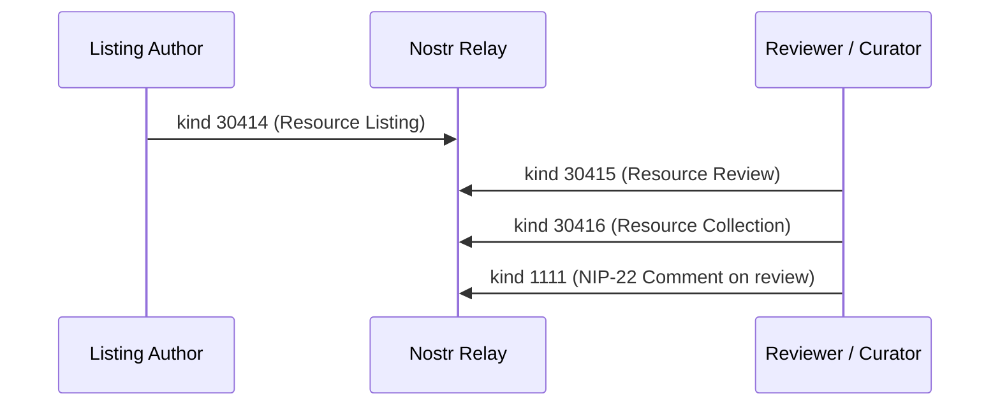

NIP-RESOURCE-CURATION
=====================

Structured Resource Listings, Reviews & Collections
------------------------------------------------------

`draft` `optional`

Three addressable event kinds for resource curation on Nostr: listings describe resources with structured metadata, reviews evaluate them (including audience suitability assessments), and collections organise them into curated sets.

> **Design principle:** A resource listing is a signed declaration that a resource exists and has certain properties. Reviews and collections are separate events that reference listings, enabling multiple independent perspectives on the same resource without requiring the listing author's cooperation or approval.

> **Standalone usability:** This NIP works independently on any Nostr application. Resource listings, reviews, and collections each function without requiring any other NIP. All dependencies are on merged, accepted NIPs only.

## Motivation

Many applications need decentralised resource directories, yet Nostr has no standard for structured resource metadata beyond simple lists (NIP-51) and classifieds (NIP-99):

- **Learning platforms** - curricula, worksheets, educational videos, interactive apps, and physical venues need structured metadata (age range, subject, media type, cost) for discovery and filtering
- **Skills and training** - curated directories of training providers, tool catalogues, material sources, and certification bodies
- **Community directories** - local service directories, mutual aid resource lists, community asset maps
- **Health and wellbeing** - curated directories of practitioners, therapeutic resources, support groups, and self-help materials
- **Marketplace curation** - product recommendation lists, buyer's guides, comparison reviews
- **Content libraries** - podcast directories, reading lists, video collections with structured metadata and audience suitability

These domains share a common pattern: someone describes a resource with structured metadata, others review it, curators organise resources into collections, and community members rate content suitability for different audiences. NIP-51 lists lack structured metadata. NIP-99 classifieds are designed for selling items, not describing external resources. NIP-RESOURCE-CURATION fills this gap.

## Why Not Existing NIPs?

### Why not NIP-51 (Lists)?

NIP-51 provides unstructured sets of references (pubkeys, event IDs, URLs). A NIP-51 list cannot express per-item structured metadata: there is no way to attach an age range, cost indicator, media type, or category label to an individual list entry. NIP-RESOURCE-CURATION provides structured metadata per resource and separates the act of listing a resource from the act of curating it into collections. A Collection (kind 30416) MAY reference NIP-51 lists for organisational compatibility; a NIP-51 list MAY contain `a` tag references to Resource Listings.

### Why not NIP-99 (Classifieds)?

NIP-99 (kind 30402) is for items offered for sale by the listing author. Its tags (`price`, `status: active/sold`) assume a commercial transaction. NIP-RESOURCE-CURATION describes external resources that the listing author does not necessarily own or sell. A learning platform curator listing a free YouTube video is not selling anything. A heritage conservation body listing training providers is not the provider. NIP-99's commercial framing does not fit non-transactional resource directories.

### Why not NIP-32 (Labelling) for reviews?

NIP-32 (kind 1985) attaches categorical labels to events. Its specification explicitly states that "labels with specific values like 'John Doe' or '3.18743' are not labels, they are values." Numerical ratings (quality: 4/5, accessibility: 3/5) are values, not labels. Additionally, NIP-32 labels are fire-and-forget: there is no `d` tag constraint ensuring one label per author per target, no structured multi-criteria rating, and no provision for free-text commentary. Resource reviews need all three. NIP-RESOURCE-CURATION uses NIP-32 `L`/`l` tags for category classification (what NIP-32 is designed for) and defines a separate review kind for structured evaluation (what NIP-32 is not designed for).

### Why not the Reviews NIP (PR #879)?

The Reviews NIP (staab, open PR #879 to nostr-protocol/nips) defines kinds 31985-31987 for reviewing events, URLs, and other content. It uses a `rating` tag with values between 0 and 1. NIP-RESOURCE-CURATION's Resource Review kind differs in three ways: (1) reviews always target a Resource Listing via an `a` tag, creating a listing-review relationship that clients can traverse; (2) reviews use multi-criteria ratings (quality, relevance, accessibility, engagement) rather than a single overall score; (3) reviews include audience suitability assessments (content warnings, age ratings, skip lists) that the Reviews NIP does not address. If the Reviews NIP merges, NIP-RESOURCE-CURATION's `rating` tag format could be aligned with it. The two NIPs can coexist: the Reviews NIP covers general-purpose reviews of any Nostr content, while NIP-RESOURCE-CURATION provides a structured listing-review-collection workflow for resource directories.

### Why not NIP-100 (Decentralised Stars & Reviews, PR #2115)?

NIP-100 (kind 30016) provides simple star ratings with a single score per entity and optional free-text content. NIP-RESOURCE-CURATION provides multi-criteria structured ratings (quality, relevance, accessibility, engagement, suitability), audience suitability assessments (content warnings, age ratings, skip lists), and a listing-review-collection workflow that connects resource description, evaluation, and curation into a coherent directory.

### Why not Pinboards (NostrHub)?

The Pinboards community NIP (kinds 30067/39067) defines visual content collections. Pinboards are presentation-oriented (visual layout, collaborative editing) while Resource Collections are metadata-oriented (ordered references with per-item curation notes, structured category labels). A pinboard organises visual content for display; a collection organises resources for discovery and use. The two could complement each other: a client could render a Resource Collection as a pinboard.

## Relationship to Other Protocols

- **[NIP-32](https://github.com/nostr-protocol/nips/blob/master/32.md) (Labelling):** Resource Listings use `L` and `l` tags for category classification, enabling relay-side filtering by domain.
- **[NIP-22](https://github.com/nostr-protocol/nips/blob/master/22.md) (Comments):** Review responses use NIP-22 comments (kind 1111) rather than defining a new response kind.
- **[NIP-40](https://github.com/nostr-protocol/nips/blob/master/40.md) (Expiration):** Time-limited resources and collections use `expiration` tags.
- **[NIP-51](https://github.com/nostr-protocol/nips/blob/master/51.md) (Lists):** Collections interoperate with NIP-51 lists via `a` tag references.

## Kinds

| kind  | description          |
| ----- | -------------------- |
| 30414 | Resource Listing     |
| 30415 | Resource Review      |
| 30416 | Resource Collection  |

All kinds are addressable events (NIP-01). Resource Listings and Resource Collections are replaceable (the author MAY update them). Resource Reviews use the append-only pattern with unique `d` tag values per resource per author.

### Why three kinds and not fewer?

Each kind has a distinct author, a distinct relay subscription pattern, and a distinct lifecycle moment:

| Kind  | Author      | Subscription                     | Lifecycle                  |
| ----- | ----------- | -------------------------------- | -------------------------- |
| 30414 | Anyone      | "Show me resources about X"      | Resource discovered/created |
| 30415 | Reviewer    | "Show me reviews of resource Y"  | Resource evaluated          |
| 30416 | Curator     | "Show me curator Z's collections"| Resources organised         |

Clients subscribe to listings for discovery, reviews for evaluation, and collections for curation. These are independent queries serving different UI surfaces. A listing author is not necessarily a reviewer; a reviewer is not necessarily a curator. Merging any two would force clients to over-fetch events they do not need.

### Why not merge Suitability Rating into Resource Review?

Audience suitability (content warnings, age ratings, skip lists) was initially drafted as a separate kind. It was merged into Resource Review because suitability and quality assessment share the same author relationship (reviewer evaluates resource), the same lifecycle moment (after using/inspecting the resource), and the same relay subscription pattern (fetch all reviews of resource Y). A reviewer who rates quality 5/5 may simultaneously flag content warnings for younger audiences. Separating these into distinct kinds would force clients to make two queries where one suffices. Suitability-specific tags (`content_warning`, `skip`, NIP-32 `age-rating` labels) are OPTIONAL on Resource Reviews, so reviews that only assess quality omit them.

---

## Resource Listing (`kind:30414`)

Published by anyone to describe a resource. A resource is anything that can be referenced by URL or identified by structured metadata: a website, video, book, app, physical venue, document, course, tool, or service.

```jsonc
{
    "kind": 30414,
    "pubkey": "<author-hex-pubkey>",
    "created_at": 1709740800,
    "tags": [
        ["d", "khan_academy_algebra"],
        ["alt", "Resource listing: Khan Academy - Algebra Basics"],
        ["title", "Khan Academy - Algebra Basics"],
        ["r", "https://www.khanacademy.org/math/algebra-basics"],
        ["summary", "Free interactive algebra course covering equations, inequalities, and graphing. Self-paced with practice exercises and progress tracking."],
        ["t", "interactive"],
        ["t", "free"],
        ["language", "en"],
        ["L", "subject"],
        ["l", "mathematics", "subject"],
        ["l", "algebra", "subject"],
        ["L", "level"],
        ["l", "secondary", "level"]
    ],
    "content": "Khan Academy's algebra course is well-suited for secondary school students who need to build or reinforce foundational algebra skills. The interactive exercises provide immediate feedback, and the mastery-based progression ensures gaps are addressed before moving on. Works well as both a primary resource and a supplement to classroom teaching.",
    "id": "<32-bytes lowercase hex>",
    "sig": "<64-bytes lowercase hex>"
}
```

Tags:

* `d` (REQUIRED): Unique identifier for this resource listing. Implementations SHOULD use a human-readable slug derived from the resource name.
* `title` (REQUIRED): Human-readable name of the resource.
* `r` (RECOMMENDED): URL of the resource. REQUIRED for digital resources. Physical resources (venues, tools, books) MAY omit this tag. Uses the standard `r` tag for external references.
* `summary` (RECOMMENDED): Brief description of the resource (distinct from the free-text `content` field). Uses the same tag name as NIP-23 (Long-form Content) for consistency.
* `t` (RECOMMENDED): Hashtags for resource type and attributes. Implementations SHOULD include the media type (e.g. `video`, `article`, `interactive`, `app`, `worksheet`, `book`, `course`, `podcast`, `venue`, `tool`, `service`, `document`) and cost indicator (`free`, `freemium`, `paid`, `subscription`). Multiple `t` tags are permitted.
* `language` (OPTIONAL): ISO 639-1 language code (e.g. `en`, `fr`, `es`). Multiple `language` tags for multilingual resources.
* `g` (OPTIONAL): Geohash for location-specific resources (venues, local services).
* `image` (OPTIONAL): URL of a representative image or thumbnail.
* `p` (OPTIONAL): Pubkey of the resource creator or provider, if they have a Nostr identity.
* `L` and `l` (RECOMMENDED): NIP-32 label tags for category classification. Enables relay-side filtering.
* `price` (OPTIONAL): `["price", "<amount>", "<currency>"]`. Specific price for paid resources. Amount in smallest currency unit (pence, cents, satoshis).
* `expiration` (OPTIONAL): NIP-40 expiry for time-limited resources (seasonal courses, temporary venues).
* `alt` (RECOMMENDED): Human-readable fallback text per NIP-31.

**Content:** Free-text editorial notes, context, or recommendations about the resource. This is the curator's perspective, not a structured review (use kind 30415 for that).

### Physical Venue Example

```jsonc
{
    "kind": 30414,
    "pubkey": "<author-hex-pubkey>",
    "created_at": 1709740800,
    "tags": [
        ["d", "science_museum_london"],
        ["alt", "Resource listing: Science Museum, London"],
        ["title", "Science Museum, London"],
        ["r", "https://www.sciencemuseum.org.uk"],
        ["summary", "Free entry science museum with interactive galleries, IMAX cinema, and regular workshops for children and adults."],
        ["t", "venue"],
        ["t", "free"],
        ["language", "en"],
        ["g", "gcpvj0"],
        ["L", "subject"],
        ["l", "science", "subject"],
        ["l", "technology", "subject"],
        ["L", "level"],
        ["l", "primary", "level"],
        ["l", "secondary", "level"],
        ["l", "adult", "level"]
    ],
    "content": "Excellent for family visits. The Wonderlab gallery (paid, around 10 GBP) is particularly good for primary-age children. The main galleries are free and cover everything from space exploration to computing history. Busy during school holidays; weekday mornings are quieter."
}
```

### REQ Filters

```jsonc
// All resource listings tagged with a specific subject
{"kinds": [30414], "#l": ["mathematics"]}

// All resource listings by a specific curator
{"kinds": [30414], "authors": ["<curator_pubkey>"]}

// All resource listings in a geographic area
{"kinds": [30414], "#g": ["gcpv"]}

// All free resource listings
{"kinds": [30414], "#t": ["free"]}

// All venue listings
{"kinds": [30414], "#t": ["venue"]}
```

---

## Resource Review (`kind:30415`)

Published by anyone to review a specific resource. Reviews provide structured multi-criteria ratings, optional audience suitability assessments, and free-text commentary. Each reviewer publishes one review per resource, enforced by the `d` tag format.

### Quality Review Example

```jsonc
{
    "kind": 30415,
    "pubkey": "<reviewer-hex-pubkey>",
    "created_at": 1709744400,
    "tags": [
        ["d", "khan_academy_algebra:<reviewer-hex-pubkey>"],
        ["alt", "Resource review: 4/5 for Khan Academy - Algebra Basics"],
        ["a", "30414:<listing-author-pubkey>:khan_academy_algebra", "wss://relay.example.com"],
        ["rating", "0.8", "overall"],
        ["rating", "1.0", "quality"],
        ["rating", "0.8", "relevance"],
        ["rating", "0.6", "accessibility"],
        ["rating", "0.8", "engagement"],
        ["L", "reviewer-context"],
        ["l", "teacher", "reviewer-context"],
        ["L", "subject"],
        ["l", "mathematics", "subject"]
    ],
    "content": "Strong content that covers the fundamentals well. The exercises are well-designed and the hints system helps struggling students without giving away answers. Accessibility could be better: no offline mode, screen reader support is patchy, and the interface assumes a wide screen. I use this as a homework supplement for my Year 9 class and it works well for that purpose.",
    "id": "<32-bytes lowercase hex>",
    "sig": "<64-bytes lowercase hex>"
}
```

### Suitability Review Example

Reviews MAY include audience suitability assessments with content warnings, age ratings, and skip lists. This avoids the need for a separate suitability event kind while allowing reviews that focus solely on quality to omit these tags.

```jsonc
{
    "kind": 30415,
    "pubkey": "<reviewer-hex-pubkey>",
    "created_at": 1709748000,
    "tags": [
        ["d", "nature_documentary_series:<reviewer-hex-pubkey>"],
        ["alt", "Resource review with suitability assessment: Nature documentary series"],
        ["a", "30414:<listing-author-pubkey>:nature_documentary_series", "wss://relay.example.com"],
        ["rating", "0.8", "overall"],
        ["rating", "0.6", "suitability"],
        ["content_warning", "animal_predation"],
        ["content_warning", "natural_disaster"],
        ["L", "age-rating"],
        ["l", "7+", "age-rating"],
        ["L", "reviewer-context"],
        ["l", "teacher", "reviewer-context"]
    ],
    "content": "High quality nature documentary. Generally suitable for primary-age children and above. Episodes 3 and 7 contain extended predation sequences that may be distressing for younger viewers. Episode 12 covers natural disasters with real footage of flooding. A teacher or parent should preview these episodes before showing them to children under 7."
}
```

### Review with Skip Lists (Clean Cuts)

For video, audio, or interactive resources, reviews MAY include skip lists that identify segments to avoid for specific audiences:

```jsonc
{
    "kind": 30415,
    "pubkey": "<reviewer-hex-pubkey>",
    "created_at": 1709748000,
    "tags": [
        ["d", "history_documentary:<reviewer-hex-pubkey>"],
        ["a", "30414:<listing-author-pubkey>:history_documentary", "wss://relay.example.com"],
        ["rating", "0.8", "overall"],
        ["content_warning", "violence"],
        ["skip", "PT12M30S", "PT14M15S", "graphic_violence", "Battle scene with realistic injuries"],
        ["skip", "PT45M00S", "PT46M30S", "medical_imagery", "Period surgical procedures"],
        ["L", "age-rating"],
        ["l", "12+", "age-rating"]
    ],
    "content": "Suitable for secondary school history classes if the two flagged segments are skipped. The rest of the documentary is well-produced and historically accurate."
}
```

The `skip` tag format is: `["skip", "<start>", "<end>", "<reason>", "<description>"]`. Times use ISO 8601 duration from the start of the resource.

Tags:

* `d` (REQUIRED): Format `<resource_d_tag>:<reviewer_pubkey>`. Ensures one review per reviewer per resource via addressable event semantics.
* `a` (REQUIRED): NIP-01 `a` tag referencing the Resource Listing being reviewed. Format: `30414:<listing-author-pubkey>:<d-tag>`.
* `rating` (REQUIRED, at least one): Multi-value tag: `["rating", "<value>", "<criterion>"]`. The `overall` criterion MUST be present. Values are decimal numbers between 0 and 1 (where 0 is worst and 1 is best), following the same convention as the Reviews NIP (PR #879). Core criteria: `quality` (content accuracy and depth), `relevance` (fitness for stated purpose), `accessibility` (ease of access for diverse users), `engagement` (how well it holds attention), `suitability` (audience appropriateness). Applications MAY define additional criteria.
* `content_warning` (OPTIONAL): One tag per content concern. Values: `violence`, `sexual_content`, `strong_language`, `animal_predation`, `natural_disaster`, `medical_imagery`, `substance_use`, `discrimination`, `flashing_imagery`. Applications MAY define additional values.
* `skip` (OPTIONAL): `["skip", "<start>", "<end>", "<reason>", "<description>"]`. Segment to skip for sensitive audiences. Times use ISO 8601 duration from the start of the resource.
* `L` and `l` (OPTIONAL): NIP-32 labels. Use `["L", "reviewer-context"]` / `["l", "<role>", "reviewer-context"]` for reviewer role (e.g. `teacher`, `student`, `parent`, `professional`, `safeguarding_officer`). Use `["L", "age-rating"]` / `["l", "<min>+", "age-rating"]` for minimum age recommendations.
* `alt` (RECOMMENDED): Human-readable fallback text per NIP-31.

**Content:** Free-text review commentary, including suitability notes where applicable.

### Rating Scale

Values are decimal numbers between 0 and 1:

| Value   | Meaning                                    |
| ------- | ------------------------------------------ |
| 0.0-0.2 | Poor - significant problems, not usable    |
| 0.2-0.4 | Below average - notable shortcomings       |
| 0.4-0.6 | Adequate - serviceable with limitations    |
| 0.6-0.8 | Good - recommended with minor caveats      |
| 0.8-1.0 | Excellent - strongly recommended           |

This scale matches the convention used by the Reviews NIP (PR #879). Clients MAY display these as star ratings (e.g. 0.8 = 4/5 stars) or percentage scores.

### Review Responses

Review responses use [NIP-22](https://github.com/nostr-protocol/nips/blob/master/22.md) comments (kind 1111) referencing the Resource Review event:

```jsonc
{
    "kind": 1111,
    "tags": [
        ["K", "30415"],
        ["E", "<review-event-id>", "wss://relay.example.com"],
        ["p", "<reviewer-pubkey>"]
    ],
    "content": "Thanks for the feedback on accessibility. We have added offline mode in the latest update and are working on improved screen reader support."
}
```

### Aggregating Reviews

Multiple reviewers MAY publish reviews for the same resource. Clients SHOULD aggregate these using available trust signals:

- **Social distance** - reviews from followed or trusted pubkeys are weighted higher (NIP-02 follow graph)
- **Reviewer role** - a safeguarding officer's suitability assessment carries more weight than an anonymous rating
- **Consensus** - when multiple reviewers agree on ratings, confidence increases

The protocol does not prescribe an aggregation algorithm; implementations choose their own strategy. However, implementations serving child-facing or safeguarding contexts SHOULD apply a **safety floor**: when suitability assessments conflict, the more restrictive assessment SHOULD prevail until a sufficient number of trusted reviewers agree otherwise. Clients displaying suitability information SHOULD require at least two independent reviews with suitability data before presenting an age rating as reliable; a single rating from an unknown pubkey SHOULD be displayed with a clear "unverified" indicator.

### REQ Filters

```jsonc
// All reviews for a specific resource listing
{"kinds": [30415], "#a": ["30414:<listing-author-pubkey>:khan_academy_algebra"]}

// All reviews by a specific reviewer
{"kinds": [30415], "authors": ["<reviewer_pubkey>"]}
```

---

## Resource Collection (`kind:30416`)

Published by a curator to organise resources into an ordered set with editorial context. Collections are the curation layer: a teacher assembles a term's resources, a community group builds a local services directory, or a reviewer compiles a "best of" list.

```jsonc
{
    "kind": 30416,
    "pubkey": "<curator-hex-pubkey>",
    "created_at": 1709751600,
    "tags": [
        ["d", "year9_algebra_term1"],
        ["alt", "Resource collection: Year 9 Algebra - Term 1"],
        ["title", "Year 9 Algebra - Term 1"],
        ["summary", "Curated resources for Year 9 algebra covering linear equations, inequalities, and basic graphing."],
        ["a", "30414:<pubkey-a>:khan_academy_algebra", "wss://relay.example.com", "Core: watch the intro videos and complete exercises 1-12"],
        ["a", "30414:<pubkey-b>:desmos_graphing", "wss://relay.example.com", "Use for graphing exercises in weeks 3-4"],
        ["a", "30414:<pubkey-a>:corbett_maths_algebra", "wss://relay.example.com", "Extension: attempt the 5-a-day challenges"],
        ["a", "30414:<pubkey-c>:science_museum_london", "wss://relay.example.com", "Optional trip: visit the mathematics gallery"],
        ["language", "en"],
        ["L", "subject"],
        ["l", "mathematics", "subject"],
        ["l", "algebra", "subject"],
        ["L", "level"],
        ["l", "secondary", "level"]
    ],
    "content": "This collection covers the first term of Year 9 algebra. Start with the Khan Academy videos for conceptual grounding, then move to Desmos for interactive graphing practice. Corbett Maths provides daily challenge problems for students who want to push further. The Science Museum trip is optional but gives good context for how algebra underpins real engineering.",
    "id": "<32-bytes lowercase hex>",
    "sig": "<64-bytes lowercase hex>"
}
```

Tags:

* `d` (REQUIRED): Unique identifier for this collection.
* `title` (REQUIRED): Human-readable name of the collection.
* `a` (REQUIRED, at least one): Ordered list of Resource Listing references. Format: `["a", "30414:<pubkey>:<d-tag>", "<relay-hint>", "<curation-note>"]`. The fourth element is an optional curation note explaining how this resource fits the collection. Order is significant; clients SHOULD preserve it.
* `summary` (OPTIONAL): Brief description of the collection.
* `language` (OPTIONAL): ISO 639-1 language code.
* `image` (OPTIONAL): URL of a collection cover image or thumbnail.
* `g` (OPTIONAL): Geohash for location-specific collections.
* `L` and `l` (OPTIONAL): NIP-32 labels for classification.
* `expiration` (OPTIONAL): NIP-40 expiry for time-limited collections (term-specific syllabi, seasonal guides).
* `alt` (RECOMMENDED): Human-readable fallback text per NIP-31.

**Content:** Free-text editorial notes, introduction, or usage guidance for the collection.

### Collection Ordering

The order of `a` tags in the event defines the resource order within the collection. Clients MUST preserve this order when displaying resources. Curators update the order by publishing a new version of the event (same `d` tag, higher `created_at`).

### Heritage Training Provider Directory Example

```jsonc
{
    "kind": 30416,
    "pubkey": "<curator-hex-pubkey>",
    "created_at": 1709751600,
    "tags": [
        ["d", "heritage_lime_mortar_providers_southwest"],
        ["alt", "Resource collection: Heritage Lime Mortar Training - South West England"],
        ["title", "Heritage Lime Mortar Training - South West England"],
        ["summary", "Accredited training providers for traditional lime mortar techniques in the South West."],
        ["a", "30414:<pubkey-d>:wells_cathedral_stonemasons", "wss://relay.example.com", "Two-day hands-on course, HLF-accredited"],
        ["a", "30414:<pubkey-e>:ty_mawr_lime", "wss://relay.example.com", "Online theory + practical weekend, supplies included"],
        ["a", "30414:<pubkey-f>:spab_repair_course", "wss://relay.example.com", "SPAB flagship repair course, conservation philosophy focus"],
        ["g", "gbux"],
        ["L", "domain"],
        ["l", "heritage_conservation", "domain"],
        ["l", "lime_mortar", "domain"]
    ],
    "content": "Three training providers for traditional lime mortar work in the South West. All are accredited or recognised by heritage bodies. Wells offers the most hands-on experience; Ty-Mawr is best if you need the theory first; SPAB is the gold standard for conservation philosophy but books up months in advance."
}
```

### REQ Filters

```jsonc
// All collections by a specific curator
{"kinds": [30416], "authors": ["<curator_pubkey>"]}

// All collections tagged with a specific subject
{"kinds": [30416], "#l": ["mathematics"]}

// All collections in a geographic area
{"kinds": [30416], "#g": ["gbux"]}
```

---

## Protocol Flow



1. **Listing:** Anyone publishes `kind:30414` to describe a resource with structured metadata.
2. **Reviewing:** Anyone publishes `kind:30415` to rate and review the resource (optionally including suitability assessments, content warnings, and skip lists). One review per reviewer per resource.
3. **Curating:** Anyone publishes `kind:30416` to organise resources into ordered collections with editorial notes.
4. **Discussion:** Participants use NIP-22 comments (kind 1111) to respond to reviews or discuss resources.

## Use Cases

### Learning Platform Resource Directory

A home education co-operative maintains a shared resource directory. Parents and tutors publish Resource Listings for materials they have used. Teachers publish Resource Reviews with structured ratings. A safeguarding lead publishes Reviews that include content warnings, age ratings, and skip lists for sensitive material. The co-op's curriculum coordinator publishes Collections organised by term and subject.

### Heritage Skills Training Directory

A heritage conservation body curates training providers across the country. Each provider is listed as a Resource Listing with location, cost, and accreditation details. Practitioners who have attended courses publish Resource Reviews. The body publishes Collections by region and specialism, with editorial notes on each provider's strengths.

### Podcast Directory

A podcast network publishes Resource Listings for each show and notable episode, tagged with subject labels, language, and media type. Listeners publish Reviews with structured ratings for production quality, content depth, and engagement. Network curators publish Collections organised by topic (e.g. "Best Bitcoin Privacy Episodes", "Beginner-Friendly Tech Podcasts"), each with per-item notes explaining why the episode was selected. Content warnings flag episodes covering sensitive topics so listeners can make informed choices.

### Community Health Resource Hub

A local authority publishes Resource Listings for mental health services, support groups, and self-help materials. Community health workers publish Reviews based on client feedback, including suitability assessments for different demographics (young people, veterans, new parents). Collections organise resources by condition and urgency.

## Validation Rules

All validation rules for NIP-RESOURCE-CURATION events. Implementations MUST enforce these rules when processing resource events.

| Rule      | Requirement |
|-----------|-------------|
| V-RC-01   | Kind 30414 MUST include a `d` tag and a `title` tag. |
| V-RC-02   | Kind 30415 MUST include a `d` tag matching the format `<resource_d_tag>:<reviewer_pubkey>`, at least one `rating` tag, and an `a` tag referencing a kind 30414 event. |
| V-RC-03   | Kind 30415 `rating` values MUST be decimal numbers between 0.0 and 1.0 inclusive. Clients MUST reject reviews with out-of-range rating values. |
| V-RC-04   | Kind 30415 MUST include a `rating` tag with the `overall` criterion. |
| V-RC-05   | Kind 30416 MUST include a `d` tag, a `title` tag, and at least one `a` tag referencing a kind 30414 event. |
| V-RC-06   | The `reviewer_pubkey` segment in a kind 30415 `d` tag MUST match the event's `pubkey` field. Clients MUST reject reviews where these do not match. |

---

## Security Considerations

* **Listing accuracy.** Resource Listings describe external resources. The listing author's claims (cost, content type) are not verified by the protocol. Clients SHOULD cross-reference listings with multiple reviews before trusting metadata.
* **Review manipulation.** Resource reviews are vulnerable to astroturfing. Clients SHOULD weight reviews using social distance (NIP-02 follow graph) and reviewer role context (NIP-32 `reviewer-context` labels) to mitigate this.
* **Suitability gaming.** Malicious actors could publish false suitability assessments to make inappropriate content appear safe, or safe content appear inappropriate. Clients SHOULD aggregate suitability data from multiple trusted sources and display warnings when assessments conflict significantly.
* **Content warnings as censorship.** Overly broad content warnings could suppress legitimate resources. Implementations SHOULD present suitability assessments transparently with reviewer attribution, allowing users to judge the assessor's credibility.
* **URL integrity.** Resource URLs may change or be compromised after listing. Clients SHOULD verify URL accessibility periodically. Listings SHOULD use canonical URLs (not shortened or redirect URLs) to reduce the risk of URL hijacking. Clients SHOULD warn users when a resource URL redirects to a different domain than originally listed.
* **Collection authority.** Collections are published by individual curators, not by the resources' authors. Clients SHOULD clearly attribute collections to their curators and not imply endorsement by the listed resource providers.
* **Privacy of reviews.** Review content is public by default. The `d` tag format `<resource_d_tag>:<reviewer_pubkey>` embeds the reviewer's pubkey in cleartext, making it impossible to review a resource pseudonymously even if the review content is NIP-44 encrypted. For sensitive domains (health resources, support services), implementations MAY encrypt review content using NIP-44 to limit visibility to relevant parties, but the fact that a specific pubkey reviewed a specific resource remains visible to relay operators.
* **Skip list content exposure.** The `skip` tag embeds content descriptions (e.g. "Battle scene with realistic injuries") in cleartext tags, not in the encrypted `content` field. These descriptions cannot be encrypted without losing relay-side utility. Implementations SHOULD keep `skip` tag descriptions factual and brief, avoiding detailed content descriptions that could themselves be distressing.

## Dependencies

All dependencies are on merged, accepted NIPs:

* [NIP-01](https://github.com/nostr-protocol/nips/blob/master/01.md): Basic protocol flow, addressable events
* [NIP-22](https://github.com/nostr-protocol/nips/blob/master/22.md): Comments (review responses)
* [NIP-31](https://github.com/nostr-protocol/nips/blob/master/31.md): Alt tag for unknown event kinds
* [NIP-32](https://github.com/nostr-protocol/nips/blob/master/32.md): Labelling (category classification, reviewer context, age ratings)
* [NIP-40](https://github.com/nostr-protocol/nips/blob/master/40.md): Expiration timestamps (time-limited resources and collections)

Optional composition (not required):

* [NIP-44](https://github.com/nostr-protocol/nips/blob/master/44.md): Versioned encrypted payloads (sensitive review content)
* [NIP-51](https://github.com/nostr-protocol/nips/blob/master/51.md): Lists (collection interoperability)

## Reference Implementation

No reference implementation exists yet. A minimal implementation requires:

1. A Nostr client that supports addressable event publishing and NIP-32 label filtering.
2. Resource discovery logic subscribing to `kind:30414` events and filtering by `l` tags, `t` tags, geohash (`g`), or author.
3. Review aggregation logic fetching `kind:30415` events by `a` tag and computing weighted averages.
4. Collection rendering that preserves `a` tag order and displays curation notes.
