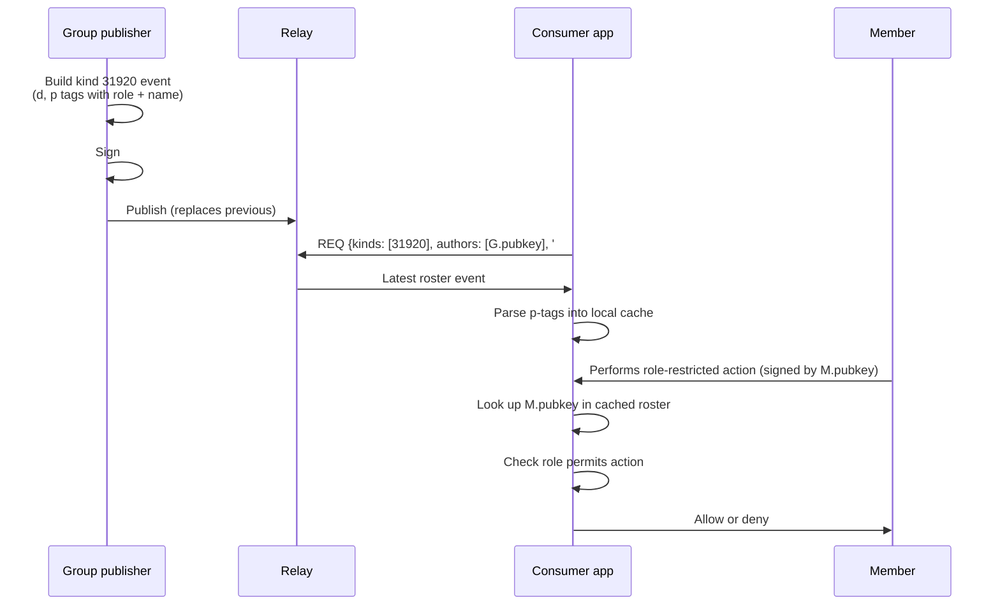

NIP-XX
======

Named-Group Roster
------------------

`draft` `optional`

This NIP defines an addressable Nostr event for publishing a named roster — a list of pubkeys with role and display-name annotations — that other apps can subscribe to for authorisation, membership, or directory purposes.

## Motivation

Many apps need to publish "who is on the team" in a way that other apps can read and trust:

- A football club publishes its stewards so a gate verification app knows whose signed events to accept.
- An identity app publishes its trusted verifiers so credential-checking sites know which professional verifications to honour.
- A DAO publishes its core contributors so a treasury tool knows which signing keys to weight.
- A mutual-aid group publishes its dispatch coordinators so volunteers know who to take instructions from.

The shared shape: **one publisher (the "group"), N listed pubkeys, each with a role and a human-readable name, replaceable as the membership changes.**

NIP-29 (Simple Groups) covers a richer pattern (relay-managed group state, members, admins, threads) but requires NIP-29-aware relay software. There is no lightweight "just publish a list" event in the existing NIP space.

This NIP defines that lightweight event. It is intentionally minimal: one event, one tag schema, no relay-side semantics.

### Why not NIP-29 (Simple Groups)?

NIP-29 requires a relay that implements the full group protocol (kinds 39000–39003 are relay-signed metadata, group membership is mutated by relay-mediated commands). It binds membership to a specific relay's view of the group.

NIP-ROSTER is publisher-signed, relay-agnostic, and addressable per NIP-01 — any standard relay can store it, any client can read it. It does not provide group messaging, moderation, or membership-mutation semantics.

The two NIPs compose: a NIP-29 group's owner could publish a NIP-ROSTER event listing public-facing roles outside the relay-mediated group state.

### Why not NIP-51 (Lists)?

NIP-51 lists are about a *user's own* curated lists (followed, muted, bookmarked). NIP-ROSTER is about a *group/organisation's* roster of role-holders. Different ownership, different consumption pattern.

A NIP-51 list also lacks per-entry role and display-name annotations.

### Why not NIP-02 (Contact List)?

NIP-02 is a single follow list per pubkey, with optional petname. There can only be one per author. NIP-ROSTER allows multiple distinct rosters per author (via the `d` tag) and richer per-entry metadata.

## Event Definition

### Kind

`31920` — addressable event (range 30000–39999, parameterised replaceable per NIP-01).

The combination of `(kind, pubkey, d-tag)` uniquely identifies a roster. Publishing a new event with the same triple replaces the previous one.

### Structure

```json
{
  "kind": 31920,
  "pubkey": "<group's hex pubkey>",
  "created_at": <unix timestamp>,
  "tags": [
    ["d", "<roster name, ASCII slug>"],
    ["p", "<member pubkey hex>", "<role>", "<display name>"],
    ["p", "<member pubkey hex>", "<role>", "<display name>"]
  ],
  "content": "",
  "id": "<event id>",
  "sig": "<schnorr signature>"
}
```

### Tag Reference

| Tag | Status | Format | Purpose |
|-----|--------|--------|---------|
| `d` | REQUIRED | ASCII slug, max 64 chars, `[a-z0-9-]+` | Roster identifier within this publisher's namespace |
| `p` | REQUIRED (≥1) | `[pubkey, role, displayName]` | One entry per roster member |

The `p` tag uses the four-element form `["p", pubkey, role, displayName]`:

- `pubkey` — 64 lowercase hex chars (per NIP-01)
- `role` — short ASCII slug, max 64 chars, application-defined vocabulary (e.g. `gate_steward`, `safety_officer`, `verifier`, `treasurer`)
- `displayName` — UTF-8 string, max 100 chars, human-readable

The third element (`role`) and fourth element (`displayName`) are NIP-ROSTER additions to the standard NIP-02 `p` tag form.

### Roster names

The `d` tag scopes the roster within a publisher's namespace. A publisher MAY have multiple rosters with distinct `d` tag values:

- `staff-roster` — operational staff
- `verifiers` — credential issuers
- `safeguarding` — safeguarding officers

Roster names are conventions agreed between publisher and consumer apps. There is no central registry; consuming apps subscribe to the `d` tag value they expect.

### Replacement

Publishing a new kind-31920 event with the same `(pubkey, d-tag)` replaces the previous one (per NIP-01 addressable event semantics). Removing a member is done by republishing the roster without their `p` tag. There is no per-entry deletion event.

## Verification Flow



## Validation Rules

| ID | Rule |
|----|------|
| V-RO-01 | `kind` MUST equal `31920` |
| V-RO-02 | `tags` MUST contain exactly one `d` tag |
| V-RO-03 | The `d` tag value MUST match `^[a-z0-9-]{1,64}$` |
| V-RO-04 | `tags` MUST contain at least one `p` tag |
| V-RO-05 | Each `p` tag's pubkey MUST be 64 lowercase hex chars (entries failing this MAY be skipped silently rather than rejecting the whole event) |
| V-RO-06 | Each `p` tag's role, if present, MUST match `^[a-z0-9_-]{1,64}$` |
| V-RO-07 | Each `p` tag's displayName, if present, MUST be ≤100 UTF-8 chars and SHOULD have HTML tags stripped at consumption time |
| V-RO-08 | Signature MUST verify per NIP-01 (BIP-340 Schnorr over `id`) |
| V-RO-09 | Consumers SHOULD cap roster size at an application-defined maximum (recommended 200 entries) and ignore p-tags beyond the cap |

## Subscription Filters

Consumer subscribes to a known publisher's roster by name:

```json
["REQ", "roster-sub", {
  "kinds": [31920],
  "authors": ["<publisher hex pubkey>"],
  "#d": ["staff-roster"]
}]
```

Discovery across publishers (e.g. "all 'verifiers' rosters globally") uses an unconstrained authors filter:

```json
["REQ", "verifiers-discover", {
  "kinds": [31920],
  "#d": ["verifiers"]
}]
```

Consumers MUST handle `EOSE` and apply the latest event by `created_at` per addressable event semantics.

## Security Considerations

- **Trust is publisher-bound.** A roster is only as authoritative as the publisher's pubkey. Consumers MUST verify the publisher's identity through some out-of-band means (NIP-05, prior agreement, certificate, etc.) before treating the roster as authoritative.
- **Race against revocation.** Between a member being removed (republished roster) and the consumer cache being refreshed, the removed member could still pass authorisation checks. Consumers SHOULD subscribe to live updates rather than polling, and SHOULD cap cache age (recommended 1 hour TTL with subscription refresh).
- **Display-name injection.** The `displayName` field is publisher-supplied UTF-8. Consumers MUST sanitise it before display (strip HTML, escape control characters) and SHOULD truncate to a maximum length to prevent UI overflow.
- **Roster size DoS.** A publisher could submit a roster with thousands of entries, exhausting consumer memory. Consumers MUST enforce a maximum roster size (V-RO-09) and ignore entries beyond it.
- **Role-name vocabulary collisions.** Roles are application-defined. A pubkey listed with `role: "admin"` in one publisher's roster has no defined relationship to `role: "admin"` in another's. Consumers MUST scope role checks to the specific publisher whose roster they're consuming.

## Dependencies

- [NIP-01](https://github.com/nostr-protocol/nips/blob/master/01.md) — Basic protocol flow, addressable events, BIP-340 Schnorr signatures.

## Test Vectors

### Minimal valid roster

```json
{
  "kind": 31920,
  "pubkey": "deadbeef00000000000000000000000000000000000000000000000000000000",
  "created_at": 1745000000,
  "tags": [
    ["d", "staff-roster"],
    ["p", "1111111111111111111111111111111111111111111111111111111111111111", "gate_steward", "Alice"]
  ],
  "content": "",
  "id": "<computed>",
  "sig": "<computed>"
}
```

### Valid multi-role roster

```json
{
  "kind": 31920,
  "pubkey": "deadbeef00000000000000000000000000000000000000000000000000000000",
  "created_at": 1745000000,
  "tags": [
    ["d", "staff-roster"],
    ["p", "1111111111111111111111111111111111111111111111111111111111111111", "gate_steward", "Alice"],
    ["p", "2222222222222222222222222222222222222222222222222222222222222222", "safety_officer", "Bob"],
    ["p", "3333333333333333333333333333333333333333333333333333333333333333", "admin", "Carol"]
  ],
  "content": "",
  "id": "<computed>",
  "sig": "<computed>"
}
```

### Invalid: no `d` tag

```json
{
  "kind": 31920,
  "tags": [
    ["p", "1111111111111111111111111111111111111111111111111111111111111111", "gate_steward", "Alice"]
  ]
}
```

Rejected per V-RO-02.

### Invalid: no `p` tags

```json
{
  "kind": 31920,
  "tags": [["d", "staff-roster"]]
}
```

Rejected per V-RO-04.

### Partial: invalid pubkey skipped

```json
{
  "kind": 31920,
  "tags": [
    ["d", "staff-roster"],
    ["p", "not-hex", "gate_steward", "Alice"],
    ["p", "2222222222222222222222222222222222222222222222222222222222222222", "safety_officer", "Bob"]
  ]
}
```

Per V-RO-05, the `not-hex` entry is skipped; the event is otherwise valid and Bob is added to the parsed roster.

## Reference Implementations

- Publisher (browser): `forgesworn/signet-app` — `src/pages/Roster.tsx`
- Parser (Node): `forgesworn/matchpass-app` — `server/roster.js`
