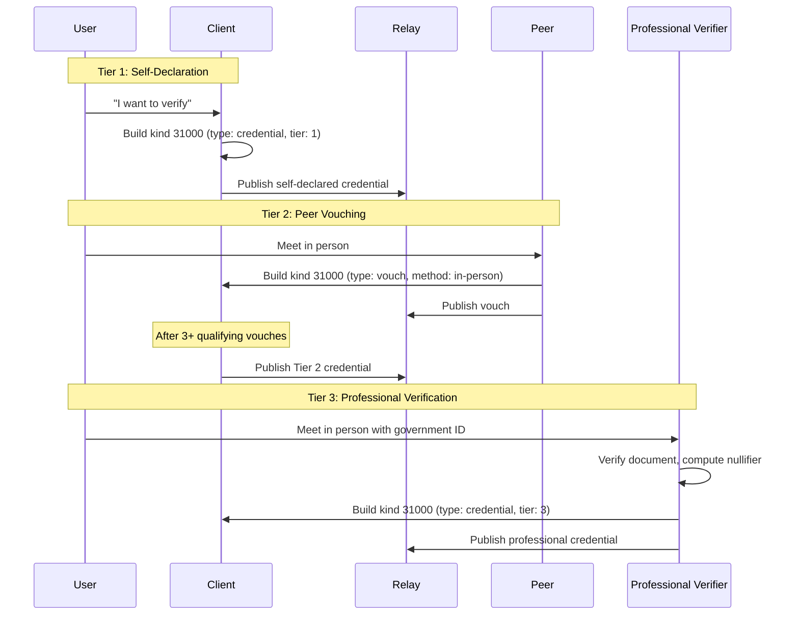

NIP-SIGNET
==========

Progressive Identity Verification
-----------------------------------

`draft` `optional`

Authors: [forgesworn](https://github.com/forgesworn)

Tag conventions on kind 31000 ([NIP-VA](https://github.com/nostr-protocol/nips/blob/master/va.md)) for progressive identity verification, plus a community policy format on kind 30078 ([NIP-78](https://github.com/nostr-protocol/nips/blob/master/78.md)). No new event kinds.

> **Design principle:** Identity verification should be progressive (start low, build over time), privacy-preserving (no PII in events), and decentralised (no single authority). Nostr's censorship resistance is meaningless if every feed is 40% spam bots.
> **Standalone usability:** This NIP works independently on any Nostr application. It builds on NIP-VA's generic attestation format and NIP-78's app-specific data storage. The reference implementation is [`signet-protocol`](https://github.com/forgesworn/signet) (TypeScript).

## Motivation

Nostr has no identity layer. Anyone can create unlimited keypairs and claim to be anyone. The result:

- **Spam and impersonation** dominate feeds. Onboarding feels like walking into a room where everyone is shouting and nobody knows who anyone else is.
- **Web-of-trust is siloed per client.** Your trust graph on one client does not carry to another. Every client rebuilds trust from scratch.
- **No middle ground between NIP-05 and nothing.** NIP-05 proves you own a domain, not that you are a real person. There is no standard for "a professional checked my ID" or "three people I know vouched for me."
- **Regulatory pressure is real.** The UK Online Safety Act, US COPPA 2.0, EU eIDAS 2.0, and Australia's under-16 ban all mandate some form of age or identity verification. Centralised solutions (Worldcoin iris scans, government ID uploads) create surveillance infrastructure. A privacy-preserving decentralised alternative is needed.

This NIP defines a four-tier progressive verification model. Tier 1 costs nothing. Tier 2 requires social connections. Tiers 3-4 require an in-person meeting with a licensed professional. At every level, the credential is a standard Nostr event that any client can parse.

## Relationship to Existing NIPs

### NIP-VA (Kind 31000 -- Verifiable Attestations)

NIP-SIGNET is a set of tag conventions on NIP-VA's generic attestation kind. NIP-VA defines the event structure (`kind: 31000`, `d`, `p`, `type` tags); NIP-SIGNET defines specific `type` values and the additional tags each type requires. A NIP-VA-aware client that does not implement NIP-SIGNET can still parse and display attestations -- it simply will not understand the tier semantics.

### NIP-78 (Kind 30078 -- App-Specific Data)

Community verification policies are stored as NIP-78 events with a `signet:policy:*` d-tag prefix. Any client can read these policies; enforcement is opt-in.

### NIP-02 (Contact Lists)

NIP-02 follow lists are binary (follow/unfollow). NIP-SIGNET vouches are structured attestations with method, tier, and context -- they express "I met this person and I vouch for them" rather than "I follow this account."

### NIP-05 (DNS Verification)

NIP-05 proves domain ownership. NIP-SIGNET proves identity claims at varying confidence levels. They are complementary: a Tier 3 verified account may also have a NIP-05 identifier.

### Community Attestations (Kind 31871)

The community Attestations proposal (kind 31871) defines truthfulness claims about Nostr events -- "this event is accurate", "this claim is false." NIP-VA (kind 31000) consolidates this functionality into a single generic attestation kind with two modes: direct attestations (about pubkeys) and event attestations (about events). NIP-SIGNET builds on NIP-VA's direct attestation mode for identity verification specifically.

### NIP-91 (Service Attestations)

NIP-91 defines attestations of service completion between identities. It was redirected to NIP-32 labelling during review. NIP-SIGNET credentials are not service completion records -- they are identity verification attestations with tiers, professional accountability, and community policies. The concerns do not overlap.

### TSM (Trust Service Machines)

TSM (kinds 37570-37572) defines infrastructure for trust computation services -- service announcements, output standards, and service requests. NIP-SIGNET provides the raw trust signals (credentials, vouches) that a TSM service could consume to compute aggregate scores. TSM computes; NIP-SIGNET records.

### NIP-VEIL (Anonymous Trust Assertions)

NIP-VEIL provides ring-signature-backed anonymous endorsements on NIP-85 events. NIP-SIGNET's professional credentials can optionally use ring signatures for issuer anonymity (proving "one of N professionals signed this" without revealing which one). The ring signature format is defined by NIP-VEIL; NIP-SIGNET references it.

### NIP-32 (Labelling)

NIP-32 defines kind 1985 labels -- lightweight, ephemeral annotations on events or pubkeys. Labels are fire-and-forget: no `d` tag, no addressability, no expiration, no replacement semantics. NIP-91 (agent reputation) was redirected to NIP-32 on this basis.

NIP-SIGNET credentials are fundamentally different:

- **Addressable** (kind 31000 with `d` tag) -- a credential can be queried by subject, replaced by the issuer, and superseded by a newer credential. Labels cannot.
- **Expirable** -- credentials carry `expiration` tags and clients MUST check them. Labels have no lifecycle.
- **Structured** -- tiers, verification types, methods, professional metadata. Labels carry a namespace and a label string.
- **Tiered trust** -- a Tier 3 credential from a registered professional carries different weight than a Tier 1 self-declaration. Labels have no weight hierarchy.
- **Policy-gated** -- communities can require minimum tiers for participation. There is no equivalent mechanism for labels.

NIP-32 labels are the right tool for "this content is NSFW" or "this post is about #bitcoin." NIP-SIGNET credentials are the right tool for "a solicitor in London verified this person's identity."

### NIP-58 (Badges)

NIP-58 defines display-oriented badges awarded by communities (kind 30009 badge definition, kind 8 badge award, kind 30008 profile badges). Badges are achievements: "attended conference X", "top contributor", "founding member."

NIP-SIGNET credentials are identity attestations, not achievements:

- **Progressive tiers** with clear trust semantics (self-declared through professionally verified). Badges have no tier hierarchy.
- **Professional accountability** -- Tier 3-4 credentials are issued by licensed professionals whose livelihoods depend on honest attestation. Badge issuers have no such constraint.
- **Community policies** -- communities can require minimum verification tiers. There is no equivalent policy mechanism for badges.
- **Verifier network** -- registered verifiers with cross-profession validation. Badges have no issuer qualification system.

NIP-58 and NIP-SIGNET are complementary. A community could award badges AND require verification tiers. They serve different purposes: badges celebrate participation, credentials verify identity.

## Kinds

No new event kinds are introduced.

| Kind | Source | Usage |
|------|--------|-------|
| 31000 | NIP-VA | Credentials, vouches, verifier registrations, challenges |
| 30078 | NIP-78 | Community verification policies |

## Verification Tiers

| Tier | Name | What it proves | How |
|------|------|---------------|-----|
| 1 | Self-declared | "I claim I am an adult" | Self-signed credential |
| 2 | Peer-vouched | "N people who met me confirm I exist" | 3+ vouches from Tier 2+ accounts |
| 3 | Professionally verified | "A licensed professional checked my ID" | In-person verification by solicitor, notary, doctor, etc. |
| 4 | Professionally verified (child) | "A professional confirmed adult + child" | Tier 3 + child evidence (birth certificate, school record) |

Tiers are progressive: each tier subsumes the trust of lower tiers. A Tier 3 account implicitly satisfies Tier 2 and Tier 1 requirements.

---

## Attestation Type: `credential`

A verification credential attests that a subject has been verified at a specific tier.

```json
{
  "kind": 31000,
  "pubkey": "<verifier-pubkey>",
  "created_at": 1711540800,
  "tags": [
    ["d", "credential:<subject-pubkey>"],
    ["p", "<subject-pubkey>"],
    ["type", "credential"],
    ["tier", "3"],
    ["verification-type", "professional"],
    ["scope", "adult"],
    ["method", "in-person-id"],
    ["profession", "solicitor"],
    ["jurisdiction", "GB"],
    ["expiration", "1743076800"],
    ["L", "signet"],
    ["alt", "Signet Tier 3 credential for <subject-pubkey>"]
  ],
  "content": "",
  "id": "<32-byte-hex>",
  "sig": "<64-byte-hex>"
}
```

### Tags

| Tag | Status | Description |
|-----|--------|-------------|
| `d` | REQUIRED | `credential:<subject-hex-pubkey>` |
| `p` | REQUIRED | Subject's hex pubkey |
| `type` | REQUIRED | `credential` |
| `L` | RECOMMENDED | `signet` -- namespace label for filtering |
| `tier` | REQUIRED | `1`, `2`, `3`, or `4` |
| `verification-type` | REQUIRED | `self`, `peer`, or `professional` |
| `scope` | REQUIRED | `adult` or `adult+child` |
| `method` | REQUIRED | `self-declaration`, `in-person`, `online`, or `in-person-id` |
| `profession` | RECOMMENDED (Tier 3-4) | Verifier's profession (e.g. `solicitor`, `notary`, `doctor`) |
| `jurisdiction` | RECOMMENDED (Tier 3-4) | ISO 3166-1 alpha-2 country code (e.g. `GB`, `US`, `IE`) |
| `age-range` | OPTIONAL | Age range string (e.g. `18+`, `8-12`). Tier 4 SHOULD include this. |
| `expiration` | RECOMMENDED | Unix timestamp. Credentials SHOULD expire. |
| `nullifier` | OPTIONAL | SHA-256 hash of document fields. Prevents duplicate identity without revealing documents. |
| `merkle-root` | OPTIONAL | Merkle tree root of verified attributes for selective disclosure. |
| `entity-type` | OPTIONAL | `natural_person`, `persona`, or `organization` |
| `guardian` | OPTIONAL | Hex pubkey of guardian (Tier 4, may appear multiple times) |
| `supersedes` | OPTIONAL | Event ID of a previous credential this one replaces |
| `alt` | RECOMMENDED | Human-readable summary for non-aware clients |

### Tier-Specific Requirements

**Tier 1 (self-declared):** `verification-type` MUST be `self`. `method` MUST be `self-declaration`. The `pubkey` (author) and `p` tag (subject) MUST be the same keypair -- the subject signs their own credential.

**Tier 2 (peer-vouched):** `verification-type` MUST be `peer`. The credential is published after the subject accumulates sufficient vouches (see [Vouch Threshold](#vouch-threshold)). A client or aggregation service publishes the Tier 2 credential referencing the qualifying vouches.

**Tier 3 (professional):** `verification-type` MUST be `professional`. `method` MUST be `in-person-id`. `profession` and `jurisdiction` SHOULD be present. The verifier MUST be a registered professional (see [Attestation Type: `verifier`](#attestation-type-verifier)).

**Tier 4 (professional + child):** All Tier 3 requirements, plus `scope` MUST be `adult+child` and `age-range` SHOULD be present.

---

## Attestation Type: `vouch`

A vouch is a peer attestation: "I have met this person and I attest they are who they claim to be."

```json
{
  "kind": 31000,
  "pubkey": "<voucher-pubkey>",
  "created_at": 1711540800,
  "tags": [
    ["d", "vouch:<subject-pubkey>"],
    ["p", "<subject-pubkey>"],
    ["type", "vouch"],
    ["method", "in-person"],
    ["voucher-tier", "2"],
    ["voucher-score", "85"],
    ["L", "signet"],
    ["alt", "Signet vouch for <subject-pubkey>"]
  ],
  "content": "Met at London Bitcoin meetup, March 2026",
  "id": "<32-byte-hex>",
  "sig": "<64-byte-hex>"
}
```

### Tags

| Tag | Status | Description |
|-----|--------|-------------|
| `d` | REQUIRED | `vouch:<subject-hex-pubkey>` |
| `p` | REQUIRED | Subject's hex pubkey |
| `type` | REQUIRED | `vouch` |
| `method` | REQUIRED | `in-person` or `online` |
| `voucher-tier` | RECOMMENDED | Voucher's own current tier (`1`-`4`) |
| `voucher-score` | OPTIONAL | Voucher's own trust score (0-200, implementation-defined) |
| `context` | OPTIONAL | Context of the vouch (e.g. `conference`, `workplace`, `family`) |
| `expiration` | OPTIONAL | Unix timestamp |
| `alt` | RECOMMENDED | Human-readable summary |

### `content`

Free-text comment about the vouch (e.g. "Met at conference"). MAY be empty.

### Vouch Threshold

A subject reaches Tier 2 when they accumulate **3 or more** qualifying vouches from accounts that are themselves Tier 2 or higher. In-person vouches carry more weight than online vouches in trust score computation, but both count towards the threshold. The threshold of 3 and minimum voucher tier of 2 are defaults; community policies (see below) MAY override these values.

---

## Attestation Type: `verifier`

A verifier registration declares that a professional is available to perform identity verification.

```json
{
  "kind": 31000,
  "pubkey": "<verifier-pubkey>",
  "created_at": 1711540800,
  "tags": [
    ["d", "verifier:<verifier-pubkey>"],
    ["type", "verifier"],
    ["profession", "solicitor"],
    ["jurisdiction", "GB"],
    ["licence", "a1b2c3d4e5f6..."],
    ["body", "Law Society"],
    ["L", "signet"],
    ["alt", "Signet verifier: solicitor in GB"]
  ],
  "content": "Available for identity verification appointments in London.",
  "id": "<32-byte-hex>",
  "sig": "<64-byte-hex>"
}
```

### Tags

| Tag | Status | Description |
|-----|--------|-------------|
| `d` | REQUIRED | `verifier:<verifier-hex-pubkey>` |
| `type` | REQUIRED | `verifier` |
| `profession` | REQUIRED | Professional title (e.g. `solicitor`, `notary`, `doctor`) |
| `jurisdiction` | REQUIRED | ISO 3166-1 alpha-2 country code |
| `licence` | REQUIRED | Hash of licence/registration number (not the raw number) |
| `body` | REQUIRED | Professional body name (e.g. `Law Society`, `GMC`, `Notary Commission`) |
| `alt` | RECOMMENDED | Human-readable summary |

### `content`

Free-text statement (availability, location, contact method). MAY be empty.

### Cross-Verification

A verifier SHOULD accumulate 2 or more vouches from other verifiers of **different professions** before their credentials carry full weight. This prevents same-profession collusion. Cross-verification vouches use the standard `vouch` type with `context: cross-verification`.

---

## Attestation Type: `challenge`

A challenge flags a verifier for suspicious behaviour.

```json
{
  "kind": 31000,
  "pubkey": "<challenger-pubkey>",
  "created_at": 1711540800,
  "tags": [
    ["d", "challenge:<verifier-pubkey>"],
    ["p", "<verifier-pubkey>"],
    ["type", "challenge"],
    ["reason", "anomalous-volume"],
    ["L", "signet"],
    ["alt", "Signet challenge against <verifier-pubkey>"]
  ],
  "content": "Issued 50 credentials in one hour from a single IP.",
  "id": "<32-byte-hex>",
  "sig": "<64-byte-hex>"
}
```

### Tags

| Tag | Status | Description |
|-----|--------|-------------|
| `d` | REQUIRED | `challenge:<verifier-hex-pubkey>` |
| `p` | REQUIRED | Challenged verifier's hex pubkey |
| `type` | REQUIRED | `challenge` |
| `reason` | REQUIRED | One of: `anomalous-volume`, `registry-mismatch`, `fraudulent-attestation`, `licence-revoked`, `other` |
| `alt` | RECOMMENDED | Human-readable summary |

### `content`

Evidence supporting the challenge. MAY be empty, but SHOULD contain specific details.

### Challenge Resolution

If **5 or more** Tier 3+ accounts publish challenges against the same verifier, clients SHOULD consider the verifier's credentials suspect. The threshold of 5 is a default; implementations MAY adjust. Challenge resolution is a social process, not an automated one -- the numbers guide human judgement, not replace it.

---

## Community Policies (Kind 30078)

A community, relay, or group operator publishes a verification policy declaring minimum requirements for participation.

```json
{
  "kind": 30078,
  "pubkey": "<operator-pubkey>",
  "created_at": 1711540800,
  "tags": [
    ["d", "signet:policy:my-community"],
    ["adult-min-tier", "2"],
    ["child-min-tier", "4"],
    ["min-score", "50"],
    ["enforcement", "client"],
    ["alt", "Signet verification policy for my-community"]
  ],
  "content": "Family-friendly community. Adults need Tier 2, children need Tier 4.",
  "id": "<32-byte-hex>",
  "sig": "<64-byte-hex>"
}
```

### Tags

| Tag | Status | Description |
|-----|--------|-------------|
| `d` | REQUIRED | `signet:policy:<community-id>` |
| `adult-min-tier` | OPTIONAL | Minimum tier for adult participants (`1`-`4`). Default: `1`. |
| `child-min-tier` | OPTIONAL | Minimum tier for child participants (`1`-`4`). Default: same as `adult-min-tier`. |
| `min-score` | OPTIONAL | Minimum trust score (0-200, implementation-defined). |
| `enforcement` | OPTIONAL | `client` (display-only), `relay` (AUTH-gated), or `both`. Default: `client`. |
| `alt` | RECOMMENDED | Human-readable summary |

### `content`

Human-readable community description. MAY be empty.

### Policy Enforcement

- **`client`**: Clients check credentials before allowing interaction. Non-compliant users see a message explaining the requirement.
- **`relay`**: Relay requires NIP-42 AUTH and checks the authenticated pubkey's credentials before accepting events. Non-compliant users receive a `CLOSED` message.
- **`both`**: Both client and relay enforce.

Policy enforcement is always opt-in. A client that does not implement NIP-SIGNET ignores these events entirely.

---

## Protocol Flow



## REQ Filters

### Fetch credentials for a pubkey

```json
{"kinds": [31000], "#p": ["<subject-pubkey>"], "#type": ["credential"]}
```

### Fetch vouches for a pubkey

```json
{"kinds": [31000], "#p": ["<subject-pubkey>"], "#type": ["vouch"]}
```

### Fetch all credentials and vouches (badge computation)

```json
{"kinds": [31000], "#p": ["<subject-pubkey>"], "#type": ["credential", "vouch"]}
```

### Discover verifiers in a jurisdiction

```json
{"kinds": [31000], "#type": ["verifier"], "#jurisdiction": ["GB"]}
```

Note: `jurisdiction` and `type` are multi-letter tags. Relays that do not support generic tag filtering will return all kind 31000 events; clients MUST post-filter. As a fallback, clients can filter by `d` tag prefix (e.g. `#d: ["credential:"]` to fetch credentials) since `d` is a single-letter tag with universal relay support.

### Fetch community policy

```json
{"kinds": [30078], "#d": ["signet:policy:<community-id>"]}
```

## Implementation Levels

### Level 1: Display Badges (one weekend)

Read kind 31000 credentials and vouches from relays. Count credentials per tier, count vouches. Display a badge on profiles:

- No credentials: "Unverified"
- Tier 1: "Self-declared"
- Tier 2: "Vouched" (+ vouch count)
- Tier 3+: "Verified" (+ profession if present)

No cryptography beyond standard Nostr event signature verification.

### Level 2: Issue Vouches (a few days)

Add the ability to publish kind 31000 `type:vouch` events. Requires Schnorr signing (which every Nostr client already does) and relay write access. Users can now build each other's trust by vouching.

### Level 3: Full Protocol (weeks)

Professional credential issuance, verifier lifecycle management, community policy parsing and enforcement, guardian delegation, credential chains. Reference: [`signet-protocol`](https://github.com/forgesworn/signet) TypeScript library.

## Validation Rules

| Rule | Check | Semantics |
|------|-------|-----------|
| V-SIG-01 | `type` tag MUST be one of: `credential`, `vouch`, `verifier`, `challenge` | Reject unknown types silently |
| V-SIG-02 | `tier` MUST be `1`, `2`, `3`, or `4` | Reject credentials with invalid tiers |
| V-SIG-03 | Tier 1 credential: `pubkey` MUST equal `p` tag value | Self-declaration must be self-signed |
| V-SIG-04 | Tier 3-4 credential: `verification-type` MUST be `professional` | Professional tiers require professional verification |
| V-SIG-05 | Tier 4 credential: `scope` MUST be `adult+child` | Child safety tier requires child scope |
| V-SIG-06 | `expiration` tag, if present, MUST be a valid future unix timestamp at time of creation | Reject pre-expired credentials |
| V-SIG-07 | `nullifier` tag, if present, MUST be a 64-character hex string (SHA-256) | Malformed nullifiers indicate tampering |
| V-SIG-08 | `method` on vouch MUST be `in-person` or `online` | Reject unknown vouch methods |
| V-SIG-09 | Verifier: `profession`, `jurisdiction`, `licence`, `body` all REQUIRED | Incomplete verifier registrations are invalid |
| V-SIG-10 | Challenge: `reason` MUST be a defined reason code | Reject unknown challenge reasons |
| V-SIG-11 | Policy `d` tag MUST begin with `signet:policy:` | Policies with other d-tag prefixes are not Signet policies |
| V-SIG-12 | Policy tier values MUST be `1`-`4` if present | Reject out-of-range tier requirements |

## Security Considerations

### Credential Forgery

All credentials are standard Nostr events verified by Schnorr signature. A forged credential would require the verifier's private key. Clients MUST verify event signatures before trusting tier claims.

### Tier Spoofing

A malicious actor could publish a self-signed Tier 3 credential. Clients MUST check that Tier 3-4 credentials are signed by a registered verifier (a pubkey with a valid `type:verifier` event). Self-signed credentials at Tier 3+ SHOULD be rejected or flagged.

### Sybil Vouching

An attacker could create multiple keypairs to self-vouch. The Tier 2 threshold requires vouchers to themselves be Tier 2+, creating a bootstrapping barrier. New accounts cannot self-promote by vouching for each other in a closed loop. The first Tier 2 accounts must be bootstrapped from Tier 3 professional verification or from a pre-existing trust network.

### Verifier Collusion

Professionals from the same field could collude to issue fraudulent credentials. Cross-verification across different professions mitigates this (a solicitor vouching for another solicitor carries less weight than a solicitor vouching for a doctor). The challenge mechanism provides a decentralised accountability layer.

### PII Protection

No personally identifiable information appears in any event. Names, dates of birth, addresses, and document numbers are never published. The `nullifier` tag is a one-way SHA-256 hash that prevents duplicate identity without revealing the source document. The `merkle-root` tag enables selective disclosure of verified attributes without exposing the full set.

### Policy Evasion

A user could ignore community policies. Client-side enforcement is advisory; relay-side enforcement (NIP-42 AUTH + credential check) is stronger. The `both` enforcement level is recommended for high-trust communities.

### Expiration

Credentials SHOULD include an `expiration` tag. Clients MUST check expiration before displaying badges. Expired credentials SHOULD be visually distinguished (e.g. greyed out) rather than hidden, to preserve the audit trail.

## Test Vectors

### Minimal Valid Tier 1 Credential

```json
{
  "kind": 31000,
  "tags": [
    ["d", "credential:aabbccdd..."],
    ["p", "aabbccdd..."],
    ["type", "credential"],
    ["tier", "1"],
    ["verification-type", "self"],
    ["scope", "adult"],
    ["method", "self-declaration"]
  ],
  "content": ""
}
```

Valid when `pubkey` equals the `p` tag value.

### Minimal Valid Vouch

```json
{
  "kind": 31000,
  "tags": [
    ["d", "vouch:aabbccdd..."],
    ["p", "aabbccdd..."],
    ["type", "vouch"],
    ["method", "in-person"]
  ],
  "content": ""
}
```

Valid when `pubkey` differs from the `p` tag value (you cannot vouch for yourself).

### Invalid: Self-Signed Tier 3

```json
{
  "kind": 31000,
  "tags": [
    ["d", "credential:aabbccdd..."],
    ["p", "aabbccdd..."],
    ["type", "credential"],
    ["tier", "3"],
    ["verification-type", "professional"],
    ["scope", "adult"],
    ["method", "in-person-id"]
  ],
  "content": ""
}
```

INVALID when `pubkey` equals the `p` tag value. Tier 3 credentials MUST be signed by a different pubkey (the professional verifier).

### Invalid: Vouch with Unknown Method

```json
{
  "kind": 31000,
  "tags": [
    ["d", "vouch:aabbccdd..."],
    ["p", "aabbccdd..."],
    ["type", "vouch"],
    ["method", "telepathy"]
  ],
  "content": ""
}
```

INVALID: `method` must be `in-person` or `online`.

## Dependencies

- [NIP-VA](https://github.com/nostr-protocol/nips/blob/master/va.md) (Kind 31000 -- Verifiable Attestations) -- REQUIRED
- [NIP-78](https://github.com/nostr-protocol/nips/blob/master/78.md) (Kind 30078 -- App-Specific Data) -- REQUIRED for community policies
- [NIP-40](https://github.com/nostr-protocol/nips/blob/master/40.md) (Expiration Timestamp) -- RECOMMENDED for credential expiration
- [NIP-42](https://github.com/nostr-protocol/nips/blob/master/42.md) (Authentication of Clients to Relays) -- OPTIONAL for relay-side policy enforcement

## Reference Implementation

- [`signet-protocol`](https://github.com/forgesworn/signet) -- TypeScript protocol library (npm: `signet-protocol`)
- [`nostr-bray`](https://github.com/forgesworn/bray) -- MCP server with full Signet integration (badge display, vouch issuance, policy checking)
