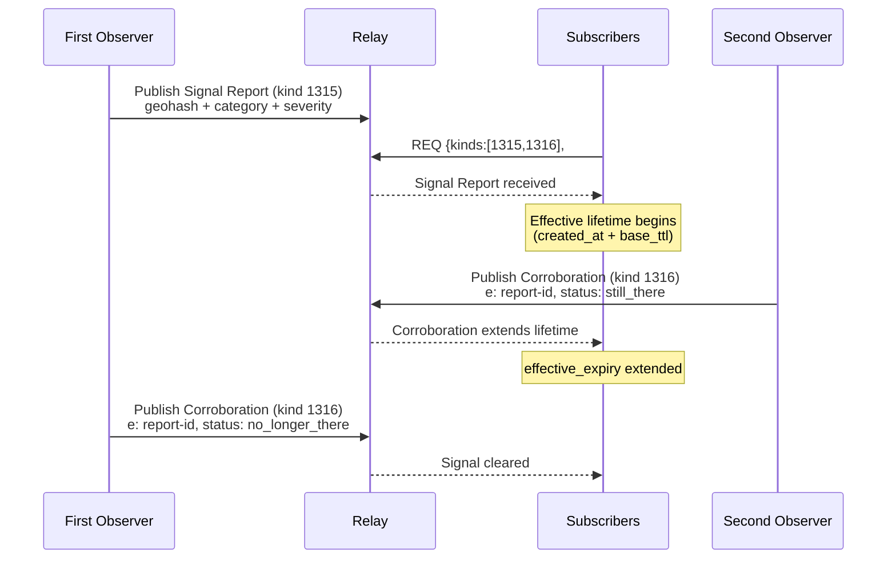

NIP-SPATIAL-SIGNALS
===================

Spatial Signals & Corroboration
-------------------------------

`draft` `optional`

Two regular event kinds for reporting location-bound real-world conditions and publishing follow-up corroboration on Nostr. A report declares that a spatial condition exists at a place; corroborations extend or curtail its effective lifetime. The same pair supports road hazards, pickup and access issues, temporary closures, security perimeters, weather alerts, and similar public geospatial signals.

> **Standalone.** This NIP works independently on any Nostr application.

## Motivation

Many physical-world applications need to publish conditions that are tied to a place but not owned by any single task lifecycle:

- a crash or closure affecting route planning
- a blocked loading bay affecting delivery pickup
- a temporary access restriction affecting event entry
- a flood warning affecting field-service dispatch
- a security perimeter affecting on-site worker safety

Existing implementations tend to invent their own kinds, tag names, and expiry rules. That makes interoperability weak even when the underlying pattern is the same: "there is a condition at this place" followed by "it is still there" or "it is no longer there."

This NIP standardises that core pattern:

- one kind for the initial spatial report
- one kind for corroboration
- geohash-indexed querying
- client-side effective lifetime derived from confirmations

It does **not** attempt to standardise trust scores, dispatch policy, UI treatment, or a universal category taxonomy.

## Prior Art

This draft is informed by existing road-hazard reporting work in the Nostr ecosystem, including Roadstr's use of `kind:1315` and `kind:1316` for report and corroboration flows. The aim here is not to replace that work, but to extract a smaller domain-agnostic core that other applications can adopt while remaining compatible where semantics align.

## Kinds

| kind | description                  |
| ---- | ---------------------------- |
| 1315 | Spatial Signal Report        |
| 1316 | Spatial Signal Corroboration |

Both kinds are regular stored events (NIP-01). They are intentionally append-only observations, not replaceable state snapshots.

## Kind Allocation

Kinds `1315` and `1316` are suitable for a compact report/corroboration pair and are already used by at least one road-hazard implementation in the ecosystem. This draft uses that same pair to avoid fragmenting incident-style spatial signaling across multiple incompatible kind pairs.

This NIP stands on its own. Implementers MAY adopt it without waiting for cross-project approval. Existing feeds that already emit compatible `1315` / `1316` events can be treated as profile implementations when their tags and expiry rules align.

## Design Boundary

This NIP standardises:

- report/corroboration event structure
- geospatial indexing via `g` tags
- relay-side expiration versus client-side effective lifetime
- minimal semantics for "still applies" and "cleared"

This NIP does **not** standardise:

- reputation or anti-spam weighting
- mandatory global category values for `t`
- routing or dispatch logic
- legal/compliance obligations
- operator workflows or escalation policies

Those belong to profiles or application policy.

## Protocol Flow



## Core Concepts

### Exact-Match Geohash Filtering

Nostr `#g` filters are exact-match, not prefix-match. If a report only contains `["g", "gcpuuz"]`, a query for `#g=["gcpu"]` will not match it.

For that reason, publishers SHOULD include a **precision ladder** of multiple geohash prefixes. Profiles MUST define the required precision set. A common default is precision 4, 5, and 6.

Subscribers SHOULD query the target cell plus neighboring cells, following the nine-cell strategy described in [NIP-LOCATION](./NIP-LOCATION.md).

### Relay Expiration vs Effective Lifetime

This NIP distinguishes between:

- **Relay-side expiration** via the NIP-40 `expiration` tag, which tells relays when they may garbage-collect the event
- **Effective lifetime**, which determines whether clients should still surface the signal to users

Relay expiration is a storage concern. Effective lifetime is a product and routing concern.

### Profiles

A profile adopting this NIP MUST define:

- the allowed `t` values (signal categories)
- the precision ladder required for `g` tags
- how to derive the base effective TTL for a report
- whether public `lat`/`lon` tags are required, optional, or forbidden
- any additional extension tags it relies on

Any application domain can define profiles without changing the two core kinds.

### Default Profile

Standalone implementors who do not want to define a full profile MAY use the following minimal defaults:

- **Default TTL:** 24 hours (86400 seconds). The base effective lifetime for any report category not otherwise specified.
- **Default categories (`t` values):** `hazard`, `closure`, `condition`, `event`.
- **Default severity values:** `info`, `warning`, `danger` (carried via a `severity` extension tag; see the example below).
- **Default `g` tag precision ladder:** precision 4, 5, and 6.
- **Default publication mode:** precise public (public `lat` and `lon` tags included).
- **Relay-side `expiration`:** `created_at + 1209600` (14 days).

Applications defining domain-specific profiles SHOULD extend or override these defaults.

### Publication Modes

This NIP supports two common publication modes:

1. **Precise public:** The report includes public `lat` and `lon` tags.
2. **Coarse public + private follow-up:** The report includes only coarse `g` tags publicly; exact coordinates are shared separately via [NIP-LOCATION](./NIP-LOCATION.md) `kind:20501` or another encrypted channel.

Profiles MUST state which mode they use.

## Spatial Signal Report (`kind:1315`)

A spatial signal report declares that a condition exists at a place.

The `.content` field is a plain-text optional comment. An empty string `""` indicates no comment.

### Tags

| Tag          | Requirement       | Description |
| ------------ | ----------------- | ----------- |
| `t`          | REQUIRED, 1+      | Signal category from the active profile registry. The first `t` tag identifies the primary category; additional `t` tags MAY refine classification. |
| `g`          | REQUIRED, 1+      | Geohash ladder values used for relay-side spatial filtering. Profiles MUST define the required precisions. |
| `expiration` | REQUIRED          | NIP-40 relay expiry timestamp. Profiles MUST define how this value is computed. |
| `lat`        | OPTIONAL          | Public latitude as a decimal string. If present, `lon` MUST also be present. |
| `lon`        | OPTIONAL          | Public longitude as a decimal string. If present, `lat` MUST also be present. |
| `alt`        | RECOMMENDED       | Human-readable fallback per NIP-31. |

Common extension tags that profiles MAY define include `severity`, `domain`, `context`, `task_id`, and `a` or `e` references to related events.

### Example

```json
{
  "kind": 1315,
  "pubkey": "<publisher-hex-pubkey>",
  "created_at": 1700000000,
  "tags": [
    ["t", "road_closure"],
    ["t", "road"],
    ["g", "u2ed"],
    ["g", "u2edc"],
    ["g", "u2edcg"],
    ["lat", "48.8566140"],
    ["lon", "2.3522219"],
    ["severity", "high"],
    ["expiration", "1701209600"],
    ["alt", "Road closure reported"]
  ],
  "content": "Left lane closed near the junction."
}
```

## Spatial Signal Corroboration (`kind:1316`)

A corroboration event declares whether a previously reported condition is still present or has cleared.

The `.content` field is a plain-text optional comment. An empty string `""` indicates no comment.

### Tags

| Tag          | Requirement       | Description |
| ------------ | ----------------- | ----------- |
| `e`          | REQUIRED          | Event ID of the referenced `kind:1315` report. |
| `g`          | REQUIRED, 1+      | Geohash ladder values for the corroborated location. If the report published multiple `g` tags, the corroboration SHOULD repeat the same set. |
| `status`     | REQUIRED          | Either `still_there` or `no_longer_there`. |
| `expiration` | REQUIRED          | NIP-40 relay expiry timestamp. Profiles MUST define how this value is computed. |
| `lat`        | OPTIONAL          | Public latitude as a decimal string. If present, `lon` MUST also be present. |
| `lon`        | OPTIONAL          | Public longitude as a decimal string. If present, `lat` MUST also be present. |
| `alt`        | RECOMMENDED       | Human-readable fallback per NIP-31. |

Duplicating `g` and, where public, `lat`/`lon` enables clients to fetch reports and corroborations in one spatial query instead of resolving every confirmation through an `#e` lookup.

### Status Semantics

| Status            | Meaning |
| ----------------- | ------- |
| `still_there`     | The reporting party or corroborator observed that the condition still applies. |
| `no_longer_there` | The reporting party or corroborator observed that the condition has cleared or should no longer be surfaced. |

### Example

```json
{
  "kind": 1316,
  "pubkey": "<publisher-hex-pubkey>",
  "created_at": 1700003600,
  "tags": [
    ["e", "<report-event-id>"],
    ["g", "u2ed"],
    ["g", "u2edc"],
    ["g", "u2edcg"],
    ["status", "still_there"],
    ["lat", "48.8566140"],
    ["lon", "2.3522219"],
    ["expiration", "1701213200"],
    ["alt", "Condition confirmed"]
  ],
  "content": ""
}
```

## Effective Lifetime

Each profile MUST define a deterministic **base effective TTL** for a report category. This may be:

- a lookup table keyed by the primary `t` value
- a derivation rule based on tags
- a fixed TTL applied to all reports in the profile

Clients compute the effective expiration like this:

1. Base effective expiry = `report.created_at + base_ttl(report)`
2. For each corroboration with `status = still_there`, extend:
   - `effective_expiry = max(effective_expiry, corroboration.created_at + base_ttl(report))`
3. For each corroboration with `status = no_longer_there`, reduce:
   - `effective_expiry = min(effective_expiry, corroboration.created_at)`

Clients SHOULD NOT surface signals whose effective expiry has passed, even if the relay-side `expiration` has not yet been reached.

## Querying

Clients typically fetch reports and corroborations together:

```json
{
  "kinds": [1315, 1316],
  "#g": ["u2edc", "u2edd", "u2edb", "u2ed9", "u2edf", "u2ed8", "u2ed6", "u2ed3", "u2ed2"],
  "since": 1699993200
}
```

The `#g` set SHOULD include the target geohash cell and neighboring cells at the chosen precision.

Clients MAY additionally filter by `#t` when they only care about certain signal categories.

## Profile Guidance

### Road Hazard Profile

A road-hazard profile can fit this NIP directly:

- `kind:1315` is the road event report
- `kind:1316` is the confirmation event
- `t` values are road-specific categories such as `accident`, `traffic_jam`, `road_closure`, and `pothole`
- `g` ladder is fixed at precision 4, 5, and 6
- public `lat` and `lon` are required
- relay-side `expiration` is fixed at `created_at + 1209600` (14 days)
- base effective TTL is determined by the road event category

One existing implementation already follows this shape closely, so interoperability is available even without a shared governance process.

### Domain-Specific Profile Extensions

Domain-specific applications can adopt the same two kinds for public or semi-public operating conditions such as:

- `pickup_access_issue`
- `dropoff_restriction`
- `security_perimeter`
- `weather_hazard`
- `site_closure`

Typical domain-specific extensions include:

- `domain` to identify the active service domain
- `context` or `task_id` to scope the signal to an active task or route
- coarse-public publication, with exact coordinates shared separately via NIP-LOCATION `kind:20501`

Trust weighting, operator policy, and domain-specific UI treatment remain outside this NIP.

## Multi-Letter Tag Filtering

This NIP uses the multi-letter tag `status` on corroboration events. Standard Nostr relays index only single-letter tags for `#` filter queries. The `status` tag is stored in events and readable by clients, but cannot be used in relay-side `REQ` filters. Clients SHOULD filter by `kind` and use single-letter tags (`e`, `g`, `t`) for relay queries, then apply `status` filtering client-side.

Extension tags that profiles MAY define (such as `severity`, `domain`, `context`, `task_id`) are also multi-letter and subject to the same limitation.

## Test Vectors

### Kind 1315 - Spatial Signal Report

```json
{
  "kind": 1315,
  "pubkey": "a1b2c3d4e5f6a1b2c3d4e5f6a1b2c3d4e5f6a1b2c3d4e5f6a1b2c3d4e5f6a1b2",
  "created_at": 1700000000,
  "tags": [
    ["t", "road_closure"],
    ["t", "road"],
    ["g", "u2ed"],
    ["g", "u2edc"],
    ["g", "u2edcg"],
    ["lat", "48.8566140"],
    ["lon", "2.3522219"],
    ["severity", "high"],
    ["expiration", "1701209600"],
    ["alt", "Road closure reported"]
  ],
  "content": "Left lane closed near the junction.",
  "id": "<32-byte-hex>",
  "sig": "<64-byte-hex>"
}
```

### Kind 1316 - Spatial Signal Corroboration

```json
{
  "kind": 1316,
  "pubkey": "b2c3d4e5f6a1b2c3d4e5f6a1b2c3d4e5f6a1b2c3d4e5f6a1b2c3d4e5f6a1b200",
  "created_at": 1700003600,
  "tags": [
    ["e", "f1e2d3c4b5a6f1e2d3c4b5a6f1e2d3c4b5a6f1e2d3c4b5a6f1e2d3c4b5a6f1e2"],
    ["g", "u2ed"],
    ["g", "u2edc"],
    ["g", "u2edcg"],
    ["status", "still_there"],
    ["lat", "48.8566140"],
    ["lon", "2.3522219"],
    ["expiration", "1701213200"],
    ["alt", "Condition confirmed"]
  ],
  "content": "",
  "id": "<32-byte-hex>",
  "sig": "<64-byte-hex>"
}
```

## Security and Privacy Considerations

- **Sybil resistance is out of scope.** Applications SHOULD apply reputation, proof-of-work, allowlists, operator policy, or other anti-spam controls when relevant.
- **Public coordinates are sensitive.** Profiles serving privacy-sensitive domains SHOULD avoid public `lat`/`lon` and prefer coarse `g` tags plus encrypted follow-up.
- **`alt` and `content` may leak details.** Publishers SHOULD avoid including personal data or unnecessary identifying information in public text fields.
- **Relay deletion is not user deletion.** NIP-40 `expiration` helps relay garbage collection, but it does not guarantee legal erasure from downstream caches.

## References

- [NIP-01](https://github.com/nostr-protocol/nips/blob/master/01.md): Basic protocol flow and event kinds
- [NIP-31](https://github.com/nostr-protocol/nips/blob/master/31.md): Dealing with unknown event kinds (`alt`)
- [NIP-40](https://github.com/nostr-protocol/nips/blob/master/40.md): Expiration timestamps
- [NIP-LOCATION](./NIP-LOCATION.md): Privacy-preserving location sharing and nine-cell subscription guidance
