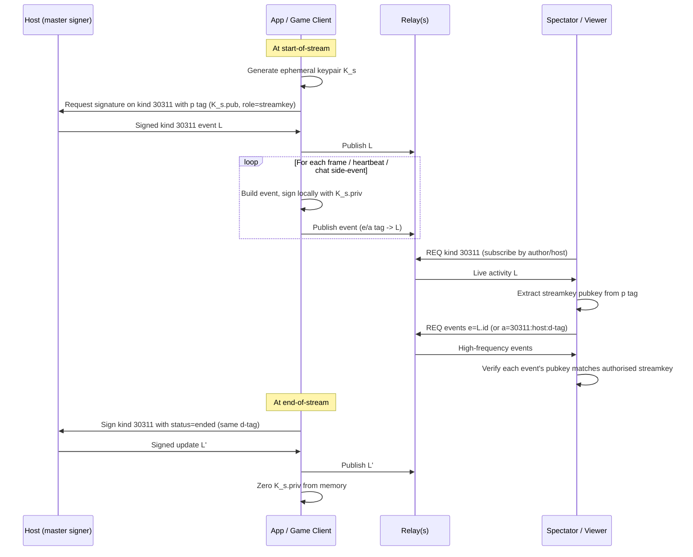

NIP-STREAMKEY
=============

Ephemeral Session Keys for Live Streaming Activities
----------------------------------------------------

`draft` `optional`

Authors: [ForgeSworn](https://github.com/forgesworn)

This NIP extends [NIP-53](https://github.com/nostr-protocol/nips/blob/master/53.md) "Live Activities" with a convention for authorising an ephemeral session keypair to sign events on behalf of a host for the duration of one live stream. The master signer signs a single kind `30311` event that names the ephemeral pubkey via a `p` tag with role `streamkey`. All subsequent high-frequency events for that stream (telemetry, chat side-channels, presence beacons) are signed locally by the ephemeral key. The session key is held in memory only and zeroed at end-of-stream.

## Motivation

Live activities on Nostr increasingly involve publishing high-frequency events during a single session: per-frame game state, audio-reactive metadata, sensor telemetry, presence heartbeats, low-latency chat. Each such event currently requires a round-trip to the master signer (NIP-07, NIP-46, hardware). For a stream publishing at 2 Hz across a 30-minute run that is 3,600 signer prompts. For NIP-46 (remote signer) the latency cost alone makes the publish cadence infeasible from a mobile device, and the user experience of repeated approval prompts is incompatible with playing a game or holding a conversation.

The host does not want to expose their long-lived signing key to the application either. Browser games, embedded sensors, and untrusted clients should not see the master's private material. What is needed is a per-session capability that:

1. Is authorised once at start-of-stream by the master's existing signer.
2. Carries a clear scope (this live activity, this duration, these event kinds).
3. Can be verified by any spectator from a single NIP-53 fetch.
4. Expires naturally when the stream ends, with no key-revocation infrastructure.

NIP-STREAMKEY defines exactly that, as a small additive convention on existing NIP-53 events.

### Why not NIP-26 (Delegated Event Signing)?

NIP-26 was deprecated and is not widely implemented. It also delegates signing globally for a kind/time window with no tie to a specific activity or content. STREAMKEY delegation is scoped to a single NIP-53 live event: the authorisation is the live event itself, the d-tag identifies the run, and the status tag terminates the delegation. There is no separate delegation event to track, replicate or revoke.

### Why not sign every event with the master key?

For desktop NIP-07 the round-trip is fast but every popup interrupts gameplay or conversation. For NIP-46 the round-trip is measured in seconds against a remote bunker and can be batched only at the cost of liveness. For hardware signers the per-event prompt is impractical. A single signer interaction per live activity is acceptable; thousands are not.

### Why not just publish unsigned frames or use the master pubkey without a signature?

Unsigned events violate NIP-01 and cannot be relayed. Mis-attributing frames to the master pubkey without a real signature would let any party forge frames trivially. STREAMKEY preserves end-to-end verifiability: every frame is properly schnorr-signed by a pubkey that is master-authorised in a verifiable kind `30311` event.

### Why not use a long-lived dedicated streaming pubkey?

A reused key cannot be safely held in browser memory (XSS recovers it across sessions). A reused key also fails to scope the authorisation to a single stream, so a compromised client could continue publishing forged frames after the host has finished playing. STREAMKEY is intentionally per-session: generated client-side at start-of-stream, never persisted, zeroed at end-of-stream.

## Overview



## Specification

### Authorising a session key

A host that wishes to stream high-frequency events for a single live activity SHOULD:

1. Generate a fresh secp256k1 keypair `K_s` using a CSPRNG. The private key MUST NOT be persisted to disk or any backing store.
2. Build a NIP-53 kind `30311` event template as defined in NIP-53, with:
   - A `d` tag uniquely identifying the run (e.g. `<application>:<host-pubkey>:<run-id>`).
   - A `status` tag of `live`.
   - The host's own pubkey in a `p` tag with role `Host`, per NIP-53.
   - **The session pubkey `K_s.pub` (32-byte x-only, lowercase hex) in an additional `p` tag with role `streamkey`.**
3. Sign the kind `30311` template with the master signer (NIP-07 / NIP-46 / hardware) and publish to the host's chosen relay set.

The resulting event is the **authorisation**: anyone able to fetch it can verify that the host has delegated streaming authority to `K_s.pub` for the duration of this activity.

### Publishing session-signed events

For the lifetime of the authorisation, the client MAY sign and publish events with `K_s.priv`. Every such event MUST include either:

- An `e` tag referencing the authorisation event id, OR
- An `a` tag of the form `30311:<host-pubkey>:<d-tag>` referencing the addressable authorisation.

Both forms are RECOMMENDED on every event so that viewers using either resolution path can locate the authorisation in a single relay round-trip.

### Verifying frames

A spectator client that observes a session-signed event SHOULD:

1. Resolve the referenced authorisation via the `a` or `e` tag.
2. Confirm the authorisation is a kind `30311` event.
3. Confirm the event's `pubkey` matches a `p` tag in the authorisation with role `streamkey`.
4. Confirm the authorisation's most recent `status` is not `ended` (a status=ended update with the same `d` tag terminates the authorisation).
5. Confirm the schnorr signature over the event id.

If any step fails, the event MUST be treated as unauthorised and SHOULD NOT be rendered as host-attributed content.

### Ending the session

At end-of-stream the client SHOULD:

1. Sign a replacement kind `30311` event with the same `d` tag, `status=ended`, and an `ends` timestamp. (One additional master-signer round-trip.) Publish.
2. Zero `K_s.priv` from process memory.

If the client cannot reach the master signer at end-of-stream (network loss, app crash), it MUST still zero `K_s.priv`. Viewers SHOULD treat a kind `30311` with no recent session-signed events as stale and degrade to `ended` heuristically after an application-defined timeout.

## Tag reference (kind 30311 additions)

| Tag | Position | Cardinality | Requirement | Purpose |
|-----|----------|-------------|-------------|---------|
| `p` | 1 (pubkey hex) | 0..1 of role `streamkey` | OPTIONAL | Authorises the session pubkey for this live activity |
| `p[3]` | role | 1 | REQUIRED if `streamkey` tag present | MUST be the literal string `streamkey` |

The `streamkey` role is an addition to NIP-53's existing role vocabulary (`Host`, `Speaker`, `Participant`). NIP-53 specifies that clients MUST tolerate unknown role values, which makes this extension safe for all existing NIP-53 clients (they simply do not render the session pubkey as a named participant).

A kind `30311` event MAY include at most one `p` tag with role `streamkey`. If multiple are present, viewers MUST ignore all of them and treat the authorisation as malformed.

### Required tags on session-signed events

| Tag | Cardinality | Requirement | Purpose |
|-----|-------------|-------------|---------|
| `a` | 1 | RECOMMENDED | `30311:<host-pubkey>:<d-tag>` -- addressable reference to the authorisation |
| `e` | 1 | RECOMMENDED | event id of the authorisation -- single-fetch resolution |
| `p` | 1 | RECOMMENDED | host pubkey -- enables author-based subscription filters |

At least one of `a` or `e` MUST be present. Both are RECOMMENDED.

## Examples

### Authorisation event (kind 30311)

```json
{
  "id": "<event id>",
  "pubkey": "<host pubkey, hex>",
  "created_at": 1731418800,
  "kind": 30311,
  "tags": [
    ["d", "pallasite:<host pubkey>:1731418795000"],
    ["title", "Playing Pallasite"],
    ["summary", "Cosmic arcade -- Lightning payouts, live Nostr telemetry."],
    ["status", "live"],
    ["starts", "1731418795"],
    ["streaming", "https://watch.pallasite.app/#p=<host pubkey>"],
    ["service", "https://pallasite.app"],
    ["image", "https://pallasite.app/logo.webp"],
    ["p", "<host pubkey>", "", "Host"],
    ["p", "<session pubkey>", "", "streamkey"],
    ["t", "gaming"]
  ],
  "content": "Playing Pallasite live. Spectators welcome.",
  "sig": "<host master signature>"
}
```

### Session-signed event (any kind, signed by the session key)

```json
{
  "id": "<event id>",
  "pubkey": "<session pubkey>",
  "created_at": 1731418802,
  "kind": 22769,
  "tags": [
    ["e", "<authorisation event id>"],
    ["a", "30311:<host pubkey>:pallasite:<host pubkey>:1731418795000"],
    ["p", "<host pubkey>"]
  ],
  "content": "<application-specific payload>",
  "sig": "<session signature>"
}
```

### End-of-stream update (kind 30311 with same d-tag)

```json
{
  "id": "<event id>",
  "pubkey": "<host pubkey, hex>",
  "created_at": 1731420600,
  "kind": 30311,
  "tags": [
    ["d", "pallasite:<host pubkey>:1731418795000"],
    ["title", "Pallasite -- run ended"],
    ["status", "ended"],
    ["ends", "1731420595"],
    ["p", "<host pubkey>", "", "Host"]
  ],
  "content": "Run ended.",
  "sig": "<host master signature>"
}
```

## Filter examples

Spectator subscribing to a host's current live activities:

```json
["REQ", "live", { "kinds": [30311], "authors": ["<host pubkey>"] }]
```

Spectator fetching all session-signed events tied to a known authorisation:

```json
["REQ", "frames", { "#e": ["<authorisation event id>"] }]
```

Or, equivalently, by addressable reference:

```json
["REQ", "frames", { "#a": ["30311:<host pubkey>:<d-tag>"] }]
```

## Validation rules

| Rule | Condition | Action |
|------|-----------|--------|
| V-SK-01 | `streamkey` `p` tag value is not 64 lowercase hex chars | Treat authorisation as malformed; ignore |
| V-SK-02 | More than one `p` tag with role `streamkey` on the same authorisation | Treat authorisation as malformed; ignore |
| V-SK-03 | Session-signed event's `pubkey` does not match the `streamkey` value in the referenced authorisation | Reject event |
| V-SK-04 | Session-signed event references an authorisation whose latest `status` is `ended` and whose `created_at` precedes the event's `created_at` | Reject event |
| V-SK-05 | Session-signed event has neither `e` nor `a` tag | Reject event |
| V-SK-06 | Authorisation event is not kind `30311` | Reject session-signed events referencing it |
| V-SK-07 | Schnorr verification of the session-signed event fails | Reject event per NIP-01 |

## Security considerations

**Session key compromise during the activity.** An attacker that obtains `K_s.priv` (via XSS, malicious extension, hostile network) can sign frames for the remainder of the activity. They cannot sign for any other activity, modify the authorisation, or impersonate the host outside the scoped role. Loss is bounded by the lifetime of the activity and by the application's renderer policy (e.g. ignore frames with implausible state jumps).

**Authorisation replacement.** Kind `30311` is parameterised-replaceable on `(pubkey, d-tag)`. A host whose master key is compromised can have its authorisation maliciously replaced. This is not a STREAMKEY-specific risk: it is the standard NIP-01 replaceable-event property. STREAMKEY does not depend on the master key being uncompromised any more than the underlying NIP-53 stream does.

**Persistence.** Clients MUST NOT write `K_s.priv` to disk, IndexedDB, localStorage, or any persistent store. Crash-recovery paths MUST regenerate a new session key on restart and sign a fresh authorisation; resuming from disk would defeat the per-session scope.

**Replay of stale authorisations.** A relay or hostile observer can replay an old `status=live` authorisation after the host has gone offline. The status=ended replacement and the `created_at` recency of session-signed events bound this: viewers that see no session-signed events for an application-defined freshness window SHOULD render the activity as stale and stop accepting frames signed against it.

**Cross-stream key reuse.** A client MUST NOT reuse a session keypair across multiple authorisations. Each kind `30311` event MUST receive a freshly generated keypair.

**Relay-side enforcement.** Relays are not required to enforce STREAMKEY semantics. Verification is the spectator client's responsibility. Relays MAY use the `streamkey` `p` tag for indexing but MUST NOT block events on it. Relays MUST NOT strip the `streamkey` `p` tag from kind `30311` events nor strip `a`/`e` tags from session-signed events; conforming clients treat such mutilated events as malformed.

## Test vectors

Minimal valid authorisation (whitespace inserted for readability; canonical form has no whitespace):

```json
{
  "kind": 30311,
  "tags": [
    ["d", "test:abcdef0123456789abcdef0123456789abcdef0123456789abcdef0123456789:1"],
    ["status", "live"],
    ["p", "abcdef0123456789abcdef0123456789abcdef0123456789abcdef0123456789", "", "Host"],
    ["p", "0123456789abcdef0123456789abcdef0123456789abcdef0123456789abcdef", "", "streamkey"]
  ],
  "content": ""
}
```

Minimal invalid authorisation (V-SK-02 -- two `streamkey` tags):

```json
{
  "kind": 30311,
  "tags": [
    ["d", "test:...:1"],
    ["status", "live"],
    ["p", "0123...cdef", "", "streamkey"],
    ["p", "fedc...3210", "", "streamkey"]
  ],
  "content": ""
}
```

Minimal valid session-signed event:

```json
{
  "pubkey": "0123456789abcdef0123456789abcdef0123456789abcdef0123456789abcdef",
  "kind": 22769,
  "tags": [
    ["e", "<authorisation event id>"],
    ["a", "30311:abcdef...:test:...:1"]
  ],
  "content": "{}"
}
```

## Reference implementation

[pallasite.app](https://pallasite.app) -- a Nostr-native arcade game -- uses STREAMKEY in production for every live run. A fresh session keypair is generated client-side at start-of-run, the master signs one kind `30311` authorisation via the player's NIP-07 or NIP-46 signer, and every subsequent frame event is signed locally with the session key over schnorr. The session private key is held only in browser memory and is zeroed at end-of-run. Source: `src/stream-session.ts` in the public Pallasite repository.

## Dependencies

- [NIP-01](https://github.com/nostr-protocol/nips/blob/master/01.md) -- event format, schnorr signatures, replaceable events
- [NIP-53](https://github.com/nostr-protocol/nips/blob/master/53.md) -- Live Activities, kind 30311 semantics, `p` tag role vocabulary

## Relationship to NIP-LIVEFRAME

[NIP-LIVEFRAME](./NIP-LIVEFRAME.md) defines an ephemeral kind for live activity state frames and is the most common consumer of STREAMKEY delegation. The two NIPs are independent: STREAMKEY MAY be used to delegate signing for any high-frequency event kind, and LIVEFRAME events MAY be signed by the master key directly (at the cost of one signer round-trip per frame).
