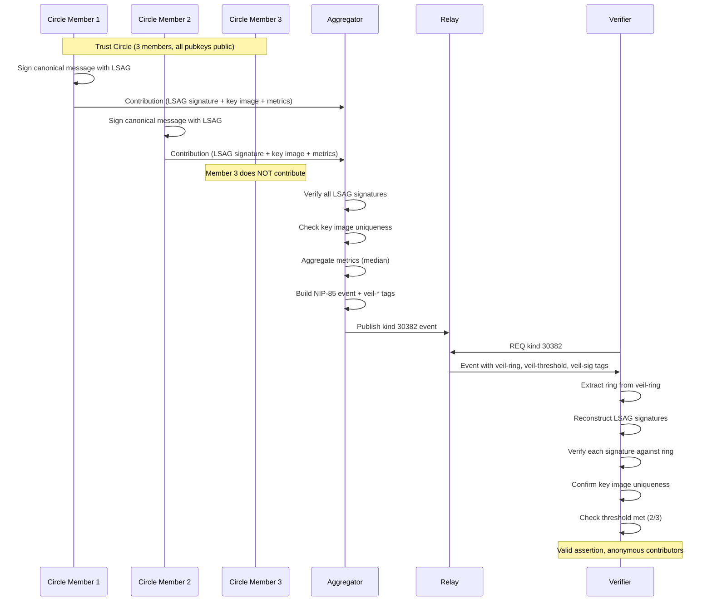
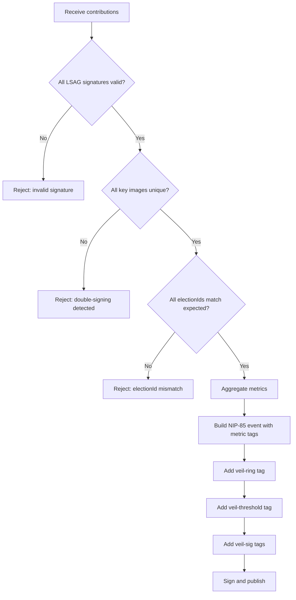
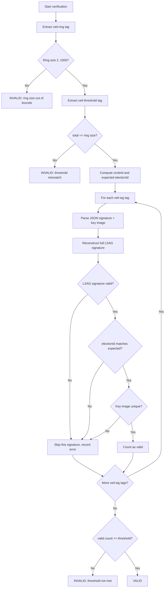

NIP-XX
======

Anonymous Trust Assertions (Veil)
----------------------------------

`draft` `optional`

Authors: [forgesworn](https://github.com/forgesworn)

This NIP extends [NIP-85](https://github.com/nostr-protocol/nips/blob/master/85.md) trusted assertion events with three tags that enable ring-signature-backed anonymous endorsements. Circle members contribute signed metrics without revealing which members contributed. The result is a standard NIP-85 event that non-aware clients process normally, while Veil-aware clients additionally verify the cryptographic proofs.

## Motivation

NIP-85 provides a foundation for trusted assertions on Nostr. A reputation service publishes metrics (follower count, activity score, zap history) about a subject, and clients display those metrics alongside profiles. The problem is attribution: every NIP-85 assertion is signed by a single pubkey, making it trivially linkable to the service that produced it.

This creates three failure modes:

1. **Retaliation risk.** A provider who gives an honest low score to a well-connected subject risks social or economic retaliation. The subject knows exactly who rated them.
2. **Cartel pressure.** Dominant reputation services can be pressured to inflate scores for favoured subjects. There is no way for a group to produce a collective assessment without revealing individual contributions.
3. **Single point of trust.** Consumers must trust one service's assessment. There is no mechanism for multiple independent observers to contribute to a single assertion while maintaining plausible deniability.

Veil solves these by allowing a defined group (a "trust circle") to contribute metrics anonymously via LSAG ring signatures. The circle membership is public -- anyone can see who COULD have contributed -- but which members actually did contribute is cryptographically hidden.

### Why not just use NIP-85?

NIP-85 handles the common case well: a reputation service with a known pubkey publishes assertions, and clients weigh those assertions by the service's own reputation. Veil is not a replacement. It is a supplementary layer for situations where individual attribution is harmful:

- Peer review among competing service providers
- Whistleblower-style trust revocations within professional groups
- Collective endorsements from industry bodies where individual votes must remain private
- Any scenario where the credibility of the assertion depends on group membership rather than individual identity

Standard NIP-85 remains the right choice for public, attributable reputation services.

### Why not NIP-32 (Labels)?

NIP-32 label events allow any pubkey to attach labels to any content. While labels can express sentiment or categorisation, they have no threshold concept, no ring membership, and fully expose the labeller's identity. They do not provide anonymity or collective assessment.

### Why not NIP-44 encrypted assertions?

NIP-44 encrypted assertions hide content from relays but not from the designated recipient. The subject still knows exactly who rated them once they decrypt. Veil provides a fundamentally different property: even the subject, with full access to the event and unlimited computation, cannot determine which circle members contributed. This is unconditional anonymity, not just transport-layer encryption.

Additionally, NIP-44 encrypted assertions break the public verifiability that makes NIP-85 useful. Anyone should be able to verify a trust assertion without needing decryption keys. Veil assertions are fully public and fully verifiable -- what they hide is the individual contributors, not the collective result.

## Overview



### Terminology

| Term | Definition |
|------|-----------|
| **Trust circle** | A fixed set of pubkeys whose members may contribute to anonymous assertions |
| **Circle ID** | SHA-256 hash of the colon-joined sorted member pubkeys -- uniquely identifies a circle |
| **Contribution** | A single member's LSAG-signed metrics for a specific subject |
| **Key image** | An LSAG-derived value that is unique per signer per election, enabling double-sign detection without revealing the signer |
| **Election ID** | A domain separator string binding an LSAG signature to a specific circle and subject, preventing signature transplant. (The term originates from the ring-signature literature where LSAG is used for anonymous voting.) |
| **Ring** | The ordered set of public keys against which an LSAG signature is verified |
| **Aggregator** | The entity (any circle member or delegate) that collects contributions, verifies signatures, and publishes the combined event |

## Tags

This NIP introduces three new tags that are added to standard NIP-85 assertion events (kinds 30382--30385).

### `veil-ring`

Contains the public keys of all trust circle members.

```json
["veil-ring", "<pk1>", "<pk2>", ..., "<pkN>"]
```

Each element after the tag name is a 64-character lowercase hex x-only public key. The keys MUST be sorted lexicographically. Minimum 2 members, maximum 1000.

**Example (3-member circle):**

```json
["veil-ring",
  "1b84c5567b126440995d3ed5aaba0565d71e1834604819ff9c17f5e9d5dd078f",
  "4d4b6cd1361032ca9bd2aeb9d900aa4d45d9ead80ac9423374c451a7254d0766",
  "531fe6068134503d2723133227c867ac8fa6c83c537e9a44c3c5bdbdcb1fe337"
]
```

The ring defines who COULD have contributed, without revealing who DID.

### `veil-threshold`

Declares how many circle members actually contributed.

```json
["veil-threshold", "<count>", "<total>"]
```

| Element | Description |
|---------|-------------|
| `count` | Number of actual contributors (matches the number of `veil-sig` tags) |
| `total` | Total circle size (matches the number of pubkeys in `veil-ring`) |

**Example (2 of 3 members contributed):**

```json
["veil-threshold", "2", "3"]
```

### `veil-sig`

One tag per contributor, carrying the LSAG signature data and key image.

```json
["veil-sig", "<json-signature>", "<key-image>"]
```

| Element | Description |
|---------|-------------|
| `json-signature` | JSON object containing `c0`, `electionId`, `message`, and `responses[]` (LSAG signature components). Keys are sorted alphabetically. The ring is NOT included -- it is in the `veil-ring` tag to avoid duplication. |
| `key-image` | Hex-encoded key image. Unique per signer per election. Used to detect double-signing. |

**Example:**

```json
["veil-sig",
  "{\"c0\":\"a1b2...\",\"electionId\":\"veil:v1:beadfb...:1b84c5...\",\"message\":\"{\\\"circleId\\\":\\\"beadfb...\\\",\\\"metrics\\\":{\\\"rank\\\":85},\\\"subject\\\":\\\"1b84c5...\\\"}\",\"responses\":[\"d4e5...\",\"f6a7...\",\"b8c9...\"]}",
  "c0d1e2f3..."
]
```

The JSON signature object contains these fields:

| Field | Type | Description |
|-------|------|-------------|
| `c0` | string | Initial challenge value of the LSAG ring signature |
| `electionId` | string | Binds the signature to this specific circle + subject |
| `message` | string | The canonical message that was signed |
| `responses` | string[] | Response values for each ring member position |
| `domain` | string (optional) | LSAG domain separator, if used |

## Tag Reference

| Tag | Status | Description |
|-----|--------|-------------|
| `d` | REQUIRED | Subject identifier (inherited from NIP-85) |
| `p` | REQUIRED | Subject pubkey (inherited from NIP-85) |
| `veil-ring` | REQUIRED | Sorted x-only hex pubkeys of all circle members |
| `veil-threshold` | REQUIRED | `["veil-threshold", "<count>", "<total>"]` |
| `veil-sig` | REQUIRED | One per contributor: `["veil-sig", "<json>", "<key-image>"]` |
| `expiration` | RECOMMENDED | NIP-40 expiration timestamp |
| Metric tags | OPTIONAL | Standard NIP-85 metric tags (`rank`, `followers`, etc.) |

## Circle Construction

### Circle ID

The circle ID is a SHA-256 hash of the sorted member pubkeys joined with colons:

```
circleId = SHA-256(sorted_pubkeys.join(':'))
```

**Example:**

Given pubkeys (already sorted):
- `1b84c5567b126440995d3ed5aaba0565d71e1834604819ff9c17f5e9d5dd078f`
- `4d4b6cd1361032ca9bd2aeb9d900aa4d45d9ead80ac9423374c451a7254d0766`
- `531fe6068134503d2723133227c867ac8fa6c83c537e9a44c3c5bdbdcb1fe337`

Input string:
```
1b84c5567b126440995d3ed5aaba0565d71e1834604819ff9c17f5e9d5dd078f:4d4b6cd1361032ca9bd2aeb9d900aa4d45d9ead80ac9423374c451a7254d0766:531fe6068134503d2723133227c867ac8fa6c83c537e9a44c3c5bdbdcb1fe337
```

Circle ID: `beadfbfe37bae31a7e2ba78c9d1565f2cb52903fdea6b98f424e0656fa7cd0d2`

### Rules

- Members MUST be sorted lexicographically before hashing
- Each pubkey MUST be a 64-character lowercase hex string (x-only format)
- Duplicate pubkeys MUST be rejected
- Minimum 2 members, maximum 1000

## Canonical Message Format

Each contributor signs a deterministic JSON string:

```json
{"circleId":"<circle-id>","metrics":{"<key1>":<val1>,...},"subject":"<subject>"}
```

Construction rules:

1. Top-level keys MUST be sorted alphabetically: `circleId`, `metrics`, `subject`
2. Metric keys MUST be sorted alphabetically within the `metrics` object
3. All metric values MUST be finite numbers (reject NaN, Infinity, -Infinity)
4. No whitespace in the serialised JSON (deterministic serialisation)
5. Keys at every nesting level MUST be sorted alphabetically

**Example:**

```json
{"circleId":"beadfbfe37bae31a7e2ba78c9d1565f2cb52903fdea6b98f424e0656fa7cd0d2","metrics":{"followers":1200,"rank":85},"subject":"1b84c5567b126440995d3ed5aaba0565d71e1834604819ff9c17f5e9d5dd078f"}
```

## Election ID

Format: `veil:v1:<circleId>:<subject>`

**Example:**

```
veil:v1:beadfbfe37bae31a7e2ba78c9d1565f2cb52903fdea6b98f424e0656fa7cd0d2:1b84c5567b126440995d3ed5aaba0565d71e1834604819ff9c17f5e9d5dd078f
```

The election ID binds an LSAG signature to a specific circle and subject combination. This prevents signature transplant attacks -- a valid signature for one subject cannot be moved to an event about a different subject. Verifiers MUST check that each signature's `electionId` matches the expected pattern derived from the `veil-ring` and `d` tag.

The `v1` component is a version identifier. Future protocol versions MAY define new election ID formats with different prefixes.

## Contribution and Aggregation

### Contributing

Each contributing member:

1. Constructs the canonical message from the circle ID, subject, and their metrics
2. Constructs the election ID from the circle ID and subject
3. Signs the message using LSAG with the full ring (all circle members' pubkeys), their private key, and the election ID
4. Sends the contribution (signature, key image, metrics) to the aggregator

### Aggregating

The aggregator:

1. Verifies all LSAG signatures against the ring before proceeding
2. Checks that all key images are unique (no double-signing)
3. Aggregates the contributed metrics using a deterministic function (RECOMMENDED: median)
4. Constructs a standard NIP-85 event with the aggregated metrics as tags
5. Adds the three `veil-*` tags
6. Signs and publishes the event



### Metric Aggregation

Implementations SHOULD use the median as the default aggregation function. The median is resistant to outlier manipulation -- a single dishonest contributor cannot skew the result beyond their own contribution.

For each metric key present in any contribution:

1. Collect all values for that key across contributions
2. Sort the values numerically
3. Return the middle value (or the rounded mean of the two middle values for even-length arrays)

Implementations MAY support alternative aggregation functions (mean, trimmed mean, mode) but MUST document which function was used. The choice of function is not encoded in the event -- verifiers trust the aggregator's stated methodology or verify by re-aggregating from the raw contributions if available out of band.

## Verification

Verifying a Veil-enhanced NIP-85 event:

1. Extract the `d` tag. If absent, reject the event. (The `d` tag is inherited from NIP-85 as REQUIRED; without it, election ID binding cannot protect against signature transplant.)
2. Extract the `veil-ring` tag. Validate that all entries are 64-character lowercase hex strings.
3. Validate ring size is between 2 and 1000 (inclusive).
4. Validate that the pubkeys in `veil-ring` are in strict lexicographic order. Reject if not. (Implementations MUST NOT silently re-sort the ring, as this would mask malformed events.)
5. Extract the `veil-threshold` tag. If absent, reject the event. Parse `count` and `total`. Verify `total` matches the ring size. Verify `count` is between 1 and `total` (inclusive).
6. Compute the expected circle ID: `SHA-256(ring_members.join(':'))`.
7. Compute the expected election ID (domain separator): `veil:v1:<circleId>:<d-tag-value>`.
8. For each `veil-sig` tag:
    - a. Parse the JSON signature data from element 1.
    - b. Extract the key image from element 2.
    - c. Reconstruct the full LSAG signature object by adding `ring` (from `veil-ring`) and `keyImage` (from element 2) to the parsed JSON.
    - d. Verify the LSAG signature.
    - e. Verify the `electionId` field matches the expected election ID. Missing `electionId` MUST be treated as failure.
    - f. Verify that the `circleId` and `subject` in the `message` field match the derived circle ID and `d` tag value respectively.
    - g. Check the key image has not appeared in a previous `veil-sig` tag within this event.
9. Count valid signatures. The event is valid if `valid_signatures >= threshold_count`.



## NIP-40 Expiration

Events SHOULD include a [NIP-40](https://github.com/nostr-protocol/nips/blob/master/40.md) `expiration` tag. Trust scores without a TTL are a social engineering vector -- stale endorsements can misrepresent current trust. A score from two years ago carries different weight than one from yesterday, but without expiration there is no protocol-level signal of staleness.

**Example:**

```json
["expiration", "1735689600"]
```

Clients SHOULD treat expired Veil assertions as informational only, not as current trust signals.

## Backwards Compatibility

Veil-enhanced events are standard NIP-85 assertion events. The three `veil-*` tags are additional metadata:

- **NIP-85 clients** that are not Veil-aware see a normal assertion event with metric tags (`rank`, `followers`, etc.). The `veil-ring`, `veil-threshold`, and `veil-sig` tags are unrecognised and ignored per standard Nostr tag behaviour.
- **Veil-aware clients** additionally extract the `veil-*` tags, verify the ring signatures, and display the circle size and threshold alongside the metrics.

No new event kinds are introduced. No changes to relay software are required.

## REQ Filter Examples

Veil events use standard NIP-85 kinds, so existing relay filters work without modification.

**Fetch all user assertions for a subject:**

```json
["REQ", "veil-1", {"kinds": [30382], "#d": ["1b84c5567b126440995d3ed5aaba0565d71e1834604819ff9c17f5e9d5dd078f"]}]
```

**Fetch assertions from a specific aggregator:**

```json
["REQ", "veil-2", {"kinds": [30382], "authors": ["<aggregator-pubkey>"]}]
```

**Fetch event assertions:**

```json
["REQ", "veil-3", {"kinds": [30383], "#d": ["<event-id>"]}]
```

Clients SHOULD post-filter results to distinguish Veil-enhanced events (presence of `veil-ring` tag) from standard NIP-85 events.

## Validation Rules

| ID | Rule |
|----|------|
| V-VL-01 | The `veil-ring` tag MUST contain at least 2 and at most 1000 pubkey elements (after the tag name). |
| V-VL-02 | Every pubkey in `veil-ring` MUST be a 64-character lowercase hex string. |
| V-VL-03 | Pubkeys in `veil-ring` MUST be sorted lexicographically. Implementations MUST reject unsorted rings. |
| V-VL-04 | Pubkeys in `veil-ring` MUST be unique. Duplicate pubkeys MUST cause rejection. |
| V-VL-05 | The `veil-threshold` tag MUST be present and MUST have exactly 3 elements: tag name, count, total. If absent, the event MUST be rejected. |
| V-VL-06 | The `total` in `veil-threshold` MUST equal the number of pubkeys in `veil-ring`. |
| V-VL-07 | The `count` in `veil-threshold` MUST be a positive integer between 1 and `total` (inclusive). |
| V-VL-08 | The number of `veil-sig` tags MUST equal the `count` in `veil-threshold`. |
| V-VL-09 | The number of `veil-sig` tags MUST NOT exceed the ring size. |
| V-VL-10 | Each `veil-sig` tag MUST have exactly 3 elements: tag name, JSON signature, key image. |
| V-VL-11 | The JSON signature in each `veil-sig` MUST contain `c0`, `electionId`, `message`, and `responses` fields. |
| V-VL-12 | The `electionId` in each signature MUST match `veil:v1:<circleId>:<d-tag-value>` where `circleId` is derived from the `veil-ring` pubkeys. |
| V-VL-13 | Each LSAG signature MUST verify against the ring from `veil-ring`. |
| V-VL-14 | All key images across `veil-sig` tags within a single event MUST be unique. |
| V-VL-15 | The `message` field in each signature MUST be valid deterministic JSON with alphabetically sorted keys at every nesting level. |
| V-VL-16 | All metric values in the canonical message MUST be finite numbers. |
| V-VL-17 | The `d` tag MUST be present. Events without a `d` tag MUST be rejected. |
| V-VL-18 | The `circleId` and `subject` in the `message` field of each `veil-sig` MUST match the derived circle ID and `d` tag value respectively. |

## Security Considerations

### Unconditional anonymity

LSAG ring signatures provide information-theoretic anonymity. Even with unlimited computational resources, an observer cannot determine which ring member produced a given signature. This is strictly stronger than computational anonymity (where a sufficiently powerful adversary could break the scheme).

### Key image linkability

Key images are deterministic per signer per election ID. This means:

- Within a single event, duplicate key images reveal double-signing (this is the intended use).
- Across events with the same election ID, the same signer produces the same key image. This is by design -- it prevents a member from contributing twice to the same assertion.
- Across events with different election IDs (different subjects or circles), key images are unlinkable. Contributing to an assertion about subject A does not reveal whether the same member contributed to an assertion about subject B.

### Circle membership visibility

The ring is embedded in the event. Anyone can see the full list of circle members. What is hidden is which members contributed. Applications where membership itself is sensitive SHOULD consider whether the `veil-ring` tag leaks unacceptable information.

### Signature transplant prevention

The election ID (`veil:v1:<circleId>:<subject>`) binds each signature to a specific circle and subject. A valid signature for subject A cannot be placed into an event about subject B -- the election ID will not match, and verification fails. Implementations MUST reject signatures with missing `electionId` fields, as stripping the field is the simplest bypass attempt.

### Maximum ring size

The maximum ring size of 1000 prevents denial-of-service via oversized rings. LSAG verification is linear in ring size -- each additional member adds one scalar multiplication. Implementations SHOULD set appropriate timeouts for verification of large rings.

### Aggregator trust

The aggregator sees all contributions before publishing. A malicious aggregator could selectively omit contributions or refuse to publish. This is mitigated by:

- Any circle member can act as aggregator
- Contributors can verify the published event contains their signature
- The aggregator cannot forge signatures (LSAG unforgeability)

The aggregator cannot learn which member produced which contribution (the contributions arrive with ring signatures, not identity-linked signatures).

### Kind 10040 collision

NIP-85 assigns kind 10040 for provider declarations, but NIP-03 (OpenTimestamps) already uses kind 10040. This is an upstream NIP-85 issue, not introduced by this NIP. Implementations SHOULD be aware of this collision when querying for kind 10040 events.

### NIP-40 expiration and stale scores

Trust assertions without expiration can be replayed indefinitely. A circle that collectively rates a subject highly today may hold a different view next year. Without expiration, the stale assertion remains on relays and appears current. Implementations SHOULD set expiration timestamps and clients SHOULD visually distinguish expired assertions.

## Test Vectors

The following test vectors use these deterministic private keys:

| Key | Private key (hex) | Public key (x-only hex) |
|-----|-------------------|-------------------------|
| A | `0101010101010101010101010101010101010101010101010101010101010101` | `1b84c5567b126440995d3ed5aaba0565d71e1834604819ff9c17f5e9d5dd078f` |
| B | `0202020202020202020202020202020202020202020202020202020202020202` | `4d4b6cd1361032ca9bd2aeb9d900aa4d45d9ead80ac9423374c451a7254d0766` |
| C | `0303030303030303030303030303030303030303030303030303030303030303` | `531fe6068134503d2723133227c867ac8fa6c83c537e9a44c3c5bdbdcb1fe337` |

**Sorted ring:** A, B, C (already in lexicographic order).

**Circle ID:** `beadfbfe37bae31a7e2ba78c9d1565f2cb52903fdea6b98f424e0656fa7cd0d2`

**Subject (d-tag):** `1b84c5567b126440995d3ed5aaba0565d71e1834604819ff9c17f5e9d5dd078f` (key A's pubkey)

**Election ID:** `veil:v1:beadfbfe37bae31a7e2ba78c9d1565f2cb52903fdea6b98f424e0656fa7cd0d2:1b84c5567b126440995d3ed5aaba0565d71e1834604819ff9c17f5e9d5dd078f`

### Vector 1: Valid event structure (3 members, 2 contributors)

Members A and B each contribute metrics for subject A. Member C does not contribute. The aggregator verifies both LSAG signatures, confirms unique key images, computes the median of the contributed metrics, and publishes.

Note: LSAG signatures are non-deterministic (they include random nonces), so the `veil-sig` values below are structural placeholders. Independent verification of Vector 1 should focus on the circle ID, election ID, and canonical message (see "Canonical Message Vector" below). The invalid vectors (2 and 3) demonstrate rejection behaviour using the structural format.

```json
{
  "kind": 30382,
  "pubkey": "<aggregator-pubkey>",
  "created_at": 1711234567,
  "tags": [
    ["d", "1b84c5567b126440995d3ed5aaba0565d71e1834604819ff9c17f5e9d5dd078f"],
    ["p", "1b84c5567b126440995d3ed5aaba0565d71e1834604819ff9c17f5e9d5dd078f"],
    ["rank", "83"],
    ["followers", "1150"],
    ["veil-ring",
      "1b84c5567b126440995d3ed5aaba0565d71e1834604819ff9c17f5e9d5dd078f",
      "4d4b6cd1361032ca9bd2aeb9d900aa4d45d9ead80ac9423374c451a7254d0766",
      "531fe6068134503d2723133227c867ac8fa6c83c537e9a44c3c5bdbdcb1fe337"
    ],
    ["veil-threshold", "2", "3"],
    ["veil-sig", "<valid-lsag-json-signature-from-member-A>", "<key-image-A>"],
    ["veil-sig", "<valid-lsag-json-signature-from-member-B>", "<key-image-B>"],
    ["expiration", "1742870400"]
  ],
  "content": "",
  "id": "<32-byte-hex>",
  "sig": "<64-byte-hex>"
}
```

A conforming implementation MUST:
- Verify both LSAG signatures against the 3-member ring
- Confirm both `electionId` values equal `veil:v1:beadfbfe37bae31a7e2ba78c9d1565f2cb52903fdea6b98f424e0656fa7cd0d2:1b84c5567b126440995d3ed5aaba0565d71e1834604819ff9c17f5e9d5dd078f`
- Confirm the two key images are distinct
- Report `valid: true`, `circleSize: 3`, `threshold: 2`, `distinctSigners: 2`

### Vector 2: Invalid event (transplanted signature)

An attacker takes a valid LSAG signature from an event about subject A and places it in an event about subject B. The `electionId` in the signature still references subject A:

```json
{
  "kind": 30382,
  "pubkey": "<attacker-pubkey>",
  "created_at": 1711234567,
  "tags": [
    ["d", "4d4b6cd1361032ca9bd2aeb9d900aa4d45d9ead80ac9423374c451a7254d0766"],
    ["p", "4d4b6cd1361032ca9bd2aeb9d900aa4d45d9ead80ac9423374c451a7254d0766"],
    ["rank", "83"],
    ["veil-ring",
      "1b84c5567b126440995d3ed5aaba0565d71e1834604819ff9c17f5e9d5dd078f",
      "4d4b6cd1361032ca9bd2aeb9d900aa4d45d9ead80ac9423374c451a7254d0766",
      "531fe6068134503d2723133227c867ac8fa6c83c537e9a44c3c5bdbdcb1fe337"
    ],
    ["veil-threshold", "1", "3"],
    ["veil-sig",
      "{\"c0\":\"...\",\"electionId\":\"veil:v1:beadfbfe37bae31a7e2ba78c9d1565f2cb52903fdea6b98f424e0656fa7cd0d2:1b84c5567b126440995d3ed5aaba0565d71e1834604819ff9c17f5e9d5dd078f\",\"message\":\"...\",\"responses\":[\"...\",\"...\",\"...\"]}",
      "<key-image>"
    ]
  ],
  "content": "",
  "id": "<32-byte-hex>",
  "sig": "<64-byte-hex>"
}
```

The `d` tag references key B's pubkey, but the `electionId` in the signature references key A's pubkey. A conforming implementation MUST:
- Compute the expected election ID as `veil:v1:<circleId>:4d4b6cd1361032ca9bd2aeb9d900aa4d45d9ead80ac9423374c451a7254d0766`
- Detect the mismatch with the transplanted signature's `electionId`
- Report `valid: false` with error `"Signature at index 0 electionId mismatch"`

### Vector 3: Invalid event (duplicate key images)

An attacker duplicates a valid `veil-sig` tag to inflate the contributor count:

```json
{
  "kind": 30382,
  "pubkey": "<attacker-pubkey>",
  "created_at": 1711234567,
  "tags": [
    ["d", "1b84c5567b126440995d3ed5aaba0565d71e1834604819ff9c17f5e9d5dd078f"],
    ["p", "1b84c5567b126440995d3ed5aaba0565d71e1834604819ff9c17f5e9d5dd078f"],
    ["rank", "85"],
    ["veil-ring",
      "1b84c5567b126440995d3ed5aaba0565d71e1834604819ff9c17f5e9d5dd078f",
      "4d4b6cd1361032ca9bd2aeb9d900aa4d45d9ead80ac9423374c451a7254d0766",
      "531fe6068134503d2723133227c867ac8fa6c83c537e9a44c3c5bdbdcb1fe337"
    ],
    ["veil-threshold", "2", "3"],
    ["veil-sig", "<valid-lsag-json-signature>", "<key-image-X>"],
    ["veil-sig", "<same-valid-lsag-json-signature>", "<key-image-X>"]
  ],
  "content": "",
  "id": "<32-byte-hex>",
  "sig": "<64-byte-hex>"
}
```

Both `veil-sig` tags have the same key image (`<key-image-X>`). A conforming implementation MUST:
- Accept the first signature (valid LSAG, valid election ID, first occurrence of key image)
- Reject the second signature due to duplicate key image
- Count only 1 valid signature against a threshold of 2
- Report `valid: false` with error `"Duplicate key image at index 1"`

### Canonical Message Vector

Implementations MUST produce this exact canonical message for the test circle and subject:

| Parameter | Value |
|-----------|-------|
| Circle ID | `beadfbfe37bae31a7e2ba78c9d1565f2cb52903fdea6b98f424e0656fa7cd0d2` |
| Subject | `1b84c5567b126440995d3ed5aaba0565d71e1834604819ff9c17f5e9d5dd078f` |
| Metrics | `{"followers": 1200, "rank": 85}` |

Expected canonical message (no whitespace, sorted keys at all levels):

```
{"circleId":"beadfbfe37bae31a7e2ba78c9d1565f2cb52903fdea6b98f424e0656fa7cd0d2","metrics":{"followers":1200,"rank":85},"subject":"1b84c5567b126440995d3ed5aaba0565d71e1834604819ff9c17f5e9d5dd078f"}
```

## Dependencies

| NIP | Usage |
|-----|-------|
| [NIP-01](https://github.com/nostr-protocol/nips/blob/master/01.md) | Basic protocol flow, event serialisation |
| [NIP-40](https://github.com/nostr-protocol/nips/blob/master/40.md) | Expiration timestamps for assertion TTL |
| [NIP-85](https://github.com/nostr-protocol/nips/blob/master/85.md) | Trusted assertion event kinds (30382--30385, 10040) and metric tag conventions |

## Reference Implementations

| Implementation | Language | Purpose |
|----------------|----------|---------|
| [nostr-veil](https://github.com/forgesworn/nostr-veil) | TypeScript | Circle construction, LSAG contribution, aggregation, verification |
| [@forgesworn/ring-sig](https://github.com/forgesworn/ring-sig) | TypeScript | SAG/LSAG ring signatures on secp256k1 |
