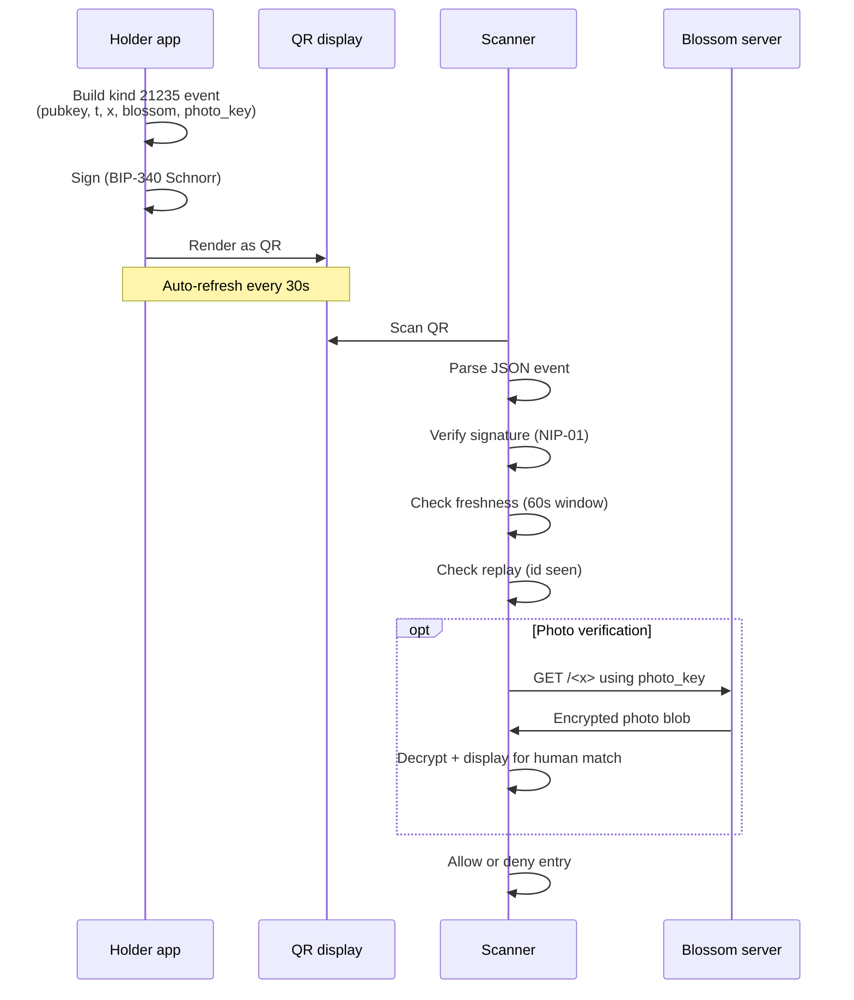

NIP-XX
======

Venue Entry QR
--------------

`draft` `optional`

This NIP defines an ephemeral, signed Nostr event used as a self-contained QR payload for physical venue access. A scanner verifies the holder's identity and freshness using only standard NIP-01 signature verification — no relay round-trip, no app-specific endpoint.

## Motivation

Physical venue gates (sports stadia, music events, age-restricted premises, member clubs) need a fast, offline-capable way to verify that:

1. The person at the gate controls a specific Nostr public key.
2. The proof is fresh (not a screenshot from yesterday).
3. Optionally, the person matches a photo associated with that key.

Existing options are inadequate:

- **Plain pubkey QR** — replayable indefinitely, no proof of liveness.
- **NIP-46 challenge/response** — requires network, requires the verifier to run a relay client, requires the holder's signer to be online.
- **NIP-98 HTTP auth** — designed for HTTP request authorisation, not a self-contained QR payload.

This NIP defines a standalone signed payload: the holder signs an ephemeral event with a short freshness window and renders it as a QR code. The scanner verifies signature + freshness offline. Optional tags carry a photo hash and a Blossom URL for visual verification.

### Why not NIP-46 (Remote Signing)?

NIP-46 requires both parties to be online and connected to a relay. Venue gates often run on patchy or no connectivity (turnstiles in metal sheds, basement venues). A signed QR works fully offline once produced.

### Why not NIP-98 (HTTP Auth)?

NIP-98 is scoped to HTTP request authorisation (`Authorization: Nostr` header). Venue entry has no HTTP request — the scanner is a camera. NIP-98 events also bind to a specific URL/method, which has no meaning at a physical gate.

### Why not just a plain pubkey QR?

A static QR can be photographed and replayed by anyone. The signed-and-timestamped event proves possession of the private key at a recent moment.

## Event Definition

### Kind

`21235` — ephemeral event (range 20000–29999, not stored by relays per NIP-01).

The event is rendered to a QR code by the holder's app. It is **not** typically published to a relay; the QR itself is the wire format. Relay-mediated transport is allowed but optional.

### Structure

```json
{
  "kind": 21235,
  "pubkey": "<holder's hex pubkey>",
  "created_at": <unix timestamp>,
  "tags": [
    ["t", "signet-venue-entry"],
    ["x", "<sha256 of photo, hex, optional>"],
    ["blossom", "<https URL of Blossom server hosting photo, optional>"],
    ["photo_key", "<base64 AES key for photo decryption, optional>"]
  ],
  "content": "",
  "id": "<event id>",
  "sig": "<schnorr signature>"
}
```

### Tag Reference

| Tag | Status | Format | Purpose |
|-----|--------|--------|---------|
| `t` | REQUIRED | string `signet-venue-entry` | Marker tag identifying the event purpose |
| `x` | OPTIONAL | 64 lowercase hex chars | SHA-256 hash of a photo of the holder, used for visual verification |
| `blossom` | OPTIONAL | https URL | Blossom server URL where the encrypted photo blob is hosted (only valid when `x` is present) |
| `photo_key` | OPTIONAL | base64 string | Decryption key for the Blossom-hosted encrypted photo (only valid when `blossom` is present) |

The `t` tag value `signet-venue-entry` is a fixed protocol constant. Future profiles MAY define alternative `t` values for different verification semantics (e.g. `age-only`, `member-only`).

### Freshness

The verifier MUST check that `now - created_at <= MAX_AGE_SECONDS` where `MAX_AGE_SECONDS` SHOULD be 60. The verifier MUST also check that `created_at <= now + MAX_CLOCK_SKEW_SECONDS` where `MAX_CLOCK_SKEW_SECONDS` SHOULD be 10 (to tolerate small clock differences).

Holder apps SHOULD refresh the displayed QR every 30 seconds.

### Replay protection

Within the freshness window, a verifier MUST track recently-accepted event IDs and reject duplicates. A simple in-memory `Set` with a TTL equal to `MAX_AGE_SECONDS + MAX_CLOCK_SKEW_SECONDS` is sufficient.

## Verification Flow



## Validation Rules

| ID | Rule |
|----|------|
| V-VE-01 | `kind` MUST equal `21235` |
| V-VE-02 | `pubkey` MUST be 64 lowercase hex chars |
| V-VE-03 | `tags` MUST contain a `["t", "signet-venue-entry"]` entry |
| V-VE-04 | `created_at` MUST be within `[now - 60, now + 10]` seconds |
| V-VE-05 | Signature MUST verify per NIP-01 (BIP-340 Schnorr over `id`) |
| V-VE-06 | If present, `x` MUST be 64 lowercase hex chars |
| V-VE-07 | If present, `blossom` MUST be a valid `https://` URL (or `http://localhost` / `http://127.0.0.1` for development) |
| V-VE-08 | If present, `photo_key` MUST be a valid base64 string |
| V-VE-09 | `blossom` MUST NOT appear without `x` |
| V-VE-10 | `photo_key` MUST NOT appear without `blossom` |
| V-VE-11 | The verifier MUST reject any `id` it has accepted within the past 70 seconds |

## Subscription Filters

Venue entry events are typically transported via QR, not relay. If an implementation chooses to relay events for testing or for a specific deployment, scanners MAY subscribe with:

```json
["REQ", "venue-entry-sub", {
  "kinds": [21235],
  "#t": ["signet-venue-entry"],
  "since": <now - 60>
}]
```

Relays are NOT REQUIRED to accept or persist kind 21235 events (it is in the ephemeral range per NIP-01).

## Security Considerations

- **Replay across venues**: An attacker who photographs a holder's QR within the 60-second window could attempt to use it at a different gate of the same venue. Operators with multiple gates SHOULD share a replay cache across gates and SHOULD pair entry with a visual photo check.
- **Photo verification trust**: The `x` photo hash and `photo_key` allow the verifier to fetch and display a photo for human visual matching. The protocol does not authenticate the photo itself — a holder could supply any photo they wish at upload time. Higher trust deployments SHOULD combine venue entry with NIP-CREDENTIALS (`draft`) for credential-bound identity assertions.
- **Clock skew abuse**: Setting `created_at` far in the future would extend the effective lifetime of a leaked QR. Verifiers MUST clamp future timestamps to `now + 10` and reject anything beyond.
- **Signature substitution**: Verifiers MUST verify the BIP-340 Schnorr signature against the event `id` per NIP-01. Trusting the `pubkey` field without signature verification allows full impersonation.
- **Blossom URL phishing**: A malicious holder could supply a `blossom` URL pointing to a server that returns a misleading photo. Verifier UIs SHOULD show the Blossom hostname so operators can detect unfamiliar hosts.

## Dependencies

- [NIP-01](https://github.com/nostr-protocol/nips/blob/master/01.md) — Basic protocol flow, event structure, BIP-340 Schnorr signatures.
- [BUD-01](https://github.com/hzrd149/blossom/blob/master/buds/01.md) (Blossom) — OPTIONAL, for hosting encrypted photo blobs.

## Test Vectors

### Minimal valid event (no photo)

```json
{
  "kind": 21235,
  "pubkey": "5d4f8c6b9e2a1f7d8c3b6a5e4d2c1b0a9f8e7d6c5b4a392817262514130201f0",
  "created_at": 1745000000,
  "tags": [["t", "signet-venue-entry"]],
  "content": "",
  "id": "<computed>",
  "sig": "<computed>"
}
```

### Full valid event (with photo)

```json
{
  "kind": 21235,
  "pubkey": "5d4f8c6b9e2a1f7d8c3b6a5e4d2c1b0a9f8e7d6c5b4a392817262514130201f0",
  "created_at": 1745000000,
  "tags": [
    ["t", "signet-venue-entry"],
    ["x", "abc123def456abc123def456abc123def456abc123def456abc123def4561234"],
    ["blossom", "https://blossom.example.com"],
    ["photo_key", "Zm9vYmFyYmF6cXV4MTIzNDU2Nzg5MGFiY2RlZmdoaWprbG1ub3A="]
  ],
  "content": "",
  "id": "<computed>",
  "sig": "<computed>"
}
```

### Invalid: missing `t` tag

```json
{
  "kind": 21235,
  "pubkey": "5d4f8c6b9e2a1f7d8c3b6a5e4d2c1b0a9f8e7d6c5b4a392817262514130201f0",
  "created_at": 1745000000,
  "tags": [],
  "content": "",
  "id": "<computed>",
  "sig": "<computed>"
}
```

Rejected per V-VE-03.

### Invalid: stale event

Any event with `created_at < now - 60` is rejected per V-VE-04.

### Invalid: `blossom` without `x`

```json
{
  "tags": [
    ["t", "signet-venue-entry"],
    ["blossom", "https://blossom.example.com"]
  ]
}
```

Rejected per V-VE-09.

## Reference Implementations

- Builder: `forgesworn/signet` — `src/venue-entry.ts`
- Verifier: `forgesworn/matchpass-app` — `server/venue-entry.js`
